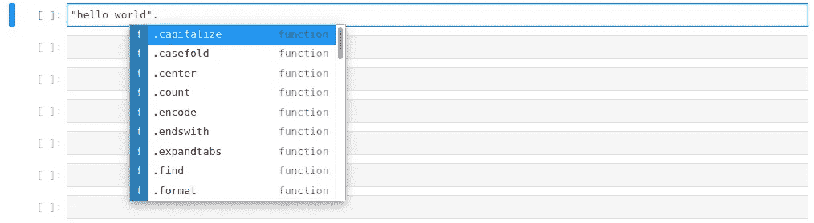

# 每天 10 分钟学习 Python # 5

> 原文：<https://towardsdatascience.com/learning-python-10-minutes-a-day-5-9e012c6920e0?source=collection_archive---------37----------------------->

[杰瑞米·拉帕克](https://unsplash.com/@jeremy_justin?utm_source=unsplash&utm_medium=referral&utm_content=creditCopyText)在 [Unsplash](/?utm_source=unsplash&utm_medium=referral&utm_content=creditCopyText) 上的原始照片。

## [每天 10 分钟 Python 速成班](https://towardsdatascience.com/tagged/10minutespython)

## 变量:使用字符串表示文本

这是一个[系列](https://python-10-minutes-a-day.rocks)10 分钟的简短 Python 文章，帮助您提高 Python 知识。我试着每天发一篇文章(没有承诺)，从最基础的开始，到更复杂的习惯用法。如果您想了解关于 Python 特定主题的问题或请求，请随时通过 LinkedIn[联系我。](https://www.linkedin.com/in/dennisbakhuis/)

在第一节课中，我们已经看到了内置的“ *print* ”功能，它可以将文本、数字，实际上是任何东西打印到屏幕上。要调用一个函数，我们需要输入它的名字(在这个例子中是 *print* )，后面跟着一组括号。在括号之间，传递函数的参数。内置函数不需要任何参数，可以使用:" *print()* "调用，将一个空行打印到屏幕上。我们给它传递了一个参数，那就是一个简短的句子“hello world”。这个参数是一个“ *str* 类型的对象，在 Python 中是一个字符串。使用“？”检查内置打印功能的文档字符串我们以前学过。

可以使用单引号、双引号或由三次引号符号表示的多行变体来分配字符串。我们在创建文档字符串时已经看到了最后一个方法:

变量名可以是任何东西，除了像“是”或“不是”这样的关键字。函数“print”不是这些关键字中的一个，而是一个标准函数，从技术上讲，您可以用一个新变量覆盖这个函数。Python 中的一切都由对象表示，变量只是一个标签。通过声明一个名为“print”的字符串，标签现在指向新创建的字符串，这在 Python 中完全有效。当然，这可能不是你想要的，所以要小心。选择名字时，尽量简短，所有小写字母和单词用下划线隔开。虽然这样定义变量不是强制性的，但这是一个标准，在著名的 [pep8](https://www.python.org/dev/peps/pep-0008) (Python 增强提案#8)中有记载。有许多 pep 文档，但 pep8 是一个帮助提高可读性的样式指南。这个文档太长了，很难记住，因此，有一些助手可以帮助你设计代码，比如[黑色](https://github.com/psf/black)或者[薄片 8](https://flake8.pycqa.org/en/latest/) ，但是我们将在稍后的阶段研究这些。由于这些自动格式化程序不能帮助您处理变量名，所以请尝试使用建议的约定。它将帮助你使你的代码可读。

来自[文档](https://docs.python.org/3/library/stdtypes.html#textseq):字符串是 Unicode 码位的不可变序列。这意味着一个字符串是一个字符序列，由于它是不可变的，赋值后不能改变。当我开始学习 Python 时，术语“不可变的”让我很困惑。为什么我们要有一个字符串，它在定义后不能改变。他们所说的不可变是指，如果我们在一个字符串上做一个操作，原来的字符串不会改变，但是会从结果中创建一个新的字符串。如果您将结果放入原始变量(具有相同的名称，即引用)，当变量指向您的新结果时，您将覆盖对旧对象的引用。如果原始对象没有被任何其他变量引用，Python 使用其垃圾收集器从内存中删除该字符串。

有相当多的操作可以在字符串上执行。最常见的操作之一是连接字符串，就像我们将两个数字相加一样(使用“+”运算符)。虽然不太常见，但您也可以使用' * '操作符将字符串相乘，以从原始字符串的倍数创建新字符串。我猜用途很具体。

因为它是一个字符序列，所以它有一个序列长度。为了得到长度，有内置的“len”函数。序列的另一个特性是我们可以非常容易地迭代字符。我们还没有讨论 for-loops，但是它的语法可读性很强，所以我很确定你会看到下一个例子。

Python 中的一切都是对象，因此每个对象都打包了相关的方法。str 类有很多方法可以选择，我一般都会忘记，不得不 Google。在 Jupyter 或 IPython 中，你可以用点号键入变量的名称，然后按<tab>获得建议。</tab>

制表符补全是每个人的朋友！

这些方法中的大多数都有不言自明的名称，如“lower”、“upper”和“isdigit”。其他人可能需要一些解释，我们可以随时查看 DocString。我经常使用的方法是。split()，。替换()和。加入()。当这些方法返回一个新的字符串时，你可以链接多个命令。所以做 *my_string.lower()是非常有效的。分裂()*和更长的链甚至是可能的。创建链时，请记住可读性。

另一种可能用于字符串(因为它们是序列)的技术是切片。虽然分割字符串可能有非常具体的用例，但过程与其他类似序列的数据类型是相同的。通过切片，您可以选择序列的 iᵗʰ元素，方法是在方括号中指明它的序号。Python 从零开始计数，所以第一个元素表示为“my_string[0]”。您也可以选择一个元素，从后面用负数计数。字符串的最后一个元素是“my_string[-1]”。如果您想选择多个字符，您可以使用一个由[start : end : step]构成的范围。在 Python 中，范围包括“开始”元素，但*不包括“结束”元素。步长表示您跳过了多少个字符。如果将步长设置为 1，则选择所有字符，如果步长为 2，则跳过第二个字符。没有必要提供全部(开始、结束、步骤)。如果没有提供步长，则使用默认值 1。只提供结尾，所以分号前没有值，意味着到结尾为止的所有内容(但不包括)。这里有几个例子:*

一个重要的主题是字符串的格式化，即创建在变量中显示动态内容的字符串。在过去的几年里，这样做的方式已经改变了几次。首先，有 percent 操作符，它起作用，但不是很好。后来。format()方法被添加到字符串中，以提供更大的灵活性。从 Python3.6 开始，f 字符串变得可用，这增加了更多的灵活性。f 字符串是一种特殊类型的字符串，由字符串前的“f”表示。在我看来，f 字符串也比。format()方法，因此，我建议尽可能使用 f 字符串。格式化选项不仅仅限于显示变量本身，还可以添加填充、数字精度、类型等等。这里有一个很棒的[小抄](https://myshell.co.uk/blog/2018/11/python-f-string-formatting-cheatsheet/)。

有许多关于字符串的细节，我的一般建议是当你需要它们的时候研究一下。随着时间的推移，你甚至可能记得一对夫妇；-).

## 今天的练习:

1.  在一个新的笔记本中，分配不同的字符串。
2.  使用方法更改下面的字符串:“我叫吉米，我 100 岁了”，以获得您的姓名和年龄。(提示:replace())
3.  从以下字符串中切分并组合出'我很快乐':
    *c，d = '我很悲伤'，'我希望我很快乐'*
4.  摆弄几根 f 弦，例如显示不同精度的数值，创建不带小数的百分比。

如有任何问题，欢迎通过 [LinkedIn](https://www.linkedin.com/in/dennisbakhuis/) 联系我。

下一期(#6)将于周一发布。