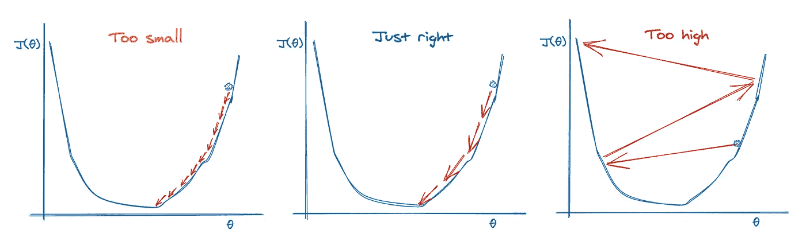
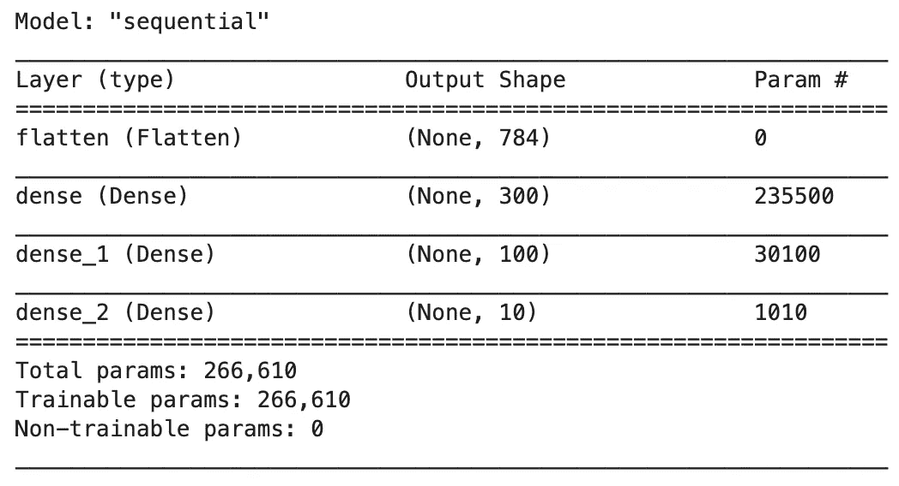
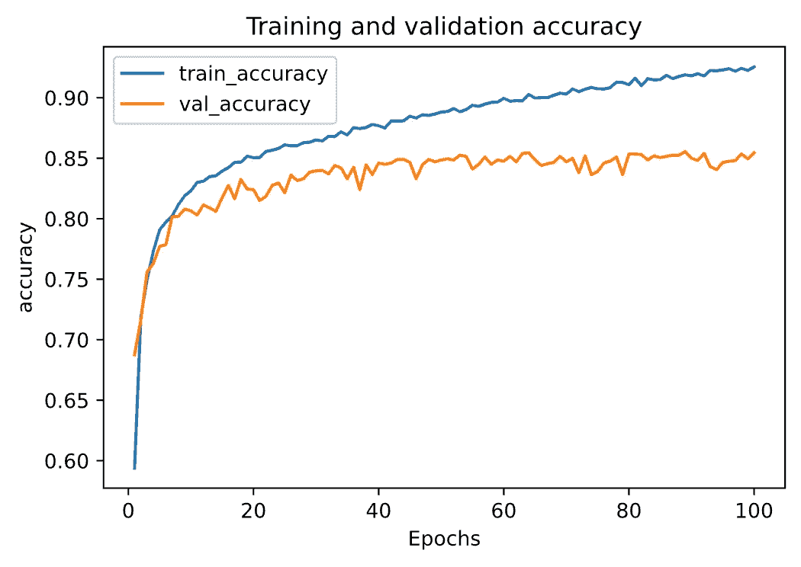
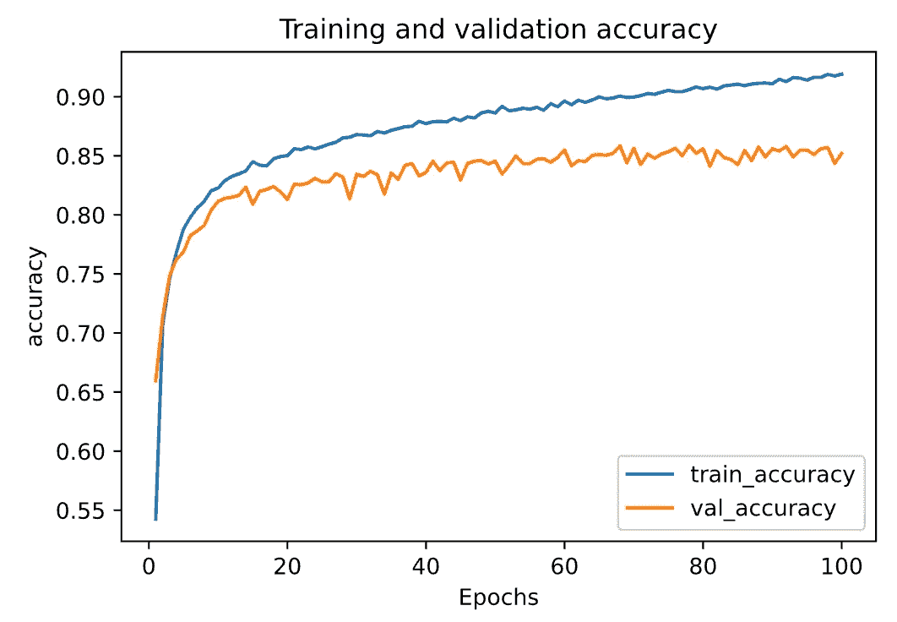
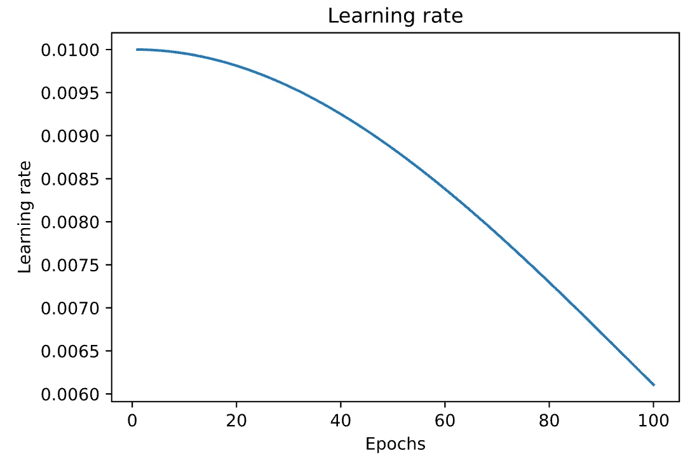
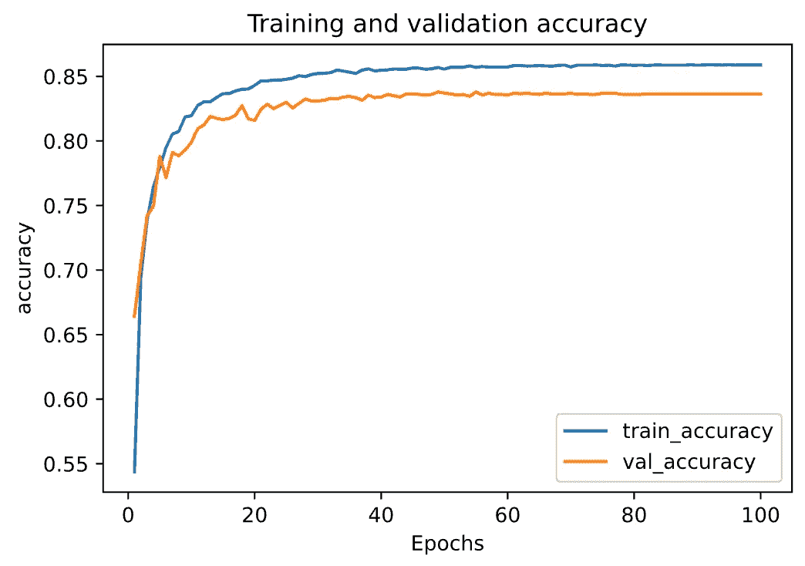
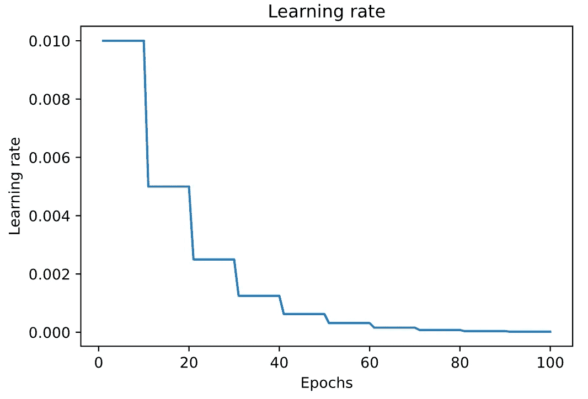
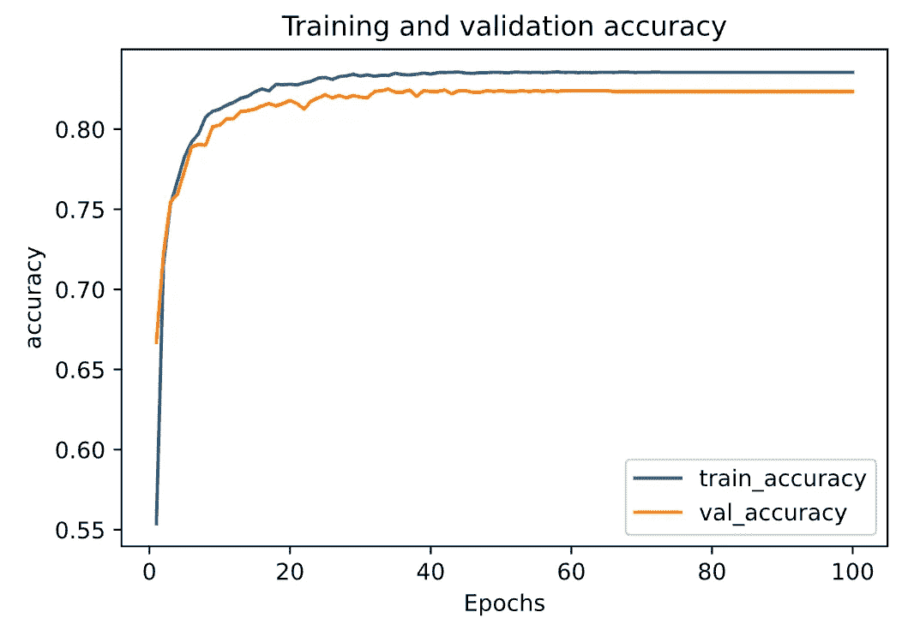
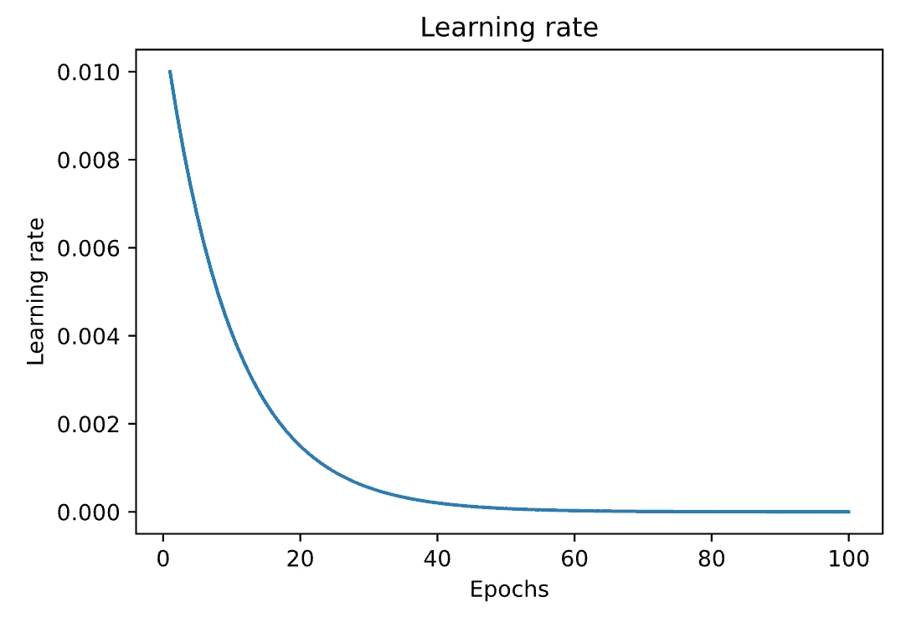
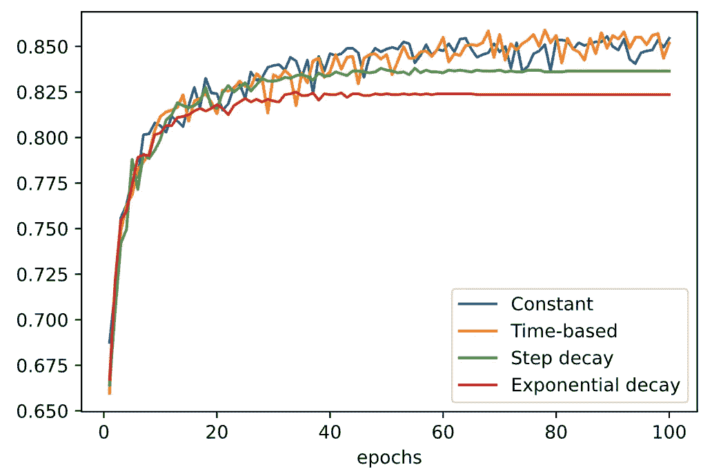

# 实践中的学习率计划:以 Keras 和 TensorFlow 2.0 为例

> 原文：<https://towardsdatascience.com/learning-rate-schedule-in-practice-an-example-with-keras-and-tensorflow-2-0-2f48b2888a0c?source=collection_archive---------7----------------------->

## 添加和定制**学习率计划**的教程


由[卢卡·坎皮奥尼](https://unsplash.com/@nexgenfx?utm_source=unsplash&utm_medium=referral&utm_content=creditCopyText)在 [Unsplash](https://unsplash.com/s/photos/speed?utm_source=unsplash&utm_medium=referral&utm_content=creditCopyText) 上拍摄

训练神经网络的一个令人痛苦的事情是我们必须处理的超参数的绝对数量。例如

*   学习率
*   Adam 优化算法的动量或超参数
*   层数
*   隐藏单元的数量
*   小批量
*   激活功能
*   等等

其中，最重要的参数是学习率。如果你的学习率设置得很低，训练将会进展得很慢，因为你对你的网络中的权重做了非常微小的更新。然而，如果你的学习率设置得太高，它会在你的损失函数中引起不希望的发散行为。



作者使用[https://excalidraw.com/](https://excalidraw.com/)创建的图像

在训练神经网络时，随着训练的进行降低学习速率通常是有用的。这可以通过使用**学习速率表**或**自适应学习速率**来完成。在本文中，我们将重点关注在我们的机器学习模型中添加和定制**学习率计划**,并查看我们如何在 Keras 和 TensorFlow 2.0 中实践它们的示例

# 学习费率表

**学习率时间表**根据预定义的时间表，通过降低学习率来调整训练期间的学习率。流行的学习率计划包括

1.  恒定学习速率
2.  基于时间的衰减
3.  阶跃衰减
4.  指数衰减

出于演示目的，我们将构建一个图像分类器来处理时尚 MNIST，这是一个具有 10 个类的 70，000 个 28×28 像素的灰度图像的数据集。

请查看[我的 Github repo](https://github.com/BindiChen/machine-learning/blob/master/tensorflow2/006-learning-rate-schedules/learning-rate-schedules.ipynb) 获取源代码。

## 使用 Keras 加载数据集

Keras 提供了一些实用函数来获取和加载公共数据集，包括时尚 MNIST。让我们装载时尚 MNIST

```
fashion_mnist = keras.datasets.fashion_mnist
**(X_train_full, y_train_full), (X_test, y_test) = fashion_mnist.load_data()**
```

数据集已经分为训练集和测试集。以下是定型集的形状和数据类型:

```
>>> X_train_full.shape
**(60000, 28, 28)**
>>> X_train_full.dtype
**dtype('uint8')**
```

我们将使用梯度下降来训练神经网络，我们必须将输入特征缩小到 0-1 范围。为了在本地机器上进行更快的训练，我们只使用前 10，000 幅图像。

```
X_train, y_train = **X_train_full[:10000]/255.0**, **y_train_full[:10000]**
```

## 创建模型

现在让我们建立神经网络！用 Keras 和 TensorFlow 2.0 创建机器学习模型有 [3 种方法。由于我们正在构建一个简单的全连接神经网络，为了简单起见，让我们使用最简单的方法:带有`Sequential()`的顺序模型。](/3-ways-to-create-a-machine-learning-model-with-keras-and-tensorflow-2-0-de09323af4d3)

```
from tensorflow.keras.models import Sequential
from tensorflow.keras.layers import Dense, Flattendef create_model(): 
    model = Sequential([
        Flatten(**input_shape=(28, 28)**),
        Dense(300, activation='relu'),
        Dense(100, activation='relu'),
        Dense(**10, activation='softmax'**),
    ])
    return model
```

我们的型号有以下规格:

*   第一层(也称为输入层)有`input_shape`来设置匹配训练数据的输入大小`(28, 28)`。输入层是一个`Flatten`层，它的作用只是将每个输入图像转换成一个 1D 数组。
*   然后是 2 个`Dense`层，一个 300 单位，另一个 100 单位。两者都使用`relu`激活功能。
*   输出`Dense`层有`10`单元和`softmax`激活功能。

```
model = create_model()
model.summary()
```



# 1.恒定学习速率

恒定的学习速率是所有 Keras 优化器的默认时间表。例如，在 [SGD 优化器](https://keras.io/api/optimizers/sgd/)中，学习率默认为`0.01`。

要使用定制的学习率，只需实例化一个 SGD 优化器并传递参数`learning_rate=0.01`。

```
sgd = tf.keras.optimizers.SGD(**learning_rate=0.01**)model.compile(
    **optimizer=sgd,** 
    loss='sparse_categorical_crossentropy', 
    metrics=['accuracy']
)
```

并使模型符合训练数据:

```
history_constant = model.fit(
    X_train, 
    y_train, 
    epochs=100, 
    validation_split=0.2,
    batch_size=64
)
```

让我们画出模型的准确性，这可以作为我们实验其他学习率计划的基线。



恒定学习率——准确度图

# 2.基于时间的衰减

基于时间的衰减是最流行的学习速率计划之一。形式上，基于时间的衰减定义为:

```
learning_rate = lr * 1 / (1 + decay * epoch)
```

其中`lr`是以前的学习率，`decay`是超参数，`epoch`是迭代次数。当`decay`为零时，这对改变学习率没有影响。当`decay`被指定时，它将按照给定的固定量减少前一时期的学习率。`decay`的值通常实现为

```
decay = initial_learning_rate / num_of_epoches 
```

在 Keras 中，实现基于时间的衰减的一种方式是通过定义基于时间的衰减函数`**lr_time_based_decay()**` 并将其传递给`LearningRateScheduler`回调。

```
initial_learning_rate = 0.01
epochs = 100
decay = initial_learning_rate / epochs**def lr_time_based_decay(epoch, lr):
    return lr * 1 / (1 + decay * epoch)**history_time_based_decay = model.fit(
    X_train, 
    y_train, 
    epochs=100, 
    validation_split=0.2,
    batch_size=64,
    **callbacks=[LearningRateScheduler(lr_time_based_decay, verbose=1)],**
)
```

下面是准确率和学习率的曲线图。



基于时间的衰减——精度图



基于时间的衰减—学习率图

# 3.阶跃衰减

另一种流行的学习率计划是在训练期间的特定时间系统地降低学习率。在形式上，它被定义为:

```
learning_rate = initial_lr * drop_rate^floor(epoch / epochs_drop)
```

其中`initial_lr`是初始学习率，例如 0.01，`drop_rate`是每次改变学习率时修改的量，`epoch`是当前的历元数，`epochs_drop`是改变学习率的频率，例如 10 个历元。类似地，我们可以通过定义一个阶跃衰减函数`**lr_step_decay()**`并将其传递给`LearningRateScheduler`回调函数来实现这一点。

```
initial_learning_rate = 0.01**def lr_step_decay(epoch, lr):
    drop_rate = 0.5
    epochs_drop = 10.0
    return initial_learning_rate * math.pow(drop_rate, math.floor(epoch/epochs_drop))**# Fit the model to the training data
history_step_decay = model.fit(
    X_train, 
    y_train, 
    epochs=100, 
    validation_split=0.2,
    batch_size=64,
    **callbacks=[LearningRateScheduler(lr_step_decay, verbose=1)],**
)
```

下面是准确率和学习率的曲线图。



基于步进的衰减——精度图



基于步长的衰减—学习速率

# 4.指数衰减

另一种流行的学习率计划是以指数速度降低学习率。在形式上，它被定义为:

```
learning_rate = initial_lr * e^(−k * epoch)
```

其中`initial_lr`是初始学习率，例如 0.01，`k`是超参数，`epoch`是当前纪元编号。类似地，我们可以通过定义一个指数衰减函数`**lr_exp_decay()**`并将其传递给`LearningRateScheduler`回调函数来实现这一点。

```
initial_learning_rate = 0.01**def lr_exp_decay(epoch, lr):
    k = 0.1
    return initial_learning_rate * math.exp(-k*epoch)**# Fit the model to the training data
history_exp_decay = model.fit(
    X_train, 
    y_train, 
    epochs=100, 
    validation_split=0.2,
    batch_size=64,
    **callbacks=[LearningRateScheduler(lr_exp_decay, verbose=1)],**
)
```



指数衰减—精度图



指数衰减——学习率图

# 比较模型准确性

最后，让我们使用不同的学习率时间表来比较模型的准确性。



看起来**常数**和**基于时间的**学习率比**阶跃衰减**和**指数衰减**对于这个特定的教程有更好的性能。请记住，本教程仅使用前 10，000 幅图像，其中的`initial_learning_rate=0.01`、`validation_split=0.2`和`batch_size=64`具有任意值。

在现实世界的应用程序中，为了调整学习速率，需要考虑更多的因素。请查看“深度架构基于梯度的培训实用建议”一文，了解一些最佳实践。

# 好了

感谢阅读。这篇文章涵盖了最流行的**学习进度计划**。下次我们就来看看**自适应学习率**。

源代码请查看我的 Github 上的[笔记本。](https://github.com/BindiChen/machine-learning/blob/master/tensorflow2/006-learning-rate-schedules/learning-rate-schedules.ipynb)

如果你对机器学习的实用方面感兴趣，请继续关注。

## 您可能对我的其他 TensorFlow 文章感兴趣:

*   [谷歌机器学习实践的 7 个步骤:结构化数据的 TensorFlow 示例](/the-googles-7-steps-of-machine-learning-in-practice-a-tensorflow-example-for-structured-data-96ccbb707d77)
*   [用 Keras 和 TensorFlow 2.0 创建机器学习模型的 3 种方法](/3-ways-to-create-a-machine-learning-model-with-keras-and-tensorflow-2-0-de09323af4d3)
*   [批量规范化实践:以 Keras 和 TensorFlow 2.0 为例](/batch-normalization-in-practice-an-example-with-keras-and-tensorflow-2-0-b1ec28bde96f)
*   [实践中的提前停止:以 Keras 和 TensorFlow 为例](/a-practical-introduction-to-early-stopping-in-machine-learning-550ac88bc8fd)