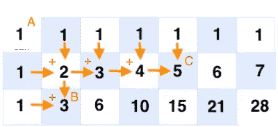
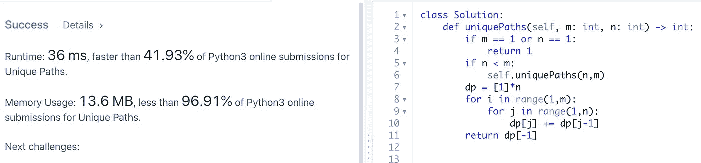
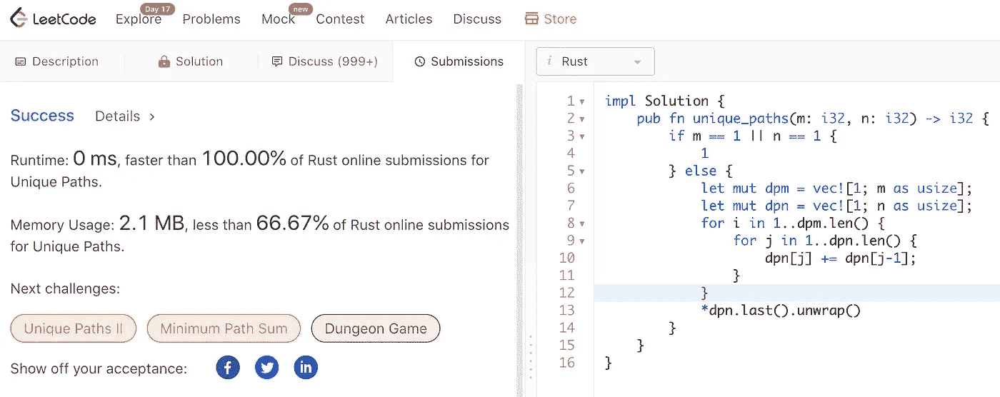

# 通过将 Python 转换成 Rust 来学习 Rust

> 原文：<https://towardsdatascience.com/learning-rust-by-converting-python-to-rust-259e735591c6?source=collection_archive---------10----------------------->

## Rust 基础入门教程


[乐旅行车](https://unsplash.com/@lewagon?utm_source=medium&utm_medium=referral)在 [Unsplash](https://unsplash.com?utm_source=medium&utm_medium=referral) 上拍照

[更新于 2021 年 2 月 18 日。代码更改为要点并添加了链接]

```
**Table of Contents**[**Introduction**](#3cb0)🦀 [Leetcode Unique Paths](#d2b3)
🦀 [Python Code](#2aa3)
🦀 [First Step in Rust](#f513)
🦀 [Examples of Primitive Data Types:](#5358)
🦀 [Functions](#3775)
🦀 [Statements and Expressions](#edb9)
🦀 [Variables](#0f1c)
🦀 [Macros](#dc94)
🦀 [if-else Statement (Step 2)](#5346)
🦀 [Calling a Function](#f27b)
🦀 [Range](#5d38)
🦀 [Arrays, Tuples, and Vectors](#52ef)
🦀 [as Keyword](#6263)
🦀 [Final Code](#4543)
🦀 [Struct and Impl](#27aa)
🦀 [Trait](#2c53)
🦀 [Runtime & Memory Usage](#7e45)[**Conclusion**](#d7d1)
```

# 介绍

Rust 是一种静态和强类型的系统编程语言。Rust 是为渴望语言速度和稳定性的人准备的。

我认为自己是一个新手。写完[这篇文章](/you-want-to-learn-rust-but-you-dont-know-where-to-start-fc826402d5ba)后，我开始学习 Rust，并且我每天都在学习新的东西。我现在可以将简单的 Python 代码转换成 Rust，并且能够解释我正在编写的代码。

在本文中，我们将使用一个 Leetcode 问题的 Python 解决方案，并将其转换为 Rust 代码。你不仅会发现两种语言之间的相似之处，还会学到 Rust 编程。

您可以运行代码，也可以在本文的示例中对其进行调整。

[](/you-want-to-learn-rust-but-you-dont-know-where-to-start-fc826402d5ba) [## 你想学 Rust 但是不知道从哪里开始

### Rust 初学者的完整资源

towardsdatascience.com](/you-want-to-learn-rust-but-you-dont-know-where-to-start-fc826402d5ba) 

# Leetcode 唯一路径

LeetCode 是一个非常受欢迎的网站，在那里你可以提高你的编码技能。其中一个问题叫做[“唯一路径”](https://leetcode.com/problems/unique-paths/)，机器人位于一个 ***m* x *n* 网格**的左上角。您只能将**向下**或**向右**移动，并且您需要找出两点之间有多少条唯一的路径。


图片来自 LeetCode

例如，在下图中，从 A 点到 B 点有 3 条唯一路径，从 A 点到 C 点有 5 条唯一路径。下图帮助您找到从 A 到每个区域的唯一路径的数量。由于您只需将**向下移动**或**向右移动**，您可以将上面和左边的数字相加，找到到达该点的唯一路径的数量。



作者图片

# Python 代码

用 Python 解决这个问题肯定有很多方法，但是我们打算用下面的[解决方案](https://tech.io/snippet/qpOVDt4)。

使用 Python 的解决方案。在线尝试这段 Python 代码。



LeetCode 上 Python 代码的结果。

在这段 Python 代码中:

*   我们创建了一个名为 Solution 的类。我们定义了一个叫做“唯一路径”的方法。(是起始码。)
*   它将 self、integer `m`和 integer `n`作为参数，并返回一个整数。它使用[类型注释](https://docs.python.org/3/library/typing.html)。
*   如果`m`或`n`等于 1，那么它返回 1。
*   如果`n`小于`m`，则它会切换位置并运行相同的方法。
*   `dp = [1]*n`将创建一个`n`编号为 1 的列表。例如`[1]*3`将创建`[1,1,1]`。
*   我们使用双 for 循环和 range 将前一个数字添加到下一个项目中。`[1,2,3]`、`[1,3,6]`等。您可以通过将返回值更改为`return dp`来检查这一点。
*   我们使用`[-1]`返回列表中的最后一个数字。

在本文中，我们将逐步将 Python 代码转换为 Rust。

上面的结果显示运行时间为 36 ms，内存使用量为 13.6 MB。我们稍后会将这个结果与 Rust 结果进行比较。

(当我再次提交给 LeetCode 时，结果发生了变化，上面的那个是最好的。你可能会有不同的结果。)

# 生锈的第一步

我们将从一个[基本锈码](https://tech.io/snippet/MbIqTol)开始。

生锈的第一步。[试试这个锈郎在线。](https://tech.io/snippet/MbIqTol)

Rust 总是在你运行程序的时候先运行`**main**`功能。我们创建一个名为`unique_paths`的函数，带有两个参数`m`和`n`，它们是`**i32**`类型。

在函数中，我们必须声明每个参数的类型。Rust 程序中的每个变量、项目和值都有一个类型。

值的类型[定义了](https://doc.rust-lang.org/book/ch04-01-what-is-ownership.html?highlight=heap#the-stack-and-the-heap)保存它的内存的解释。`**i32**`是[原语数据类型](https://learning-rust.github.io/docs/a8.primitive_data_types.html)之一，是一种 32 位固定大小的[有符号整数类型](https://learning-rust.github.io/docs/a8.primitive_data_types.html#i8-i16-i32-i64-i128)。`**i32**`可以容纳-(2)和 2 -1 之间的数字，前者为-2147483648，后者为 2147483647。

# 原始数据类型的示例:

[在线尝试这个原始数据类型示例](https://tech.io/snippet/uwnXAR8)。

更多的原始数据类型在这个[链接](https://www.codingame.com/playgrounds/365/getting-started-with-rust/primitive-data-types)中。

顺便说一下，Rust 的默认整数类型是`**i32**`，所以如果你没有在一个 [**闭包**](https://doc.rust-lang.org/book/ch13-01-closures.html?highlight=annotate,a,type#closure-type-inference-and-annotation) 中标注参数的类型，并且如果它们是整数，Rust 将使用`**i32**`。Rust 的编译器能够推断出参数和大多数变量的类型。

# 功能

[**功能**](https://doc.rust-lang.org/book/ch03-03-how-functions-work.html) 使用`**fn**`关键字启动。Rust code 使用蛇形外壳作为功能的[传统样式](https://doc.rust-lang.org/1.0.0/style/style/naming/README.html)。函数可以返回值，我们使用箭头`**->**`为返回值声明它们的类型。unique_paths 返回数据类型`**i32**`。Rust 使用`{}`作为函数体。

[网上试试这个锈郎代码。](https://tech.io/snippet/quWpWFg)返回字符串的函数示例。

# 陈述和表达

我们返回总和，`m + n`。函数体由一系列语句组成，并以表达式结尾。

> 语句*是执行一些动作并且不返回值的指令。*表达式*计算出结果值。—* [*函数体包含语句和表达式*](https://doc.rust-lang.org/book/ch03-03-how-functions-work.html?highlight=expression,and,statement#function-bodies-contain-statements-and-expressions)

表达式`m + n`不包括结束分号，因为我们想返回它。如果你在一个表达式的末尾加一个分号，你就把它变成了一个语句，它不会返回值。

# 变量

在`**main()**`函数中，我们用一个[关键字](https://doc.rust-lang.org/reference/keywords.html)来表示一个变量。默认情况下，局部变量是不可变的，但是您可以使用`**mut**`使它们可变。对于我们的例子，我们不需要使它可变。

试试[锈变量示例](https://tech.io/snippet/ZWuAnj1)在线。

# 宏指令

`**println!()**` 是[标准宏](https://learning-rust.github.io/docs/d7.std_primitives_and_preludes.html#Standard-Macros)之一。它解析格式字符串并将其转换为打印格式。

`pritln!`按顺序填充占位符。可以用索引和`name="vale"`。

试试 [println！宏](https://tech.io/snippet/VKciz0J)在线。

# if-else 语句(步骤 2)

下一步，我们添加一个`**if-else**`语句。`**expr == expr**`(其中`expr`表示表达式)是相等比较。`**expr || expr**`是逻辑**还是**。

如果`m`或`n`中的任何一个等于 1，那么我们返回 1。请注意 1 后面没有分号，因为我们要返回 1。

Rust 对于`**if**`语句中的条件不使用括号。

在线使用 if 语句尝试 Rust 中的[步骤 2。](https://tech.io/snippet/XZMM4jx)

`**if-else if-else**`有如下形式。

在线尝试 [if-else if-else 示例](https://tech.io/snippet/EI8viV3)。

# 调用函数

在线尝试 Rust 中的[步骤 3。](https://tech.io/snippet/ctjMBxw)

这可能不是传递 LeetCode 所必需的，但是这向您展示了如何从内部调用自己的函数。

如果`**n**`小于`**m**`，我们交换变量位置，调用自己的函数。

# 范围

在 Python 中，我们使用`range`作为:

```
for i in range(1,m):
    for j in range(1,n):
```

在 Rust 中，我们使用`..`或`..=`。

尝试[范围..在锈](https://tech.io/snippet/yE8eJCK)线上。

上面的代码将输出 1 到 9。

尝试[范围..= in Rust](https://tech.io/snippet/6cKeArR) online。

上面的代码将输出 1 到 10。

# 数组、元组和向量

在 Python 中我们使用了`dp = [1]*n`。这将创建[1]的`n`个数字。例如当 n=3 时，`[1, 1, 1]`。

让我们看看 Rust 中的数组、元组或向量中哪一个可以用于此目的。

**阵列**

[数组](https://doc.rust-lang.org/book/ch03-02-data-types.html#the-array-type)必须有**同类型定长**。默认情况下，数组是不可变的，我们不能用`**mut**` 来改变它的元素。

在线试用[锈阵](https://tech.io/snippet/2iUgNLo)。

输出:

```
one: 1, b: [4, 5, 6], c: [1, 1, 1, 1, 1], d: [1, 1, 1, 1, 1]
```

我们也**不能**动态设置数组长度。因为数组的长度*是在编译时*定义的。变量在编译时是未知的，因为它可以*改变*。编译器不知道在堆栈上分配多少空间来为数组提供存储。

如果你试图在没有`[{:?}](https://doc.rust-lang.org/std/fmt/index.html)`的情况下打印，你将会失败。我们不能用默认格式化程序格式化数组。所有 Rust 数据类型都实现了`Debug`特征，您可以使用`{:?}`来格式化它并打印一个数组。

所以我们不能在这里使用数组。

**元组**

[元组](https://doc.rust-lang.org/book/ch03-02-data-types.html#the-tuple-type)可以有**不同的类型，并且有固定的长度**。

```
let tup: (i32, f64, u8) = (100, 2.32, 4);
```

为了从元组中获取单个值，我们可以使用模式匹配来析构元组值。

在线试试[锈元组](https://tech.io/snippet/3bfkQfa)。

输出:

```
x = 500, y = 6.2, z = 4
1
```

同样，我们不能使用元组，因为它们必须有固定的长度**。**

****矢量****

**Rust [向量](https://doc.rust-lang.org/std/vec/struct.Vec.html)在内存中存储多个相邻的值。向量存储相同类型的值。**

> **具有堆分配内容的连续可增长数组类型。——[doc.rust-lang.org](https://doc.rust-lang.org/std/vec/index.html)**

**`vec!`宏创建一个新的向量，保存您给它的值。**

```
let v = vec![1, 1, 1];
// this is the same as above
let u = vec![1; 3];
```

**一个向量就像一个可调整大小的数组，但是所有的元素必须是同一类型。**

**所以我们需要使用一个[向量](https://doc.rust-lang.org/std/vec/struct.Vec.html)。**

```
dpm = vec![1; m as usize];
dpn = vec![1; n as usize];
```

# **作为关键字**

**第二个数字，长度，在`vec![1; 3]`中需要是`[**usize**](https://doc.rust-lang.org/std/primitive.usize.html)`类型。我们将`**m**`和`**n**`标注为`**i32**` ，但是我们可以使用`**as**`关键字来转换类型。我们可以只使用`as`表达式在原始类型之间转换。**

> **最常用于将基元类型转换为其他基元类型。——[鲁斯特郎博士](https://doc.rust-lang.org/std/keyword.as.html)**

**`**vectors**`有一个方法`[**len**](https://doc.rust-lang.org/std/vec/struct.Vec.html#method.len)`返回向量中元素的数量。**

# **最终代码**

**我们使用上述所有代码来获得唯一路径的数量。**

**在线尝试[Rust](https://tech.io/snippet/qyCu9nb)的最后一步。**

**你可能注意到了`#[allow(unused_variables)]`。没有它也能工作，但是编译器会给你一个警告:**

```
warning: unused variable: `i`
  --> main.rs" data-line="11" data-column="13">main.rs:11:13
   |
11 |         for i in 1..dpm.len() {
   |             ^ help: if this is intentional, prefix it with an underscore: `_i`
   |
   = note: `#[warn(unused_variables)]` on by default

warning: 1 warning emitted
```

**为了消除这个警告，我们添加了`#[allow(unused_variables)]`。**

**稍后我们将看到 LeetCode 的最终代码。在此之前，我们对这段代码进行了更深入的研究。**

# **结构和实现**

**我们将对上述解决方案应用`struct`、`impl`和`trait`。请注意，这在 LeetCode 上不起作用。**

**结构用于**将相关属性**封装成一个统一的数据类型。结构不同于其他语言中的类。例如，Rust 的 struct 不支持继承。**

**元组很方便，但是使用像`t.0`这样的索引并跟踪每个部分的含义并不简单。**

**Rust *结构*包含命名字段。我们使用关键字`struct`并在花括号内设置字段类型。结构将数据定义为键值对。**

```
struct Name_of_struct {
   field1:data_type,
   field2:data_type,
   ...
}
```

**在线试试[的防锈结构](https://tech.io/snippet/laOPbRf)。**

****&字符串和字符串****

**你可能想知道为什么我们需要`to_string()`。Rust 主要有两种类型的弦:`[&str](https://doc.rust-lang.org/std/primitive.str.html)`和`[String](https://doc.rust-lang.org/book/ch08-02-strings.html#what-is-a-string)`。`&str`叫做‘串片’。字符串切片具有固定的大小，不能变异。一个`String`被存储为一个矢量。`String`是堆分配的，可增长的，并且不是空终止的。(更多信息请点击[链接](https://medium.com/series/learning-rust-all-about-strings-c7666812d893)。)**

**`"John"`是一个`&str`，由于我们在`struct`中将`first_name`的类型定义为字符串，我们需要使用`[to_string](https://doc.rust-lang.org/std/string/trait.ToString.html)`将其转换为字符串。**

**我们将**关联函数**放入`impl`块中。**

**在线试用 [Rust impl](https://tech.io/snippet/qATByFz) 。**

****方法参数 self、& self 和& mut self****

**我们在`impl Person`中增加了一个[方法](https://doc.rust-lang.org/book/ch05-03-method-syntax.html#method-syntax) `full_name`。该函数将`&self`作为第一个参数。它可以采用`self`、`&self`或`&mut self`中的一种。**

*   **当我们想要读取结构中的数据，而不是写入数据时，我们使用`&self`。**
*   **当我们希望方法获得所有权时，我们使用`self`。**
*   **当我们想让方法写入时，我们使用`&mut self`。**

**我们在`p.full_name()`中的实例方法中使用点运算符来访问该字段。**

**让我们将`struct`和`impl`用于我们的代码:**

**使用 struct 和 impl 在线尝试[。](https://tech.io/snippet/tmTVm01)**

# **特点**

**[**特性**](https://blog.rust-lang.org/2015/05/11/traits.html) 类似于 OOP 语言中的和**接口**。它们用于定义一个类型必须提供的功能。**

**尝试使用 trait 在线编写代码。**

**我们用函数`unique_paths`添加了一个名为 UiquePaths 的特征。我们需要使用`impl trait-name for struct-name`更新`impl`。**

**我们使用`::`符号在`main`函数中实例化它。**

**现在我们实现了`struct`、`impl`和`trait`。**

# **运行时和内存使用**

**以下解决方案针对 LeetCode 环境进行了调整。**

```
impl Solution {
    pub fn unique_paths(m: i32, n: i32) -> i32 {
        if m == 1 || n == 1 {
            1
        } else {
            let mut dpm = vec![1; m as usize];
            let mut dpn = vec![1; n as usize];
            for i in 1..dpm.len() {
                for j in 1..dpn.len() {
                    dpn[j] += dpn[j-1];
                }
            }
            *dpn.last().unwrap()
        }   
    }
}
```

****

**铁锈的 LeetCode 结果**

**请注意运行时间 0 毫秒。Rust 没有运行时间。Rust 适用于**零** - **成本抽象。你不必为某些强大的抽象或安全特性付出额外的运行时开销，而在其他语言中你必须为此付出运行时成本。****

> **…迭代器虽然是一种高级抽象，但会被编译成大致相同的代码，就好像您自己编写了低级代码一样。迭代器是 Rust 的*零成本抽象*之一，我们的意思是使用抽象不会带来额外的运行时开销。— [Rust 编程语言](https://doc.rust-lang.org/book/ch13-04-performance.html?highlight=zero-cost,abstractions#comparing-performance-loops-vs-iterators)**

**Rust 的内存使用量为 2.1 MB，而 Python 的内存使用量为 13.8 MB。**

**Rust 有独特的管理堆内存的方式，它使用一个叫做所有权的概念来管理它。我建议您深入阅读 [Rust 文档](https://doc.rust-lang.org/book/title-page.html)以了解更多信息。**

# **结论**

**我们接触了原始数据类型、类型注释、函数、语句、表达式、变量、宏、if 语句、范围、数组、元组、向量、`struct`、`impl`和`trait`的表面。你可以在官方书籍中找到更多信息。**

**正如我之前所说，我仍然在学习生锈。我感谢专家对如何改进解决方案的反馈。**

**我希望你学到了一些东西，并为下一步做好了准备。有许多关键概念我们无法在本文中涵盖。请继续关注下一篇文章。**

****通过** [**成为**](https://blog.codewithshin.com/membership) **的会员，可以完全访问媒体上的每一个故事。****

****

**[https://blog.codewithshin.com/subscribe](https://blog.codewithshin.com/subscribe)**

**[](/unsinged-signed-integers-and-casting-in-rust-9a847bfc398f) [## 无符号、有符号整数和 Rust 中的造型

### 理解符号和幅度、一的补码和二的补码

towardsdatascience.com](/unsinged-signed-integers-and-casting-in-rust-9a847bfc398f) [](https://medium.com/series/101-rust-tips-8f361510683c) [## 学习生锈:常见概念

### 查看更多关于 Rust String 的信息。

medium.com](https://medium.com/series/101-rust-tips-8f361510683c) [](https://medium.com/series/learning-rust-all-about-strings-c7666812d893) [## 学习生锈:所有关于字符串

### 字符串和&str

medium.com](https://medium.com/series/learning-rust-all-about-strings-c7666812d893)**