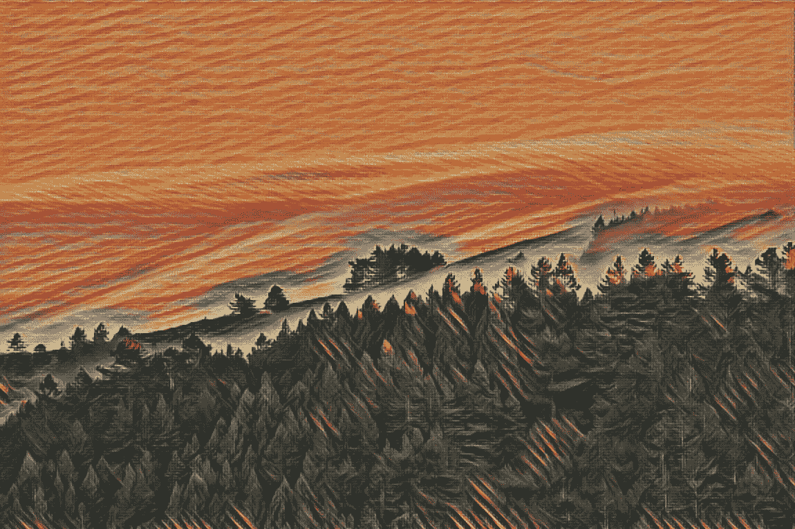
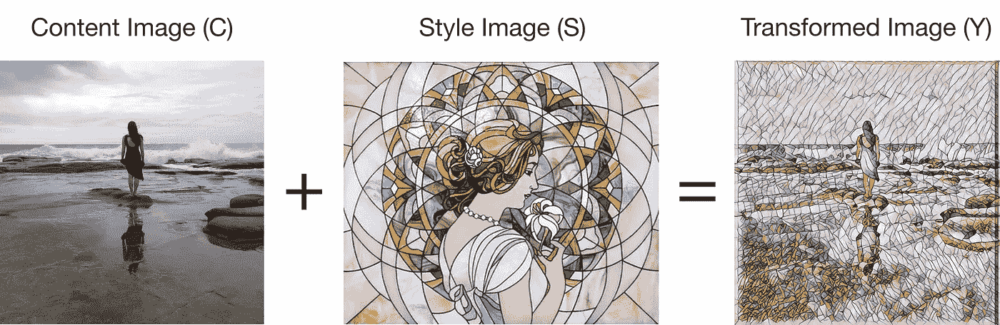
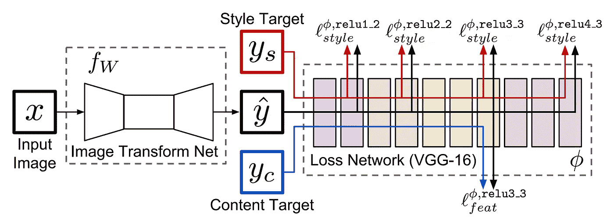
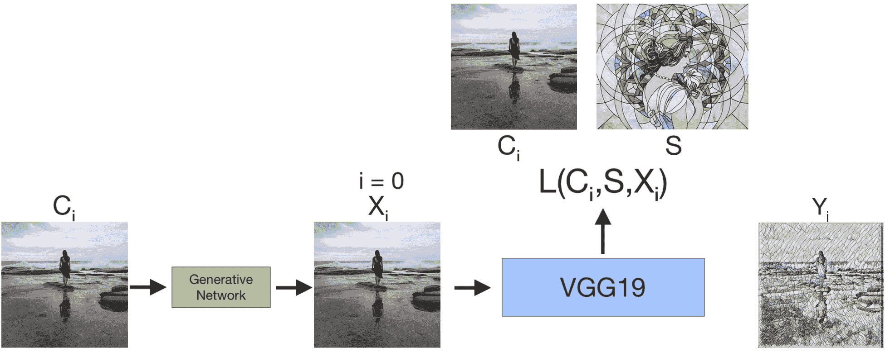
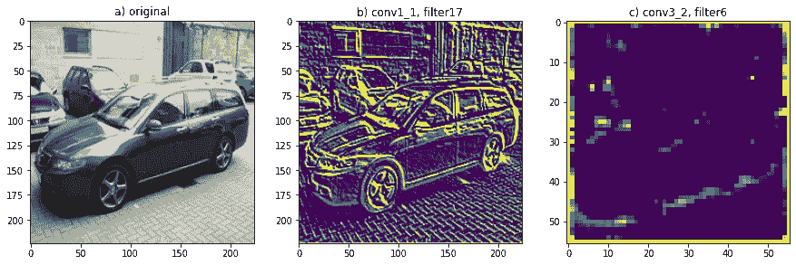
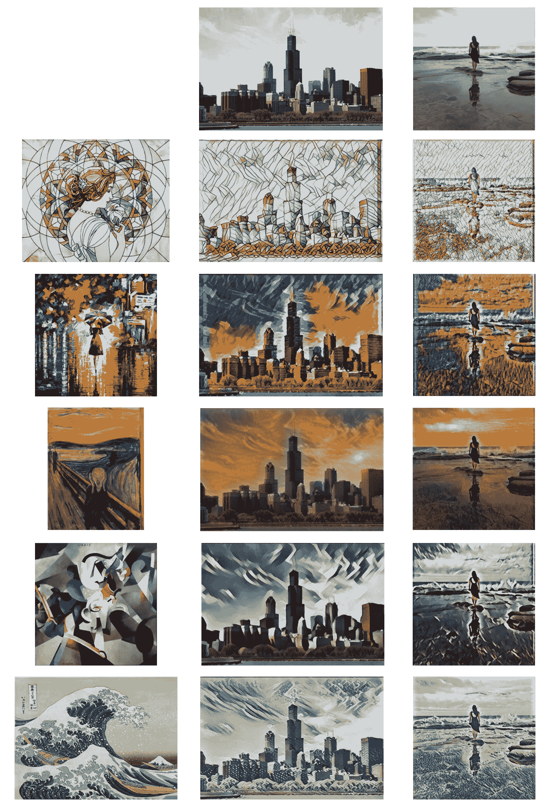

# 有风格地学习 TensorFlow 2

> 原文：<https://towardsdatascience.com/learning-tensorflow-2-with-style-eab12fd94365?source=collection_archive---------28----------------------->

## 通过实现快速神经风格转换来熟悉 TensorFlow 2

个人照片的雾滚过塔马尔派斯山风格化的尖叫由爱德华蒙克

# 背景

在过去的几年里，我对计算机视觉产生了浓厚的兴趣，并花了相当多的时间参加课程、阅读论文和做与该领域相关的兼职项目。这和我对摄影的热情有很大的重合。引起我注意的一个计算机视觉项目是神经风格转移，首先由莱昂·加蒂斯等人提出，后来由贾斯廷·约翰逊等人提出了特别快速的风格转移。最近在处理代码时，我发现它的大部分都过时了，缺乏支持，因此很难处理。在对其他机器学习框架有所熟悉的同时，我以此为契机更新了代码，对 TensorFlow 2 有了更深入的了解。由于快速风格转换包括生成网络和更复杂的损失函数，它为学习张量流的一些细微差别提供了一个很好的项目，而不是基本的分类模型。

本文的目标是强调使用 TensorFlow 2 的一些核心功能和主要经验，以及它们如何应用于快速风格转换。我将参考与神经类型转移相关的核心概念，但会浏览其他概念，因此熟悉一些会有所帮助。如果你对这个问题完全陌生，我在下面提供了一些有用的资源。

# 简要概述

样式转移的目标是获取一个内容图像，我们称之为 *C* ，和一个带有样式的图像， *S* ，创建一个转换后的图像， *Y* ，将 *S* 的样式应用于 *C* 。换句话说，我们想要混合 *C* 的内容和 *S* 的样式，如下图*所示。*

表示将一个图像的样式应用到另一个图像的内容，以创建一个经过变换的、风格化的图像。

在 Gatys 等人的原始风格转移工作中，具有随机噪声的基础图像 *X* 被传递到训练过的 VGG 网络中，并且来自指定层的输出被用于提取哪些特征被激活。从在 *X* 和 *C* 之间的指定内容层输出的 L2 损失可以帮助学习内容。在 *X* 和 *S* 之间来自指定风格滤波器的输出的格拉姆矩阵的 L2 损失可以帮助学习风格。这个图层提取可以在下图右侧的*损失网络*中看到。当 *X* 以随机噪声和多次迭代开始一幅图像时，它被训练并转换为 *Y* 。TensorFlow 团队[在这里](https://www.tensorflow.org/tutorials/generative/style_transfer)有一个关于这个原始实现的教程。

Johnson 等人提出的快速风格转换网络架构，注意:我的实现使用 VGG19 vs VGG16，来源:[实时风格转换和超分辨率的感知损失](https://arxiv.org/abs/1603.08155) (2016)

在快速风格转换的情况下，生成神经网络被训练来转换任何图像，而不是单个图像被训练和转换。在上面由 Johnson 等人提出的架构中，内容图像被传递到变换网络中，然后*变换的输出图像*被传递到 VGG 网络中。从那里，使用提取的样式和内容层，变换的图像经历与原始样式转移模型类似的损失。为了训练生成网络，将在多次迭代中使用许多不同的内容图像。训练的时间要长很多，但是推理时间最多可以快 1000 倍！

在下面的例子中，相同的内容图像在不同的训练点通过网络传递。随着训练迭代次数的增加， *i* ，变换后的图像， *X* ，向我们期望的内容和风格的混合方向收敛。

创成式模型如何在多次迭代中发生变化的示例。随着时间的推移，通过优化损失函数 L(Cᵢ、s、Xᵢ).，模型训练和转换后的输出 Xᵢ将收敛到我们期望的风格和内容的混合 Yᵢ

# 模型

为了构建模型，我重点使用了 TensorFlow 的内置特性。在 TensorFlow 核心、Keras 和 TensorFlow 附加组件之间，有许多工具可以利用。

## 自定义图层

TensorFlow 2 使得将这些层组合成自定义层变得非常容易。在下面的例子中，你将看到我如何建立一个 2D 卷积层和模型的残差块。这些层将用于构建生成性转换网络。

当从 Layer 类继承时，属性和方法将被递归调用。例如，当访问自定义层中的可训练变量时，将返回组成该自定义层的*所有层*的*所有可训练变量*。这也适用于使用自定义层从模型中调用可训练变量，使得变量访问非常直观。

## 变压器网络

Keras 函数模型用于构建生成神经网络。Keras 中的功能模型比顺序模型更加通用，因为后者主要用于堆叠层。使用功能模型，可以构建更复杂的神经架构，如共享层模型和多输出模型。与单独堆叠的层相比，这些模型类似于图上的节点。这在 ResNet、InceptionNet 和 MobileNets 等其他体系结构中有所体现。由于我们有一些剩余的模块，功能模型使用起来会更友好一些。

由于我们组成了我们的自定义层，它仍然是非常直观的遵循。首先，实例化层，然后通过层的可调用性传递 Keras 输入，以期望的方式建立模型下面的图。最后，所有层的输出和原始输入用于创建一个`tf.keras.Model`实例并构建图表。我创建了一个泛型类作为模型的包装器。*如上所述，对`model.trainable_variables`的调用将从我们的自定义层返回所有可训练变量。

*请注意，您也可以创建继承模型，并仍然使用功能模型，这有一些好处，但我发现它更脊和难以工作。

## VGG19 型号

Keras 图书馆包含一些公共网络，包括 VGG 网络。可以使用某些预先训练的权重和修剪最后完全连接的层的选项来创建它们。如果你想对一个给定的问题使用迁移学习，并且需要使用不同的分类层，这是非常有用的。我的实现使用 VGG19 网络，而不是 VGG16，尽管可以使用各种图像识别网络。

正如在概述中提到的，我们将通过 VGG 网络传递我们转换的图像， *Xᵢ* ，并提取一些输出层。我们将希望有多个层作为输出，而不是一个分类器作为输出。还记得功能模型是如何适用于多输出的吗？可以使用 VGG 网络创建新的功能模型。VGG 输入被传递到新模型中，并且期望层的输出作为模型输出被传递。当新模型被调用时，张量将通过 VGG 模型传递，这些层的输出将被返回。

下面是输出第一个卷积模块第一层(conv1_1)和第三个卷积模块第二层(conv3_2)的示例代码片段，以及几个通道的样本输出。这些输出表示当预训练滤波器在图像上卷积时激活的图像部分。conv1_1 的浅层输出激活边缘等简单特征来分解图像，而深层输出激活更复杂的信息(在这种情况下，它看起来像阴影)。

从 VGG 网络提取输出的例子。注意:在实际实现中，提取了更多指定的过滤器。

a)通过 VGG19 的原始 RGB 图像，conv1 _ 1 层的第 17 个滤波器(索引为 1)的输出，conv3 _ 2 层的第 6 个滤波器(索引为 1)的输出；注意图像 c 由于汇集而变小

层间的 L2 损失然后用于比较 *Xᵢ* 和 *Cᵢ* 的内容输出。关于内容，如果汽车图像的“车轮”特征在我们的原始图像上激活，并且也在转换的图像上激活，则内容仍然是强匹配的，并且损失将会更低。同样，gram 矩阵之间的 L2 损失用于比较 *Xᵢ* 和 *S* 的哪些样式特征是激活的特征。

# 用梯度带训练重量

TensorFlow 2 中较大的变化之一是切换到急切执行。在 TensorFlow 的早期版本中，计算图将首先手动构建，只有在之后才会传入和调用张量。这不太直观，也很难操作。现在，电子传感器可以通过计算来设置和调用。计算图被抽象出来，并在引擎盖下设置和执行。就像在其他很多懒惰与渴望评估的例子中一样，我发现这更容易理解，也更容易调试。

在 TensorFlow 2 中，分类问题在 Keras API 中得到很好的支持。然而，如果您需要创建一个定制的训练循环，训练特定的变量，或者为损失函数提供特殊的输入，这就不那么友好了。在这些情况下，GradientTape 可用于在执行期间跟踪可训练变量，获取梯度，然后通过优化器应用梯度。这非常适合于快速风格转移模型，因为训练涉及具有定制训练循环的生成网络，并且将几个不同的输入传递给损失函数。

## 监控变量

在 GradientTape 上下文中，可训练变量在向前传递期间被“监视”和跟踪。当稍后执行反向传播时，被监视的变量将根据它们的梯度应用各自的变化。虽然可训练变量*可以在训练中被跟踪和调整，但被监视变量*将被跟踪*，因此它们可以被优化器调整。*

无需在 GradientTape 上下文中调用`watch`,即可隐式观察可训练变量。对于更细粒度的控制，您可以在 GradientTape 的构造函数中关闭它，只有块中显式“监视”的变量才会被跟踪以进行自动区分。GradientTape 上下文还允许您获取被监视的变量，这有助于调试。对于多模型，我发现自己设置被监视的变量比依赖隐式调用更实际。

一旦变量被观察到，张量通过模型并计算损失。对于快速风格转换，我们将通过我们的生成器网络进行正向传递，获得转换后的图像， *Xᵢ* ，然后将该图像通过 VGG 分类网络。在下面的例子中，我创建了渐变磁带上下文，观察适当的变量，然后向前传递。之后，我使用损失来获得适当的梯度，然后优化器使用这些梯度来调整可训练变量。

# 结果

现在是有趣的部分！在对每种风格的网络进行数小时的训练后，这些都用默认的训练参数作为通用基线。请注意，为了获得更好的结果，有些模型可以调整得更细或更长。例如，在“尖叫”实现中，有几个未经训练的点是从白色开始的。

具有 1)用于训练的风格图像，2)通常用作基线的芝加哥图像，以及 3)显示变化的个人图像的网络的结果

对摄影、艺术和深度学习充满热情，这是一个非常有趣的项目。我发现 TensorFlow 2 比以前的版本更容易使用。尽管有几个模型和几个活动部件，调用组件并深入了解网络还是很容易的。我发现在 Colab 笔记本中进行开发时，记录变量非常有用。我知道一些工程师也会基于变量名和张量形状来建立单元测试，我可能会在更正式的环境中这样做。

当然，大多数调试都伴随着与数据相关的问题。一个错误是由于不正确地缩小图像，提取了太多的“风格”。本页顶部的照片是一个令人高兴的小意外，尽管当时网络的性能与以前的实现方式不同。另一个错误仅仅是因为我使用了一张非常高分辨率的艺术品照片，而网络实际上把画布的纹理作为风格！

我希望你学到了一些关于深度学习和使用 TensorFlow2 的知识。如果你有兴趣看更多我使用的代码，或者其他与风格转移、深度学习或计算机视觉相关的主题，我在下面提供了一些资源。

# 额外资源

## 项目

*   本项目 colab:[快速风格转换 TensorFlow 2](https://colab.research.google.com/drive/1xp_QU6ppXOoTs4vNcL41QJk0uz_OOP01#scrollTo=XM1bqoGdgCbX&forceEdit=true&sandboxMode=true)
*   该项目的 github Repo:[altonelli，fast-style-transfer-tf2](https://github.com/altonelli/fast-style-transfer-tf2)

## 外部的

几年前，我用这两门课程向自己介绍了 ML 和计算机视觉

*   [吴恩达在 Coursera 上的机器学习课程](https://www.coursera.org/learn/machine-learning)
*   [斯坦福 CS231n:用于视觉识别的卷积神经网络](http://cs231n.stanford.edu/)

除了原始的研究文章之外，这些文章和实现是神经风格转移的重要资源

*   [艺术风格转移，媒介上的 F D](/artistic-style-transfer-b7566a216431)
*   [TensorFlow 关于传统风格转移的教程](https://www.tensorflow.org/tutorials/generative/style_transfer)，在简介中提到
*   [lengstrom，fast-style-transfer，Github](https://github.com/lengstrom/fast-style-transfer)
*   [hwalsuklee，tensorflow-fast-style-transfer，Github](https://github.com/hwalsuklee/tensorflow-fast-style-transfer)

# 参考

[1] L. Gatys，A. Ecker，M. Bethge，[一种艺术风格的神经算法](https://arxiv.org/abs/1508.06576)(2015):[https://arxiv.org/abs/1508.06576](https://arxiv.org/abs/1508.06576)

[2]约翰逊，阿拉希，飞飞，[实时风格转换和超分辨率的感知损失](https://arxiv.org/abs/1603.08155)(2016):[https://arxiv.org/abs/1603.08155](https://arxiv.org/abs/1603.08155)