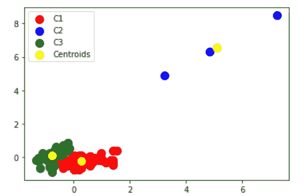
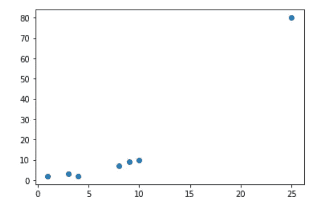
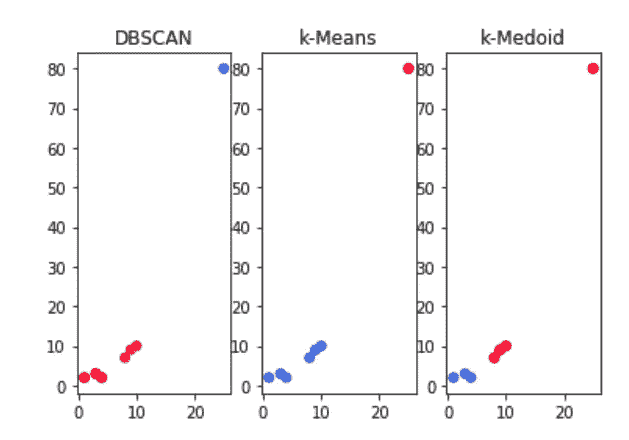
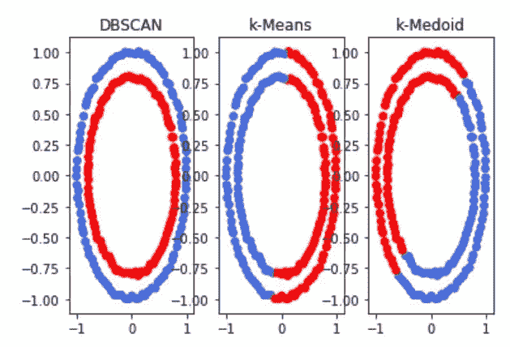
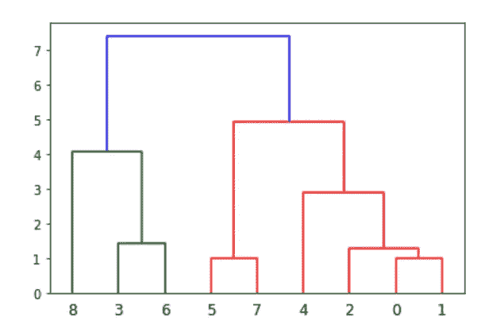
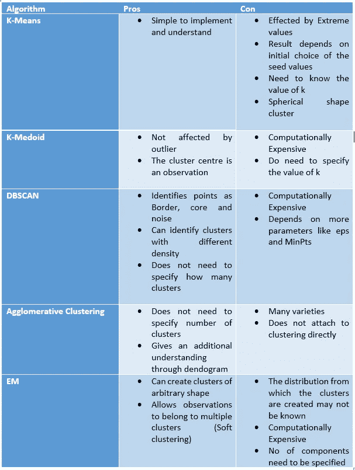

# 通过聚类发现自然群体

> 原文：<https://towardsdatascience.com/learning-the-clustering-algorithms-through-hands-on-da4b462503ff?source=collection_archive---------56----------------------->

## **通过简单的实验学习流行的聚类算法**

自然群体。[图片来源](https://unsplash.com/photos/aCDHRbxRvAM)

集群具有跨应用领域的重要用例，以了解数据的整体可变性结构。无论是客户、学生、基因、心电图信号、图像、股票价格的聚类。在我们的一些研究文章中，我们已经在特性选择和投资组合的优化中成功地使用了这一点，但在后面的故事中会有更多。聚类属于无监督类别，根据定义，它试图在数据中找到自然的组。

即使在深度学习时代，聚类也可以为您提供关于数据分布的宝贵见解，从而影响您的设计决策。

在这篇文章中，我们给你一些关于五种聚类算法和 Kaggle 笔记本链接的概述，我们在那里做了一些实验。目的是给你一个快速总结，让你开始申请。

# K-表示:

这是所有基于距离的算法中最简单的一种。这是一种分割算法。从 k 个随机点作为聚类中心开始，然后将其余的点分配到最近的聚类中心。完成此分配后，重新计算聚类中心。这个过程一直持续到集群分配没有太大变化。

其中一些问题是:

a)我们需要知道“k”的值

b)受离群值影响。

c)取决于初始化

有些实验是在下面的 Kaggle 笔记本上做的:【https://www.kaggle.com/saptarsi/kmeans-dbs-sg 

我们首先解释 k-means 是如何工作的，然后举例说明为什么需要缩放。我们还讨论了如何使用肘图绘制误差平方和，以找到 k 的最佳值。一个简单的例子是“iris”

对应视频:

理论:[https://www.youtube.com/watch?v=FFhmNy0W4tE](https://www.youtube.com/watch?v=FFhmNy0W4tE)

动手:[https://www.youtube.com/watch?v=w0CTqS_KFjY](https://www.youtube.com/watch?v=w0CTqS_KFjY)

# K-Medoid:

K-Means 对异常值并不稳健。当我们有一个以上的属性时，我们要找到一个整体的中值，这就是所谓的中值。有些实验是用下面的笔记本做的。为了演示异常观测值的问题，我们做了一个添加三个异常观测值的小实验。如你所知，iris 有三个类(Setosa、Verginca 和 Versicolor ),它们被绘制成两个特性。这些由蓝色圆圈标记的特征的添加完全扭曲了聚类。原来的三个类合并成两个聚类，离群点在一个聚类中。

图 1:受极值影响的 K 均值。图片来源:作者笔记本[https://www.kaggle.com/saptarsi/kmedoid-sg](https://www.kaggle.com/saptarsi/kmedoid-sg)

Kaggle 笔记本链接:

https://www.kaggle.com/saptarsi/kmedoid-sg

我们讨论的主要问题是，当标签不可用(轮廓宽度)和可用(纯度)时，如何测量聚类的质量。下面是一个比较 K 均值和 K 中值的极端观测值(异常值)的简短示例。

对应视频:

理论:【https://www.youtube.com/watch?v=q3plVFIgjGQ】T4

动手:[https://www.youtube.com/watch?v=L1ykPtlonAU](https://www.youtube.com/watch?v=L1ykPtlonAU)

# 数据库扫描:

DBSCAN 最有前途的一点是，它将一些点识别为**噪声**点，这些点如果包含在聚类练习中，将会扭曲整个聚类。该算法可以找到基于密度的聚类，而不是距离。

在卫星和同心圆上比较了 DBSCAN、K-Medoid、K-Means。下面的笔记本包含简单的实验。

[https://www.kaggle.com/saptarsi/dbscan-sg](https://www.kaggle.com/saptarsi/dbscan-sg)

在一个这样的实验中，我们创造了一个噪音点。

X = np.array([[1，2]，[4，2]，[3，3]，[8，7]，[9，9]，[10，10]，[25，80]])

散点图如下所示:

图 2:具有一个噪声点的 2D 数据的散点图

图片来源:作者笔记[https://www.kaggle.com/saptarsi/dbscan-sg](https://www.kaggle.com/saptarsi/dbscan-sg)

直观上，我们理解可能有三个集群和一个外围点。

下图比较了聚类结果

图 3: DBSCAN、K-Means 和 PAM 处理噪声点的能力

图片来源:作者笔记[https://www.kaggle.com/saptarsi/dbscan-sg](https://www.kaggle.com/saptarsi/dbscan-sg)

我们可以看到 DBSCAN 清楚地将点置于另一种颜色中，因为 k-意味着原始的两个聚类丢失，对于 k-medoid 更好，但是它没有单独识别外围点。

下面的 make circle 提供了算法的另一个比较，它清楚地显示了 DBSCAN 如何正确地识别属于两个集群的两个圆。

图 4:同心圆上的 DBSCAN、K-Means 和 K-Medoid

图片来源:作者笔记 https://www.kaggle.com/saptarsi/dbscan-sg

对应视频:

理论:【https://www.youtube.com/watch?v=RZg51WH7caQ】T4

动手:[https://www.youtube.com/watch?v=A8OnRH42hWE](https://www.youtube.com/watch?v=A8OnRH42hWE)

# 凝聚聚类:

以上三种是基于分区的聚类，而这是一种**分层**聚类，通过树状图揭示了关于整体结构的更多语义。层次聚类中的一个重要考虑是当合并到聚类中时要考虑哪个距离，是最小距离、最大距离还是平均距离。在同心圆、半月形、高斯数据和种子数据集上进行了各种实验。包含一些实验的笔记本如下:

 [## 聚集聚类 SG

### 使用 Kaggle 笔记本探索和运行机器学习代码|使用 UCISeeds 的数据

www.kaggle.com](https://www.kaggle.com/saptarsi/agglomarative-clustering-sg) 

笔记本上的符号图

图 5:简单的 dendorgam

图片来源:作者笔记[https://www.kaggle.com/saptarsi/agglomarative-clustering-sg](https://www.kaggle.com/saptarsi/agglomarative-clustering-sg)

对应视频:

理论:[https://www.youtube.com/watch?v=RZg51WH7caQ](https://www.youtube.com/watch?v=RZg51WH7caQ)

动手:[https://www.youtube.com/watch?v=z7jXh_RzL_k](https://www.youtube.com/watch?v=z7jXh_RzL_k)

# 预期最大化:

其实现方式是通过高斯混合建模。基本上，每个聚类可以被认为来自不同的多元正态分布。与所有 4 种方法相比，这是一种**软聚类**方法。下面是一个笔记本，里面有一些简单的实验。这是一种更灵活的方法，允许圆具有非球形形状。

[https://www.kaggle.com/saptarsi/gmm-sg](https://www.kaggle.com/saptarsi/gmm-sg)

对应视频:

理论:【https://www.youtube.com/watch?v=LaL0BfvUurs】T2

动手:【https://www.youtube.com/watch?v=A8OnRH42hWE 

# 总结:

在下表中，我们总结了算法的优缺点

聚类算法的比较。作者创建的图像

# 何时使用哪种算法？

我总是从 K-Means 开始，观察聚类质量，只有当数据非常随机，密度变化时，我才会选择 DBS can。如果我想应用聚类进行总结 **k-medoid** 是一个不错的选择。**凝聚聚类**因其呈现的可视化而具有吸引力。EM 是一个理论上非常健壮的算法，它有许多其他的应用，在有重叠簇的地方 EM 可能是一个很好的选择。

参考资料:

[1][https://towards data science . com/clustering-clearly-explained-5561642 ec20c](/clustering-clearly-explained-5561642ec20c)

[2][https://towards data science . com/unsupervised-machine-learning-clustering-analysis-d 40 F2 b 34 AE 7e](/unsupervised-machine-learning-clustering-analysis-d40f2b34ae7e)

[3] Tan PN，Steinbach M，Kumar V .数据挖掘导论。培生教育印度公司；2016.