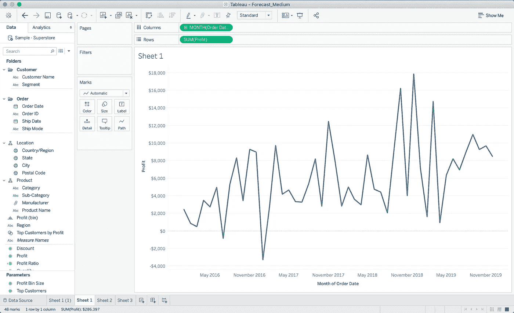
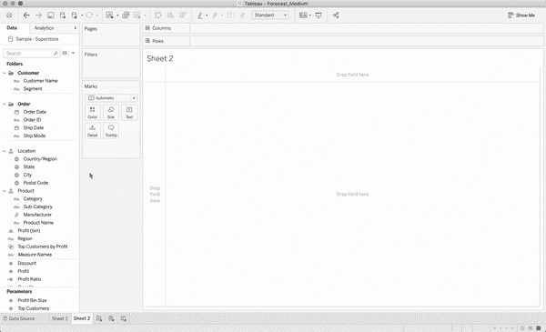
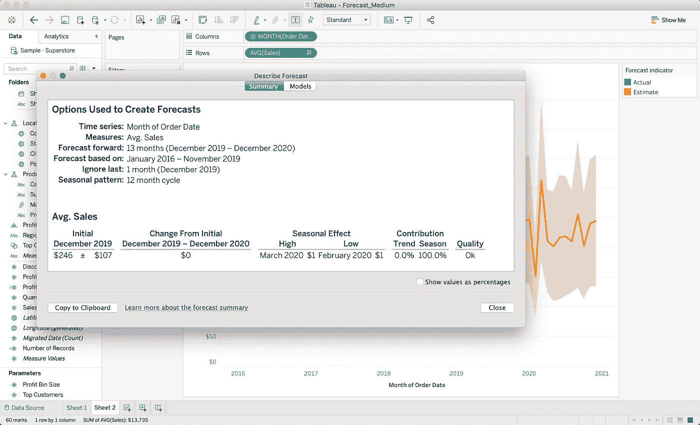
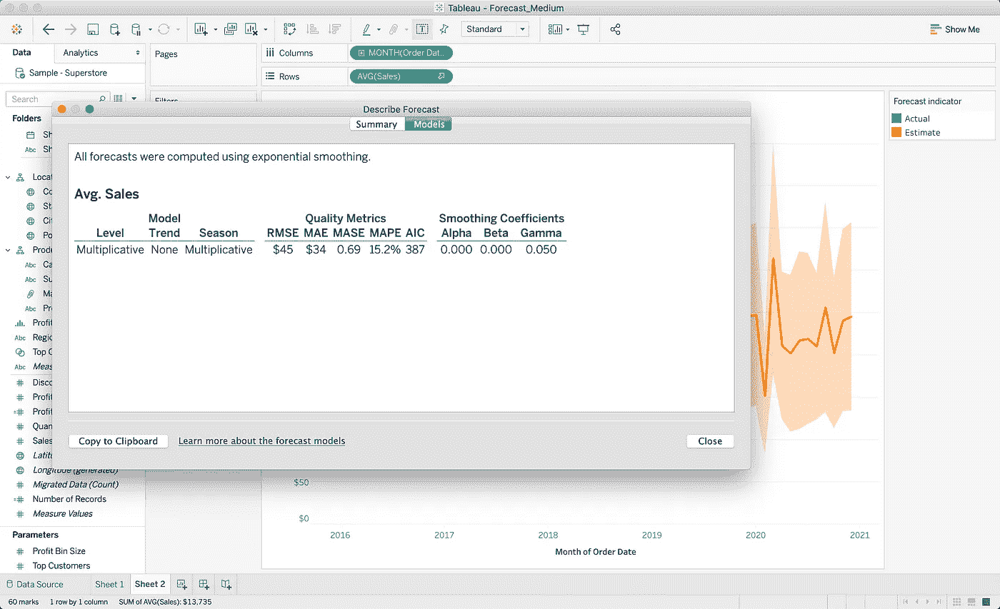
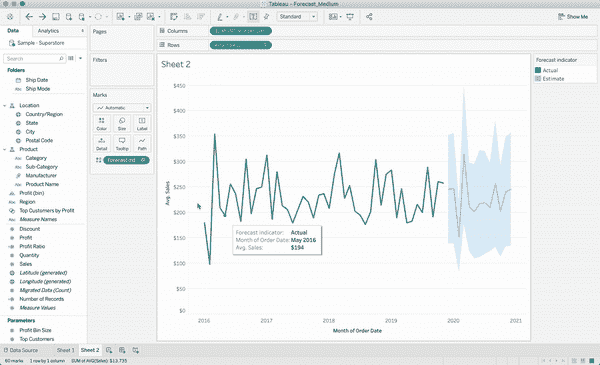
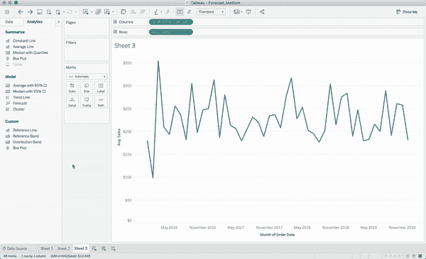

# 学习用 Tableau 在 5 分钟或更短时间内预测

> 原文：<https://towardsdatascience.com/learning-to-forecast-effectively-with-tableau-in-6-minutes-or-less-3d77a55930a0?source=collection_archive---------15----------------------->

## （舞台上由人扮的）静态画面

## 谁知道会这么容易？

由 [@softie__arts](https://www.instagram.com/softie__arts/) 创作

使用 Python 和 R 有很多方法来可视化您的数据，但是强大的商业智能工具 **Tableau** 使得创建可视化成为一个简单的拖放过程。

Tableau 也不仅仅是一个可以用来创建图表的工具。您可以编写自定义 SQL，创建复杂的计算字段，甚至生成高质量的预测！

请继续阅读，快速了解 Tableau 如何通过一次点击自动生成预测(包括 gif)。

# Tableau 如何创建预测的简要说明

Tableau 使用**指数平滑法**创建预测。虽然 Tableau 也支持使用整数值而不是日期，但是您可以在绘制度量值随时间变化的可视化图形上这样做。

> 预测的好坏取决于它们所依据的数据。

一般来说，在尝试创建预测之前，您应该包括尽可能多的数据。Tableau 在技术上只需要**五个数据点**就可以创建一个时间序列预测，尽管它甚至会尝试预测一个没有足够数据的视图来建立一个准确的模型，但预测的好坏取决于它们所基于的数据。

如果您基于太少的数据或受外部变量影响太大的数据创建预测，您的预测很可能不适合未来。您还应该注意 Tableau 在每次预测时自动生成的`Prediction Intervals`，以了解预测值可能落入的范围。

Tableau 将从八个指数平滑模型中选择一个来创建最佳预测(有关更多信息，请参见最后一节)。指数平滑模型也可以考虑`Trend`(模型的总体上升或下降方向)和`Seasonality`(特定时期的波动模式)。

# 在 Tableau 中创建预测

在本演练中，我们将使用 Tableau 附带的“样本超市”数据集。如果您想继续操作，请打开一个新工作簿并连接到此数据源。

我们从一个简单的图表开始，它显示了一段时间内每月的平均销售额:

显示一段时间内平均销售额的基本图表

## 预测和趋势/季节性定制选项

要使用预测扩展图表，右键单击视图上的任意位置(图表所在的位置)并单击`Show Forecast`。

您可以选择自定义预测的提前期，但是 Tableau 设置了一个默认值(在本例中为 13 个月),这通常是合适的。

在 Tableau 中创建和定制预测

首先，预测只是一条直线，它来自 Tableau 创建的初始模型。这不是默认的，因为 Tableau 会尽最大努力生成一个适合现有数据的模型。但是，有时您必须定制模型，以使其更准确地描绘未来的数据点。为此，再次右键单击视图，单击`Forecast Options`，然后在`Forecast Model`面板中选择“自定义”。

在这种情况下，当定制模型`Trend`和`Seasonality`时，我循环通过不同的选项(**加法**和**乘法**)。有关这些如何工作的更多信息，请查看 [Tableau 文档](https://help.tableau.com/current/pro/desktop/en-gb/forecast_how_it_works.htm)中的“模型类型”部分。

我决定将`Seasonality`调整为**乘法**并保持`Trend`不变。

## 预测描述

要了解您的预测是如何生成的，右键单击视图并选择`Describe Forecast`。这将弹出一个包含预测模型信息的弹出窗口。下面，您可以看到哪些数据用于创建预测，以及对您预测的变量(在本例中为“平均销售额”)的影响。

表格预测汇总说明

如果您点击`Model`选项卡，您将看到与计算 Tableau 使用的指数平滑预测模型相关的值。

Tableau 预测模型描述

## 预测化妆品和预测间隔

您可以将图表的预测部分更改为不同的颜色，使其与图表的其他部分更加突出。为此，只需点击`Marks`卡中的`Color`按钮，并选择您想要的预测模型颜色。

这也将影响图表中的“**预测区间**”，该区间显示了预测值可能位于的值范围。您可以通过右击并再次转到`Forecast Options`来设置预测(置信)区间百分比。默认情况下，预测间隔设置为 95%，但是如果您想查看没有预测间隔的图表，可以自定义该值或将其完全删除。

在 Tableau 中自定义预测

## 预测与趋势线

除了指数平滑模型，您还可以为图表创建趋势线。只需转到`Analytics`选项卡，然后双击`Trend Line`或将其拖至视图。Tableau 将为您提供线性、对数、指数、多项式或幂型趋势线的选项。

如果您将鼠标悬停在趋势线上，您将会看到 Tableau 使用了哪些值来在图表上显示它。对于完整的方程和系数，你可以右键点击趋势线，并前往`Describe Trend Line`进行总结。

在 Tableau 中创建趋势线

有趣的是，您可以看到原始图表和我们生成的指数平滑预测模型之间的线性趋势线略有不同。

我希望你发现这个快速介绍 Tableau 预测有用！Tableau 是一个非常强大的数据可视化工具，它不仅仅可以创建图表。

和往常一样，理解*Tableau(和你使用的其他程序)如何创建预测模型是很重要的，因为**你做出的决定不仅要基于数据，还要基于你理解的数据。***

通读 Tableau 的预测文档，你也可以浏览 Tableau 可以使用的所有指数平滑模型[这里](https://otexts.com/fpp2/taxonomy.html)。

此外，在可视化数据之前需要采取的一些重要步骤是收集和预处理。您可以利用 Python 中的 **Pandas** 库来开始这项工作。请随意查看我以前在这些主题上的一些工作:

 [## 4 种不同的方法来有效地排序熊猫数据帧

### 正确探索、理解和组织您的数据。

towardsdatascience.com](/4-different-ways-to-efficiently-sort-a-pandas-dataframe-9aba423f12db)  [## 如何使用 Python 和 Xpath 抓取网站

### 用 XPath 表达式从 HTML 中收集星球大战引言

towardsdatascience.com](/how-to-use-python-and-xpath-to-scrape-websites-99eaed73f1dd)  [## 一种快速重新格式化熊猫数据框中的列的方法

### 使用 df.melt 将多个列压缩成一列。

towardsdatascience.com](/a-quick-way-to-reformat-columns-in-a-pandas-dataframe-80d0b70de026) 

感谢您的阅读，祝您的 Tableau 冒险之旅好运！