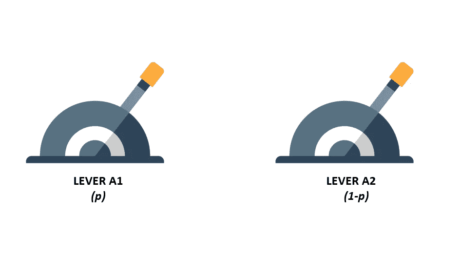
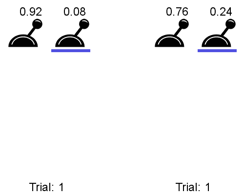
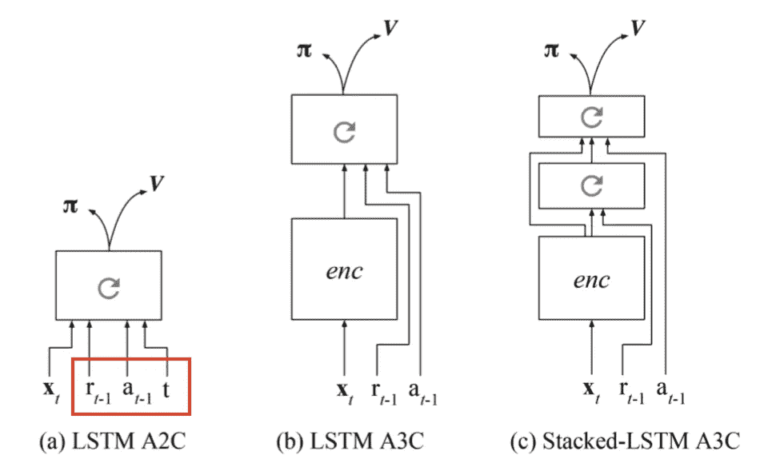

# 学会学习更多:元强化学习

> 原文：<https://towardsdatascience.com/learning-to-learn-more-meta-reinforcement-learning-f0cc92c178c1?source=collection_archive---------21----------------------->

## 建造一个人造大脑

摄影爱好在 [Unsplash](https://unsplash.com?utm_source=medium&utm_medium=referral) 上

强化学习的 [ELI5](https://www.dictionary.com/e/slang/eli5/) 定义是通过从以前的错误中反复学习来训练一个模型表现得更好。强化学习为代理提供了一个框架来解决现实世界中的问题。他们能够学习规则(或*策略*)来解决特定的问题，但是这些代理的主要限制之一是他们不能将学习到的策略推广到新的问题。先前学习的规则只适合特定的问题，对于其他(甚至类似的)情况通常是无用的。

另一方面，一个好的元学习模型被期望推广到模型在训练中没有遇到的新任务或环境。适应这种新环境的过程可以被称为*小型学习会议*，在有限接触新配置的情况下进行测试。在缺乏明确的微调模型的情况下，可以观察到元学习能够自主地调整内部状态以推广到更新的环境。

> 元强化学习就是应用于强化学习的元学习

此外， [Wang et al.](https://arxiv.org/abs/1611.05763) 将元学习描述为“使用递归模型的元学习的特殊类别，应用于学习”，这似乎比上面的定义更全面。

# 我们开始吧

在强化学习中，代理在每一步接收**观察** (例如视频游戏中角色的位置)，并基于这些观察输出**动作** ，如“向前移动”或“向右转”。基于这些行动的结果，代理会收到**奖励**或**惩罚**，这将在培训中进一步指导它，帮助它为以后的步骤做出更有意义的观察。该模型的目标是最大化奖励和最小化惩罚。

在*元强化学习*中，训练和测试任务是不同的，但是来自同一个问题家族。一个很好的例子是不同布局的迷宫，或者不同概率的多臂强盗问题(解释如下)。

## 一个简单的实验

[多臂强盗问题](https://lilianweng.github.io/lil-log/2018/01/23/the-multi-armed-bandit-problem-and-its-solutions.html)是一个经典问题，它很好地展示了探索与开发的两难困境。你可以想象自己在一个只有两个杠杆的房间里，其他什么都没有。

多兵种土匪问题；作者图片

1.  拉左边的杠杆 *A1* 会给你一个概率 *p* 来获得奖励 *r* 。
2.  拉右边的杆 *A2* 会给你一个概率 *(1-p)* 来获得奖励 *r.*

为了从逻辑上回答这个问题，你必须知道概率 p 的值。较高的 *p* 值将保证从杠杆 *A1* 获得奖励的较高机会，而较低的 *p* 值将保证从杠杆 *A2 获得奖励的较高机会。这正是 meta-RL 如此有趣的原因。如果你在你的模型上投入足够的价值，在与环境互动并从中学习之后，它会越来越好地选择正确的杠杆。传统的基于 RL 的方法将无法处理变化的概率，并且通常会因不同的 *p* 值而失败。*

[实际上](https://hackernoon.com/learning-policies-for-learning-policies-meta-reinforcement-learning-rl%C2%B2-in-tensorflow-b15b592a2ddf)，受过不同概率的两级问题训练的 meta-RL 智能体能够从两级中选择正确的一级，从而使用非常少量的数据点获得最高的回报。它使用对联*(行动，回报)*来计算每个杠杆的“风险与回报”因子。

下面是一个示例，左边是一个未经过训练的**代理(p*p*= 0.92)，右边是一个经过训练的**meta-RL 代理(p*p*= 0.76)****

未经训练和经过训练的 meta-RL 代理；[来源](https://hackernoon.com/learning-policies-for-learning-policies-meta-reinforcement-learning-rl%C2%B2-in-tensorflow-b15b592a2ddf)

## 关键组件

meta-RL 涉及三个关键组件。下面将对它们进行详细描述。

**有记忆的模型:**没有记忆，meta-RL 模型就没用了。它需要记忆来从直接环境中获取和存储关于当前任务的知识，这将有助于它更新其隐藏状态。一个*递归神经网络*维护 meta-RL 模型的隐藏状态。

创建一个好的 RNN 的动力对于本文的范围来说太宽泛了。然而，meta-RL 和 meta-RL 都使用 LSTM 来管理它们的隐藏状态。

**元学习算法:**元学习算法将定义我们如何根据它所学习的内容来更新模型的权重。该算法的主要目标是帮助优化模型，以在最短的时间内解决一个看不见的任务，应用它从以前的任务中学到的东西。以往的研究通常使用普通梯度下降更新的 LSTM 细胞。

和[爬行动物](https://arxiv.org/abs/1803.02999)，都是经过验证的方法，能够更新模型参数，以便在新的和未知的任务上实现良好的泛化性能。

**一个合适的 MDPs 分布:**一个*马尔可夫决策过程(MDP)* 是指智能体观察环境输出的整个过程，由一个奖励和下一个状态组成，然后在此基础上做出进一步的决策。由于代理在其培训期间会暴露于许多不同类型的环境和任务，因此它需要能够快速适应不断变化的条件和不同的 MDP。

在这三个组件中，这是研究最少的组件，也可能是关于 meta-RL 的最具体的组件。由于每个任务都是一个 MDP，我们可以通过修改*奖励配置*或*环境来构建 MDP 的分布。*

[进化算法](https://en.wikipedia.org/wiki/Evolutionary_algorithm)是保证生成良好环境的一个很棒的方法。它们通常是启发式的，受自然选择过程的启发。一群随机产生的解会经历一个评估、选择、突变(如果我们把遗传算法也加入进来)和繁殖的循环；好的解决方案能坚持到最后。王等人的《诗人》是一个基于进化算法的框架的好例子。

下面展示了一对开放式开拓者(POET ),最初从一个普通的环境和一个随机初始化的代理开始。然后，它增长并维护一对一配对环境和代理的群体。根据作者的观点，POET 旨在实现两个目标，进化环境的多样性和复杂性；以及优化代理以解决它们的并行环境。

POET:基于进化算法的框架；[来源](https://eng.uber.com/poet-open-ended-deep-learning/)

> *没有奖励函数的 MDP 被称为*受控马尔可夫过程 *(CMP)给定预定义的 CMP，我们可以通过生成奖励函数 R 的集合来学习关于各种任务的知识，这鼓励了有效的元学习策略的训练。*
> 
> [Gupta 等人](https://arxiv.org/abs/1806.04640)提出了两种在 CMP 环境下增长任务分布的无监督方法。假设有一个潜在的潜在变量与每个任务相关联，它将奖励函数参数化为潜在变量的函数以及鉴别器函数(用于从状态中提取潜在变量)。 *—* [来源](https://lilianweng.github.io/lil-log/2019/06/23/meta-reinforcement-learning.html)

研究论文描述了构造鉴别器函数的两种主要方法:

1.  对鉴别器的随机权重进行采样
2.  学习鉴别器功能以鼓励多样性驱动的探索。如果你正在寻找关于这个主题的更全面的分析，你可以参考他们的另一篇论文，“DIAYN(多样性是你所需要的)。

在 CMP 环境中增加任务分布的复杂性超出了本文的范围，我强烈推荐任何感兴趣的人深入研究这篇文章以获得更深入的观点。

## 与强化学习的比较

meta-RL 系统非常类似于普通 RL 算法的系统，除了最后的奖励以及最后的动作也包括在策略观察中，以及当前状态。这种改变的目的是馈送并跟踪所有任务和观察的历史，以便模型可以基于当前 MDP 在内部更新状态、动作和奖励之间的动态，并相应地调整其针对其他 MDP 的策略。

meta-RL 和 meta-RL 都实现了 LSTM 策略，其中 LSTM 的隐藏状态作为记忆来跟踪特征的变化。该策略本质上是循环的，不需要显式输入最终值。

meta-RL 论文中使用的不同演员-评论家架构(全部都是循环模型)；[来源](https://arxiv.org/abs/1611.05763)

训练程序如下进行:

1.  品尝新 MDP
2.  重置模型的隐藏状态
3.  收集多个轨迹并更新模型的权重
4.  从步骤 1 开始重复

## 超出

训练 RL 算法有时会很困难。如果一个元学习代理能够变得如此聪明，以至于它能够根据在特定任务上接受训练时推断出的知识来解决的任务分布变得非常广泛，那么我们将朝着广义智能(或新的流行词——人工通用智能{AGI})的方向前进，本质上是建立一个能够解决所有类型的 RL 问题的大脑。

作为旁注，我还想指出 meta-RL 和[AI-GAs](https://arxiv.org/abs/1905.10985)(J . Clune 著)之间毫不奇怪的相似之处，后者提出通往 AGI 的有效途径是让学习自主。它基于三个支柱:元学习架构、元学习算法和有效学习的自动生成算法。

## 参考资料和进一步阅读

没有亚瑟·朱利安尼的努力，这项工作是不可能完成的。你可以在这里查看他对 meta-RL 算法的出色实现。王等人的这篇[研究论文](https://arxiv.org/abs/1611.05763)也让我对 meta-RL 的一些核心概念有了很好的见解，如果你想有一个更全面的看法，我强烈推荐阅读它。最后，Clune、Stanley、Lehman 和 Wang 在工程博客上发表的这篇文章也帮助我理解了这些领域的开放性，以及如何克服极其困难的挑战。Lilian Weng 的这个博客也是一个很好的进一步阅读的资源。