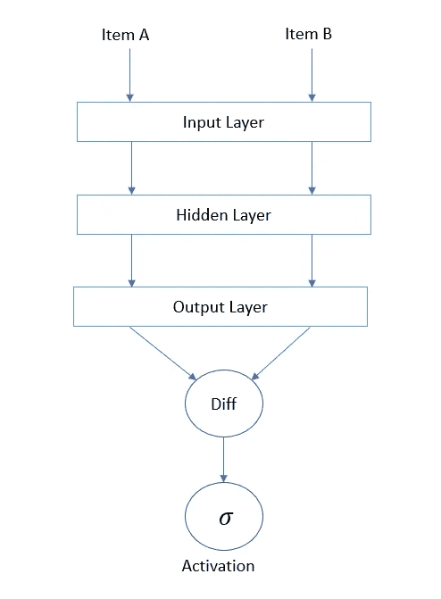
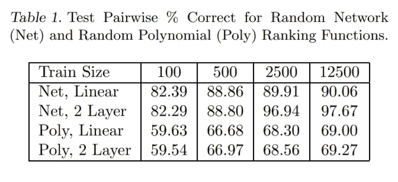
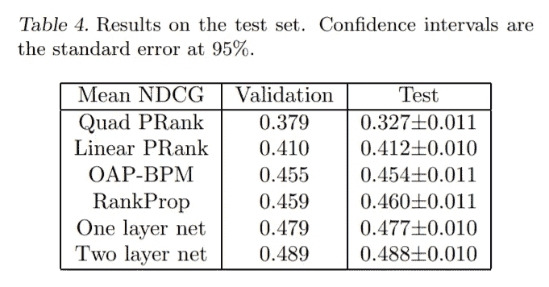
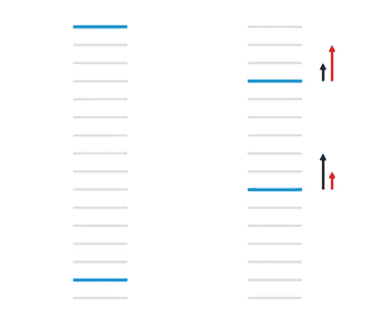

# 学习为信息检索排序:深入研究 RankNet。

> 原文：<https://towardsdatascience.com/learning-to-rank-for-information-retrieval-a-deep-dive-into-ranknet-200e799b52f4?source=collection_archive---------12----------------------->

## 深入了解可用于信息检索的最新排名系统。

文档排序是信息检索中的一项重要任务。(图片由[弗洛里安·施梅兹](https://unsplash.com/@floschmaezz?utm_source=medium&utm_medium=referral)在 [Unsplash](https://unsplash.com?utm_source=medium&utm_medium=referral) 上拍摄)

机器学习和人工智能目前正在推动计算机科学领域的创新，它们正被应用于跨学科的多个领域。然而，传统的最大似然模型仍然可以大致分为两类问题的解决方案。

1.  分类——旨在根据各种特征将特定的数据实例标记到桶中。
2.  回归——我们希望得到一个连续的实数作为给定特性集的输出。

机器学习的一个相对较少探索的应用是根据相关性对数据进行排序，这在搜索引擎等信息检索系统中变得有用。这些类型的模型更关注项目的相对排序，而不是单个标签(分类)或分数(回归)，并被归类为 [**学习排序**](https://en.wikipedia.org/wiki/Learning_to_rank) 模型。

# **rank net 简介**

2005 年，克里斯·伯格斯等人。艾尔。微软研究院推出了一种新颖的方法来创建学习排名模型。他们的方法(在这里可以找到)采用了一个概率成本函数，该函数使用一对样本项目来学习如何对它们进行排序。该功能主要是尝试最小化纠正所选项目的错误排序所需的交换次数。他们的论文进一步探索了这种方法，通过神经网络实现这种成本函数，并通过[梯度下降](https://en.wikipedia.org/wiki/Gradient_descent#:~:text=Gradient%20descent%20is%20a%20first,function%20at%20the%20current%20point.)进行优化。这个名为“ *RankNet* ”的网络也在一些真实世界的数据上进行测试，以显示其有效性。

如本文中所实现的，RankNet 的工作总结如下。

**训练网络**

1.  构造了一个具有一个输出节点的两层神经网络。输出值对应于该项与集合的相关性，并且输入层可以基于特征向量的大小而具有多个节点。
2.  从数据集中选择两个随机样本，并分别对这两个样本进行前向传播，从而产生两个输出值，每个项目一个。
3.  确定成本，该成本是这两个输出值之差的激活函数(e *g: sigmoid* )。假设第一个样本的排名高于第二个样本，并计算适当的损失。
4.  这种损失被反向传播到网络中以学习所选择的例子。
5.  执行步骤 2-4，直到训练完成(基于时期数)。

图片:所描述网络的前向传播演示。(礼貌:自己)

步骤 3 中提到的假设只不过是确定两个选定项目的预期等级。该等级可以通过比较特定项目相对于整个集合的相关性评级来确定。此外，可以通过基于一些假设手动设置相关性，或者通过使用人工评级者基于相关性对结果进行分类，来确定该相关性评级。

**检索一个集合的排名**

1.  为了对特定集合中的项目进行排序，每个项目的特征向量通过网络传播，并且输出被存储。
2.  现在，只需按照输出的降序排列项目，就可以对项目进行排序。

Burges 和他的同事用一些人工数据证明了这种方法的有效性。他们采用了两个排序函数，一个随机 2 层神经网络，以及一个随机多项式函数。在对 5000 个特征向量输入运行 100 个时期的数据后，他们获得了如下所示的结果。

图:两个排名函数的成对%正确结果。(礼貌:[学习使用梯度下降法排名](https://icml.cc/2015/wp-content/uploads/2015/06/icml_ranking.pdf))

此外，这种方法在真实世界的数据——给定查询的搜索引擎结果——上进行了测试。需要注意的一点是，由于该模型不执行传统的分类或回归，因此其准确性必须基于排名质量的度量来确定。现实世界示例的排名准确度度量被选择为“[NDCG](https://en.wikipedia.org/wiki/Discounted_cumulative_gain)”(*正常贴现累积收益*)，这是用于评估特定排名集合的有效性的流行方法。NDCG 得出一个介于 0 和 1 之间的结果，1 代表项目的最佳排序。在训练了六个不同的排名函数(包括 RankNet 的两个不同实现)之后，对于搜索结果的给定查询/文档特征向量，在测试集上获得了以下结果。

图片:RankNet 与其他系统的比较。(礼貌:[学习使用梯度下降法排名](https://icml.cc/2015/wp-content/uploads/2015/06/icml_ranking.pdf))

因此，我们看到 RankNet(一层和两层)的平均 NDCG 明显高于其他排名函数。

# 未来的改进

Burges 和他的同事进一步将 RankNet 的概念发展成训练时间更短、精度更高的模型。

## [**λrank**](https://www.microsoft.com/en-us/research/wp-content/uploads/2016/02/lambdarank.pdf)

在原始 RankNet 的训练过程中，发现不需要计算成本本身。相反，成本的梯度足以确定这对项目的预测排名。这可以被视为指示特定项目的移动方向的箭头。

图像:成本梯度的可视化，用箭头指示移动方向。(承蒙:[从兰克内到兰达兰克到兰达玛特:概述](https://www.microsoft.com/en-us/research/wp-content/uploads/2016/02/MSR-TR-2010-82.pdf))

此外，当他们通过交换文件导致的 NDCG 变化来放大这个梯度时，他们获得了更好的结果。因此，LambaRank 被证明训练速度更快，准确性也有所提高。

## [**λmart**](https://www.microsoft.com/en-us/research/wp-content/uploads/2016/02/LambdaMART_Final.pdf)

在另一个版本中，引入了[渐变增强的](https://en.wikipedia.org/wiki/Gradient_boosting#:~:text=Gradient%20boosting%20is%20a%20machine,prediction%20models%2C%20typically%20decision%20trees.)树版本的 LambaRank】。在实验数据集中，这已被证明比前两个模型更加准确。

# 结论

因此，我们已经看到了一些最先进的排序技术，当我们想要在信息检索系统中对一组项目进行排序时，这些技术非常有用。所以问题来了，是什么阻止我们去实现这些模型呢？答案很简单——**没事**！

*(对于感兴趣的人，我自己使用 Keras 和 TensorFlow 实现的 RankNet 可以在*[https://github.com/devanshgoenka97/RankNet](https://github.com/devanshgoenka97/RankNet)*)*

# 参考

[【1】:Burges，c .，Shaked，t .，Renshaw，e .，Lazier，a .，Deeds，m .，Hamilton，n .，&Hu lender，G. (2005)。**学习使用梯度下降进行排序**。*ICML 05 年*](https://icml.cc/2015/wp-content/uploads/2015/06/icml_ranking.pdf) *。*

[【2】:布格斯，c，拉格诺，r . j .&勒，Q.V. (2007)。**学习用非光滑代价函数排序**。](https://www.microsoft.com/en-us/research/wp-content/uploads/2016/02/lambdarank.pdf)

[【3】:吴，q，Burges，c，Svore，k，&高，J. (2009)。**适应信息检索措施的助推**。*信息检索，13* ，254–270。](https://www.microsoft.com/en-us/research/wp-content/uploads/2016/02/LambdaMART_Final.pdf)

[【4】:布格斯，C. (2010)。**从兰克内到兰达兰克再到兰达玛特:概述。**](https://www.microsoft.com/en-us/research/wp-content/uploads/2016/02/MSR-TR-2010-82.pdf)