# 用迷你批处理学习 Wasserstein

> 原文：<https://towardsdatascience.com/learning-with-minibatch-wasserstein-d87dcf52efb5?source=collection_archive---------36----------------------->

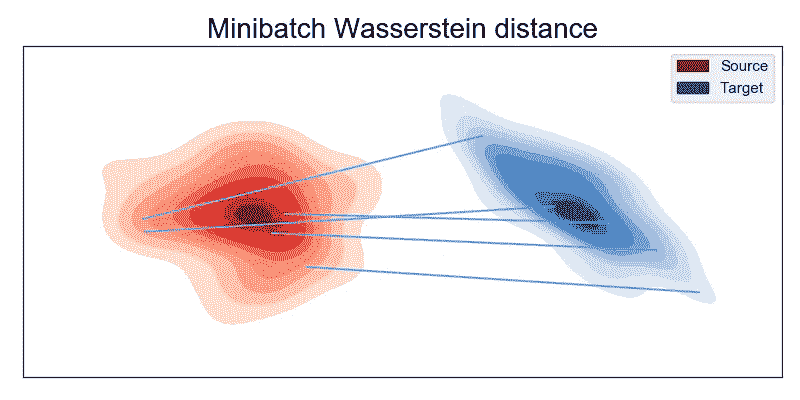

## 迷你批次 Wasserstein 距离属性简介

## 当我们对迷你批次使用 Wasserstein 距离时会发生什么？论文[的结果来自 minibatch Wasserstein 的学习:渐近和梯度性质](https://arxiv.org/pdf/1910.04091.pdf)，发表在 [AISTATS 2020](https://www.aistats.org/) 会议上。

对于许多机器学习应用，如生成模型[1]或领域适应[2]，最优传输已经变得非常流行。在这些应用中，人们希望最小化源数据和目标数据之间的统计距离。为此，瓦瑟斯坦距离成了一项基本资产。它既可以用原始公式[2，3]计算，也可以用对偶公式[1]计算，并依靠小批量进行优化。不幸的是，由于连续函数的梯度计算，对偶可能导致数值不稳定，因此使用原始公式。出于学习目的，可以在[第 9.4、4 节]中找到对每种配方的利弊的综述。

然而，计算迷你批次之间的初始 Wasserstein 距离 ***并不等同于计算完全测量之间的初始 wasser stein 距离*** 。在这个故事中，我将描述***minibatch wasser stein distance***，其中 mini batch 范式对损失的后果被 ***置之不理。*** 对所呈现结果的全面回顾可见于我们的 [***AISTATS2020 论文***](https://arxiv.org/abs/1910.04091)*【5】。*

> *声明:为了简单起见，我将给出 Wasserstein 距离的结果，但所有这些结果都可以扩展到所有最优运输变量。我们也考虑一般地面成本。此外，我们将不区分元素集和它们的度量。*

# *瓦瑟斯坦距离*

*基于 Kantorovich 问题， **Wasserstein 距离通过根据地面度量*寻找测量值α和测量值β之间的**最小位移成本**来测量两个分布之间的****距离。设α (size *n* )和β (size *n* )为两个*离散有界一致测度*设 ***C*** 为一个度量(size *n × n* )。瓦瑟斯坦距离定义为:**

**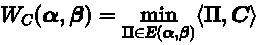**

**情商。(1):瓦瑟斯坦距离**

**⟨在哪里？,.⟩是 Frobenius 乘积和 *E* ***(*** *α，β)约束的集合*。Wasserstein 距离*必须在完全测量值α和β之间进行计算。U* 不幸的是，它在数据数量上有一个立方复杂度 *O(n^3)* ，使它不适合大数据应用。OT 问题的变体出现了，如熵 OT 或 Sinkhorn 散度，但它仍然具有平方复杂度。为了克服这种复杂性，可以依靠计算源和目标测量的小批次之间的 Wasserstein 距离。**

# **小批量 Wasserstein 距离**

**使用小批量策略很有吸引力，因为它在小批量大小上给出了一个立体的复杂性 *O(m^3)* 。然而，最优运输的原始公式不是一个总和，使用小批量并不等同于等式。(1).实际上，它 ***并不计算瓦瑟斯坦距离*** ，而是计算从输入测量中采样的迷你批次 上瓦瑟斯坦距离的 ***期望值。形式上，它计算:*****

**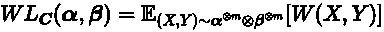**

**情商。(2) : ***批次间 Wasserstein 距离的期望值*****

**其中 *m* 为批量。由于它不等同于原始问题，所以理解这个新的损失是很有趣的。我们将回顾运输计划的结果，渐近统计特性，最后，一阶优化方法的梯度特性。**

# **估计小批量 Wasserstein**

**让我们首先设计一个估计量。情商。(2)可以用以下估算器进行估算:**

**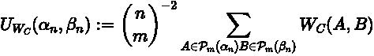**

**情商。(3):Eq 的估计量。(2)**

**其中总和取自源和目标测量中所有可能的小批测量 A 和 B。然而，要计算的小批量项目太多了。幸运的是，我们可以依赖子样本量。我们注意到 *D_k，*一组基数 *k* ，其元素是均匀绘制的小批偶。我们定义:**

**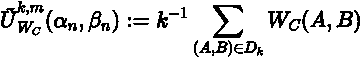**

**情商。(4):方程的不完全估计量。(2)**

**其中 *k* 是 minibatch 对的数量。我们还可以为运输计划计算一个类似的估计量，以估计小批量范式对运输计划的影响，更具体地说，是样本之间的联系(本文将详细介绍这一结构)。这个想法是平均样本之间的连接，以获得平均运输计划。**

**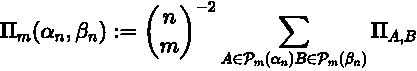**

**情商。(5):小批量 Wasserstein 计划估计量**

**当然，存在一个不完全的估计量，它遵循与等式 1 相同的结构。(4):**

**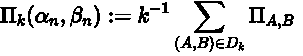**

**情商。(6):小批量 Wasserstein 计划不完全估计量**

**由于现在我们可以估计我们的数量，我们将给出一个小而有用的例子。**

# **1D 案例:迷你批次切片 Wasserstein**

**1D 案例是一个有趣的特例。这很有趣，因为当数据位于 1D 时，我们可以获得接近形式的瓦瑟斯坦距离，然后，我们可以很容易地计算加班计划。1D 案例也是一个广泛使用的距离的基础，切片瓦瑟斯坦距离。计算全部最小批量 OT 计划的公式(等式。(5))可以在论文中找到。**

**我们考虑了源域和目标域的 20 个数据，采用统一的权重，并绘制了几个 ot 场景的平均运输计划。实验显示了不同批量的小批量 OT 计划 *m* 和*正则化变量(熵+ L2)的 OT 计划之间的差异。***

**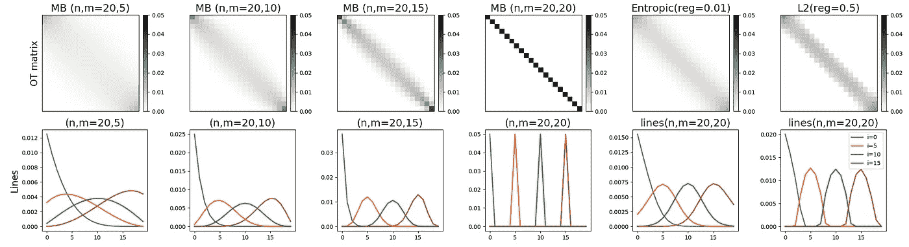**

**1D 措施的不同 OT 问题之间的运输计划[5]**

**我们在**小批量瓦瑟斯坦距离**和**正则化瓦瑟斯坦变异之间看到了**相似的效应**。**我们得到**个样本之间的非最优连接**。对于小批量 Wasserstein 距离，当 *m* 减少时**连接数量增加。当正则化系数变大时，它类似于熵 OT 变量。人们还可以注意到，当批量减少时，连接的最高强度降低，这是由于约束。既然我们已经看到了小批量对运输计划的影响，让我们回顾一下损失的性质。****

# **基本属性**

**由于我们有了一个新的损失函数，有必要回顾它的优点和缺点，以比较概率分布。它具有以下属性:**

*   **对于 *iid* 数据， ***U*** 和***ũ***是 Eq 的无偏估计量。(2)**
*   *****U*** 和***ũ***的论点是对称的**
*   *******严格来说是*** 阳性****
*   *****U(*** α，α)和***ũ(***α，都是 ***严格意义上的*** 正**

**这里有趣的属性是最后一个。对于非平凡测度，我们打破了可分性距离公理。因此， ***minibatch Wasserstein 距离不是距离*** 。这是获得数字速度的代价。我们将在梯度流实验中强调这种效应。**

**由于我们不知道分布 *α* 和 *β，*我们想知道等式。(2)可以用等式有效地估计。(4).**

# **统计特性**

**我们的不完全估计器定义了一个 ***不完全双样本 U-统计量*** 。U-statistics 是由 Hoeffding 在 60 年代开发的[6]。使用 Hoeffding 不等式，可以得到我们的估计量围绕其期望值的偏差界限，概率为 1-δ:**

**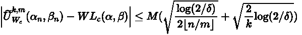**

**其中 *M* 是支撑α和β的大小。这个偏差范围表明，如果我们增加数据 *n* 和批次 *k* 的数量，同时保持小批次大小固定，误差会以指数速度收敛到 0。值得注意的是，界限不依赖于数据的维度，这在高维优化时是一个有吸引力的属性。**

**对于生成模型，我们发现小的 *k* 足以获得有意义的结果，但是使用小批量会导致更长的训练时间。**

**运输计划和边际利润也有类似的性质。预计运输计划与 *1/n* 之间的偏差概率为 1-δ:**

**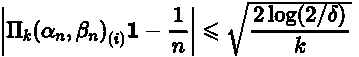**

**到边缘的距离**

**因为我们知道我们的损失有很大的统计性质，我们知道要研究是否可以用现代优化框架将其最小化。**

# **SGD 的无偏梯度**

**众所周知，经验 Wasserstein 距离相对于连续测量值之间的 Wasserstein 距离具有偏差梯度[7]。这种偏差使得最小化经验 Wasserstein 距离不会导致连续测量之间的 Wasserstein 距离最小化。**

**与 Wasserstein 距离不同，***mini batch wasser stein***具有很好的属性，即具有 ***无基底梯度*** ，因此我们可以使用 SGD 和我们的不完全估计量来最小化连续测量之间的损失。**

**这一结果在熵 OT 变体中得到了证明。与瓦瑟斯坦距离不同，熵 OT 处处可微。这是我们证明的一个基本要素。它允许我们使用无偏估计量和微分引理来证明无偏梯度。然而，我们在实践中使用迷你批次 Wasserstein 距离时没有遇到任何问题。**

# **生成模型**

**我们举例说明了生成模型的小批量 Wasserstein 损失的使用。目标是学习生成模型以生成接近目标数据的数据。我们绘制了 8000 个点，它们遵循 2D 的 8 个不同的高斯模式(每个模式 1000 个点),其中模式形成一个圆。生成数据后，我们使用迷你批次 Wasserstein 距离和迷你批次 Sinkhorn 散度作为平方欧几里德成本的损失函数，并将它们与 WGAN [1]及其具有梯度惩罚 WGAN-GP [8]的变体进行比较。**

**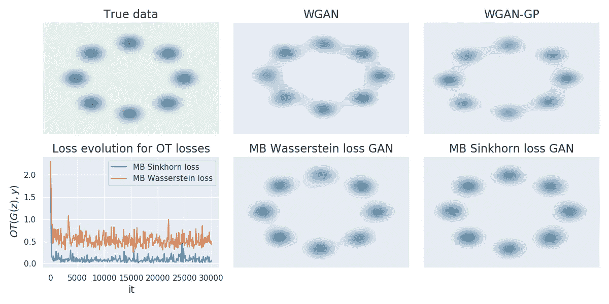**

**高斯模式生成[5]**

**我们看到，我们能够按照不同的模式生成数据。在 CIFAR 10 数据集上使用 minibatch Sinkhorn 散度的更广泛的结果可在[3]中获得。**

# ****梯度流量****

**在本节中，我们将介绍小型 Wasserstein 梯度流的使用。我们考虑来自名人数据集的 5000 张男性和 5000 张女性图像，并希望在男性和女性图像之间应用梯度流。梯度流的目的是模拟一个分布，该分布在每次迭代中遵循梯度方向，使最小批次 Wasserstein 距离最小化。形式上，我们对以下等式进行积分:**

**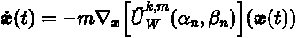**

**对于这个实验，我们将批量大小 *m* 设置为 500，将批量对数量 *k* 设置为 10。**

**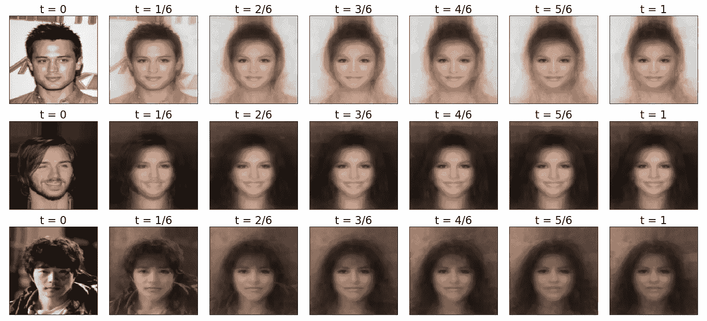**

**5000 个男性图像和 5000 个女性图像之间的梯度流实验[5]**

**我们看到沿着梯度流动的图像的自然演变。然而最后的结果有点模糊。这是因为事实上**小批量 Wasserstein 距离不是距离**，并且我们**与目标分布**不匹配。**

# **大规模颜色转移**

**我们还用我们的方法进行了颜色转移实验。颜色传输的目的是转换源图像的颜色，使其符合目标图像的颜色。最优运输是解决这个问题的一个众所周知的方法[9]。两点云图像之间的传输计划通过使用重心投影给出了传输颜色映射。其思想是使用已开发的小批量运输计划估计器，该估计器具有较小的内存和计算成本。我们使用了两张各为 1M 像素的图像，几个批次大小和批次数量。据我们所知，这是第一次有一种方法能够处理大规模的颜色转换。**

**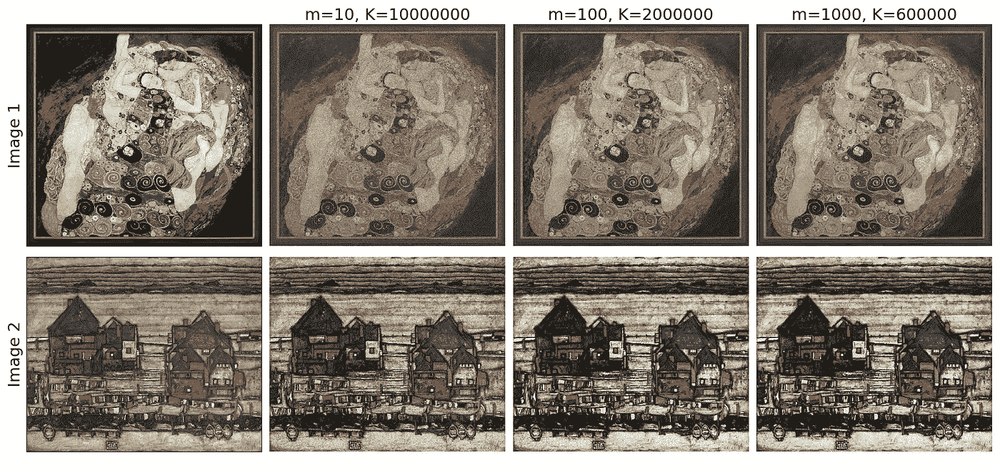**

**大规模彩色转印[5]**

**我们可以看到，当批量太小时，颜色的多样性下降，就像熵解算器对大正则化参数所做的那样。这显然是由于源样本和目标样本之间的大量连接。然而，即使对于 100 万像素，1000 的批量大小也足以保持良好的颜色多样性。**

# **结论**

**在这篇文章中，我们描述了小批量 Wasserstein 距离。一个 Wasserstein 距离变量，其目的是计算迷你批次上的原始 Wasserstein 距离。我们描述了一个形式，这个损失函数的基本性质，渐近性质，最后，优化程序。然后我们通过三个不同的实验研究了它的用途。关于我们如何改善迷你批次 Wasserstein 距离还有许多问题，我们将在未来的博客帖子中详细介绍。**

# **文献学**

**[1]马丁·阿尔乔夫斯基，苏史密斯·钦塔拉，莱昂·博图。[瓦瑟斯坦甘](https://arxiv.org/abs/1701.07875)，ICML 2017**

**[2] BB Damodaran，B Kellenberger，R Flamary，D Tuia，N Courty，“ [DeepJDOT:无监督域适应的深度联合分布最优传输](https://arxiv.org/abs/1803.10081)”，ECCV 2018。**

**[3]奥德·热纳维、加布里埃尔·佩尔、马尔科·库图里。[用 sinkhorn 分歧学习生成模型](https://arxiv.org/abs/1706.00292)，AISTATS 2018**

**[4]加布里埃尔·佩尔，马尔科·库图里。[计算最优运输](https://arxiv.org/abs/1803.00567)，基础与趋势**

**[5]基利安·法特拉斯、尤尼斯·津、雷米·弗拉芒里、雷米·格里邦瓦尔、尼古拉斯·库蒂。[用 minibatch Wasserstein 学习:渐近和梯度性质](https://arxiv.org/abs/1910.04091)，AISTATS 2020**

**[6]瓦西里·赫夫丁。[有界随机变量和的概率不等式](https://link.springer.com/chapter/10.1007%2F978-1-4612-0865-5_26)，美国统计协会杂志 1963 年**

**[7]马克·贝勒马尔、伊沃·达尼埃尔卡、威尔·达布尼、沙基尔·穆罕默德、巴拉吉·拉克什米纳拉亚南、斯蒂芬·霍耶、雷米·穆诺斯。[Cramer 距离作为有偏 wasserstein 梯度的解决方案。](https://arxiv.org/abs/1705.10743)**

**[8]伊桑·古尔拉贾尼、法鲁克·艾哈迈德、马丁·阿尔约夫斯基、文森特·杜穆林、亚伦·库维尔。[wasser stein GANs 的改进培训](http://papers.nips.cc/paper/7159-improved-training-of-wasserstein-gans)，NIPS 2017**

**[9]西拉·费拉丹斯、尼古拉·帕帕达基斯、朱利安·拉宾、加布里埃尔·佩雷、让-弗朗索瓦·奥约尔。[正则化离散最优运输](https://link.springer.com/chapter/10.1007/978-3-642-38267-3_36)。计算机视觉中的尺度空间和变分法。**