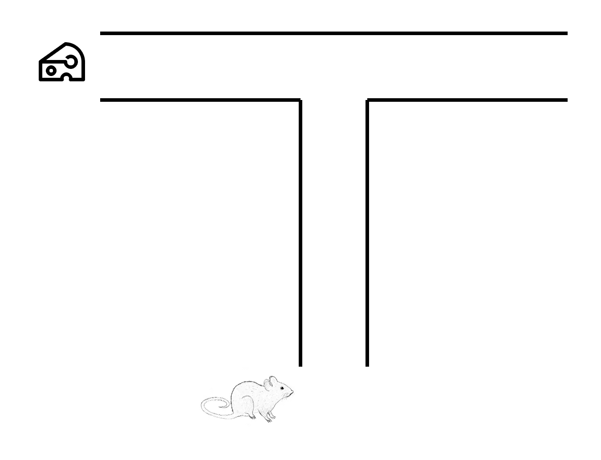

# 在不确定中学习

> 原文：<https://towardsdatascience.com/learning-with-uncertainty-591f2cdee7?source=collection_archive---------35----------------------->

## 强化学习导论

现代强化学习背后的思想建立在试错学习和计算自适应控制的理论之上。这些方法的总体目标是构建一个代理，当它在反馈循环中与随机环境交互时，它可以最大化某个行为的回报。在面对不确定性时，代理通过从环境中接收到的响应来更新其决策策略。

**通用强化学习框架。**智能体在反馈配置中与环境交互，并根据它从环境中获得的响应更新其选择动作的策略。

试错搜索是从动物心理学领域学习行为的一种方法。桑代克、巴甫洛夫和斯金纳是这个学习领域的主要支持者。试错学习理论关注的是主体如何通过加强或削弱心理联系来学习行为，这种心理联系是基于主体在执行特定动作后从环境中感知到的满意或不满意(Thorndike，1898)。这种学习的想法被称为“效果法则”，其中“满意”是基于“奖励”的伴随行为的强化，“不适”导致由于“惩罚”而导致的行为中止。B.F. Skinner 在他关于操作性条件作用的工作中进一步探讨了这些奖励和惩罚的想法，该工作假设代理人根据刺激或行动自愿加强其行为，导致来自环境的反应(Skinner，1938)。另一方面，巴甫洛夫的经典条件作用认为，刺激的配对(其中第一个是无条件刺激)通过主体的行为产生了非自愿的反应(巴甫洛夫，1927)。这两种学习的行为理论都涉及到某种刺激对反应的联合配对的概念，由此一个主体的行为受到反馈循环中重复动作的制约。

**T 型迷宫。**T 型迷宫用于条件反射实验，以检查啮齿动物在使用不同时间表的连续试验中学习寻找食物的行为。

试错学习和效果法则有两个不同的特性影响了现代强化学习技术，因为它们是选择性的和联想性的。现代 RL 是选择性的，因为对于环境的特定状态，一个动作是从一组动作中取样的，它是关联的，因为有利的动作及其关联状态被记住(即存储在记忆中)(萨顿和巴尔托，1998)。

自适应控制领域涉及学习复杂动态系统中控制器(或代理)的行为，其中受控系统的参数中存在不确定性。(Bellman，1961)将控制问题分为确定性、随机性和适应性。在自适应控制系统中，系统中存在相当大的不确定性，对环境的结构或参数的分布知之甚少。虽然可以使用实验来获得关于系统的一些信息，但是所花费的时间将使得这种方法不可行。因此，需要在“在线”配置中学习控制器的行为。(Bellman，1957a)将 Bellman 方程展示为捕捉动态系统的状态和值函数的函数，并引入动态规划作为寻找自适应控制问题的最优控制器的一类方法。(Bellman，1957b)将马尔可夫决策过程(MDP)公式化为离散时间随机控制过程，用于建模强化学习框架，其中主体在反馈回路中与环境交互。Markov 属性假设当前状态获取了预测下一个状态及其预期响应所需的所有信息，而不依赖于先前的状态序列。换句话说，马尔可夫性质是环境的未来状态仅依赖于当前状态的条件概率。因此，如果我们知道当前状态，它就有条件地独立于过去的状态。MDP 基于环境状态具有马尔可夫性的理论假设。

# 文献学

*   巴甫洛夫 IP (1927)。由 Anrep GV 翻译。“条件反射:大脑皮层生理活动的调查”。大自然。121 (3052): 662–664.Bibcode:1928Natur.121..662D。doi:10.1038/121662a0。
*   斯金纳 B. F. (1938)。生物行为:实验分析。阿普尔顿世纪。
*   萨顿和巴尔托(1998 年)。强化学习导论(第 2 卷第 4 期)。剑桥:麻省理工学院出版社。
*   桑代克，E. L. (1898)。动物智力:动物联想过程的实验研究。心理学评论:专论增刊，2(4)，i-109。[https://doi.org/10.1037/h0092987.](https://doi.org/10.1037/h0092987.)
*   萨顿和巴尔托(1998 年)。强化学习:导论。麻省理工出版社。
*   贝尔曼，R. E. (1961)。自适应控制过程——指南之旅。普林斯顿:普林斯顿大学出版社。
*   贝尔曼，R. E. (1957a)。动态编程。普林斯顿:普林斯顿大学出版社。
*   贝尔曼，R. E. (1957b)。马尔可夫决策过程。数学与力学杂志，6(5)，679–684。从 www.jstor.org/stable/24900506.[取回](http://www.jstor.org/stable/24900506.)

*最初发表于*[*【https://ekababisong.org】*](https://ekababisong.org/rl-theory-practice/learning-with-uncertainty/)*。*