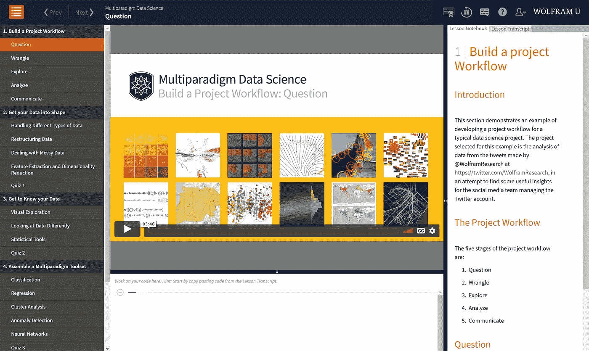
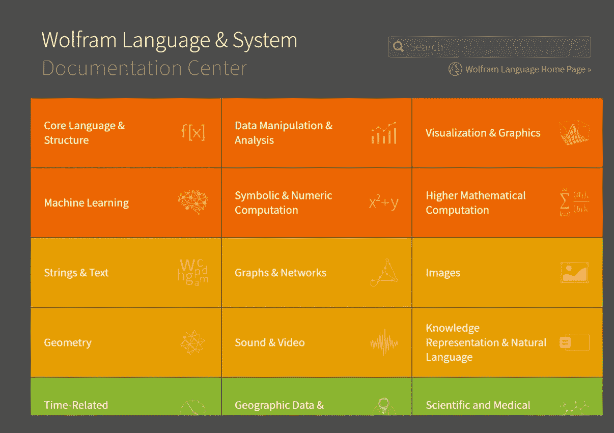

# 学习 Wolfram:从零到英雄

> 原文：<https://towardsdatascience.com/learning-wolfram-from-zero-to-hero-2ac4fd6914d9?source=collection_archive---------32----------------------->

## 通过这一快速介绍，快速启动您的数据科学能力

照片由[海伦娜·洛佩斯](https://unsplash.com/@wildlittlethingsphoto?utm_source=unsplash&utm_medium=referral&utm_content=creditCopyText)在 [Unsplash](https://unsplash.com/s/photos/laptop-cafe?utm_source=unsplash&utm_medium=referral&utm_content=creditCopyText) 拍摄

Wolfram 语言提供了一个超级丰富的笔记本界面和数千个精心设计的函数，让数据科学项目变得令人愉悦。借助优秀的教程、详尽的参考文档和上下文相关的帮助，现在开始使用 Wolfram 语言比以往任何时候都更容易。

作为一名长期使用 Wolfram 语言的程序员，我认为分享一下我对如何将这个强大的应用程序添加到您的数据科学技能组合中的看法会很有用。

(图片由作者提供)

开始的最好地方是“[程序员快速入门](https://www.wolfram.com/language/fast-introduction-for-programmers/en/)”教程。它出色地介绍了从定义函数的基础到更高级的主题，如构建界面和将笔记本、图形和图像部署到 Wolfram Cloud。每个部分都有一个视频，涵盖了相同的主题，这给了你另一个很好的学习选择。

 [## Wolfram 语言教程:程序员快速入门

### 花几分钟时间阅读本教程，快速掌握 Wolfram 语言的基础。几乎…

www.wolfram.com](https://www.wolfram.com/language/fast-introduction-for-programmers/en/) 

您可以通过点击教程中的“入门”按钮立即开始使用 Wolfram 语言。这将在 Wolfram Cloud 中打开一个笔记本，不需要下载或注册任何东西。只需尝试教程中的例子，并开始尝试！

磨练编程技能的下一步是访问“Wolfram U”学习网站。

 [## Wolfram U:面向学生和专业人士的开放课程

### 为 Mathematica、Wolfram 语言、数据科学、机器等开放课程、课堂、培训、免费视频和活动

www.wolfram.com](https://www.wolfram.com/wolfram-u/) 

对于数据科学家来说，在“[数据科学&统计学](https://www.wolfram.com/wolfram-u/catalog/data-science-statistics/)”部分有一些非常非常好的课程和视频。这里的主要课程“多层面数据科学”是一门在线课程，包含带解说的视频、带代码的笔记本，可用于临时编码区:

(图片由作者提供)

每个部分都有一个小测验，所以你可以很容易地测试自己。

在这一点上，我建议注册一个免费的基本 Wolfram 云。这使您能够在学习语言的同时进行疯狂的编程实验:

 [## 沃尔夫拉姆云

### Wolfram 语言的云访问。

www.wolframcloud.com](https://www.wolframcloud.com/) 

另一个选择是为开发者下载免费的 Wolfram 引擎。这使您可以访问本地机器上的核心语言。它不包括漂亮的 [Wolfram 笔记本接口](https://www.wolfram.com/notebooks/)，但是你可以把这个引擎挂在 [Jupyter 笔记本接口](https://github.com/WolframResearch/WolframLanguageForJupyter)上。

此外，许多人已经为各种 ide 开发了插件，这些插件都列在开发人员的主资源页面上:

 [## 面向软件开发人员的 Wolfram

### Wolfram 技术堆栈使您能够在几分钟内开发和部署一个有用的应用程序，并构建…

www.wolfram.com](https://www.wolfram.com/developer/) 

如果你想体验完整的 Wolfram 笔记本界面(而且我强烈推荐这个！)您可以从 Wolfram 桌面试用版开始，此处提供:

 [## Wolfram|One:云桌面计算平台

### 云+桌面上的高级混合计算平台。利用以下各项的全部功能，让您的发展更进一步

www.wolfram.com](https://www.wolfram.com/wolfram-one/) 

最后，在 Wolfram 语言中保持高效的最佳长期资源是[广泛的参考文档](https://reference.wolfram.com/language/)，它们被深度集成到笔记本中。至少有两个很棒的用户社区，你可以在那里提问。首先是 [Wolfram 社区](https://community.wolfram.com/)，这不仅是一个提问的好地方，也是一个与他人分享你的工作的好地方。其次，[Mathematica&Wolfram Language Stack Exchange](https://mathematica.stackexchange.com/)网站非常适合提问(和回答)问题。

(图片由作者提供)

我希望这对您有用，并祝您在下一个数据科学项目中好运！