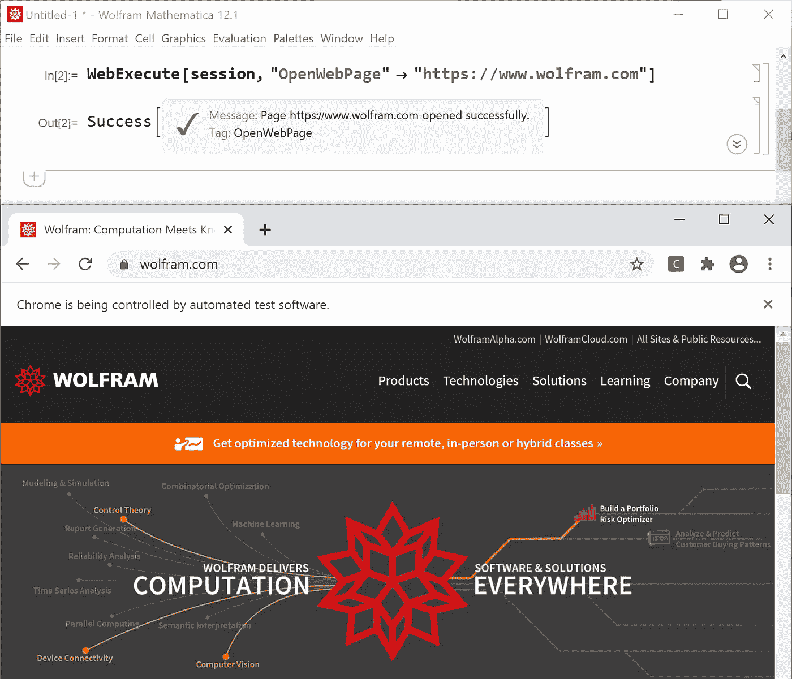
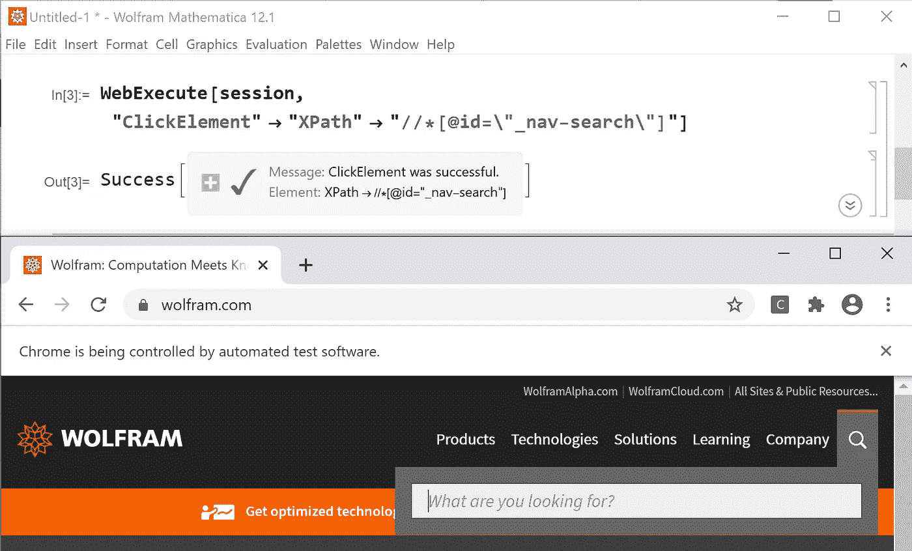
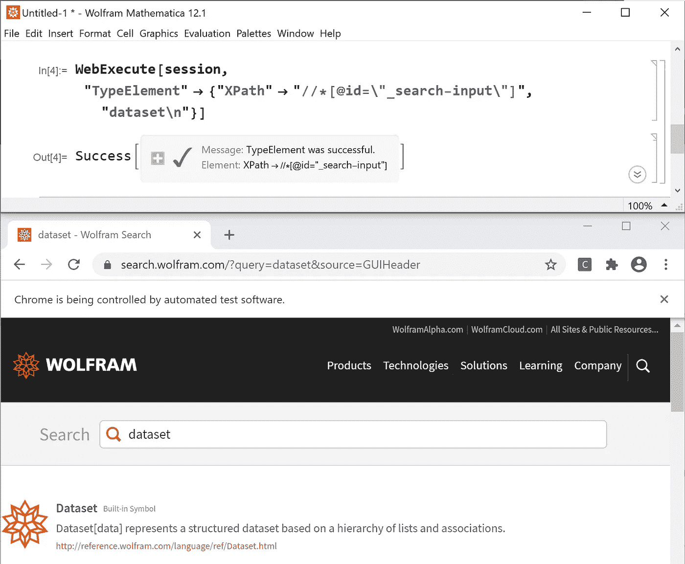
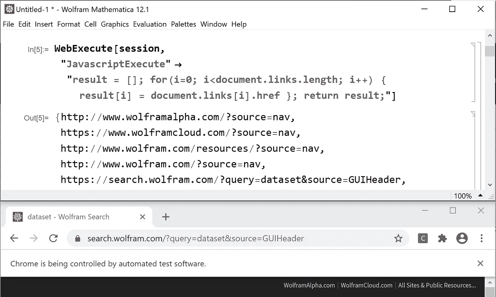
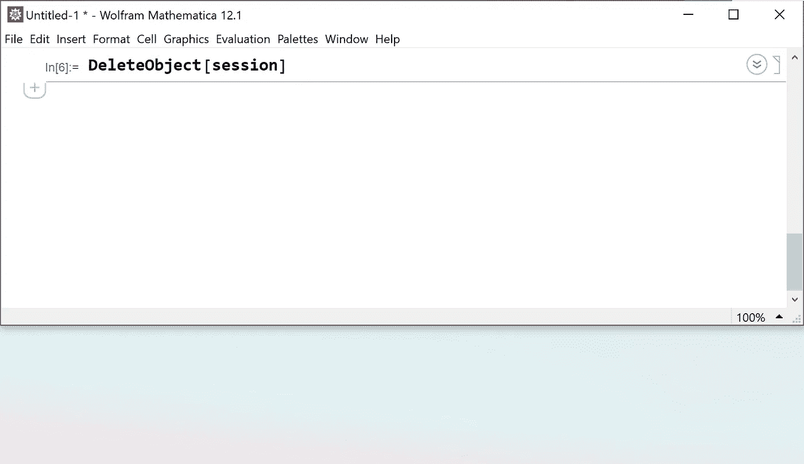

# 学习 Wolfram:与 Web 浏览器交互

> 原文：<https://towardsdatascience.com/learning-wolfram-interacting-with-web-browsers-29900c1a5cea?source=collection_archive---------48----------------------->

## 自动化您的 Web 测试和浏览工作流

杰克·范德斯波尔在 [Unsplash](https://unsplash.com/s/photos/web-browser?utm_source=unsplash&utm_medium=referral&utm_content=creditCopyText) 上的照片

当我在质量保证部门工作时，我的工作之一是在一些网站上做回归测试。那时只有有限的自动化工具，所以我的解决方案包含了发布鼠标和按键事件的 [Java 机器人类](https://docs.oracle.com/javase/7/docs/api/java/awt/Robot.html)。这当然非常脆弱。

最近，自动化 web 浏览器交互变得更加容易。WebDriver 协议指定了一组非常好的命令和交互来与浏览器对话。Wolfram 语言(WL)使用这个协议让你直接从一个[笔记本](https://www.wolfram.com/notebooks/)会话中控制浏览器。笔记本的交互特性非常适合增量开发 web 自动化工作流。在这个故事中，我将向您展示如何开始使用这个功能。

要启动一个新的 web 浏览器会话，您可以使用 [StartWebSession](https://reference.wolfram.com/language/ref/StartWebSession.html) 命令。如果没有函数参数，它将在你的电脑上启动一个 Chrome 浏览器。也支持 Firefox 浏览器。

(图片由作者提供)

要打开网页，您可以使用 [WebExecute](https://reference.wolfram.com/language/ref/WebExecute.html) 命令。此命令是您用来控制 web 浏览器的主要功能。您指定会话，并给它一个命令，如“open 网页”、“ClickElement”或“JavascriptExecute”:

(图片由作者提供)

例如，要单击搜索图标(右上角的放大镜)，您可以通过它的 XPath 或 CSS 选择器来引用它。你可以在浏览器的开发者控制台找到这些。一个写得好的 web 页面为特定的元素使用惟一的 ID，在这种情况下，ID 是“_nav-search”。执行该命令会在浏览器中显示搜索栏:

(图片由作者提供)

同样，您可以在输入栏中键入文本。例如，如果我想搜索“数据集”，我可以指定元素和搜索文本。通过在字符串末尾添加一个“\n”(换行符)来模拟按 enter 键:

(图片由作者提供)

为了检索和检查页面内容，我通常使用一小段 javascript。例如，检索页面上所有链接的 URL 的一种方法是，我使用下面的 javascript 代码片段:

(图片由作者提供)

结果是一个 WL 字符串列表，该列表可用于回归测试或进一步的导航步骤。同样，您可以收集网页上所有图像的 URL，然后将这些图像直接导入到您的 WL 会话中以供进一步检查。

当您完成浏览器会话时，您可以使用 DeleteObject 命令来结束它。这将关闭 web 浏览器并结束连接:

有关这一有用功能的更多信息，请查看 [Web 浏览器自动化](https://reference.wolframcloud.com/language/guide/WebBrowserAutomation.html)的指南页面。要了解更多关于 WL 的入门知识，请查看我最近的一篇名为“[学习 Wolfram:从零到英雄](/learning-wolfram-from-zero-to-hero-2ac4fd6914d9)”的文章。上面图片中显示的完整代码的笔记本可以从[这里](https://www.wolframcloud.com/obj/arnoudb/Published/Web-Browser-Automation.nb)获得。只需点击该链接，然后将笔记本下载到您的桌面上。