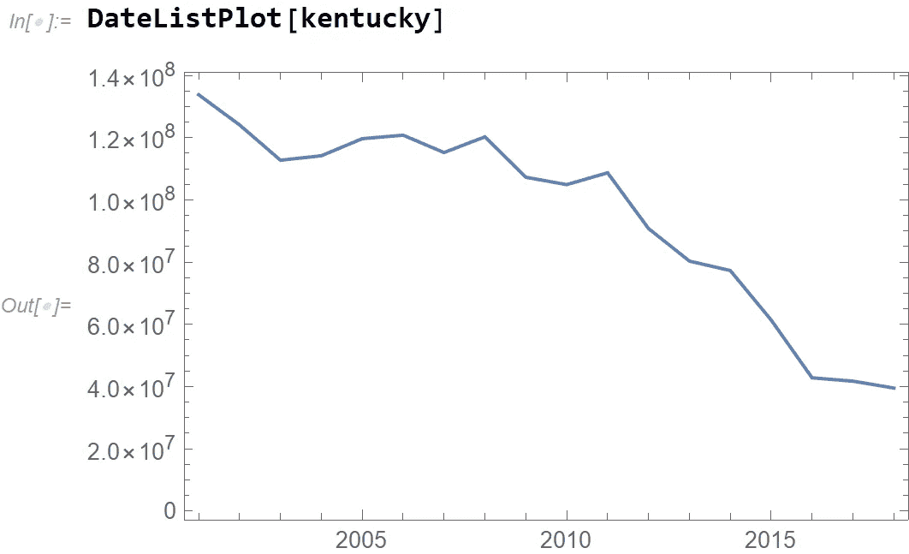
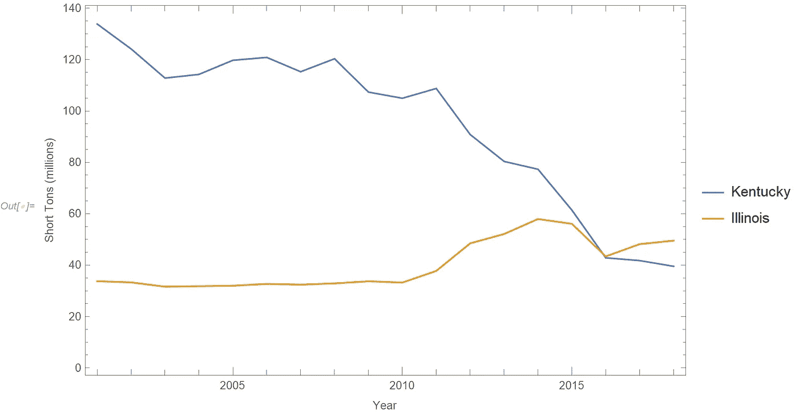
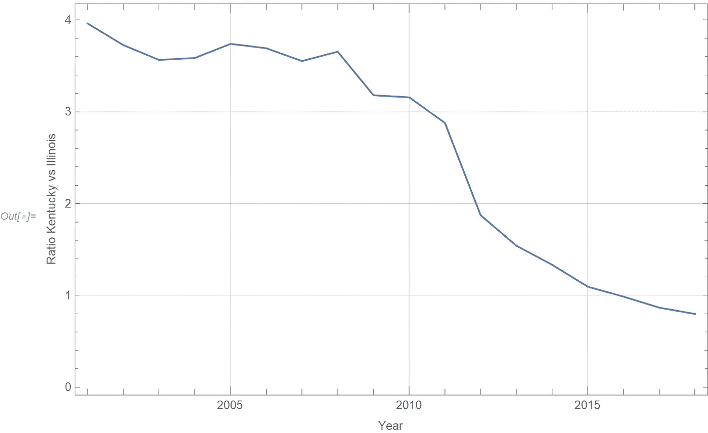
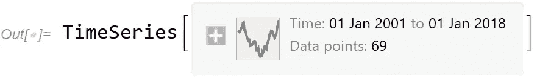
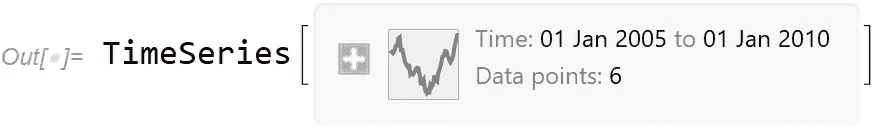
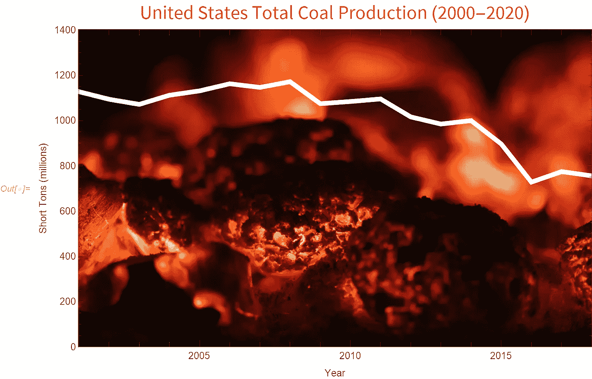

# 学习 Wolfram:使用时间序列

> 原文：<https://towardsdatascience.com/learning-wolfram-working-with-timeseries-a7e8e91174ab?source=collection_archive---------38----------------------->

## 一个关于美国煤炭生产的计算思维故事


作者在 [Unsplash](https://unsplash.com/s/photos/coal?utm_source=unsplash&utm_medium=referral&utm_content=creditCopyText) 上使用[paweczerwiński](https://unsplash.com/@pawel_czerwinski?utm_source=unsplash&utm_medium=referral&utm_content=creditCopyText)的照片制作的图片

在世界范围内，煤炭正被其他形式的能源慢慢取代，以帮助减少地球大气中的温室气体。在美国，美国能源信息署(EIA)收集能源信息，如一段时间内的煤炭产量。这个故事使用这个时间序列数据来说明 Wolfram 语言中的一些[时间序列](https://reference.wolfram.com/language/ref/TimeSeries.html)功能。

开始之前，我们需要访问 EIA 的数据。我写了一个名为[UnitedStatesCoalProduction](https://www.wolframcloud.com/obj/arnoudb/DeployedResources/Function/UnitedStatesCoalProduction)的简单函数来访问他们的数据 API，并按地区导入煤炭产量数据:

```
UnitedStatesCoalProduction = ResourceFunction[
"user:arnoudb/DeployedResources/Function/UnitedStatesCoalProduction"]
```

调用这个函数有两个参数。第一个参数使用类似“KY”的代码来指定区域。第二个论据是 API *key* 可以从 EIA 网站获取。如何操作的详细信息记录在[功能参考文件](https://www.wolframcloud.com/obj/arnoudb/DeployedResources/Function/UnitedStatesCoalProduction)页。调用该函数的典型方法如下:

```
kentucky = UnitedStatesCoalProduction["KY",key]
```

这将返回一个 TimeSeries 对象。在 Wolfram 笔记本中，总是大量使用排版显示格式，它用一个摘要框来格式化:


(图片由作者提供)

时序对象可直接用于可视化功能，如[日期列表图](https://reference.wolfram.com/language/ref/DateListPlot.html):



(图片由作者提供)

时序对象可以直接用于常见的统计函数。请注意所有煤炭产量数字是如何与其单位(短吨)一起存储的。跟踪单位总是有用的，尤其是在处理多个数据集和不同单位时:

```
In[.]:= Mean[kentucky]Out[.]= Quantity[9.53609*10^7, "ShortTons"]
```

让我们来看另一个数据集，伊利诺伊州的:

```
illinois = UnitedStatesCoalProduction["IL", key]
```

我们可以将这两个数据集绘制在一起，并用清晰的标签来修饰这个图。我将 y 轴换算成百万短吨，让人类更容易读懂:

```
DateListPlot[
 {kentucky, illinois}/10^6,
 PlotLegends -> {"Kentucky", "Illinois"}, 
 FrameLabel -> {"Year", "Short Tons (millions)"}
]
```



(图片由作者提供)

显然，肯塔基州的煤炭产量下降了很多，而伊利诺伊州在过去十年中实际上增加了产量。

Wolfram 语言中的时序对象处理基本的数学运算，如加、减、除和乘。例如，为了比较肯塔基州和伊利诺伊州的煤炭产量比率，简单地划分时间序列:

```
DateListPlot[kentucky / illinois,
 FrameLabel -> {"Year", "Ratio Kentucky vs Illinois"},
 GridLines -> Automatic
]
```



(图片由作者提供)

时间序列可以在其他时间间隔重新采样。当您需要比较两个具有不相容间隔的时间序列时，这可能会很有用。对时间序列进行重采样可以使数据标准化。以下示例显示了如何以三个月的时间间隔进行重新采样。

```
TimeSeriesResample[kentucky, Quantity[3, "Months"]]
```



(图片由作者提供)

要提取具有开始和结束日期/时间的时间序列的一部分，可以使用 TimeSeriesWindow 函数。例如，这将提取 2005–2010 年的时间序列数据:

```
TimeSeriesWindow[kentucky, {
 DateObject[{2005}, "Year"],
 DateObject[{2010}, "Year"]
}]
```



(图片由作者提供)

有关时序操作相关函数的完整列表，您可以阅读[时序处理](https://reference.wolfram.com/language/guide/TimeSeries.html)文档指南页面。

要制作一个类似于本文顶部所示的非常漂亮的可视化图形，您可以使用我之前关于[如何装扮您的数据可视化](/dressing-up-your-data-visualization-da7b41b15c6f)的文章中的提示和技巧。

```
us = UnitedStatesCoalProduction["US", key];
DateListPlot[us/10^6, 
 PlotRangePadding -> None, PlotRange -> {0, 1400},
 PlotStyle -> Directive[White, AbsoluteThickness[5]],
 PlotLabel -> Style["United States Total Coal Production (2000-2020)", "Subsection"], 
 FrameLabel -> {"Year", "Short Tons (millions)"},
 ImageSize -> Large, Prolog -> Inset[image, Center, Center, Scaled[{1.2, 1.2}]]]
```



作者在 [Unsplash](https://unsplash.com/s/photos/coal?utm_source=unsplash&utm_medium=referral&utm_content=creditCopyText) 上使用了[paweczerwiński](https://unsplash.com/@pawel_czerwinski?utm_source=unsplash&utm_medium=referral&utm_content=creditCopyText)的照片