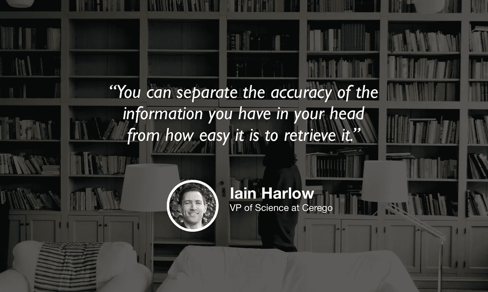

# 离开学术界进入工业界，优化你的学习方式

> 原文：<https://towardsdatascience.com/leaving-academia-for-industry-and-optimizing-how-you-learn-9ca9978e2868?source=collection_archive---------17----------------------->

## [苹果](https://podcasts.apple.com/ca/podcast/towards-data-science/id1470952338?mt=2) | [谷歌](https://www.google.com/podcasts?feed=aHR0cHM6Ly9hbmNob3IuZm0vcy8zNmI0ODQ0L3BvZGNhc3QvcnNz) | [SPOTIFY](https://open.spotify.com/show/63diy2DtpHzQfeNVxAPZgU) | [其他](https://anchor.fm/towardsdatascience) | [剪辑](https://www.youtube.com/watch?v=E37wnNoLEEs)

## 伊恩·哈洛在 [TDS 播客](https://towardsdatascience.com/podcast/home)

*编者按:迈向数据科学播客的“攀登数据科学阶梯”系列由 Jeremie Harris 主持。Jeremie 帮助运营一家名为*[*sharpes minds*](http://sharpestminds.com)*的数据科学导师初创公司。可以听下面的播客:*

我不记得有多少次我忘记了一些重要的事情。

不过，我确信这是经常发生的事情:我经常忘记宝贵的生活经验、技术概念和有用的统计理论。更糟糕的是，我经常在努力学习之后忘记这些事情，所以我的健忘完全是浪费时间和精力。

这就是为什么我抓住机会与 Cerego 的科学副总裁 Iain Harlow 聊天的原因，Cerego 是一家通过优化信息提供方式来帮助企业为员工建立培训课程的公司，以最大限度地保留和学习成果。

Iain 非常了解学习，并就如何优化自己的学习提出了一些很好的见解，但他在解决数据科学问题和聘用数据科学家方面也有很多专业知识，这是他在 Cerego 工作中关注的两件事。他也是学术界的资深人士，并分享了一些关于学术界研究和工业界研究之间差异的有趣观察。

我们的谈话涵盖了很多领域，但以下是我最喜欢的一些要点:

*   当你忘记某件事时，通常并不是你的大脑失去了曾经拥有的关于那件事的信息。相反，我们容易忘记事情，因为我们的大脑不记得我们在寻找的信息存储在哪里。打个计算机科学的比方，遗忘有点像失去了指向包含我们试图检索的信息的内存地址的指针:数据存储在某个地方，只是我们想不起在哪里。
*   这种观点的一个含义是，一旦学会了信息，练习检索信息比大多数人认为的更重要。虽然这与直觉相反，但定期测试你的知识与一开始就学习它一样重要，因为它迫使你练习回忆。
*   学术界的生活和工业界的生活最大的区别之一就是批评。在学术界，所有的想法都倾向于被怀疑和批判，而在工业界，大多数人会认为他们周围的人知道他们在做什么。虽然这可以在短期内让事情变得更令人愉快，但这也意味着行业数据科学家、分析师或机器学习工程师有更多的责任来确保他们的工作检查无误。
*   产品直觉真的很重要，它通常伴随着专业知识。你对你的客户、你的用户群或你的问题空间了解得越多，你就越能更好地识别你的模型成功所需的特征。
*   因此，公司非常关心你培养产品意识的能力。最好的方法是通过个人项目，使用独特或不寻常的数据集，迫使你问这样的问题，“我能从这些数据中获得什么价值？”
*   求职者通常认为面试就像是大学考试，被设计成一系列“抓住你”的问题。在现实中，面试官通常利用工作面试来筛选解决问题的能力，而不在乎“得分”表现。这似乎是一个微妙的区别，但它很重要:这意味着在许多情况下，你的分析和沟通能力比原始的技术能力更重要。因此，实践你的数据故事和产品直觉是一个很大的优势。

## [夹子](https://www.youtube.com/watch?v=E37wnNoLEEs)

你可以[在 Twitter 上关注伊恩](http://twitter.com/@iain_harlow)，你也可以在 Twitter 上关注我[在这里](https://twitter.com/jeremiecharris)。

你也可以在 [Twitter](http://twitter.com/cerego) 、[脸书](http://facebook.com/teamcerego)或 [LinkedIn](http://linkedin.com/company/cerego) 上查看 Cerego。

我们正在寻找能与我们的观众分享有价值的东西的客人。如果你碰巧认识一个合适的人选，请在这里告诉我们:[publication@towardsdatascience.com](mailto:publication@towardsdatascience.com)。