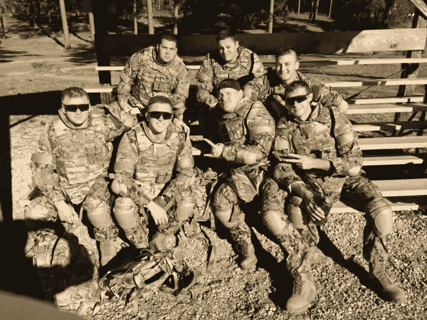

# 战争的教训:作为一名军事分析家我学到了什么

> 原文：<https://towardsdatascience.com/leaving-the-war-12d8f98d7f20?source=collection_archive---------44----------------------->

## 作为一名军事数据分析师，我学到了什么，你如何应用它，以及我为什么离开。

我在美国海军做了 6 年的情报专家，在阿富汗和非洲服过预备役和现役。军事情报训练是学习分析推理、数据分析以及如何发展向大群人展示你的发现的能力的最佳途径之一。

我们被教导成为顶级分析师所需要的一切。以下是我一直铭记在心的三条重要经验。这些经验适用于数据分析领域的所有人。

坐在后面手里拿着 kindle 的是我。

# 分析师的三个教训

第一课:人可能会死

在军事领域，如果你犯了一个错误，有人可能会死。所以，你最好确保你的信息是正确的。在平民世界里，赌注没有那么高，但这个教训是正确的。这可能不是一个人的生命受到威胁，但它可能是一笔重要的销售交易或一次成功的营销活动。仔细检查所有东西。

**如何申请:**

*   **精神饱满地回来:**完成项目后，去散散步或分散注意力，这样你就能精神饱满地回来。当我们在一个项目上工作时，我们的大脑开始疲劳，我们更容易错过小错误。
*   **询问好友:**在分享你的项目之前，把它带给你的好友，询问他们的意见。让他们尽可能批判性地评估它——如果你能给他们一个提示列表就更好了——比如“我的视觉效果清楚吗？”或者“你能仔细检查我的数学吗？”
*   **检查你的资料来源:**对数据来源持批评态度。探索他们的方法，并确保您传达的是来自该数据的正确信息。

**第二课:没人在乎**

注意力是有限的。在军事领域，当我给海军上将或舰长们做报告时，我能看出他们的心思在别处。他们在考虑下一个任务。你组织中的首席执行官和其他领导人也在做同样的事情。他们在考虑下一笔交易或收到的最后一封电子邮件。**你必须能够吸引并保持利益相关者的注意力。**你需要*让*的人关心。

**如何申请:**

*   让他们震惊:当你开始交流你的数据分析时，你应该总是以这样的问题开始:“他们不知道什么？”并以此为线索。你希望能够震撼听众，让他们全神贯注于你。如果你用他们已经熟悉的信息来引导，你最终可能会失去他们。
*   当利益相关者提问时，如果你不知道答案，你可以说:“我会研究一下，然后再给你答复。”这有两个目的——吸引利益相关者的注意力，因为他们希望在未来与你交谈；防止你的陈述偏离轨道。
*   **让它变得别致:**你的图表需要漂亮。花额外的时间学习如何有效地可视化您的数据。想想你的颜色，以及它们是如何搭配的。了解最佳数据可视化实践。我强烈推荐[用 Dat](https://www.amazon.com/Storytelling-Data-Visualization-Business-Professionals/dp/1119002257) a 讲故事作为学习数据可视化最佳实践的良好起点。

第三课:那是什么鬼东西

你一定很好奇。在军事分析领域，我们不断地查看数据并相互询问“这是什么？为什么会这样？这是什么意思？”—我们需要理解数据中更奇怪的部分。在平民世界里，当你在数据中看到一些东西，你会说，“那到底是什么？”不要就此打住——挖到你知道为止。

**如何申请:**

*   **大声说出来:**当你在数据集中遇到异常时，比如地图中的异常值或异常点，你不应该隐瞒。深入探究，试着理解它是如何发生的。询问这对您的其他数据意味着什么。
*   **讲故事:**数据在给你讲故事，你只需要找到它。当回顾数据时，实际上写下你开始看到的故事。在军事领域，这是一份报告。在平民世界，它可能是一个单独的文件，详细说明您的发现。
*   **承认自己的无知:**有时候你只需要承认自己不知道。带着你的问题或疑问去找一个值得信赖的顾问或同事，请他们帮忙解决这个难题。

# 为什么我决定离开

作为一名军事分析家有巨大的压力。人们期望我们做到完美，因为错误的后果可能会导致生命损失。在我们的分析和陈述中，我们不能马虎。我们需要确保自己无可指责。当你面临如此多的风险时，它会从你的工作和生活中吸取快乐。我发现自己在应对焦虑。我变成了一个不健康的完美主义者。我对工作失去了热情。

随着我与军方的合同即将结束，我面临着一个艰难的选择。我应该在这个已经成功的世界里继续吗？或者我应该离开并可能失败？

我对自己的军事记录非常自豪。我获得了三枚军用航空奖章，和我的机组人员一起被提名参加著名的 T2 麦凯奖。我所做的工作拯救了许多人的生命，让我真正感觉到我在为这个世界做出有意义的贡献。

最终，我决定离开军队，加入平民世界，这样我就可以重拾对数据分析的热情。

**下一步是什么？**

我目前正在为 WeWork 学习分析，我发现让我在军队中取得成功的经验也适用于我目前的职业生涯。我希望我对数据分析的热情能够为个人和公司解决现实世界的挑战。

如果你想听更多，想看我的旅程， [**和我在 twitter**](https://twitter.com/_stalsh) 联系。