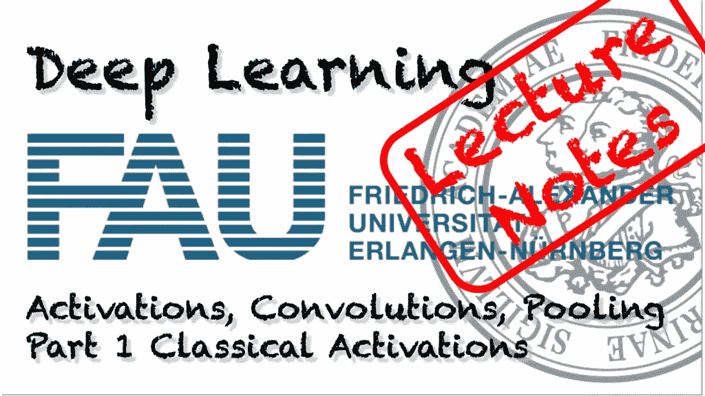
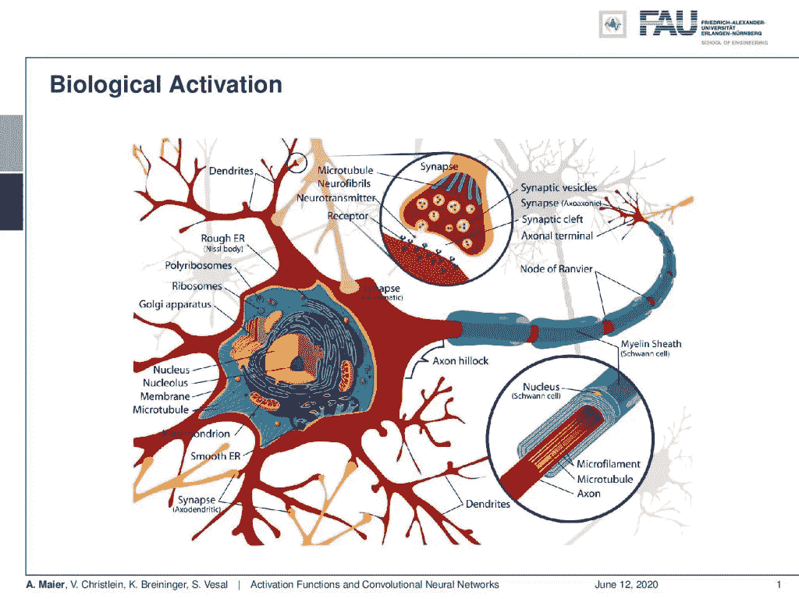
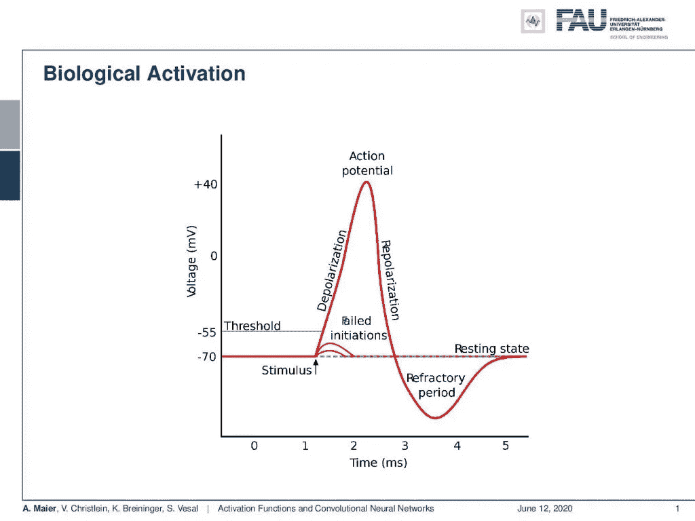
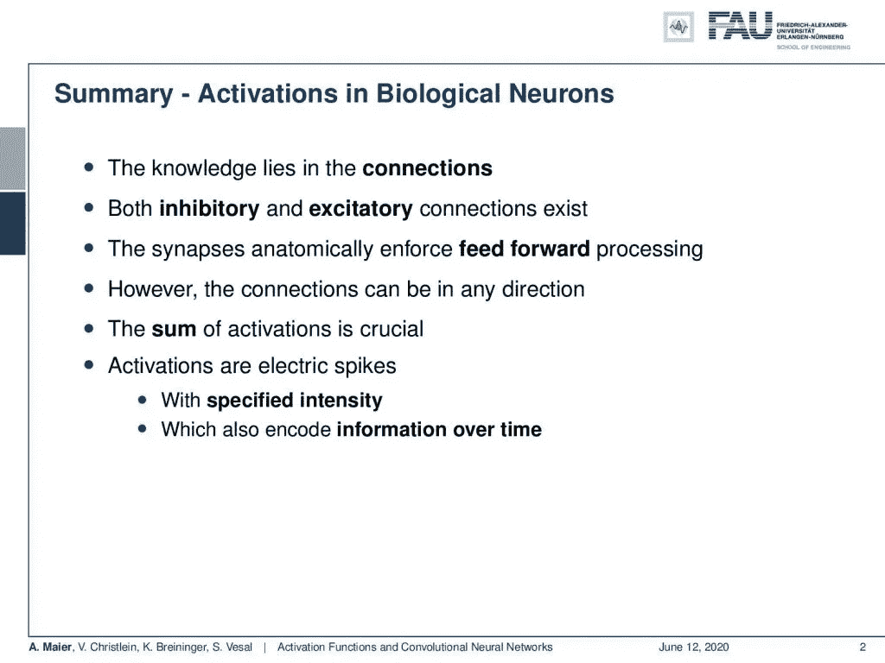
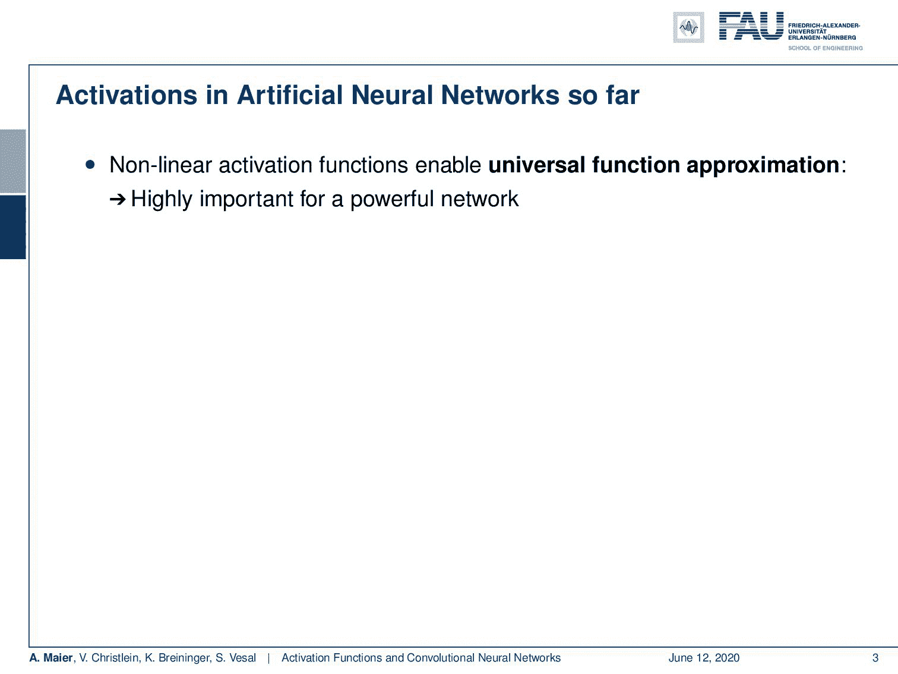
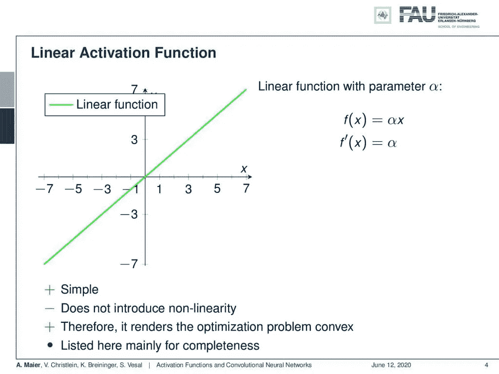
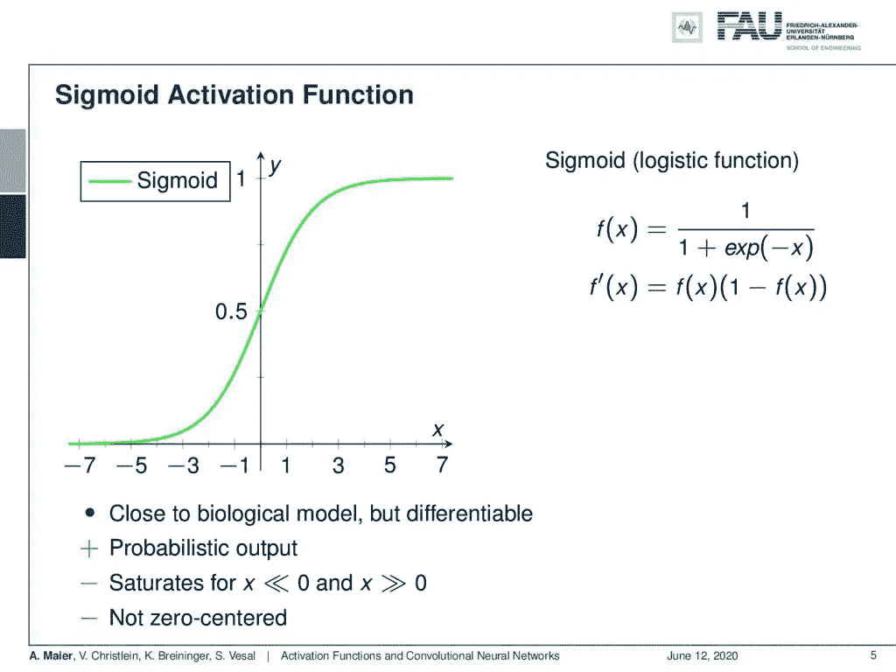
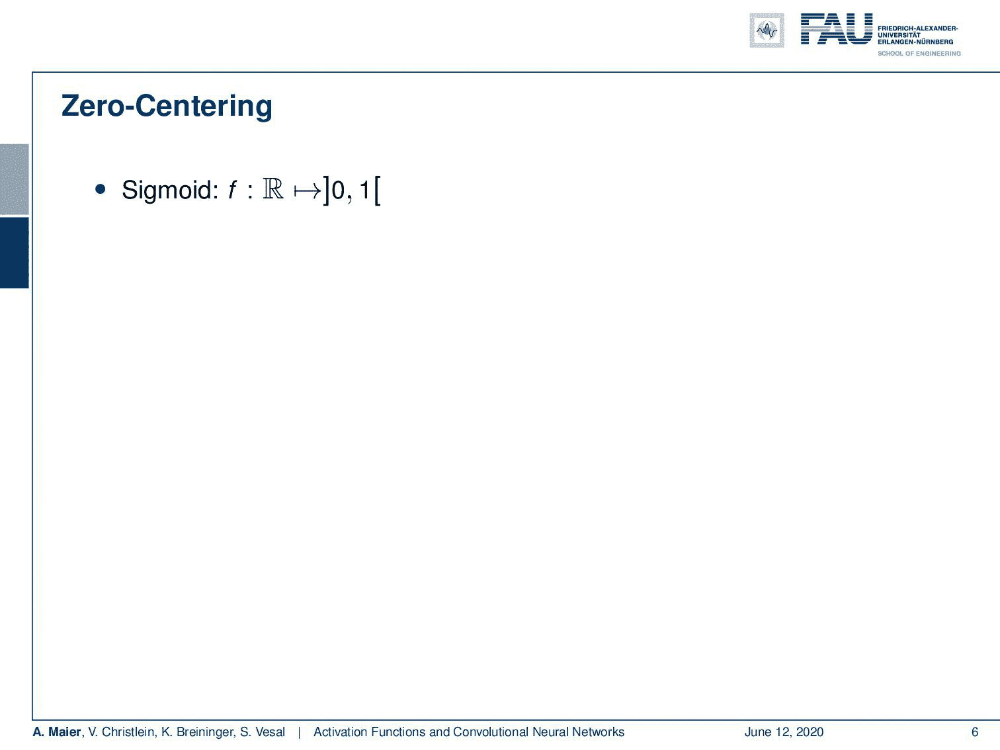
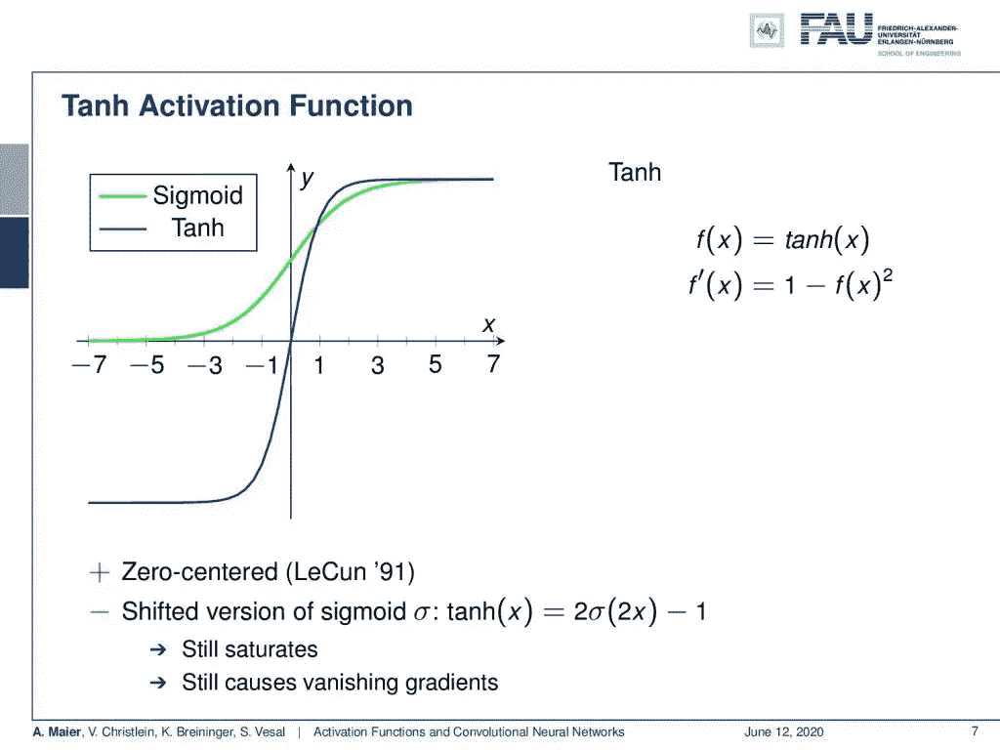
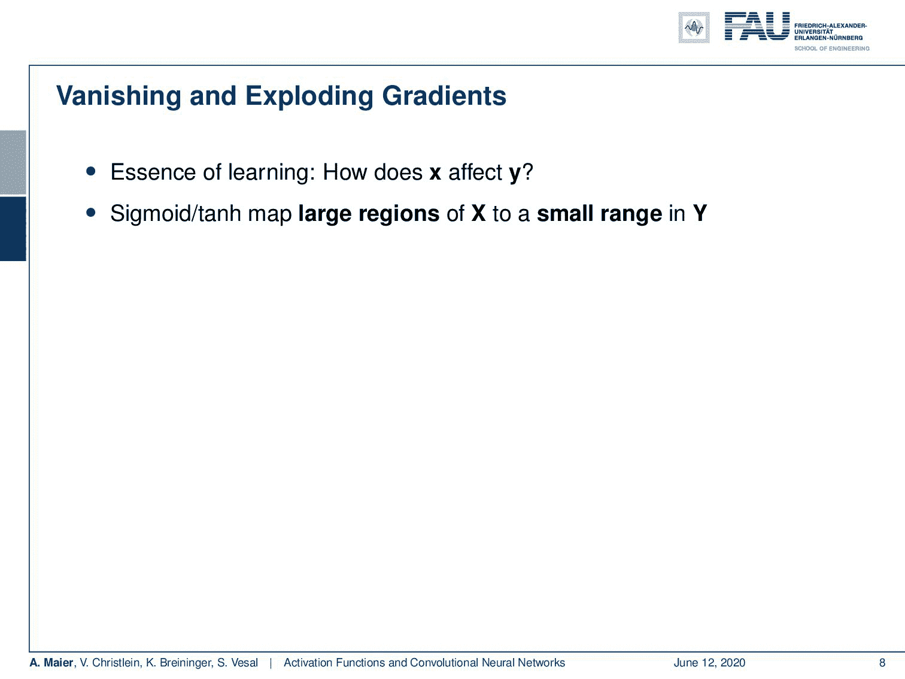

# 激活、卷积和池化—第 1 部分

> 原文：<https://towardsdatascience.com/lecture-notes-in-deep-learning-activations-convolutions-and-pooling-part-1-ddcad4eb04f6?source=collection_archive---------59----------------------->

## [FAU 讲座笔记](https://towardsdatascience.com/tagged/fau-lecture-notes)深度学习

## 经典激活

FAU 大学的深度学习。下图 [CC BY 4.0](https://creativecommons.org/licenses/by/4.0/) 来自[深度学习讲座](https://www.youtube.com/watch?v=p-_Stl0t3kU&list=PLpOGQvPCDQzvgpD3S0vTy7bJe2pf_yJFj&index=1)

**这些是 FAU 的 YouTube 讲座** [**深度学习**](https://www.youtube.com/watch?v=p-_Stl0t3kU&list=PLpOGQvPCDQzvgpD3S0vTy7bJe2pf_yJFj&index=1) **的讲义。这是与幻灯片匹配的讲座视频&的完整抄本。我们希望，你喜欢这个视频一样多。当然，这份抄本是用深度学习技术在很大程度上自动创建的，只进行了少量的手动修改。如果你发现了错误，请告诉我们！**

# 航行

[**上一讲**](/lecture-notes-in-deep-learning-loss-and-optimization-part-3-dc6280284fc1) **/** [**观看本视频**](https://youtu.be/b6gUGCD3l2E) **/** [**顶级**](/all-you-want-to-know-about-deep-learning-8d68dcffc258) **/** [**下一讲**](/lecture-notes-in-deep-learning-activations-convolutions-and-pooling-part-2-94637173a786)

欢迎回到深度学习！所以在今天的讲座中，我们想谈谈激活和卷积神经网络。我们把它分成几个部分，第一部分是关于经典激活函数。后面会讲到卷积神经网络，池化，之类的。

人造神经元和它们的生物对应物有一些微弱的相似之处。 [CC 下的图片来自](https://creativecommons.org/licenses/by/4.0/)[深度学习讲座](https://www.youtube.com/watch?v=p-_Stl0t3kU&list=PLpOGQvPCDQzvgpD3S0vTy7bJe2pf_yJFj&index=1)的 4.0 。

让我们从激活功能开始，你可以看到激活功能可以追溯到生物动机。我们记得到目前为止我们所做的一切，不知何故，我们也以生物学的实现为动机。我们看到生物神经元通过突触与其他神经元相连。这样，他们实际上可以互相交流。突触有髓鞘，有了髓鞘，它们实际上可以电绝缘。它们能够与其他细胞交流。

当超过某个阈值时，生物神经元就会激活。 [CC 下的图片来自](https://creativecommons.org/licenses/by/4.0/)[深度学习讲座](https://www.youtube.com/watch?v=p-_Stl0t3kU&list=PLpOGQvPCDQzvgpD3S0vTy7bJe2pf_yJFj&index=1)的 4.0 。

当他们交流时，他们不仅仅是发送他们收到的所有信息。他们有一个选择机制。因此，如果你有一个刺激，它实际上不足以产生一个输出信号。总信号必须高于阈值，然后发生的是动作电位被触发。之后，它重新极化，然后回到静止状态。有趣的是，细胞被激活的程度有多强并不重要。它总是返回相同的动作电位，回到静止状态。

轴突的详细视图。来自[深度学习讲座](https://www.youtube.com/watch?v=p-_Stl0t3kU&list=PLpOGQvPCDQzvgpD3S0vTy7bJe2pf_yJFj&index=1)的 [CC BY 4.0](https://creativecommons.org/licenses/by/4.0/) 下的图片。

实际的生物激活甚至更复杂。你有不同的轴突，它们与其他神经元的突触相连。在路径上，它们被许旺细胞覆盖，然后许旺细胞可以将这种动作电位传递给下一个突触。有离子通道，它们实际上用于稳定整个电过程，并在激活脉冲后使整个事情再次进入平衡。

生物神经元观察综述。 [CC 下的图片来自](https://creativecommons.org/licenses/by/4.0/)[深度学习讲座](https://www.youtube.com/watch?v=p-_Stl0t3kU&list=PLpOGQvPCDQzvgpD3S0vTy7bJe2pf_yJFj&index=1)的 4.0 。

所以，我们可以看到知识本质上存在于神经元之间的连接中。我们有抑制性和兴奋性连接。突触在解剖学上加强了前馈处理。所以，这和我们目前看到的非常相似。然而，这些连接可以是任何方向的。因此，它们也可以形成循环，你有完整的神经元网络，它们与不同的轴突相连，以形成不同的认知功能。关键是激活的总数。只有当激活的总数超过阈值时，你才会真正的激活。这些激活是具有特定强度的电尖峰，老实说，整个系统也是时间相关的。因此，它们也随时间对整个信息进行编码。所以，不只是我们有一个单一的事件通过，而是整个过程以一定的频率运行。这使得整个处理过程能够持续一段时间。

符号函数不适合梯度下降。 [CC 下的图片来自](https://creativecommons.org/licenses/by/4.0/)[深度学习讲座](https://www.youtube.com/watch?v=p-_Stl0t3kU&list=PLpOGQvPCDQzvgpD3S0vTy7bJe2pf_yJFj&index=1)的 4.0 。

到目前为止，人工神经网络中的激活都是非线性激活函数，主要由通用函数逼近来驱动。所以如果我们没有非线性，我们就不能得到一个强大的网络。如果没有非线性，我们只能以矩阵乘法结束。所以与生物学相比，我们有一些符号函数可以模拟全有或全无的反应。通常，我们的激活没有时间成分。也许，这可以通过符号函数的激活强度来建模。当然，这在数学上也是不可取的，因为正弦函数的导数在任何地方都是零，除了在无穷远处的零点。所以这绝对不适合反向传播。因此，我们一直使用 sigmoid 函数，因为我们可以计算解析导数。现在的问题是“我们能做得更好吗？”。

线性激活在建模方面没有太大帮助，但是它们在数学上很容易掌握。来自[深度学习讲座](https://www.youtube.com/watch?v=p-_Stl0t3kU&list=PLpOGQvPCDQzvgpD3S0vTy7bJe2pf_yJFj&index=1)的 [CC BY 4.0](https://creativecommons.org/licenses/by/4.0/) 下的图片。

那么，我们来看看一些激活函数。我们能想到的最简单的方法是线性激活，我们只是复制输入。我们可能希望用某个参数α对其进行缩放，然后得到输出。如果我们这样做了，我们就得到了α的导数。这非常简单，它会将整个优化过程转化为一个凸问题。如果我们不引入任何非线性，我们基本上就陷入了矩阵乘法。因此，我们在这里列出它只是为了完整性。它不允许你建立我们所知的深度神经网络。

sigmoid 函数是可微分的，并且可以用于神经网络建模。 [CC 下的图片来自](https://creativecommons.org/licenses/by/4.0/)[深度学习讲座](https://www.youtube.com/watch?v=p-_Stl0t3kU&list=PLpOGQvPCDQzvgpD3S0vTy7bJe2pf_yJFj&index=1)的 4.0 。

现在，sigmoid 函数是我们开始的第一个函数。它本质上具有朝向 1 和 0 的饱和度。因此，它有一个非常好的概率输出。然而，当 x 值变得很大或很小时，它会饱和。你可以看到，导数已经在 3 或-3 左右，很快接近零。另一个问题是它不是以零为中心的。

Sigmoid 激活将输出分布移向正值。来自[深度学习讲座](https://www.youtube.com/watch?v=p-_Stl0t3kU&list=PLpOGQvPCDQzvgpD3S0vTy7bJe2pf_yJFj&index=1)的 [CC BY 4.0](https://creativecommons.org/licenses/by/4.0/) 下的图片。

零点对中的问题是，你总是产生正数，与你得到的输入无关。您的输出将总是正的，因为我们映射到 0 和 1 之间的值。这意味着，如果我们有一个零均值的信号作为激活函数的输入，它将总是向一个大于零的均值移动。这被称为连续层的内部协变量移位。因此，各层必须不断适应不断变化的分布。因此，批量学习减少了更新的方差。

tanh 激活解决了内部协变量移位的问题。 [CC 下的图片来自](https://creativecommons.org/licenses/by/4.0/)[深度学习讲座](https://www.youtube.com/watch?v=p-_Stl0t3kU&list=PLpOGQvPCDQzvgpD3S0vTy7bJe2pf_yJFj&index=1)的 4.0 。

那么我们能做些什么来弥补这一点呢？嗯，我们可以用其他的激活功能，一个非常流行的是 tangens 双曲线。这里用蓝色显示。你可以看到它有非常好的特性。例如，它以零为中心，乐存从 1991 年就开始使用。所以，你可以说它是 sigmoid 函数的一个移位版本。但是一个主要的问题仍然存在。这就是饱和。所以你可以看到，也许在 2 或-2，你已经看到导数非常接近于零。所以还是会造成渐变消失的问题。

消失和爆炸梯度给训练网络带来了很大的问题。 [CC 下的图片来自](https://creativecommons.org/licenses/by/4.0/)[深度学习讲座](https://www.youtube.com/watch?v=p-_Stl0t3kU&list=PLpOGQvPCDQzvgpD3S0vTy7bJe2pf_yJFj&index=1)的 4.0 。

嗯，现在这里的本质是 **x** 如何影响 **y** 。我们的 sigmoid 和双曲线正切，它们将 x 的大区域映射到 y 的非常小的区域。因此，这意味着 **x** 的大变化将导致 **y** 的小变化。所以梯度消失了。这个问题被反向传播放大了，在反向传播中，你有很多非常小的步骤。如果它们接近于零，并且你将这些更新步骤彼此相乘，你会得到一个指数衰减。网络建立得越深，梯度消失得越快，更新下层就越困难。所以，一个非常相关的问题当然是爆炸梯度。所以，这里我们有一个问题，我们有高价值，这些高价值互相放大。结果，我们得到一个爆炸梯度。

不仅η的选择对训练网络至关重要。来自[深度学习讲座](https://www.youtube.com/watch?v=p-_Stl0t3kU&list=PLpOGQvPCDQzvgpD3S0vTy7bJe2pf_yJFj&index=1)的 4.0CC 下的图片。

因此，我们可以考虑一下我们之前见过的反馈环路和控制器。我们已经看到，如果您在训练迭代中测量损失，您的损失曲线会发生什么。如果你不适当地调整学习率，你会得到爆炸梯度或消失梯度。但不仅仅是学习率η。这个问题也可能被激活函数放大。特别地，消失梯度是那些饱和激活函数出现的问题。所以我们可能想考虑一下，看看我们是否能得到更好的激活函数。

在这个深度学习讲座中，更多令人兴奋的事情即将到来。 [CC 下的图片来自](https://creativecommons.org/licenses/by/4.0/)[深度学习讲座](https://www.youtube.com/watch?v=p-_Stl0t3kU&list=PLpOGQvPCDQzvgpD3S0vTy7bJe2pf_yJFj&index=1)的 4.0 。

所以，下一次深度学习，我们将确切地看看这些激活功能。你今天所看到的基本上是经典的，在下一节课，我们将讨论为了建立更稳定的激活函数所做的改进。这将使我们能够进入真正的深层网络。非常感谢您的收听，下次再见！

如果你喜欢这篇文章，你可以在这里找到[更多的文章](https://medium.com/@akmaier)，在这里找到更多关于机器学习的教育材料[，或者看看我们的](https://lme.tf.fau.de/teaching/free-deep-learning-resources/)[深度](https://www.youtube.com/watch?v=p-_Stl0t3kU&list=PLpOGQvPCDQzvgpD3S0vTy7bJe2pf_yJFj) [学习](https://www.youtube.com/watch?v=p-_Stl0t3kU&list=PLpOGQvPCDQzvgpD3S0vTy7bJe2pf_yJFj&index=1) [讲座](https://www.youtube.com/watch?v=p-_Stl0t3kU&list=PLpOGQvPCDQzvgpD3S0vTy7bJe2pf_yJFj)。如果你想在未来了解更多的文章、视频和研究，我也会很感激你在 YouTube、Twitter、脸书、LinkedIn 或 T21 上的掌声或关注。本文以 [Creative Commons 4.0 归属许可](https://creativecommons.org/licenses/by/4.0/deed.de)发布，如果引用，可以转载和修改。

# 参考

[1] I. J. Goodfellow、d . ward-Farley、M. Mirza 等人，“最大网络”。载于:ArXiv 电子版(2013 年 2 月)。arXiv:1302.4389[统计 ML】。
[2]，，，，任等，“深入挖掘整流器:在 ImageNet 分类上超越人类水平的表现”。载于:CoRR abs/1502.01852 (2015)。arXiv: 1502.01852。
[3]君特·克兰鲍尔(Günter Klambauer)，托马斯·安特辛纳(Thomas Unterthiner)，安德烈亚斯·迈尔(Andreas Mayr)，等，“自归一化神经网络”。在:神经信息处理系统的进展。abs/1706.02515 卷。2017.arXiv: 1706.02515。
【四】、和水城颜。“网络中的网络”。载于:CoRR abs/1312.4400 (2013 年)。arXiv: 1312.4400。
[5]安德鲁·马斯、奥尼·汉南和安德鲁·吴。“整流器非线性改善神经网络声学模型”。在:过程中。ICML。第 30 卷。1.2013.
[6] Prajit Ramachandran，Barret Zoph，和 Quoc V. Le。“搜索激活功能”。载于:CoRR abs/1710.05941 (2017 年)。arXiv: 1710.05941。
【7】Stefan elf wing，内池英治，多亚贤治。“强化学习中神经网络函数逼近的 Sigmoid 加权线性单元”。载于:arXiv 预印本 arXiv:1702.03118 (2017)。
[8]克里斯蒂安·塞格迪、、·贾等，“用回旋深化”。载于:CoRR abs/1409.4842 (2014 年)。arXiv: 1409.4842。