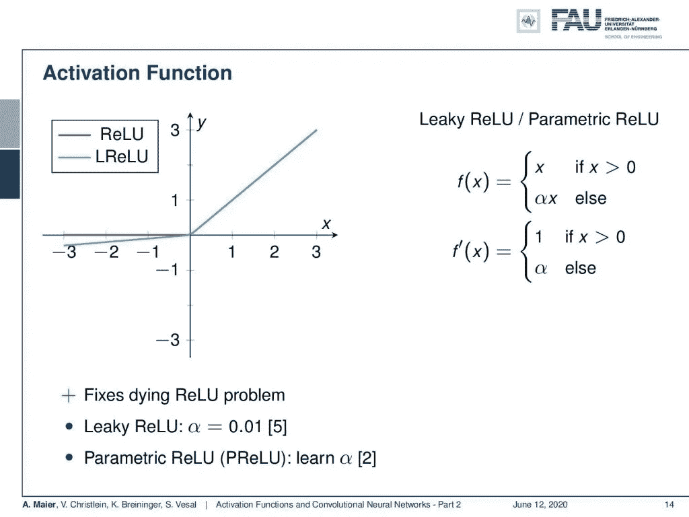
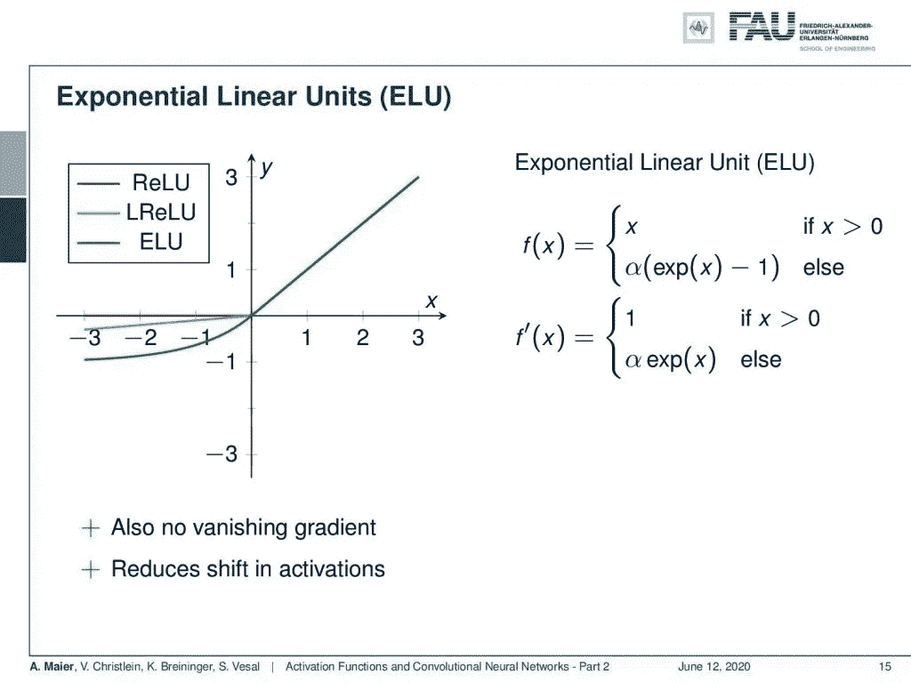

# 激活、卷积和池化—第 2 部分

> 原文：<https://towardsdatascience.com/lecture-notes-in-deep-learning-activations-convolutions-and-pooling-part-2-94637173a786?source=collection_archive---------62----------------------->

## [FAU 讲座笔记](https://towardsdatascience.com/tagged/fau-lecture-notes)深度学习

## 现代激活

FAU 大学的深度学习。下图 [CC BY 4.0](https://creativecommons.org/licenses/by/4.0/) 来自[深度学习讲座](https://www.youtube.com/watch?v=p-_Stl0t3kU&list=PLpOGQvPCDQzvgpD3S0vTy7bJe2pf_yJFj&index=1)

**这些是 FAU 的 YouTube 讲座** [**深度学习**](https://www.youtube.com/watch?v=p-_Stl0t3kU&list=PLpOGQvPCDQzvgpD3S0vTy7bJe2pf_yJFj&index=1) **的讲义。这是与幻灯片匹配的讲座视频&的完整抄本。我们希望，你喜欢这个视频一样多。当然，这份抄本是用深度学习技术在很大程度上自动创建的，只进行了少量的手动修改。如果你发现了错误，请告诉我们！**

# 航行

[**上一讲**](/lecture-notes-in-deep-learning-activations-convolutions-and-pooling-part-1-ddcad4eb04f6) **/** [**观看本视频**](https://youtu.be/7mXWbQjZRMA) **/** [**顶级**](/all-you-want-to-know-about-deep-learning-8d68dcffc258) **/** [**下一讲**](/lecture-notes-in-deep-learning-activations-convolutions-and-pooling-part-3-d7faeac9e79d)

整流线性单元(ReLU)是最早的现代激活之一。 [CC 下的图片来自](https://creativecommons.org/licenses/by/4.0/)[深度学习讲座](https://www.youtube.com/watch?v=p-_Stl0t3kU&list=PLpOGQvPCDQzvgpD3S0vTy7bJe2pf_yJFj&index=1)的 4.0 。

欢迎回到激活函数和卷积神经网络的第 2 部分！现在，我们想继续讨论激活函数和深度学习中使用的新函数。最著名的例子之一是整流线性单元(ReLU)。现在 ReLU，我们前面已经遇到过了，它的思想是简单地将负半空间设置为 0，将正半空间设置为 x，这就导致了整个正半空间的导数为 1，而其他地方的导数为 0。这很好，因为这样我们得到了一个很好的概括。由于分段线性，有一个显著的加速。该函数可以很快求值，因为我们不需要在实现方面通常有点慢的指数函数。我们没有这个消失梯度的问题，因为这个函数的导数有很大的高值区域。缺点是它不是以零为中心的。现在，这还没有用整流线性单元解决。不管怎样，这是一大进步。有了 ReLUs，你可以第一次建立更深层次的网络，更深层次的网络，我指的是隐藏层多于三层的网络。

经典的机器学习总是使用三个隐藏层。用[imgflip.com](https://imgflip.com/memegenerator)创造的迷因。

通常在经典的机器学习中，神经网络被限制在大约三层，因为在这一点上你已经得到了消失梯度问题。较低的层从未看到任何梯度，因此从未更新它们的权重。因此，ReLUs 实现了深度网络的训练，而无需无监督的预训练。你已经可以建立深度网络，但你必须进行无人监督的预训练，有了 ReLUs，你可以直接从零开始训练，只需把你的数据放进去，这是一大进步。此外，实现非常容易，因为如果单元被激活，一阶导数为 1，否则为 0。所以没有二阶效应。

一个大问题是死亡关系。来自[深度学习讲座](https://www.youtube.com/watch?v=p-_Stl0t3kU&list=PLpOGQvPCDQzvgpD3S0vTy7bJe2pf_yJFj&index=1)的 [CC BY 4.0](https://creativecommons.org/licenses/by/4.0/) 下的图片。

还有一个问题:垂死的瑞卢斯。如果你的权重和偏差被训练成对 x 产生负的结果，那么你最终只会得到一个零导数。ReLU 总是产生一个零输出，这意味着它们不再对你的训练过程有所贡献。所以，它就停在这一点，因为 0 阶导数，不可能更新。这个宝贵的 ReLU 突然总是 0，再也无法训练了。如果你的学习率太高，这种情况也会经常发生。在这里，你可能要小心设置学习率。有几种方法可以解决这个问题，我们将在接下来的几个视频中讨论。

泄漏的 ReLUs 有助于避免死亡 ReLUs。 [CC 下的图片来自](https://creativecommons.org/licenses/by/4.0/)[深度学习讲座](https://www.youtube.com/watch?v=p-_Stl0t3kU&list=PLpOGQvPCDQzvgpD3S0vTy7bJe2pf_yJFj&index=1)的 4.0 。

缓解这个问题的一个方法是不仅使用一个 ReLU，而且使用一种叫做泄漏或参数 ReLU 的东西。这里的方法是，不要将负半空间设置为零，而是将其设置为一个小数值。所以，你用α乘以 x，把α设为一个小数字。然后，你有一个与 ReLU 非常相似的效果，但你不会以垂死的 ReLU 问题结束，因为导数从来不是零，而是α。我首先通常将值设置为 0.01。参数 ReLU 是进一步的扩展。在这里，你使α成为一个可训练的参数。所以你可以知道每个激活函数应该有多大。

指数线性单位。来自[深度学习讲座](https://www.youtube.com/watch?v=p-_Stl0t3kU&list=PLpOGQvPCDQzvgpD3S0vTy7bJe2pf_yJFj&index=1)的 [CC BY 4.0](https://creativecommons.org/licenses/by/4.0/) 下的图片。

也有指数线性单位，这里的想法是，你在负半空间上找到一个缓慢衰减的光滑函数。你可以看到，我们把它设为α乘以 x 的指数减 1。这就产生了导数 1 和α指数 x，这也是获得饱和效应的一种有趣方式。这里，我们没有消失梯度，它也减少了激活的变化，因为我们也可以得到负输出值。

比例指数线性单位旨在保持 0 均值和 1 方差。 [CC 下的图片来自](https://creativecommons.org/licenses/by/4.0/)[深度学习讲座](https://www.youtube.com/watch?v=p-_Stl0t3kU&list=PLpOGQvPCDQzvgpD3S0vTy7bJe2pf_yJFj&index=1)的 4.0 。

如果您选择指数线性单位的这种变体，您将增加一个额外的标度λ。如果您的输入具有零均值和单位方差，您可以选择α和λ以及此处报告的这两个值，它们将保持零均值和单位方差。因此，这种比例指数函数(SELU)也摆脱了内部协变量移位的问题。所以这是 ReLU 的另一个变体，好的性质是，如果你有这些零均值单位方差输入，那么你的激活将保持在相同的规模。你不必关心内部协变量的变化。关于内部协变量移位，我们可以做的另一件事是巴赫归一化。这是我们将在几个视频中讨论的内容。

更多激活功能。 [CC 下的图片来自](https://creativecommons.org/licenses/by/4.0/)[深度学习讲座](https://www.youtube.com/watch?v=p-_Stl0t3kU&list=PLpOGQvPCDQzvgpD3S0vTy7bJe2pf_yJFj&index=1)的 4.0 。

好的，还有哪些激活功能？有学习激活功能的 maxout。可以使用径向基函数。有一种 softplus，它是 1 的对数加上 e 的 x 次方，被发现不如 ReLU 有效。

我们完成新的激活功能了吗？用 imgflip.com[创造的迷因](https://imgflip.com/memegenerator)。

这真的越来越荒谬了，不是吗？那么，我们现在应该用什么呢？人们甚至走得更远，试图找到最佳的激活函数。为了找到它们，他们使用了强化学习搜索。

寻找最佳激活确实是计算密集型的。来自[深度学习讲座](https://www.youtube.com/watch?v=p-_Stl0t3kU&list=PLpOGQvPCDQzvgpD3S0vTy7bJe2pf_yJFj&index=1)的 4.0CC 下的图片。

我们将在后面的课程中讨论强化学习。我们在这里只讨论结果。这种强化学习类型的设置的一个问题是它在计算上非常昂贵。在强化训练程序的每一步，你都必须从头开始训练整个网络。所以，你需要一台超级计算机来做这样的事情，搜索激活函数就是参考文献[6]。谷歌已经在 2017 年发布了它，他们实际上做到了这一点。因此，策略是定义搜索空间，然后使用带有强化学习的递归神经网络执行搜索，最后，他们希望使用最佳结果。

参考文献[6]中使用的搜索空间。 [CC 下的图片来自](https://creativecommons.org/licenses/by/4.0/)[深度学习讲座](https://www.youtube.com/watch?v=p-_Stl0t3kU&list=PLpOGQvPCDQzvgpD3S0vTy7bJe2pf_yJFj&index=1)的 4.0 。

他们使用的搜索空间是，他们把 x 放入一些一元函数中。然后这些一元函数使用一个二进制核心单元组合起来。然后，这可以再次与 x 的另一个实例一元合并，然后使用二元函数产生最终输出。所以，这基本上是他们所经历的搜索空间。当然，他们采用这种模型，因为你可以用这种表达式解释很多典型的激活函数，比如 sigmoid，等等。

谷歌发现的“新”激活功能。来自[深度学习讲座](https://www.youtube.com/watch?v=p-_Stl0t3kU&list=PLpOGQvPCDQzvgpD3S0vTy7bJe2pf_yJFj&index=1)的 [CC BY 4.0](https://creativecommons.org/licenses/by/4.0/) 下的图片。

我们看到这些是他们认为有用的激活功能。所以，我们不能自己做手术，但是我们当然可以看看他们的结果。这里有一些例子，有趣的是，你可以看到他们得到的一些结果，甚至不再是凸函数。他得出的一个普遍结论是，复杂的激活功能通常表现不佳。他们发现了 x 乘以σ(β x)的东西，他们称之为 swish 函数。因此，这似乎表现得很好，实际上他们使用搜索确定的这个函数之前已经被提议为 sigmoid 加权线性单元[7]。

在搜索激活时是否发现任何显著的差异？ [CC 下的图片来自](https://creativecommons.org/licenses/by/4.0/)[深度学习讲座](https://www.youtube.com/watch?v=p-_Stl0t3kU&list=PLpOGQvPCDQzvgpD3S0vTy7bJe2pf_yJFj&index=1)的 4.0 。

所以让我们来详细看看结果。现在声明:永远不要在你的结果中显示表格。努力寻找更好的代表！然而，我们没有找到更好的代表。这里我可以展示的是，这些是他们获得的最高精度。这是在 ImageNet 上训练的 inception Resnet v2 架构中完成的。在倒数第三行，您可以看到 ReLU 的结果，然后下面两行显示 swish-1 和 swish 的结果。现在，我们想问的问题是:“这些变化实际上意义重大吗？”所以，显著性意味着你要计算观察结果是随机结果的概率，你要确保你报告的结果不是随机的。在整个处理链中，我们经常会遇到随机初始化，我们有很多步骤可能会引入采样误差，等等。所以你真的要确保结果不是随机的。因此，我们有显著性检验。如果你仔细观察，你真的会问自己:“这里报道的变化实际上有意义吗？”。

我们对激活函数的观察总结。 [CC 下的图片来自](https://creativecommons.org/licenses/by/4.0/)[深度学习讲座](https://www.youtube.com/watch?v=p-_Stl0t3kU&list=PLpOGQvPCDQzvgpD3S0vTy7bJe2pf_yJFj&index=1)的 4.0 。

因此，我们的建议是去 ReLU。它们工作得非常好，如果您有一些问题，您可以选择使用批处理规范化，我们将在下一个视频中讨论。另一个有趣的事情是缩放的指数线性单元，因为它具有这种自适应属性。所以，这真的很吸引人，但是先试试 ReLU 吧。这真的是你想走的典型道路。对最佳激活函数的搜索是一个困难且广泛的优化问题，它并没有给我们带来更好的激活函数。所以我们这里已经有的足够解决你的大部分问题了。关于好的激活函数，我们所知道的是我们从这些观察中所知道的:它们具有几乎线性的区域以防止梯度消失，它们具有饱和区域以提供非线性，并且它们应该是单调的，因为这对我们的优化非常有用。

在这个深度学习讲座中，更多令人兴奋的事情即将到来。来自[深度学习讲座](https://www.youtube.com/watch?v=p-_Stl0t3kU&list=PLpOGQvPCDQzvgpD3S0vTy7bJe2pf_yJFj&index=1)的 [CC BY 4.0](https://creativecommons.org/licenses/by/4.0/) 下的图片。

这已经把我们带到了下节课的预习。在下一堂课中，我们真的想研究卷积神经网络，看看我们如何减少连接数量和参数数量，以构建真正深度的网络。所以，我希望你喜欢这个讲座，我期待着在下一个讲座中见到你！

如果你喜欢这篇文章，你可以在这里找到更多的文章，或者看看我们的讲座。如果你想在未来了解更多的文章、视频和研究，我也会很感激你在 YouTube、Twitter、脸书、LinkedIn 上的鼓掌或关注。本文以 [Creative Commons 4.0 归属许可](https://creativecommons.org/licenses/by/4.0/deed.de)发布，如果引用，可以转载和修改。

# 参考

[1] I. J. Goodfellow、d . ward-Farley、M. Mirza 等人，“最大网络”。载于:ArXiv 电子版(2013 年 2 月)。arXiv:1302.4389[统计 ML】。
[2]，，，，任等，“深入挖掘整流器:在 ImageNet 分类上超越人类水平的表现”。载于:CoRR abs/1502.01852 (2015)。arXiv: 1502.01852。
[3]君特·克兰鲍尔(Günter Klambauer)，托马斯·安特辛纳(Thomas Unterthiner)，安德烈亚斯·迈尔(Andreas Mayr)，等，“自归一化神经网络”。在:神经信息处理系统的进展。abs/1706.02515 卷。2017.arXiv: 1706.02515。
【四】、和水城颜。“网络中的网络”。载于:CoRR abs/1312.4400 (2013 年)。arXiv: 1312.4400。
[5]安德鲁·马斯、奥尼·汉南和安德鲁·吴。“整流器非线性改善神经网络声学模型”。在:过程中。ICML。第 30 卷。1.2013.
[6] Prajit Ramachandran，Barret Zoph，和 Quoc V. Le。“搜索激活功能”。载于:CoRR abs/1710.05941 (2017 年)。arXiv: 1710.05941。
【7】Stefan elf wing，内池英治，多亚贤治。“强化学习中神经网络函数逼近的 Sigmoid 加权线性单元”。载于:arXiv 预印本 arXiv:1702.03118 (2017)。
[8]克里斯蒂安·塞格迪、、·贾等，“用回旋深化”。载于:CoRR abs/1409.4842 (2014 年)。arXiv: 1409.4842。