# 激活、卷积和池化—第 3 部分

> 原文：<https://towardsdatascience.com/lecture-notes-in-deep-learning-activations-convolutions-and-pooling-part-3-d7faeac9e79d?source=collection_archive---------47----------------------->

## [FAU 讲座笔记](https://towardsdatascience.com/tagged/fau-lecture-notes)深度学习

## 卷积层

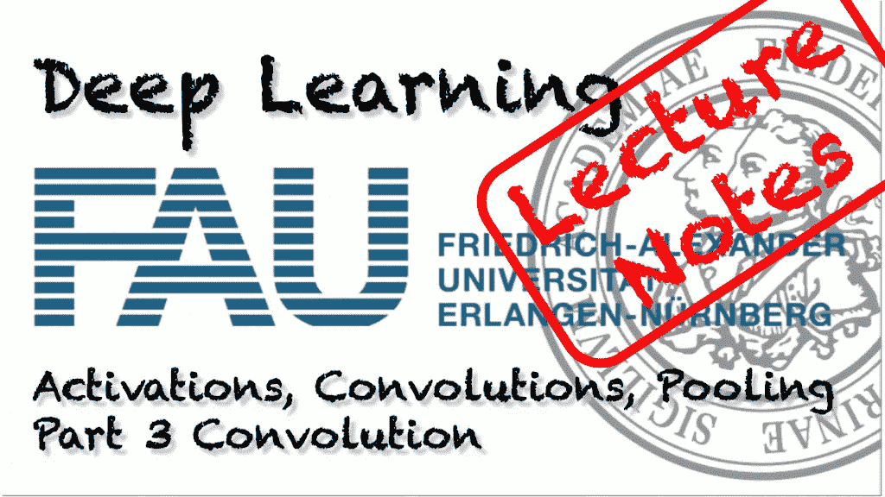

FAU 大学的深度学习。下图 [CC BY 4.0](https://creativecommons.org/licenses/by/4.0/) 来自[深度学习讲座](https://www.youtube.com/watch?v=p-_Stl0t3kU&list=PLpOGQvPCDQzvgpD3S0vTy7bJe2pf_yJFj&index=1)

**这些是 FAU 的 YouTube 讲座** [**深度学习**](https://www.youtube.com/watch?v=p-_Stl0t3kU&list=PLpOGQvPCDQzvgpD3S0vTy7bJe2pf_yJFj&index=1) **的讲义。这是与幻灯片匹配的讲座视频&的完整抄本。我们希望，你喜欢这个视频一样多。当然，这份抄本是用深度学习技术在很大程度上自动创建的，只进行了少量的手动修改。如果你发现了错误，请告诉我们！**

# 航行

[**上一讲**](/lecture-notes-in-deep-learning-activations-convolutions-and-pooling-part-2-94637173a786) **/** [**观看本视频**](https://youtu.be/89XsCExAHi0) **/** [**顶级**](/all-you-want-to-know-about-deep-learning-8d68dcffc258) **/** [**下一讲**](/activations-convolutions-and-pooling-part-4-5dd7f85aa9f7)

欢迎回到深度学习！今天，我们想继续讨论卷积神经网络。在这个讲座中，我们真正想看到的是构建深层网络的基石。所以我们今天要学习的是卷积神经网络，这是深度网络最重要的组成部分之一。

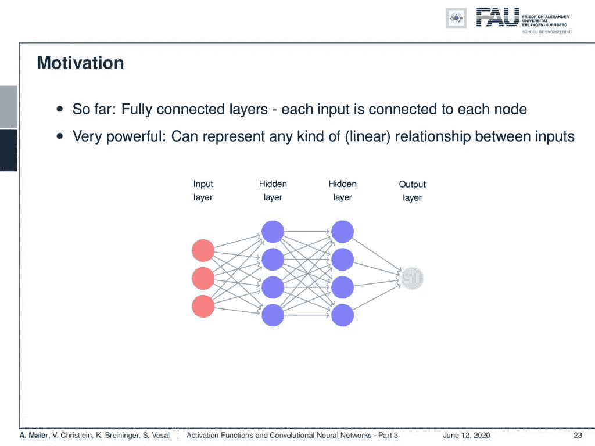

到目前为止，我们所有的层是完全连接的。 [CC 下的图片来自](https://creativecommons.org/licenses/by/4.0/)[深度学习讲座](https://www.youtube.com/watch?v=p-_Stl0t3kU&list=PLpOGQvPCDQzvgpD3S0vTy7bJe2pf_yJFj&index=1)的 4.0 。

到目前为止，我们已经有了这些完全连接的层，其中每个输入都连接到每个节点。这是非常强大的，因为它可以表示输入之间的任何线性关系。本质上在每一层之间，我们有一个矩阵乘法。这实质上意味着从一层到另一层，我们可以有一个完整的表现变化。这也意味着我们有很多联系。

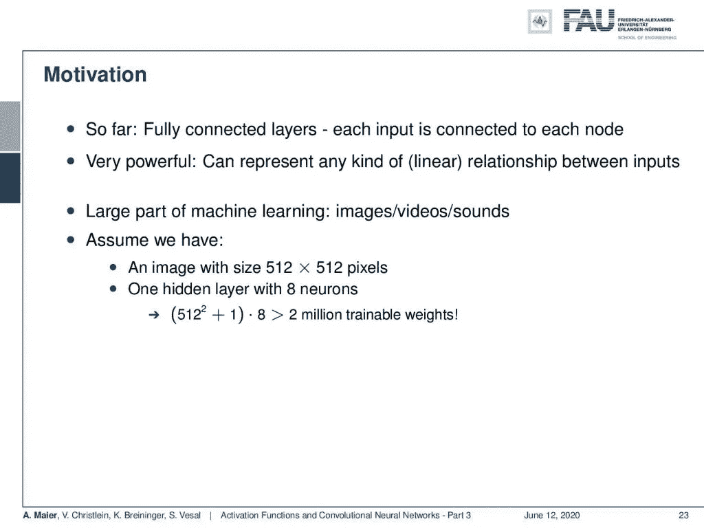

图像具有高维数，这对神经网络是一个挑战。 [CC 下的图片来自](https://creativecommons.org/licenses/by/4.0/)[深度学习讲座](https://www.youtube.com/watch?v=p-_Stl0t3kU&list=PLpOGQvPCDQzvgpD3S0vTy7bJe2pf_yJFj&index=1)的 4.0 。

所以让我们想想图像，视频，声音，机器学习。然后，这是一个缺点，因为他们通常有巨大的输入大小。您需要考虑如何处理这些大的输入量。让我们说，我们假设我们有一个 512 乘以 512 像素的图像，这意味着一个具有八个神经元的隐藏层已经具有 512 个^ 2 + 1，用于偏差乘以 8 的可训练权重。仅一个隐藏层就有超过 200 万个可训练权重。当然，这不是办法，规模确实是个问题。还有更多。

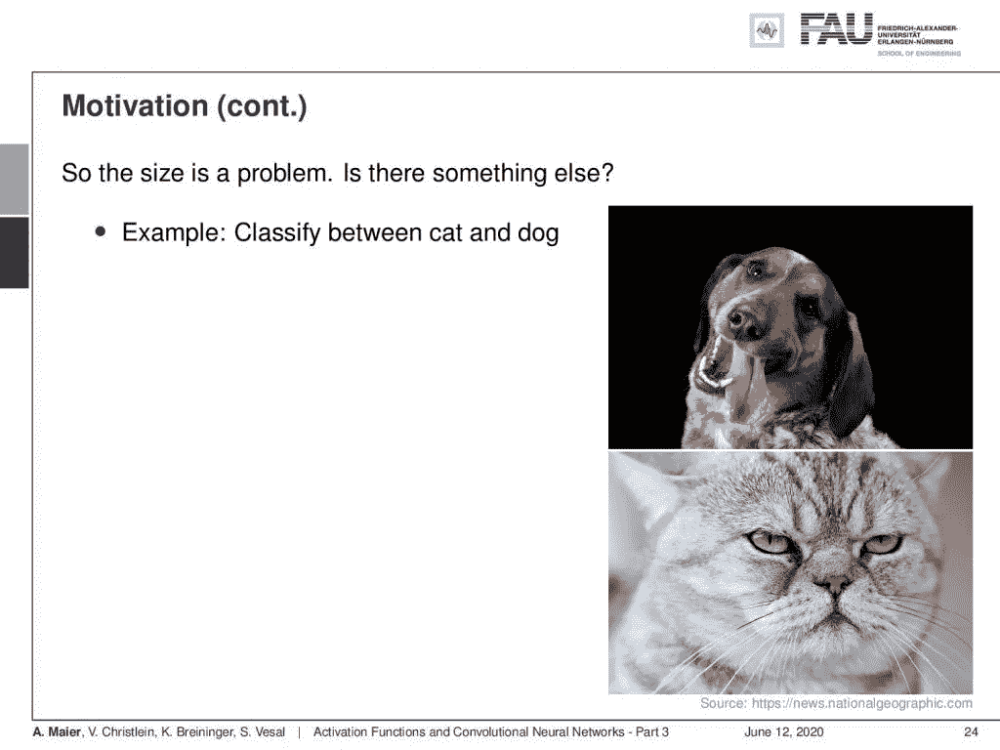

机器学习的一个典型案例:给猫和狗分类。来自[深度学习讲座](https://www.youtube.com/watch?v=p-_Stl0t3kU&list=PLpOGQvPCDQzvgpD3S0vTy7bJe2pf_yJFj&index=1)的 [CC BY 4.0](https://creativecommons.org/licenses/by/4.0/) 下的图片。

假设我们想在猫和狗之间进行分类。如果你看这两张图片，你会发现这些图片的大部分都是空白区域。因此，它们不是很相关，因为像素通常是非常糟糕的特征。它们高度相关，依赖于尺度，并有强度变化。因此，它们是一个巨大的问题，从机器学习的角度来看，像素是一种糟糕的表示。你想创造一些更抽象的东西，更好地总结信息。

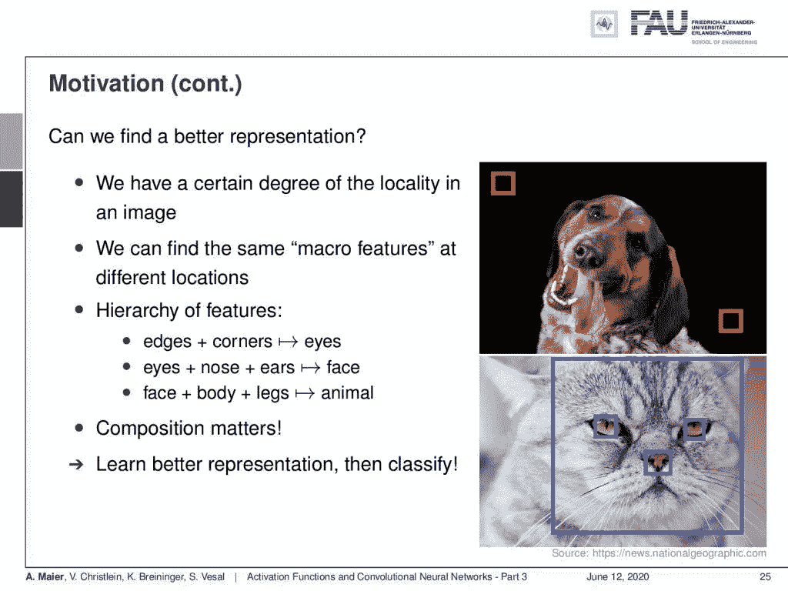

像素不是我们作为特征的首选。 [CC 下的图片来自](https://creativecommons.org/licenses/by/4.0/)[深度学习讲座](https://www.youtube.com/watch?v=p-_Stl0t3kU&list=PLpOGQvPCDQzvgpD3S0vTy7bJe2pf_yJFj&index=1)的 4.0 。

所以，问题是:“我们能找到一个更好的代表吗？”在图像中，我们当然有一定程度的局部性。因此，我们可以尝试在不同的位置找到相同的宏功能，然后重用它们。理想情况下，我们希望构建类似于特征层次的东西，其中我们有边和角，然后形成眼睛。然后，我们有眼睛、鼻子和耳朵组成一张脸，然后脸、身体和腿将最终形成一只动物。所以，构图很重要，如果你能学会更好的表达，那么你也能更好地分类。

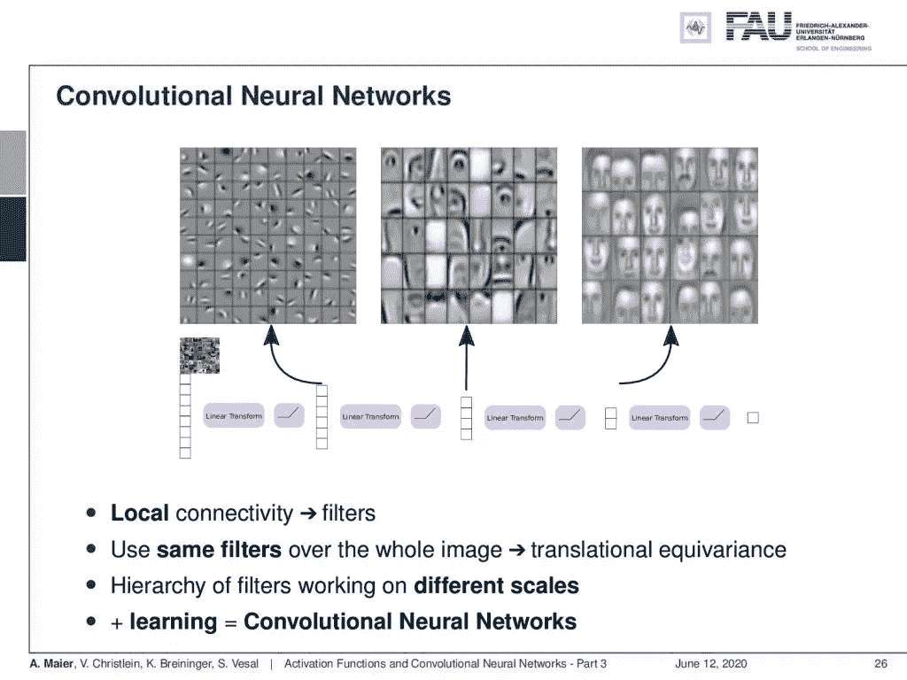

好的特征能够描述一个组合层次。 [CC 下的图片来自](https://creativecommons.org/licenses/by/4.0/)[深度学习讲座](https://www.youtube.com/watch?v=p-_Stl0t3kU&list=PLpOGQvPCDQzvgpD3S0vTy7bJe2pf_yJFj&index=1)的 4.0 。

所以这真的很关键，我们在卷积神经网络中经常看到的是，在早期的层上可以找到非常简单的描述符。然后，在中间层，你会发现更多的抽象表示。在这里，我们发现眼睛、鼻子等等。在更高的层次，你会发现真正的受体，比如这里的脸。因此，我们希望具有本地敏感性，但我们希望将它们扩展到整个网络，以便对这些抽象层进行建模。我们可以通过在神经网络中使用卷积来做到这一点。

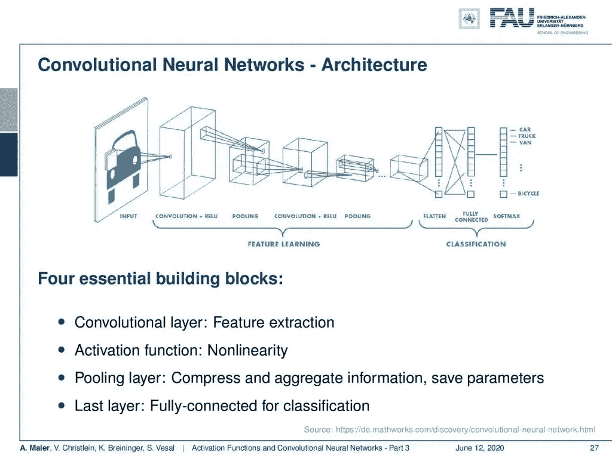

为了对特征层次进行建模，我们以交替的方式组合卷积和下采样/池。来自[深度学习讲座](https://www.youtube.com/watch?v=p-_Stl0t3kU&list=PLpOGQvPCDQzvgpD3S0vTy7bJe2pf_yJFj&index=1)的 [CC BY 4.0](https://creativecommons.org/licenses/by/4.0/) 下的图片。

这是这些架构的总体思路。他们不是将一切与一切完全联系起来，而是为每个神经元使用一个所谓的感受野，就像一个过滤器内核。然后，他们在整个图像上计算相同的权重——本质上是卷积——并产生不同的所谓特征图。接下来，要素地图将转到池化图层。然后，汇集试图引入抽象，并缩小图像。接下来，我们可以再次进行卷积和合并，然后进入下一阶段。你继续下去，直到你有一些抽象表示，然后抽象表示被送到一个完全连接的层。最终，这个完全连接的层映射到最终的类，即“汽车”、“卡车”、“货车”等等。这就是分类结果。因此，我们需要卷积层、激活函数和池来获得抽象并降低维度。在最后一层，我们找到完全连接的分类。

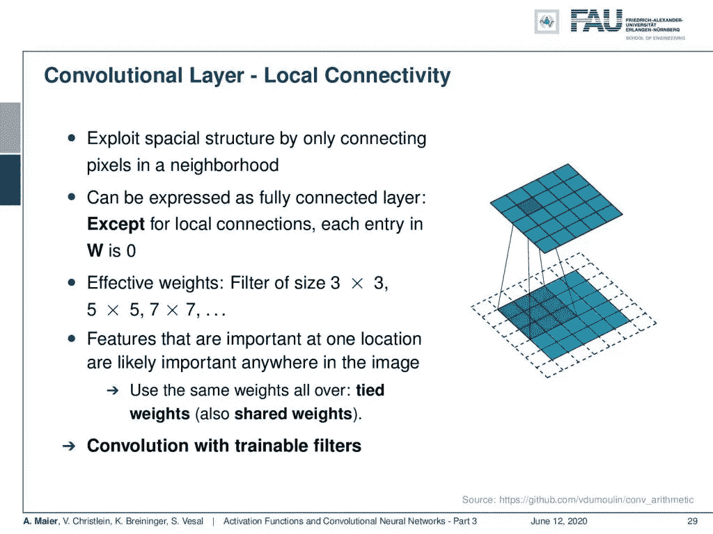

卷积利用图像的局部结构。 [CC 下的图片来自](https://creativecommons.org/licenses/by/4.0/)[深度学习讲座](https://www.youtube.com/watch?v=p-_Stl0t3kU&list=PLpOGQvPCDQzvgpD3S0vTy7bJe2pf_yJFj&index=1)的 4.0 。

让我们从卷积层开始。因此，这里的想法是，我们希望通过仅连接邻域中的像素来利用空间结构。然后，这可以在全连接层中表示，除非我们想要在全连接层中表示，否则我们可以将矩阵中的每个条目设置为零，除非它们通过本地连接来连接。这意味着我们可以忽略空间距离上的很多联系。另一个技巧是你使用大小为 3 x 3，5 x 5 和 7 x 7 的滤镜，你希望它们在整个图层上都是一样的。因此，小邻域内的权重是相同的，即使你移动它们。他们被称为捆绑或共享的重量。如果你这样做，你实际上是在模拟一个卷积。如果你有相同的权重，那么这和你在任何图像处理课上学到的过滤器模板的概念是完全一样的，所以，我们本质上在这里构建了具有可训练过滤器模板的网络。

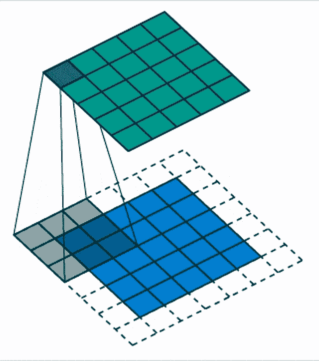

动画显示了过滤遮罩如何在输入(底部)上移动以产生最终的要素地图(顶部)。来自[深度学习讲座](https://www.youtube.com/watch?v=p-_Stl0t3kU&list=PLpOGQvPCDQzvgpD3S0vTy7bJe2pf_yJFj&index=1)的 [CC BY 4.0](https://creativecommons.org/licenses/by/4.0/) 下的图片。

这里，我们看到了这个过程的放大图。因此，如果你上过信号处理课，卷积本质上可以表示为对两个函数的积分，其中一个函数对另一个函数进行移位，然后对最终结果进行积分。

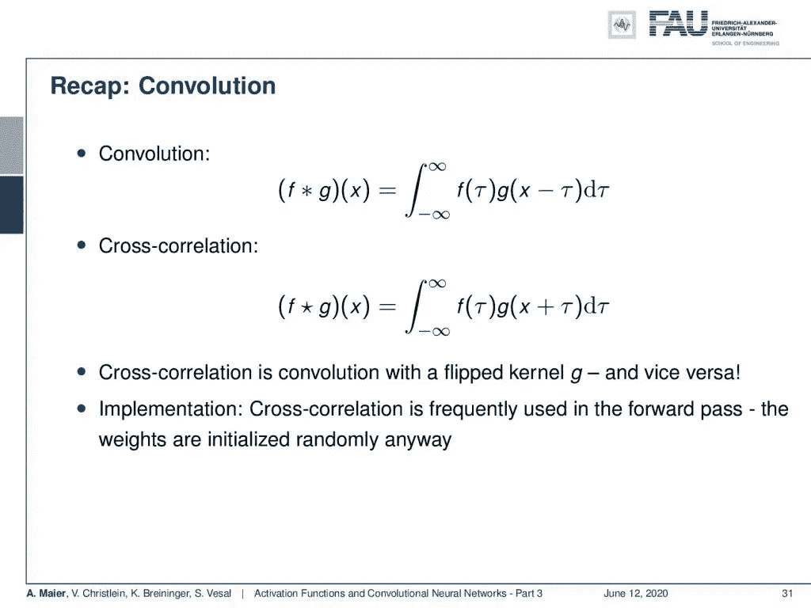

信号处理中的卷积。 [CC 下的图片来自](https://creativecommons.org/licenses/by/4.0/)[深度学习讲座](https://www.youtube.com/watch?v=p-_Stl0t3kU&list=PLpOGQvPCDQzvgpD3S0vTy7bJe2pf_yJFj&index=1)的 4.0 。

互相关是一个相关概念，您会看到互相关和卷积之间的唯一区别是τ的符号。在卷积中，你向负方向移动，在互相关中，你向正方向移动。我们经常看到的是，人们谈论卷积，但他们实际上实现了互相关。所以他们基本上翻转了面具的方向。所以，如果你正在创造一些可以训练的东西，这实际上并不重要，因为你无论如何都会学习这个函数的符号。所以，两种实现都很好。互相关实际上经常在实际的深度学习软件中实现。通常，您无论如何都会随机初始化权重。因此，差异没有影响。

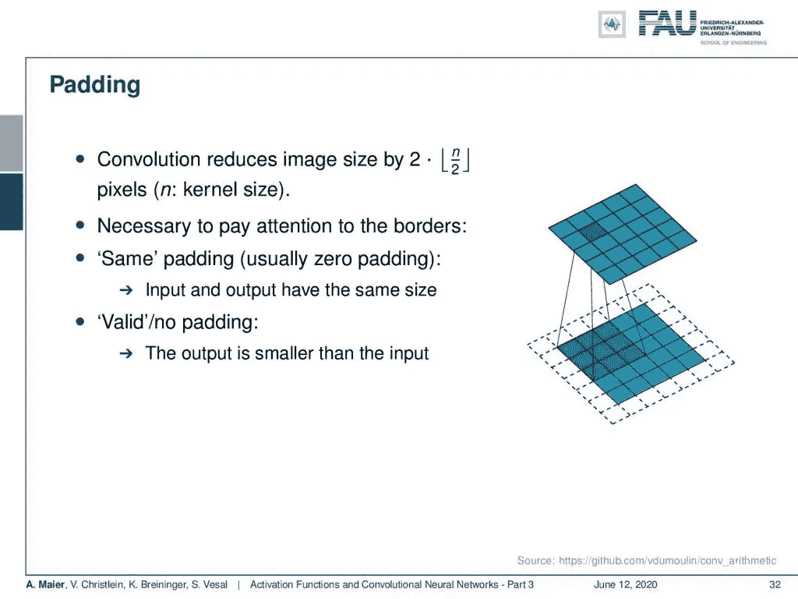

填充解决了边界处缺少观察值的问题。来自[深度学习讲座](https://www.youtube.com/watch?v=p-_Stl0t3kU&list=PLpOGQvPCDQzvgpD3S0vTy7bJe2pf_yJFj&index=1)的 [CC BY 4.0](https://creativecommons.org/licenses/by/4.0/) 下的图像。

我们需要讨论的另一件事是不同的输入大小，以及卷积实际上是如何被用来处理的。因此，这个感受野意味着输出实际上更小，因为我们只能接近最接近的边界。所以，如果你想计算你的感受野边界上的卷积核，你实际上可以到达视野之外。处理这种情况的一种方法是减小要素图和下一个相应图层的大小。您也可以使用填充。许多人所做的只是零填充。因此，所有未观察到的值实际上都设置为零，然后您可以保持相同的大小，只需卷积整个图像。还有其他策略，如镜像等，但零填充可能是最常见的一种。

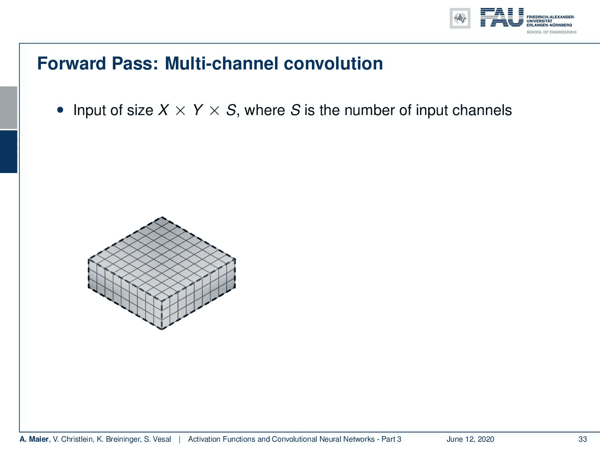

使用多通道卷积的前向通过。来自[深度学习讲座](https://www.youtube.com/watch?v=p-_Stl0t3kU&list=PLpOGQvPCDQzvgpD3S0vTy7bJe2pf_yJFj&index=1)的 [CC BY 4.0](https://creativecommons.org/licenses/by/4.0/) 下的图像。

这样，你得到了前进的路径。你实际上不必用小的卷积核来实现它。您也可以使用傅立叶变换来实际执行卷积。所以，你有一个二维输入图像。假设这是一个多通道图像，例如 S 是颜色的数量。然后，应用三维滤镜。这里可以看到，在空间域中有卷积核，但在 S 方向上，它与通道完全相连。如果你这样做了，你可以应用这个内核，然后你得到一个输出遮罩(蓝色显示),内核显示在这里。然后，我们在这里返回这个输出字段。现在，如果你有另一个内核，那么你可以用同样的填充产生第二个遮罩，如绿色所示。这样，您就可以开始构建一个又一个的要素地图。

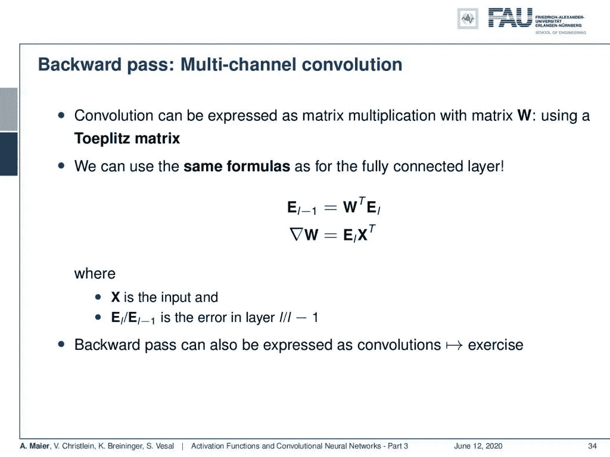

卷积只是矩阵乘法的一种。 [CC 下的图片来自](https://creativecommons.org/licenses/by/4.0/)[深度学习讲座](https://www.youtube.com/watch?v=p-_Stl0t3kU&list=PLpOGQvPCDQzvgpD3S0vTy7bJe2pf_yJFj&index=1)的 4.0 。

让我们谈一谈卷积实现和反向传递。卷积表示为矩阵乘法 **W** 和 **W** 是一个托普利兹矩阵。因此，这个 Toeplitz 矩阵是一个循环矩阵，因为它是通过权重共享构造的。这意味着，如果您实际上正在构建这个矩阵，那么在被训练的每一行中，您具有本质上相同数量的权重，但是它们被移动了一个，这仅仅是因为它们在每一行中使用相同的权重来计算不同的本地字段。这给了我们一个循环矩阵，这意味着我们停留在矩阵乘法的领域。因此，我们的卷积也可以实现为矩阵乘法，因此我们简单地继承了与全连接层相同的公式。因此，如果我们想要反向传播误差，只需用 **W** 乘以反向传播的输入误差。如果您想要计算权重的更新，它实际上是误差项乘以我们从正向转置的输入中获得的值。因此，这与我们之前看到的完全连接图层的更新公式完全相同。这很好，没有那么多需要记住的。当然，你必须确保你能正确地分担重量，我们会在练习中展示给你看。对我们来说，现在，我们可以把它当作矩阵乘法，你在练习中看到的一个有趣的事情是，反向传递也可以表示为卷积。

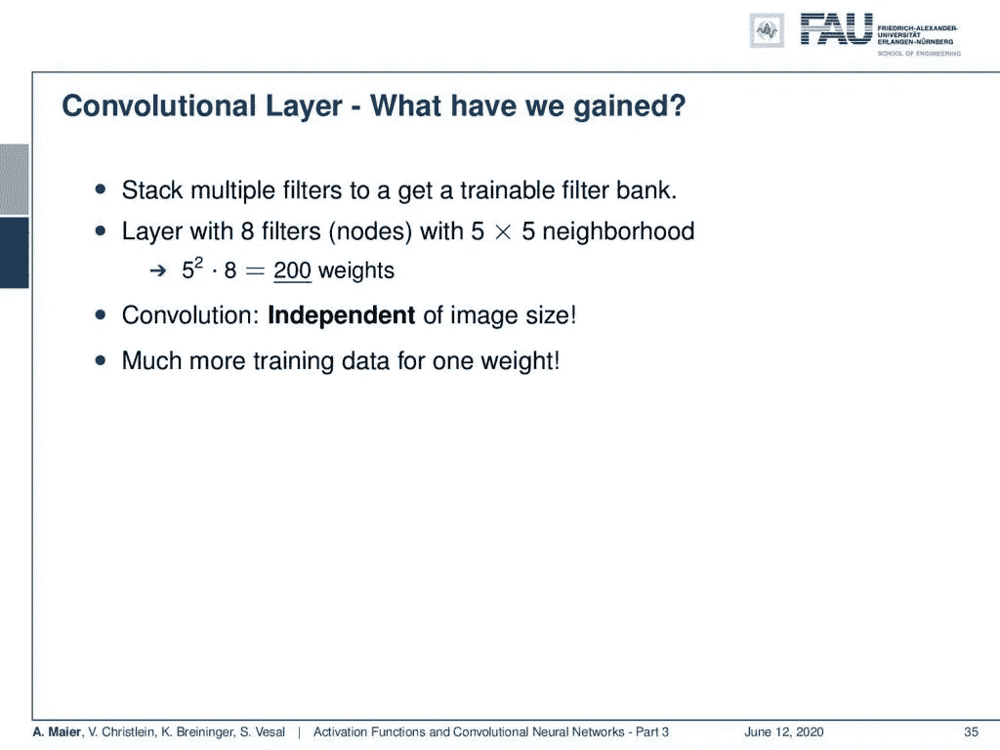

卷积使我们能够显著减少权重的数量，并处理任意大小的图像。 [CC 下的图片来自](https://creativecommons.org/licenses/by/4.0/)[深度学习讲座](https://www.youtube.com/watch?v=p-_Stl0t3kU&list=PLpOGQvPCDQzvgpD3S0vTy7bJe2pf_yJFj&index=1)的 4.0 。

现在，我们从卷积层中获得了什么？如果现在堆叠多个滤波器，我们就可以得到一个可训练的滤波器组。比方说，我们有八个过滤器，产生八个节点和一个 5x5 的邻域。然后，我们突然有了 5 乘 8 = 200 的权重。200 磅比我们之前见过的 200 万磅要小得多。此外，卷积可以独立于图像大小应用。所以，我们能做的就是用这些滤镜来转换任何类型的图像。这意味着当我们有不同的输入量时，我们产生的激活图也会改变。我们会在下一节课中看到更多。这里非常好的一点是，我们有更多的数据来训练单个重量。

使用步进和扩张卷积，各种有趣的处理步骤都是可能的。使用 gifify 生成的图像。点击查看完整视频[。](https://youtu.be/eCLp7zodUiI)

也有像交错回旋这样的东西。这是当你试图将池化机制和降维机制结合到卷积中的时候。就像每个点都跳过一步。因此，对于步距 s，我们描述一个偏移，然后我们本质上产生一个激活图，该激活图具有依赖于该步距的较低维度。

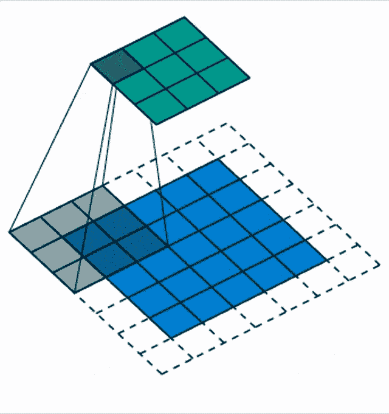

使用 s = 2 跨越卷积。来自[深度学习讲座](https://www.youtube.com/watch?v=p-_Stl0t3kU&list=PLpOGQvPCDQzvgpD3S0vTy7bJe2pf_yJFj&index=1)的 4.0CC 下的图片。

因此，我们将输出大小减少了 1/s，因为跳过了这么多步骤，从数学上来说，这就是同时进行卷积和二次采样。我们这里有一个小动画，向你展示这是如何实现的。

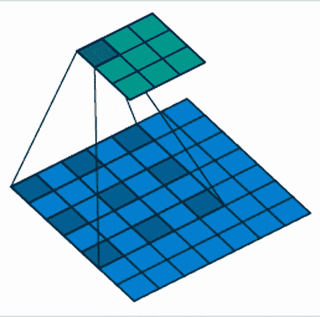

扩张的卷积通过在输入域中跳跃来增加卷积的感受野。 [CC 下的图片来自](https://creativecommons.org/licenses/by/4.0/)[深度学习讲座](https://www.youtube.com/watch?v=p-_Stl0t3kU&list=PLpOGQvPCDQzvgpD3S0vTy7bJe2pf_yJFj&index=1)的 4.0 。

也有像扩张我们萎缩的脑回这样的事情。这里的想法是，我们不是在增加步幅，而是在增加输入空间的间距。现在，感受野不再连接，但我们看到的是分布在一个邻域内的单个像素。这就给了我们一个参数更少的更宽的感受域。

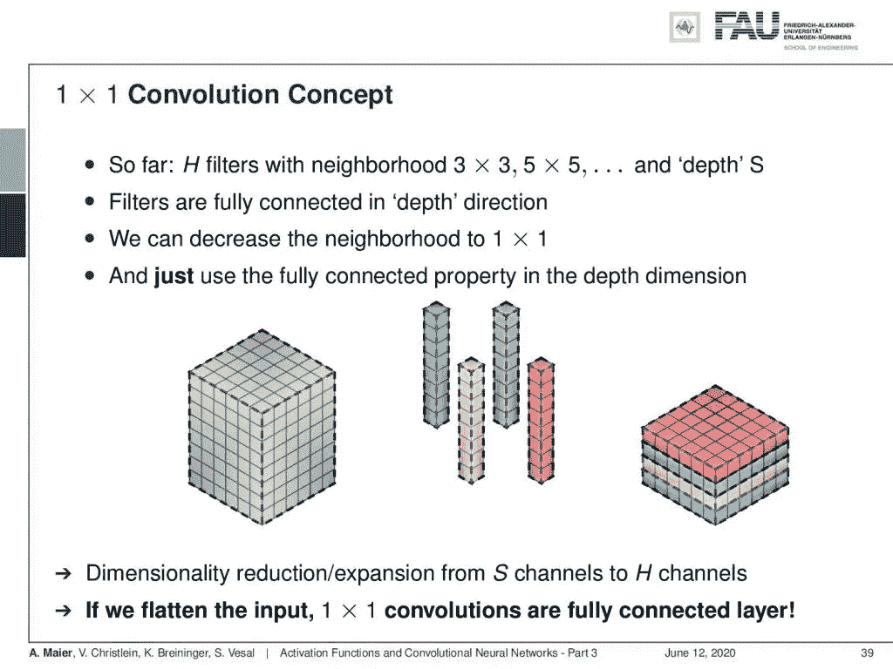

1x1 卷积支持按像素完全连接的层。 [CC 下的图片来自](https://creativecommons.org/licenses/by/4.0/)[深度学习讲座](https://www.youtube.com/watch?v=p-_Stl0t3kU&list=PLpOGQvPCDQzvgpD3S0vTy7bJe2pf_yJFj&index=1)的 4.0 。

另一个非常有趣的概念是 1x1 卷积。到目前为止，我们有这些邻域的 H 滤波器，在深度方向上，我们有 s，记住，它们在深度方向上是完全连接的。这也很有趣，因为现在如果你有一个 1x1 卷积，那么这本质上是一个完全连接的层。所以你只需要在一维上有一个完全连接的层，然后你可以输入任意的数据。它所做的是在通道的方向上计算数量减少的特征图，因为在那里我们有完整的连接。本质上，我们现在可以进行通道压缩。使用 1x1 卷积，我们可以将输入展平到一维，并将所有内容映射到通道方向。因此，1x1 卷积是完全连接的层。因此，如果我们以适当的方式安排输出，我们基本上也可以用它们来表达完全连接的层的整个概念。

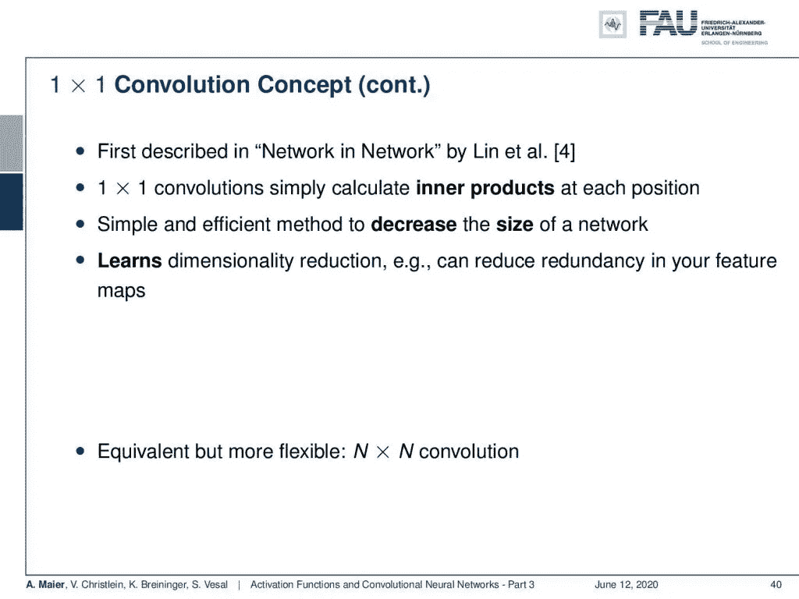

在[4]中介绍了 1x1 卷积。来自[深度学习讲座](https://www.youtube.com/watch?v=p-_Stl0t3kU&list=PLpOGQvPCDQzvgpD3S0vTy7bJe2pf_yJFj&index=1)的 [CC BY 4.0](https://creativecommons.org/licenses/by/4.0/) 下的图片。

这是在网络论文[4]中首次描述的，我们在讨论不同的架构时也会谈到。这些 1x1 卷积减小了网络的大小，特别是压缩了信道，并且它本质上学习了维数减少。因此，它们帮助您减少特征空间中的冗余。等效的，但更灵活的当然是 NxN 卷积。

在这个深度学习讲座中，更多令人兴奋的事情即将到来。 [CC 下的图片来自](https://creativecommons.org/licenses/by/4.0/)[深度学习讲座](https://www.youtube.com/watch?v=p-_Stl0t3kU&list=PLpOGQvPCDQzvgpD3S0vTy7bJe2pf_yJFj&index=1)的 4.0 。

所以下一次在深度学习中，我们将讨论池机制以及如何减少特征图的大小，而不是使用卷积步长或 atrous 卷积。你也可以在我们将在下节课讨论的池化步骤中对此进行显式建模。非常感谢大家的聆听，下节课再见！

如果你喜欢这篇文章，你可以在这里找到更多的文章，或者看看我们的讲座。如果你想在未来了解更多的文章、视频和研究，我也会很感激你在 YouTube、Twitter、脸书、LinkedIn 上的鼓掌或关注。本文以 [Creative Commons 4.0 归属许可](https://creativecommons.org/licenses/by/4.0/deed.de)发布，如果引用，可以转载和修改。

# 参考

[1] I. J. Goodfellow、d . ward-Farley、M. Mirza 等人，“最大网络”。载于:ArXiv 电子版(2013 年 2 月)。arXiv:1302.4389[统计 ML】。
[2]，，，，任等，“深入挖掘整流器:在 ImageNet 分类上超越人类水平的表现”。载于:CoRR abs/1502.01852 (2015)。arXiv: 1502.01852。
[3]君特·克兰鲍尔(Günter Klambauer)，托马斯·安特辛纳(Thomas Unterthiner)，安德烈亚斯·迈尔(Andreas Mayr)，等，“自归一化神经网络”。在:神经信息处理系统的进展。abs/1706.02515 卷。2017.arXiv: 1706.02515。
【四】、和水城颜。“网络中的网络”。载于:CoRR abs/1312.4400 (2013 年)。arXiv: 1312.4400。
[5]安德鲁·马斯、奥尼·汉南和安德鲁·吴。“整流器非线性改善神经网络声学模型”。在:过程中。ICML。第 30 卷。1.2013.
[6] Prajit Ramachandran，Barret Zoph，和 Quoc V. Le。“搜索激活功能”。载于:CoRR abs/1710.05941 (2017 年)。arXiv: 1710.05941。
【7】Stefan elf wing，内池英治，多亚贤治。“强化学习中神经网络函数逼近的 Sigmoid 加权线性单元”。载于:arXiv 预印本 arXiv:1702.03118 (2017)。
[8]克里斯蒂安·塞格迪、、·贾等，“用回旋深化”。载于:CoRR abs/1409.4842 (2014 年)。arXiv: 1409.4842。