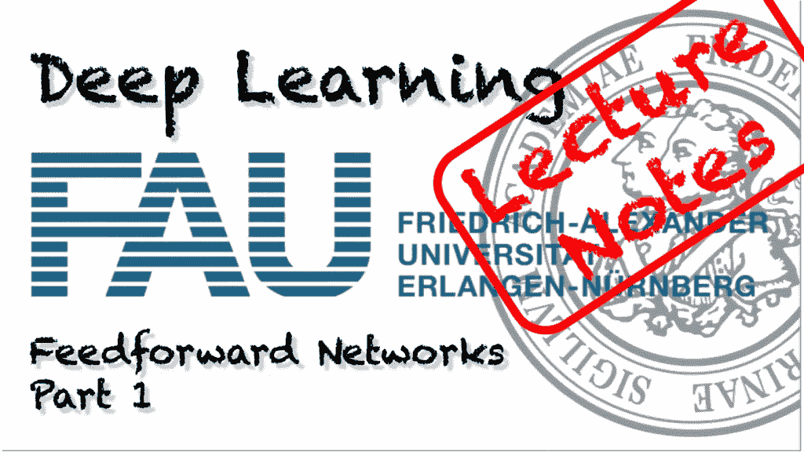
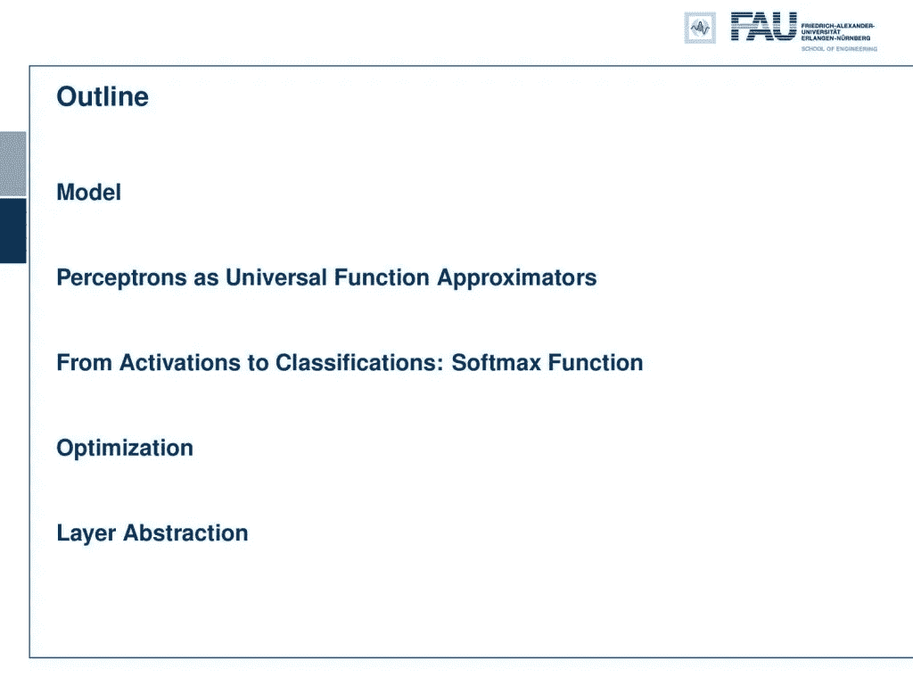
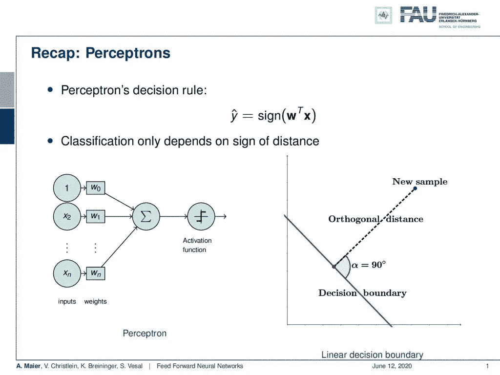
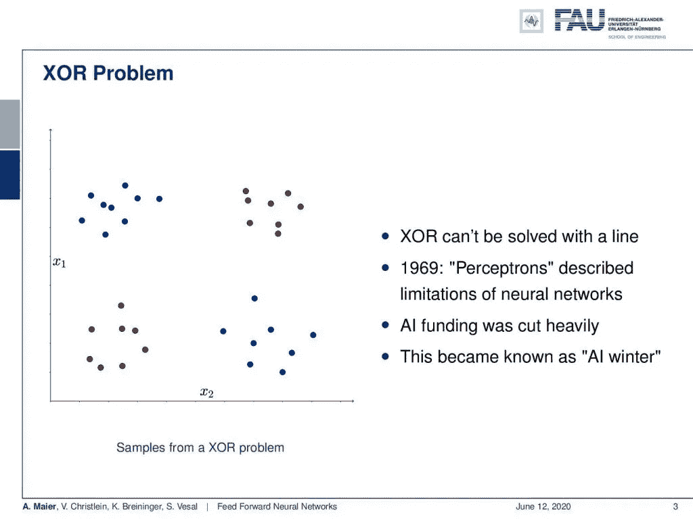
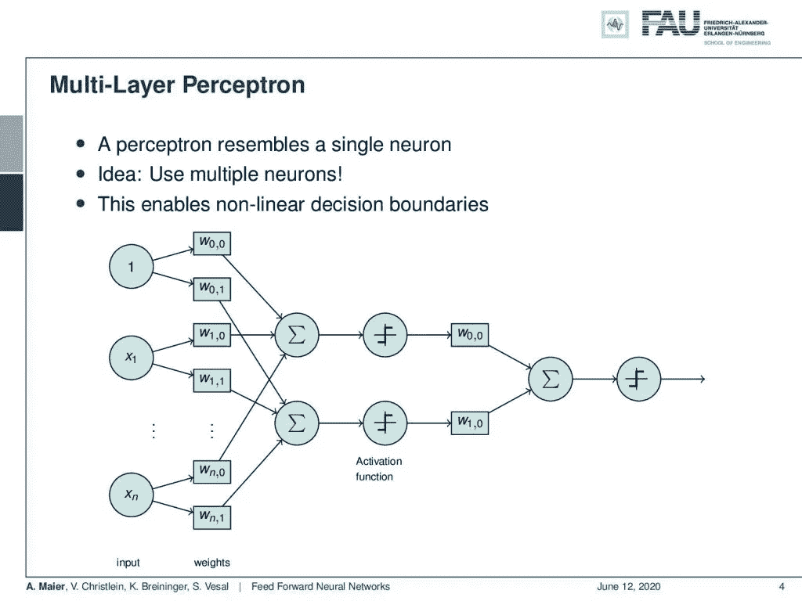
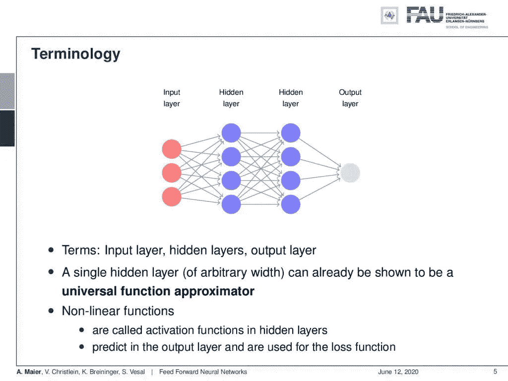
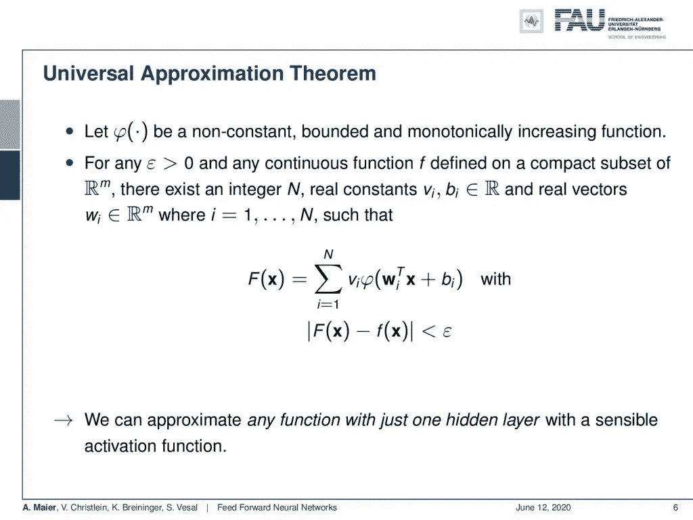
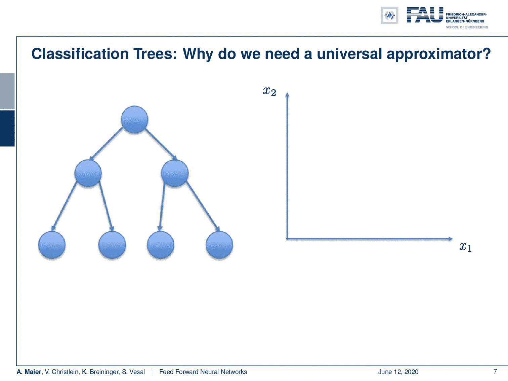
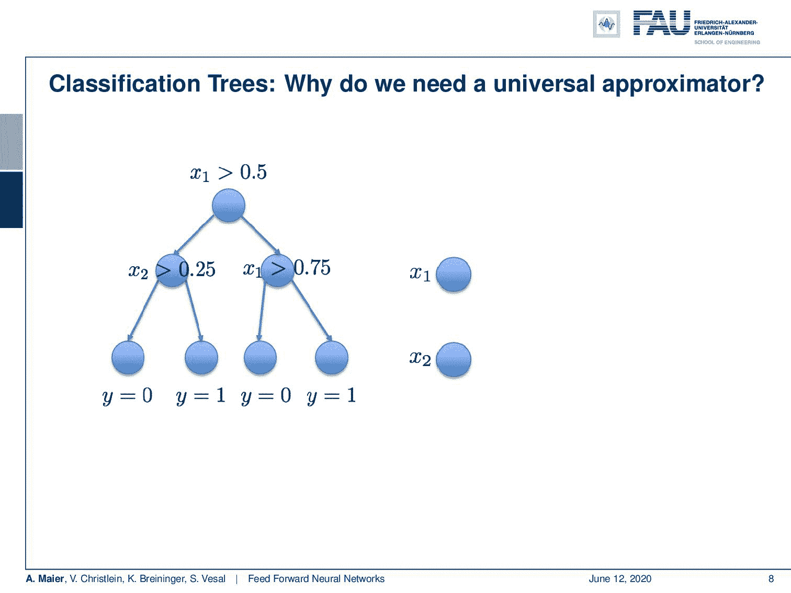
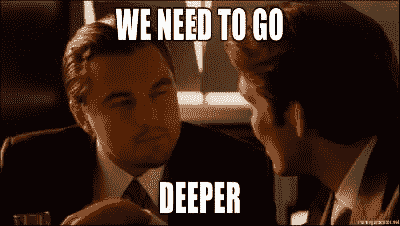

# 前馈网络—第 1 部分

> 原文：<https://towardsdatascience.com/lecture-notes-in-deep-learning-feedforward-networks-part-1-e74db01e54a8?source=collection_archive---------48----------------------->

## [FAU 讲座笔记](https://towardsdatascience.com/tagged/fau-lecture-notes)深度学习

## 我们为什么需要深度学习？

FAU 大学的深度学习。来自[深度学习讲座](https://www.youtube.com/watch?v=p-_Stl0t3kU&list=PLpOGQvPCDQzvgpD3S0vTy7bJe2pf_yJFj&index=1)的 [CC BY 4.0](https://creativecommons.org/licenses/by/4.0/) 下的图片。

**这些是 FAU 的 YouTube 讲座** [**深度学习**](https://www.youtube.com/watch?v=p-_Stl0t3kU&list=PLpOGQvPCDQzvgpD3S0vTy7bJe2pf_yJFj&index=1) **的讲义。这是与幻灯片匹配的讲座视频&的完整抄本。我们希望，你喜欢这个视频一样多。当然，这份抄本是用深度学习技术在很大程度上自动创建的，只进行了少量的手动修改。如果你发现了错误，请告诉我们！**

# 航行

[**上一讲**](/lecture-notes-in-deep-learning-introduction-part-5-a3b9faacd313) **/** [**观看本视频**](https://youtu.be/9eWxcYDSoXE) **/** [**顶级**](/all-you-want-to-know-about-deep-learning-8d68dcffc258) **/** [**下一讲**](/lecture-notes-in-deep-learning-feedforward-networks-part-2-c91b53a4d211)

这堂课的大纲。 [CC 下的图片来自](https://creativecommons.org/licenses/by/4.0/)[深度学习讲座](https://www.youtube.com/watch?v=p-_Stl0t3kU&list=PLpOGQvPCDQzvgpD3S0vTy7bJe2pf_yJFj&index=1)的 4.0 。

欢迎大家参加我们的深度学习讲座！今天，我们要深入这个话题。我们想介绍一些对该领域至关重要的重要概念和理论。今天的主题是前馈网络，前馈网络本质上是我们今天使用的神经网络的主要配置。所以在接下来的几个视频中，我们想谈谈第一批模型和它们背后的一些想法。我们也介绍一些理论。一个重要的模块是关于通用函数逼近，我们将从本质上说明神经网络能够逼近任何类型的函数。随后将引入 softmax 功能和一些激活。最后，我们想谈一谈如何优化这些参数，特别是反向传播算法。

感知器描述了一个线性决策边界。 [CC 下的图片来自](https://creativecommons.org/licenses/by/4.0/)[深度学习讲座](https://www.youtube.com/watch?v=p-_Stl0t3kU&list=PLpOGQvPCDQzvgpD3S0vTy7bJe2pf_yJFj&index=1)的 4.0 。

让我们从模型开始，你已经听到的是感知器。我们已经讨论过这个，它本质上是一个函数，将任何高维输入映射到权重向量和输入的内积。然后，我们只对计算出的带符号距离感兴趣。你可以从本质上理解这一点，就像你在右边看到的那样。决策边界以红色显示，您用内积计算的实际上是新样本到决策边界的带符号距离。如果我们只考虑标志，我们就能决定我们是站在一边还是另一边。

经典的模式识别流水线。来自[深度学习讲座](https://www.youtube.com/watch?v=p-_Stl0t3kU&list=PLpOGQvPCDQzvgpD3S0vTy7bJe2pf_yJFj&index=1)的 [CC BY 4.0](https://creativecommons.org/licenses/by/4.0/) 下的图片。

现在，如果你看看经典的模式识别和机器学习，我们仍然会遵循所谓的模式识别管道。我们对一些测量值进行了转换和预处理，以提高质量，例如降低噪声。在预处理中，我们基本上停留在与输入相同的域中。因此，如果您有一个图像作为输入，预处理的输出也将是一个图像，但对于分类任务可能具有更好的属性。然后，我们要做特征提取。你还记得苹果和梨的例子。从这些特征中，我们提取特征，然后产生一些高维向量空间。然后，我们可以继续进行分类。

感知器不能解决非线性可分问题，如逻辑异或任务。 [CC 下的图片来自](https://creativecommons.org/licenses/by/4.0/)[深度学习讲座](https://www.youtube.com/watch?v=p-_Stl0t3kU&list=PLpOGQvPCDQzvgpD3S0vTy7bJe2pf_yJFj&index=1)的 4.0 。

现在，我们在感知器中看到的是，我们能够模拟线性决策边界。这立即导致了感知机不能解决逻辑异或(即所谓的异或)的观察。你可以在左边看到上面 XOR 问题的可视化。想象一下，你有一些类的分布，左上角和右下角是蓝色的，另一个类是左下角和右上角的。这是受逻辑异或函数的启发。你将不能用一个单一的线性决策边界来分离这两个点云。所以，你要么需要曲线，要么使用多条线。用一个单一的感知器，你将无法解决这个问题。因为人们一直在争论:“看，我们可以用感知器来模拟逻辑功能。如果我们在感知器的基础上构建感知器，我们基本上可以构建所有的逻辑！”

2004 年，人工智能冬季项目的资金被大幅削减.图片来自 [Giphy](https://media.giphy.com/media/GgbCiS1rMjGFy/source.gif) 。

现在，如果你不能构建 XOR，那么你很可能无法描述整个逻辑，因此，我们永远不会实现强大的人工智能。这是一段时间，人工智能研究的所有资金都被大幅削减，人们将不会获得任何新的拨款。他们不会得到资金来支持这项研究。因此，这一时期被称为“艾冬天”。

从感知机到多层感知机。来自[深度学习讲座](https://www.youtube.com/watch?v=p-_Stl0t3kU&list=PLpOGQvPCDQzvgpD3S0vTy7bJe2pf_yJFj&index=1)的 4.0CC 下的图片。

随着多层感知器的引入，事情发生了变化。这是感知器的扩展。你不只是做一个单一的神经元，而是使用多个这样的神经元，并把它们排列成层。这里你可以看到一个非常简单的草稿。所以，它非常类似于感知器。你基本上有一些输入和权重。现在，你可以看到，它不仅仅是一个简单的总和，我们还有几个非线性的总和。然后，它们再次分配权重并再次汇总，以进入另一个非线性。

深层网络将许多层排列在彼此之上。 [CC 下的图片来自](https://creativecommons.org/licenses/by/4.0/)[深度学习讲座](https://www.youtube.com/watch?v=p-_Stl0t3kU&list=PLpOGQvPCDQzvgpD3S0vTy7bJe2pf_yJFj&index=1)的 4.0 。

这非常有趣，因为我们可以使用多个神经元。我们现在还可以模拟非线性决策边界。你可以继续，然后把这个分层排列。所以你通常做的是，你有一些输入层。这是我们的向量 x。然后，你有几个感知器，你安排在隐藏层。它们被称为隐藏的，因为它们不会立即观察到输入。他们分配权重，然后计算一些东西，只有在最后，在输出端，你又有一个层，你可以观察实际发生了什么。所有这些隐藏层之间的重量，都是无法直接观察到的。在这里，只有当你输入一些信息，计算激活时，你才能观察到它们，然后在最后，你可以获得输出。所以，在这里你可以观察到你的系统中发生了什么。

泛逼近允许我们学习紧集上的任何连续函数 f( **x** )。来自[深度学习讲座](https://www.youtube.com/watch?v=p-_Stl0t3kU&list=PLpOGQvPCDQzvgpD3S0vTy7bJe2pf_yJFj&index=1)的 4.0CC 下的图片。

现在，我们将研究所谓的通用函数逼近器。这实际上只是一个只有一个隐藏层的网络。通用函数逼近是一个基本的理论，因为它告诉我们，用一个单一的隐藏层，我们可以逼近任何连续函数。那么，让我们深入研究一下这个定理。它从一个正式的定义开始。我们有一些𝜑(x)和𝜑(x)是非常数的，有界的，单调递增的函数。存在一些大于零的𝜀，并且对于定义在某个高维空间ℝᵐ的紧子集上的任何连续函数 f( **x** )，存在整数和实常数𝜈和 b，以及实向量 **w** ，在这里可以找到近似。在这里，你现在可以看到近似值是如何计算的。你有一个输入加上一些偏差的权重的内积。这进入一些激活函数𝜑(x).这是一个非常数、有界、单调递增的函数。然后你有另一个使用这些𝜈的线性组合，然后产生输出资本 F( **x** )。所以 F( **x** )是我们的近似值，近似值是由线性组合计算出的非线性的线性组合。如果你这样定义，你可以证明，如果你从真函数 F( **x** )中 f( **x** )，两者之间的绝对差由一个常数𝜀.限定𝜀大于零。

我们真的需要深度学习吗？图片来自[knowyourmeme.com](https://knowyourmeme.com/photos/534153-we-need-to-go-deeper)。

这已经是非常有用的近似值了。有一个上限𝜀，但现在它没有告诉我们𝜀实际上有多大。所以，𝜀可能真的很大。通用逼近定理也告诉我们，如果我们增加 n，那么𝜀下降。如果你用 n 趋近于无穷大，𝜀会趋近于零。所以，我们在这个隐藏层中采用的神经元越多，我们的逼近就越好。这意味着，我们可以用一个隐藏层来逼近任何函数。所以你可能会说，如果你可以用一个层来近似所有的东西，为什么人们要做深度学习呢？

分类树可以细分ℝᵐ.的任何分区来自[深度学习讲座](https://www.youtube.com/watch?v=p-_Stl0t3kU&list=PLpOGQvPCDQzvgpD3S0vTy7bJe2pf_yJFj&index=1)的 4.0CC 下的图片。

如果一层就够了，深度学习就没有任何意义。我刚刚向你证明了这一点。所以可能不需要深度学习？让我们看一些例子:我在这里取了一个分类树，分类树是一种细分空间的方法。这里我举一个二维例子，我们有一些输入空间 x₁和 x₂.这很有用，因为我们可以在幻灯片上非常有效地将其可视化。我们的决策树做以下事情:它决定 x₁是否大于 0.5。请注意，我在右边展示的是决策边界。在下一个节点，如果你走到左边，你看着 x₂，决定它是大于还是小于 0.25。在另一边，你简单地再看一下 x₁，决定它是大于还是小于 0.75。现在，如果你这样做了，你可以在叶节点中分配类。在这些叶子中，你现在可以，例如，赋值 0 或 1，这给出了这个地方的一个细分，它具有镜像 l 的形状。

尝试将分类树转换为单个隐藏层网络。 [CC 下的图片来自](https://creativecommons.org/licenses/by/4.0/)[深度学习讲座](https://www.youtube.com/watch?v=p-_Stl0t3kU&list=PLpOGQvPCDQzvgpD3S0vTy7bJe2pf_yJFj&index=1)的 4.0 。

这是一个函数，这个函数现在可以用一个通用函数近似器来近似。所以让我们试着去做。我们可以把它变成一个网络。让我们使用下面的想法:我们的网络有 2 个输入神经元，因为它是一个二维空间。有了我们的决策边界，我们也可以形成这些决策 x₁大于或小于 0.5。所以，我们可以立即采用这个。我们实际上也可以采用所有其他内部节点。因为我们在这个例子中使用了一个 sigmoid，所以我们也使用了内部节点的逆节点，并将它们作为额外的神经元放入。当然，在这里我不需要学习任何东西，因为对于第一个隐藏层的连接，我可以从树的定义中得到它们。它们已经预先定义好了，所以这里不需要学习。在输出端，我必须学习一些权重，这可以通过使用最小二乘近似来完成，然后我可以直接计算这些权重。

在每个节点中创建的输入空间的空间细分的可视化。我们无法使用这种单层网络找到精确的解决方案。来自[深度学习讲座](https://www.youtube.com/watch?v=p-_Stl0t3kU&list=PLpOGQvPCDQzvgpD3S0vTy7bJe2pf_yJFj&index=1)的 [CC BY 4.0](https://creativecommons.org/licenses/by/4.0/) 下的图片。

如果我真的这样做了，我们也可以找到一个很好的可视化。你可以看到，通过我们的决策边界，我们实际上是在隐藏层中构建一个基础。你可以看到，如果我用 0 和 1 作为黑白，对于每个隐藏节点，我都在构造一个基向量。然后，它们基本上被线性加权以用于输出。你可以这样做，把每个像素乘以每个像素，然后简单地求和。这就是隐藏层的作用。然后，我主要对组合这些空间向量感兴趣，这样它将产生期望的 y，现在，如果我在最小二乘意义上这样做，我得到右边的近似值。所以还算不错。我把这个放大了一点。这就是我们想要的。这是镜像的 L，这是我刚刚提出的近似值。现在，你可以看到它有点像 l 形，但这里的值在[0，1]之间，我的六神经元近似的𝜀可能在 0.7 的范围内。所以它确实有点作用，但是近似值不是很好。在这种特殊的配置中，你必须大大增加神经元的数量，以降低误差，因为这是一个非常困难的问题。几乎无法近似。

使用两层，任何分类树都可以映射到神经网络，而不会丢失信息。 [CC 下的图片来自](https://creativecommons.org/licenses/by/4.0/)[深度学习讲座](https://www.youtube.com/watch?v=p-_Stl0t3kU&list=PLpOGQvPCDQzvgpD3S0vTy7bJe2pf_yJFj&index=1)的 4.0 。

那么，我们还能做什么？好吧，如果我们想要这样，我们可以，例如，增加第二个非线性。然后，我们会得到我们想要的解决方案。所以你可以看到，也许一层在表现方面不是很有效率。有一种算法可以将任何决策树映射到神经网络上。算法如下:你取所有的内部节点，这里是 0.5，0.25 和 0.75 之间的决定。这些是内部节点，然后你把它们适当地连接起来。你把它们连接起来，这样你就能准确地形成子区域。这里你可以看到这是我们的 L 形，为了构建左上角的区域，我们需要访问第一个决策。它将空间分为左半空间和右半空间。接下来，我们可以访问第二个决策。这样，我们可以使用这两个决定，以便在左上角形成这个小补丁。对于从决策边界出现的所有四个补丁，我们基本上得到一个节点。这仅仅意味着对于每个叶节点，我们在第二层得到一个节点。因此，第一层中的每个内部节点一个节点，第二层中的每个叶节点一个节点。然后，在输出中组合它们。在这里，你甚至不需要计算任何东西，因为我们已经知道为了达到正确的决策界限，这些必须如何合并。通过这种方式，我们设法将你的决策树转换成神经网络，它会按照我们希望的那样进行正确的逼近。

我们反复出现的座右铭:我们需要更深入！图片来自[knowyourmeme.com](https://knowyourmeme.com/photos/531557-we-need-to-go-deeper)。

我们从这个例子中学到了什么？我们可以用一个只有一个隐藏层的通用函数逼近器来逼近任何函数。但是如果我们深入研究，我们可能会发现一个更有效的问题分解。所以这里的分解首先是内部节点，然后是叶节点。这使我们能够推导出一个只有七个节点的算法，并且可以精确地近似这个问题。所以你可以说，通过建立更深的网络，你增加了额外的步骤。在每一步中，你都试图简化功能和表达的力量，这样你最终能更好地处理决策。

在这个深度学习讲座中，更多令人兴奋的事情即将到来。来自[深度学习讲座](https://www.youtube.com/watch?v=p-_Stl0t3kU&list=PLpOGQvPCDQzvgpD3S0vTy7bJe2pf_yJFj&index=1)的 [CC BY 4.0](https://creativecommons.org/licenses/by/4.0/) 下的图片。

现在，让我们回到我们的通用函数逼近定理。所以，我们已经看到了它的存在。它告诉我们，我们可以用一个隐藏层来逼近一切。这已经是一个很酷的观察结果，但是它没有告诉我们如何选择 n，也没有告诉我们如何训练。所以通用逼近定理有很多问题。这就是我们为什么要进行深度学习的本质原因。然后，我们可以建立系统，通过不同的步骤开始解开表象。如果我们这样做，我们可以建立更高效、更强大的系统，并对它们进行端到端的培训。这是我们走向深度学习的主要原因。我希望任何从事深度学习的人都知道通用近似，以及为什么深度学习实际上有意义。好了，今天就到这里。下一次，我们将讨论激活函数，并在下一组视频中开始介绍反向传播算法。敬请关注！我希望你喜欢这个视频。期待在下一部中见到你！

如果你喜欢这篇文章，你可以在这里找到更多的文章，或者看看我们的讲座。如果你想在未来了解更多的文章、视频和研究，我也会很感激你在 YouTube、Twitter、脸书、LinkedIn 上的鼓掌或关注。本文以 [Creative Commons 4.0 归属许可](https://creativecommons.org/licenses/by/4.0/deed.de)发布，如果引用，可以转载和修改。

# 参考

[1] R. O .杜达，P. E .哈特和 D. G .斯托克。模式分类。约翰威利父子公司，2000 年。
[2]克里斯托弗·m·毕晓普。模式识别和机器学习(信息科学和统计学)。美国新泽西州 Secaucus 出版社:纽约斯普林格出版社，2006 年。
[3]f·罗森布拉特。"感知器:大脑中信息存储和组织的概率模型."摘自:《心理评论》65.6 (1958)，第 386-408 页。
[4] WS。麦卡洛克和 w .皮茨。"对神经活动中固有思想的逻辑演算."发表于:数学生物物理学通报 5 (1943)，第 99-115 页。
[5]d . e .鲁梅尔哈特、G. E .辛顿和 R. J .威廉斯。"通过反向传播误差学习表征."载于:自然 323 (1986)，第 533-536 页。
[6] Xavier Glorot，Antoine Bordes，Yoshua Bengio。“深度稀疏整流器神经网络”。《第十四届国际人工智能会议论文集》第 15 卷。2011 年，第 315-323 页。
[7]威廉·h·普雷斯、索尔·a·特乌考斯基、威廉·t·维特林等《数值计算方法》第三版:科学计算的艺术。第三版。美国纽约州纽约市:剑桥大学出版社，2007 年。