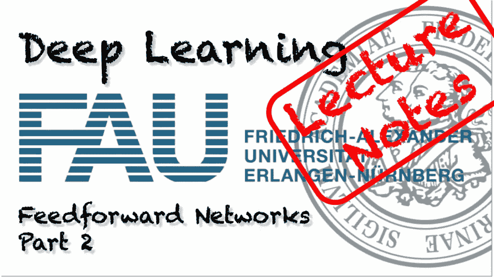
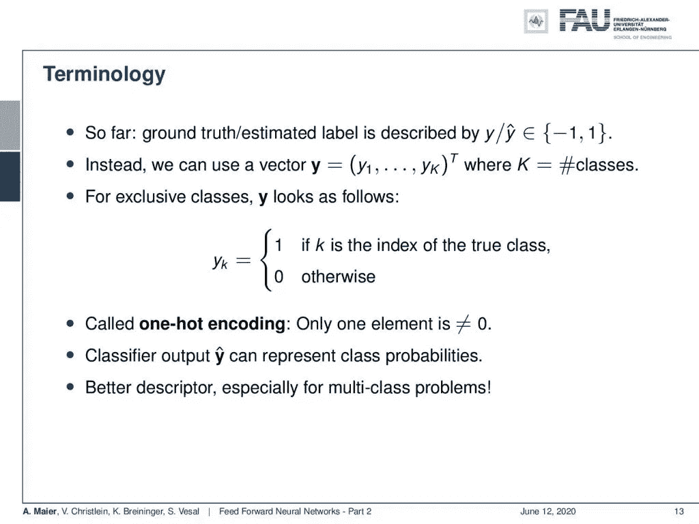
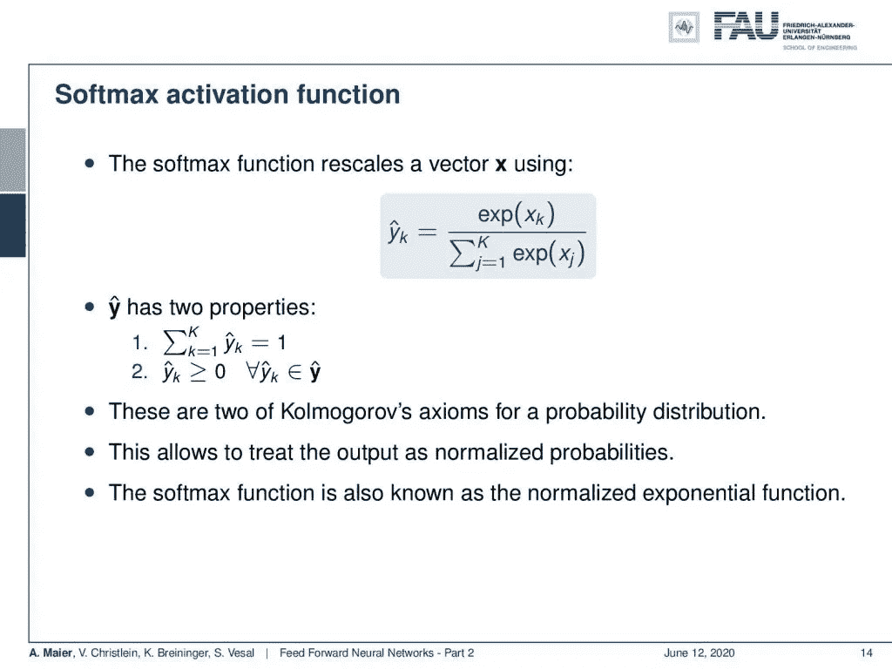
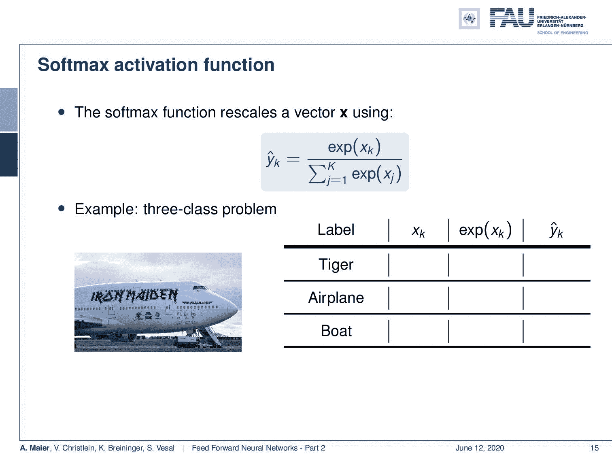
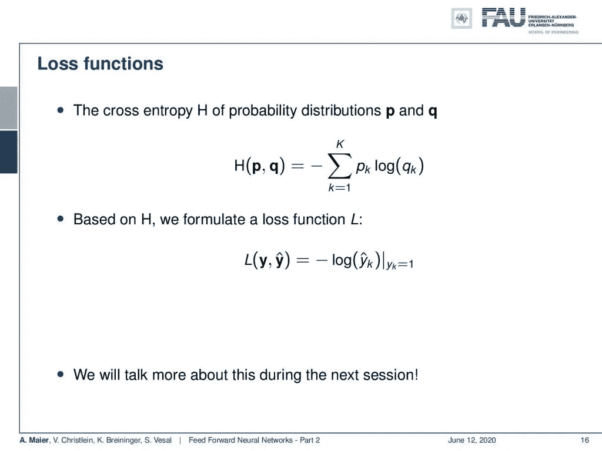
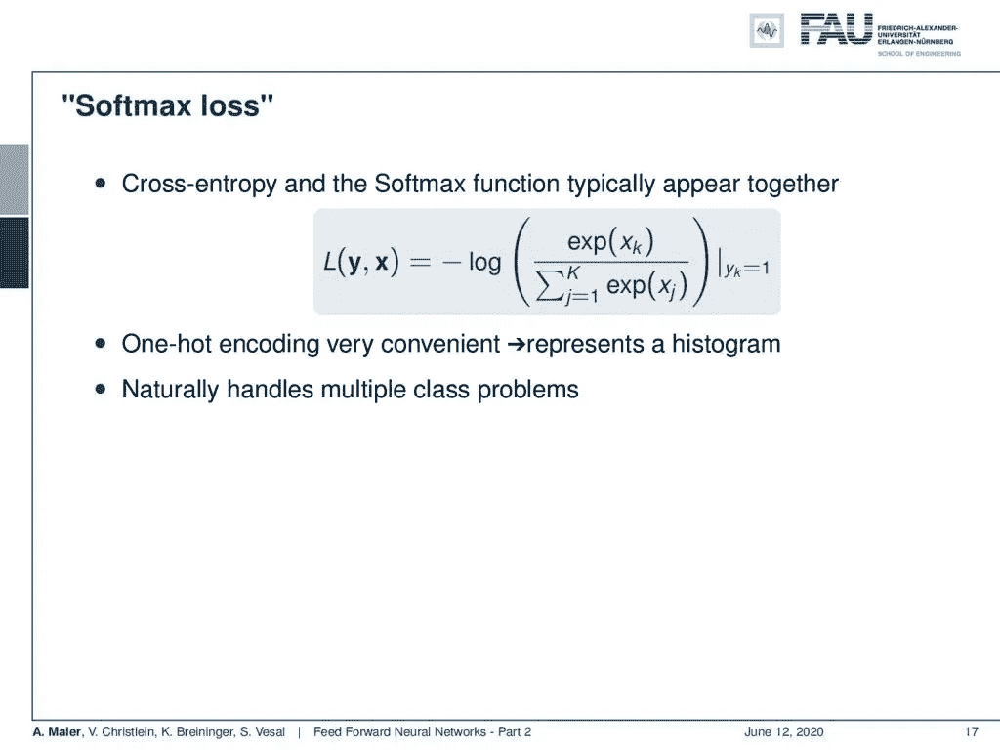
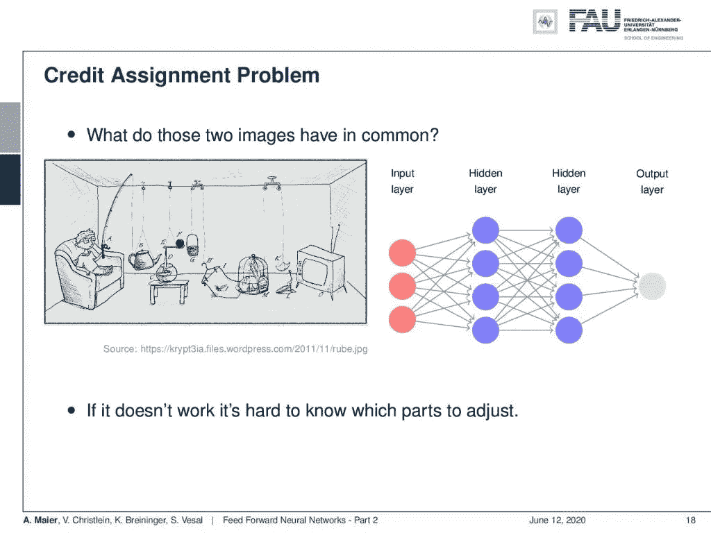

# 前馈网络—第 2 部分

> 原文：<https://towardsdatascience.com/lecture-notes-in-deep-learning-feedforward-networks-part-2-c91b53a4d211?source=collection_archive---------54----------------------->

## [FAU 讲座笔记](https://towardsdatascience.com/tagged/fau-lecture-notes)深度学习

## 如何训练网络？

FAU 大学的深度学习。下图 [CC BY 4.0](https://creativecommons.org/licenses/by/4.0/) 来自[深度学习讲座](https://www.youtube.com/watch?v=p-_Stl0t3kU&list=PLpOGQvPCDQzvgpD3S0vTy7bJe2pf_yJFj&index=1)

**这些是 FAU 的 YouTube 讲座** [**深度学习**](https://www.youtube.com/watch?v=p-_Stl0t3kU&list=PLpOGQvPCDQzvgpD3S0vTy7bJe2pf_yJFj&index=1) **的讲义。这是与幻灯片匹配的讲座视频&的完整抄本。我们希望，你喜欢这个视频一样多。当然，这份抄本是用深度学习技术在很大程度上自动创建的，只进行了少量的手动修改。如果你发现了错误，请告诉我们！**

# 航行

[**上一讲**](/lecture-notes-in-deep-learning-feedforward-networks-part-1-e74db01e54a8) **/** [**观看本视频**](https://youtu.be/Yu4BAMXDp3k) **/** [**顶级**](/all-you-want-to-know-about-deep-learning-8d68dcffc258) **/** [**下一讲**](/lecture-notes-in-deep-learning-feedforward-networks-part-3-d2a0441b8bca)

欢迎来到深度学习！所以在这个小视频中，我们想继续深入了解神经网络的一些基本功能。特别是，我们希望研究 softmax 函数，并研究一些关于我们如何潜在地训练深度网络的想法。好的，让我们从分类的激活函数开始。

不同类型标签编码策略综述。 [CC 下的图片来自](https://creativecommons.org/licenses/by/4.0/)[深度学习讲座](https://www.youtube.com/watch?v=p-_Stl0t3kU&list=PLpOGQvPCDQzvgpD3S0vTy7bJe2pf_yJFj&index=1)的 4.0 。

到目前为止，我们已经通过标签-1 和+1 描述了基本事实，但是当然，我们也可以有类 0 和 1。如果我们只在两个类之间做决定，这真的只是一个定义的问题。但是如果你想进入更复杂的情况，你希望能够分类多个类。在这种情况下，你可能想要一个输出向量。这里，基本上每个类 K 有一个维度，其中 K 是类的数量。然后，您可以将基本事实表示定义为一个向量，该向量除了一个位置之外都是零，这就是真实类。这也被称为一键编码，因为向量的其他部分都是 0。只有一个有 1。现在，你试着计算一个分类器，它将产生我们各自的向量，有了这个向量，你就可以继续进行分类了。

softmax 函数允许将任意向量缩放到 0 到 1 之间的值。来自[深度学习讲座](https://www.youtube.com/watch?v=p-_Stl0t3kU&list=PLpOGQvPCDQzvgpD3S0vTy7bJe2pf_yJFj&index=1)的 [CC BY 4.0](https://creativecommons.org/licenses/by/4.0/) 下的图片。

所以本质上就像我在猜测每个类的输出概率。特别地，对于多类问题，这已经被证明是解决这些问题的更有效的方式。问题是你想得到一种接近 0 和 1 的概率输出，但是我们通常有一些可以任意缩放的输入向量 **x** 。所以，为了产生我们的预测，我们使用了一个技巧。诀窍是我们使用指数函数，因为它会将一切映射到一个正空间。现在，您要确保可以达到的最大值正好是 1。因此，对所有的类都这样做，并计算所有输入元素的所有指数的和。这就给了你这种转换所能达到的最大值。然后，将所有给定的输入除以这个数，这将始终缩放到[0，1]域。产生的向量也将具有这样的性质，如果你将所有元素相加，它将等于 1。这是 Kolmogorov 提出的概率分布的两个公理。所以，这允许我们把网络的输出，总是当作一种概率。如果您在文献和软件示例中查找，有时 softmax 函数也称为归一化指数函数。这是一回事。

一个典型的多类问题以及如何计算它的 softmax 函数。 [CC 下的图片来自](https://creativecommons.org/licenses/by/4.0/)[深度学习讲座](https://www.youtube.com/watch?v=p-_Stl0t3kU&list=PLpOGQvPCDQzvgpD3S0vTy7bJe2pf_yJFj&index=1)的 4.0 。

现在，让我们看一个例子。假设这是我们对神经网络的输入。所以，你在左边看到这个小图像。现在，你为这三类问题引入标签。等等，少了点什么！是四级问题！所以，你为这个四类问题引入标签。然后，您有一些任意输入，显示在 x 下标 k 列中。因此，它们的范围是从-3.44 到 3.01。这不是很好，所以我们用指数函数。现在，所有的东西都被映射成正数，这些数字之间有很大的差别。因此，我们需要重新调整它们的比例，你可以看到，在这张图片中，重金属返回的概率当然是最高的！

交叉熵可以用来度量两个概率分布之间的差异。来自[深度学习讲座](https://www.youtube.com/watch?v=p-_Stl0t3kU&list=PLpOGQvPCDQzvgpD3S0vTy7bJe2pf_yJFj&index=1)的 [CC BY 4.0](https://creativecommons.org/licenses/by/4.0/) 下的图片。

那么，让我们继续讨论一下损失函数。所以损失函数是一种告诉你一个网络的预测有多好的函数。一个非常典型的就是所谓的交叉熵损失。在两个概率分布之间计算交叉熵。所以，你有你的基本事实分布和你正在估计的。然后，您可以计算交叉熵，以确定它们的连接程度，即它们相互对齐的程度。然后，你也可以用这个作为损失函数。在这里，我们可以使用这样的属性:除了 true 类之外，所有的元素都为零。所以我们只需要确定 y hat 下标 k 的负对数，这里 k 是真类。这大大简化了计算，我们去掉了上面的求和。顺便说一下，这有几个更有趣的解释，我们将在下一个视频中讨论它们。

softmax 损失将 softmax 函数与交叉熵损失相结合。 [CC 下的图片来自](https://creativecommons.org/licenses/by/4.0/)[深度学习讲座](https://www.youtube.com/watch?v=p-_Stl0t3kU&list=PLpOGQvPCDQzvgpD3S0vTy7bJe2pf_yJFj&index=1)的 4.0 。

现在，如果你这样做，我们可以插入 softmax 函数，并构建所谓的 softmax 损失。你可以看到，我们有 softmax 函数，然后我们只对有真类的元素取负对数。这是在网络训练中经常使用的东西。这种 softmax 损失非常常用，对一个热编码的地面真相非常有用。它也代表了一个直方图。它与统计和分布有关。此外，所有的多类问题都可以用这种方法一次性解决。

更改单个权重将影响所有其他后续权重。 [CC 下的图片来自](https://creativecommons.org/licenses/by/4.0/)[深度学习讲座](https://www.youtube.com/watch?v=p-_Stl0t3kU&list=PLpOGQvPCDQzvgpD3S0vTy7bJe2pf_yJFj&index=1)的 4.0 。

我想在这个视频中谈论的另一件事是优化。所以，我们根本没有考虑的一件大事是我们实际上如何训练这些网络。我们已经看到这些无法直接观察到的隐藏层。这给我们带来了一个非常困难的情况，你可能会认为右边的图像与左边的非常相似:如果你改变了这一系列事件中的任何事情，它可能会从本质上摧毁整个系统。所以，你必须非常小心地调整路径上的任何东西，因为你必须考虑到所有其他的处理步骤。这真的很难，你必须小心调整什么。

在最优化问题中训练神经网络。来自[深度学习讲座](https://www.youtube.com/watch?v=p-_Stl0t3kU&list=PLpOGQvPCDQzvgpD3S0vTy7bJe2pf_yJFj&index=1)的 [CC BY 4.0](https://creativecommons.org/licenses/by/4.0/) 下的图片。

现在，我们将走简单的路，我们将把它公式化为一个优化问题。我们已经讨论过，我们需要某种损失函数。损失函数告诉我们预测与实际训练数据的拟合程度。输入是权重 **w** 、 **x** 输入向量和 **y** 它们是我们的基本事实标签。我们必须考虑所有 M 个训练样本，这允许我们描述某种损失。因此，如果我们这样做，我们就可以计算出损失的期望值，它实际上是所有观测值的总和。然后，这个缩放的总和被用于确定整个训练数据集的拟合度。现在，如果我们想要创建一组最优的权重，我们要做的是选择在整个训练数据集上最小化关于 **w** 的损失函数。

使用沿着负梯度方向的迭代更新找到更好的权重。 [CC 下的图片来自](https://creativecommons.org/licenses/by/4.0/)[深度学习讲座](https://www.youtube.com/watch?v=p-_Stl0t3kU&list=PLpOGQvPCDQzvgpD3S0vTy7bJe2pf_yJFj&index=1)的 4.0 。

现在我们有了一些数学原理，告诉我们该怎么做，我们知道最小化。让我们尝试一个显而易见的选择:梯度下降。因此，我们选择找到最小化所有训练样本损失的最小值 **w** 。为了做到这一点，我们计算梯度，我们需要对 **w** 进行一些初步猜测。有许多不同的方式来初始化 **w** 。有些人只是使用随机初始化的权重，然后你继续做梯度下降。所以，你一步一步地沿着负梯度方向，直到你到达某个最小值。所以在这里，你可以看到这个初始的 **w** ，这个步骤可能是随机的。然后在步骤 2 中，迭代直到收敛。因此，计算损失函数相对于 **w** 的梯度。那么你需要一些学习率η。η实际上告诉你这些单个箭头的步长。然后，你沿着这个方向，直到你到达一个最小值。现在，η通常被称为学习率。有趣的是，这种方法非常简单，你总能找到最小值。它可能只是一个局部函数，但是您可以最小化该函数。很多人做的是运行几次随机初始化。这些随机初始化然后被用来寻找不同的局部最小值。然后，他们简单地为他们的最终系统取最好的局部最小值。

网络是典型的嵌套函数，这使得梯度计算有点困难。来自[深度学习讲座](https://www.youtube.com/watch?v=p-_Stl0t3kU&list=PLpOGQvPCDQzvgpD3S0vTy7bJe2pf_yJFj&index=1)的 4.0CC 下的图片。

我们试图优化的这个 *L* 是什么？嗯， *L* 是在输出层计算的。因此，我们将输入输入到整个网络的网络流程中，然后，最终，我们计算出与我们期望的输出之间的差异、拟合度或损耗。所以你可以说，如果第一层是 *f* 第二层是 *g* ，那么我们感兴趣的是计算某些输入的*L*x 和 **w** 。我们使用 **w** 下标 f 计算 *f* ，然后使用权重 **w** 下标 *g* ，计算 *g* ，最后，我们计算 *g* 和 **y** 之间的拟合度。这就是我们需要在损失函数中计算的。

你会发现这有点困难，而且对于更深的网络来说会变得更加困难。因此，我们将看到，我们需要能够有效地做到这一点。有一种非常有效的算法可以解决这类问题，它被称为反向传播算法，这将是我们下节课的主题。所以，非常感谢大家的收听，下期视频再见！

在这个深度学习讲座中，更多令人兴奋的事情即将到来。 [CC 下的图片来自](https://creativecommons.org/licenses/by/4.0/)[深度学习讲座](https://www.youtube.com/watch?v=p-_Stl0t3kU&list=PLpOGQvPCDQzvgpD3S0vTy7bJe2pf_yJFj&index=1)的 4.0 。

如果你喜欢这篇文章，你可以在这里找到更多的文章，或者看看我们的讲座。如果你想在未来了解更多的文章、视频和研究，我也会很感激你在 YouTube、Twitter、脸书、LinkedIn 上的鼓掌或关注。本文以 [Creative Commons 4.0 归属许可](https://creativecommons.org/licenses/by/4.0/deed.de)发布，如果引用，可以转载和修改。

# 参考

[1] R. O .杜达，P. E .哈特和 D. G .斯托克。模式分类。约翰威利父子公司，2000 年。
[2]克里斯托弗·m·毕晓普。模式识别和机器学习(信息科学和统计学)。美国新泽西州 Secaucus 出版社:纽约斯普林格出版社，2006 年。
[3]f·罗森布拉特。"感知器:大脑中信息存储和组织的概率模型."摘自:《心理评论》65.6 (1958)，第 386-408 页。
【4】WS。麦卡洛克和 w .皮茨。"对神经活动中固有思想的逻辑演算."发表于:数学生物物理学通报 5 (1943)，第 99-115 页。[5] D. E .鲁梅尔哈特、G. E .辛顿和 R. J .威廉斯。"通过反向传播误差学习表征."载于:自然 323 (1986)，第 533-536 页。
[6]泽维尔·格洛特，安托万·博德斯，约舒阿·本吉奥。“深度稀疏整流器神经网络”。《第十四届国际人工智能会议论文集》第 15 卷。2011 年，第 315-323 页。
[7]威廉·h·普雷斯、索尔·a·特乌考斯基、威廉·t·维特林等《数值计算方法》第三版:科学计算的艺术。第三版。美国纽约州纽约市:剑桥大学出版社，2007 年。