# 前馈网络—第 3 部分

> 原文：<https://towardsdatascience.com/lecture-notes-in-deep-learning-feedforward-networks-part-3-d2a0441b8bca?source=collection_archive---------52----------------------->

## [FAU 讲座笔记](https://towardsdatascience.com/tagged/fau-lecture-notes)深度学习

## 反向传播算法

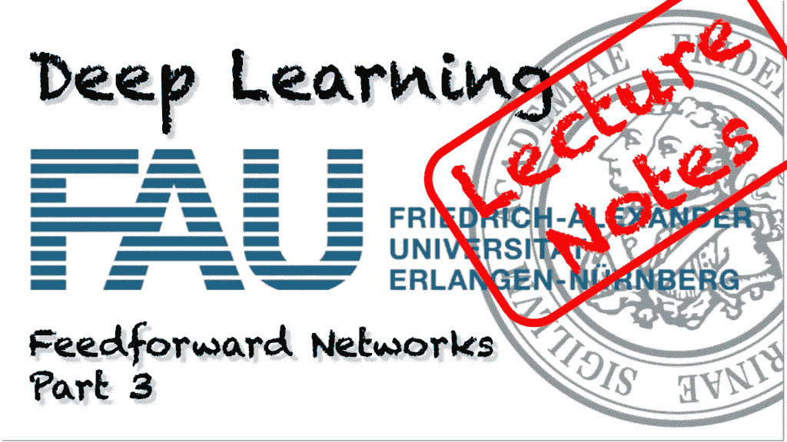

FAU 大学的深度学习。下图 [CC BY 4.0](https://creativecommons.org/licenses/by/4.0/) 来自[深度学习讲座](https://www.youtube.com/watch?v=p-_Stl0t3kU&list=PLpOGQvPCDQzvgpD3S0vTy7bJe2pf_yJFj&index=1)

**这些是 FAU 的 YouTube 讲座** [**深度学习**](https://www.youtube.com/watch?v=p-_Stl0t3kU&list=PLpOGQvPCDQzvgpD3S0vTy7bJe2pf_yJFj&index=1) **的讲义。这是与幻灯片匹配的讲座视频&的完整抄本。我们希望，你喜欢这个视频一样多。当然，这份抄本是用深度学习技术在很大程度上自动创建的，只进行了少量的手动修改。如果你发现了错误，请告诉我们！**

# 航行

[**上一讲**](/lecture-notes-in-deep-learning-feedforward-networks-part-2-c91b53a4d211) **/** [**观看本视频**](https://youtu.be/rWBPr2N5MVY) **/** [**顶级**](/all-you-want-to-know-about-deep-learning-8d68dcffc258) **/** [**下一讲**](/lecture-notes-in-deep-learning-feedforward-networks-part-4-65593eb14aed)

对于今天的示例函数，我们将计算数值导数和解析导数。 [CC 下的图片来自](https://creativecommons.org/licenses/by/4.0/)[深度学习讲座](https://www.youtube.com/watch?v=p-_Stl0t3kU&list=PLpOGQvPCDQzvgpD3S0vTy7bJe2pf_yJFj&index=1)的 4.0 。

欢迎大家来深度学习！谢谢收听。今天的主题是反向传播算法。所以，你可能会对我们如何在复杂的神经网络中计算这些导数感兴趣。让我们看一个简单的例子。我们真正的函数是 2 *x* ₁加 3 *x* ₂的 2 加 3 次方。现在，我们要计算 f( **x** )在位置(1 3)ᵀ相对于 *x* ₁.)的偏导数有两种算法可以非常有效地做到这一点。第一个是有限差分。第二个是解析导数。因此，我们将在这里浏览两个示例。

有限差分使用小的 *h* 找到形式导数定义的近似值。 [CC 下的图片来自](https://creativecommons.org/licenses/by/4.0/)[深度学习讲座](https://www.youtube.com/watch?v=p-_Stl0t3kU&list=PLpOGQvPCDQzvgpD3S0vTy7bJe2pf_yJFj&index=1)的 4.0 。

对于有限差分，想法是你在某个位置 *x* 计算函数值。然后，将一个非常小的增量 *h* 加到 *x* 上，并在那里对函数求值。你也可以计算 at 函数 *f(x)* 并取两者之差。然后，你除以 *h* 的值。所以这其实就是导数的定义:它是 *f(x+h)* 和 *f(x)* 之差除以 *h* 其中我们让 *h* 趋近于 0。现在，问题是这不是对称的。所以，有时候你想要一个对称的定义。我们不是精确地在 *x* 处计算这个值，而是回到 *h/2* 处，再回到 *h/2* 处。这允许我们精确地计算位置 *x* 处的导数。然后，还是要分过 *h* 。这是一个对称的定义。

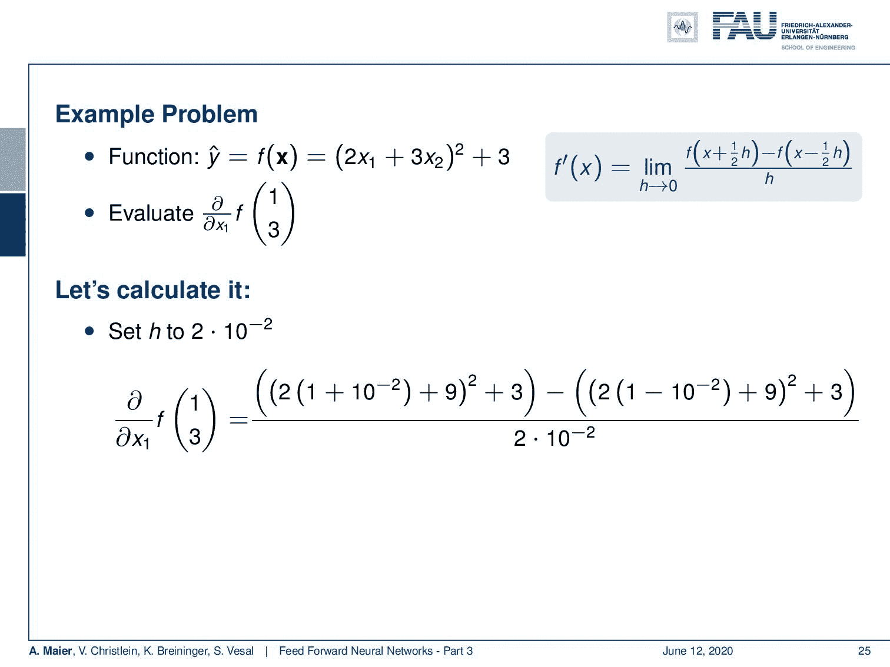

使用 *h* = 0.02，我们可以在数值上逼近导数。 [CC 下的图片来自](https://creativecommons.org/licenses/by/4.0/)[深度学习讲座](https://www.youtube.com/watch?v=p-_Stl0t3kU&list=PLpOGQvPCDQzvgpD3S0vTy7bJe2pf_yJFj&index=1)的 4.0 。

对于我们的示例，我们可以这样做。我们来试着评价一下这个。我们取我们原来的定义(2 *x* ₁+ 3 *x* ₂) + 3。我们想看看位置(1 3)ᵀ.让我们使用上面的+ *h/2* 定义。这里，我们将 h 设置为一个小值，比如 2 ⋅ 10⁻。我们把它插上，你可以在这一排看到。所以这将是((2(1+10⁻ +9) + 3)，当然，我们也要减去第二项的小值。然后，我们也除以较小的值。因此，我们将得到大约 124.4404 减去 123.5604。这大约是 43.9999。因此，我们可以计算任何函数的这个值，即使我们不知道函数的定义，例如，如果一个函数只有一个我们无法访问的软件模块。在这种情况下，我们可以用有限差分来近似偏导数。

使用有限差分的简短总结。 [CC 下的图片来自](https://creativecommons.org/licenses/by/4.0/)[深度学习讲座](https://www.youtube.com/watch?v=p-_Stl0t3kU&list=PLpOGQvPCDQzvgpD3S0vTy7bJe2pf_yJFj&index=1)的 4.0 。

实际上，我们在适合浮点精度的 1⋅ 10⁻⁵范围内使用 *h* 。根据您的计算系统的精度，您还可以确定 *h* 的合适值。你可以在参考文献 7 中找到答案。我们看到这真的很好用。我们可以对任何函数求值，我们不需要知道正式的定义，但是，当然，这在计算上是低效的。假设你想确定一个维数为 100 的函数的所有偏导数的集合的梯度。这意味着你必须对函数求值 101 次来计算整个梯度。因此，对于一般优化来说，这可能不是一个很好的选择，因为它可能会变得低效。但是当然，这是一个非常酷的方法来检查你的实现。想象你实现了分析版本，有时你会犯错误。然后，你可以以此为窍门，检查你的解析导数是否正确实现。这也是您将在这里的练习中详细了解的内容。如果你想调试你的实现，这真的很有用。

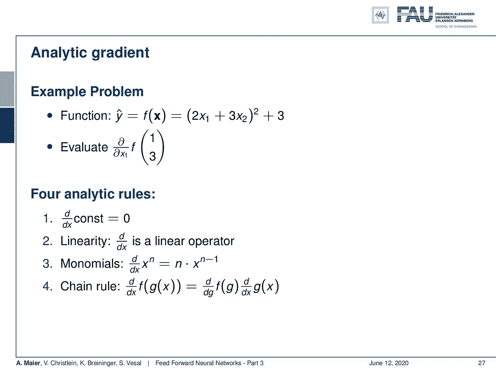

计算解析梯度的四个规则。来自[深度学习讲座](https://www.youtube.com/watch?v=p-_Stl0t3kU&list=PLpOGQvPCDQzvgpD3S0vTy7bJe2pf_yJFj&index=1)的 4.0CC 下的图片。

好，我们来谈谈解析梯度。现在解析梯度，我们可以用一组解析微分规则来推导。所以第一条规则是常数的导数是 0。那么，我们的算符是一个线性算符，这意味着如果我们有不同分量的和，我们可以重新排列它。接下来，我们还知道单项式的导数。如果你有一些ⁿ，导数将是⋅xⁿ⁻。如果您有嵌套函数，则链规则适用。这本质上是我们反向传播算法需要的关键思想。你会看到，某个嵌套函数对 *x* 的导数，将是该函数对 *g* 的导数乘以函数 *g* 对 *x* 的导数。

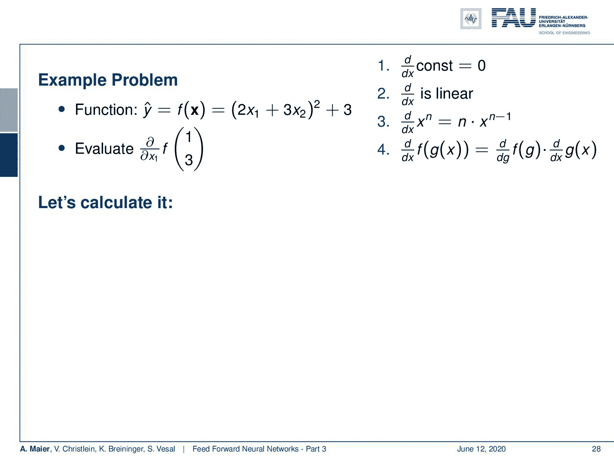

我们应用前面的四个规则来计算函数的解析导数。来自[深度学习讲座](https://www.youtube.com/watch?v=p-_Stl0t3kU&list=PLpOGQvPCDQzvgpD3S0vTy7bJe2pf_yJFj&index=1)的 4.0CC 下的图片。

好的，让我们把它们放在右上方。我们将在接下来的几张幻灯片中用到它们。让我们来计算一下，这里你会看到，f( **x** )对 *x* ₁的偏导数在(1 3)ᵀ.)然后，我们可以插入定义。所以，这将是(2 *x* ₁+9)的偏导数。我们已经可以写出 9，因为我们已经可以插入 3，然后乘以 3 得到 9。在下一步中，我们可以计算外函数的偏导数。现在。这是链式法则的应用，我们引入这个新变量 *z* 。在下一步中，我们可以计算 *z* 的 2 次方的偏导数，其中我们必须将指数减少 1，然后乘以这个指数。所以，这将是 2(2 *x* ₁+9)乘以 2 *x* ₁+9.的偏导数所以，我们可以进一步简化。你可以看到，如果我们对 2 *x* ₁+9 求导， *x* ₁抵消了。减去常数 9，只剩下 2。所以最后，我们得到 2(2 *x* ₁+9)乘以 2。现在如果你代入 x₁= 1，你会看到我们的导数等于 44。在我们之前评估过的数值实现中，您可以看到我们有 43.9999。所以，我们很亲密。当然，解析梯度更精确。

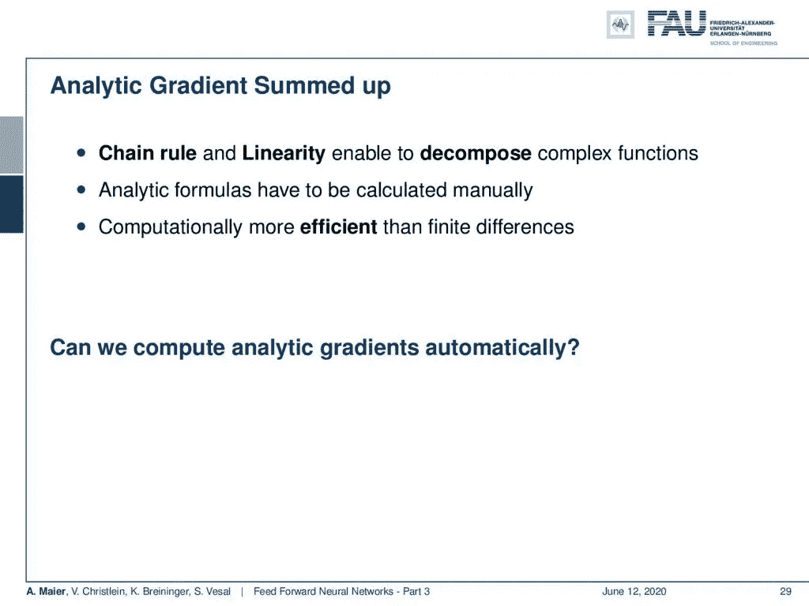

我们对解析梯度的观察总结。 [CC 下的图片来自](https://creativecommons.org/licenses/by/4.0/)[深度学习讲座](https://www.youtube.com/watch?v=p-_Stl0t3kU&list=PLpOGQvPCDQzvgpD3S0vTy7bJe2pf_yJFj&index=1)的 4.0 。

现在的问题是:“我们能自动做到这一点吗？”答案当然是肯定的。我们使用这些规则，链式规则、线性和其他两个规则来分解神经网络的复杂功能。我们不手动这样做，但我们在反向传播算法中完全自动这样做。这将比有限差分计算效率更高。

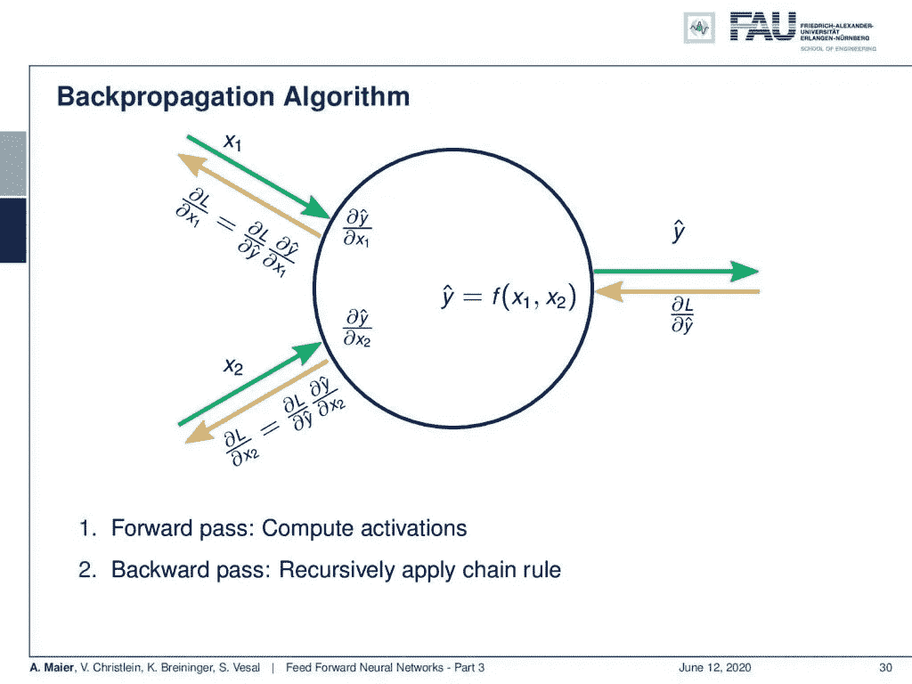

简单来说就是反向传播。来自[深度学习讲座](https://www.youtube.com/watch?v=p-_Stl0t3kU&list=PLpOGQvPCDQzvgpD3S0vTy7bJe2pf_yJFj&index=1)的 [CC BY 4.0](https://creativecommons.org/licenses/by/4.0/) 下的图片。

因此，你可以在这里简单地描述反向传播算法:对于每个神经元，你需要有输入 *x* ₁， *x* ₂，当然还有输出 *y* hat。然后，你可以计算——绿色的——向前传球。你在某个地方计算损失函数，然后你得到关于 y 的导数，它来自于后向通道。然后，对于网络图中的每个元素，你需要知道相对于输入的导数，这里是 x₁和 x₂.当然，我们在图中缺少的是可训练的重量。对于可训练的权重，我们还需要计算关于它们的导数，以便计算参数更新。因此，对于每个模块或节点，你需要知道相对于输入的导数和相对于权重的导数。如果你对每个模块都有，那么你就可以组成一个图，有了这个图，你就可以计算非常复杂函数的任意导数。

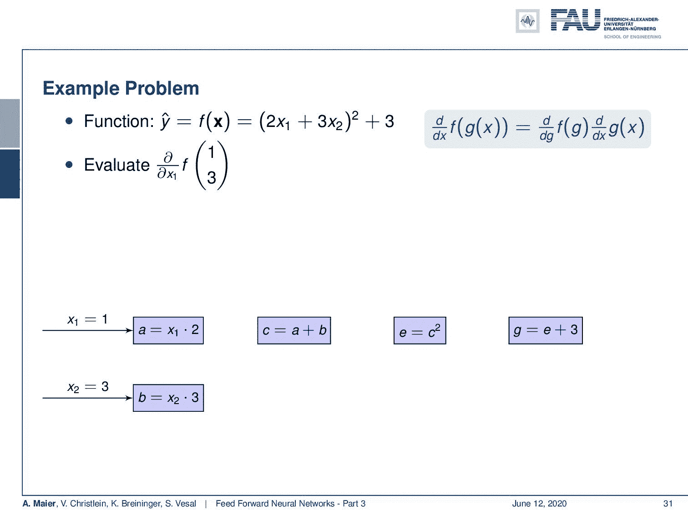

我们例子中的向前传球。来自[深度学习讲座](https://www.youtube.com/watch?v=p-_Stl0t3kU&list=PLpOGQvPCDQzvgpD3S0vTy7bJe2pf_yJFj&index=1)的 4.0CC 下的图片。

让我们回到我们的例子，并应用反向传播。那么，我们该怎么办？我们先计算向前传球。为了能够计算正向传递，我们插入中间定义。所以我们现在把它分解成 2 倍于₁的 a 和 3 倍于₂.的 b 然后，我们可以计算这些:我们得到值 2 和 9 为 *a* 和 *b* 。这使得我们可以计算出两者之和 *c* 。这相当于 11。然后，我们可以计算出 *e* ，它不是别的，而是 c 的 2 次方。这给了我们 121，现在我们最终计算出 *g* ，也就是 *e* 加 3。所以，我们得到了 124。

对于我们的例子，反向传播的反向传递。 [CC 下的图片来自](https://creativecommons.org/licenses/by/4.0/)[深度学习讲座](https://www.youtube.com/watch?v=p-_Stl0t3kU&list=PLpOGQvPCDQzvgpD3S0vTy7bJe2pf_yJFj&index=1)的 4.0 。

好，现在我们需要反向传播。所以我们需要计算偏导数。这里， *g* 相对于 *e* 的偏导数将为 1。然后，我们计算 *e* 对 *c* 的偏导数，你会看到这是 2 *c* 。当 *c* 为 11 时，计算结果为 22。然后，我们需要 *c* 相对于 *a* 的偏导数，也是 1。现在，我们需要 *a* 关于 x₁.的偏导数如果你看这个方块，你可以看到这个偏导数是 2。所以我们必须把所有的偏导数从右到左相乘，才能得到结果:1 乘以 22 乘以 1 乘以 2，这将是 44。这就是应用于我们例子的反向传播算法。

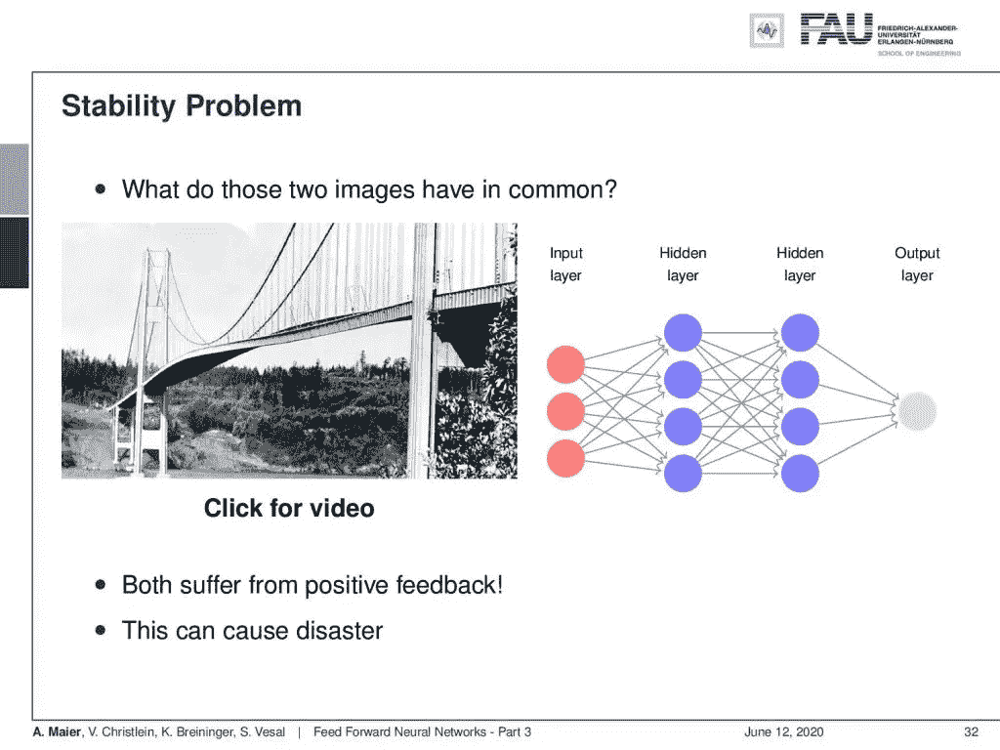

长链的增殖受到正反馈的影响。正反馈反馈[会导致灾难](https://youtu.be/esfpcnQW6qs)。 [CC 下的图片来自](https://creativecommons.org/licenses/by/4.0/)[深度学习讲座](https://www.youtube.com/watch?v=p-_Stl0t3kU&list=PLpOGQvPCDQzvgpD3S0vTy7bJe2pf_yJFj&index=1)的 4.0 。

现在，我们确实有一个稳定性问题。在反向传播算法的范围内，我们相当频繁地与可能的高值和低值相乘。这就给我们带来了正反馈的问题，这会导致灾难。这个小视频[展示了正反馈的一个例子，以及它是如何导致灾难的。](https://youtu.be/esfpcnQW6qs)

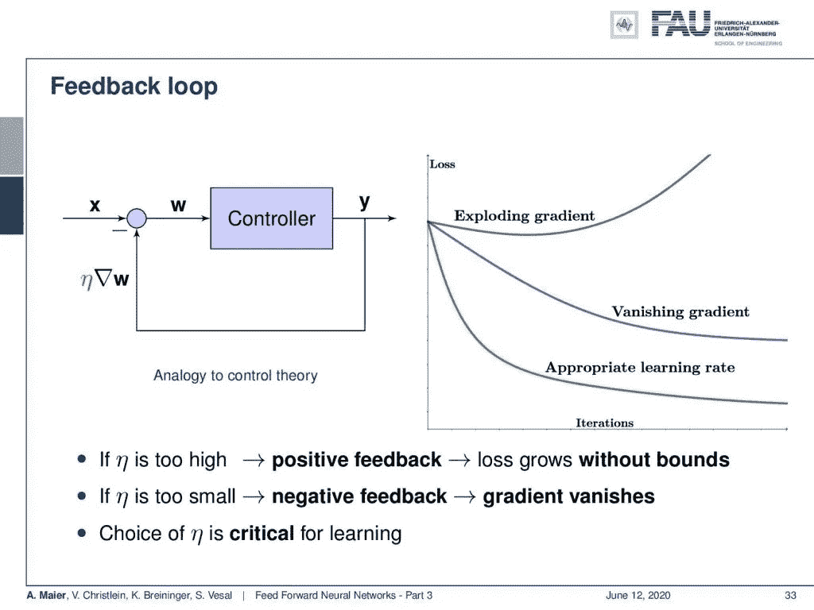

权重的迭代更新构成了反馈回路。来自[深度学习讲座](https://www.youtube.com/watch?v=p-_Stl0t3kU&list=PLpOGQvPCDQzvgpD3S0vTy7bJe2pf_yJFj&index=1)的 [CC BY 4.0](https://creativecommons.org/licenses/by/4.0/) 下的图片。

现在，我们能做些什么呢？这本质上是一个反馈循环。我们有这个控制器和输出，在这里我们计算梯度。你可以看到η的值。所以，如果η太高，就会产生正反馈。这将导致我们的更新价值非常高，然后我们的损失可能会增长或真正爆炸。因此，如果它太大，我们甚至可能会增加损失函数，尽管我们试图将其最小化。还可能发生的是，如果你把η选得太小，那么你会得到蓝色曲线。这就是所谓的消失梯度，我们的步长太小，我们没有很好的收敛。所以没有减少损失。也是一个叫做“消失渐变”的问题。所以，只有选择合适的η，你才会获得很好的学习率。有了一个好的学习率，损耗应该会随着这条绿色曲线的多次迭代而快速下降。然后我们应该进入某种收敛，当我们不再有变化时，我们基本上处于训练数据集的收敛点。然后我们可以停止更新我们的权重。所以，我们看到 EDA 的选择对我们的学习是至关重要的，只有你说得恰当，你才会得到一个良好的培训过程。

反向传播算法综述。来自[深度学习讲座](https://www.youtube.com/watch?v=p-_Stl0t3kU&list=PLpOGQvPCDQzvgpD3S0vTy7bJe2pf_yJFj&index=1)的 4.0CC 下的图片。

所以让我们总结一下反向传播:它是围绕链式法则建立的。它使用向前传球。一旦我们结束并评估损失函数——本质上是与我们学习目标的差异——我们就可以反向传播。使用动态编程方法，这些计算非常有效。反向传播不是一种训练算法。这只是一种计算梯度的方法。当我们在下节课中讨论损失和优化时，你会看到实际的培训计划。一些非常重要的结果是:我们有一个偏导数的乘积，这意味着数值误差增加了。这可能会很成问题。也是因为偏导数的乘积，我们会得到消失或爆炸的光栅。因此，当值非常低，接近于零时，开始将它们相乘，就会出现指数衰减，导致梯度消失。如果你有非常高的数字，当然，你也可以很快达到指数增长——爆炸梯度。

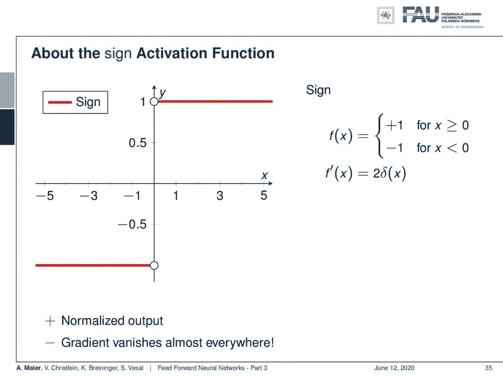

符号激活功能。 [CC 下的图片来自](https://creativecommons.org/licenses/by/4.0/)[深度学习讲座](https://www.youtube.com/watch?v=p-_Stl0t3kU&list=PLpOGQvPCDQzvgpD3S0vTy7bJe2pf_yJFj&index=1)的 4.0 。

我们看到梯度对我们的训练至关重要。所以我们来谈谈激活函数和它们的导数。其中一个经典的例子是符号函数。我们已经在感知器里有了。现在，你可以看到它是对称的，并在 1 和-1 之间归一化。但是请记住，我们正在讨论偏导数，以便计算权重更新。所以，这个函数的导数有点问题，因为除了点 0，它在任何地方都是 0，这里的值基本上是无穷大。所以把这个和梯度下降结合起来用并不是很好。

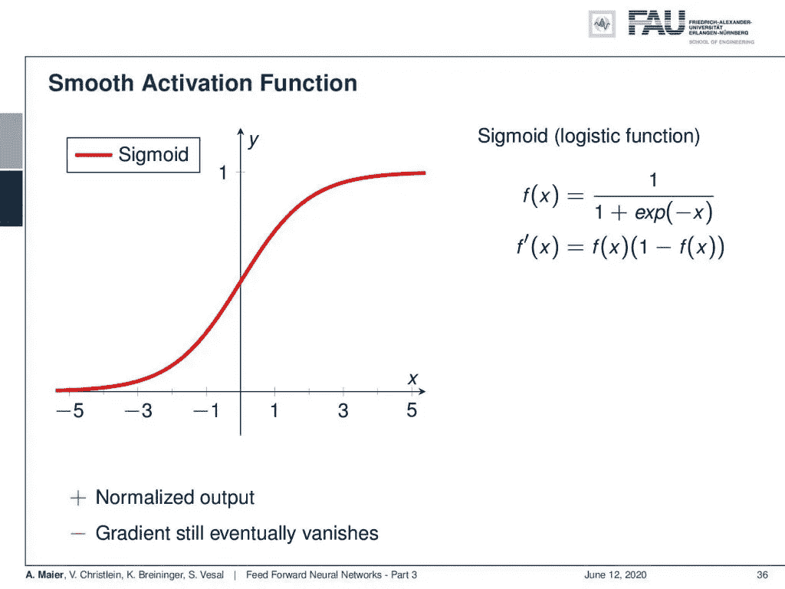

乙状结肠函数。来自[深度学习讲座](https://www.youtube.com/watch?v=p-_Stl0t3kU&list=PLpOGQvPCDQzvgpD3S0vTy7bJe2pf_yJFj&index=1)的 [CC BY 4.0](https://creativecommons.org/licenses/by/4.0/) 下的图片。

那么人们一直在做什么呢？他们转换到不同的函数，其中一个流行的是 sigmoid 函数。因此，这是一个 s 形函数，它在分母中使用负指数函数来缩放 0 到 1 之间的所有内容。好的一面是，如果你计算它的导数，这基本上就是 f(x)乘以 1 — f(x)。所以，至少导数可以很有效地计算出来。在向前传递时，你总是要处理指数函数，这也是一个问题。同样，如果你在-3 到 3 之间看这个函数，你会得到适合反向传播的梯度。一旦你远离-3 或 3，你会发现这个函数的导数将非常接近于零。所以，我们有饱和，如果你期望有一对 sigmoid 函数，那么它很可能会产生非常低的值。这也会导致渐变消失。

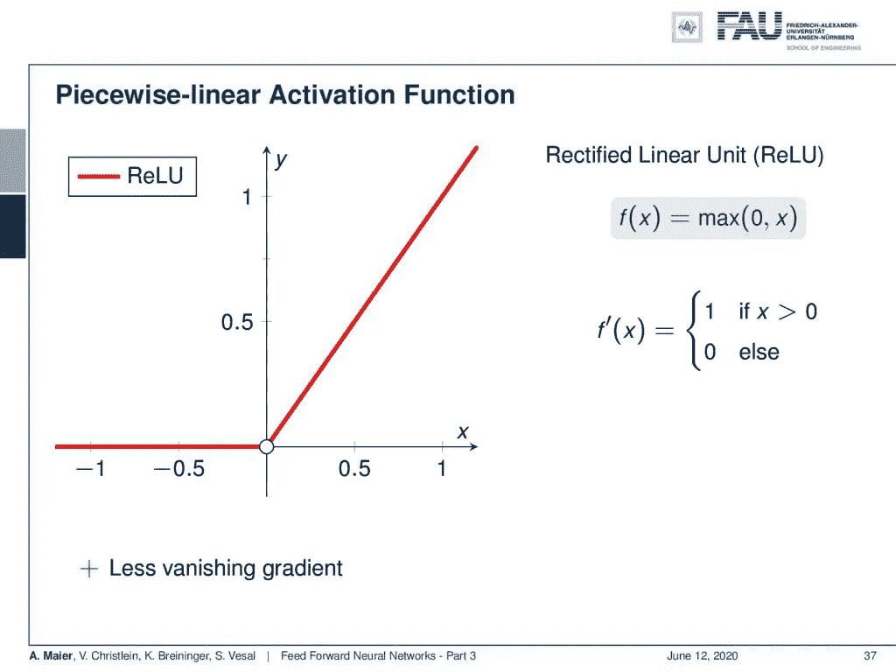

校正的线性单位。 [CC 下的图片来自](https://creativecommons.org/licenses/by/4.0/)[深度学习讲座](https://www.youtube.com/watch?v=p-_Stl0t3kU&list=PLpOGQvPCDQzvgpD3S0vTy7bJe2pf_yJFj&index=1)的 4.0 。

那么人们做了什么来战胜它呢？嗯，他们引入了一个分段线性激活函数，称为“整流线性单元”(ReLU)，它是零和 *x* 的最大值。所以，所有低于零的都被削波为零，其他的都保持不变。这很好，因为我们可以非常有效地计算。这里不涉及指数函数，如果 *x* 大于零，而其他地方都是零，那么导数就是 1。所以，消失的梯度要小得多，因为基本上整个正半空间都可以用于梯度下降。ReLU 也有一些问题，我们将在讨论激活函数时详细讨论。

在这个深度学习讲座中，更多令人兴奋的事情即将到来。 [CC 下的图片来自](https://creativecommons.org/licenses/by/4.0/)[深度学习讲座](https://www.youtube.com/watch?v=p-_Stl0t3kU&list=PLpOGQvPCDQzvgpD3S0vTy7bJe2pf_yJFj&index=1)的 4.0 。

好了，现在你理解了反向传播算法的许多基本概念。但是我们仍然必须讨论更复杂的情况，特别是在特定的层。所以现在，我们在神经节点水平上做了所有的事情。如果你想在神经元水平上做所有的反向传播，这是非常困难的，你会很快失去监督。因此，我们将在下节课中介绍层抽象，看看如何计算整个层的梯度。所以敬请关注，继续收看！我希望你喜欢这个视频，并看到你在下一个。谢谢大家！

如果你喜欢这篇文章，你可以在这里找到更多的文章，或者看看我们的讲座。如果你想在未来了解更多的文章、视频和研究，我也会很感激你在 YouTube、Twitter、脸书、LinkedIn 上的鼓掌或关注。本文以 [Creative Commons 4.0 归属许可](https://creativecommons.org/licenses/by/4.0/deed.de)发布，如果引用，可以转载和修改。

# 参考

[1] R. O .杜达，P. E .哈特和 D. G .斯托克。模式分类。约翰威利父子公司，2000 年。
[2]克里斯托弗·m·毕晓普。模式识别和机器学习(信息科学和统计学)。美国新泽西州 Secaucus 出版社:纽约斯普林格出版社，2006 年。
[3]f·罗森布拉特。"感知器:大脑中信息存储和组织的概率模型."摘自:《心理评论》65.6 (1958)，第 386-408 页。
[4] WS。麦卡洛克和 w .皮茨。"对神经活动中固有思想的逻辑演算."发表于:数学生物物理学通报 5 (1943)，第 99-115 页。
[5]d . e .鲁梅尔哈特、G. E .辛顿和 R. J .威廉斯。"通过反向传播误差学习表征."载于:自然 323 (1986)，第 533-536 页。
[6] Xavier Glorot，Antoine Bordes，Yoshua Bengio。“深度稀疏整流器神经网络”。《第十四届国际人工智能会议论文集》第 15 卷。2011 年，第 315-323 页。
[7]威廉·h·普雷斯、索尔·a·特乌考斯基、威廉·t·维特林等《数值计算方法》第三版:科学计算的艺术。第三版。美国纽约州纽约市:剑桥大学出版社，2007 年。