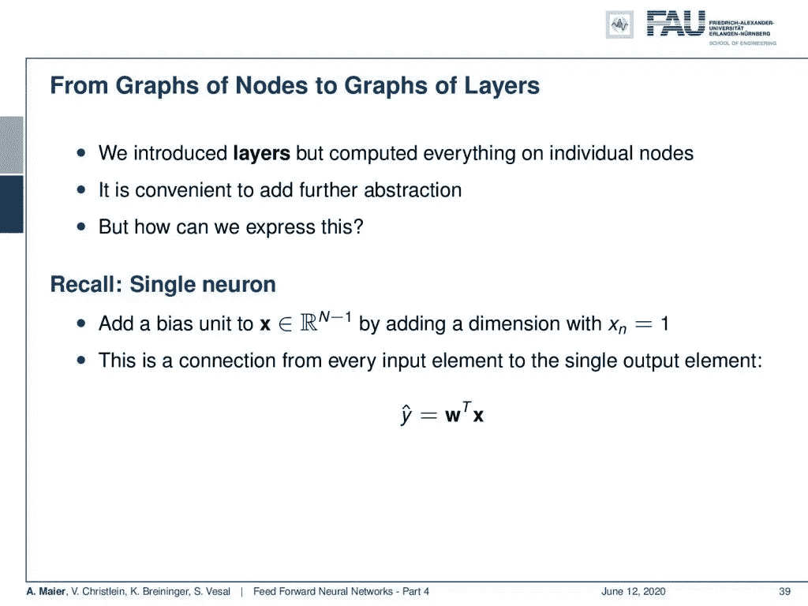
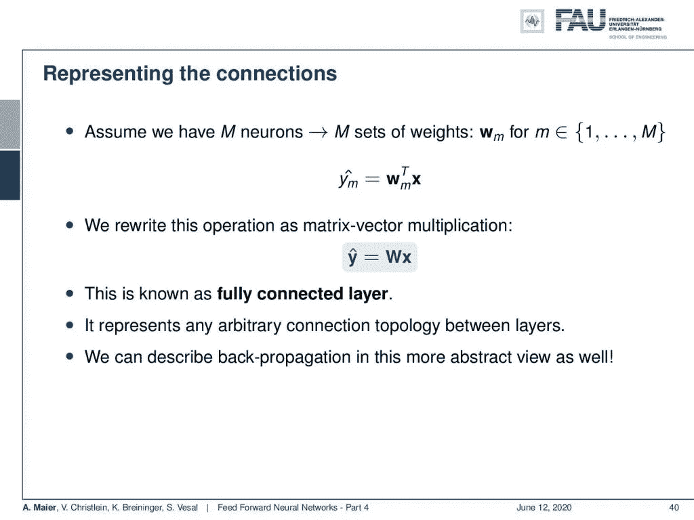
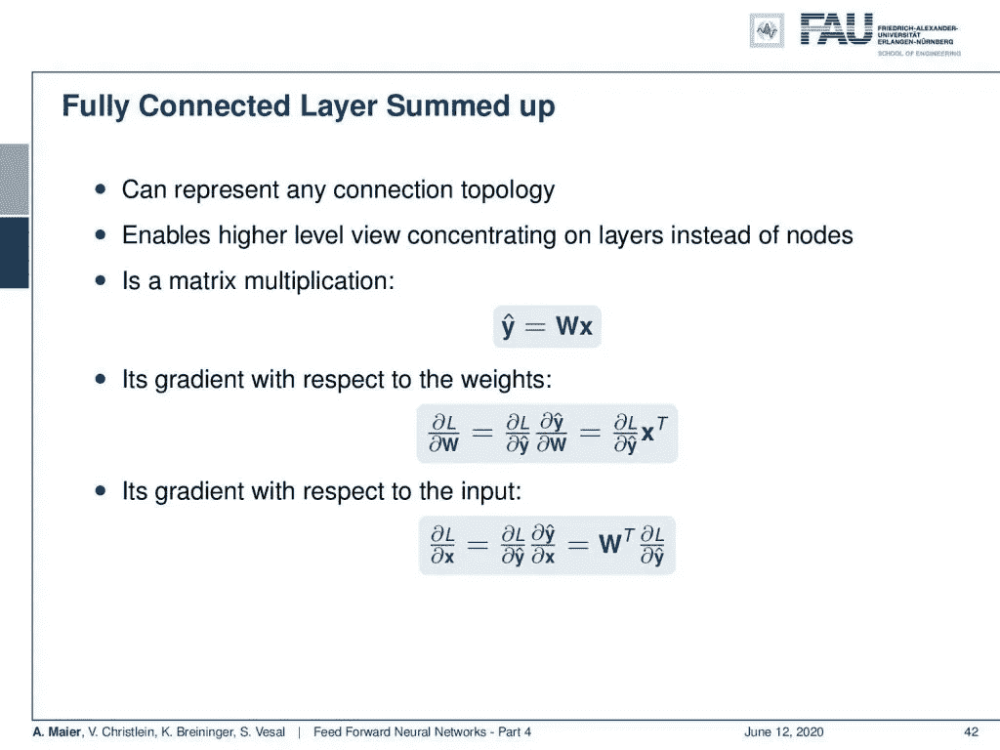
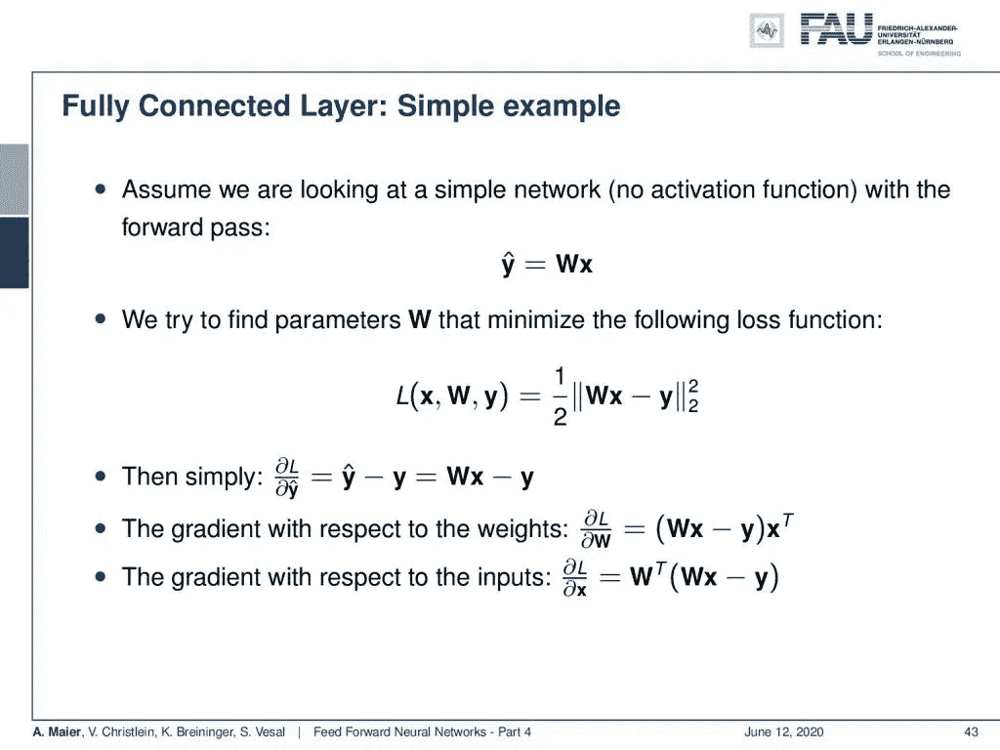
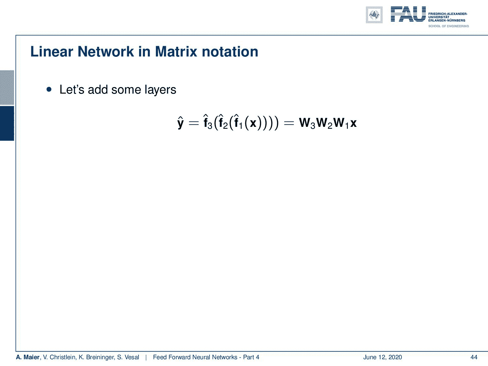
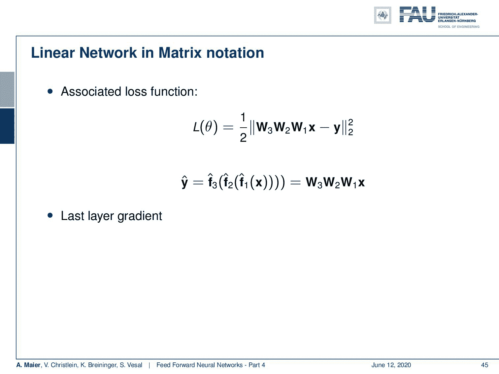
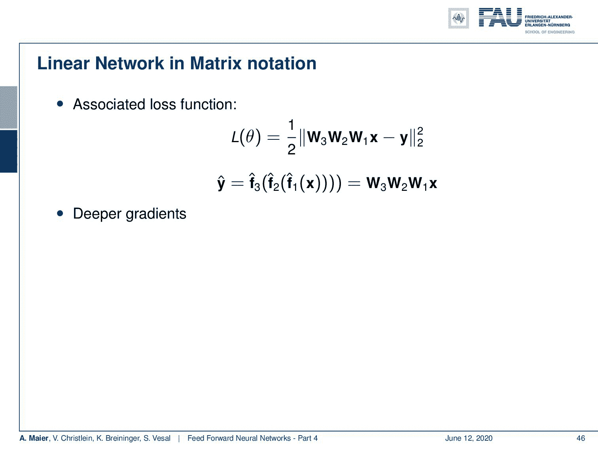
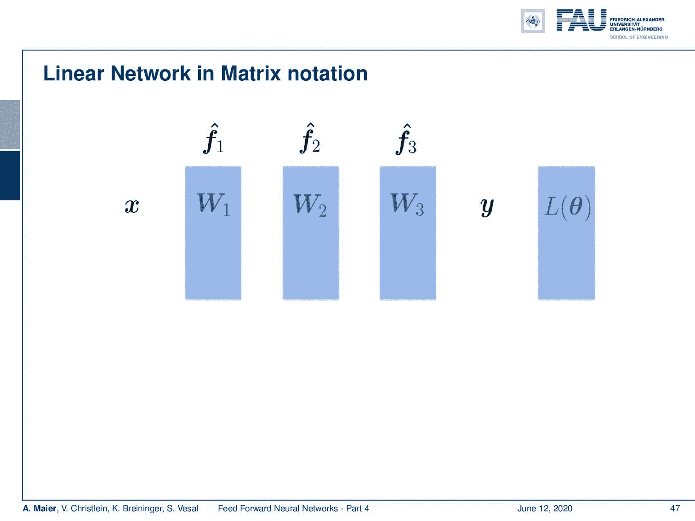
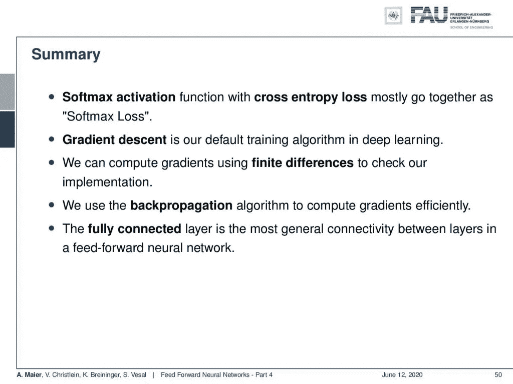
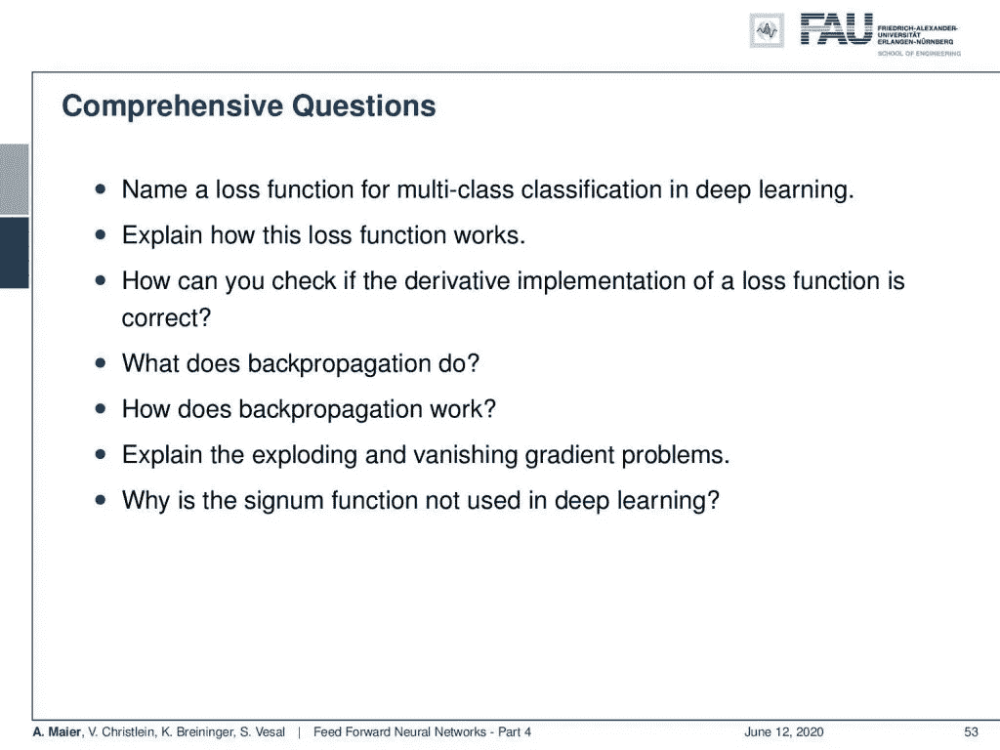

# 前馈网络—第 4 部分

> 原文：<https://towardsdatascience.com/lecture-notes-in-deep-learning-feedforward-networks-part-4-65593eb14aed?source=collection_archive---------75----------------------->

## [FAU 讲座笔记](https://towardsdatascience.com/tagged/fau-lecture-notes)深度学习

## 层抽象

FAU 大学的深度学习。下图 [CC BY 4.0](https://creativecommons.org/licenses/by/4.0/) 来自[深度学习讲座](https://www.youtube.com/watch?v=p-_Stl0t3kU&list=PLpOGQvPCDQzvgpD3S0vTy7bJe2pf_yJFj&index=1)

**这些是 FAU 的 YouTube 讲座** [**深度学习**](https://www.youtube.com/watch?v=p-_Stl0t3kU&list=PLpOGQvPCDQzvgpD3S0vTy7bJe2pf_yJFj&index=1) **的讲义。这是与幻灯片匹配的讲座视频&的完整抄本。我们希望，你喜欢这个视频一样多。当然，这份抄本是用深度学习技术在很大程度上自动创建的，只进行了少量的手动修改。如果你发现了错误，请告诉我们！**

# 航行

[**上一讲**](/lecture-notes-in-deep-learning-feedforward-networks-part-3-d2a0441b8bca) **/** [**观看本视频**](https://youtu.be/BTbHaKsH4y0) **/** [**顶级**](/all-you-want-to-know-about-deep-learning-8d68dcffc258) **/** [**下一讲**](/lecture-notes-in-deep-learning-loss-and-optimization-part-1-f702695cbd99)

欢迎大家观看我们下一个关于深度学习的视频！所以，今天我们要再次讨论前馈网络。在第四部分中，主要的焦点将放在层抽象上。当然，我们讨论了这些神经元和单个节点，但对于更大的网络来说，这变得非常复杂。所以我们想在梯度的计算中引入这个分层的概念。这真的很有用，因为我们可以直接谈论整个层的梯度，而不需要去所有不同的节点。

每个神经元在应用非线性之前计算两个向量的内积。 [CC 下的图片来自](https://creativecommons.org/licenses/by/4.0/)[深度学习讲座](https://www.youtube.com/watch?v=p-_Stl0t3kU&list=PLpOGQvPCDQzvgpD3S0vTy7bJe2pf_yJFj&index=1)的 4.0 。

那么，我们该如何表达呢？让我们回忆一下我们的单个神经元在做什么。单个神经元本质上是在计算其权重的内积。顺便说一下，我们跳过了这个偏差符号。所以，我们将这个向量扩展了一个额外的元素。这使我们能够描述偏差和内积，如幻灯片所示。这真的很好，因为这样你就可以看到输出 *y* hat 只是一个内积。

完全连接的层可以用矩阵乘法来表示。来自[深度学习讲座](https://www.youtube.com/watch?v=p-_Stl0t3kU&list=PLpOGQvPCDQzvgpD3S0vTy7bJe2pf_yJFj&index=1)的 [CC BY 4.0](https://creativecommons.org/licenses/by/4.0/) 下的图片。

现在考虑我们有 *M* 个神经元的情况，这意味着我们得到一些 *y* 帽子指数 *m* 。都是内积。所以，如果你把这个带入向量符号，你可以看到向量 **y** hat 就是矩阵 **x** 与矩阵 **W** 的乘法运算。你看一个全连通的层不是别的，就是矩阵乘法。因此，我们基本上可以使用这个全连接层来表示任意连接和拓扑。然后，我们还应用逐点非线性，以便我们得到非线性效果。矩阵符号的好处是，我们现在可以用矩阵运算来描述整个层的导数。

具有三个输入的双神经元全连接层。 [CC 下的图片来自](https://creativecommons.org/licenses/by/4.0/)[深度学习讲座](https://www.youtube.com/watch?v=p-_Stl0t3kU&list=PLpOGQvPCDQzvgpD3S0vTy7bJe2pf_yJFj&index=1)的 4.0 。

因此，我们的全连接层将得到以下配置:三个输入元素和每个神经元的权重。假设你有两个神经元，然后我们得到这些权重向量。我们将两者乘以 **x** 。在正向传递中，我们已经使用矩阵为整个模块确定了这个 **y** hat。如果你想计算梯度，那么我们需要两个偏导数。这些和我们已经提到的一样，我们需要关于重量的导数。这将是相对于 **W** 的偏导数和相对于 **x** 的偏导数，用于反向传播，以将其传递到下一个模块。

简而言之，全连通层的偏导数。 [CC 下的图片来自](https://creativecommons.org/licenses/by/4.0/)[深度学习讲座](https://www.youtube.com/watch?v=p-_Stl0t3kU&list=PLpOGQvPCDQzvgpD3S0vTy7bJe2pf_yJFj&index=1)的 4.0 。

那么我们如何计算呢？嗯，我们有一层是 **y** 帽子等于**W**x。所以在正向传递中有一个矩阵乘法。然后，我们需要对重量求导。现在你可以看到，我们需要做的是，我们需要一个矩阵导数。y 相对于 w 的导数就是ᵀ.因此，如果我们有损失进入我们的模块，我们的权重更新将是这个损失向量乘以 **x** ᵀ.所以，我们有一些损失向量和ᵀ，这意味着你有一个外积。由于转置，一个是列向量，另一个是行向量。所以，如果你把两者相乘，你会得到一个矩阵。上述相对于 **W** 的偏导数将总是产生一个矩阵。然后你看最下面一行，你需要 **y** hat 相对于 **x** 的偏导数。顺便说一句，你也可以在[矩阵食谱](https://www.math.uwaterloo.ca/~hwolkowi/matrixcookbook.pdf)中找到。它非常非常有用。你可以在这本书里找到各种矩阵导数。所以如果你这样做，你可以看到上面的方程，相对于 **x** 的偏角是 **W** ᵀ.现在，你有了ᵀ，再乘以一些损失向量。这个损失向量乘以一个矩阵，会变成一个向量。这是您将在反向传播过程中传递给下一个更高层的向量。

单层线性网络仅仅是矩阵乘法。 [CC 下的图片来自](https://creativecommons.org/licenses/by/4.0/)[深度学习讲座](https://www.youtube.com/watch?v=p-_Stl0t3kU&list=PLpOGQvPCDQzvgpD3S0vTy7bJe2pf_yJFj&index=1)的 4.0 。

好，让我们来看一些例子。我们先有一个简单的例子，然后是一个多层的例子。因此，这个简单的例子将是我们已经拥有的同一个网络。这是一个没有任何非线性的网络 **W** **x** 。现在，我们需要一些损失函数。这里，我们不取交叉熵，而是取 L2 损失，这是一个常见的向量范数。它只需将网络输出减去所需输出，然后计算 L2 范数。这意味着我们对不同的向量值进行元素平方，并将它们相加。最后，我们将不得不取一个平方根，但是我们想省略它。所以，我们用它的 2 次方。当我们现在计算这个 L2 范数的 2 次幂的导数时，当然，我们有一个 2 的因子出现。这将在开始时被这个因子 1/2 抵消。对了，这是回归损失，也有统计关系。我们将在更详细地讨论损失函数时讨论这一点。L2 损失的好处是，你还可以找到它的矩阵衍生物矩阵食谱。我们现在计算 L 相对于 **y** hat 的偏导数。这将为我们提供 **Wx** — **y** ，我们可以继续计算权重的更新。所以权重的更新是我们用损失函数的导数计算出来的。损失函数相对于输入的导数是 **Wx** — **y** 乘以 **xᵀ** 。这将为我们提供矩阵权重的更新。我们要计算的另一个导数是损失相对于 **x** 的偏导数。因此，正如我们在上一张幻灯片中看到的那样，这将是 **W** ᵀ乘以来自损失函数的向量: **Wx** — **y，**，正如我们在幻灯片的第三行中所确定的。

线性三层网络作为逐层导数计算的例子。 [CC 下的图片来自](https://creativecommons.org/licenses/by/4.0/)[深度学习讲座](https://www.youtube.com/watch?v=p-_Stl0t3kU&list=PLpOGQvPCDQzvgpD3S0vTy7bJe2pf_yJFj&index=1)的 4.0 。

好吧，让我们添加一些层，并改变我们的估计到三个嵌套函数。这里，我们有一些线性矩阵。所以，这是一个学术上的例子:你可以看到，通过将₁的 **W** 、₂的 **W** 和₃的 **W** 相乘，它们会简单地折叠成一个矩阵。尽管如此，我还是觉得这个例子很有用，因为它向您展示了在反向传播过程的计算中实际发生了什么，以及为什么这些特定的步骤真的很有用。所以，我们再次采用 L2 损失函数。这里，我们有三个矩阵。

最后一层的导数只需要链式法则的一次应用。来自[深度学习讲座](https://www.youtube.com/watch?v=p-_Stl0t3kU&list=PLpOGQvPCDQzvgpD3S0vTy7bJe2pf_yJFj&index=1)的 4.0CC 下的图片。

接下来，我们要继续计算导数。现在对于衍生产品，我们从第三层开始，最外层。你可以看到，我们现在计算损失函数相对于₃.的偏导数第一，链式法则。然后，我们必须计算损失函数相对于 f₃( **x** 哈特相对于₃.**w**的偏导数损失函数的偏导数也是 L2 范数的内部部分。那么这个**w₃**t18】w₂**w**₁**x**——**y**也是如此。网络的偏导数将会是(**w**₂**w**₁**x**)**ᵀ**，正如我们在上一张幻灯片中看到的。注意，我用一个点来表示矩阵操作符的亲和力。对于矩阵来说，是从左乘还是从右乘是有区别的。两个乘法方向都不一样。因此，我表示你必须从右边计算这个乘积。现在，让我们这样做，我们结束了对 W₃的最后更新，这是简单地从这两个表达式计算出来的。

更深层次的衍生工具需要多重应用链式法则。 [CC 下的图片来自](https://creativecommons.org/licenses/by/4.0/)[深度学习讲座](https://www.youtube.com/watch?v=p-_Stl0t3kU&list=PLpOGQvPCDQzvgpD3S0vTy7bJe2pf_yJFj&index=1)的 4.0 。

现在，对₂的偏导数有点复杂，因为我们要应用链式法则两次。所以，我们必须再次计算损失函数对 f₃(**x**hat 的偏导数。然后，我们需要 f₃(**x**hat 对 **W** ₂的偏导数，这意味着我们必须再次应用链式法则。所以我们必须展开 f₃(**x**hat 相对于 f₂(**x**hat 的偏导数，然后展开 f₂(**x**hat 相对于₂.**w**的偏导数这个变化不大。损失项与我们以前使用的相同。现在，如果我们计算 f₃(**x**hat 相对于 f₂(**x**hat 的偏导数——还记得 f₂(**x**)=**w**₂**w**₁**x**吗——它将是 **W** ₃ **ᵀ** ,我们必须从左侧将其相乘。然后，我们继续计算 f₂(**x**hat 相对于**w**₂.的偏导数你继续留在(**w**₁**x**)**ᵀ**。所以，最终的矩阵导数是这三项的乘积。我们可以对最后一层重复这个步骤，但是现在我们必须再次应用链式法则。我们已经看到预先计算的两个部分，但我们必须再次应用它。这里我们得到了 f₂(**x**hat 相对于 f₁(**x**hat 的偏导数，以及 f₁(**x**hat 相对于₁**w**的偏导数，这就产生了我们之前用过的两个项。f₂( **x** 帽子相对于 f₁( **x** 帽子的偏导数，即 **W** ₁ **x** ，将会是 **W** ₂ **ᵀ** 。然后，我们还要计算 f₁( **x** 相对于 **W** ₁.的偏导数这将是 xᵀ的比赛。所以，我们最终得到这个偏导数的四项乘积。

偏导数越深，需要相乘的项就越多。 [CC 下的图片来自](https://creativecommons.org/licenses/by/4.0/)[深度学习讲座](https://www.youtube.com/watch?v=p-_Stl0t3kU&list=PLpOGQvPCDQzvgpD3S0vTy7bJe2pf_yJFj&index=1)的 4.0 。

现在，你可以看到，如果我们做反向传播算法，我们会以非常相似的方式处理。首先，我们计算整个网络的转发路径，并评估损失函数。然后，我们可以看看不同的偏导数，根据我想去的地方，我必须计算各自的偏导数。对于最后一层的更新，我必须计算损失函数的偏导数，并将其乘以最后一层相对于权重的偏导数。现在，如果我进入倒数第二层，我必须计算损失函数的偏导数、最后一层相对于输入的偏导数以及倒数第二层相对于权重的偏导数，以获得更新。如果我想去第一层，我必须计算整个层的所有相应的反向传播步骤，直到我在第一层上完成相应的更新。您可以看到，我们可以预先计算许多这些值，并重复使用它们，这使我们能够非常有效地实现反向传播。

偏导数的分层计算总结。来自[深度学习讲座](https://www.youtube.com/watch?v=p-_Stl0t3kU&list=PLpOGQvPCDQzvgpD3S0vTy7bJe2pf_yJFj&index=1)的 [CC BY 4.0](https://creativecommons.org/licenses/by/4.0/) 下的图片。

让我们总结一下到目前为止我们所看到的。我们已经看到，我们可以将 softmax 激活函数与交叉熵损失结合起来。然后，我们可以很自然地处理多类问题。我们使用梯度下降作为训练网络的默认选择，并且我们可以使用该策略实现局部最小值。当然，我们只能通过有限差分来计算梯度，这对于检查你的实现非常有用。这是你在练习中绝对需要的东西！然后，我们使用反向传播算法非常有效地计算梯度。为了能够更新完全连接的层的权重，我们已经看到它们可以被抽象为一个完整的层。因此，我们也可以计算逐层导数。因此，不需要在节点级别计算所有内容，但您可以真正进入层抽象。你也看到了矩阵演算非常有用。

在这个深度学习讲座中，更多令人兴奋的事情即将到来。 [CC 下的图片来自](https://creativecommons.org/licenses/by/4.0/)[深度学习讲座](https://www.youtube.com/watch?v=p-_Stl0t3kU&list=PLpOGQvPCDQzvgpD3S0vTy7bJe2pf_yJFj&index=1)的 4.0 。

深度学习下一次会怎样？我们会看到，现在，我们只有有限的损失函数。因此，我们将看到问题适应回归和分类的损失函数。我们现在讨论的非常简单的优化，只有一个η，可能不是正确的方法。所以，有更好的优化程序。它们可以适应每一个参数的需要。然后，我们还将看到一个论点，为什么神经网络不应该表现得那么好，以及一些最近的见解，为什么它们实际上表现得相当好。

一些备考的综合题。来自[深度学习讲座](https://www.youtube.com/watch?v=p-_Stl0t3kU&list=PLpOGQvPCDQzvgpD3S0vTy7bJe2pf_yJFj&index=1)的 [CC BY 4.0](https://creativecommons.org/licenses/by/4.0/) 下的图片。

我也有几个综合问题。所以你绝对应该能够为多类分类命名不同的损失函数。如果你想和我一起参加口试，一键编码是每个人都需要知道的。你必须能够描述这一点。然后，当然，我可能不会在考试中问，但对你的日常工作非常有用的事情是，你使用有限差分，并使用它们进行实现检查。你必须能够描述反向传播算法，老实说，我认为这是一种学术方法，但这种描述反向传播算法的多层抽象方法非常有用。如果你想解释考试情况下的反向传播，这也很好。你还能描述出什么？爆炸和消失梯度的问题是:如果你选择的η太高或太低会发生什么？什么是丢失的曲线，它在迭代中是如何变化的？看看这些图表。它们真的很重要，它们还能帮助你了解你的训练过程中出了什么问题。所以你需要意识到这些，现在你也应该清楚为什么符号函数不是激活函数的好选择。这篇文章下面有很多参考资料。所以，我希望你仍然喜欢这些视频。请继续观看，下期视频再见！

如果你喜欢这篇文章，你可以在这里找到更多的文章，或者看看我们的讲座。如果你想在未来了解更多的文章、视频和研究，我也会很感激你在 YouTube、Twitter、脸书、LinkedIn 上的鼓掌或关注。本文以 [Creative Commons 4.0 归属许可](https://creativecommons.org/licenses/by/4.0/deed.de)发布，如果引用，可以转载和修改。

# 参考

[1] R. O .杜达，P. E .哈特和 D. G .斯托克。模式分类。约翰威利父子公司，2000 年。
[2]克里斯托弗·m·毕晓普。模式识别和机器学习(信息科学和统计学)。美国新泽西州 Secaucus 出版社:纽约斯普林格出版社，2006 年。
[3]f·罗森布拉特。"感知器:大脑中信息存储和组织的概率模型."摘自:《心理评论》65.6 (1958)，第 386-408 页。
【4】WS。麦卡洛克和 w .皮茨。"对神经活动中固有思想的逻辑演算."发表于:数学生物物理学通报 5 (1943)，第 99-115 页。[5] D. E .鲁梅尔哈特、G. E .辛顿和 R. J .威廉斯。"通过反向传播误差学习表征."载于:自然 323 (1986)，第 533-536 页。
[6]泽维尔·格洛特，安托万·博德斯，约舒阿·本吉奥。“深度稀疏整流器神经网络”。《第十四届国际人工智能会议论文集》第 15 卷。2011 年，第 315-323 页。
[7]威廉·h·普雷斯、索尔·a·特乌考斯基、威廉·t·维特林等《数值计算方法》第三版:科学计算的艺术。第三版。美国纽约州纽约市:剑桥大学出版社，2007 年。