# 简介—第 1 部分

> 原文：<https://towardsdatascience.com/lecture-notes-in-deep-learning-introduction-part-1-5a1729abd580?source=collection_archive---------37----------------------->

## [FAU 讲座笔记](https://towardsdatascience.com/tagged/fau-lecture-notes)深度学习

## 激励和高调应用

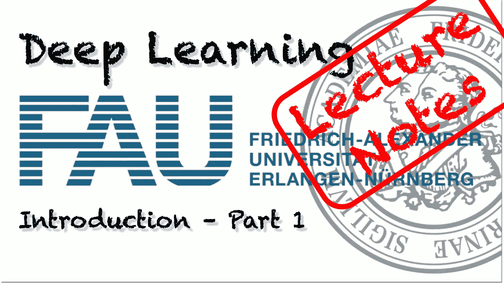

FAU 大学的深度学习。来自[深度学习讲座](https://www.youtube.com/watch?v=p-_Stl0t3kU&list=PLpOGQvPCDQzvgpD3S0vTy7bJe2pf_yJFj&index=1)的 [CC BY 4.0](https://creativecommons.org/licenses/by/4.0/) 下的图片。

**这些是 FAU 的 YouTube 讲座** [**深度学习**](https://www.youtube.com/watch?v=p-_Stl0t3kU&list=PLpOGQvPCDQzvgpD3S0vTy7bJe2pf_yJFj&index=1) **的讲义。这是讲座视频&配套幻灯片的完整抄本。我们希望，你喜欢这个视频一样多。当然，这份抄本是用深度学习技术在很大程度上自动创建的，只进行了少量的手动修改。如果你发现了错误，请告诉我们！**

# 航行

[**上一讲**](/lecture-notes-in-deep-learning-introduction-part-1-5a1729abd580) **/** [**观看本视频**](https://www.youtube.com/watch?v=SCFToE1vM2U) **/** [**顶级**](/all-you-want-to-know-about-deep-learning-8d68dcffc258) **/** [**下一讲**](/lecture-notes-in-deep-learning-introduction-part-2-acabbb3ad22)

欢迎大家参加这学期的深度学习讲座！如你所见，我不在演讲厅。像你们中的许多人一样，我在我的家庭办公室，为了阻止当前的疫情，我们必须在家工作。

因此，我决定把这些讲座录下来，然后放到网上，这样每个人都可以自由使用。您将看到我们对此格式做了一些更改。首先，我们缩短了讲座的时间。我们不再连续走 90 分钟。相反，我们决定将长度缩减成更小的部分，这样你可以在 15 到 30 分钟内一次看完，然后停下来继续下一节课。这意味着我们必须引入一些变化。当然，像每个学期一样，我们也更新了所有的内容，这样我们就真正呈现了当前研究的最新水平。

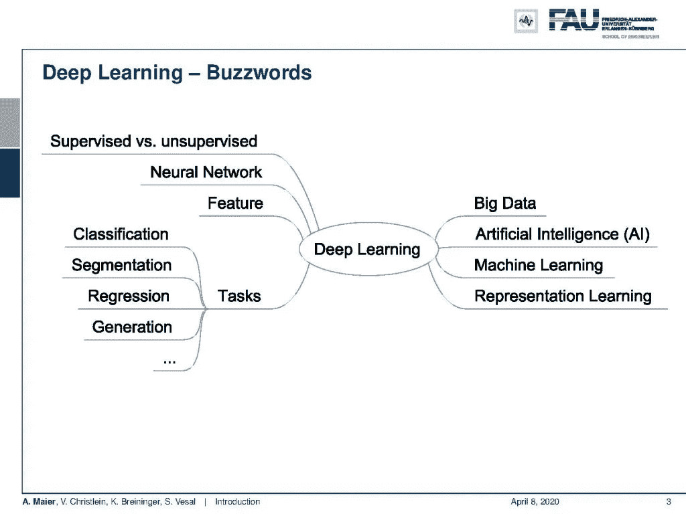

深度学习流行语。 [CC 下的图片来自](https://creativecommons.org/licenses/by/4.0/)[深度学习讲座](https://www.youtube.com/watch?v=p-_Stl0t3kU&list=PLpOGQvPCDQzvgpD3S0vTy7bJe2pf_yJFj&index=1)的 4.0 。

这第一堂课将是关于深度学习的介绍，我们将在这堂课中讨论各种各样的主题——首先也是最重要的，当然是深度学习。我们在这里总结了一些你可能已经听过的流行语。我们涵盖了从监督学习到非监督学习的主题。当然，我们谈到了神经网络、特征表示、特征学习、大数据、人工智能、机器表示学习，但也包括分类、分割、回归和生成等不同的任务。

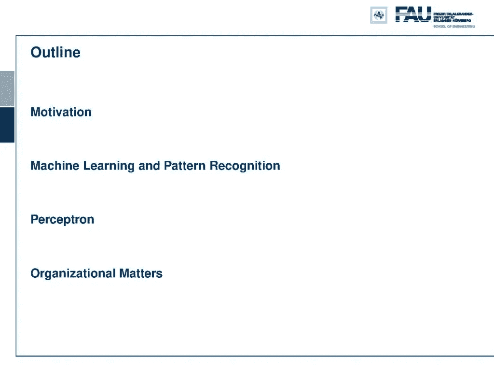

导言的大纲。来自[深度学习讲座](https://www.youtube.com/watch?v=p-_Stl0t3kU&list=PLpOGQvPCDQzvgpD3S0vTy7bJe2pf_yJFj&index=1)的 [CC BY 4.0](https://creativecommons.org/licenses/by/4.0/) 下的图片。

让我们简短地看一下大纲。所以首先，我们从一个动机开始，为什么我们对深度学习感兴趣。我们看到，在过去的几年里，我们已经取得了巨大的进步，因此，研究一些应用和已经取得的一些突破将是非常有趣的。然后在接下来的视频中，我们想谈谈机器学习和模式识别，以及它们与深度学习的关系。当然，在第一节课中，我们也想从最基础的开始。我们会谈到感知器，我们还会谈到一些组织问题，你们会在第五段视频中看到。

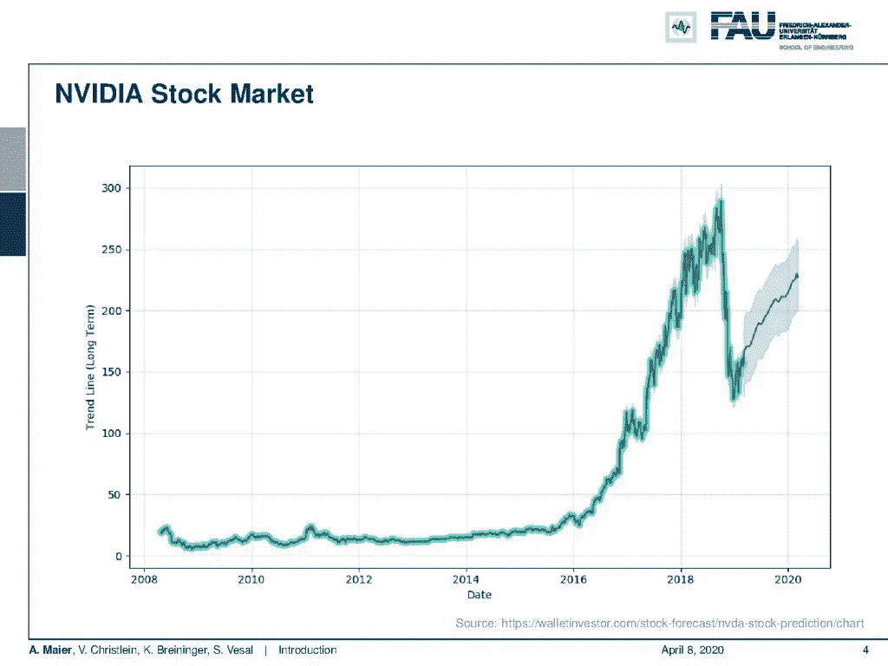

英伟达股票市值。 [CC 下的图片来自](https://creativecommons.org/licenses/by/4.0/)[深度学习讲座](https://www.youtube.com/watch?v=p-_Stl0t3kU&list=PLpOGQvPCDQzvgpD3S0vTy7bJe2pf_yJFj&index=1)的 4.0 。

所以让我们来看看动机，以及现在正在发生的有趣的事情。首先也是最重要的，我想给你看这个关于英伟达股票市值的小图表。您可以在这里看到，在过去几年中，特别是自 2016 年以来，市值一直在增长。这种增长惊人的一个原因是，深度学习发现始于 2012 年，大约在 2016 年真正起飞。所以，你可以看到很多人需要额外的计算硬件。Nvidia 正在制造通用图形处理器，允许在其主板上进行任意计算。与每两年将计算能力增加一倍的传统硬件相比，图形卡在大约 14 到 16 个月内将计算能力增加一倍，这意味着它们拥有相当惊人的计算能力。这使我们能够训练真正深度的网络和最先进的机器学习方法。

你可以看到在 2019 年/2018 年底左右有一个相当大的下降。在这里，你可以看到，推动英伟达市场份额价值的不仅仅是深度学习。同时还有另一件非常有趣的事情正在发生，那就是比特币挖掘。在这段时间，比特币的价值确实下降了，Nvidia 股票的市值也下降了。所以这也部分与比特币有关，但你可以看到价值再次上升，因为深度学习对计算能力有巨大的需求。

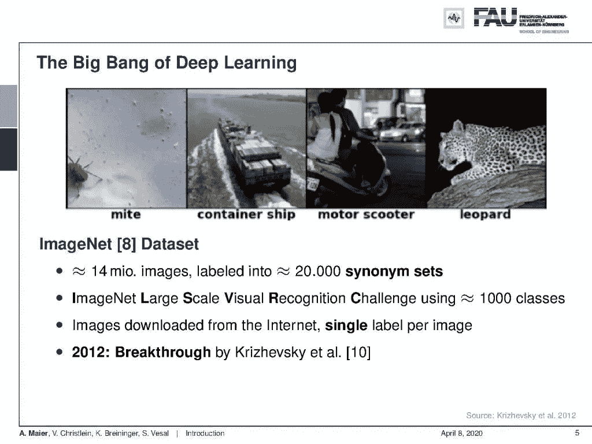

图像网络挑战。 [CC 下的图片来自](https://creativecommons.org/licenses/by/4.0/)[深度学习讲座](https://www.youtube.com/watch?v=p-_Stl0t3kU&list=PLpOGQvPCDQzvgpD3S0vTy7bJe2pf_yJFj&index=1)的 4.0 。

现在，我们可以瞄准哪些有趣的应用呢？因此，深度学习的大爆炸伴随着所谓的图像网络挑战而来。这是一个非常庞大的数据集，这个庞大的数据集有大约 1400 万张图片，被标记为大约 20，000 个同义词集。所以。这个图像网大规模视觉识别的挑战正在使用大约一千个类。在 image net 挑战之前，分类成一千个类别基本上被认为是完全不可能的。这里使用的图片都是从网上下载的，每张图片都有一个标签。所以，这是一个非常大的数据库，它允许我们将大量的类别分配到单独的图像中。

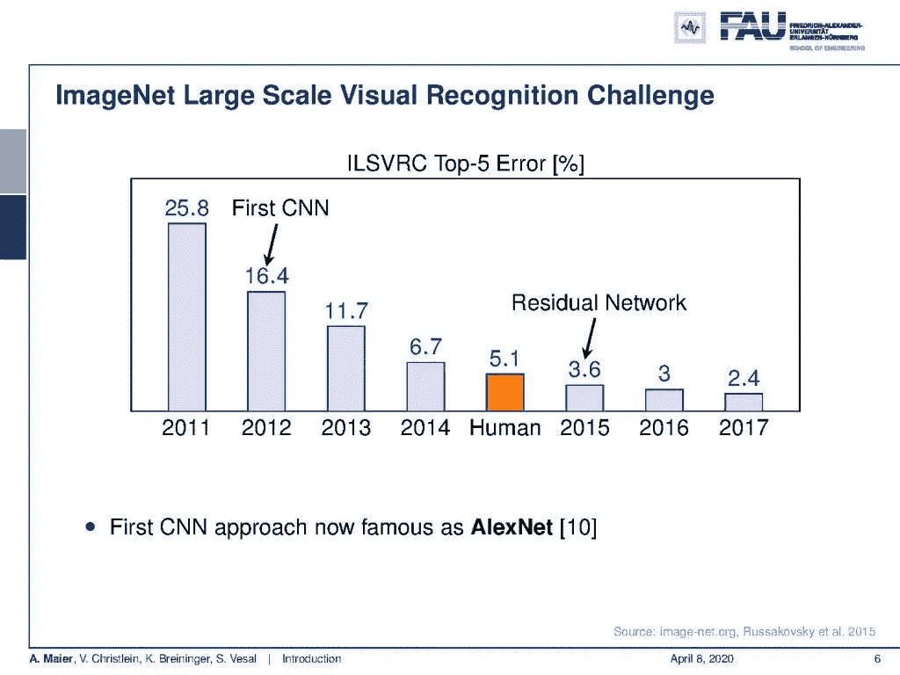

图像净结果。 [CC 下的图片来自](https://creativecommons.org/licenses/by/4.0/)[深度学习讲座](https://www.youtube.com/watch?v=p-_Stl0t3kU&list=PLpOGQvPCDQzvgpD3S0vTy7bJe2pf_yJFj&index=1)的 4.0 。

现在是 2012 年，Alex Network 的胜利向前迈进了一大步。AlexNet 真的把错误率减半了。因此，如果我们看一下我们在 image net 挑战范围内获得的不同错误率，您可以看到，对于前 5 名错误，我们开始时的错误率约为 25%。所以在 2011 年和之前几年，我们大约在 25%左右，你可以看到这在过去几年里停滞不前。2012 年，第一个卷积神经网络(CNN)在这里推出，CNN 几乎将错误率减半。这是一个很大的惊喜，因为当时没有人能做到。您可以看到，不仅在 2012 年有所进步，而且在 2013 年等错误率越来越下降，直到我们基本上达到了与人类大致相同的水平。

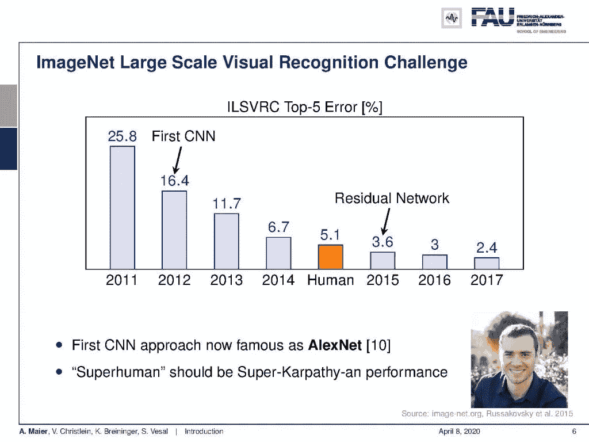

图像净结果。来自[深度学习讲座](https://www.youtube.com/watch?v=p-_Stl0t3kU&list=PLpOGQvPCDQzvgpD3S0vTy7bJe2pf_yJFj&index=1)的 [CC BY 4.0](https://creativecommons.org/licenses/by/4.0/) 下的图片。

因此，那里的神经网络报告了第一批结果，人们声称已经有了超人的表现。那么，真的是超人的表现吗？嗯，没有多少人真正评估过整个测试集。所以，你实际上可以说超人的表现应该是超级卡帕西——一种表现，因为他实际上经历了整个测试数据集。

ImageNet 示例。 [CC 下的图片来自](https://creativecommons.org/licenses/by/4.0/)[深度学习讲座](https://www.youtube.com/watch?v=p-_Stl0t3kU&list=PLpOGQvPCDQzvgpD3S0vTy7bJe2pf_yJFj&index=1)的 4.0 。

现在有问题吗？是的，ImageNet 有几个问题。上面第一行可能是相当简单的例子，但是如果你看下面一行，也有一些非常困难的例子。所以，如果你只展示了图像的一部分，或者特别是如果你看到樱桃上也有一只狗，你很难区分这些图像。当然，如果每张图片只有一个标签，这就成问题了。也许一个标签不足以描述一幅完整的图像。

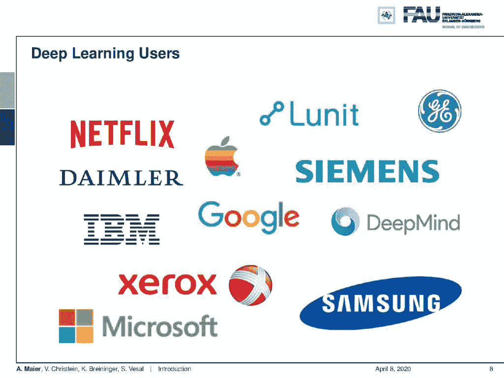

深度学习行业用户。 [CC 下的图片来自](https://creativecommons.org/licenses/by/4.0/)[深度学习讲座](https://www.youtube.com/watch?v=p-_Stl0t3kU&list=PLpOGQvPCDQzvgpD3S0vTy7bJe2pf_yJFj&index=1)的 4.0 。

所有这些东西现在都在工业中使用。有大量部署用户，包括谷歌、苹果、IBM、Deep Mind，但也有许多其他公司从这里开始。所以你可以看到深度学习已经部分解决了网飞挑战。这是一个 100 万美元的挑战，实际上是建立一个推荐系统，推荐你真正喜欢的电影。你可以看到医疗保健正在进入:西门子和通用电气。但戴姆勒等汽车制造商和许多其他汽车制造商也在前往那里，因为自动驾驶是一个巨大的趋势。

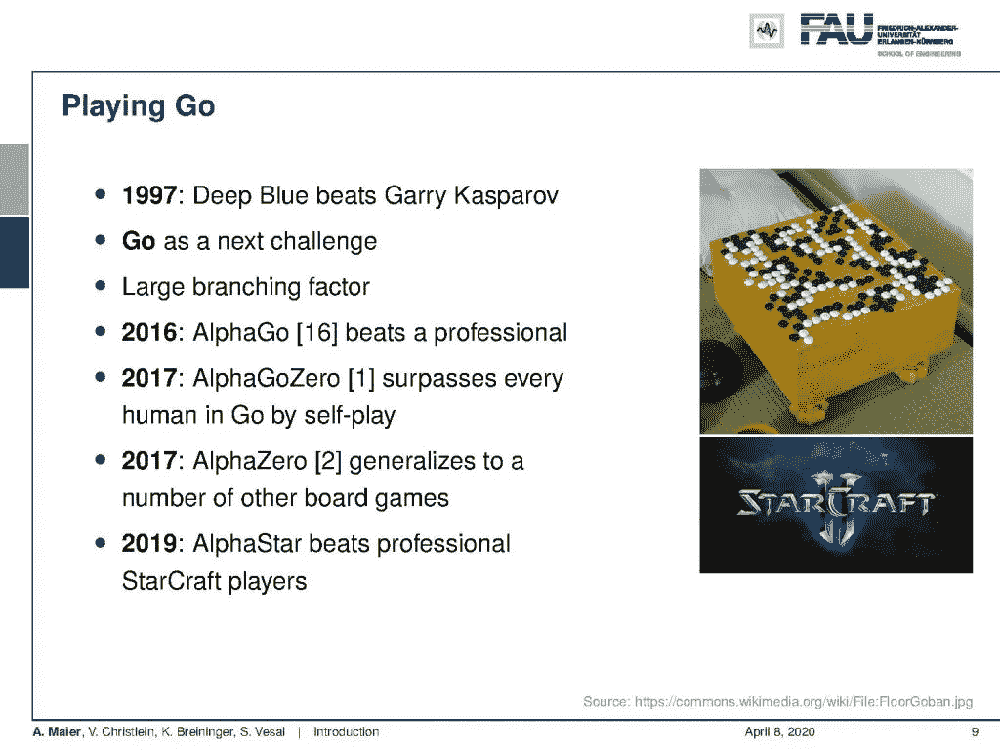

游戏的突破。来自[深度学习讲座](https://www.youtube.com/watch?v=p-_Stl0t3kU&list=PLpOGQvPCDQzvgpD3S0vTy7bJe2pf_yJFj&index=1)的 [CC BY 4.0](https://creativecommons.org/licenses/by/4.0/) 下的图片。

让我们来看看几个非常好的突破。例如，人们一直试图在各种游戏中击败人类，我们从 1997 年就知道我们可以在国际象棋中击败人类。所以在 1997 年，IBM 的“深蓝”打败了国际象棋世界冠军加里·卡斯帕罗夫。但是解象棋要简单一点，因为它没有那么复杂的走法。他们解决这个游戏的方法是，他们有一个开始移动的字典。然后，他们在游戏的中间部分对整个游戏进行了一次强力搜索，在游戏快结束时，他们再次使用了字典。

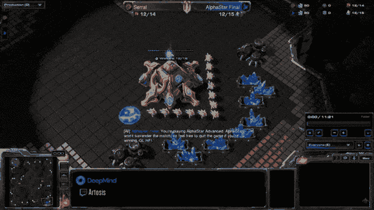

阿尔法星打塞拉勒。完整视频可以在[这里](https://www.youtube.com/watch?v=nbiVbd_CEIA&list=LLoiMqX5FHfk_KDow7xSe7pg&index=2&t=0s)找到。使用 [gifify](https://github.com/vvo/gifify) 生成的图像。

现在围棋是一个更难的挑战，因为在游戏的每一步中，你都可以在棋盘的每一部分放置一块石头。这意味着，如果你真的想进行彻底的搜索，寻找游戏中所有不同的机会，只有在走了几步后，实际的走法数量才会因为大的分支因子而激增。以目前的计算能力，我们无法暴力破解整个游戏。但是，2016 年 AlphaGo，一个深度思维创造的系统，真的打败了一个职业围棋手。2017 年，AlphaGo Zero 甚至超越了每一个人类，而且仅仅是靠自我对弈。不久之后，AlphaGo Zero 推广到了其他一些棋盘游戏。他们甚至设法开发了其他不同于典型棋盘游戏的游戏。在 AlphaStar 中，他们击败了职业星际玩家。因此，这确实是一项非常有趣的技术。

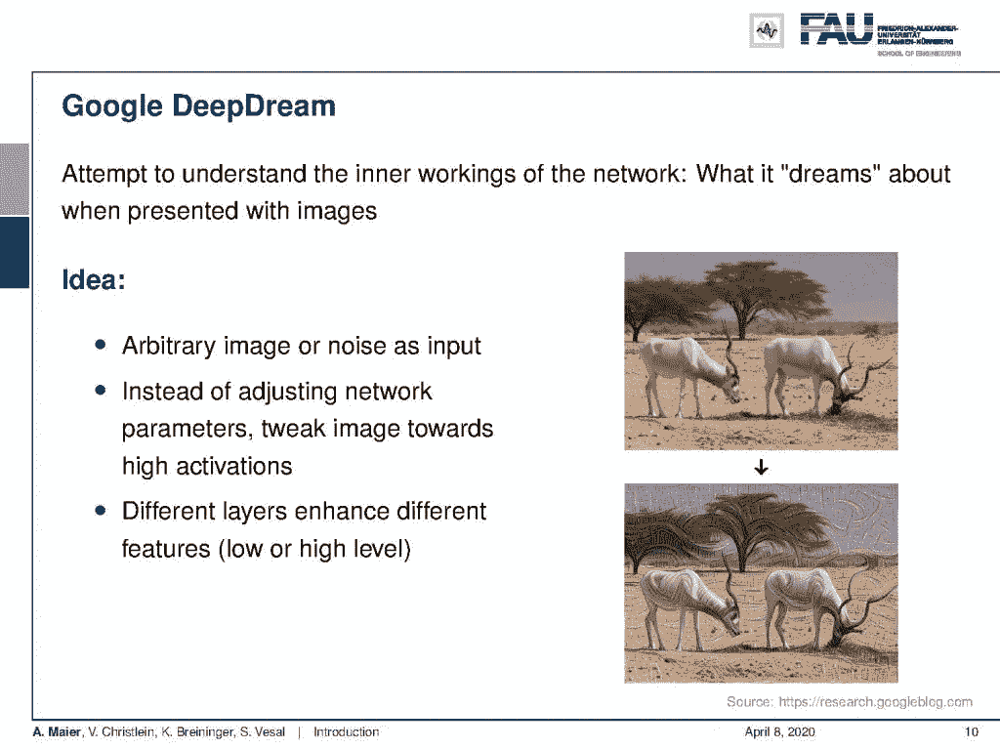

谷歌深梦。 [CC 下的图片来自](https://creativecommons.org/licenses/by/4.0/)[深度学习讲座](https://www.youtube.com/watch?v=p-_Stl0t3kU&list=PLpOGQvPCDQzvgpD3S0vTy7bJe2pf_yJFj&index=1)的 4.0 。

在谷歌的深层梦想中，有一种理解网络内部运作的尝试，他们对网络在展示图像时会梦到什么感兴趣。因此，他们的想法是显示一些任意的输入图像或噪声作为输入，然后不是调整网络参数，而是将输入调整到网络的高激活状态。这取决于我们在看非常有趣的图像。因此，你可以创建非常令人印象深刻的神秘图像，如这里的右手边所示，有了这些输入和网络的改进。

更深的梦。来自[深度学习讲座](https://www.youtube.com/watch?v=p-_Stl0t3kU&list=PLpOGQvPCDQzvgpD3S0vTy7bJe2pf_yJFj&index=1)的 [CC BY 4.0](https://creativecommons.org/licenses/by/4.0/) 下的图片。

或者你甚至可以放入蓝天，然后调整成神经元。然后你可以看到天空中突然出现了各种各样的东西，如果你仔细观察，你可以看到出现了像海军上将狗、猪蜗牛、骆驼鸟或狗鱼这样的动物。

显示 Yolo 能力的示例序列。完整的序列可以在[这里](https://youtu.be/VOC3huqHrss)找到。使用 [gifify](https://github.com/vvo/gifify) 生成的图像。

那么，还有什么有趣的呢？嗯，也有实时物体检测成为可能的方法，如 [Yolo](https://youtu.be/VOC3huqHrss) (你只看一次)。他们使用多个区域，检测边界框，并非常快速地对它们进行分类，这是实时运行的。它不仅仅适用于像 image net 这样的单个场景图像，在 image net 中，每个图像基本上只有一个对象，但它适用于完全混乱的场景。你甚至可以看到这些检测器对看不见的输入进行处理，比如电影场景。现在，你可能会说这些都是非常有趣的例子，但是我们能每天都使用它吗？或者仅仅是研究产生了奇特的视频？

Siri 使用深度学习技术。来自[深度学习讲座](https://www.youtube.com/watch?v=p-_Stl0t3kU&list=PLpOGQvPCDQzvgpD3S0vTy7bJe2pf_yJFj&index=1)的 [CC BY 4.0](https://creativecommons.org/licenses/by/4.0/) 下的图片。

真的很好用。您可能已经看到语音识别界面已经有了巨大的改进。此外，借助深度学习技术，Siri 语音识别现在可以识别大约 99.7%的口语单词。所以在 100 个单词中，不到一个单词被错误识别，你可以看到 Siri 正在被使用。许多人在手机上使用它。他们用它来发号施令，它甚至可以在各种环境下工作。此外，在户外的路上环境中，当有背景噪音并且 Siri 仍然工作时。

Alexa 正在使用深度学习。 [CC 下的图片来自](https://creativecommons.org/licenses/by/4.0/)[深度学习讲座](https://www.youtube.com/watch?v=p-_Stl0t3kU&list=PLpOGQvPCDQzvgpD3S0vTy7bJe2pf_yJFj&index=1)的 4.0 。

亚马逊现在也在部署一些非常有趣的东西。你可以看到，现在很多人家里都有这个亚马逊产品，他们可以远程控制不同的东西。他们可以点餐，通常效果很好。但是，当然，口音很重的用户仍然会遇到麻烦。

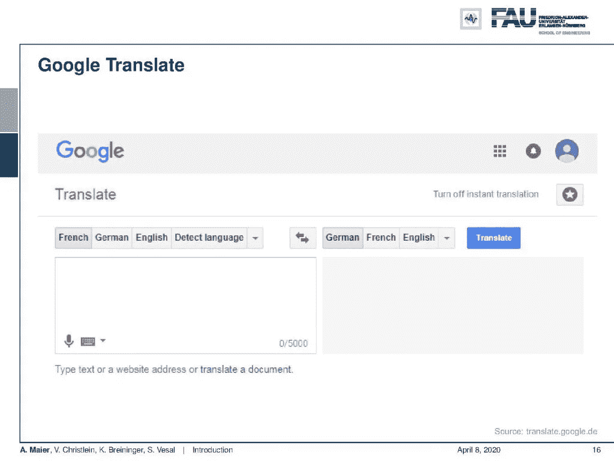

谷歌翻译使用深度学习。 [CC 下的图片来自](https://creativecommons.org/licenses/by/4.0/)[深度学习讲座](https://www.youtube.com/watch?v=p-_Stl0t3kU&list=PLpOGQvPCDQzvgpD3S0vTy7bJe2pf_yJFj&index=1)的 4.0 。

我猜你们中的许多人也一直在使用谷歌翻译，这是一个非常好的翻译工具，在过去的两年里已经有了很大的改进。也许两年前，他们的性能确实有所提高，这是因为他们转向了一种通用的深度学习方法，在这种方法中，他们不仅学习单对语言，而且同时使用所有语言来训练深度翻译软件。如果你看看今天的谷歌翻译，很多东西都可以自动翻译，通常只需要在输出中做一些改变，这样你就有一个非常好的翻译。所以，这些是我们今天看到的深度学习令人兴奋的高调应用。

在这个深度学习讲座中，更多令人兴奋的事情即将到来。来自[深度学习讲座](https://www.youtube.com/watch?v=p-_Stl0t3kU&list=PLpOGQvPCDQzvgpD3S0vTy7bJe2pf_yJFj&index=1)的 [CC BY 4.0](https://creativecommons.org/licenses/by/4.0/) 下的图片。

所以，下一次在《深度访谈》中，我想向你们展示一些不仅仅发生在谷歌和大公司身上的事情。实际上，在埃尔兰根小镇，我们也有一些令人兴奋的发展，我认为值得展示。所以，希望你喜欢这个视频，下次在[深度学习](https://www.youtube.com/watch?v=p-_Stl0t3kU&list=PLpOGQvPCDQzvgpD3S0vTy7bJe2pf_yJFj&index=1)上再见。

如果你喜欢这篇文章，你可以在这里找到更多的文章，或者看看我们的讲座。如果你想在未来了解更多的文章、视频和研究，我也会很感激你在 YouTube、Twitter、脸书、LinkedIn 上的鼓掌或关注。本文以 [Creative Commons 4.0 归属许可](https://creativecommons.org/licenses/by/4.0/deed.de)发布，如果引用，可以转载和修改。

# 参考

[1]大卫·西尔弗、朱利安·施利特维泽、卡伦·西蒙扬等，“在没有人类知识的情况下掌握围棋”。载于:自然 550.7676 (2017)，第 354 页。
【2】David Silver，Thomas Hubert，Julian Schrittwieser 等《用通用强化学习算法通过自玩掌握国际象棋和松木》。载于:arXiv 预印本 arXiv:1712.01815 (2017)。
[3] M. Aubreville，M. Krappmann，C. Bertram 等，“一种用于组织学细胞分化的导向空间转换器网络”。载于:ArXiv 电子版(2017 年 7 月)。arXiv: 1707.08525 [cs。简历】。
[4]大卫·伯内克、克里斯蒂安·里斯、伊里·安杰罗普洛斯等，“利用天空图像进行连续短期辐照度预报”。载于:太阳能 110 (2014)，第 303–315 页。
【5】Patrick Ferdinand Christ，Mohamed Ezzeldin A Elshaer，Florian Ettlinger 等，“使用级联全卷积神经网络和 3D 条件随机场在 CT 中自动分割肝脏和病灶”。国际医学图像计算和计算机辅助施普林格会议。2016 年，第 415–423 页。
[6] Vincent Christlein，David Bernecker，Florian hnig 等，“使用 GMM 超向量和样本支持向量机进行作家识别”。载于:《模式识别》63 期(2017)，第 258–267 页。
[7]弗罗林·克里斯蒂安·盖苏，波格丹一世·乔格斯库，托马索·曼西等，“医学图像中解剖标志检测的人工代理”。发表于:医学图像计算和计算机辅助介入——MICCAI 2016。雅典，2016 年，第 229-237 页。
[8]贾登，魏东，理查德·索彻等，“Imagenet:一个大规模的层次化图像数据库”。载于:计算机视觉和模式识别，2009 年。CVPR 2009。IEEE 会议。2009 年，第 248-255 页。
[9]卡帕斯和飞飞。“用于生成图像描述的深层视觉语义对齐”。载于:ArXiv 电子版(2014 年 12 月)。arXiv: 1412.2306 [cs。简历】。
[10]亚历克斯·克里热夫斯基、伊利亚·苏茨基弗和杰弗里·E·辛顿。“使用深度卷积神经网络的 ImageNet 分类”。神经信息处理系统进展 25。柯伦咨询公司，2012 年，第 1097-1105 页。
【11】Joseph Redmon，Santosh Kumar Divvala，Ross B. Girshick 等《你只看一次:统一的、实时的物体检测》。载于:CoRR abs/1506.02640 (2015 年)。
[12] J .雷德蒙和 a .法尔哈迪。YOLO9000:更好、更快、更强。载于:ArXiv 电子版(2016 年 12 月)。arXiv: 1612.08242 [cs。简历】。
[13]约瑟夫·雷德蒙和阿里·法尔哈迪。“YOLOv3:增量改进”。In: arXiv (2018)。
[14]弗兰克·罗森布拉特。感知器——感知和识别自动机。85–460–1.康奈尔航空实验室，1957 年。
[15] Olga Russakovsky，Jia Deng，苏浩等，“ImageNet 大规模视觉识别挑战赛”。载于:《国际计算机视觉杂志》115.3 (2015)，第 211–252 页。
【16】David Silver，Aja Huang，Chris J .等《用深度神经网络和树搜索掌握围棋博弈》。载于:《自然》杂志 529.7587 期(2016 年 1 月)，第 484–489 页。
[17] S. E. Wei，V. Ramakrishna，T. Kanade 等，“卷积姿态机器”。在 CVPR。2016 年，第 4724–4732 页。
【18】Tobias würfl，Florin C Ghesu，Vincent Christlein，等《深度学习计算机断层成像》。国际医学图像计算和计算机辅助斯普林格国际出版会议。2016 年，第 432–440 页。