# 简介—第 2 部分

> 原文：<https://towardsdatascience.com/lecture-notes-in-deep-learning-introduction-part-2-acabbb3ad22?source=collection_archive---------53----------------------->

## [FAU 讲座笔记](https://towardsdatascience.com/tagged/fau-lecture-notes)深度学习

## FAU 的亮点

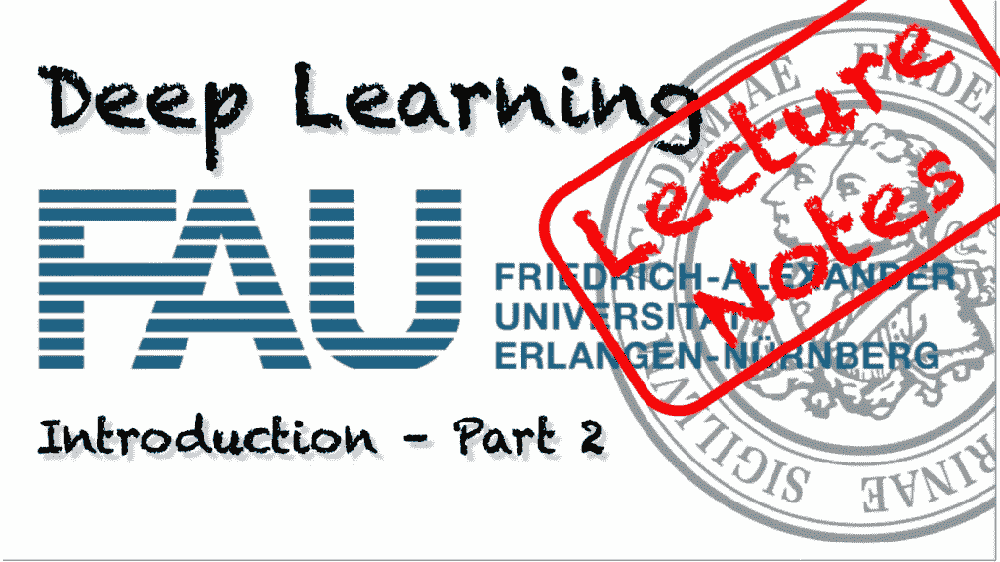

FAU 大学的深度学习。来自[深度学习讲座](https://www.youtube.com/watch?v=p-_Stl0t3kU&list=PLpOGQvPCDQzvgpD3S0vTy7bJe2pf_yJFj&index=1)的 [CC BY 4.0](https://creativecommons.org/licenses/by/4.0/) 下的图片。

**这些是 FAU 的 YouTube 讲座** [**深度学习**](https://www.youtube.com/watch?v=p-_Stl0t3kU&list=PLpOGQvPCDQzvgpD3S0vTy7bJe2pf_yJFj&index=1) **的讲义。这是与幻灯片匹配的讲座视频&的完整抄本。我们希望，你喜欢这个视频一样多。当然，这份抄本是用深度学习技术在很大程度上自动创建的，只进行了少量的手动修改。如果你发现了错误，请告诉我们！**

# 航行

[**上一讲**](/lecture-notes-in-deep-learning-introduction-part-1-5a1729abd580) **/** [**观看本视频**](https://www.youtube.com/watch?v=IxnPzmZg4Is) **/** [**顶级**](/all-you-want-to-know-about-deep-learning-8d68dcffc258) **/** [**下一讲**](/lecture-notes-in-deep-learning-introduction-part-3-22142caad28a)

所以，非常感谢你再次收听，欢迎来到我们深度学习讲座的第二部分，特别是导言。所以，在介绍的第二部分，我想给你们看一些我们在模式识别实验室做的研究，在德国 FAU。

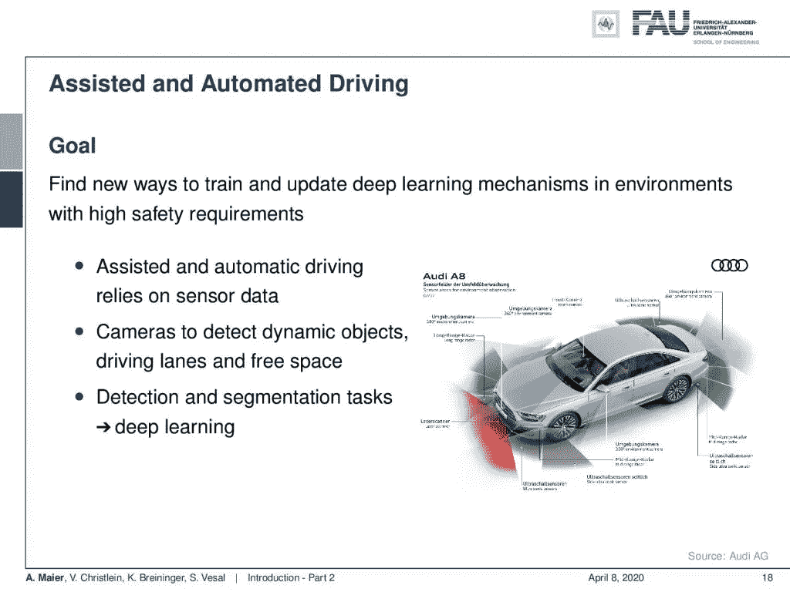

今天的汽车是巨大的传感器系统。 [CC 下的图片来自](https://creativecommons.org/licenses/by/4.0/)[深度学习讲座](https://www.youtube.com/watch?v=p-_Stl0t3kU&list=PLpOGQvPCDQzvgpD3S0vTy7bJe2pf_yJFj&index=1)的 4.0 。

我想强调的第一个例子是与奥迪的合作，我们正在与辅助和自动驾驶合作。我们正在研究汽车中的智能传感器。你可以看到今天的奥迪 A8 本质上是一个巨大的传感器系统，它有摄像头和不同的传感器。数据被实时处理，以便弄清楚关于环境的事情。它有停车辅助等功能。还有一些功能可以在驾驶和交通堵塞时为你提供支持，这些都是通过传感器系统完成的。当然，这涉及到许多检测和分割任务。

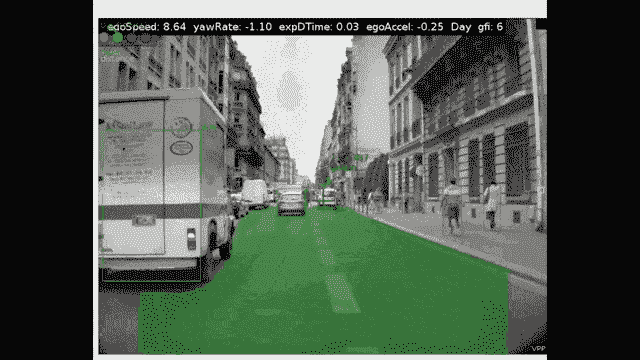

在线道路场景分析。完整视频可以在这里[找到。使用](https://www.youtube.com/watch?v=42rmGs0Rvtw&list=LLoiMqX5FHfk_KDow7xSe7pg&index=11&t=0s) [gifify](https://github.com/vvo/gifify) 生成的图像。

您可以在这里看到一个示例，我们显示了汽车记录的一些输出。这是一个正面视图，我们实际上是在环顾四周，必须检测汽车。你还必须检测——这里用绿色显示——你实际上可以开车去的自由空间，所有这些都必须被检测到，其中许多事情都是通过深度学习完成的。当然，今天有一个巨大的挑战，因为我们需要测试算法。通常这是在模拟环境中完成的，然后产生大量数据以使它们可靠。但最终，这必须在路上运行，这意味着你必须考虑一年中不同的时期和不同的日光条件。这让一切变得异常艰难。你在研究中看到的是，许多检测结果都是在阳光明媚的好天气下进行的。一切都很好，所以算法工作得很好。

但真正的挑战实际上是在多雨的天气条件下，夜晚，冬天，雪，你仍然希望能够检测，当然，不仅仅是汽车，还有交通标志和地标。然后你分析你周围的场景，这样你就可以对你的自动驾驶系统有一个可靠的预测。

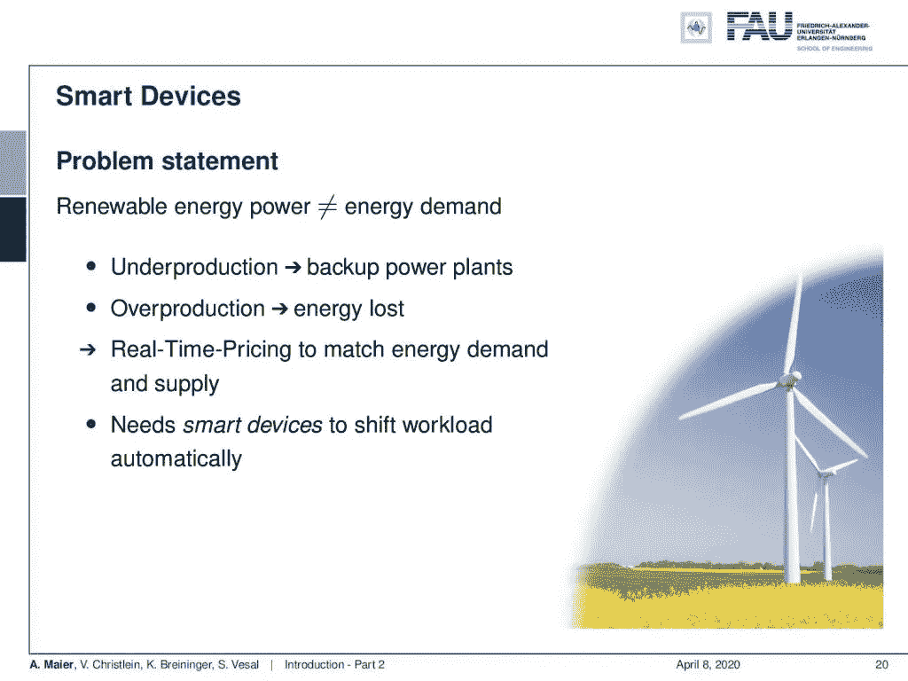

可再生能源系统中的智能设备。来自[深度学习讲座](https://www.youtube.com/watch?v=p-_Stl0t3kU&list=PLpOGQvPCDQzvgpD3S0vTy7bJe2pf_yJFj&index=1)的 [CC BY 4.0](https://creativecommons.org/licenses/by/4.0/) 下的图片。

我们还研究了智能设备，当然，这里有些非常有趣的话题是可再生能源和电力。我们通常面临的一个问题是在生产时，没有足够的风吹或者没有足够的阳光照射。然后，你必须启动备用发电厂，当然，你不想生产过剩，因为那会产生不能很好储存的能量。现在能量的储存效率不是很高。有一些想法可以解决这个问题，比如实时价格，但你需要的是能够识别和预测在不久的将来会产生多少电力的智能设备。

我们来看一个智能设备的例子。比方说，你有一台冰箱或一台洗衣机，你可以对它们进行编程，让它们在消耗能源的时候灵活变化。当价格较低时，你也可以在一夜之间或一小时内开始洗涤。因此，如果你有可以预测当前价格的智能设备，那么你将能够在本质上平衡能源系统的节点，同时消除峰值条件。假设有很多风在吹。那么，很多人冷却冰箱、洗碗或洗衣服就说得通了。当然，这可以通过递归神经网络来完成，然后预测将产生多少电力，并在客户端使用它来平衡电力生产。

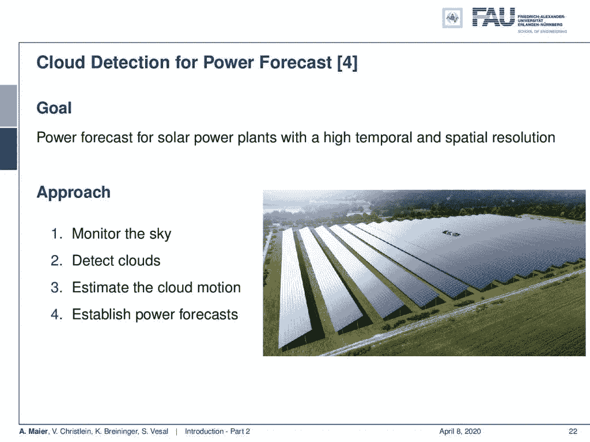

太阳能发电厂依赖于当地可能快速变化的天气条件。 [CC 下的图片来自](https://creativecommons.org/licenses/by/4.0/)[深度学习讲座](https://www.youtube.com/watch?v=p-_Stl0t3kU&list=PLpOGQvPCDQzvgpD3S0vTy7bJe2pf_yJFj&index=1)的 4.0 。

这个例子展示了一个太阳能发电厂。他们对预测短期电力生产感兴趣，以便通知其他设备或启动备用发电厂。这里的关键时间大约是 10 分钟。因此，这里的想法是监测天空，检测云，估计云的运动，然后直接从当前的天空图像预测，在接下来的 10 分钟内将产生多少电力。所以，假设有一朵云很快就要遮住太阳了。然后，你想启动发电机或通知设备不要消耗这么多能量。现在云真的很难用算法来描述，但我们在这里所做的是，我们正在使用一个深度网络来尝试学习这种表示。这些深度学习功能可以预测电力生产，我们实际上成功地产生了大约 10 分钟的可靠预测。使用传统的模式识别技术，我们只能进行大约 5 分钟的预测。

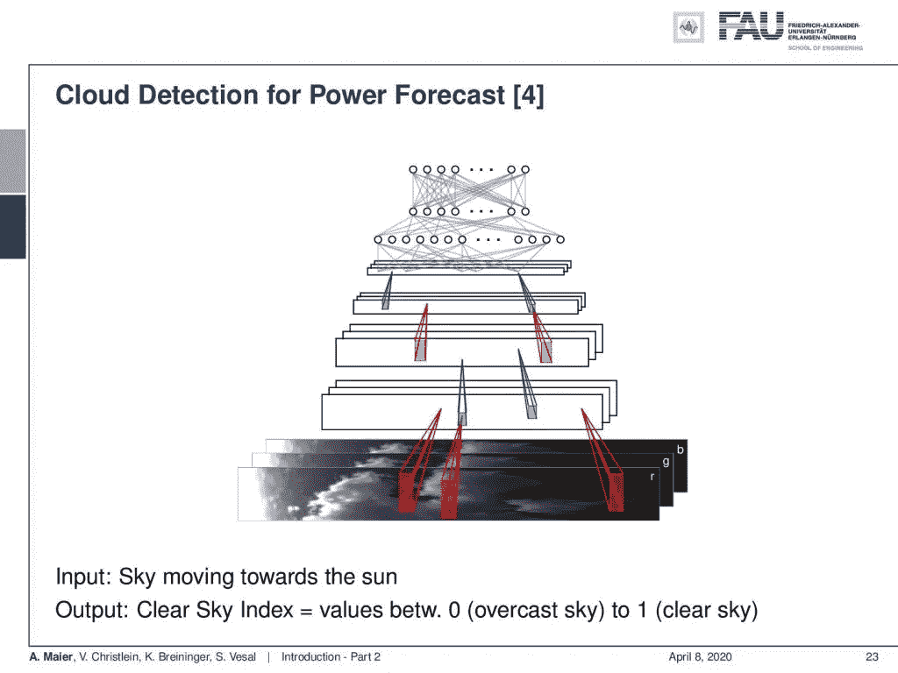

深度表示学习支持稳定的电力生产预测。 [CC 下的图片来自](https://creativecommons.org/licenses/by/4.0/)[深度学习讲座](https://www.youtube.com/watch?v=p-_Stl0t3kU&list=PLpOGQvPCDQzvgpD3S0vTy7bJe2pf_yJFj&index=1)的 4.0 。

我今天想展示的另一个非常激动人心的话题是作家认可。现在这里的任务是，你有一篇文章，你想找出是谁写了这篇文章。因此，我们不是在识别写了什么，而是在识别谁写了文本。这里的想法是再次训练一个深度网络，这个深度网络然后学习描述一个人如何写作的抽象特征。所以它只看字母周围的小块，这些字母周围的小块被用来预测谁实际上写了这篇文章。

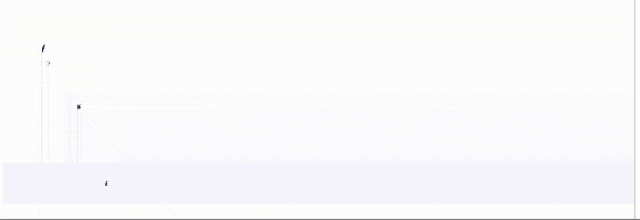

作家一代可以创作手写文字。更多细节可以在文森特的博客[中找到。来自](https://lme.tf.fau.de/pattern-recognition-blog/spatio-temporal-handwriting-imitation/)[深度学习讲座](https://www.youtube.com/watch?v=p-_Stl0t3kU&list=PLpOGQvPCDQzvgpD3S0vTy7bJe2pf_yJFj&index=1)的 4.0CC 下的图片。

我的一位同事刚刚提交了一份非常好的材料，他刚刚提交给一个国际会议，他也能够生成特定人的独特笔迹。像许多方法一样，你可以看到这些深度学习方法当然可以用于非常好的目的，比如识别一个人在历史文本中写了什么。但是你也可以用非常相似的方法制造假货和传播错误信息。所以你可以看到，在很多技术中，当然这也是伦理在深度学习领域非常重要的原因。

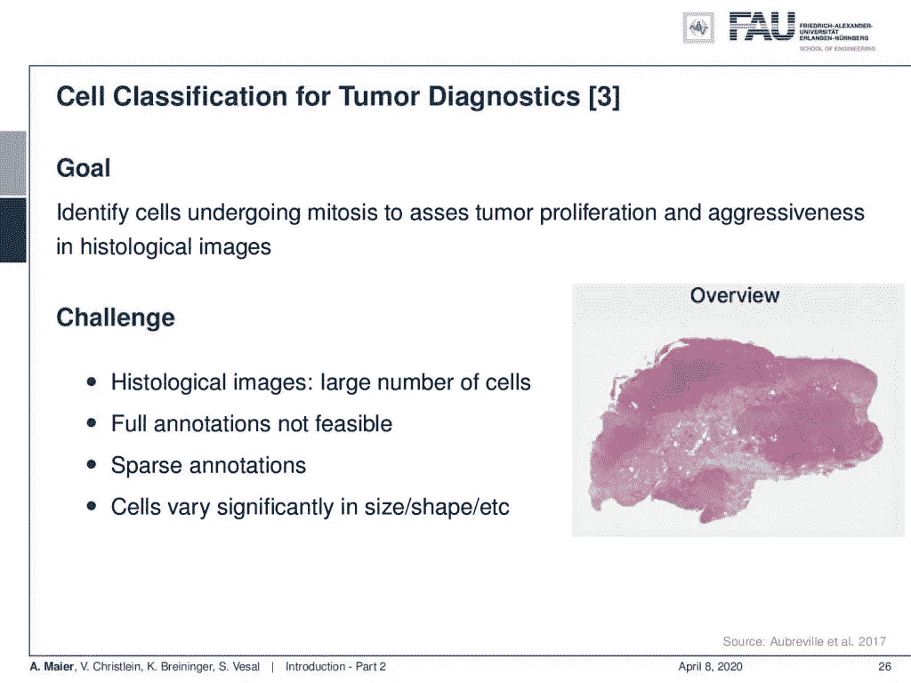

深度学习支持肿瘤诊断。 [CC 下的图片来自](https://creativecommons.org/licenses/by/4.0/)[深度学习讲座](https://www.youtube.com/watch?v=p-_Stl0t3kU&list=PLpOGQvPCDQzvgpD3S0vTy7bJe2pf_yJFj&index=1)的 4.0 。

我们正在做的大部分工作实际上都与医疗应用有关。深度学习的一个非常酷的应用是你想要筛选非常大部分的数据。所以我的一个同事开始研究整张幻灯片。这是用于肿瘤诊断的，例如，你有兴趣弄清楚癌症的侵袭性。如果你观察某个时间点上正在进行的细胞分裂的数量，你就可以知道癌症的侵袭性。所以，你实际上感兴趣的不仅仅是找出癌细胞，而是你想知道这些癌细胞实际上经历有丝分裂的频率，即细胞分裂。检测到的有丝分裂的数量表明了这种特定癌症的侵袭性。现在，这些完整的幻灯片图像非常大，你不想单独查看每个细胞。你可以做的是，你可以训练一个深度网络来观察所有的细胞，然后在临床常规中对整个载玻片进行分析。目前，人们并没有看到整张幻灯片。他们在观察高能量场，就像你在这张图片上看到的一小部分。

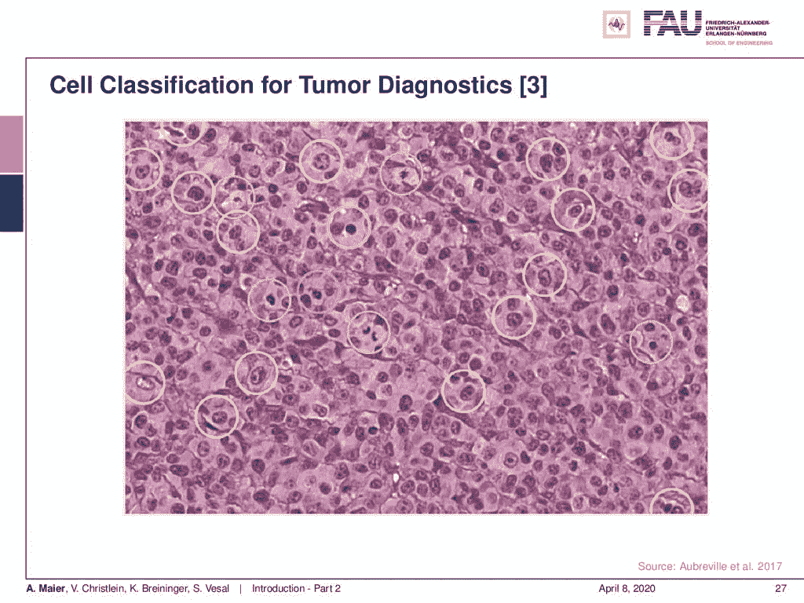

临床常规目前只能看几个高倍放大来估计有丝分裂数。 [CC 下的图片来自](https://creativecommons.org/licenses/by/4.0/)[深度学习讲座](https://www.youtube.com/watch?v=p-_Stl0t3kU&list=PLpOGQvPCDQzvgpD3S0vTy7bJe2pf_yJFj&index=1)的 4.0 。

这是一个高功率场。在临床常规中，他们计算视野内的有丝分裂。所以当然，他们只是不在单一的高功率场做它。他们通常观察十个高倍场来评估癌症的侵袭性。使用深度学习方法，你可以处理所有的幻灯片。

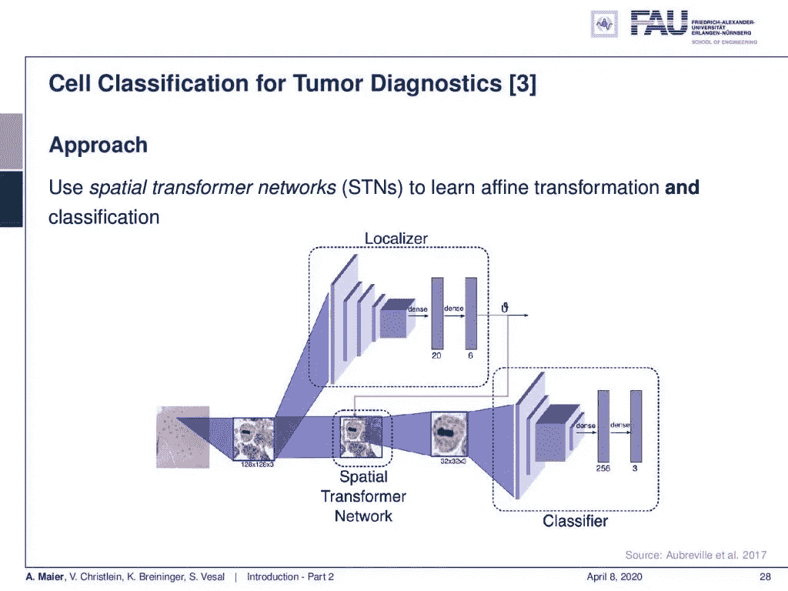

使用空间转换器进行细胞定位和计数。来自[深度学习讲座](https://www.youtube.com/watch?v=p-_Stl0t3kU&list=PLpOGQvPCDQzvgpD3S0vTy7bJe2pf_yJFj&index=1)的 [CC BY 4.0](https://creativecommons.org/licenses/by/4.0/) 下的图片。

这就是深度学习方法的样子。你在网络中有一部分定位细胞，然后网络的另一部分对细胞进行分类，不管是有丝分裂细胞，正常细胞还是癌细胞。

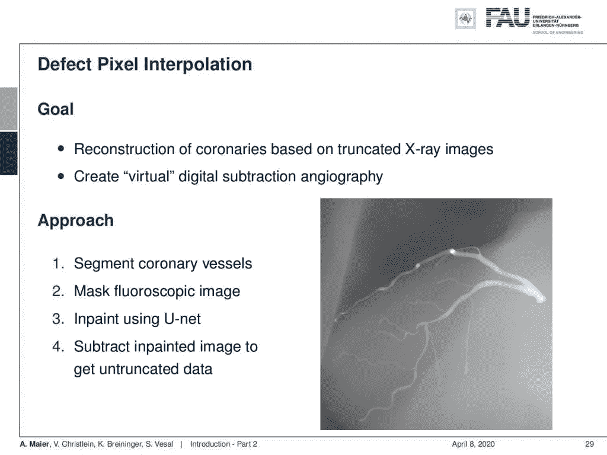

血管造影术允许使用静脉造影剂来显现血管。 [CC 下的图片来自](https://creativecommons.org/licenses/by/4.0/)[深度学习讲座](https://www.youtube.com/watch?v=p-_Stl0t3kU&list=PLpOGQvPCDQzvgpD3S0vTy7bJe2pf_yJFj&index=1)的 4.0 。

非常有趣的事情也可以用缺陷像素插值来完成。这里，我们看到一个小场景，展示了心脏的冠状动脉。典型地，这些冠状动脉不是静止的。它们在移动，因为它们在移动，所以很难看到和分析它们。因此，为了创建清晰的冠状动脉图像，通常要做的是注射造影剂，而你之所以能在这张图像中看到冠状动脉，是因为它们现在充满了碘基造影剂。否则，因为血液在 X 射线吸收方面非常接近水，所以你什么也看不到。

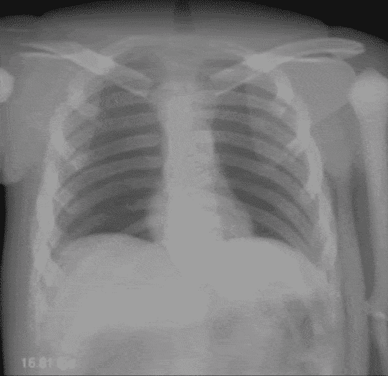

呼吸和心脏运动使得心脏减影成像困难。来自[深度学习讲座](https://www.youtube.com/watch?v=p-_Stl0t3kU&list=PLpOGQvPCDQzvgpD3S0vTy7bJe2pf_yJFj&index=1)的 [CC BY 4.0](https://creativecommons.org/licenses/by/4.0/) 下的图片。

使动脉可视化的一种非常普通的技术是拍摄两幅图像:一幅有造影剂，一幅没有。现在，如果你减去两者，你只会看到造影剂。在心脏介入治疗中，这是非常困难的，因为心脏一直在运动，而患者在呼吸。因此很难应用像数字减影血管造影术这样的技术。

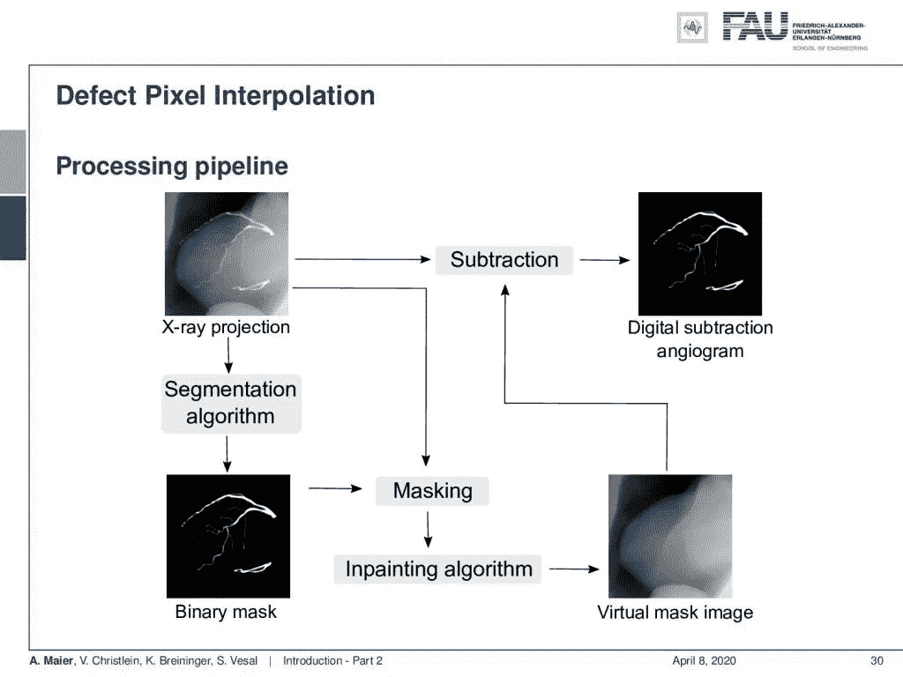

使用深度学习技术的缺陷像素插值允许虚拟数字减影血管造影的计算。 [CC 下的图片来自](https://creativecommons.org/licenses/by/4.0/)[深度学习讲座](https://www.youtube.com/watch?v=p-_Stl0t3kU&list=PLpOGQvPCDQzvgpD3S0vTy7bJe2pf_yJFj&index=1)的 4.0 。

这里我们提出分割检测到的血管。因此，我们使用深度学习框架，实际上是分割血管。一旦我们有了血管分割，我们就用它作为掩模。然后，如果没有造影剂，我们使用深度学习方法来预测掩模的像素。这将使这些像素从图像中消失。现在，你可以把这张虚拟的非对比图像从原始投影中减去，你就得到一张数字减影血管造影照片。这项技术也适用于动态图像。因此，没有深度学习的技术，这是做不到的。插值的实际实现是由 U-Net 完成的。在这节课的后半部分，当我们讨论图像分割时，你们会听到这种情况，它通常会用到。U-Net 是一个通用的图像到图像转换器。你也可以用它来产生无对比度的图像。

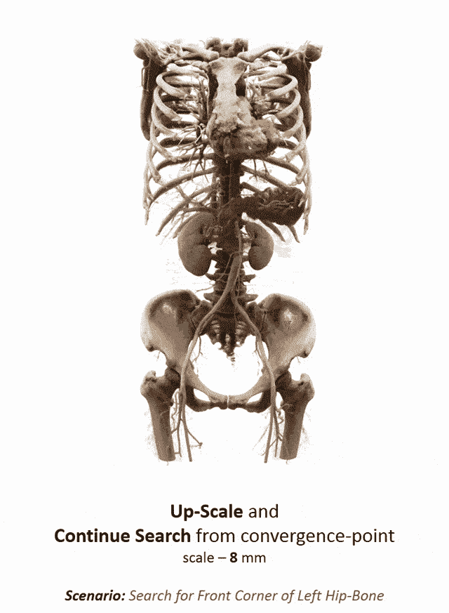

强化学习允许类似放射科医生的标志检测。图片由 Florin Ghesu 提供。

在全身图像中经常做的另一个重要部分是，你想要定位不同的器官。我的同事 Florin Ghesu 开发了一种聪明的方法来找出不同器官的位置。所以，我们的想法是以一种非常类似于放射科医生的方式来处理图像:你从查看图像的一小部分开始，然后你试图预测你必须去哪里找到感兴趣的特定器官。当然，在单一分辨率水平上这样做是不够的。因此，您还可以在更小的分辨率级别上细化搜索，以便获得器官质心的非常精确的预测。这种预测非常快，因为你只看体积的一小部分。所以你可以在大约两秒钟内完成 200 个解剖标志。另一个非常有趣的部分是，你产生了一条也可以被解释的路径。即使在体积中不存在特定标志的情况下，这种方法也不会失败。因此，假设您在一个甚至没有显示臀部的体积中寻找髋骨。然后，您将看到虚拟代理试图离开该卷，它不会预测错误的位置。相反，它会告诉你髋骨会低得多，你必须把音量留在这个位置。

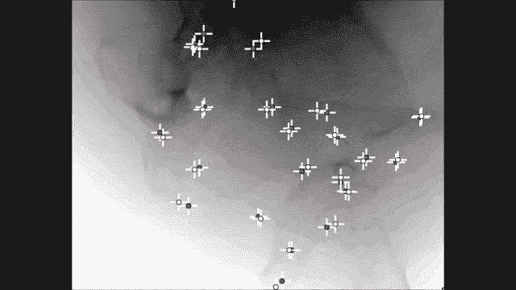

深度学习地标检测也适用于 [X 射线投影](https://link.springer.com/chapter/10.1007/978-3-030-00937-3_7)。图片由 Bastian Bier 提供。

正如我的同事 Bastian Bier 所演示的那样，地标检测也可以用于投影图像。他开发了一种非常有趣的方法，利用地标的三维位置。利用三维位置，您可以创建地标的虚拟投影，并训练基于投影图像的分类器。使用基于投影图像的分类器，您可以在感兴趣的特定解剖结构的任意视图中检测界标。在这里，我们展示了一个髋骨的例子，你可以看到，如果我们向前投影，并试图检测界标，这实际上是一个非常困难的任务。使用 Bastion 设计的方法，我们能够跟踪整个髋骨，并直接从投影视图中找到髋骨上的特定标志。所以这里的想法是，你用一个卷积姿态机。这里，我们基本上单独处理每个地标，然后通知在第一部分中已经检测到的不同地标关于相应的其他地标的位置。然后，你一次又一次地处理，直到你有一个最终的地标位置。

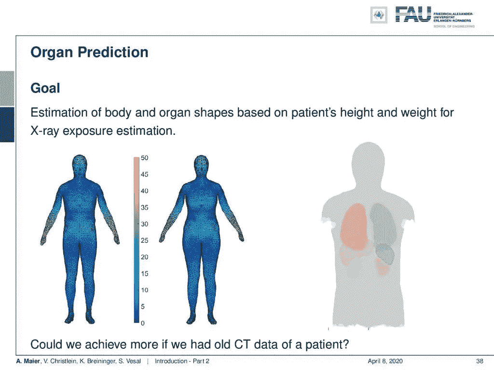

根据患者体表数据从内部器官进行预测。 [CC 下的图片来自](https://creativecommons.org/licenses/by/4.0/)[深度学习讲座](https://www.youtube.com/watch?v=p-_Stl0t3kU&list=PLpOGQvPCDQzvgpD3S0vTy7bJe2pf_yJFj&index=1)的 4.0 。

我的同事夏忠一直致力于器官位置的预测，他一直在做的是，他基本上是使用一个三维相机来检测病人的表面。然后，他想预测器官在体内的实际位置。现在，这非常有趣，因为我们可以利用这些信息来预测不同器官将会受到多少辐射剂量。因此，如果我知道器官在哪里，那么我就可以调整我的放射治疗计划，甚至是成像，以便选择 x 射线设备的位置，使风险器官的剂量最小。这可以帮助我们减少器官的剂量和在相应治疗后发生癌症的风险。

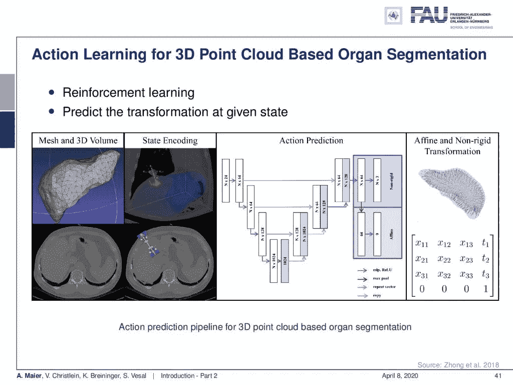

基于主体的器官分割。来自[深度学习讲座](https://www.youtube.com/watch?v=p-_Stl0t3kU&list=PLpOGQvPCDQzvgpD3S0vTy7bJe2pf_yJFj&index=1)的 [CC BY 4.0](https://creativecommons.org/licenses/by/4.0/) 下的图片。

现在，这种仅从表面信息预测器官位置的方法也可以用于在介入 CT 中执行器官分割。因此，这里的想法是，你从一个器官的初始点云开始，然后像前面基于代理的方法一样对它进行优化。我们逐步修改网格，使其与特定图像中的器官形状相匹配。你可以在左边看到一些手术前的 CT 图像，从这里，我们可以训练算法并产生点云。

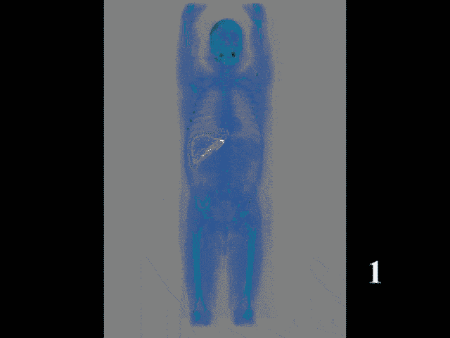

[基于智能体的器官分割](https://arxiv.org/abs/1806.05724)。图片由夏忠提供。

然后，您可以训练一个网络来对这些点云进行变形，并生成新的形状，使它们与实际的图像外观相匹配。有趣的是，这种方法预先知道器官的形状，只对器官做微小的改变，以匹配当前的图像。这允许我们在介入数据中产生非常快速和非常准确的器官分割。因此，我们用常规的 CT 数据进行训练，但它也适用于用移动 C 型臂或血管造影系统完成的图像，这些图像的质量要低得多。这些图像在介入环境中用于引导目的。我们可以在比如说 0.3 到 2.6 秒内应用我们的方法，这比传统的 U-Net 方法快大约 50 到 100 倍，在传统的 U-Net 方法中，你可以进行完全的 3-D 处理。

在这个深度学习讲座中，更多令人兴奋的事情即将到来。来自[深度学习讲座](https://www.youtube.com/watch?v=p-_Stl0t3kU&list=PLpOGQvPCDQzvgpD3S0vTy7bJe2pf_yJFj&index=1)的 [CC BY 4.0](https://creativecommons.org/licenses/by/4.0/) 下的图片。

所以，下一次在深度学习中，我们不仅会谈论成功，还会谈论深度学习的局限性。此外，我们还想讨论几个可能有助于减少这些限制的未来方向。非常感谢您的观看，希望在下一段视频中见到您。

如果你喜欢这篇文章，你可以在这里找到更多的文章，或者看看我们的讲座。如果你想在未来了解更多的文章、视频和研究，我也会很感激你在 YouTube、Twitter、脸书、LinkedIn 上的鼓掌或关注。本文以 [Creative Commons 4.0 归属许可](https://creativecommons.org/licenses/by/4.0/deed.de)发布，如果引用，可以转载和修改。

# 参考

[1]大卫·西尔弗、朱利安·施利特维泽、卡伦·西蒙扬等，“在没有人类知识的情况下掌握围棋”。载于:自然 550.7676 (2017)，第 354 页。
【2】David Silver，Thomas Hubert，Julian Schrittwieser 等《用通用强化学习算法通过自玩掌握国际象棋和松木》。载于:arXiv 预印本 arXiv:1712.01815 (2017)。
[3] M. Aubreville，M. Krappmann，C. Bertram 等，“一种用于组织学细胞分化的导向空间转换器网络”。载于:ArXiv 电子版(2017 年 7 月)。arXiv: 1707.08525 [cs。简历】。
[4]大卫·伯内克、克里斯蒂安·里斯、伊里·安杰罗普洛斯等，“利用天空图像进行连续短期辐照度预报”。载于:太阳能 110 (2014)，第 303–315 页。
【5】Patrick Ferdinand Christ，Mohamed Ezzeldin A Elshaer，Florian Ettlinger 等，“使用级联全卷积神经网络和 3D 条件随机场在 CT 中自动分割肝脏和病灶”。国际医学图像计算和计算机辅助施普林格会议。2016 年，第 415–423 页。
[6] Vincent Christlein，David Bernecker，Florian hnig 等，“使用 GMM 超向量和样本支持向量机进行作家识别”。载于:《模式识别》63 期(2017)，第 258–267 页。
[7]弗罗林·克里斯蒂安·盖苏，波格丹一世·乔格斯库，托马索·曼西等，“医学图像中解剖标志检测的人工代理”。发表于:医学图像计算和计算机辅助介入——MICCAI 2016。雅典，2016 年，第 229-237 页。
[8]贾登，魏东，理查德·索彻等，“Imagenet:一个大规模的层次化图像数据库”。载于:计算机视觉和模式识别，2009 年。CVPR 2009。IEEE 会议。2009 年，第 248-255 页。
[9]卡帕斯和飞飞。“用于生成图像描述的深层视觉语义对齐”。载于:ArXiv 电子版(2014 年 12 月)。arXiv: 1412.2306 [cs。简历】。
[10]亚历克斯·克里热夫斯基、伊利亚·苏茨基弗和杰弗里·E·辛顿。“使用深度卷积神经网络的 ImageNet 分类”。神经信息处理系统进展 25。柯伦咨询公司，2012 年，第 1097-1105 页。
【11】Joseph Redmon，Santosh Kumar Divvala，Ross B. Girshick 等《你只看一次:统一的、实时的物体检测》。载于:CoRR abs/1506.02640 (2015 年)。
[12] J .雷德蒙和 a .法尔哈迪。YOLO9000:更好、更快、更强。载于:ArXiv 电子版(2016 年 12 月)。arXiv: 1612.08242 [cs。简历】。
[13]约瑟夫·雷德蒙和阿里·法尔哈迪。“YOLOv3:增量改进”。In: arXiv (2018)。
[14]弗兰克·罗森布拉特。感知器——感知和识别自动机。85–460–1.康奈尔航空实验室，1957 年。
[15] Olga Russakovsky，Jia Deng，苏浩等，“ImageNet 大规模视觉识别挑战赛”。载于:《国际计算机视觉杂志》115.3 (2015)，第 211–252 页。
【16】David Silver，Aja Huang，Chris J .等《用深度神经网络和树搜索掌握围棋博弈》。载于:《自然》杂志 529.7587 期(2016 年 1 月)，第 484–489 页。
[17] S. E. Wei，V. Ramakrishna，T. Kanade 等，“卷积姿态机器”。在 CVPR。2016 年，第 4724–4732 页。
【18】Tobias würfl，Florin C Ghesu，Vincent Christlein，等《深度学习计算机断层成像》。国际医学图像计算和计算机辅助斯普林格国际出版会议。2016 年，第 432–440 页。