# 简介—第 3 部分

> 原文：<https://towardsdatascience.com/lecture-notes-in-deep-learning-introduction-part-3-22142caad28a?source=collection_archive---------65----------------------->

## [FAU 讲座笔记](https://towardsdatascience.com/tagged/fau-lecture-notes)深度学习

## 深度学习的局限性和未来方向

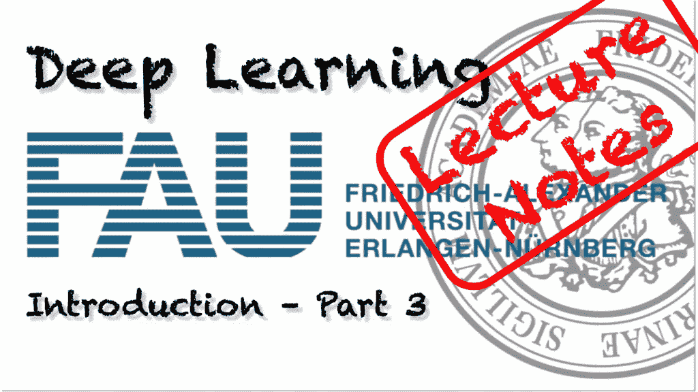

FAU 大学的深度学习。来自[深度学习讲座](https://www.youtube.com/watch?v=p-_Stl0t3kU&list=PLpOGQvPCDQzvgpD3S0vTy7bJe2pf_yJFj&index=1)的 [CC BY 4.0](https://creativecommons.org/licenses/by/4.0/) 下的图片。

**这些是 FAU 的 YouTube 讲座** [**深度学习**](https://www.youtube.com/watch?v=p-_Stl0t3kU&list=PLpOGQvPCDQzvgpD3S0vTy7bJe2pf_yJFj&index=1) **的讲义。这是与幻灯片匹配的讲座视频&的完整抄本。我们希望，你喜欢这个视频一样多。当然，这份抄本是用深度学习技术在很大程度上自动创建的，只进行了少量的手动修改。如果你发现了错误，请告诉我们！**

# 航行

[**上一讲**](/lecture-notes-in-deep-learning-introduction-part-2-acabbb3ad22) **/** [**观看本视频**](https://www.youtube.com/watch?v=fT9GhzjXZb8) **/** [**顶级**](/all-you-want-to-know-about-deep-learning-8d68dcffc258) **/** [**下一讲**](/lecture-notes-in-deep-learning-introduction-part-4-2e86af0498ce)

感谢收看深度学习的下一期视频。所以，我想在这个视频中展示给你的是深度学习的一些局限性。所以，你可能想知道有什么限制吗？我们说完了吗？我们不是在这里学到了可以解决所有问题的东西吗？

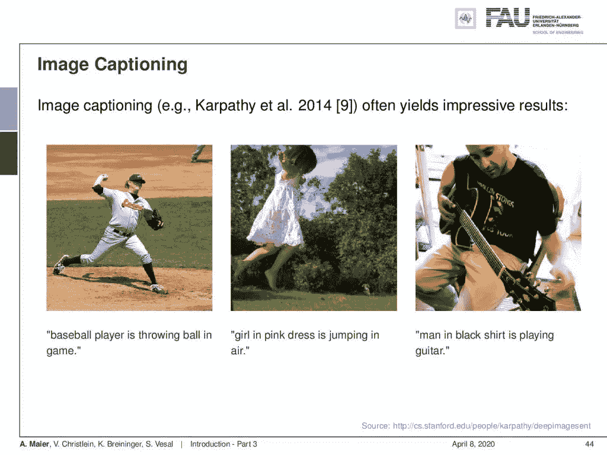

图像字幕的正面例子。 [CC 下的图片来自](https://creativecommons.org/licenses/by/4.0/)[深度学习讲座](https://www.youtube.com/watch?v=p-_Stl0t3kU&list=PLpOGQvPCDQzvgpD3S0vTy7bJe2pf_yJFj&index=1)的 4.0 。

当然也有一些限制。例如，像图像字幕这样的任务会产生令人印象深刻的结果。你可以看到网络能够识别棒球运动员，穿着粉色裙子在空中跳跃的女孩，甚至是弹吉他的人。

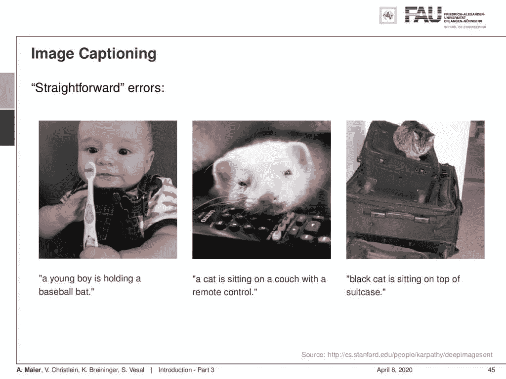

图像字幕中的错误。 [CC 下的图片来自](https://creativecommons.org/licenses/by/4.0/)[深度学习讲座](https://www.youtube.com/watch?v=p-_Stl0t3kU&list=PLpOGQvPCDQzvgpD3S0vTy7bJe2pf_yJFj&index=1)的 4.0 。

所以我们来看一些错误。在左边，你可以看到，这显然不是棒球棒。此外，这不是一只猫在中心的形象，他们也像在右手边的一个轻微的错误:在行李箱顶部的猫不是黑色的。

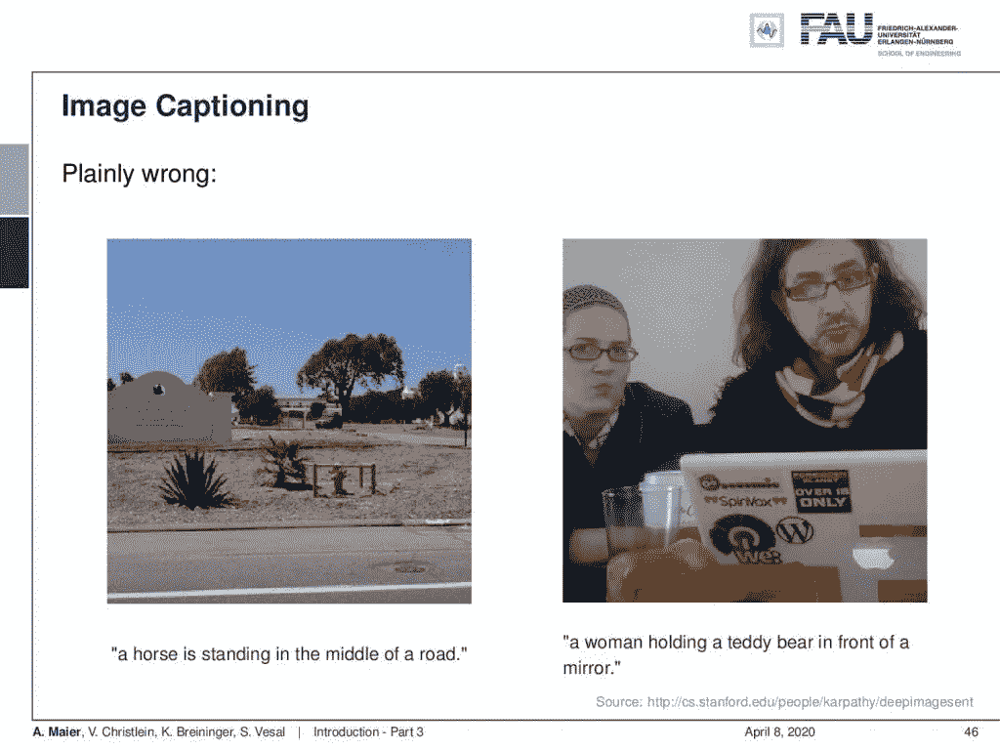

清除图像字幕中的错误:来自[深度学习讲座](https://www.youtube.com/watch?v=p-_Stl0t3kU&list=PLpOGQvPCDQzvgpD3S0vTy7bJe2pf_yJFj&index=1)的 [CC 下的图像 4.0](https://creativecommons.org/licenses/by/4.0/) 。

有时它们甚至是简单的错误，比如左图中的这个:我没有看到路中间有一匹马，右图中也没有一个女人在镜子前抱着一只泰迪熊。

这当然是因为有几个挑战，其中一个主要挑战是训练数据。深度学习应用需要巨大的人工标注数据集，而这些数据集很难获得。注释既费时又费钱，而且常常含糊不清。所以，正如你在 image net challenge 中已经看到的，有时不清楚分配哪个标签，显然你必须分配标签的分布。此外，我们看到，即使在人工注释中，也存在典型的错误。为了得到一个真正好的标签，你需要做的是，你实际上需要请两个甚至更多的专家来完成整个贴标过程。然后，您可以找到标签分布非常明显的实例。这些是典型的原型，标签的广泛分布是人们不确定的图像。如果我们有这样的问题，那么我们的性能通常会显著下降。因此，问题是我们能在多大程度上进行模拟，例如扩展训练数据。

当然，也存在信任和可靠性方面的挑战。因此，对于高风险的应用程序来说，验证是强制性的，监管机构对此可能会非常严格。他们真的想了解那些高风险系统中发生了什么。端到端学习本质上禁止识别各个部分是如何工作的。因此，监管者很难判断哪个部分做了什么，以及这个系统实际上为什么会工作。在这一点上，我们必须承认，这在很大程度上还没有解决。很难区分网络的哪个部分在做什么。基于经典算法的模块化方法可能是未来解决这些问题的一种方法。

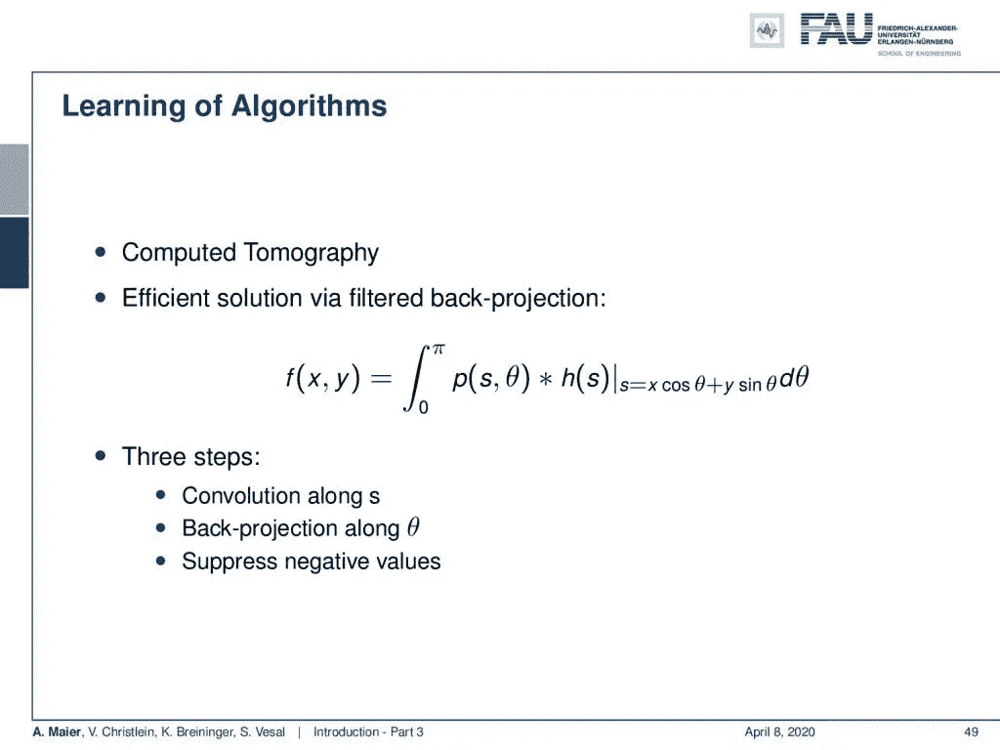

经典的 CT 重建使用滤波和反投影来生成 CT 切片图像。 [CC 下的图片来自](https://creativecommons.org/licenses/by/4.0/)[深度学习讲座](https://www.youtube.com/watch?v=p-_Stl0t3kU&list=PLpOGQvPCDQzvgpD3S0vTy7bJe2pf_yJFj&index=1)的 4.0 。

这就把我们带到了未来的方向，我们在埃尔兰根喜欢做的事情是学习算法。例如，你可以看看经典的计算机断层摄影，它是用滤波反投影公式表示的。你必须沿着投影方向过滤，然后在角度上求和，以产生最终图像。所以这个卷积和反投影实际上可以用线性算子来表示。因此，它们本质上是矩阵乘法。

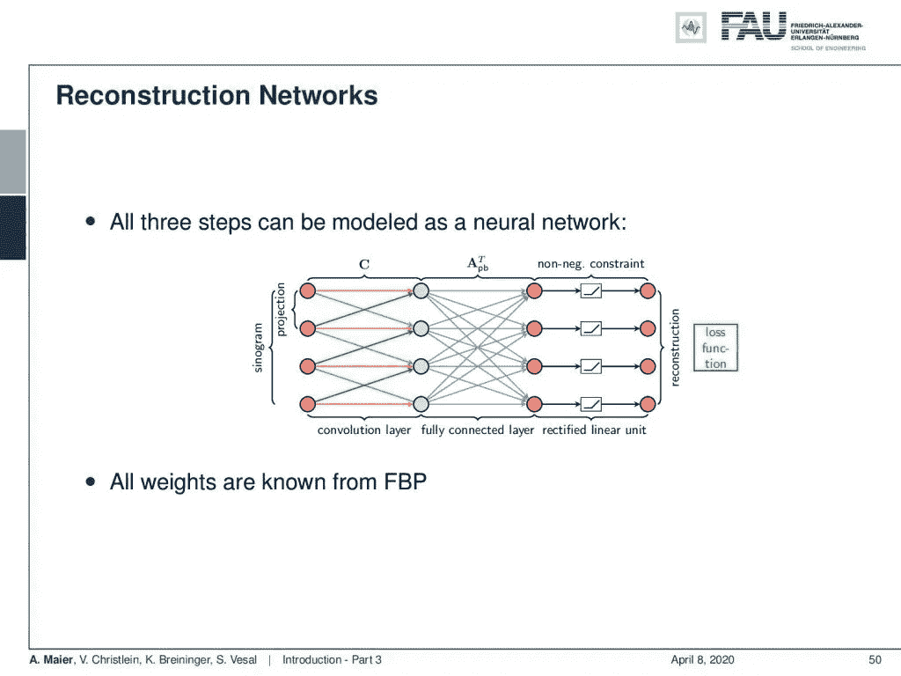

滤波反投影可以在数学上等同地映射到具有三层的神经网络上。来自[深度学习讲座](https://www.youtube.com/watch?v=p-_Stl0t3kU&list=PLpOGQvPCDQzvgpD3S0vTy7bJe2pf_yJFj&index=1)的 [CC BY 4.0](https://creativecommons.org/licenses/by/4.0/) 下的图片。

现在，这些矩阵乘法可以作为一个神经网络来实现，这样你就有了一个算法或网络设计，可以为特定目的进行训练。

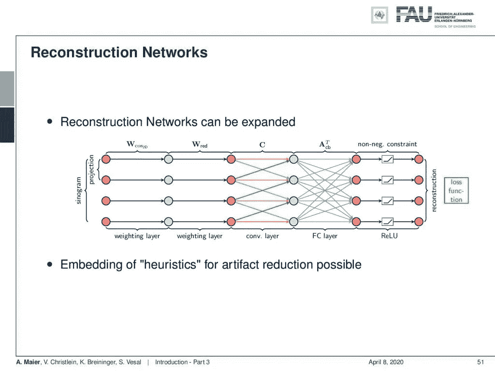

扇形束几何形状的重构网络。 [CC 下的图片来自](https://creativecommons.org/licenses/by/4.0/)[深度学习讲座](https://www.youtube.com/watch?v=p-_Stl0t3kU&list=PLpOGQvPCDQzvgpD3S0vTy7bJe2pf_yJFj&index=1)的 4.0 。

因此，在这里，我们扩展了这种方法，以便将其应用于扇束投影数据。这是对算法的一个微小修改。也有像限角情况这样无法解决的情况。

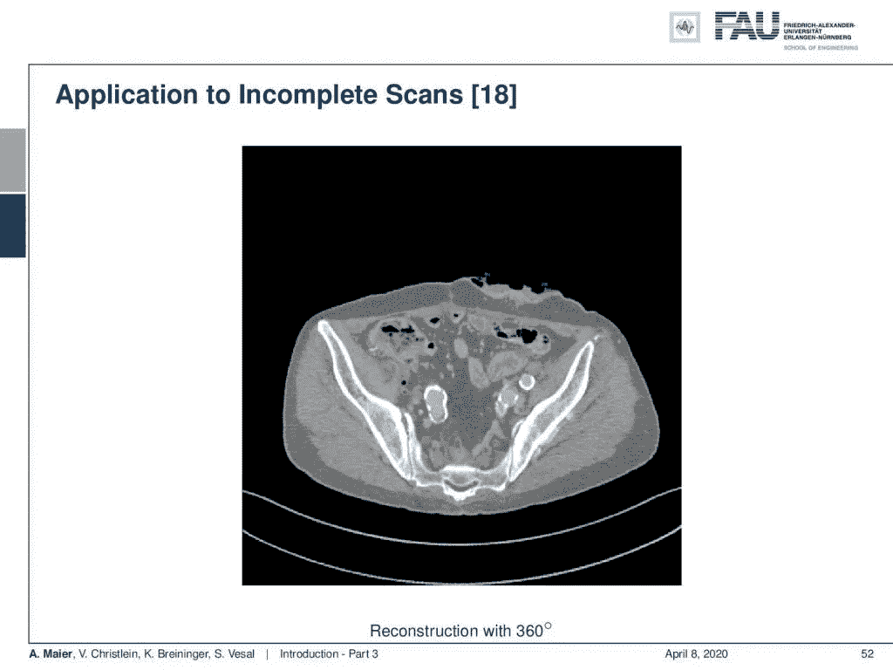

完整的 CT 扫描。来自[深度学习讲座](https://www.youtube.com/watch?v=p-_Stl0t3kU&list=PLpOGQvPCDQzvgpD3S0vTy7bJe2pf_yJFj&index=1)的 4.0CC 下的图片。

在这个图像中，你看到一个完整的扫描，这产生了一个合理的 CT 图像。然而，如果你只错过了 20 度的旋转，你已经看到了严重的伪像:

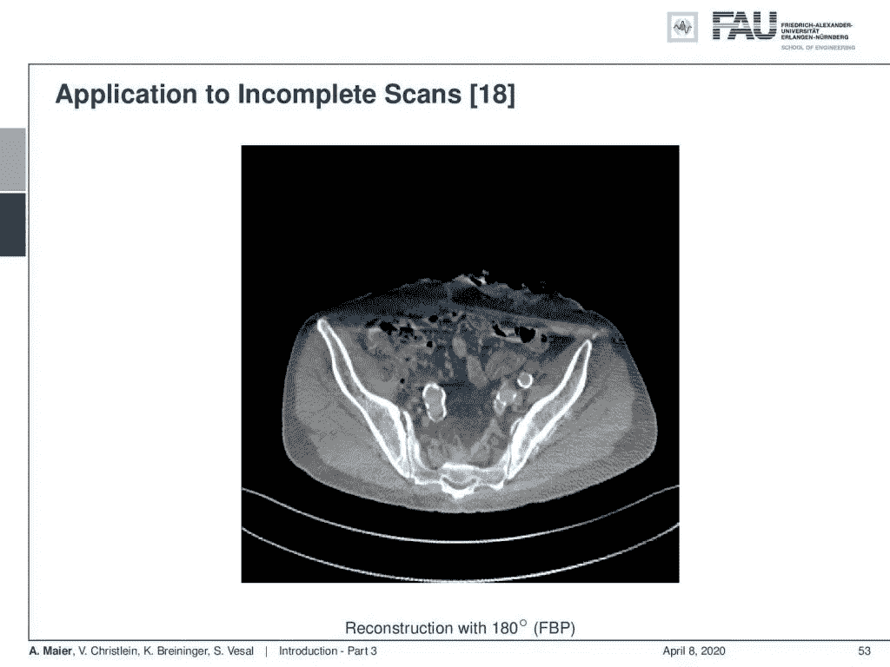

这个 CT 扫描只少了 20 度的旋转。 [CC 下的图片来自](https://creativecommons.org/licenses/by/4.0/)[深度学习讲座](https://www.youtube.com/watch?v=p-_Stl0t3kU&list=PLpOGQvPCDQzvgpD3S0vTy7bJe2pf_yJFj&index=1)的 4.0 。

现在，如果你把你的重建算法转换成一个神经网络，并用一些训练数据重新训练它。这里只有 15 幅图像，您可以看到，即使在看不见的数据上，我们也能够恢复大部分丢失的信息:

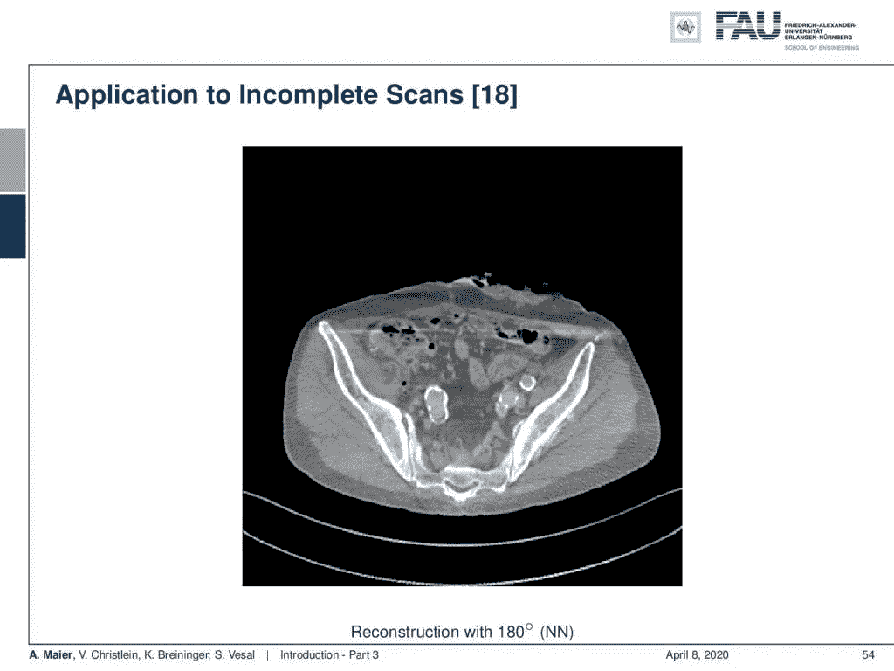

已知的 CT 重建能够补偿丢失的 20 度旋转。来自[深度学习讲座](https://www.youtube.com/watch?v=p-_Stl0t3kU&list=PLpOGQvPCDQzvgpD3S0vTy7bJe2pf_yJFj&index=1)的 [CC BY 4.0](https://creativecommons.org/licenses/by/4.0/) 下的图片。

现在，如果你看这张图片的顶部，你可以看到质量减少了。我们显示了右侧左图中红线后的线图:

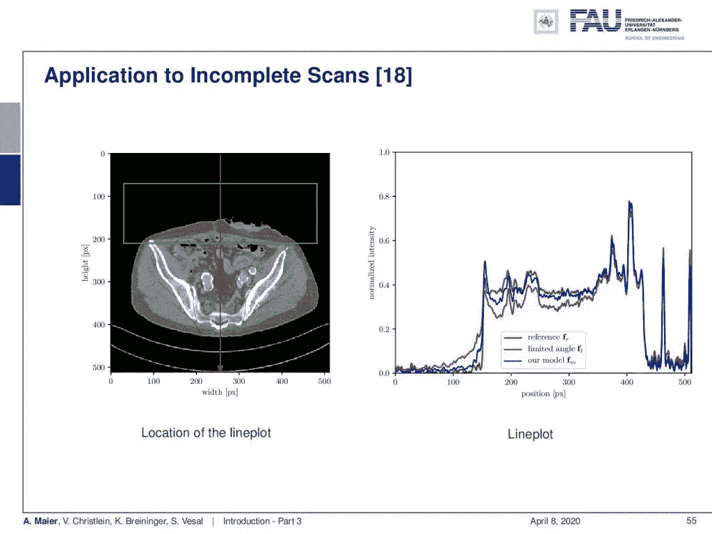

不同 CT 重建的线轮廓比较。 [CC 下的图片来自](https://creativecommons.org/licenses/by/4.0/)[深度学习讲座](https://www.youtube.com/watch?v=p-_Stl0t3kU&list=PLpOGQvPCDQzvgpD3S0vTy7bJe2pf_yJFj&index=1)的 4.0 。

现在这里是绿色，你可以看到基本上没有受到影响的参考图像。一旦引入角度限制，就会出现红色曲线，在图像的顶部显示这些伪像。现在，如果你进一步采取我们的深度学习方法，你会得到蓝色曲线，这大大减少了角度和限制带来的问题。现在，有趣的部分是因为我们的算法受到了传统 CT 重建算法的启发，所有这些层都有解释:它们与特定的功能相关联。在如此短的扫描中，你通常会做什么，就是对测量了两次的射线进行加权，这样相对的射线正好加在一起。

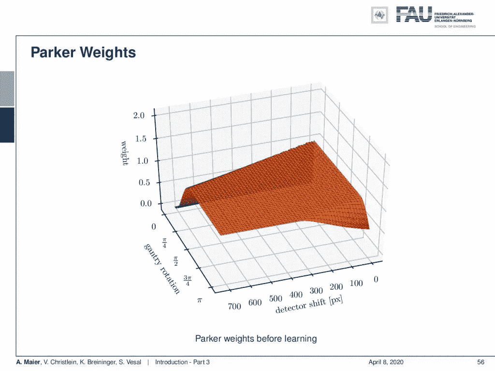

用于网络初始化的经典 Parker 权重。来自[深度学习讲座](https://www.youtube.com/watch?v=p-_Stl0t3kU&list=PLpOGQvPCDQzvgpD3S0vTy7bJe2pf_yJFj&index=1)的 4.0CC 下的图片。

你可以看到图中帕克的体重。现在，如果我们训练我们的算法，主要的变化是帕克权重。发生的情况是，我们可以看到重量的增加，特别是在训练后穿过具有角度限制的区域的光线中:

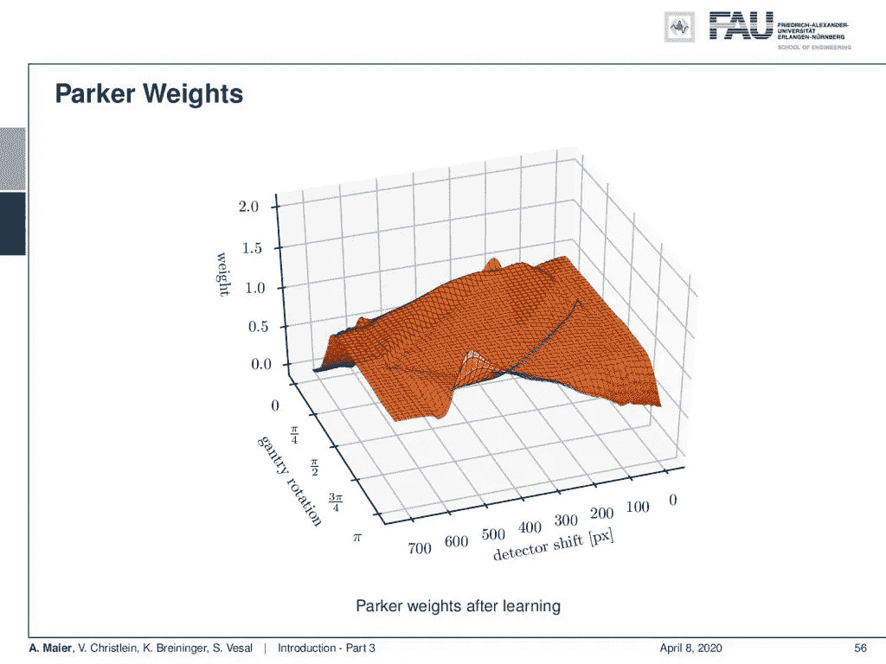

训练算法后的冗余权重。 [CC 下的图片来自](https://creativecommons.org/licenses/by/4.0/)[深度学习讲座](https://www.youtube.com/watch?v=p-_Stl0t3kU&list=PLpOGQvPCDQzvgpD3S0vTy7bJe2pf_yJFj&index=1)的 4.0 。

因此，网络学会了在那些没有被测量的射线中使用来自稍微不同方向的信息。你甚至可以继续，然后将这种重建方法与额外的去条纹和去噪步骤结合起来，我们将在这节课结束时展示。因此，我们也可以在低对比度信息中显著改善。

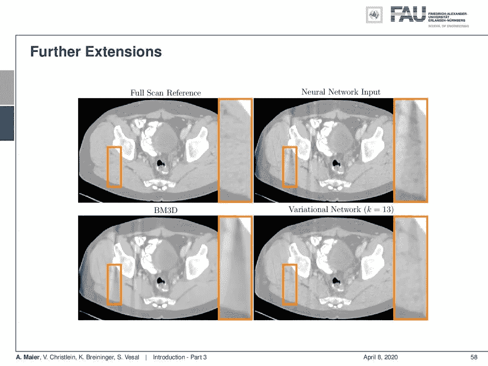

额外的去条纹和去噪声进一步改善了重建。来自[深度学习讲座](https://www.youtube.com/watch?v=p-_Stl0t3kU&list=PLpOGQvPCDQzvgpD3S0vTy7bJe2pf_yJFj&index=1)的 [CC BY 4.0](https://creativecommons.org/licenses/by/4.0/) 下的图片。

在这里，您可以在左上角看到全扫描参考的图像，在右上角看到仍有明显条纹的神经网络输出，在右下角，您可以看到条纹减少网络。它能够真正减少那些由角度限制引起的条纹。与左下方的去噪方法相比，您可以看到这些条纹会减少，但仍然存在。只有这样一个训练有素的方法，了解问题是什么，实际上能够有效地减少那些伪像。

在这个深度学习讲座中，更多令人兴奋的事情即将到来。 [CC 下的图片来自](https://creativecommons.org/licenses/by/4.0/)[深度学习讲座](https://www.youtube.com/watch?v=p-_Stl0t3kU&list=PLpOGQvPCDQzvgpD3S0vTy7bJe2pf_yJFj&index=1)的 4.0 。

所以下一次在深度学习中，我们想看看基本的模式识别和机器学习。有哪些基本规则，这与深度学习有什么关系？然后，我们想继续讨论感知器，它是神经网络的基本单元。从这些感知器，你可以建立那些真正的深度网络，我们一直在这个和以前的视频中。所以，我希望你喜欢这个视频，如果你下次收听的话，那就太好了。谢谢大家！

如果你喜欢这篇文章，你可以在这里找到更多的文章，或者看看我们的讲座。如果你想在未来了解更多的文章、视频和研究，我也会很感激你在 YouTube、Twitter、脸书、LinkedIn 上的鼓掌或关注。本文以 [Creative Commons 4.0 归属许可](https://creativecommons.org/licenses/by/4.0/deed.de)发布，如果引用，可以转载和修改。

# 参考

[1]大卫·西尔弗、朱利安·施利特维泽、卡伦·西蒙扬等，“在没有人类知识的情况下掌握围棋”。载于:自然 550.7676 (2017)，第 354 页。
【2】David Silver，Thomas Hubert，Julian Schrittwieser 等《用通用强化学习算法通过自玩掌握国际象棋和松木》。载于:arXiv 预印本 arXiv:1712.01815 (2017)。
[3] M. Aubreville，M. Krappmann，C. Bertram 等，“一种用于组织学细胞分化的导向空间转换器网络”。载于:ArXiv 电子版(2017 年 7 月)。arXiv: 1707.08525 [cs。简历】。
[4]大卫·伯内克、克里斯蒂安·里斯、伊里·安杰罗普洛斯等，“利用天空图像进行连续短期辐照度预报”。载于:太阳能 110 (2014)，第 303–315 页。
【5】Patrick Ferdinand Christ，Mohamed Ezzeldin A Elshaer，Florian Ettlinger 等，“使用级联全卷积神经网络和 3D 条件随机场在 CT 中自动分割肝脏和病灶”。国际医学图像计算和计算机辅助施普林格会议。2016 年，第 415–423 页。
[6] Vincent Christlein，David Bernecker，Florian hnig 等，“使用 GMM 超向量和样本支持向量机进行作家识别”。载于:《模式识别》63 期(2017)，第 258–267 页。
[7]弗罗林·克里斯蒂安·盖苏，波格丹一世·乔格斯库，托马索·曼西等，“医学图像中解剖标志检测的人工代理”。发表于:医学图像计算和计算机辅助介入——MICCAI 2016。雅典，2016 年，第 229-237 页。
[8]贾登，魏东，理查德·索彻等，“Imagenet:一个大规模的层次化图像数据库”。载于:计算机视觉和模式识别，2009 年。CVPR 2009。IEEE 会议。2009 年，第 248-255 页。
[9]卡帕斯和飞飞。“用于生成图像描述的深层视觉语义对齐”。载于:ArXiv 电子版(2014 年 12 月)。arXiv: 1412.2306 [cs。简历】。
[10]亚历克斯·克里热夫斯基、伊利亚·苏茨基弗和杰弗里·E·辛顿。“使用深度卷积神经网络的 ImageNet 分类”。神经信息处理系统进展 25。柯伦咨询公司，2012 年，第 1097-1105 页。
【11】Joseph Redmon，Santosh Kumar Divvala，Ross B. Girshick 等《你只看一次:统一的、实时的物体检测》。载于:CoRR abs/1506.02640 (2015 年)。
[12] J .雷德蒙和 a .法尔哈迪。YOLO9000:更好、更快、更强。载于:ArXiv 电子版(2016 年 12 月)。arXiv: 1612.08242 [cs。简历】。
[13]约瑟夫·雷德蒙和阿里·法尔哈迪。“YOLOv3:增量改进”。In: arXiv (2018)。
[14]弗兰克·罗森布拉特。感知器——感知和识别自动机。85–460–1.康奈尔航空实验室，1957 年。
[15] Olga Russakovsky，Jia Deng，苏浩等，“ImageNet 大规模视觉识别挑战赛”。载于:《国际计算机视觉杂志》115.3 (2015)，第 211–252 页。
【16】David Silver，Aja Huang，Chris J .等《用深度神经网络和树搜索掌握围棋博弈》。载于:《自然》杂志 529.7587 期(2016 年 1 月)，第 484–489 页。
[17] S. E. Wei，V. Ramakrishna，T. Kanade 等，“卷积姿态机器”。在 CVPR。2016 年，第 4724–4732 页。
【18】Tobias würfl，Florin C Ghesu，Vincent Christlein，等《深度学习计算机断层成像》。国际医学图像计算和计算机辅助斯普林格国际出版会议。2016 年，第 432–440 页。