# 简介—第 4 部分

> 原文：<https://towardsdatascience.com/lecture-notes-in-deep-learning-introduction-part-4-2e86af0498ce?source=collection_archive---------58----------------------->

## [FAU 讲座笔记](https://towardsdatascience.com/tagged/fau-lecture-notes)深度学习

## 模式识别短期课程

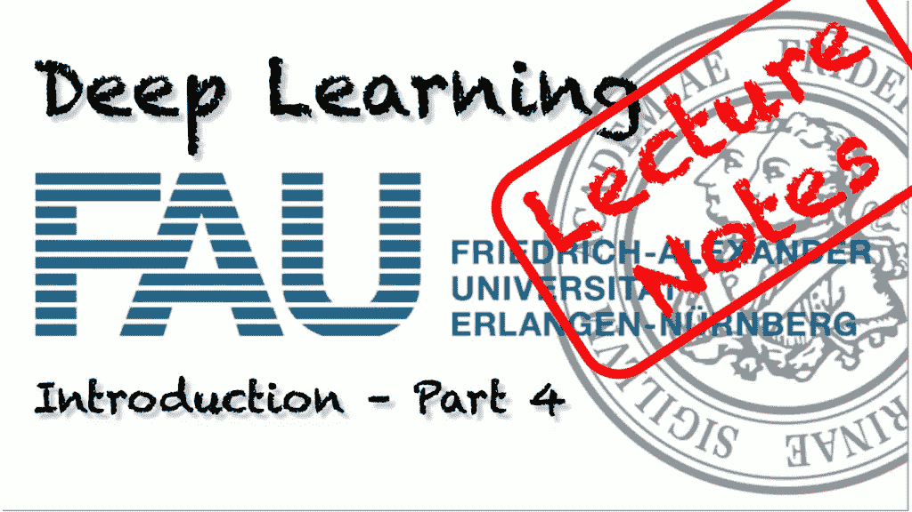

FAU 大学的深度学习。来自[深度学习讲座](https://www.youtube.com/watch?v=p-_Stl0t3kU&list=PLpOGQvPCDQzvgpD3S0vTy7bJe2pf_yJFj&index=1)的 [CC BY 4.0](https://creativecommons.org/licenses/by/4.0/) 下的图片。

**这些是 FAU 的 YouTube 讲座** [**深度学习**](https://www.youtube.com/watch?v=p-_Stl0t3kU&list=PLpOGQvPCDQzvgpD3S0vTy7bJe2pf_yJFj&index=1) **的讲义。这是与幻灯片匹配的讲座视频&的完整抄本。我们希望，你喜欢这个视频一样多。当然，这份抄本是用深度学习技术在很大程度上自动创建的，只进行了少量的手动修改。如果你发现了错误，请告诉我们！**

# 航行

[**上一讲**](/lecture-notes-in-deep-learning-introduction-part-3-22142caad28a) **/** [**观看本视频**](https://www.youtube.com/watch?v=DjP_EAM3m-4) **/** [**顶级**](/all-you-want-to-know-about-deep-learning-8d68dcffc258) **/** [**下一讲**](/lecture-notes-in-deep-learning-introduction-part-5-a3b9faacd313#0c90-5c848b8a66e)

欢迎来到我们的深度学习讲座。我们现在在引言的第 4 部分。现在，在第四条道路上，我们想谈谈机器学习和模式识别，首先我们必须介绍一些术语和符号。

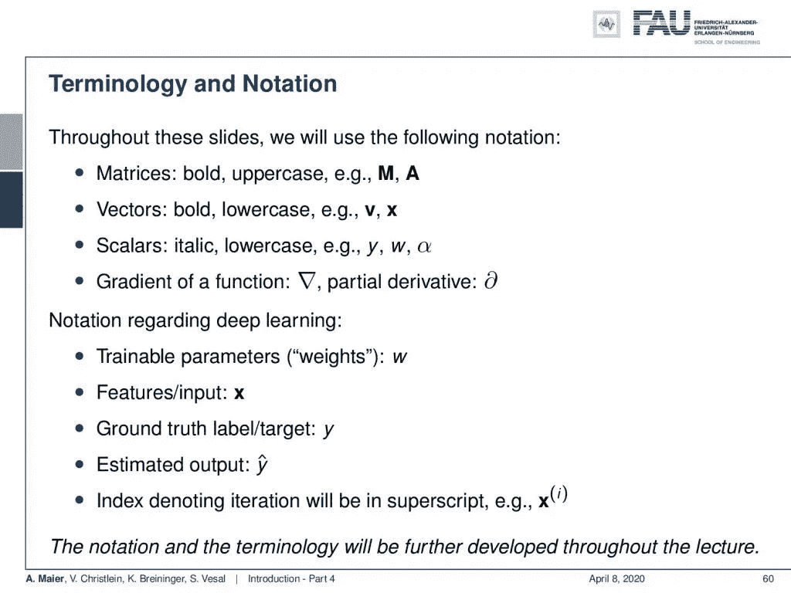

这节课的注释。 [CC 下的图片来自](https://creativecommons.org/licenses/by/4.0/)[深度学习讲座](https://www.youtube.com/watch?v=p-_Stl0t3kU&list=PLpOGQvPCDQzvgpD3S0vTy7bJe2pf_yJFj&index=1)的 4.0 。

所以，在整个系列讲座中，我们将使用下面的符号:矩阵是粗体大写的。所以，这里的例子有 **M** 和 **A** 。向量是粗体的，小写的例子有 **v** 和 **x** 。标量是斜体和小写的:y，w，α。对于函数的梯度，我们使用梯度符号∇，对于偏导数，我们使用偏导数符号∂.此外，我们有一些关于深度学习的细节。因此，可训练权重通常称为 w。特征或输入为 **x** 。它们是典型的向量。然后，我们有基本事实标签，即 y。我们有一些估计输出，即 y hat，如果我们有一些迭代正在进行，我们通常在上标上，并将其放入括号中。这里是一个迭代索引:变量 **x** 的迭代 I。当然，这是一个非常粗略的符号，我们将在整个讲座中进一步发展它。

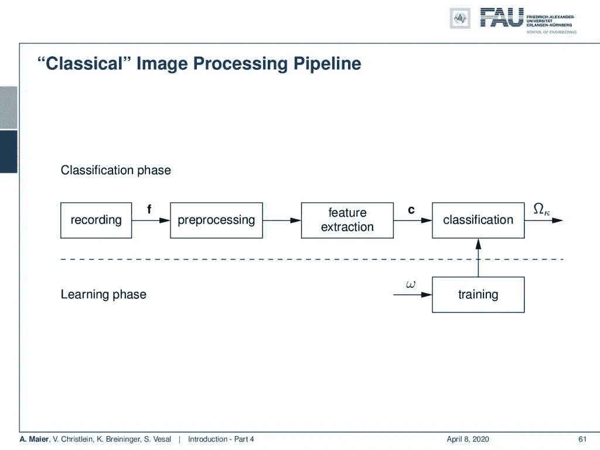

经典图像处理流水线。来自[深度学习讲座](https://www.youtube.com/watch?v=p-_Stl0t3kU&list=PLpOGQvPCDQzvgpD3S0vTy7bJe2pf_yJFj&index=1)的 4.0CC 下的图片。

如果你听过我们组以前的讲座，那么你应该知道模式识别的经典图像处理流水线。它通过采样进行记录，然后进行模数转换。然后是预处理、特征提取和分类。当然，在分类这一步，你还得做训练。模式识别管道的第一部分将在我们的讲座[介绍模式识别](https://www5.informatik.uni-erlangen.de/lectures/ws-1314/introduction-to-pattern-recognition-intropr/)中介绍。分类的主要部分包含在[模式识别](https://www.video.uni-erlangen.de/course/id/173)中。

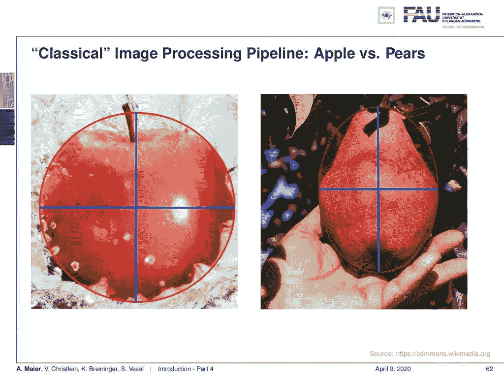

经典特征提取。下图 [CC BY 4.0](https://creativecommons.org/licenses/by/4.0/) 来自[深度学习讲座](https://www.youtube.com/watch?v=p-_Stl0t3kU&list=PLpOGQvPCDQzvgpD3S0vTy7bJe2pf_yJFj&index=1)。

现在，你在这幅图像中看到的是一个经典的图像识别问题。比方说，你想区分苹果和梨。现在，你可以做的一个想法是，你可以围绕它们画一个圆，然后测量长轴和短轴的长度。所以，你会认出苹果是圆的，梨更长。所以，它们的椭圆在长轴和短轴上有所不同。

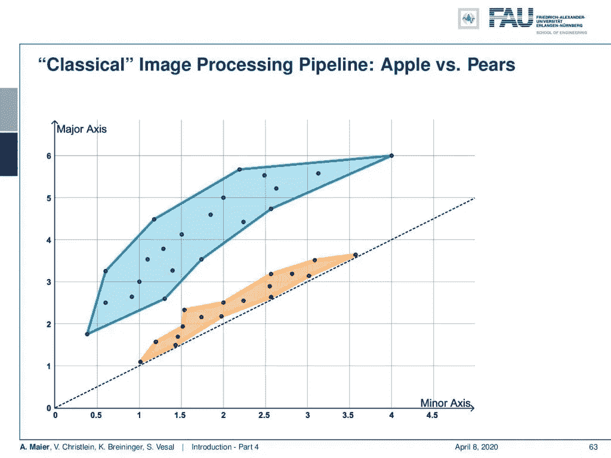

向量空间中的苹果和梨。 [CC 下的图片来自](https://creativecommons.org/licenses/by/4.0/)[深度学习讲座](https://www.youtube.com/watch?v=p-_Stl0t3kU&list=PLpOGQvPCDQzvgpD3S0vTy7bJe2pf_yJFj&index=1)的 4.0 。

现在，你可以把这两个数字表示成一个向量值。然后，你进入一个二维空间，这基本上是一个向量空间表示，你会发现所有的苹果都位于 x 轴的对角线上。如果它们的直径和一个方向增加，另一个方向的直径也增加。你的梨偏离了这条直线，因为它们的短轴和长轴不同。现在，你可以找到一条线把这两者分开，这就是你的第一个分类系统。

现在，许多人对大数据处理如何工作的看法显示在[这个小图](https://xkcd.com/1838/)中:

> *“那么，这是你的机器学习系统？”*
> 
> *“是的，把数据倒入这一大堆线性代数中，然后收集另一边的答案。”*
> 
> *“如果答案是错的呢？”*
> 
> “搅拌这堆东西，直到它们看起来合适为止！”
> 
> [*KXCD 机器学习*](https://xkcd.com/1838/)

所以，你可以在这张图中看到，当然这是许多人认为他们接近深度学习的方式。你只需将数据输入，最后你只需稍微搅拌一下，就能得到正确的结果。

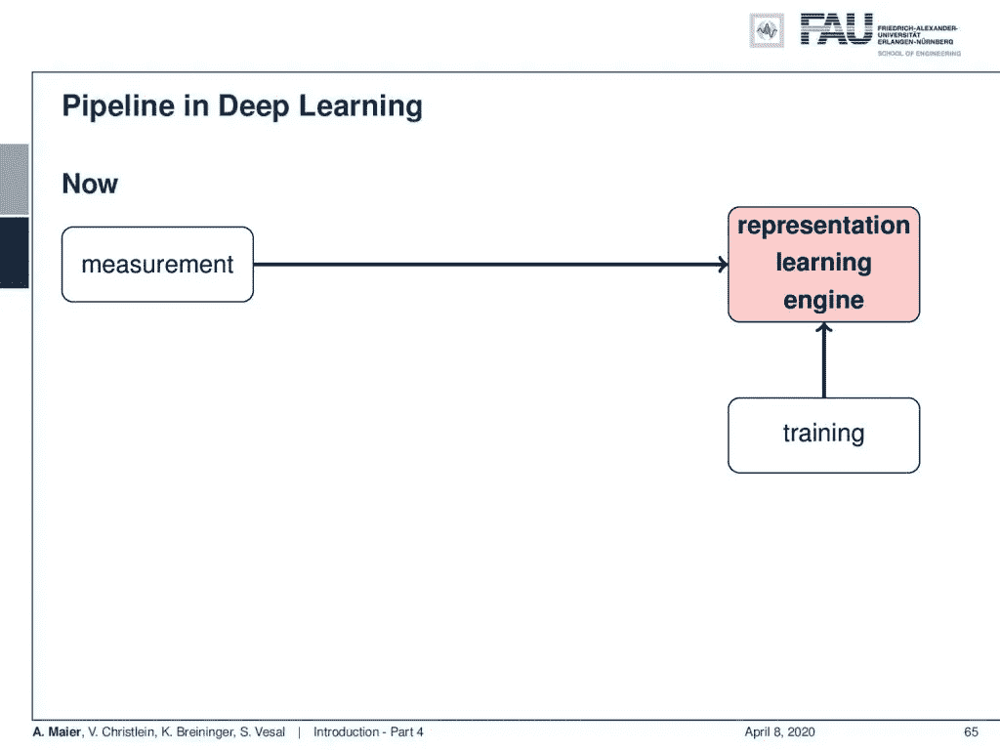

深度学习中的管道。 [CC 下的图片来自](https://creativecommons.org/licenses/by/4.0/)[深度学习讲座](https://www.youtube.com/watch?v=p-_Stl0t3kU&list=PLpOGQvPCDQzvgpD3S0vTy7bJe2pf_yJFj&index=1)的 4.0 。

但实际上并不是这样。提醒他们你想做的是你想建立一个学习分类的系统。这意味着从你的测量你首先要做一些预处理，如减少噪音。你必须得到一幅有意义的图像，然后进行特征提取，从中你可以进行分类。现在，与深度学习的不同之处在于，你把所有的东西都放在一个单一的引擎中。因此，预处理、特征提取和分类只需一步即可完成。你只需要使用训练数据和测量来产生那些系统。现在，这已被证明在许多应用中有效，但正如我们在上一个视频中已经讨论过的，您必须拥有正确的数据。你不能只是倒入一些数据，然后搅拌，直到它开始看起来正确。你必须有一个适当的数据集，一个适当的数据收集，如果你没有以适当的方式这样做，你只会得到废话。

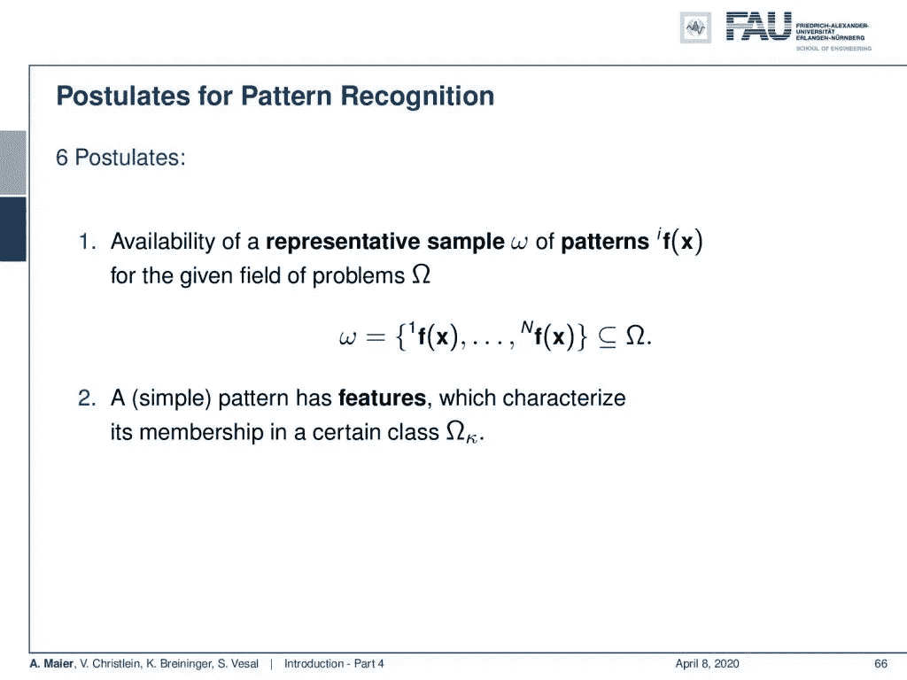

模式识别的前两个假设。 [CC 下的图片来自](https://creativecommons.org/licenses/by/4.0/)[深度学习讲座](https://www.youtube.com/watch?v=p-_Stl0t3kU&list=PLpOGQvPCDQzvgpD3S0vTy7bJe2pf_yJFj&index=1)的 4.0 。

当然，我们有几个假设，这些假设也适用于深度学习领域。所以在经典模式识别中，我们遵循这些假设。所以，第一个假设是，有代表性的抽样模式的可变性，这些抽样模式在课堂和问题域ω中给出。这里，您有所有这些类别的培训示例，它们具有代表性。所以，这意味着如果你有一个新的观察，它将与你已经收集的那些模式相似。下一个假设是，存在一个简单模式，这个简单模式具有一些特征，这些特征描述了某个类的成员资格。所以，你必须能够以某种方式处理数据，从而得到这个抽象的表示。有了这种表示，您就可以在分类器中派生出类。

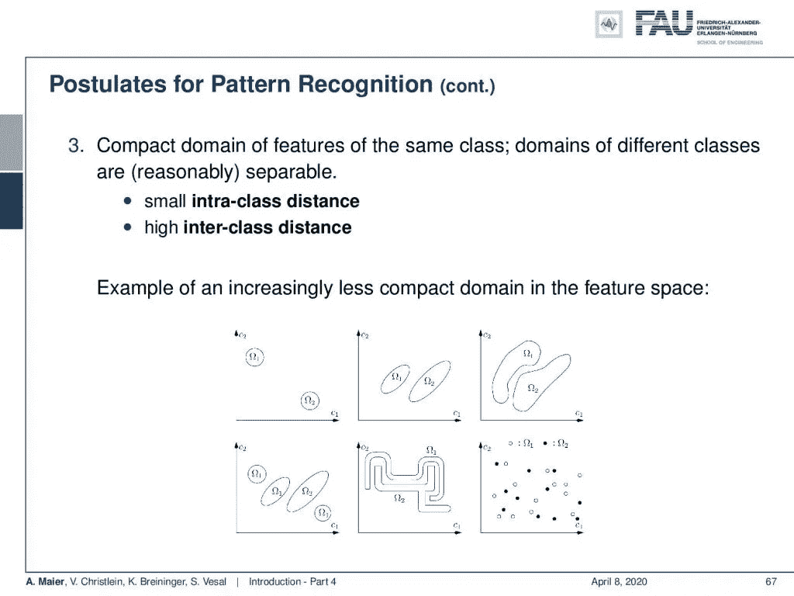

模式识别的公设 3。来自[深度学习讲座](https://www.youtube.com/watch?v=p-_Stl0t3kU&list=PLpOGQvPCDQzvgpD3S0vTy7bJe2pf_yJFj&index=1)的 [CC BY 4.0](https://creativecommons.org/licenses/by/4.0/) 下的图片。

此外，同一类的特征在特征域中应该是紧凑的。所以，这意味着不同类的特征，它们应该与其他类分开，而同一类的特征应该彼此靠近。因此，理想情况下，你需要的是较小的组内方差和较大的组间距离。此图中显示了一些示例。所以左上角是一个非常简单的例子。中间那个也是可解的。第三个变得更难，当然，你仍然可以用一个非线性的边界把它们分开。左下角的情况更复杂，因为这里的类是混杂的，你需要在这些类周围画出区域。它们也可能非常紧密地交织在一起，但仍然是可分的，当然，你可能会有数据，但很难弄清楚哪一部分属于哪一部分。通常情况下，如果您遇到像右下方这样的情况，您没有一个非常好的特征表示，您需要考虑是否没有找到更好的特征。今天许多人做的是他们只是说:“哦，让我们去深度学习，只是学习一个合适的表示，然后就可以了。”

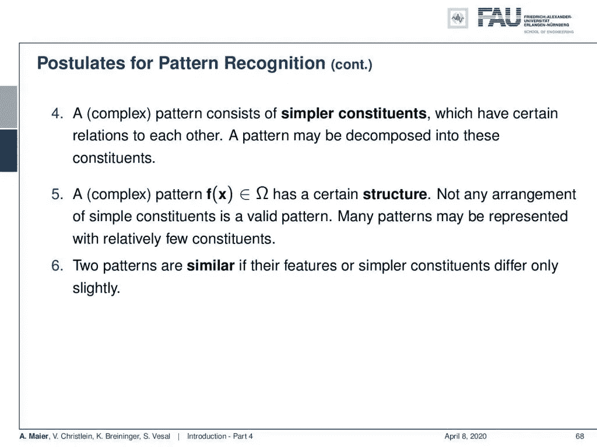

模式识别排在#4 到#6 之后。 [CC 下的图片来自](https://creativecommons.org/licenses/by/4.0/)[深度学习讲座](https://www.youtube.com/watch?v=p-_Stl0t3kU&list=PLpOGQvPCDQzvgpD3S0vTy7bJe2pf_yJFj&index=1)的 4.0 。

因此，一个复杂的模式由彼此之间有一定关系的简单成分组成，并且该模式可以被分解成这些部分。此外，复杂的图案具有特定的结构，并且不是每个简单部分的排列都给出有效的图案，并且许多图案可以用相对较少的部分来表示。当然，如果简单零件的特征仅略有不同，则两种模式是相似的。看到模式识别的这些基本假设后，我们将看到其中许多仍然适用于深度学习的世界。然而，我们看不到事物是如何分解的。相反，我们建立系统来逐渐简化输入，这样你就可以将它们分解成部分和更好的表示。

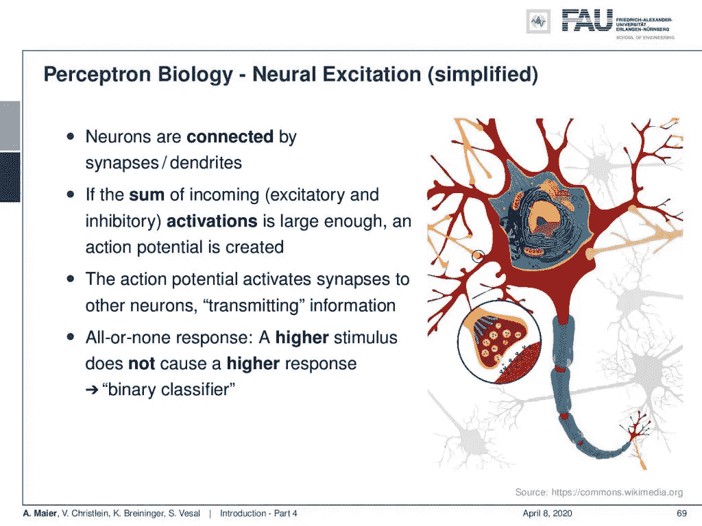

生物神经元。来自[深度学习讲座](https://www.youtube.com/watch?v=p-_Stl0t3kU&list=PLpOGQvPCDQzvgpD3S0vTy7bJe2pf_yJFj&index=1)的 [CC BY 4.0](https://creativecommons.org/licenses/by/4.0/) 下的图片。

现在，让我们从最基本的开始。感知器是大多数神经网络中的基本单元，也是人们对感知器非常感兴趣的原因。实际上，当罗森布拉特在 20 世纪 50 年代介绍它们的时候，人们真的很兴奋，因为罗森布拉特把这种感知机和生物神经元很好地联系在一起。现在，一个生物神经元通过突触与其他神经元相连，并计算传入的兴奋性和抑制性激活的总和。如果它们足够大，那么神经元就会放电，如果你有某个超过阈值的电位，它就会放电。然后，它传递信息，这是典型的全有或全无反应，这意味着如果你有一个更高的刺激，你超过了阈值，这并不意味着它会引起更高的反应。它要么开火，要么不开火。所以它本质上是一个二元分类器。

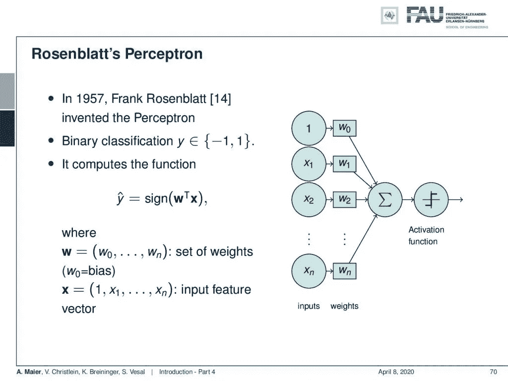

感知。 [CC 下的图片来自](https://creativecommons.org/licenses/by/4.0/)[深度学习讲座](https://www.youtube.com/watch?v=p-_Stl0t3kU&list=PLpOGQvPCDQzvgpD3S0vTy7bJe2pf_yJFj&index=1)的 4.0 。

这个概念可以很容易地转换成矢量表示。他设计了一个系统，输入向量由输入值 x₁到 x_n 指定，然后加上一个偏差。在这里，你把它们乘以权重，然后加起来。然后，你有一个激活函数，要么激活，要么不激活，这里为了简单起见，我们可以简单地用符号函数。所以，如果你有一个积极的激活，你就发射。如果你有一个负面的激活，你不会开枪。这可以用符号函数来表示。现在，这导致了一个相当有问题的训练程序。

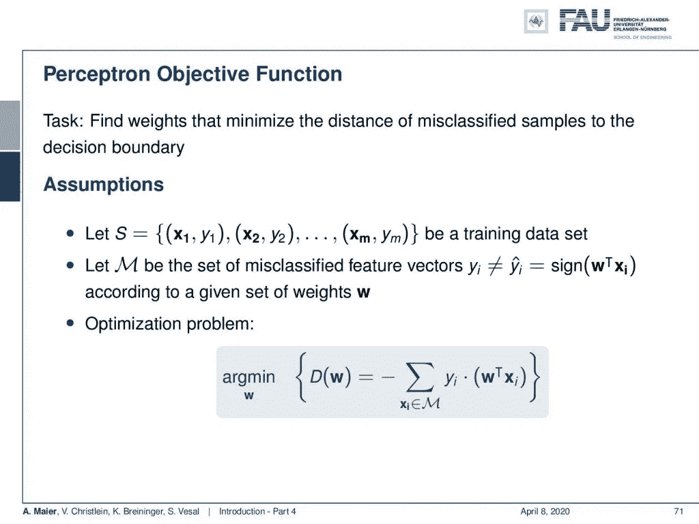

分类器训练的感知器目标函数。来自[深度学习讲座](https://www.youtube.com/watch?v=p-_Stl0t3kU&list=PLpOGQvPCDQzvgpD3S0vTy7bJe2pf_yJFj&index=1)的 [CC BY 4.0](https://creativecommons.org/licenses/by/4.0/) 下的图片。

当然，如果你想训练，你需要有各自类的观察元组。这是你的训练数据集，然后你需要确定误分类特征向量的集合 M。这些向量中，预测的数字 y 和实际的类成员 yᵢ.不匹配如果你计算神经元的输出。现在，如果你有这个集合 M，它必须在训练迭代的每一步之后被确定，那么你试图最小化下面的优化问题:描述你的错误分类的问题本质上是所有你的错误分类样本的总和，其中你计算你的实际神经元的输出。然后乘以真实的类成员。因为两者不匹配，意味着这一定是负的。然后，将上述项乘以负 1，以便为大量错误分类创建一个高值。你试图将这一项最小化。

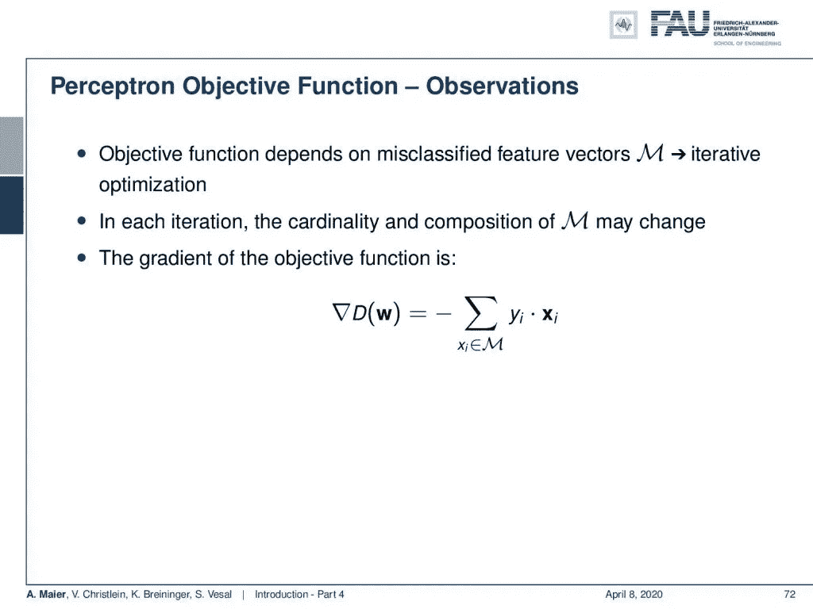

感知器权重更新程序。 [CC 下的图片来自](https://creativecommons.org/licenses/by/4.0/)[深度学习讲座](https://www.youtube.com/watch?v=p-_Stl0t3kU&list=PLpOGQvPCDQzvgpD3S0vTy7bJe2pf_yJFj&index=1)的 4.0 。

这基本上导致了一个优化过程，你有一个迭代过程。因此，这种迭代优化必须为权重确定更新的梯度步长。一旦更新了权重，就必须再次确定错误分类的向量集。现在的问题是，在每一次迭代中，M 的组合基数可能会改变，因为每一步你都会有更多的错误分类。你实际上计算的是函数相对于权重的梯度，它只是输入向量乘以正确的类减一。这会给你一个重量的更新。

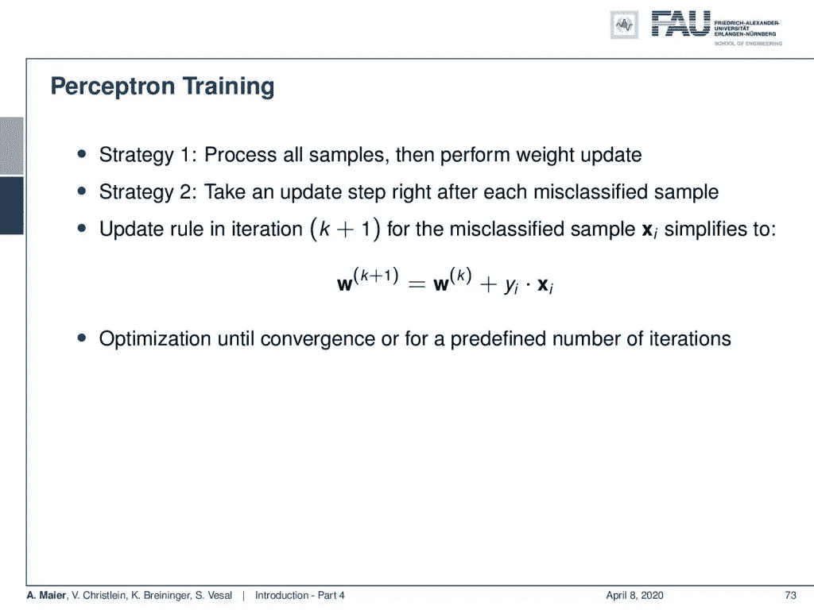

感知学习的权重更新策略。来自[深度学习讲座](https://www.youtube.com/watch?v=p-_Stl0t3kU&list=PLpOGQvPCDQzvgpD3S0vTy7bJe2pf_yJFj&index=1)的 [CC BY 4.0](https://creativecommons.org/licenses/by/4.0/) 下的图片。

现在，如果您计算这个梯度，策略 1 将处理所有样本，然后执行权重更新。策略 2 是在每个丢失的分类样本之后采取更新步骤，然后直接更新权重。因此，每次迭代都有一个更新规则，简化为:旧的权重加上错误分类的样本乘以类成员。这给了你新的权重。现在，您优化到收敛或预定义的迭代次数。这个非常简单的程序有许多缺点，我们将在本课程的稍后部分讨论。

在这个深度学习讲座中，更多令人兴奋的事情即将到来。 [CC 下的图片来自](https://creativecommons.org/licenses/by/4.0/)[深度学习讲座](https://www.youtube.com/watch?v=p-_Stl0t3kU&list=PLpOGQvPCDQzvgpD3S0vTy7bJe2pf_yJFj&index=1)的 4.0 。

所以，在下节课中，如果你想获得一个证书，我们想看看几个重要的组织事项。此外，我们将对您到目前为止看过的四个视频进行一个简短的总结。希望你喜欢这个视频，希望下次再见！

如果你喜欢这篇文章，你可以在这里找到[更多的文章](https://medium.com/@akmaier)，在这里找到更多关于机器学习的教育材料[，或者看看我们的](https://lme.tf.fau.de/teaching/free-deep-learning-resources/)[深度](https://www.youtube.com/watch?v=p-_Stl0t3kU&list=PLpOGQvPCDQzvgpD3S0vTy7bJe2pf_yJFj) [学习](https://www.youtube.com/watch?v=p-_Stl0t3kU&list=PLpOGQvPCDQzvgpD3S0vTy7bJe2pf_yJFj&index=1) [讲座](https://www.youtube.com/watch?v=p-_Stl0t3kU&list=PLpOGQvPCDQzvgpD3S0vTy7bJe2pf_yJFj)。如果你想在未来了解更多的文章、视频和研究，我也会很感激你在 YouTube、Twitter、脸书、LinkedIn 或 T21 上的掌声或关注。本文以 [Creative Commons 4.0 归属许可](https://creativecommons.org/licenses/by/4.0/deed.de)发布，如果引用，可以转载和修改。

# 参考

[1]大卫·西尔弗、朱利安·施利特维泽、卡伦·西蒙扬等，“在没有人类知识的情况下掌握围棋”。载于:自然 550.7676 (2017)，第 354 页。
【2】David Silver，Thomas Hubert，Julian Schrittwieser 等《用通用强化学习算法通过自玩掌握国际象棋和松木》。载于:arXiv 预印本 arXiv:1712.01815 (2017)。
[3] M. Aubreville，M. Krappmann，C. Bertram 等，“一种用于组织学细胞分化的导向型空间转换器网络”。载于:ArXiv 电子版(2017 年 7 月)。arXiv: 1707.08525 [cs。简历】。
[4]大卫·伯内克、克里斯蒂安·里斯、伊里·安杰罗普洛斯等，“利用天空图像进行连续短期辐照度预报”。载于:太阳能 110 (2014)，第 303–315 页。
【5】Patrick Ferdinand Christ，Mohamed Ezzeldin A Elshaer，Florian Ettlinger 等，“使用级联全卷积神经网络和 3D 条件随机场在 CT 中自动分割肝脏和病灶”。国际医学图像计算和计算机辅助施普林格会议。2016 年，第 415–423 页。
[6] Vincent Christlein，David Bernecker，Florian hnig 等，“使用 GMM 超向量和样本支持向量机进行作家识别”。载于:《模式识别》63 期(2017)，第 258–267 页。
[7]弗罗林·克里斯蒂安·盖苏，波格丹一世·乔格斯库，托马索·曼西等，“医学图像中解剖标志检测的人工代理”。发表于:医学图像计算和计算机辅助介入——MICCAI 2016。雅典，2016 年，第 229-237 页。
[8]贾登，魏东，理查德·索彻等，“Imagenet:一个大规模的层次化图像数据库”。载于:计算机视觉和模式识别，2009 年。CVPR 2009。IEEE 会议。2009 年，第 248-255 页。
[9]卡帕斯和飞飞。“用于生成图像描述的深层视觉语义对齐”。载于:ArXiv 电子版(2014 年 12 月)。arXiv: 1412.2306 [cs。简历】。
[10]亚历克斯·克里热夫斯基、伊利亚·苏茨基弗和杰弗里·E·辛顿。“使用深度卷积神经网络的 ImageNet 分类”。神经信息处理系统进展 25。柯伦咨询公司，2012 年，第 1097-1105 页。
【11】Joseph Redmon，Santosh Kumar Divvala，Ross B. Girshick 等《你只看一次:统一的、实时的物体检测》。载于:CoRR abs/1506.02640 (2015 年)。
[12] J .雷德蒙和 a .法尔哈迪。YOLO9000:更好、更快、更强。载于:ArXiv 电子版(2016 年 12 月)。arXiv: 1612.08242 [cs。简历】。
[13]约瑟夫·雷德蒙和阿里·法尔哈迪。“YOLOv3:增量改进”。In: arXiv (2018)。
[14]弗兰克·罗森布拉特。感知器——感知和识别自动机。85–460–1.康奈尔航空实验室，1957 年。
[15] Olga Russakovsky，Jia Deng，苏浩等，“ImageNet 大规模视觉识别挑战赛”。载于:《国际计算机视觉杂志》115.3 (2015)，第 211–252 页。
【16】David Silver，Aja Huang，Chris J .等《用深度神经网络和树搜索掌握围棋博弈》。载于:《自然》杂志 529.7587 期(2016 年 1 月)，第 484–489 页。
[17] S. E. Wei，V. Ramakrishna，T. Kanade 等，“卷积姿态机器”。在 CVPR。2016 年，第 4724–4732 页。
【18】Tobias würfl，Florin C Ghesu，Vincent Christlein，等《深度学习计算机断层成像》。国际医学图像计算和计算机辅助斯普林格国际出版会议。2016 年，第 432–440 页。