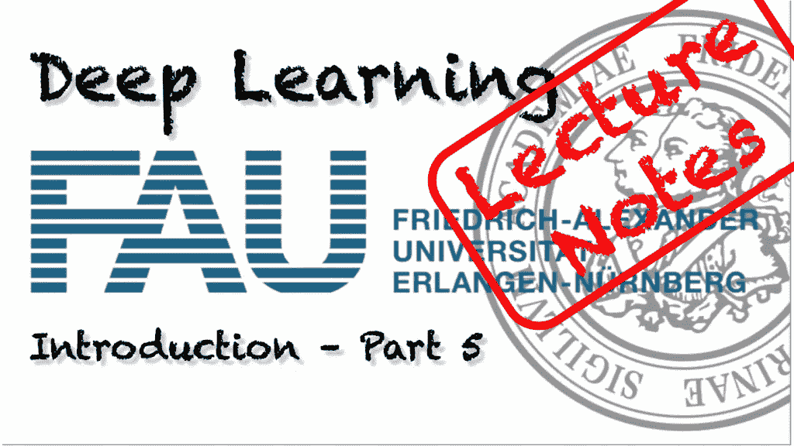
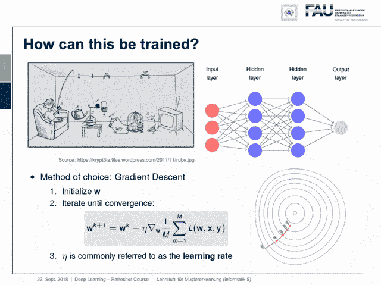
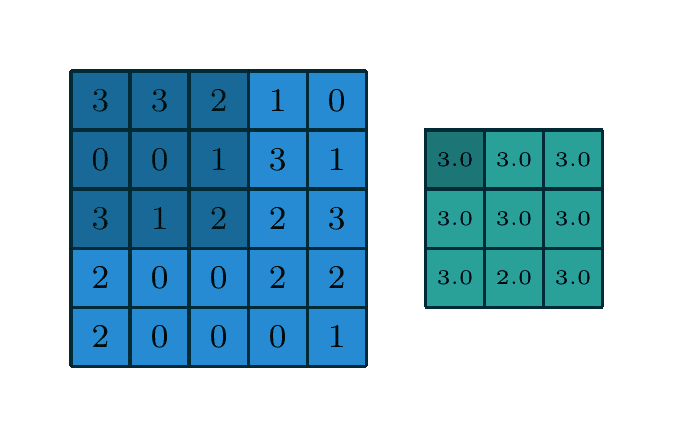

# 简介—第 5 部分

> 原文：<https://towardsdatascience.com/lecture-notes-in-deep-learning-introduction-part-5-a3b9faacd313?source=collection_archive---------41----------------------->

## [FAU 讲座笔记](https://towardsdatascience.com/tagged/fau-lecture-notes)深度学习

## 练习与展望

FAU 大学的深度学习。来自[深度学习讲座](https://www.youtube.com/watch?v=p-_Stl0t3kU&list=PLpOGQvPCDQzvgpD3S0vTy7bJe2pf_yJFj&index=1)的 [CC BY 4.0](https://creativecommons.org/licenses/by/4.0/) 下的图片。

**这些是 FAU 的 YouTube 讲座** [**深度学习**](https://www.youtube.com/watch?v=p-_Stl0t3kU&list=PLpOGQvPCDQzvgpD3S0vTy7bJe2pf_yJFj&index=1) **的讲义。这是与幻灯片匹配的讲座视频&的完整抄本。我们希望，你喜欢这个视频一样多。当然，这份抄本是用深度学习技术在很大程度上自动创建的，只进行了少量的手动修改。如果你发现了错误，请告诉我们！**

# 航行

[**上一讲**](/lecture-notes-in-deep-learning-introduction-part-4-2e86af0498ce) **/** [**观看本视频**](https://www.youtube.com/watch?v=j-iETTS_cwc) **/** [**顶级**](/all-you-want-to-know-about-deep-learning-8d68dcffc258) **/** [**下一讲**](/lecture-notes-in-deep-learning-feedforward-networks-part-1-e74db01e54a8)

一种快进到逐层的反向传播。别担心，我们会解释所有的细节。 [CC 下的图片来自](https://creativecommons.org/licenses/by/4.0/)[深度学习讲座](https://www.youtube.com/watch?v=p-_Stl0t3kU&list=PLpOGQvPCDQzvgpD3S0vTy7bJe2pf_yJFj&index=1)的 4.0 。

感谢再次收听，欢迎来到深度学习！在这个小视频中，我们将了解组织事项并结束介绍。那么，让我们来看看组织事项。现在，你能在 FAU 这里得到的模块总共由五个 ECTS 组成。这是讲课加练习。所以，仅仅观看所有这些视频是不够的，你必须通过练习。在练习中，您将使用 Python 实现我们在这里讨论的所有内容。我们将从零开始，所以你将实现感知器神经网络，直到深度学习。最终，我们甚至会朝着 GPU 实现和大型深度学习框架前进。所以，这是必修部分，仅仅通过口试是不够的。

我们还将在练习中实现最大池。 [CC 下的图片来自](https://creativecommons.org/licenses/by/4.0/)[深度学习讲座](https://www.youtube.com/watch?v=p-_Stl0t3kU&list=PLpOGQvPCDQzvgpD3S0vTy7bJe2pf_yJFj&index=1)的 4.0 。

练习的内容是 Python。如果你从未使用过 python，你将对它做一个介绍，因为 Python 是深度学习实现今天使用的主要语言之一。你真的会从零开始开发一个神经网络。会有前馈神经网络，会有卷积神经网络。您将研究正则化技术，以及如何实际调整权重，使它们具有特定的属性。你将会看到如何用某些或正则化技术来克服过度拟合。当然，我们也将实现循环网络。稍后，我们将使用 Python 框架并将其用于大规模分类。对于这些练习，您应该具备 Python 和 NumPy 的基础知识。你应该了解矩阵乘法等线性代数。图像处理是一个明确的优势。你应该知道如何处理图像——当然——这门课的要求是模式识别基础知识，并且你已经参加过模式识别的其他课程。如果您还没有，您可能需要参考其他参考资料才能跟上这个课程。

你应该对这门课的练习编码充满热情。照片由[马库斯·斯皮斯克](https://www.pexels.com/@markusspiske?utm_content=attributionCopyText&utm_medium=referral&utm_source=pexels)从[派克斯](https://www.pexels.com/photo/working-pattern-internet-abstract-1089438/?utm_content=attributionCopyText&utm_medium=referral&utm_source=pexels)拍摄。

你应该带着对编码的热情，你必须做很多编码，但是你也可以在练习中学习。如果你在这门课之前没有做过大量的编程工作，你会在练习上花很多时间。但是如果你完成了这些练习，你将能够在深度学习框架中实现一些东西，这是非常好的训练。学完本课程后，您不仅可以从 GitHub 下载代码并在自己的数据上运行，还可以:

*   你也了解网络的内部运作，
*   如何编写自己的层和
*   如何在非常低的水平上扩展深度学习算法。

在本课程的练习中，你也将有机会使用真正的大数据集。图片由 Marc Aubreville 提供。点击查看[完整视频。](https://www.youtube.com/watch?v=1UV1_a5qyQM)

所以，注意细节，如果你不太习惯编程，这将花费一些时间。整个学期将有五次练习。除了最后一个练习，所有的练习都有单元测试。因此，这些单元测试应该可以帮助你实现，在最后一个练习中，将有一个 PyTorch 实现，你将面临一个挑战:你必须解决图像识别任务，以便通过练习。截止日期在各自的练习环节中公布。所以，你必须在[学生宿舍](https://www.studon.fau.de/studon/ilias.php?baseClass=ilrepositorygui&reloadpublic=1&cmd=frameset&ref_id=1)为他们注册。

到目前为止，我们在讲座中看到的是，深度学习越来越多地出现在日常生活中。所以，这不仅仅是研究中的一项技术。我们已经看到这种技术真正出现在许多不同的应用中，从语音识别、图像处理等等到自动驾驶。这是一个非常活跃的研究领域。如果你在做这个讲座，你已经为与我们的实验室或行业或其他合作伙伴的研究项目做了很好的准备。

在这个深度学习讲座中，更多令人兴奋的事情即将到来。来自[深度学习讲座](https://www.youtube.com/watch?v=p-_Stl0t3kU&list=PLpOGQvPCDQzvgpD3S0vTy7bJe2pf_yJFj&index=1)的 [CC BY 4.0](https://creativecommons.org/licenses/by/4.0/) 下的图片。

到目前为止，我们研究了感知机及其与生物神经元的关系。所以，下一次关于深度学习，我们将从下一节课开始，这意味着，我们将把感知器扩展为通用函数逼近器。我们将研究这些模型的基于梯度的训练算法，然后我们还将研究梯度的有效计算。

现在，如果你想准备口语考试，最好想几个综合问题。问题可能是

*   "模式识别的六个假设是什么？"
*   "什么是感知器目标函数？"
*   “你能说出深度学习成功解决的三个应用吗？”

当然，我们还有很多进一步的阅读材料。所以你可以在幻灯片上找到链接，我们也会在这篇文章下面贴上链接和参考资料。

如果你有任何问题，

*   你可以在练习中请教老师，
*   你可以给我发邮件，
*   或者如果你正在 youtube 上看这个，你可以使用评论功能提出你的问题。

所以，有很多联系方式，当然，我们有很多前五个视频的参考资料。现在阅读它们太快了，但你可以暂停视频，然后查看它们，我们也会在这篇文章下面的参考资料中发布这些参考资料。所以，我希望你喜欢这个视频，下次在深度学习中再见！

注意:FAU 的练习材料很广泛。为了了解我们的练习，我们在 GitHub **上创建了** [**这些例子。完整的锻炼计划目前只对 FAU 的学生开放。如果您对 GitHub 上的练习以外的其他练习感兴趣，请联系我。**](https://github.com/kbreininger/tutorial-dlframework)

如果你喜欢这篇文章，你可以在这里找到更多的文章，或者看看我们的讲座。如果你想在未来了解更多的文章、视频和研究，我也会很感激你在 YouTube、Twitter、脸书、LinkedIn 上的鼓掌或关注。本文以 [Creative Commons 4.0 归属许可](https://creativecommons.org/licenses/by/4.0/deed.de)发布，如果引用，可以转载和修改。

# 参考

[1]大卫·西尔弗、朱利安·施利特维泽、卡伦·西蒙扬等，“在没有人类知识的情况下掌握围棋”。载于:自然 550.7676 (2017)，第 354 页。
【2】David Silver，Thomas Hubert，Julian Schrittwieser 等《用通用强化学习算法通过自玩掌握国际象棋和松木》。载于:arXiv 预印本 arXiv:1712.01815 (2017)。
[3] M. Aubreville，M. Krappmann，C. Bertram 等，“一种用于组织学细胞分化的导向空间转换器网络”。载于:ArXiv 电子版(2017 年 7 月)。arXiv: 1707.08525 [cs。简历】。
[4]大卫·伯内克、克里斯蒂安·里斯、伊里·安杰罗普洛斯等，“利用天空图像进行连续短期辐照度预报”。载于:太阳能 110 (2014)，第 303–315 页。
【5】Patrick Ferdinand Christ，Mohamed Ezzeldin A Elshaer，Florian Ettlinger 等，“使用级联全卷积神经网络和 3D 条件随机场在 CT 中自动分割肝脏和病灶”。国际医学图像计算和计算机辅助施普林格会议。2016 年，第 415–423 页。
[6] Vincent Christlein，David Bernecker，Florian hnig 等，“使用 GMM 超向量和样本支持向量机进行作家识别”。载于:《模式识别》63 期(2017)，第 258–267 页。
[7]弗罗林·克里斯蒂安·盖苏，波格丹一世·乔格斯库，托马索·曼西等，“医学图像中解剖标志检测的人工代理”。发表于:医学图像计算和计算机辅助介入——MICCAI 2016。雅典，2016 年，第 229-237 页。
[8]贾登，魏东，理查德·索彻等，“Imagenet:一个大规模的层次化图像数据库”。载于:计算机视觉和模式识别，2009 年。CVPR 2009。IEEE 会议。2009 年，第 248-255 页。
[9]卡帕斯和飞飞。“用于生成图像描述的深层视觉语义对齐”。载于:ArXiv 电子版(2014 年 12 月)。arXiv: 1412.2306 [cs。简历】。
[10]亚历克斯·克里热夫斯基、伊利亚·苏茨基弗和杰弗里·E·辛顿。“使用深度卷积神经网络的 ImageNet 分类”。神经信息处理系统进展 25。柯伦咨询公司，2012 年，第 1097-1105 页。
【11】Joseph Redmon，Santosh Kumar Divvala，Ross B. Girshick 等《你只看一次:统一的、实时的物体检测》。载于:CoRR abs/1506.02640 (2015 年)。
[12] J .雷德蒙和 a .法尔哈迪。YOLO9000:更好、更快、更强。载于:ArXiv 电子版(2016 年 12 月)。arXiv: 1612.08242 [cs。简历】。
[13]约瑟夫·雷德蒙和阿里·法尔哈迪。“YOLOv3:增量改进”。In: arXiv (2018)。
[14]弗兰克·罗森布拉特。感知器——感知和识别自动机。85–460–1.康奈尔航空实验室，1957 年。
[15] Olga Russakovsky，Jia Deng，苏浩等，“ImageNet 大规模视觉识别挑战赛”。载于:《国际计算机视觉杂志》115.3 (2015)，第 211–252 页。
【16】David Silver，Aja Huang，Chris J .等《用深度神经网络和树搜索掌握围棋博弈》。载于:《自然》杂志 529.7587 期(2016 年 1 月)，第 484–489 页。
[17] S. E. Wei，V. Ramakrishna，T. Kanade 等，“卷积姿态机器”。在 CVPR。2016 年，第 4724–4732 页。
【18】Tobias würfl，Florin C Ghesu，Vincent Christlein，等《深度学习计算机断层成像》。国际医学图像计算和计算机辅助斯普林格国际出版会议。2016 年，第 432–440 页。