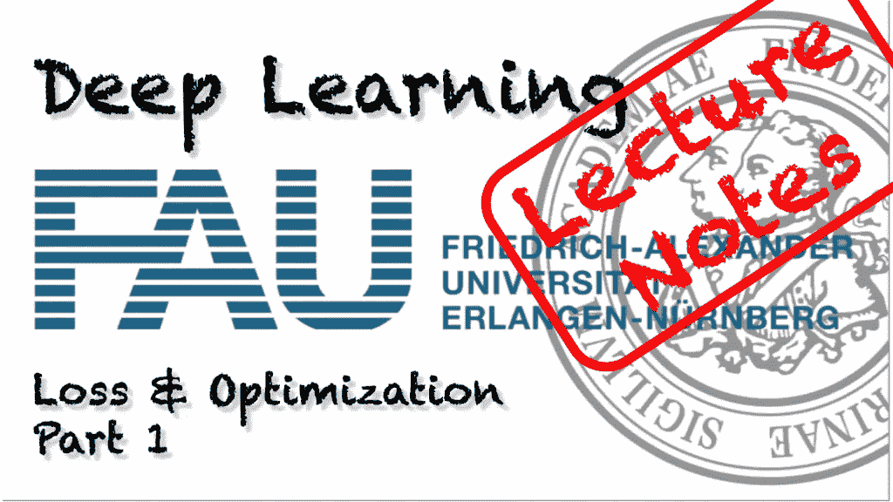
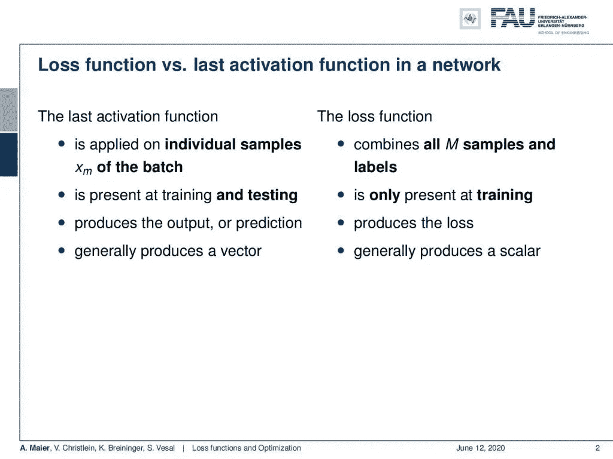
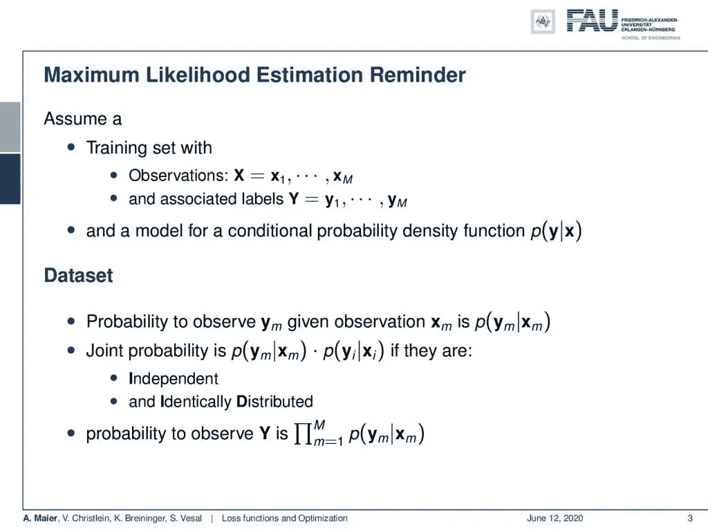
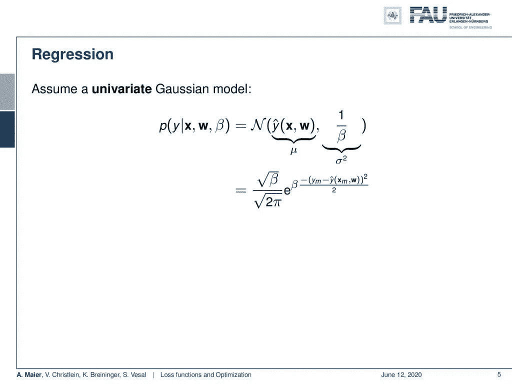
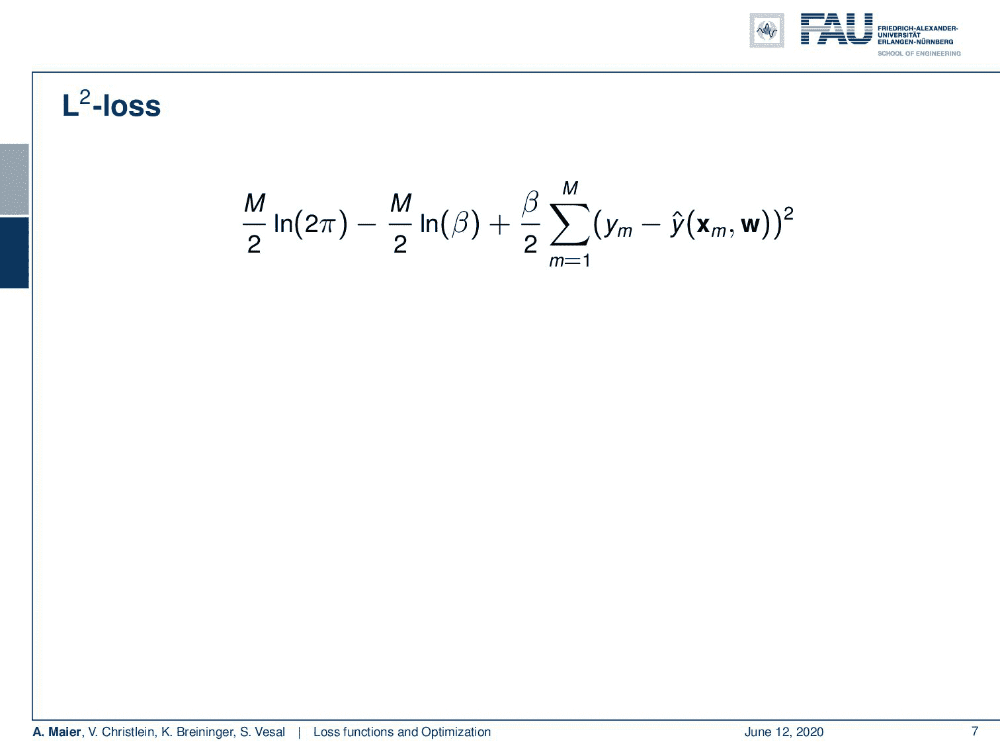
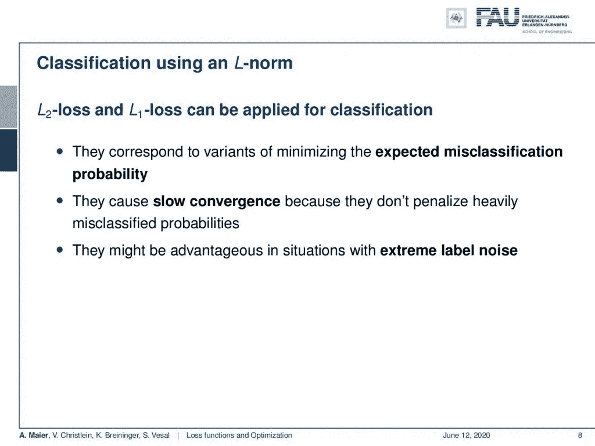
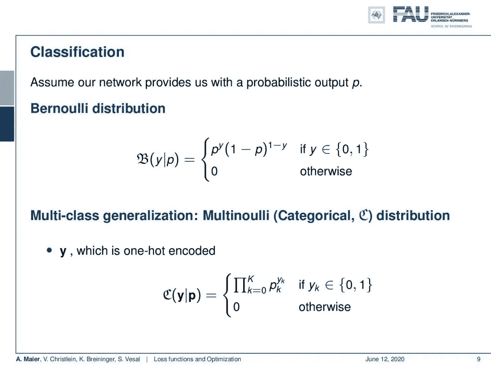
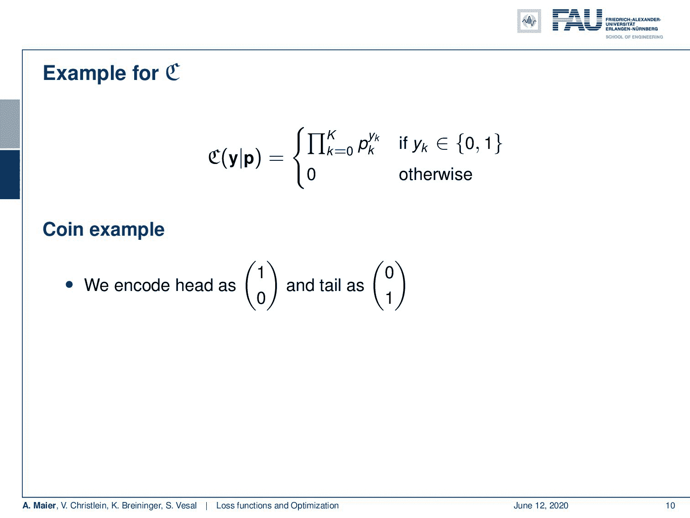
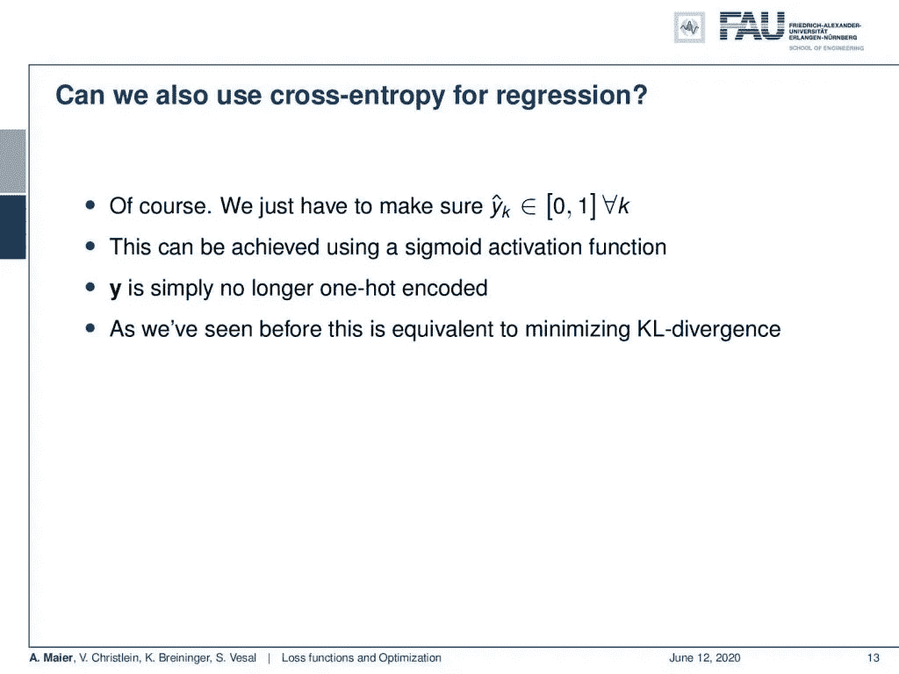

# 损失和优化—第 1 部分

> 原文：<https://towardsdatascience.com/lecture-notes-in-deep-learning-loss-and-optimization-part-1-f702695cbd99?source=collection_archive---------64----------------------->

## [FAU 讲座笔记](https://towardsdatascience.com/tagged/fau-lecture-notes)深度学习

## 分类和回归损失

FAU 大学的深度学习。下图 [CC BY 4.0](https://creativecommons.org/licenses/by/4.0/) 来自[深度学习讲座](https://www.youtube.com/watch?v=p-_Stl0t3kU&list=PLpOGQvPCDQzvgpD3S0vTy7bJe2pf_yJFj&index=1)

**这些是 FAU 的 YouTube 讲座** [**深度学习**](https://www.youtube.com/watch?v=p-_Stl0t3kU&list=PLpOGQvPCDQzvgpD3S0vTy7bJe2pf_yJFj&index=1) **的讲义。这是与幻灯片匹配的讲座视频&的完整抄本。我们希望，你喜欢这个视频一样多。当然，这份抄本是用深度学习技术在很大程度上自动创建的，只进行了少量的手动修改。如果你发现了错误，请告诉我们！**

# 航行

[**上一讲**](/lecture-notes-in-deep-learning-feedforward-networks-part-4-65593eb14aed) **/** [**观看本视频**](https://youtu.be/PYClfq-lR_w) **/** [**顶级**](/all-you-want-to-know-about-deep-learning-8d68dcffc258) **/** [**下一讲**](/lecture-notes-in-deep-learning-loss-and-optimization-part-2-11b08f842aa7)

欢迎大家来深度学习！所以，今天我们想继续讨论不同的损失和优化。我们想继续讨论这些有趣问题的更多细节。先说损失函数吧。损失函数通常用于不同的任务，不同的任务有不同的损失函数。

分类和回归是深度学习的两个常见任务。 [CC 下的图片来自](https://creativecommons.org/licenses/by/4.0/)[深度学习讲座](https://www.youtube.com/watch?v=p-_Stl0t3kU&list=PLpOGQvPCDQzvgpD3S0vTy7bJe2pf_yJFj&index=1)的 4.0 。

我们面临的两个最重要的任务是回归和分类。因此，在分类中，您希望为每个输入估计一个离散变量。这意味着你要在左边的两类问题中决定它是蓝点还是红点。所以，你需要建立一个决策边界的模型。

在回归中，想法是你想要建模一个解释你的数据的函数。所以，你有一些输入函数，比如说 x₂，你想用它来预测 x₁。为此，您需要计算一个函数，该函数将为任何给定的 x₂.生成适当的 x₁值在这个例子中，你可以看到这是一个直线拟合。

损失函数和最后激活函数之间的差异很重要。 [CC 下的图片来自](https://creativecommons.org/licenses/by/4.0/)[深度学习讲座](https://www.youtube.com/watch?v=p-_Stl0t3kU&list=PLpOGQvPCDQzvgpD3S0vTy7bJe2pf_yJFj&index=1)的 4.0 。

我们讨论了激活函数，最后一次激活为 softmax，以及交叉熵损失。不知何故，我们把它们结合起来，很明显，我们网络中最后一个激活函数和损失函数是不同的。最后一个激活函数应用于每批中的单个样品 x。它也会在培训和测试时出现。因此，最后一个激活函数将成为网络的一部分，并保留在那里以产生输出/预测。它通常会产生一个矢量。

现在，损失函数结合了所有 M 个样本和标签。在它们的组合中，它们产生了一个损失，这个损失描述了拟合度有多好。因此，它只在训练期间出现，损失通常是一个标量值，描述拟合的好坏。所以，你只在训练时间需要它。

大多数训练损失与使用最大似然估计的概率解释有关。来自[深度学习讲座](https://www.youtube.com/watch?v=p-_Stl0t3kU&list=PLpOGQvPCDQzvgpD3S0vTy7bJe2pf_yJFj&index=1)的 [CC BY 4.0](https://creativecommons.org/licenses/by/4.0/) 下的图片。

有趣的是，许多损失函数可以放在一个概率框架中。这就导致了最大似然估计。在最大似然估计中——提醒一下——我们认为一切都是概率性的。因此，我们有一组观察值 **X** ，它们由单独的观察值组成。然后，我们有相关的标签。它们也来源于某种分布，观察值表示为 **Y** 。当然，我们需要一个条件概率密度函数来描述 **y** 和 **x** 之间的关系。特别是，在给定一些观察值 **x** 的情况下，我们可以计算出 **y** 的概率。这将是非常有用的，例如，如果我们想决定一个特定的类。现在，我们必须以某种方式模拟这个数据集。它们是从一些分布中提取的，然后给定数据集的联合概率可以作为单个条件概率的乘积来计算。当然，如果它们是独立的，并且分布相同，您可以简单地将它们作为整个训练数据集的大型产品。所以，你得到了所有 M 个样本的乘积，这只是条件的乘积。这很有用，因为我们可以通过最大化整个训练数据集的联合概率来确定最佳参数。我们必须通过评估这个大型产品来完成。

负对数似然将乘积转换成总和，最大值转换成最小值。来自[深度学习讲座](https://www.youtube.com/watch?v=p-_Stl0t3kU&list=PLpOGQvPCDQzvgpD3S0vTy7bJe2pf_yJFj&index=1)的 4.0CC 下的图片。

现在，这个大型产品有几个问题。特别是，如果我们有高值和低值，它们可能会很快抵消掉。因此，将整个问题转换到对数域可能会很有趣。因为对数是一个单调的变换，它不会改变最大值的位置。因此，我们可以使用对数函数和负号将最大化转化为最小化。我们可以不看似然函数，而是看负对数似然函数。然后，我们的大乘积突然变成了所有观测值的和乘以条件概率的负对数。

让我们假设一个单变量高斯模型作为统计基础。 [CC 下的图片来自](https://creativecommons.org/licenses/by/4.0/)[深度学习讲座](https://www.youtube.com/watch?v=p-_Stl0t3kU&list=PLpOGQvPCDQzvgpD3S0vTy7bJe2pf_yJFj&index=1)的 4.0 。

现在，我们可以看看单变量高斯模型。现在我们又是一维的，可以用正态分布来建模，然后选择网络的输出作为期望值，1/β作为标准差。如果我们这样做，我们可以找到以下公式:β的平方根除以 2π的平方根乘以负β的指数函数乘以标签减去对 2 的幂的预测除以 2。

只需几个步骤，我们就可以转换高斯分布的对数似然。来自[深度学习讲座](https://www.youtube.com/watch?v=p-_Stl0t3kU&list=PLpOGQvPCDQzvgpD3S0vTy7bJe2pf_yJFj&index=1)的 [CC BY 4.0](https://creativecommons.org/licenses/by/4.0/) 下的图片。

好的，让我们继续，把它放进我们的对数似然函数。记住这是真的东西，你应该在口语考试中知道。每个人都需要知道正态分布，每个人都需要能够将这种宇宙高斯分布转换成损失函数。如果我们这样做，你会看到我们可以使用对数。它非常方便，因为它允许我们在这里分割产品。然后，我们还看到对数与指数函数相抵消。我们简单地得到这个β乘以 2 乘以 y 下标 m 减去 y hat 下标 m 的 2 次方。我们可以通过应用对数并求出平方根 2π来进一步简化第一项。然后，我们看到前两项的和不依赖于 M，所以我们可以简单地乘以 M，以便去掉和，只将和移到最后一项。

最后，我们到达 L2 损失。 [CC 下的图片来自](https://creativecommons.org/licenses/by/4.0/)[深度学习讲座](https://www.youtube.com/watch?v=p-_Stl0t3kU&list=PLpOGQvPCDQzvgpD3S0vTy7bJe2pf_yJFj&index=1)的 4.0 。

现在，你可以看到，这里只有最后一部分实际上取决于 w。其他所有东西甚至都不包含 w。因此，如果我们寻求朝着 w 优化，我们可以简单地忽略前两部分。然后，我们只剩下右边的部分。你会看到，如果我们现在假设β为 1，我们最终得到的是 1/2，和是差的平方根。这正是 L2 的标准。如果你用向量符号来写，你会得到这个。当然，这相当于一个方差均匀的多维高斯分布。

其他 Lp 范数也可以作为损失函数。 [CC 下的图片来自](https://creativecommons.org/licenses/by/4.0/)[深度学习讲座](https://www.youtube.com/watch?v=p-_Stl0t3kU&list=PLpOGQvPCDQzvgpD3S0vTy7bJe2pf_yJFj&index=1)的 4.0 。

好吧，这不仅仅是 L2 的损失。L1 也有损失。所以，我们也可以替换它们，我们也会在几个视频中看到不同 L 范数的一些性质。这通常是一个非常好的方法，并且它对应于最小化预期的错误分类概率。这可能会导致收敛缓慢，因为它们不会惩罚严重的错误分类概率，但在极端的标签噪声中它们可能是有利的。

对于分类，我们假设分类分布。来自[深度学习讲座](https://www.youtube.com/watch?v=p-_Stl0t3kU&list=PLpOGQvPCDQzvgpD3S0vTy7bJe2pf_yJFj&index=1)的 [CC BY 4.0](https://creativecommons.org/licenses/by/4.0/) 下的图片。

现在，让我们假设我们想要分类。然后，我们的网络会给我们提供一些概率输出。比方说，我们只分为两类。然后，我们可以将它建模为伯努利分布，其中有 0 类和 1 类。当然另一类的概率简单来说就是一减 *p* 。这给了我们概率分布 *p* ʸ时报(1-p)⁻ʸ.通常，我们不会只有两个类。这意味着我们需要推广到多元或分类分布。那么 *y* 通常再次被建模为独热编码向量。然后，我们可以将分类分布记为所有类别的概率与基础事实标签的幂(零或一)的乘积。

分类分布的一个例子。 [CC 下的图片来自](https://creativecommons.org/licenses/by/4.0/)[深度学习讲座](https://www.youtube.com/watch?v=p-_Stl0t3kU&list=PLpOGQvPCDQzvgpD3S0vTy7bJe2pf_yJFj&index=1)的 4.0 。

让我们看一个分类分布的例子。我们想举的例子是伯努利试验，抛硬币。我们将头部编码为(1)0)ᵀ，尾部编码为(0)1)ᵀ.然后，我们有一个不公平的硬币，这个不公平的硬币偏好概率为 0.7 的尾部。头的可能性是 0.3。然后，我们观察到真正的标签 **y** 是尾部。现在，我们可以使用上面的等式，并插入那些观察值。这意味着我们得到 0.3 的 0 次方和 0.7 的 1 次方。某事物的 0 次方总是等于 1。那么 0.7 的 1 次方当然是 0.7。这给了我们 0.7，这意味着我们的不公平硬币观察到尾部的概率是 70%。

使用 softmax 函数，我们总是可以将任意比例的值转换为 0 和 1。这使得分类分布能够用作损失函数。来自[深度学习讲座](https://www.youtube.com/watch?v=p-_Stl0t3kU&list=PLpOGQvPCDQzvgpD3S0vTy7bJe2pf_yJFj&index=1)的 4.0CC 下的图片。

我们总是可以使用网络中的 softmax 函数将一切转换成概率。现在，我们可以看看这在我们的分类分布式系统中是如何表现的。这里，我们简单地用分类分布代替条件分布。这就给了我们一个负的对数似然函数。同样，我们在这里做的与口试高度相关。因此，每个人都应该能够解释如何利用分类分布，从概率假设得出相应的损失函数。所以在这里，我们再次应用负对数似然。我们插入分类分布的定义，它就是我们所有 y 下标 k 的乘积与基础真值标签的幂。这可以进一步简化，因为乘积可以通过移动对数转换成和。如果我们这样做，你可以看到地面真理标签的力量实际上可以拉到对数前面。我们看到我们最终得到了交叉熵。现在，如果您再次使用一键编码的技巧，您可以看到，我们最终会得到交叉熵损失，即整组观察值之和乘以输出的对数，正好是基本事实标签为 1 的位置。因此，我们忽略了类和中的所有其他项。

交叉熵及其与 KL 散度的关系。 [CC 下的图片来自](https://creativecommons.org/licenses/by/4.0/)[深度学习讲座](https://www.youtube.com/watch?v=p-_Stl0t3kU&list=PLpOGQvPCDQzvgpD3S0vTy7bJe2pf_yJFj&index=1)的 4.0 。

有趣的是，这也可以与 Kullback Leibler (KL)散度联系起来。KL 散度是一个非常常见的构造，你可以在许多机器学习论文中找到。在这里，你可以看到定义。本质上，我们在 x 的整个区域上有一个积分，它是对 p(x)乘以 p(x)的对数除以 q(x)的概率的积分。q(x)是要比较的参考分布。现在，您可以看到，您可以使用对数的属性将二者分成两部分。所以，我们得到了右手边的负部分，也就是交叉熵。左手边就是熵。因此，我们可以看到，这个训练过程本质上等同于最小化交叉熵。所以，为了最小化 KL 散度，我们可以最小化交叉熵。你应该记住，这种关系在机器学习论文中经常出现。所以，如果你把这些东西记在心里，你会发现它们更容易理解。

交叉熵的使用指南。来自[深度学习讲座](https://www.youtube.com/watch?v=p-_Stl0t3kU&list=PLpOGQvPCDQzvgpD3S0vTy7bJe2pf_yJFj&index=1)的 [CC BY 4.0](https://creativecommons.org/licenses/by/4.0/) 下的图片。

现在，我们可以用交叉熵进行回归吗？嗯，是的，我们当然能做到。但是你必须确保你的预测，对于所有的类，都在[0，1]的范围内。例如，您可以使用 sigmoid 激活函数来实现这一点。那么你必须小心，因为在回归中，通常你不再是一个热编码。所以，这是你必须妥善处理的事情。如前所述，这种损失相当于最小化 KL 发散。

本单元总结。 [CC 下的图片来自](https://creativecommons.org/licenses/by/4.0/)[深度学习讲座](https://www.youtube.com/watch?v=p-_Stl0t3kU&list=PLpOGQvPCDQzvgpD3S0vTy7bJe2pf_yJFj&index=1)的 4.0 。

让我们总结一下到目前为止我们所看到的。所以 L2 损失通常用于回归。交叉熵损失通常用于分类，通常与独热编码结合使用。当然，你可以从严格概率假设的最大似然估计中得到它们。所以我们现在做的完全符合概率论。在缺乏更多领域知识的情况下，这些是我们的首选。如果你有额外的领域知识，那么，当然，用它来构建一个更好的估算器是一个好主意。交叉熵损失本质上是多元的。所以，我们不仅仅被两类问题所困。我们也可以去多维回归和分类问题。

在这个深度学习讲座中，更多令人兴奋的事情即将到来。 [CC 下的图片来自](https://creativecommons.org/licenses/by/4.0/)[深度学习讲座](https://www.youtube.com/watch?v=p-_Stl0t3kU&list=PLpOGQvPCDQzvgpD3S0vTy7bJe2pf_yJFj&index=1)的 4.0 。

下一次在深度学习中，我们想深入一些关于损失函数的细节，特别是，我们想强调铰链损失。这是一个非常重要的损失函数，因为它允许您嵌入约束。我们将会看到，与经典的机器学习和模式识别也有一些关系，特别是支持向量机。所以我希望你喜欢这个视频，我期待着在下一个视频中见到你！

如果你喜欢这篇文章，你可以在这里找到更多的文章，或者看看我们的讲座。如果你想在未来了解更多的文章、视频和研究，我也会很感激你在 YouTube、Twitter、脸书、LinkedIn 上的鼓掌或关注。本文以 [Creative Commons 4.0 归属许可](https://creativecommons.org/licenses/by/4.0/deed.de)发布，如果引用，可以转载和修改。

# 参考

[1]克里斯托弗·贝肖普。模式识别和机器学习(信息科学和统计学)。美国新泽西州 Secaucus 出版社:纽约斯普林格出版社，2006 年。
[2]安娜·乔洛曼斯卡，米凯尔·赫纳夫，迈克尔·马修等人，“多层网络的损耗面”在:AISTATS。2015.
【3】Yann N Dauphin，Razvan Pascanu，卡格拉尔·古尔切赫勒等《高维非凸优化中鞍点问题的识别与攻击》。神经信息处理系统进展。2014 年，第 2933–2941 页。
[4]宜川唐。“使用线性支持向量机的深度学习”。载于:arXiv 预印本 arXiv:1306.0239 (2013 年)。
[5]萨尚克·雷迪、萨延·卡勒和桑基夫·库马尔。《论亚当和超越的趋同》。国际学习代表会议。2018.
[6] Katarzyna Janocha 和 Wojciech Marian Czarnecki。“分类中深度神经网络的损失函数”。载于:arXiv 预印本 arXiv:1702.05659 (2017)。
【7】Jeffrey Dean，Greg Corrado，Rajat Monga 等，《大规模分布式深度网络》。神经信息处理系统进展。2012 年，第 1223-1231 页。
[8]马人·马赫瑟雷奇和菲利普·亨宁。“随机优化的概率线搜索”。神经信息处理系统进展。2015 年，第 181–189 页。
【9】杰森·韦斯顿，克里斯·沃特金斯等《多类模式识别的支持向量机》在:ESANN。第 99 卷。1999 年，第 219-224 页。
[10]·张，Samy Bengio，Moritz Hardt 等，“理解深度学习需要反思泛化”。载于:arXiv 预印本 arXiv:1611.03530 (2016)。