# 损失和优化—第 2 部分

> 原文：<https://towardsdatascience.com/lecture-notes-in-deep-learning-loss-and-optimization-part-2-11b08f842aa7?source=collection_archive---------43----------------------->

## [FAU 讲座笔记](https://towardsdatascience.com/tagged/fau-lecture-notes)深度学习

## 支持向量机打败深度学习了吗？

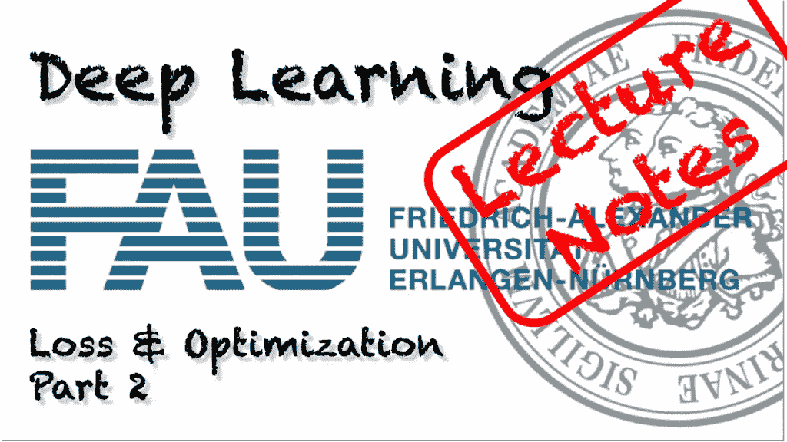

FAU 大学的深度学习。下图 [CC BY 4.0](https://creativecommons.org/licenses/by/4.0/) 来自[深度学习讲座](https://www.youtube.com/watch?v=p-_Stl0t3kU&list=PLpOGQvPCDQzvgpD3S0vTy7bJe2pf_yJFj&index=1)

**这些是 FAU 的 YouTube 讲座** [**深度学习**](https://www.youtube.com/watch?v=p-_Stl0t3kU&list=PLpOGQvPCDQzvgpD3S0vTy7bJe2pf_yJFj&index=1) **的讲义。这是与幻灯片匹配的讲座视频&的完整抄本。我们希望，你喜欢这个视频一样多。当然，这份抄本是用深度学习技术在很大程度上自动创建的，只进行了少量的手动修改。如果你发现了错误，请告诉我们！**

# 航行

[**上一讲**](/lecture-notes-in-deep-learning-loss-and-optimization-part-1-f702695cbd99) **/** [**观看本视频**](https://youtu.be/pj6yzO3Lot8) **/** [**顶级**](/all-you-want-to-know-about-deep-learning-8d68dcffc258) **/** [**下一讲**](/lecture-notes-in-deep-learning-loss-and-optimization-part-3-dc6280284fc1)

欢迎回到深度学习！那么，让我们继续我们的讲座。我们想谈谈损失和优化。今天，我们想谈谈损失函数和最优化。我想看看更多的优化问题，其中一个优化问题，我们已经在感知器案例中见过了。

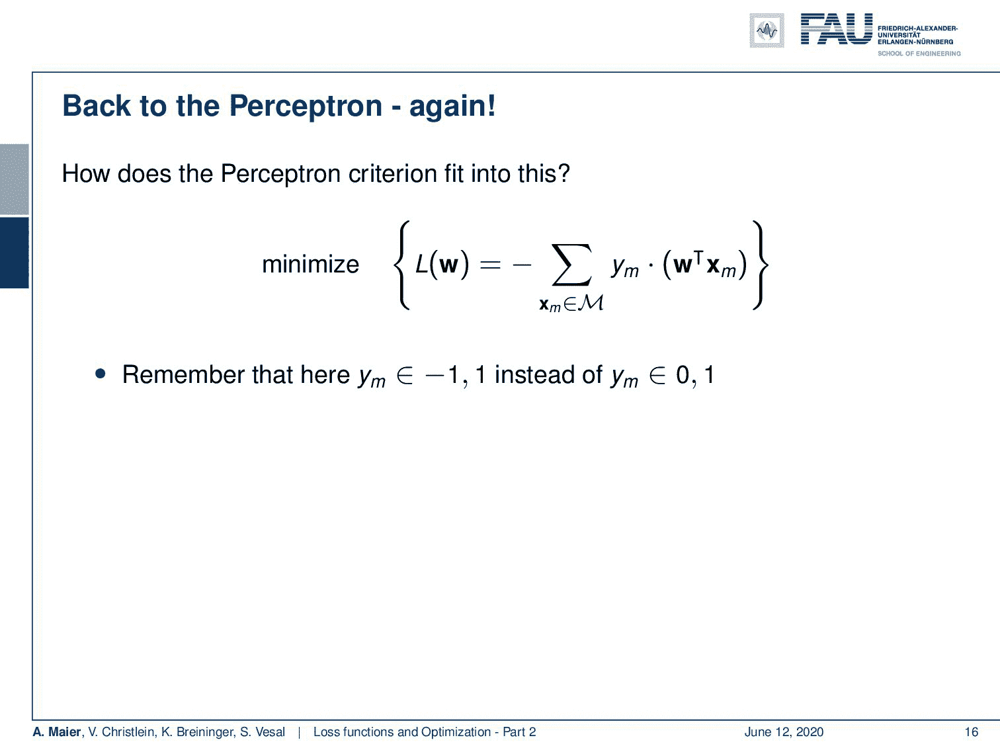

感知器能够通过引入一组错误分类来优化符号激活函数。 [CC 下的图片来自](https://creativecommons.org/licenses/by/4.0/)[深度学习讲座](https://www.youtube.com/watch?v=p-_Stl0t3kU&list=PLpOGQvPCDQzvgpD3S0vTy7bJe2pf_yJFj&index=1)的 4.0 。

你还记得我们最小化了所有错误分类样本的总和。我们选择这个是因为我们可以以某种方式摆脱符号函数，只查看与错误分类相关的样本。此外，请注意，这里我们没有 0/1 类别，而是-1/1，因为这允许我们与类标签相乘。这将总是导致错误分类样本中的负数。然后我们在最开始加上这个负号，这样我们总是以一个正值结束。这个正值越小，我们的损失就越小。所以，我们寻求最小化这个函数。在这个准则中，我们没有符号函数，因为我们找到了一种优雅的方式来表达这个损失函数。现在，如果它在，我们会遇到问题，因为这只会计算错误分类的数量，我们不会区分它是远离决策边界还是靠近决策边界。我们将简单地以计数结束。如果我们观察梯度，它基本上会在任何地方消失。所以这不是一个简单的优化问题。我们不知道往哪个方向走，所以找不到好的优化。上次我们是怎么做的？嗯，我们需要放松这一点，也有办法解决这个问题。

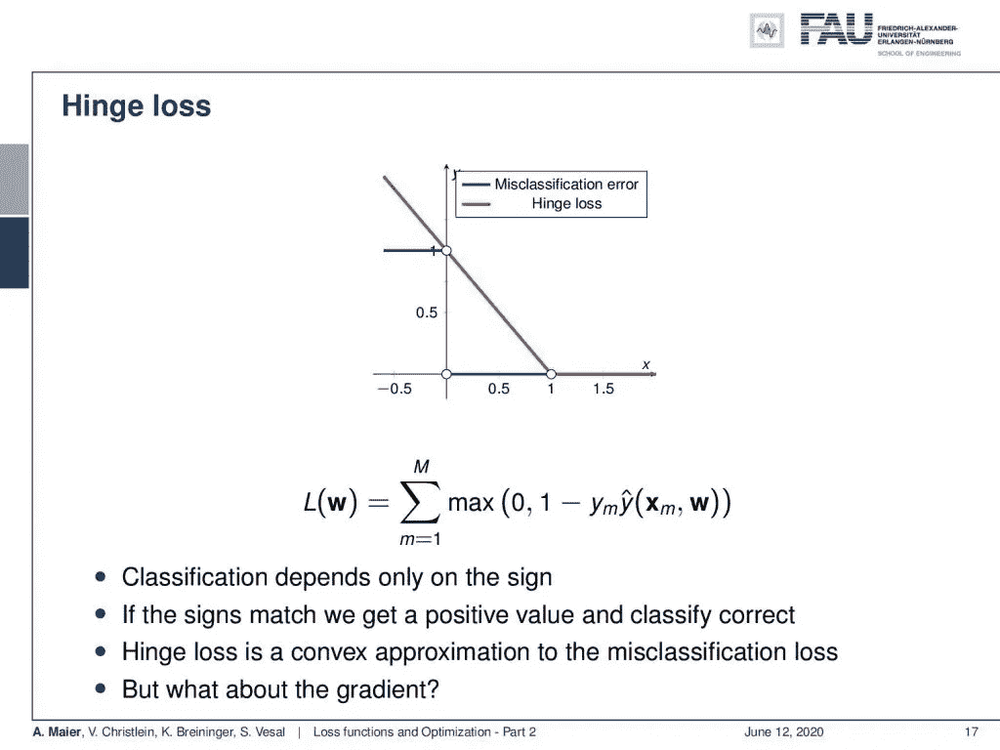

铰链损耗是符号函数的凸松弛。 [CC 下的图片来自](https://creativecommons.org/licenses/by/4.0/)[深度学习讲座](https://www.youtube.com/watch?v=p-_Stl0t3kU&list=PLpOGQvPCDQzvgpD3S0vTy7bJe2pf_yJFj&index=1)的 4.0 。

一种方法是将所谓的铰链损耗包括在内。现在，有了铰链损耗，我们可以将这个 0/1 函数放宽到在一个较大的域上表现为线性。这个想法是，我们基本上使用一条线，它在 x 轴上的位置是 1，在 y 轴上的位置也是 1。如果我们这样做，我们可以简单地用 max 函数重写。因此，如果我们的值大于 1，那么铰链损耗就是所有样本之和，基本上等于 0。所以，我们不得不重写右边的部分，重新表述一下。我们取 1-y 下标 m 乘以 y hat。在这里，你可以看到我们将有相同的约束。如果我们有相反的边界，这一项将是负的，通过符号，它当然会翻转，这样我们最终会有大量的错误分类的大值。我们摆脱了必须找到误分类集 m 的问题。现在，我们可以通过使用此 max 函数来获取完整的样本集，因为满足此约束的所有内容都将自动箝位到 0。所以，它不会影响这个损失函数。因此，这是表述同一问题的一种非常有趣的方式。我们隐式地得到了在这个损失函数中只考虑误分类样本的情况。可以看出，铰链损失是我们先前考虑的误分类损失的凸近似。这类优化问题的一个重要因素当然是梯度。这个损失函数有一个拐点。因此，导数在点 x = 1 处不连续。所以不清楚导数是什么，现在你可以说:“好的，我不能计算这个函数的导数。所以，我在劫难逃了！”

如果你必须最小化导数不连续的损失函数，那么次梯度可以节省时间。 [CC 下的图片来自](https://creativecommons.org/licenses/by/4.0/)[深度学习讲座](https://www.youtube.com/watch?v=p-_Stl0t3kU&list=PLpOGQvPCDQzvgpD3S0vTy7bJe2pf_yJFj&index=1)的 4.0 。

幸运的是，次梯度扭转了局面。让我们引入这个概念，为了这样做，我们来看看凸可微函数。据此，我们可以说，在任意点 f( **x** ，我们基本上可以找到 f( **x** )的一个下界，它由某个 f( **x₀** )加上 f( **x₀** )的梯度乘以从 **x** 到 **x₀** 的差来表示。那么，让我们看一个图表来展示这个概念。如果你在这里看这个函数，你可以看到我可以取任意一点 **x₀** 并计算梯度，或者在这种情况下，它只是构造的切线。这样做，你会看到在切线的任何一点都将是整个函数的下限。如果我沿着切线方向，我在哪里取这个点并不重要，我总是在构造一个下界。现在，这种定义更适合我们。

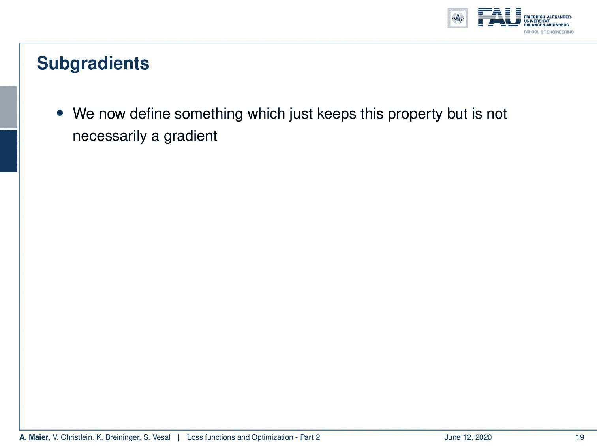

次梯度允许我们计算凸函数的下界，即使它们没有连续导数。来自[深度学习讲座](https://www.youtube.com/watch?v=p-_Stl0t3kU&list=PLpOGQvPCDQzvgpD3S0vTy7bJe2pf_yJFj&index=1)的 4.0CC 下的图片。

所以，现在让我们扩展一下梯度，进入次梯度的方向。在次梯度中，我们定义了保持这种性质但不一定是梯度的东西。所以向量 g 是凸函数 f( **x₀** )的次梯度，如果我们有相同的性质。所以，如果我们沿着次梯度方向，乘以 **x** 和 **x₀** 之差，那么我们总是有一个下界。这样做的好处是，我们基本上可以放松计算梯度的要求。可能有多个 g 满足这个属性。所以， **g** 不要求唯一。所有这些次梯度的集合称为次微分。那么次微分就是一组满足上述性质的次梯度。如果 f( **x** )在 **x₀** 可微，我们可以简单地说，包含所有次微分的集合就是包含梯度的集合。

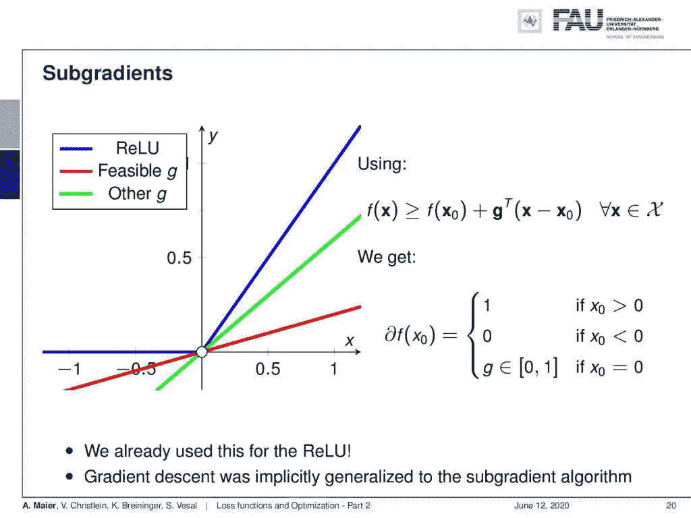

ReLU 的子梯度。 [CC 下的图片来自](https://creativecommons.org/licenses/by/4.0/)[深度学习讲座](https://www.youtube.com/watch?v=p-_Stl0t3kU&list=PLpOGQvPCDQzvgpD3S0vTy7bJe2pf_yJFj&index=1)的 4.0 。

现在我们来看一个不成立的例子。在这个例子中，我们有一个整流线性单元(ReLU ),它也有完全相同的问题。这又是一个凸函数，这意味着在扭结点，我们可以找到很多次梯度。实际上，你看到的是绿线和红线。它们都是可行的次梯度，而且它们满足这一性质，即它们是各自函数的下界。这意味着我们现在可以定义一个次微分，我们的次微分本质上是 1，其中 x₀大于 0。我们有 0，这里它比 0 小。我们正好有 g——在位置 **x₀** =0 处，g 可以是 0 到 1 之间的任何数字。这很好，因为我们现在可以基本上沿着这个次梯度方向。只是曲线的不同部分对梯度的定义不同。特别是在扭结位置，我们有这种情况，我们会有多种可能的解决方案。但是对于我们的优化，只需要知道其中一个子梯度就足够了。我们不必计算整个集合。因此，我们现在可以简单地扩展我们的梯度下降算法，以推广到次梯度。有证据表明，对于凸问题，使用次梯度理论仍然可以找到全局最小值。所以，我们现在可以说:“我们正在看的函数，它们是局部凸的。”这允许我们找到局部最小值，即使有 ReLUs 和铰链损耗。

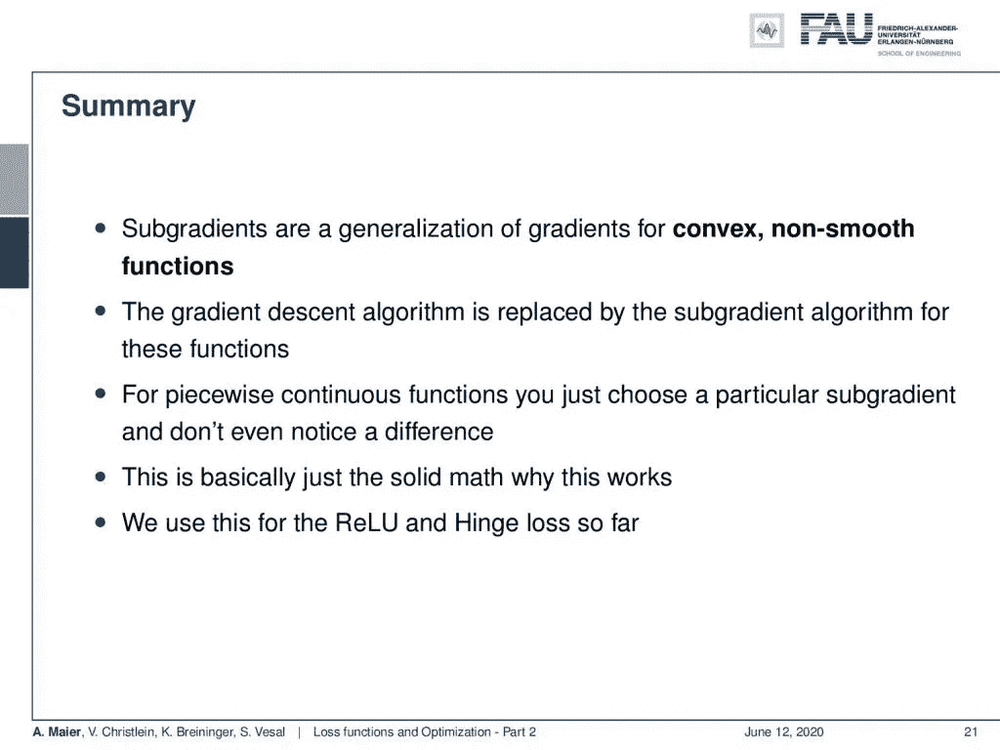

子梯度是梯度的一种推广，它允许最小化非光滑函数。 [CC 下的图片来自](https://creativecommons.org/licenses/by/4.0/)[深度学习讲座](https://www.youtube.com/watch?v=p-_Stl0t3kU&list=PLpOGQvPCDQzvgpD3S0vTy7bJe2pf_yJFj&index=1)的 4.0 。

所以，让我们总结一下:次梯度是对凸非光滑函数梯度的推广。梯度下降算法被这些函数各自的次梯度算法所取代。尽管如此，这允许我们继续我们之前对分段连续函数所做的。你只是选择了一个特定的次梯度，你可能甚至没有注意到差异。好的一面是，我们不只是把它作为一个“工程解决方案”来做，而且有一个坚实的数学理论证明这确实是可行的。因此，我们可以用它来计算 ReLU 和铰链损耗。这在数学上是合理的，我们可以继续前进，不用太担心。

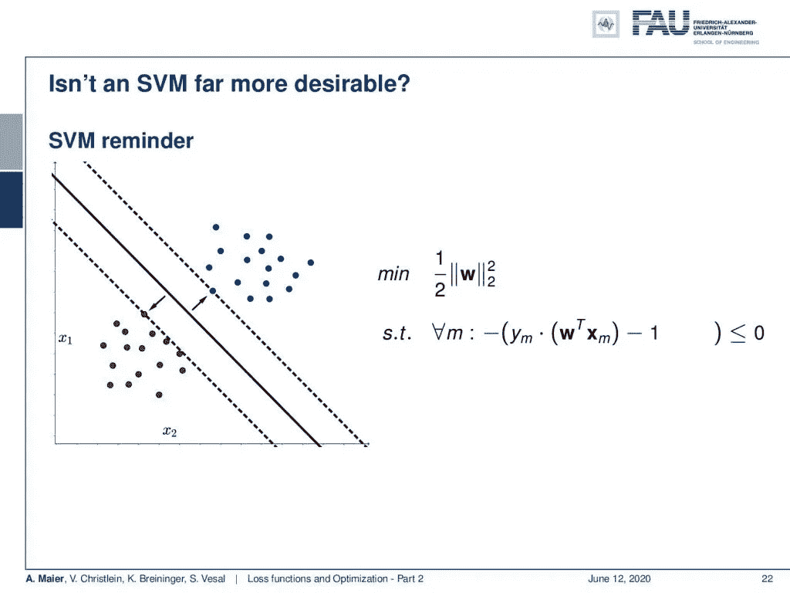

不应该用支持向量机代替深度学习吗？ [CC 下的图片来自](https://creativecommons.org/licenses/by/4.0/)[深度学习讲座](https://www.youtube.com/watch?v=p-_Stl0t3kU&list=PLpOGQvPCDQzvgpD3S0vTy7bJe2pf_yJFj&index=1)的 4.0 。

如果人们说“哦，支持向量机(SVMs)比你正在做的要好得多，因为它们总是达到全局最小值，”会怎么样那么，使用 SVM 不是更好吗？那么，让我们来看看 SVM 实际上是做什么的。支持向量机计算最优分离超平面。它也在计算某个平面，这个平面将两个类分开，它想最大化两个集合之间的间隔。所以，你试着找到平面，或者在这个简单的例子中，产生最大余量的线。超平面或决策边界是黑线，虚线表示这里的边界。因此，SVM 试图在分离这些类时找到最大的边距。通常所做的是，你找到这个最小化问题，其中 **w** 是我们的超平面的法向量。然后我们最小化法向量的大小。请注意，这个法向量没有缩放，这意味着如果你增加 **w** 的大小，你的法向量会变长。如果你想计算带符号的距离，通常要除以法向量的大小。这意味着如果你增加这个法向量的长度，你的距离会变小。如果你想最大化距离，你可以最小化法向量的长度。显然，你可以把它压缩到零，然后你就有了无限远的距离。仅仅最小化 w 会导致平凡解 **w** = **0** 。为了防止这种情况，你把它放在一个约束优化中，要求所有样本的所有观测值 m 都被投影到决策边界的右侧。这是由这里的约束最小化引入的。因此，您希望带符号的距离乘以真实标注减去 1，使其小于 0。

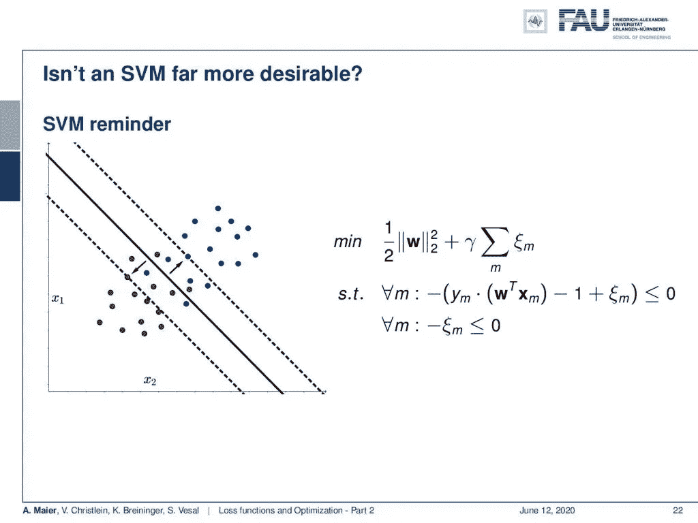

软间隔支持向量机允许轻微的误分类。 [CC 下的图片来自](https://creativecommons.org/licenses/by/4.0/)[深度学习讲座](https://www.youtube.com/watch?v=p-_Stl0t3kU&list=PLpOGQvPCDQzvgpD3S0vTy7bJe2pf_yJFj&index=1)的 4.0 。

现在，我们可以把它扩展到这两类在所谓的软边缘 SVM 中不是线性可分的情况。这里的技巧是我们引入一个松弛变量ξ，它允许一个错误的分类。ξ被加到决策边界的距离上。这意味着，如果分类不正确，我可以将单个点移回决策边界。为了限制ξ的过度使用，我假设ξ都小于或等于 0。此外，我假设所有ξ的总和需要最小化，因为我希望尽可能少的错误分类。

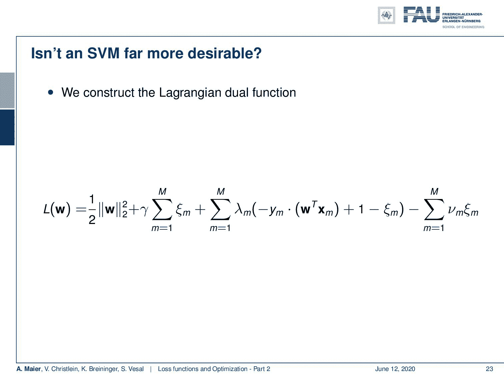

软裕度 SVM 可以使用具有铰链损耗的目标函数来重新表达。 [CC 下的图片来自](https://creativecommons.org/licenses/by/4.0/)[深度学习讲座](https://www.youtube.com/watch?v=p-_Stl0t3kU&list=PLpOGQvPCDQzvgpD3S0vTy7bJe2pf_yJFj&index=1)的 4.0 。

这就引出了软裕度 SVM 的完整公式，如果我想在联合优化中这样做，就要把它转换成拉格朗日对偶函数。为了做到这一点，你引入拉格朗日乘数λ和ν。你可以看到，上一张幻灯片中的约束现在接受乘数λ和ν。当然，还有一个额外的新 m，它是针对单个约束而引入的。现在，你看到这形成了一个相当复杂的优化问题。尽管如此，我们仍然有一个单一的拉格朗日函数，可以寻求最小化所有的 **w** ，ξ，λ和ν。这里引入了很多参数。我们可以稍微重新排列一下，将许多参数合并成一个总和。如果我们放弃支持向量解释，我们可以把这个和看作一个常数。因为我们知道所有的 lambdas 都大于或等于 0，这意味着所有将被错误分类或比 1 更接近决策边界的事物都将产生正损失。如果用最大值函数代替 lambda 项，会得到同样的结果。在错误分类的情况下，或者如果你在边缘区域内，优化将总是产生零或更大的值。在这个技巧中，我们通过引入 max 函数来抑制小于 0 的所有内容，即，在正确的边上和边距之外，来近似这个。现在，你可以看到，我们可以非常优雅地将它表示为铰链损耗。因此，你可以证明支持向量机和铰链损耗公式与那些约束等价于一个总的乘法常数，如参考文献[1]所示。如果别人说:“哦，你做不了深度学习。拿个 SVM 来代替吧！”。好吧，如果你选择了正确的损失函数，你也可以将支持向量机纳入你的深度学习框架。这实际上是一个很好的观察。

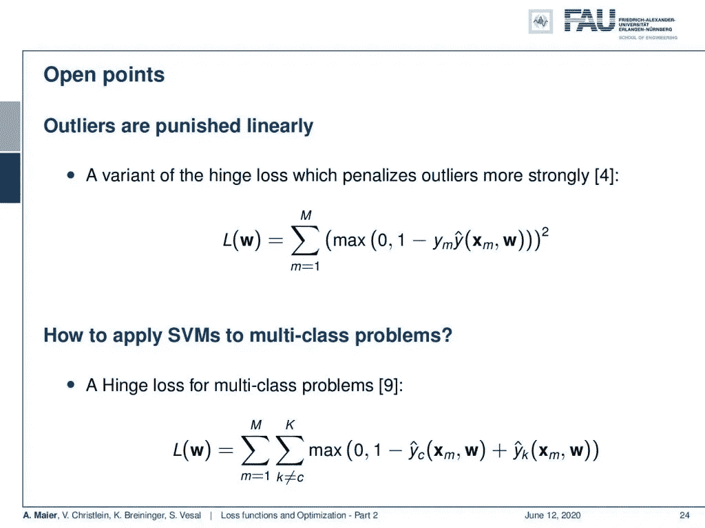

关于深度学习和支持向量机的开放点。来自[深度学习讲座](https://www.youtube.com/watch?v=p-_Stl0t3kU&list=PLpOGQvPCDQzvgpD3S0vTy7bJe2pf_yJFj&index=1)的 4.0CC 下的图片。

好吧，一些开放点:离群值受到线性惩罚。铰链损耗有一个变种，它对异常值的惩罚更强。举例来说，你可以通过引入正方形来实现。所以也是一个很常见的选择见参考文献[4]。因此，我们也可以将这种铰链损耗应用于多类问题，我们在这里引入的只是一个简单的加法，然后我们做一对多。所以，我们不只是对一个阶级进行分类，而是对一个阶级和其他阶级进行分类。这里介绍了新的分类器。最终，这会导致多级铰链损耗。

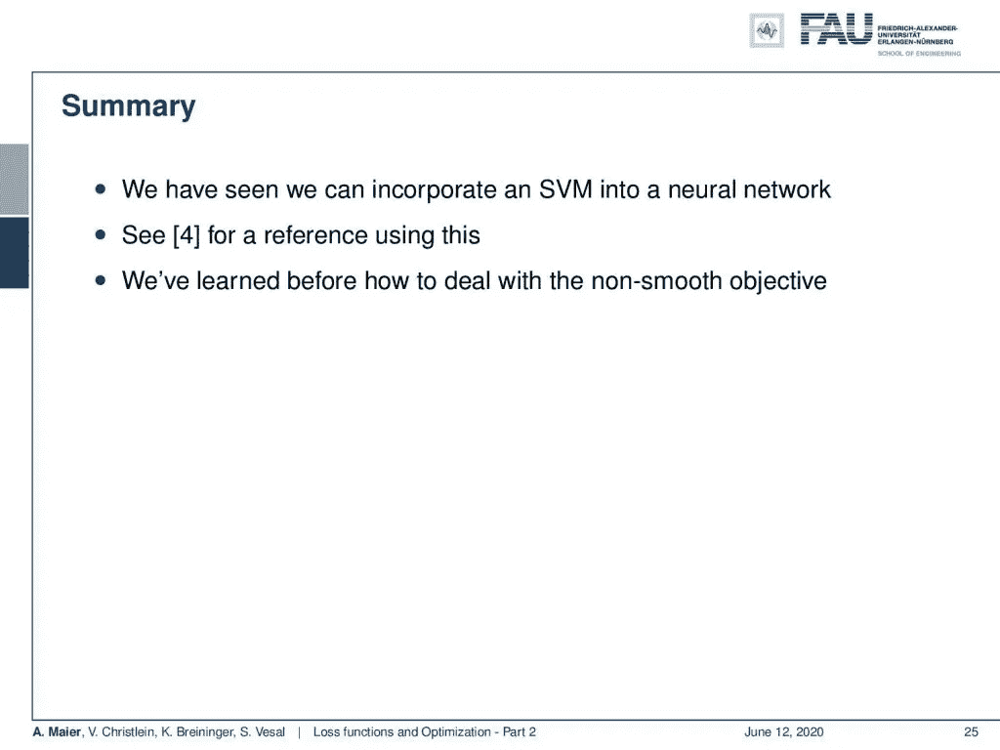

如参考文献[4]所示，支持向量机和深度学习是兼容的。 [CC 下的图片来自](https://creativecommons.org/licenses/by/4.0/)[深度学习讲座](https://www.youtube.com/watch?v=p-_Stl0t3kU&list=PLpOGQvPCDQzvgpD3S0vTy7bJe2pf_yJFj&index=1)的 4.0 。

所以，让我们总结一下:我们已经看到，我们可以将支持向量机整合到神经网络中。我们可以用铰链损耗来实现，铰链损耗是一个损耗函数，可以放入各种约束条件。你甚至可以将强迫选择实验作为损失函数。这就是所谓的用户流失。因此，这是一个非常灵活的功能，允许你在深度学习的框架内制定各种约束优化问题。你也可以将各种约束优化放入深度学习框架中。你学习了次梯度，以及为什么我们可以处理非光滑的目标函数，这也很酷。所以这也是一个非常有用的部分，如果你遇到一个数学家，他们告诉你“哦，这里有一个弯折，你不能计算梯度！”。所以从现在开始，你说:“嘿，次梯度拯救世界！”。这样，我们只需要找到一个可能的梯度，然后它仍然有效。这真的很好。如果有人接近你说 ReLUs 在你的梯度下降程序中不合适，请查阅我们的参考资料。这是有证据的。

在这个深度学习讲座中，更多令人兴奋的事情即将到来。来自[深度学习讲座](https://www.youtube.com/watch?v=p-_Stl0t3kU&list=PLpOGQvPCDQzvgpD3S0vTy7bJe2pf_yJFj&index=1)的 [CC BY 4.0](https://creativecommons.org/licenses/by/4.0/) 下的图片。

下一次在深度学习中，我们想继续深入研究优化。到目前为止，我们考虑过的所有优化程序，它们只有这个η，不知何故对所有变量都是一样的。现在，我们已经看到，不同的层参数可能会有很大的不同，因此不应该一视同仁。其实这样会导致大麻烦。但是，如果你研究更高级的优化程序，他们有一些很酷的解决方案，如何自动处理不同的个体权重。敬请关注！我希望你喜欢这个讲座，并希望在下一个视频中再次欢迎你！

如果你喜欢这篇文章，你可以在这里找到更多的文章，或者看看我们的讲座。如果你想在未来了解更多的文章、视频和研究，我也会很感激你在 YouTube、Twitter、脸书、LinkedIn 上的鼓掌或关注。本文以 [Creative Commons 4.0 归属许可](https://creativecommons.org/licenses/by/4.0/deed.de)发布，如果引用，可以转载和修改。

# 参考

[1]克里斯托弗·贝肖普。模式识别和机器学习(信息科学和统计学)。美国新泽西州 Secaucus 出版社:纽约斯普林格出版社，2006 年。
[2]安娜·乔洛曼斯卡，米凯尔·赫纳夫，迈克尔·马修等人，“多层网络的损耗面”在:AISTATS。2015.
【3】Yann N Dauphin，Razvan Pascanu，卡格拉尔·古尔切赫勒等《高维非凸优化中鞍点问题的识别与攻击》。神经信息处理系统进展。2014 年，第 2933–2941 页。
[4]宜川唐。“使用线性支持向量机的深度学习”。载于:arXiv 预印本 arXiv:1306.0239 (2013 年)。
[5]萨尚克·雷迪、萨延·卡勒和桑基夫·库马尔。《论亚当和超越的趋同》。国际学习代表会议。2018.
[6] Katarzyna Janocha 和 Wojciech Marian Czarnecki。“分类中深度神经网络的损失函数”。载于:arXiv 预印本 arXiv:1702.05659 (2017)。
【7】Jeffrey Dean，Greg Corrado，Rajat Monga 等，《大规模分布式深度网络》。神经信息处理系统进展。2012 年，第 1223-1231 页。
[8]马人·马赫瑟雷奇和菲利普·亨宁。“随机优化的概率线搜索”。神经信息处理系统进展。2015 年，第 181–189 页。
【9】杰森·韦斯顿，克里斯·沃特金斯等《多类模式识别的支持向量机》在:ESANN。第 99 卷。1999 年，第 219-224 页。
[10]·张，Samy Bengio，Moritz Hardt 等，“理解深度学习需要反思泛化”。载于:arXiv 预印本 arXiv:1611.03530 (2016)。