# 损失和优化—第 3 部分

> 原文：<https://towardsdatascience.com/lecture-notes-in-deep-learning-loss-and-optimization-part-3-dc6280284fc1?source=collection_archive---------37----------------------->

## [FAU 讲座笔记](https://towardsdatascience.com/tagged/fau-lecture-notes)深度学习

## 使用 ADAM 和超越进行优化…

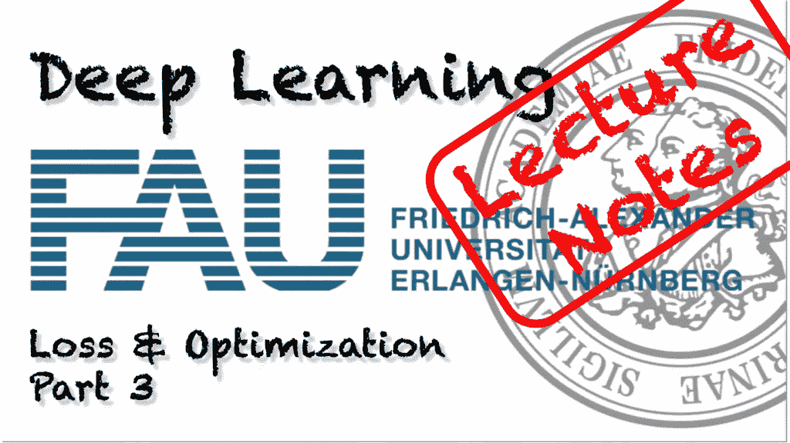

FAU 大学的深度学习。下图 [CC BY 4.0](https://creativecommons.org/licenses/by/4.0/) 来自[深度学习讲座](https://www.youtube.com/watch?v=p-_Stl0t3kU&list=PLpOGQvPCDQzvgpD3S0vTy7bJe2pf_yJFj&index=1)

**这些是 FAU 的 YouTube 讲座** [**深度学习**](https://www.youtube.com/watch?v=p-_Stl0t3kU&list=PLpOGQvPCDQzvgpD3S0vTy7bJe2pf_yJFj&index=1) **的讲义。这是与幻灯片匹配的讲座视频&的完整抄本。我们希望，你喜欢这个视频一样多。当然，这份抄本是用深度学习技术在很大程度上自动创建的，只进行了少量的手动修改。如果你发现了错误，请告诉我们！**

# 航行

[**上一讲**](/lecture-notes-in-deep-learning-loss-and-optimization-part-2-11b08f842aa7) **/** [**观看本视频**](https://youtu.be/2uWk2c0tsOA) **/** [**顶级**](/all-you-want-to-know-about-deep-learning-8d68dcffc258) **/** [**下一讲**](/lecture-notes-in-deep-learning-activations-convolutions-and-pooling-part-1-ddcad4eb04f6)

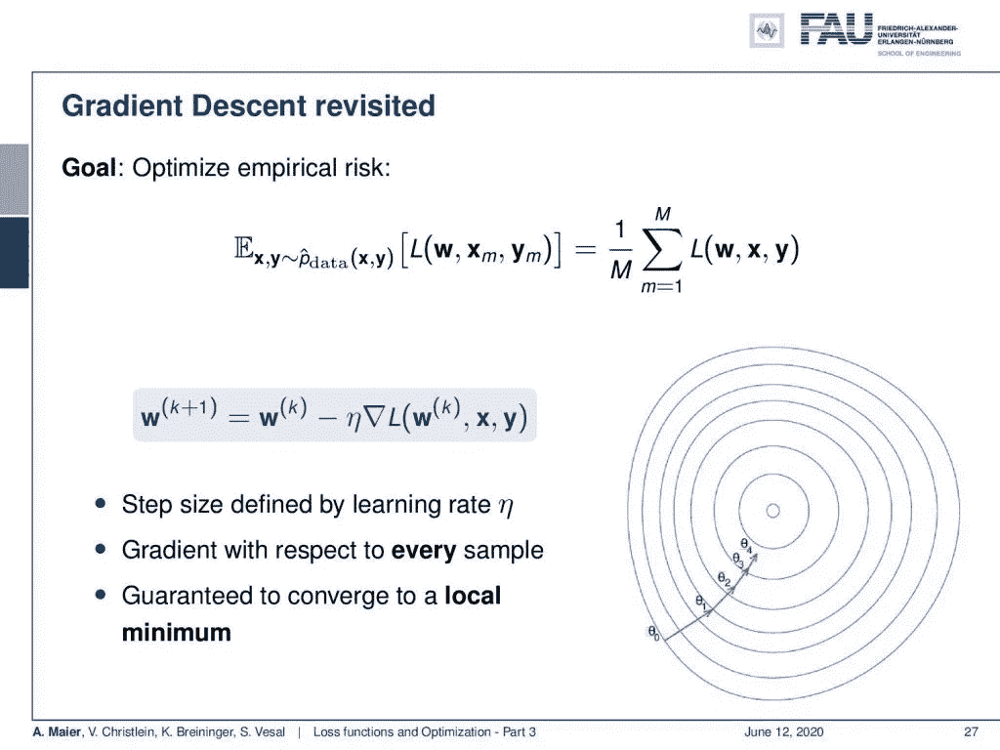

到目前为止，我们认为优化主要是直接梯度下降法。 [CC 下的图片来自](https://creativecommons.org/licenses/by/4.0/)[深度学习讲座](https://www.youtube.com/watch?v=p-_Stl0t3kU&list=PLpOGQvPCDQzvgpD3S0vTy7bJe2pf_yJFj&index=1)的 4.0 。

欢迎大家参加我们下一次关于深度学习的讲座！今天，我们想谈谈优化。让我们更详细地看看梯度下降法。所以，我们已经看到梯度本质上优化了经验风险。在这个图中，你可以看到我们朝着这个局部最小值前进了一步。我们有这个预定义的学习率η。因此，梯度当然是针对每个样本计算的，然后保证收敛到局部最小值。

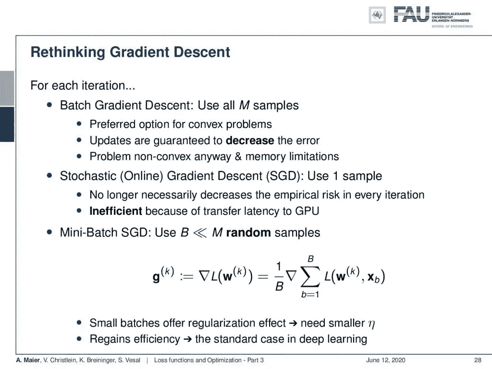

梯度下降的不同采样策略。 [CC 下的图片来自](https://creativecommons.org/licenses/by/4.0/)[深度学习讲座](https://www.youtube.com/watch?v=p-_Stl0t3kU&list=PLpOGQvPCDQzvgpD3S0vTy7bJe2pf_yJFj&index=1)的 4.0 。

当然，这意味着对于每次迭代，我们必须使用所有样本，这被称为批量梯度下降。所以你必须查看每一次迭代，每一次更新，所有的样本。可能真的有很多样本，特别是如果你看大数据一个计算机视觉的问题。这当然是凸优化问题的首选，因为我们可以保证找到全局最小值。每次更新都保证减少误差。当然，对于非凸问题，我们无论如何都有一个问题。此外，我们可能有记忆限制。这就是为什么人们喜欢其他方法，如随机梯度下降 SGD。在这里，他们只使用一个样本，然后立即更新。因此，这不再必然降低每次迭代中的经验风险，并且由于传输到图形处理单元的延迟，这也可能是非常低效的。但是，如果您只使用一个示例，您可以并行执行许多事情，因此它是高度并行的。两者之间的一个折衷是，您可以使用小批量随机梯度下降。这里你使用的 B and B 可能是一个比整个训练数据集小得多的随机样本，你实际上是从整个训练数据集中随机选择的。然后，评估子集 b 上的梯度。这称为小批量。现在，可以非常快速地评估这个小批量，您也可以使用并行化方法，因为您可以并行执行几个小批量步骤。然后，你只需做加权求和并更新。因此，小批量是有用的，因为它们提供了一种正则化效果。这通常会导致较小的η。因此，如果在梯度下降中使用小批量，通常较小的η值就足够了，而且效率也有所提高。通常，这是深度学习中的标准情况。

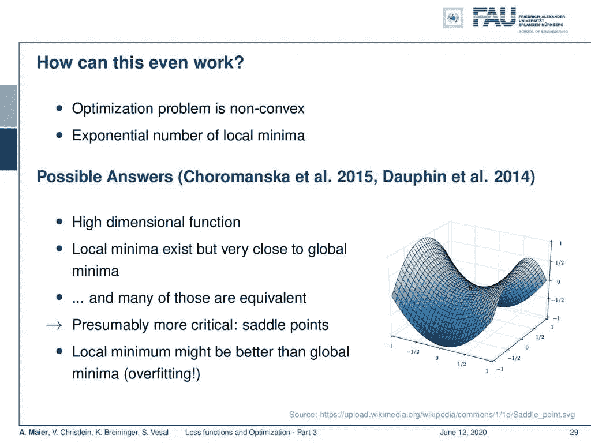

深度学习如此有效的可能原因。来自[深度学习讲座](https://www.youtube.com/watch?v=p-_Stl0t3kU&list=PLpOGQvPCDQzvgpD3S0vTy7bJe2pf_yJFj&index=1)的 [CC BY 4.0](https://creativecommons.org/licenses/by/4.0/) 下的图片。

很多人都这么做，这意味着梯度下降是有效的。但问题是:“这怎么可能行得通？”我们的优化问题是非凸的。存在指数数量的局部最小值，2015 年有一篇有趣的论文，其中他们表明我们通常使用的度量是高维函数。在这个环境中有许多局部极小值。有趣的是，这些局部最小值接近全局最小值，实际上它们中的许多是等价的。更大的问题可能是鞍点。此外，局部最小值甚至可能比全局最小值更好，因为全局最小值是在您的训练集上获得的，但最终，您希望将您的网络应用于可能不同的测试数据集。实际上，训练数据集的全局最小值可能与过度拟合有关。也许，这对训练好的网络的泛化能力来说，更是雪上加霜。

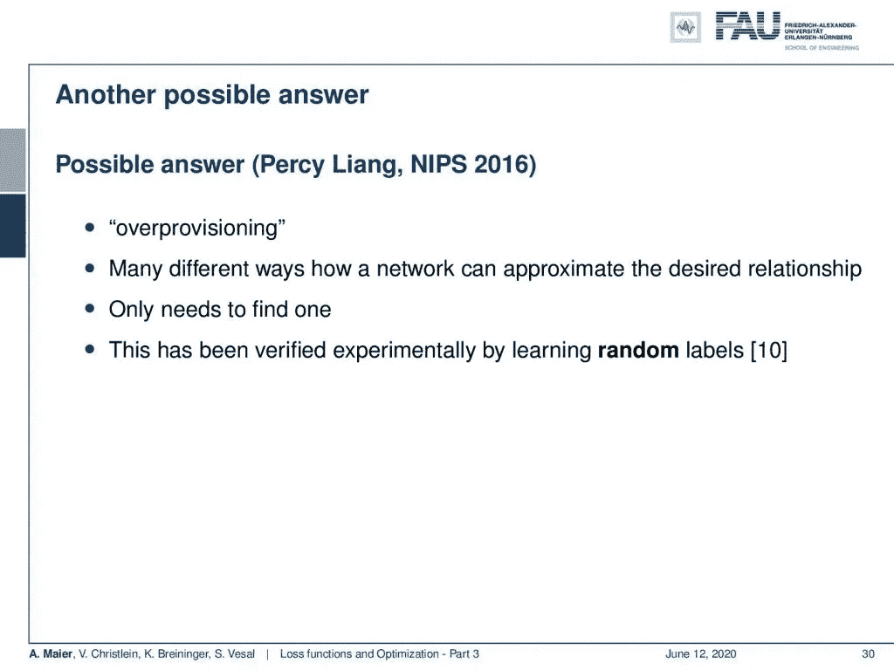

过度供应可能是对深度神经网络有效性的一种回答。 [CC 下的图片来自](https://creativecommons.org/licenses/by/4.0/)[深度学习讲座](https://www.youtube.com/watch?v=p-_Stl0t3kU&list=PLpOGQvPCDQzvgpD3S0vTy7bJe2pf_yJFj&index=1)的 4.0 。

对此，另一个可能的答案是 2016 年的一篇论文。作者建议过度供应，因为网络有许多不同的方式来近似期望的关系。你只需要找到一个。你不需要找到所有的人。一个就够了。梁看向艾尔通。通过随机标签实验验证了这一点。这里的想法是，你基本上随机化你不使用原始的标签。你只是随机地分配任何一个类，如果你随后表明你的实验仍然解决了问题，那么你就创造了一个过度拟合。

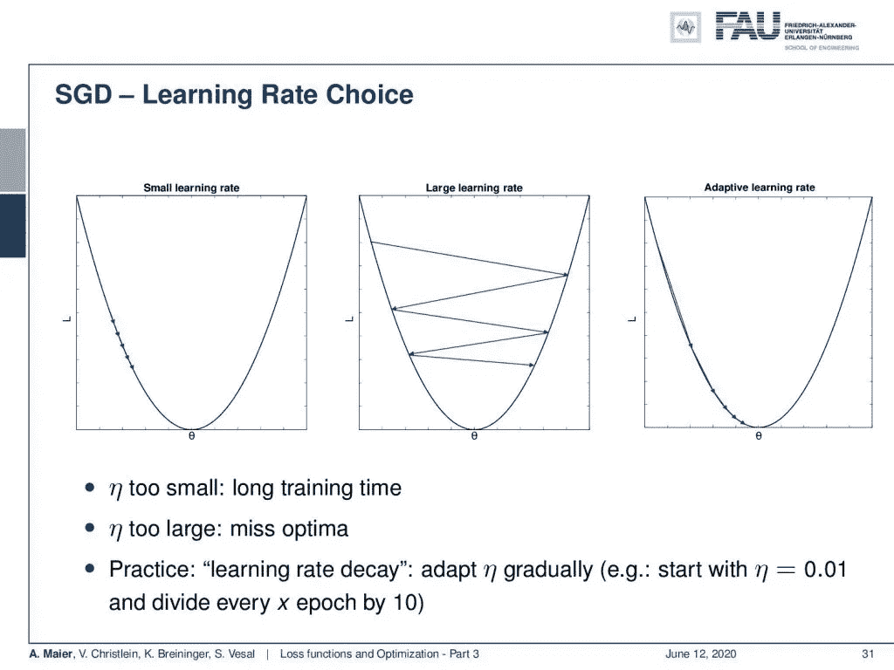

η的选择对成功学习至关重要。来自[深度学习讲座](https://www.youtube.com/watch?v=p-_Stl0t3kU&list=PLpOGQvPCDQzvgpD3S0vTy7bJe2pf_yJFj&index=1)的 [CC BY 4.0](https://creativecommons.org/licenses/by/4.0/) 下的图片。

我们来看看η的选择。我们已经看到，如果你的学习速度很慢，我们甚至可能在达到收敛之前就停止了。如果你有一个太大的学习率，我们可能会来回跳跃，甚至找不到局部最小值。只有有了适当的学习率，你才能找到最小值。实际上，当你远离最小值时，你希望能够大步前进，而当你越接近最小值时，就越是小步前进。如果你想在实践中这样做，你的工作与学习率的衰减。所以，你要逐渐适应你的η。你从 0.01 开始，然后每 x 个周期除以 10。这有助于您不会错过您实际寻找的本地最小值。这是一个典型的实际工程参数。

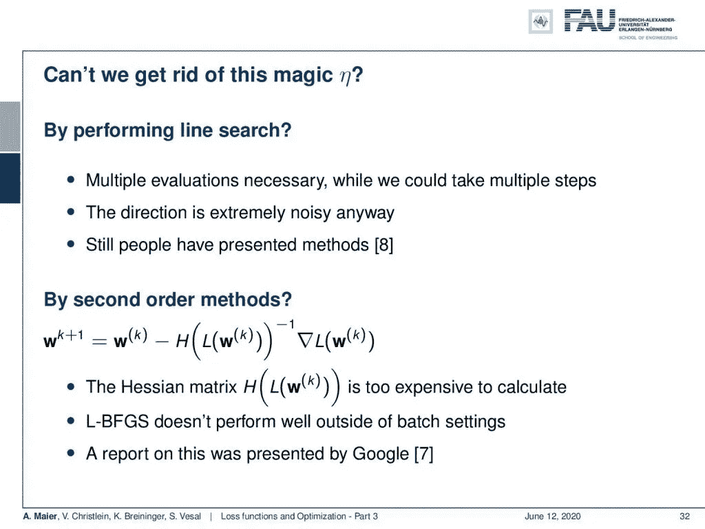

我们能去掉我们的“工程参数”η吗？ [CC 下的图片来自](https://creativecommons.org/licenses/by/4.0/)[深度学习讲座](https://www.youtube.com/watch?v=p-_Stl0t3kU&list=PLpOGQvPCDQzvgpD3S0vTy7bJe2pf_yJFj&index=1)的 4.0 。

现在，你可能会问我们不能摆脱这个魔法吗？那么通常会怎么做呢？相当多的人建议在类似情况下进行线搜索。所以，线搜索，当然需要你估计每一步的最优η。所以，你需要多次求值，以便在梯度指向的方向上找到正确的η。反正是吵的不得了。所以，人们已经提出了方法，但它们不是深度学习领域目前的最先进水平。然后，人们提出了二阶方法。如果研究二阶方法，需要计算 Hessian 矩阵，这通常非常昂贵。到目前为止，我们还没有经常看到这种情况。有 L-BFGS 方法，但是如果您在批次设置之外操作，它们通常不会很好地执行。所以，如果你使用小批量，它们就没那么好了。你可以在参考文献[7]中找到谷歌的一份报告。

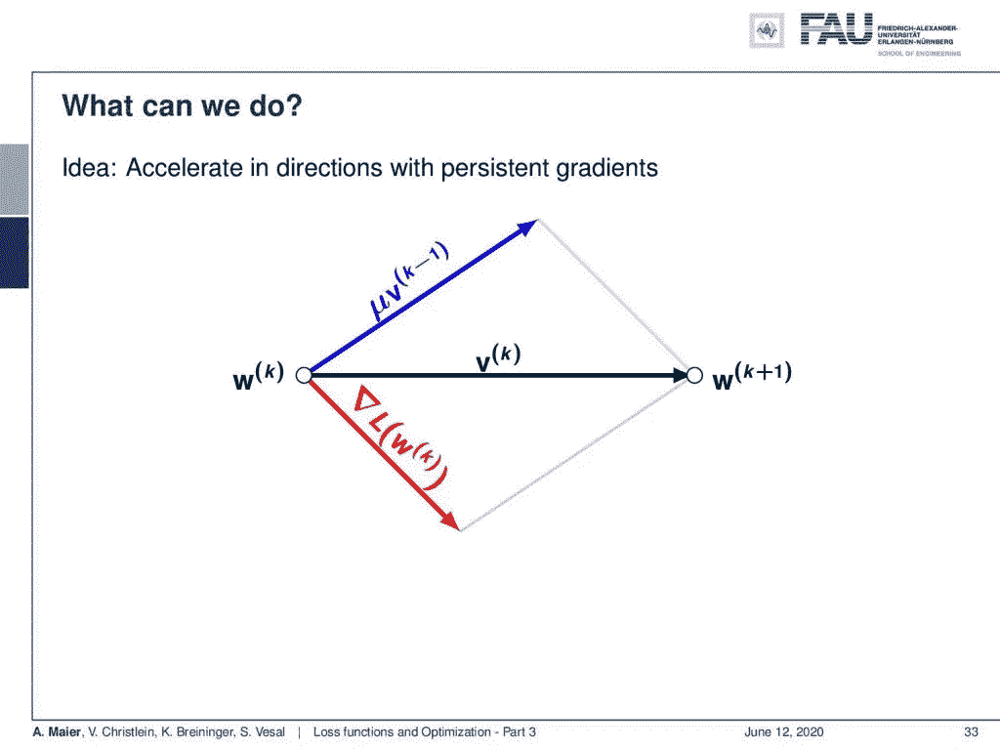

我们能使用持续方向改善我们的噪音梯度下降吗？来自[深度学习讲座](https://www.youtube.com/watch?v=p-_Stl0t3kU&list=PLpOGQvPCDQzvgpD3S0vTy7bJe2pf_yJFj&index=1)的 [CC BY 4.0](https://creativecommons.org/licenses/by/4.0/) 下的图片。

我们还能做什么？当然，我们可以加速持续梯度的方向。所以，这里的想法是，你以某种方式跟踪平均值，这里用 new **v** 表示。这实质上是最后几个梯度步骤的加权和。你把当前的梯度方向用红色表示，并与前面的步骤平均。这给了你一个更新的方向，这通常被称为动量。

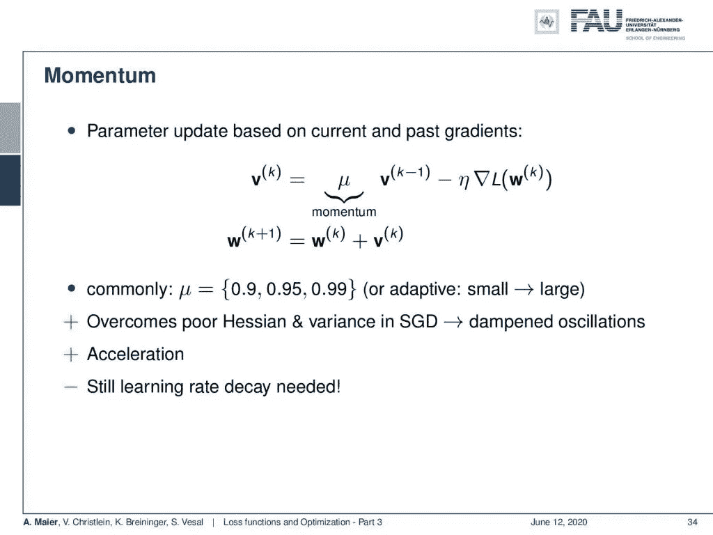

动量项的正式定义。来自[深度学习讲座](https://www.youtube.com/watch?v=p-_Stl0t3kU&list=PLpOGQvPCDQzvgpD3S0vTy7bJe2pf_yJFj&index=1)的 [CC BY 4.0](https://creativecommons.org/licenses/by/4.0/) 下的图片。

所以，我们引入了动量项。在那里，你用一个新的权重添加了一些动量，用 **v** 上标 k-1 表示。这个动量项基本上是以迭代的方式计算的，其中你迭代地更新过去的梯度方向。所以你可以说，通过迭代计算这个加权平均值，你保留了之前梯度方向的历史，然后用新的梯度方向逐渐更新它们。然后你选择动量项来执行更新，而不仅仅是梯度方向。因此，μ的典型选择为 0.9、0.95 或 0.99。如果你想让他们更加强调之前的渐变方向，你也可以从小到大调整他们。这克服了随机梯度下降中的不良 Hessians 和方差。它将抑制振荡，并且通常加速优化过程。尽管如此，我们还是需要学习率衰减。所以，这并没有解决η的自动调节。

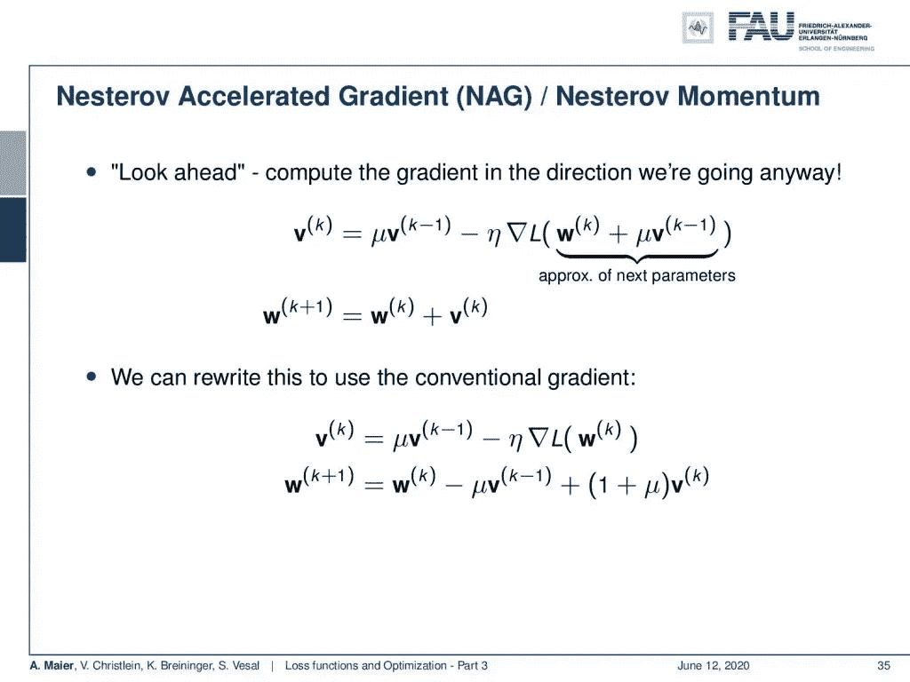

内斯特罗夫动量试图预测动量项。 [CC 下的图片来自](https://creativecommons.org/licenses/by/4.0/)[深度学习讲座](https://www.youtube.com/watch?v=p-_Stl0t3kU&list=PLpOGQvPCDQzvgpD3S0vTy7bJe2pf_yJFj&index=1)的 4.0 。

我们也可以选择一种不同的动量方式:内斯特罗夫加速梯度或简单的内斯特罗夫动量。这执行了一个前瞻。这里，我们也有动量项。但是我们没有计算当前位置的梯度，而是在计算梯度之前加入了动量项。所以，我们实际上是在试图逼近下一组参数。我们在这里使用前瞻，然后我们执行梯度更新。所以你可以重写这个来使用传统的渐变。这里的想法是将内斯特罗夫加速度直接放入梯度更新中。这一项将用于下一次梯度更新。所以，这是一个等价的公式。

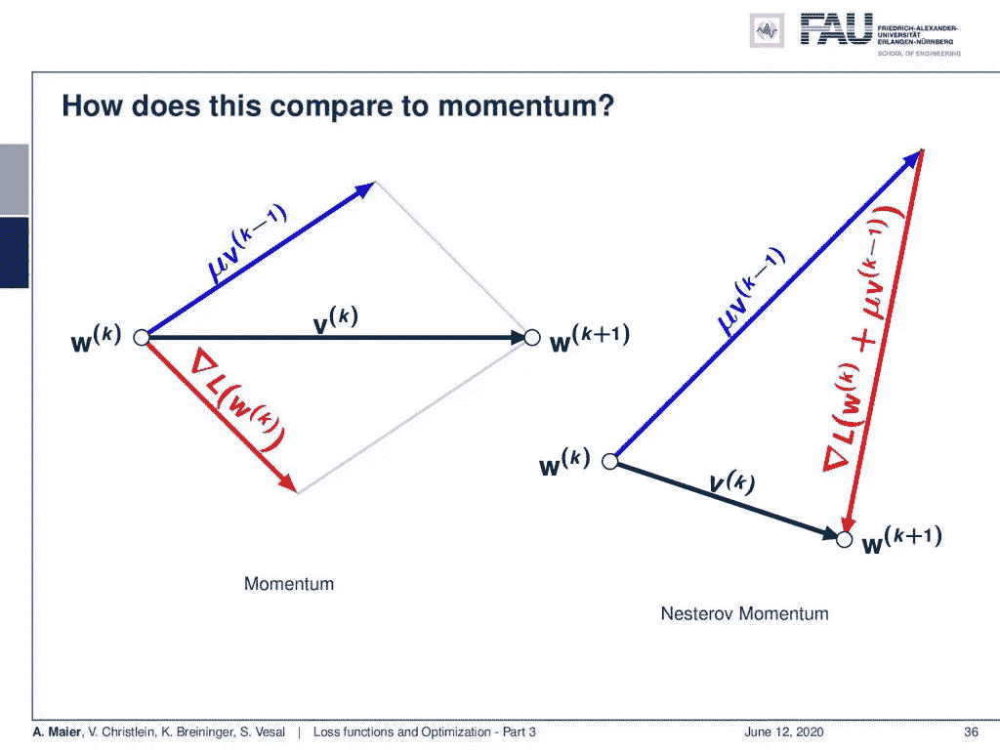

动量和内斯特罗夫动量相比较。 [CC 下的图片来自](https://creativecommons.org/licenses/by/4.0/)[深度学习讲座](https://www.youtube.com/watch?v=p-_Stl0t3kU&list=PLpOGQvPCDQzvgpD3S0vTy7bJe2pf_yJFj&index=1)的 4.0 。

让我们想象一下。在这里，你可以看到动量和内斯特罗夫动量。当然，它们都使用了一种动量项。但是它们使用不同的方向来计算梯度更新。这是最主要的区别。

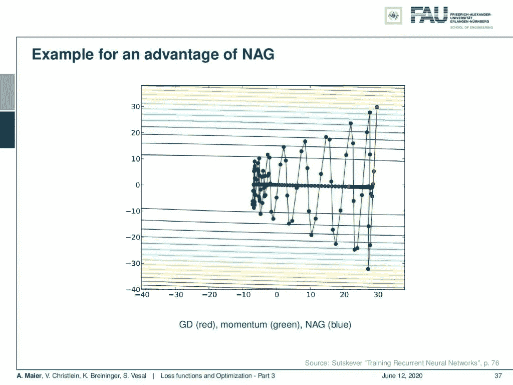

在这个例子中，你可以看到内斯特罗夫动量项的强度。来自[深度学习讲座](https://www.youtube.com/watch?v=p-_Stl0t3kU&list=PLpOGQvPCDQzvgpD3S0vTy7bJe2pf_yJFj&index=1)的 [CC BY 4.0](https://creativecommons.org/licenses/by/4.0/) 下的图片。

在这里，你可以看到这些动量项的对比例子。在这种情况下，两个方向的方差都有很大的差异。因此，左右方向的方差非常大，上下方向的方差相当小。我们试图找到全局最小值。即使你引入动量项，这通常会导致梯度方向非常强烈的交替。你仍然会得到这种强烈的振荡行为。如果你使用内斯特罗夫加速梯度，你可以看到我们计算这个前瞻，这允许我们沿着蓝线。所以，我们直接向期望的最小值移动，不再交替。这是内斯特罗夫的优势。

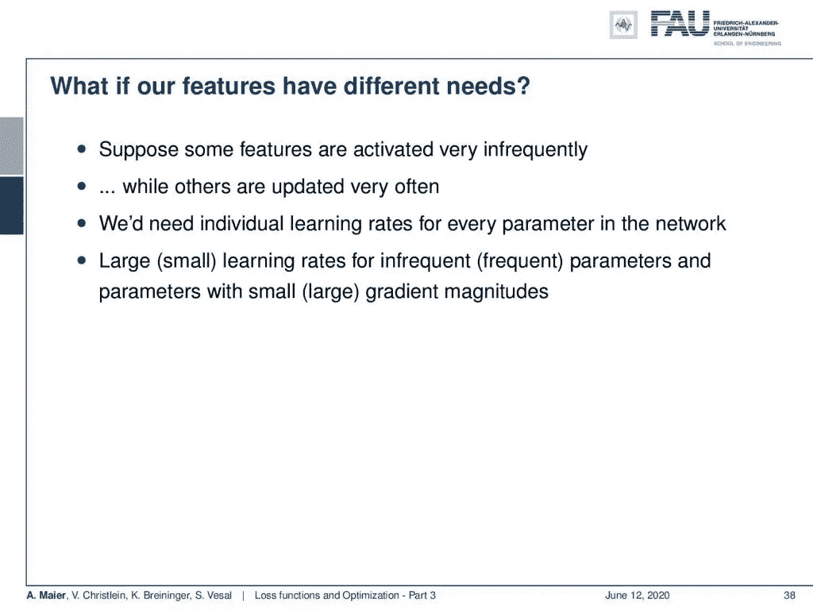

一些参数的更新可能与其他参数不同。 [CC 下的图片来自](https://creativecommons.org/licenses/by/4.0/)[深度学习讲座](https://www.youtube.com/watch?v=p-_Stl0t3kU&list=PLpOGQvPCDQzvgpD3S0vTy7bJe2pf_yJFj&index=1)的 4.0 。

如果我们的功能有不同的需求呢？因此，假设一些特性很少被激活，而另一些特性经常被更新。然后，我们需要网络中每个参数的单独学习率。对于不频繁的参数，我们需要大的学习率，对于频繁的参数，我们需要小的学习率。

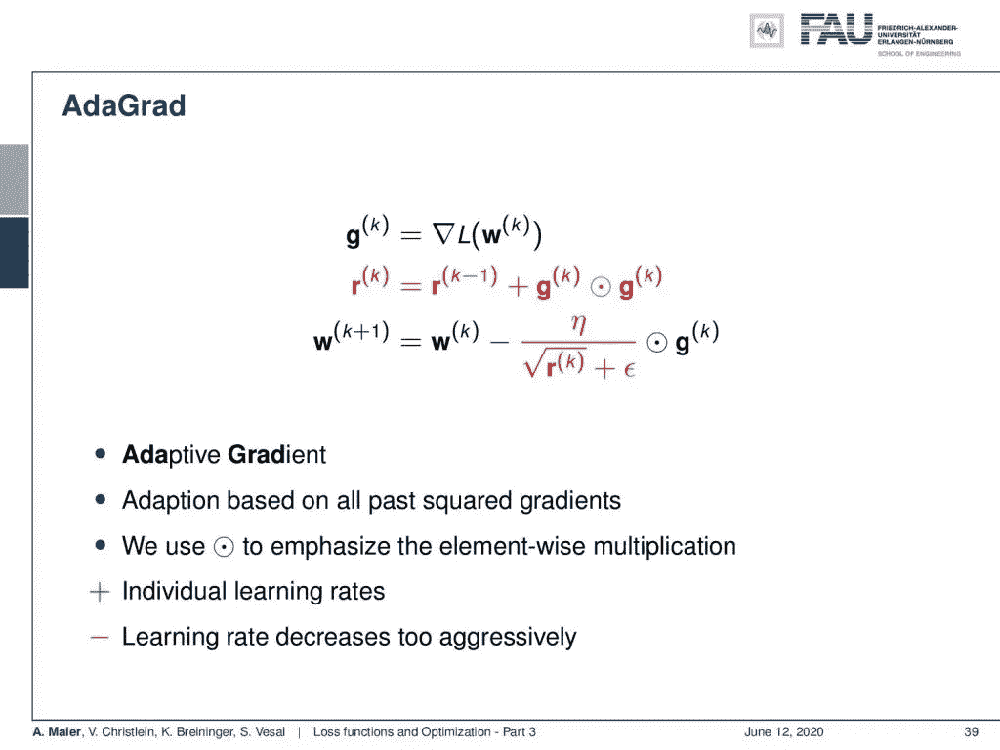

AdaGrad 为每个参数引入了单独的缩放。来自[深度学习讲座](https://www.youtube.com/watch?v=p-_Stl0t3kU&list=PLpOGQvPCDQzvgpD3S0vTy7bJe2pf_yJFj&index=1)的 4.0CC 下的图片。

为了适当地适应变化，这可以用所谓的 AdaGrad 方法来完成。它首先使用梯度来计算某个 **g** 上标 k，然后计算梯度与其自身的乘积，以跟踪变量 **r** 中的元素方差。现在，我们使用我们的 **g** 和 **r** 元素与η组合来衡量梯度的更新。因此，现在我们构建更新的权重，并且每个参数中权重的方差通过乘以相应元素的平方根来合并，即其标准偏差的近似值。所以，这里我们把它记为一个完整矢量的平方根。这里所有其他的东西都是标量，这意味着这也产生了一个矢量。然后，该向量逐点乘以实际梯度，以执行局部缩放。这是一个很好且有效的方法，并且允许对所有不同权重的所有不同维度的个体学习率。一个问题可能是学习率下降过快。

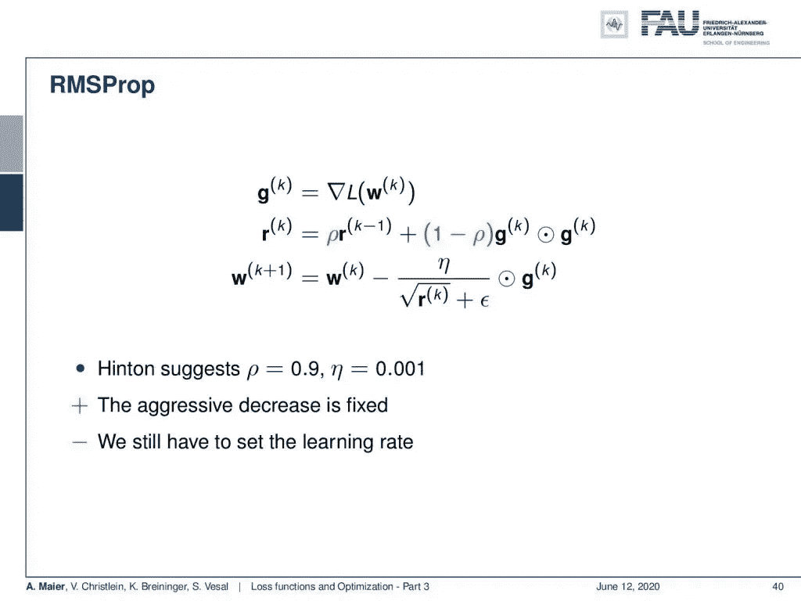

RMSProp 建立在 AdaGrad 的基础上。 [CC 下的图片来自](https://creativecommons.org/licenses/by/4.0/)[深度学习讲座](https://www.youtube.com/watch?v=p-_Stl0t3kU&list=PLpOGQvPCDQzvgpD3S0vTy7bJe2pf_yJFj&index=1)的 4.0 。

这是一个问题，并导致了一个改进的版本，这里的改进版本是 RMSProp。RMSProp 现在再次使用它，但他们引入了这个ρ，现在ρ被用来引入一个延迟，这样就不会有很高的增加。在这里，您可以设置这个ρ，以便抑制学习率方差的更新。所以，Hinton 建议 0.9，η = 0.001。这一转变导致积极减少被固定，但是我们仍然必须设置学习率。如果你没有适当地设置学习速度，你就会遇到问题。

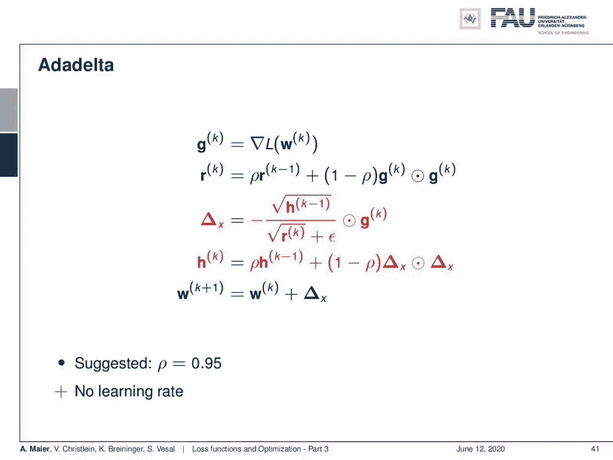

阿达德尔塔除掉了η。来自[深度学习讲座](https://www.youtube.com/watch?v=p-_Stl0t3kU&list=PLpOGQvPCDQzvgpD3S0vTy7bJe2pf_yJFj&index=1)的 4.0CC 下的图片。

现在，Adadelta 试图在此基础上进一步改进。他们实际上使用了我们的 RMSProp 并去掉了η。我们已经看到了 r，它是以一种阻尼方式计算的方差。然后，另外，他们介绍这个δₓ.它是某项 h 和 r 的加权组合，我们之前已经看到，乘以梯度方向。因此，这是一个额外的阻尼因子，代替了原始公式中的η。因子 h 被再次计算为δₓ上的滑动平均值，作为元素间的乘积。所以，这样你就不用再设定学习率了。还是要选择参数ρ。对于ρ，我们建议使用 0.95。

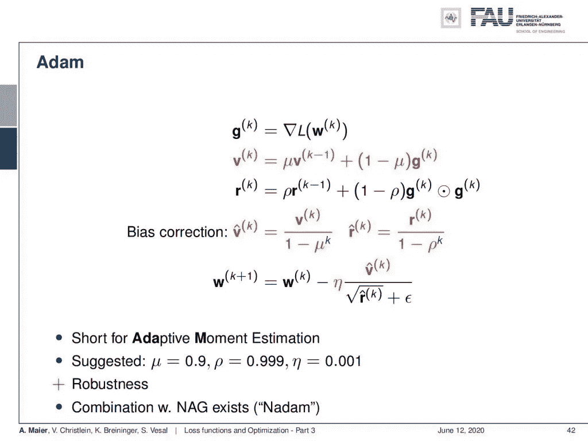

Adam 使用来自[深度学习讲座](https://www.youtube.com/watch?v=p-_Stl0t3kU&list=PLpOGQvPCDQzvgpD3S0vTy7bJe2pf_yJFj&index=1)的 [CC 下的 4.0](https://creativecommons.org/licenses/by/4.0/) 的额外动量项 v. Image 构建 Adadelta。

正在使用的最流行的算法之一是 Adam，Adam 本质上也在使用这个梯度方向 **g** 。然后，你基本上有一个动量项 **v** 。此外，你还有这个 **r** 术语，它再次试图单独控制每个维度的学习速率。此外，Adam 引入了额外的偏置校正，其中 **v** 按 1 减μ的比例缩放。 **r** 也是 1 比 1 减ρ缩放。这就导致了最终的更新项，它包括学习率η、动量项和相应的缩放比例。这种算法叫做 **Ada** 感受性 **M** 矩估计。对于 Adam，建议值为μ = 0.9，ρ = 0.999，η= 0.001。这是一种非常稳健的方法，并且非常常用。我们可以把它和内斯特罗夫加速梯度结合起来，得到“那达慕”。但是，你仍然可以改进这一点。

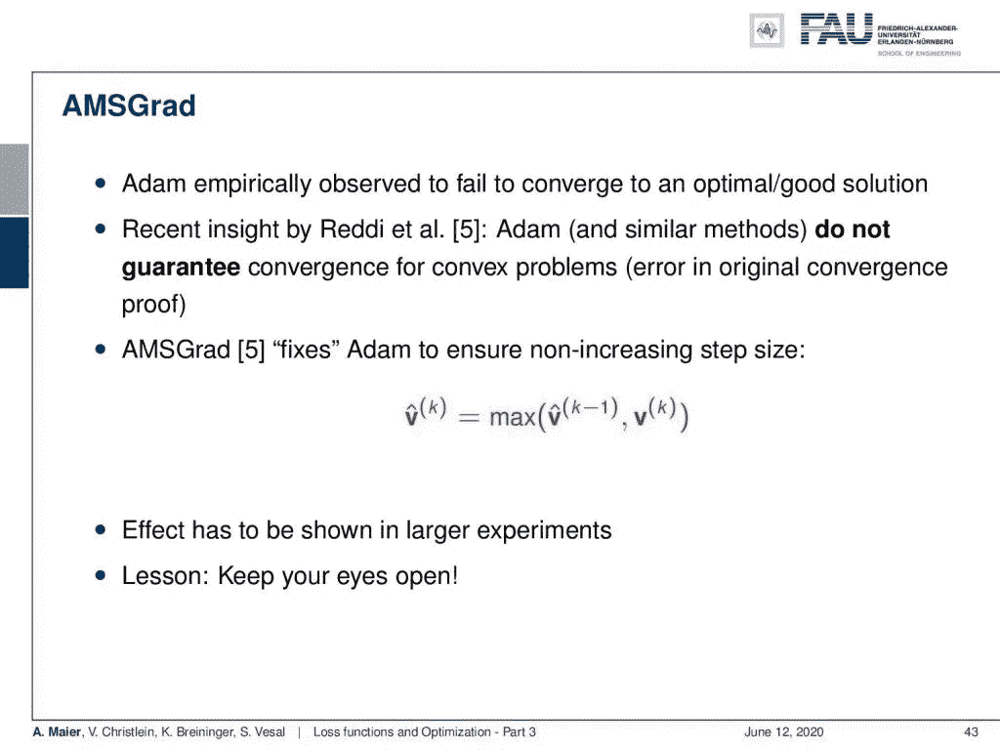

AMSGrad 修复了 Adam 中的收敛问题。 [CC 下的图片来自](https://creativecommons.org/licenses/by/4.0/)[深度学习讲座](https://www.youtube.com/watch?v=p-_Stl0t3kU&list=PLpOGQvPCDQzvgpD3S0vTy7bJe2pf_yJFj&index=1)的 4.0 。

根据经验观察，Adam 无法收敛到最优/良好的解决方案。在参考文献[5]中，你甚至可以看到，对于凸问题，Adam 和类似的方法并不能保证收敛。在最初的收敛证明中有一个错误，因此，我们建议使用修正 Adam 的 AMSGrad 来确保不增加步长。所以，你可以通过在动量更新项上增加一个最大值来修正它。所以如果你这样做，你会得到 AMSGrad。这被证明是更加鲁棒的。这种效果已经在大型实验中得到证实。我们在这里学到的一个教训是，你应该睁大眼睛。即使是经过科学同行评审的东西，也可能存在后来被发现的问题。我们在这里学到的另一件事是，这些梯度下降程序——只要你大致遵循正确的梯度方向——你仍然可以得到相当不错的结果。当然，这样的梯度方法真的很难调试。所以，一定要调试你的渐变。正如您在本例中看到的，这种情况确实会发生。即使是大型软件框架也可能遭受这样的错误。很长一段时间，人们都没有注意到他们。他们只是注意到奇怪的行为，但问题依然存在。

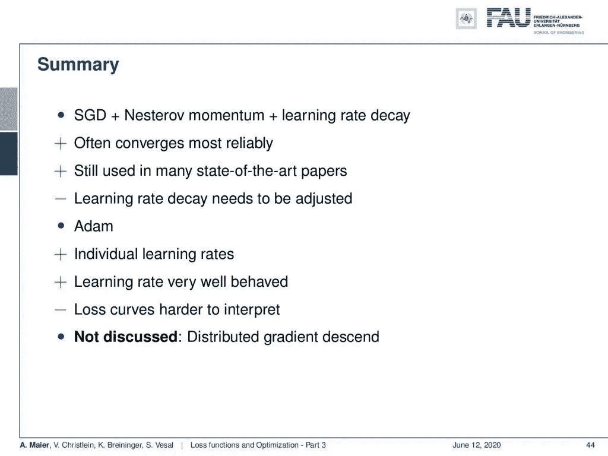

今天讲座的总结。 [CC 下的图片来自](https://creativecommons.org/licenses/by/4.0/)[深度学习讲座](https://www.youtube.com/watch?v=p-_Stl0t3kU&list=PLpOGQvPCDQzvgpD3S0vTy7bJe2pf_yJFj&index=1)的 4.0 。

好了，让我们总结一下。随机梯度下降加内斯特罗夫动量加学习率衰减是许多实验中的典型选择。它收敛最可靠，并在许多先进的论文中使用。然而，它的问题是，这种学习率衰减必须加以调整。亚当有个人学习率。学习率表现很好，但当然，损失曲线很难解释，因为你不会有固定学习率下的典型行为。我们在这里没有讨论，我们只是暗示了分布式梯度下降。当然，您也可以以并行方式执行此操作，然后在分布式网络的不同节点或不同的图形板上计算不同的更新步骤。然后你把它们平均起来。这也被证明是非常健壮和非常快速的。

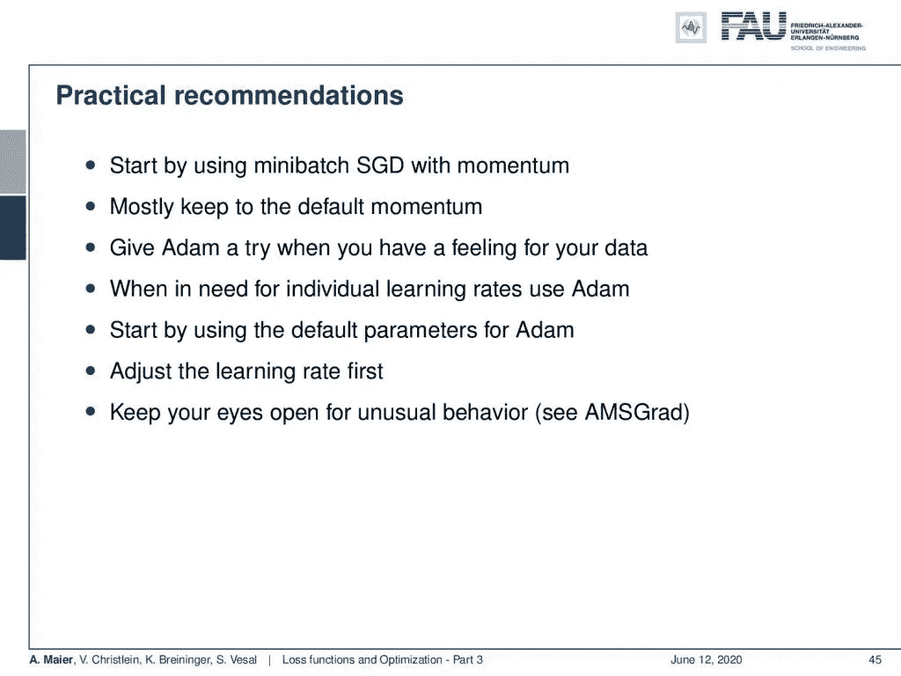

对你工作的实用建议。来自[深度学习讲座](https://www.youtube.com/watch?v=p-_Stl0t3kU&list=PLpOGQvPCDQzvgpD3S0vTy7bJe2pf_yJFj&index=1)的 [CC BY 4.0](https://creativecommons.org/licenses/by/4.0/) 下的图片。

一些实用的建议:从使用带动量的小批量随机梯度下降开始。坚持默认的势头。当你对你的数据有感觉的时候，给亚当一个尝试。当你发现你需要单独的学习速率时，Adam 可以帮助你获得更好或更稳定的收敛。您也可以切换到 AMSGrad，这是对 Adam 的改进。当然，首先开始调整学习速度，然后留意异常行为。

在这个深度学习讲座中，更多令人兴奋的事情即将到来。 [CC 下的图片来自](https://creativecommons.org/licenses/by/4.0/)[深度学习讲座](https://www.youtube.com/watch?v=p-_Stl0t3kU&list=PLpOGQvPCDQzvgpD3S0vTy7bJe2pf_yJFj&index=1)的 4.0 。

好了，这让我们对接下来的几个视频有了一个简短的展望，以及我们要做的事情。当然实际的深度学习部分，到目前为止我们根本没有讨论过这个。因此，我们仍然需要讨论的一个问题是，我们如何处理空间相关性和特征。我们经常听到卷积和神经网络。下次我们将看到为什么这是一个好主意，它是如何实现的。当然，我们应该考虑的一件事是如何使用方差，以及如何将它们合并到网络架构中。

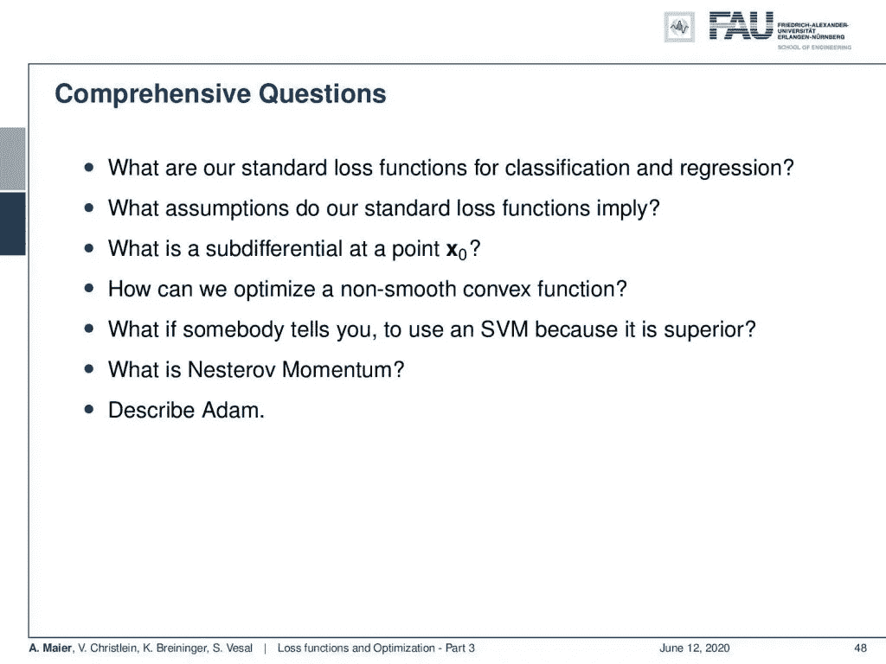

可能有助于备考的问题。来自[深度学习讲座](https://www.youtube.com/watch?v=p-_Stl0t3kU&list=PLpOGQvPCDQzvgpD3S0vTy7bJe2pf_yJFj&index=1)的 [CC BY 4.0](https://creativecommons.org/licenses/by/4.0/) 下的图片。

一些综合问题:“我们分类回归的标准损失函数是什么？”当然，L2 用于回归，交叉熵损失用于分类。你应该能推导出这些。这真的是你应该知道的事情，因为统计数据及其与学习损失的关系真的很重要。统计假设，概率理论，以及如何修改这些来得到我们的损失函数，都与考试高度相关。次微分也很重要。“什么是次微分？”"在我们的激活函数出现拐点的情况下，我们如何优化？"“铰链损耗是多少？”"我们如何合并约束？"尤其是“对于那些声称我们所有的技术都不好，因为 SVM 更好的人，我们该怎么说？”你总是可以证明，它取决于一个乘法常数，就像使用铰链损耗一样。“什么是内斯特罗夫势头？”如果有人在不久的将来会问你关于你在这里学到的东西的问题，你应该能够解释这些非常典型的事情。当然，我们又有大量的参考资料(见下文)。我希望你也喜欢这次讲座，我期待着在下一次讲座中见到你！

如果你喜欢这篇文章，你可以在这里找到更多的文章，或者看看我们的讲座。如果你想在未来了解更多的文章、视频和研究，我也会很感激你在 YouTube、Twitter、脸书、LinkedIn 上的鼓掌或关注。本文以 [Creative Commons 4.0 归属许可](https://creativecommons.org/licenses/by/4.0/deed.de)发布，如果引用，可以转载和修改。

# 参考

[1]克里斯托弗·贝肖普。模式识别和机器学习(信息科学和统计学)。美国新泽西州 Secaucus 出版社:纽约斯普林格出版社，2006 年。
[2]安娜·乔洛曼斯卡，米凯尔·赫纳夫，迈克尔·马修等人，“多层网络的损耗面”在:AISTATS。2015.
【3】Yann N Dauphin，Razvan Pascanu，卡格拉尔·古尔切赫勒等《高维非凸优化中鞍点问题的识别与攻击》。神经信息处理系统进展。2014 年，第 2933–2941 页。
[4]宜川唐。“使用线性支持向量机的深度学习”。载于:arXiv 预印本 arXiv:1306.0239 (2013 年)。
[5]萨尚克·雷迪、萨延·卡勒和桑基夫·库马尔。《论亚当和超越的趋同》。国际学习代表会议。2018.
[6] Katarzyna Janocha 和 Wojciech Marian Czarnecki。“分类中深度神经网络的损失函数”。载于:arXiv 预印本 arXiv:1702.05659 (2017)。
【7】Jeffrey Dean，Greg Corrado，Rajat Monga 等，《大规模分布式深度网络》。神经信息处理系统进展。2012 年，第 1223-1231 页。
[8]马人·马赫瑟雷奇和菲利普·亨宁。“随机优化的概率线搜索”。神经信息处理系统进展。2015 年，第 181–189 页。
【9】杰森·韦斯顿，克里斯·沃特金斯等《多类模式识别的支持向量机》在:ESANN。第 99 卷。1999 年，第 219-224 页。
[10]·张，Samy Bengio，Moritz Hardt 等，“理解深度学习需要反思泛化”。载于:arXiv 预印本 arXiv:1611.03530 (2016)。