# 使用深度学习的乐高迷你人物性别分类

> 原文：<https://towardsdatascience.com/lego-minifigure-gender-classification-using-deep-learning-2358f4082842?source=collection_archive---------68----------------------->

## [实践教程](https://towardsdatascience.com/tagged/hands-on-tutorials)

## 与 CNN 的和转移学习


由[詹姆斯·庞德](https://unsplash.com/@jamesponddotco?utm_source=medium&utm_medium=referral)在 [Unsplash](https://unsplash.com?utm_source=medium&utm_medium=referral) 上拍摄的照片

通过我在 [Udacity 的深度学习纳米学位](/how-i-learned-deep-learning-in-9-months-f5ddaefd3e3b)的卷积神经网络(CNN)部分的工作旅程，我决定从事我自己的项目，看看 CNN 是否能够对乐高迷你人物的性别进行分类。

我决定这样做的原因是因为我是一个乐高迷，多年来一直在收集迷你玩具。我想我现在有超过 200 个小家伙，大部分是从[盲袋](https://www.lego.com/en-ca/product/series-20-71027)中获得的。

哦，我还拍了他们的照片，分享到 Instagram 上！

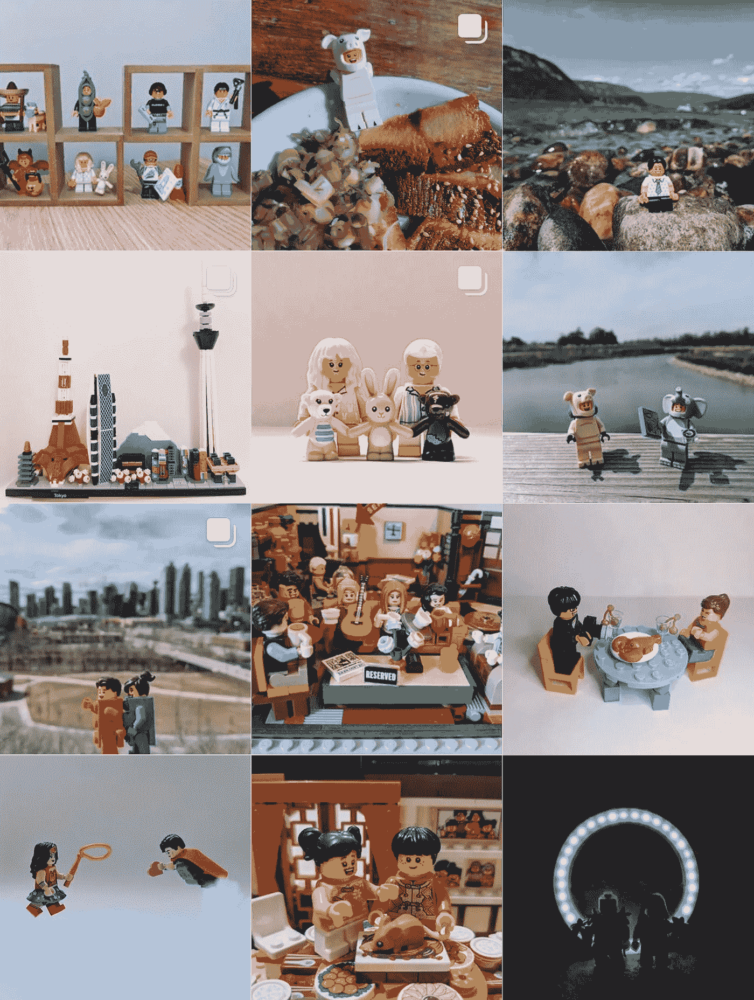

Instagram: @Let_It_Lego

# 为什么要用迁移学习？

迁移学习是指使用预先训练好的神经网络，并将其用于不同的数据集。

由于我有一个小数据集，我想利用 [ImageNet 的](http://www.image-net.org/)预训练图像，因为它有许多人和衣服的照片，所以应该更容易确定迷你人物的特征。由于人体特征和迷你人物服装的相似性，我会将我的数据集归类为与 ImageNet 中的相似。

根据 Udacity 的说法，如果新数据集很小，并且与原始训练数据相似，则必须按如下方式更改神经网络:

*   切掉神经网络的末端
*   添加与新数据集中的类数量相匹配的新完全连接图层
*   随机化新的全连接层的权重；冻结预训练网络的所有权重(以避免过度拟合)
*   训练网络以更新新的全连接层的权重


在神经网络的末端添加并训练全连接层。资料来源:Udacity

您将在后面的代码中看到我是如何做到这一点的。

# 收集数据

我给我自己的迷你人像拍了照片来组成数据集。由于我只有有限的数量(超过 200 张)，我从不同的角度拍摄了每个迷你人像的照片，以便为数据集获取更多的照片。

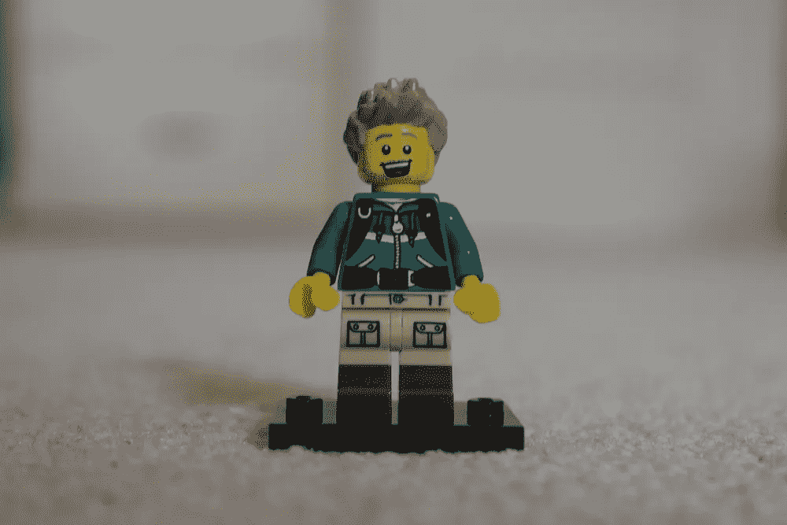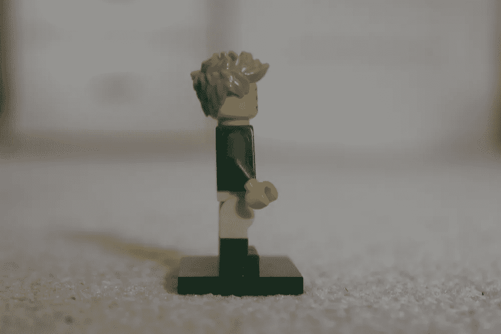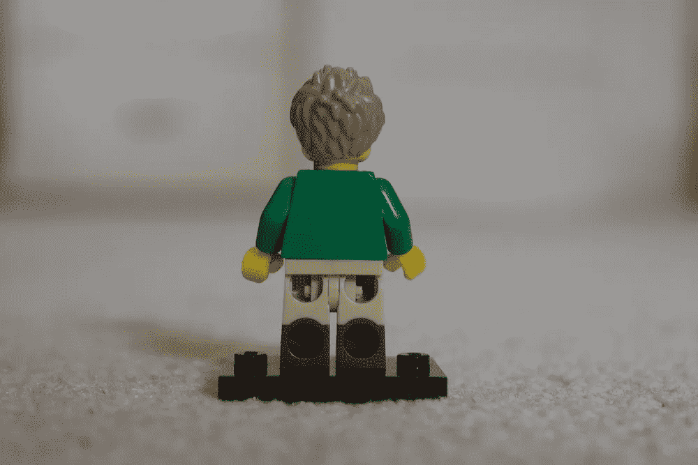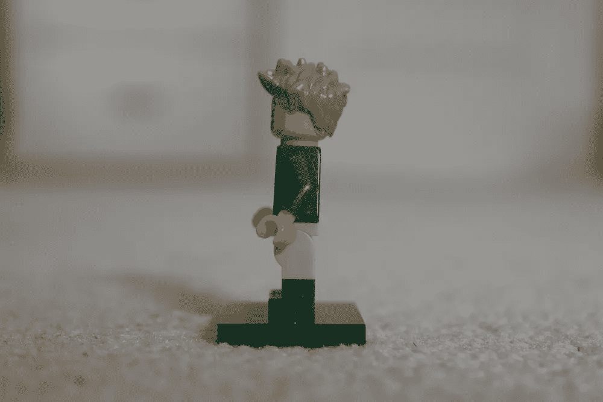

为了确保 CNN 不会接触到不容易区分男性和女性的物品，我确保脱下了迷你人佩戴的任何配饰，比如这些:

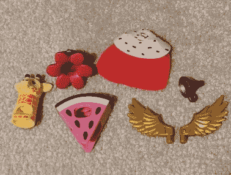

斗篷，服装，怪异的帽子，等等。

我也没有包括像这些人一样不是人类的迷你人:

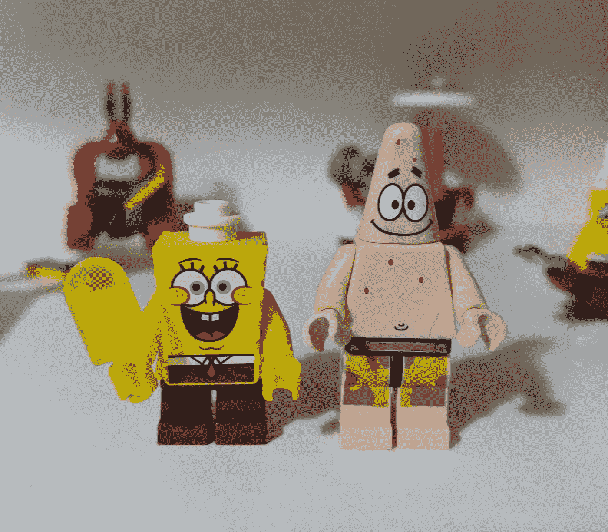

海绵宝宝！

最后，我的数据集看起来像这样:

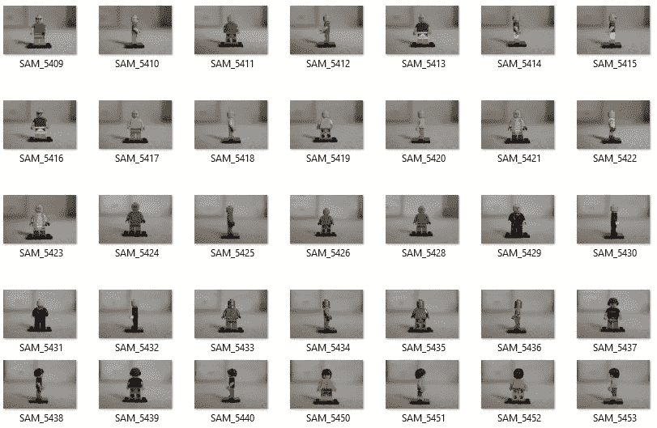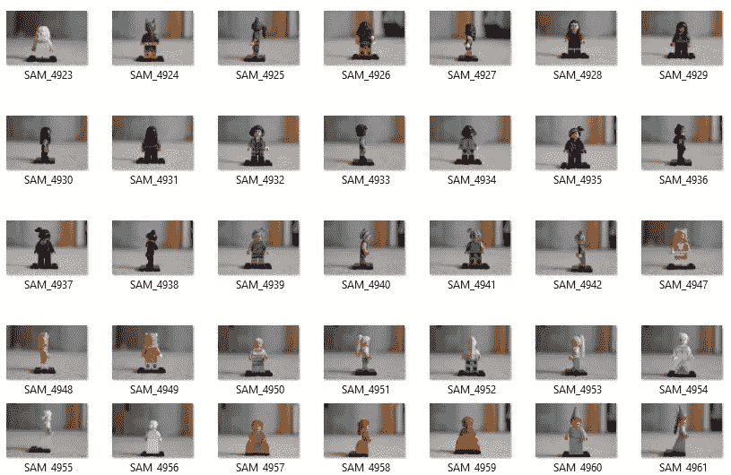

照片数据集的片段。

# 代码

我首先在库中加载:

```
%matplotlib inline
%config InlineBackend.figure_format = 'retina'import matplotlib.pyplot as plt
import numpy as np
import torch
from torch import nn
from torch import optim
import torch.nn.functional as F
from torchvision import datasets, transforms, models
```

并检查了 Cuda 是否可用，以便我可以利用谷歌 Colab 的 GPU。

```
train_on_gpu = torch.cuda.is_available()if not train_on_gpu:
    print('CUDA is not available.  Training on CPU ...')
else:
    print('CUDA is available!  Training on GPU ...')
```

# 加载和转换数据集

我将完成的数据集作为 zip 文件保存到 Dropbox 中，其中的内容被拆分到一个 Train/Test 文件夹中，另一个 Boy/Girl 文件夹位于其中。

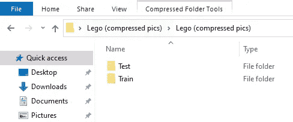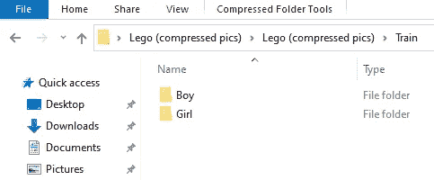

然后我生成了一个下载链接，这样我就可以使用`!wget`和`!unzip`将图片加载到 Google Colab 中。

由于我拍摄的图像尺寸很大，我需要对它们进行转换，以便输入数据可以与预先训练的模型所期望的(在我的例子中，是 VGG16)一起工作。我还使用了 PyTorch 的 ImageFolder 类，以便能够从我在 zip 文件中创建的 train 和 test 文件夹中加载数据。

```
data_dir = 'Lego (compressed pics)'# VGG-16 Takes 224x224 images as input, so we resize all of them
data_transform = transforms.Compose([transforms.Resize((224, 224)),
                                     transforms.ToTensor()])train_data = datasets.ImageFolder(data_dir + '/Train',              
transform=data_transform)test_data = datasets.ImageFolder(data_dir + '/Test',             
transform=data_transform)
```

在这里你可以看到我是如何将照片分配到一个训练和测试集的。

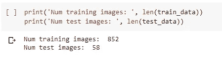

训练和测试图像的数量。

为训练和测试数据集创建数据加载器:

```
# how many samples per batch to load
batch_size = 20# number of subprocesses to use for data loading
num_workers = 0train_loader = torch.utils.data.DataLoader(train_data, 
batch_size=batch_size, num_workers=num_workers, shuffle=True)test_loader = torch.utils.data.DataLoader(test_data, 
batch_size=batch_size, num_workers=num_workers, shuffle=True)# specify the image classes
classes = ['Boy', 'Girl']
```

现在我们来可视化一批训练数据。

```
# obtain one batch of training images
dataiter = iter(train_loader)
images, labels = dataiter.next()
images = images.numpy()  # convert images to numpy for display# plot the images in the batch, along with the corresponding labels
fig = plt.figure(figsize=(25,4))
for idx in np.arange(20):
  ax = fig.add_subplot(2, 20/2, idx+1, xticks=[], yticks=[])   
  plt.imshow(np.transpose(images[idx], (1, 2, 0)))   
  ax.set_title(classes[labels[idx]])
```

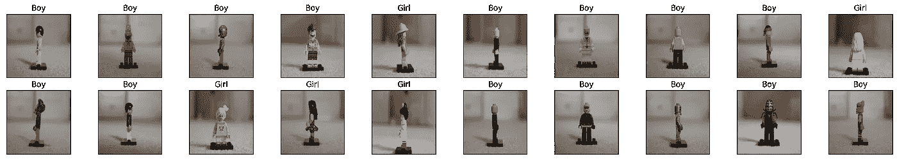

可视化一批训练数据。

# 定义模型

这将通过加载预训练的 VGG16 模型来实现。

```
# Load the pretrained model from PyTorch
vgg16 = models.vgg16(pretrained=True)# Freeze training for all feature layers so the model doesn't change # the parameters it was pre-trained on
for param in vgg16.features.parameters(): 
    param.requires_grad = False
```

如前所述，预训练模型的分类器不符合我们试图实现的目标，因为它的最后一层输出 1000 个特征，而我们只需要 2 个(因为我们只有男孩和女孩两个类)。

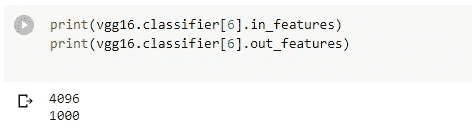

所以我们需要去掉最后一层，用我们自己的线性分类器代替它。

```
n_inputs = vgg16.classifier[6].in_features
last_layer = nn.Linear(n_inputs, len(classes))vgg16.classifier[6] = last_layerif train_on_gpu:
    vgg16.cuda()
```

现在分类器就是我们想要的了！

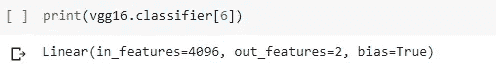

指定损失函数和优化器。

```
criterion = nn.CrossEntropyLoss()
optimizer = optim.SGD(vgg16.classifier.parameters(), lr=0.001)
```

# 训练网络

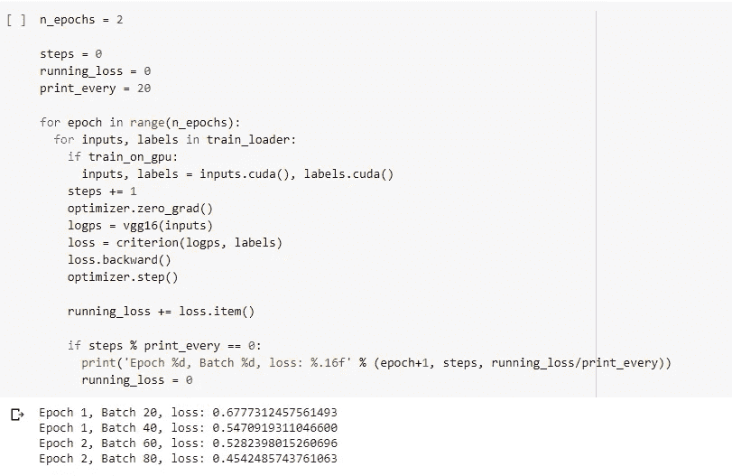

训练网络。

# 测试

下面，您可以看到通过对以前看不到的数据测试训练模型来确定每个性别类别的准确性。换句话说，我们使用训练好的模型来预测迷你人的性别，并将其与实际性别(目标)进行比较。

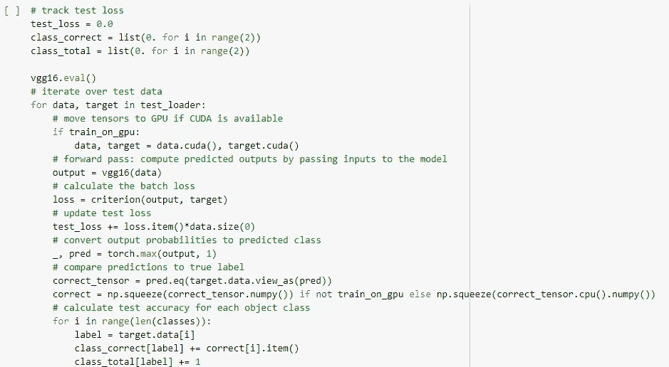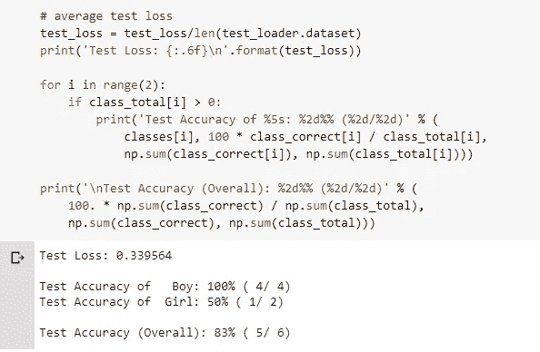

确定测试精度。

# 可视化测试结果

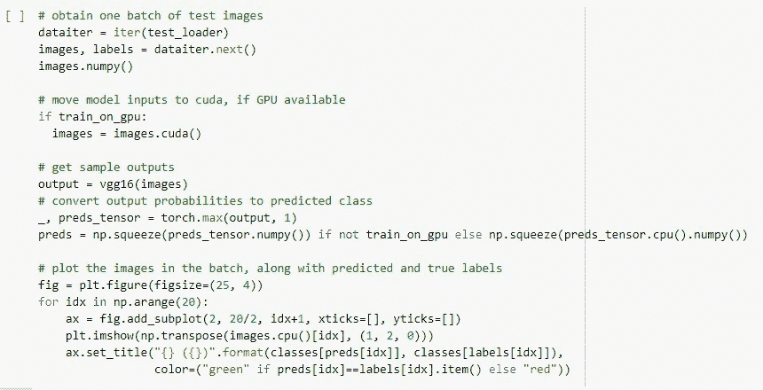

可视化样本的测试结果。

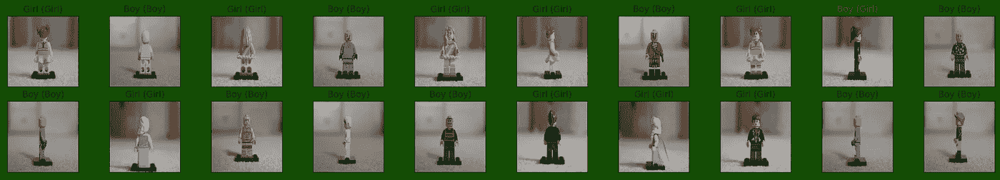

样本结果！

# 结论

结果似乎相当不错！在测试的 20 幅样本图像中，只有一幅预测了错误的性别。请记住，我只使用了一个小数据集，所以如果我有一个更大的数据集，结果可能会改变。

如果你有兴趣更详细地阅读我的代码，请访问下面我的 Github。

[](https://github.com/oscarkwok/Lego-Gender/blob/main/Classifying_Lego_Minifigure_Gender.ipynb) [## oscarkwok/乐高-性别

### GitHub 是超过 5000 万开发者的家园，他们一起工作来托管和审查代码，管理…

github.com](https://github.com/oscarkwok/Lego-Gender/blob/main/Classifying_Lego_Minifigure_Gender.ipynb) 

这是一个有趣的项目，我能够应用我从 Udactiy 的深度学习纳米学位中学到的东西。随着课程的进展，我希望能写更多关于我的项目，敬请关注！

如果您有任何问题或意见，请在下面留下您的反馈。你也可以在 [Linkedin](https://www.linkedin.com/in/oscarkwok/) 上关注我，或者在这里与我[联系。](https://linktr.ee/oscarkwok)