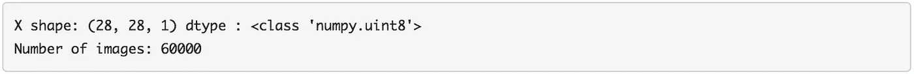
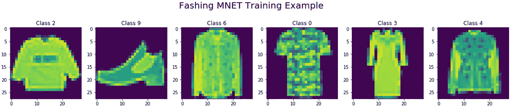
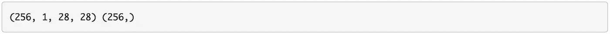
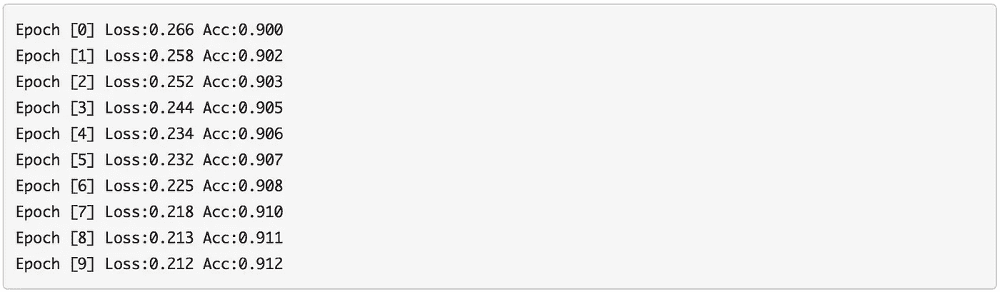
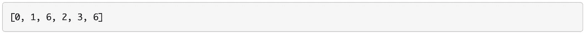
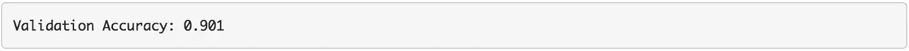

# 基于 GluonCV 的图像分类网络

> 原文：<https://towardsdatascience.com/lenet-for-image-classification-using-gluoncv-829ae7ec4715?source=collection_archive---------61----------------------->

## 使用 gluoncv 的不同组件，如 autograded、trainer、dataset 和 dataloader 来训练用于图像分类的 [LeNet 网络](http://yann.lecun.com/exdb/lenet/)。

在[之前的文章](/image-classification-using-gluoncv-f6ae5401d6ae)中，我们讨论了在预训练的网络上使用 GluonCV 进行图像分类。在本文中，我们将讨论如何通过训练 [LeNet](http://yann.lecun.com/exdb/lenet/) 来实现二进制图像分类器，通过将 gluoncv 的不同组件(如自动签名、训练器、数据集和数据加载器)集合在一起来训练 LeNet 网络。我们可以通过编写一个训练循环来完成这个任务。

1.  **导入库**

我们首先导入库。我们初始化 ***mxnet.init*** 用于更多的参数初始化方法， ***matplotlib*** 用于绘图， ***time*** 用于基准测试以及其他胶子包。

```
from mxnet import nd, gluon, init, autograd, metric
from mxnet.gluon import nn
from mxnet.gluon.data.vision import datasets, transforms

import matplotlib.pyplot as plt
from time import time
```

**2。数据**

我们将使用 ***时尚 m-nest*** 数据集进行训练。

**2.1 负载数据:**

时尚 m-nest 数据集通过***gluonsdata . vision . datasets***模块自动下载。可以使用以下代码下载数据集。它还显示了第一个示例的属性。

```
mnist_train = datasets.FashionMNIST(train=True)
x, y = mnist_train[0]

print('X shape: %s dtype : %s' % (x.shape, x.dtype))
print('Number of images: %d'%len(mnist_train))
```



该数据集中的每个示例都是一幅 28×28 边的灰度图像，以形状格式为 ***高 X 宽 X 通道*** 的 NDRA 呈现。标签是一个标量。

**2.2 可视化数据**

为了理解这些数据，我们可以将最初的几幅图像可视化。我们可以看到它们是诸如套头衫、短靴、衬衫、t 恤、连衣裙和外套等服装项目的低保真度图像。

```
fig, axes = plt.subplots(1,6, figsize=(20, 4))
fig.suptitle("Fashing MNET Training Example", fontsize=20)
for idx in range(6):
    axes[idx].imshow(mnist_train[idx][0][:,:,0].asnumpy())
    axes[idx].set_title('Class {}'.format(mnist_train[idx][1]))
```



**2.3 转换数据**

每张图像都需要转换成 ***通道 X 高度 X 宽度*** 、带浮点数据类型的张量格式，这可以通过***transforms . totenser***来完成，以便将数据馈入胶子网络。此外，我们可以使用平均值为 0.13、标准差为 0.31 的归一化变换来归一化所有像素值。我们使用由 ***合成*** 的转换将这两个转换链接在一起，并将其应用于数据对的第一个元素，即图像。

```
transformer = transforms.Compose([transforms.ToTensor(), transforms.Normalize(0.13, 0.31)])

mnist_train = mnist_train.transform_first(transformer)
```

**2.4 数据加载**

***时尚 m-nest*** 是***glon . data . dataset***的子类。为了在训练中使用它，我们需要通过网络输入随机批次的例子，这可以很容易地通过胶子数据加载器完成。对于复杂的数据转换，我们将使用 256 的批处理大小和四个工作线程来并行处理数据。返回的训练数据是一个迭代器，它产生成批的图像和标签对。

```
batch_size = 256
train_data = gluon.data.DataLoader(mnist_train, batch_size=batch_size, shuffle=True, num_workers=4)

for data, label in train_data:
    print(data.shape, label.shape)
    break
```



**3。型号**

我们实现了 [LeNet 网络](http://yann.lecun.com/exdb/lenet/)；Yann LeCun 等人在 1998 年提出的一种卷积神经网络结构。

**3.1 LeNet**

LeNet 指的是 lenet-5，是一个简单的卷积神经网络。


LeNet-5 架构(卷积神经网络)[图片来源](https://www.pyimagesearch.com/2016/08/01/lenet-convolutional-neural-network-in-python/)

LeNet5 模型包括两个卷积，然后是 MaxPooling 块，接着是一系列密集层，卷积层的“relu”激活，以及除最后一个密集层之外的所有密集层。但是，对于深度卷积神经网络，我们将权重初始化方法改为 ***Xavier*** 。

```
LeNet5 = nn.Sequential()
with LeNet5.name_scope():
    LeNet5.add(
            nn.Conv2D(channels=6, kernel_size=5, activation='relu'),
            nn.MaxPool2D(pool_size=2, strides=2),
            nn.Conv2D(channels=16, kernel_size=3, activation='relu'),
            nn.MaxPool2D(pool_size=2, strides=2),
            nn.Flatten(),
            nn.Dense(120, activation='relu'),
            nn.Dense(84, activation='relu'),
            nn.Dense(10)
    )
LeNet5.initialize(init=init.Xavier())
```

**3.2 损失函数**

除了神经网络之外，我们需要定义在训练期间最小化的损失函数。我们将使用标准的 softmax 交叉熵来解决分类问题。它首先对输出执行 softmax 以获得预测的概率，然后将标签与交叉熵进行比较。当真实类别被分配低概率时，交叉熵将会很高。

```
softmax_cross_entropy = gluon.loss.SoftmaxCrossEntropyLoss()
```

**3.3 公制(精度)**

我们还需要定义一个准确性指标来衡量网络的性能。为了计算准确性，我们只需要将我们的模型输出或预测与地面真实标签进行比较，并计算输出与标签匹配的部分。Mxnet 有一个预定义的度量库，我们可以只使用那里定义的精度类。

```
train_acc = metric.Accuracy()
```

**4。培训师/优化**

我们还需要定义在训练期间更新模型参数的胶子训练器。我们挑选的优化方法是标准的随机梯度下降法，学习率为 0.1。使用网络中的所有参数创建训练器。稍后，我们只需要调用训练器的 step 方法来更新网络宽度。

```
trainer = gluon.Trainer(LeNet5.collect_params(), 'sgd',{'learning_rate':0.1})
```

**4.1 训练循环**

在这一步中，我们将实施完整的培训循环。

我们将经历 10 个时期的训练，这意味着我们将在整个数据集上迭代 10 次，对于每个时期，我们将记录训练损失、训练精度和训练速度。批次上的训练循环发生在历元循环内。

我们迭代训练数据加载器，获得成批的训练数据和训练标签。使用自动记录范围，我们计算模型向前传递。首先，我们获得将数据批量馈送到网络的结果，然后我们使用网络输出和训练水平来计算损失。这些执行是在自动签名内执行的，以便记录操作，为计算梯度时的反向传递做好准备。正如我们在前面章节中看到的，这是通过对损失调用逆向函数来实现的。

最后，我们可以通过调用 ***trainer.step*** 使用计算机梯度更新网络参数。这就完成了一个批次的训练过程。

在进入该时期中的下一批之前，我们记录训练损失和训练准确度，用于内务处理。在每个训练时期结束时，我们还打印该时期后的精度损失。

```
for epoch in range(10):
    train_loss = 0
    tic = time()
    for data, label in train_data:
        with autograd.record():
            output = LeNet5(data)
            loss = softmax_cross_entropy(output, label)
        loss.backward()

        trainer.step(batch_size)

        train_loss += loss.mean().asscalar()
        train_acc.update(label, output)

    print("Epoch [%d] Loss:%.3f Acc:%.3f"%(epoch, train_loss/len(train_data), train_acc.get()[1]))

LeNet5.save_parameters("trained_LeNet5.params")
```



如我们所见，在每个历元之后，损失在减少，并且准确度在增加，这表明训练过程正在工作，并且模型正在学习。经过 10 个时期后，我们能够在训练数据上达到大约 91%的准确率。经过 10 次训练后，用安全参数法保存模型参数。这将在 params 文件中训练当前状态的参数。

**5。验证**

我们将所有参数保存到一个文件***trained _ lenet 5 . params***。现在，让我们把它装回去。要从 params 文件向网络加载参数，我们可以简单地使用网络的 load parameters 方法或任何 glue 和 block。

```
LeNet5.load_parameters('trained_LeNet5.params')
```

我们将通过运行一些预测来评估经过训练的模型。

**5.1 验证数据**

在运行预测之前，我们需要一个数据集，特别是模型尚未见过的数据集。我们可以使用时尚名人数据集的验证或测试分割来进行评估。我们可以通过将趋势关键字参数设置为 false 来选择它。

```
mnist_val = datasets.FashionMNIST(train=False)
```

**5.2 数据转换**

就像我们为训练所做的数据转换一样，我们需要完全相同的转换来进行预测。数据转换由两个转换组成。

1.  将输入图像转换为张量
2.  使用平均值和标准偏差标准化图像。

```
transform_fn = transforms.Compose([
                transforms.ToTensor(), 
                transforms.Normalize(0.13, 0.31)])
```

**5.3 预测**

例如，我们将预测验证数据集中的前六幅图像。为此，我们迭代我们想要预测的每个图像。首先，我们应用转换，并为我们的网络预期的批量大小添加一个额外的维度。接下来，我们获得每个类的网络预测，并且我们可以采用 argmax 来获得网络将 IRS 置信度分配给的类。然后我们可以开始预测，这样我们就可以将它与验证级别进行比较。

```
preds = []
for idx in range(6):
    image, label = mnist_val[idx]
    image = transform_fn(image).expand_dims(axis=0)
    pred = LeNet5(image).argmax(axis=1)
    preds.append(pred.astype('int32').asscalar())
print(preds)
```



**5.4 可视化结果**

我们可以将我们预测的图像和顶部的地面实况标签与底部的网络预测进行比较。下面的代码片段做到了。

```
fig, axes = plt.subplots(1,6, figsize=(20, 4))
fig.suptitle("Predicted vs True Class on Validation Data", fontsize=20)
for idx in range(6):
    axes[idx].imshow(mnist_val[idx][0][:,:,0].asnumpy())
    axes[idx].set_title('True [{}] \n Predicted [{}]'.format(mnist_val[idx][1], preds[idx]))
```


我们看到，网络在预测商品的正确时尚类别方面做得很好，或者犯了一些错误，将类别 2 误认为类别 6。

**5.5 验证数据加载器**

我们只是在验证数据的子集上评估了模型。为了使用整个验证数据集，我们可以创建一个验证数据负载，就像我们在培训期间所做的那样。我们说批量大小为 256 类似于火车数据加载器，并应用相同的转换。但是我们不必洗牌，因为我们不是在训练网络。我们还需要定义用于评估模型性能的指标。因为我们在培训中使用了准确性，所以我们将使用同样的方法进行验证。我们可以简单地使用 MxN 矩阵包中的精度度量类。

```
batch_size = 256
val_data = gluon.data.DataLoader(mnist_val.transform_first(transform_fn),   batch_size=batch_size, num_workers=4)val_acc = metric.Accuracy()
```

**5.6 验证循环**

现在，我们可以实现完整的验证循环。我们只需要检查验证数据加载或需求，不像在培训中我们执行多个批处理。对于每批数据和验证数据集，我们使用模型进行一批预测。然后，我们可以使用模型的输出和基本事实验证自由来计算模型的准确性。对每一批进行求和，除以批数，得到模型的平均精度。

```
for data, label in val_data:
    output = LeNet5(data)
    val_acc.update(label, output)
print("Validation Accuracy: %0.3f"%(val_acc.get()[1]))
```



对于我们训练的模型，我们可以看到 90%的验证准确性非常接近 91%的训练准确性。这意味着该模型很好地概括了新的例子。

> 成为媒体会员[这里](https://medium.com/@rmesfrmpkr/membership)支持独立写作，每月 5 美元，获得媒体上的所有故事。