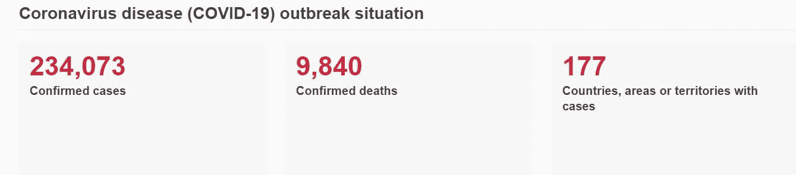
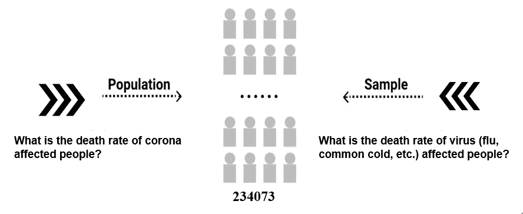
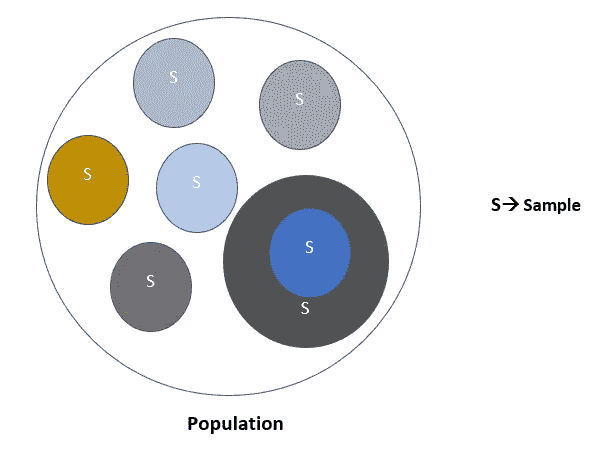
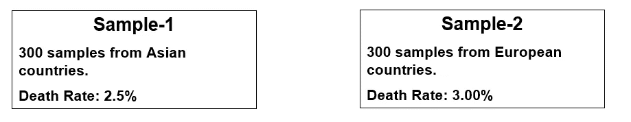
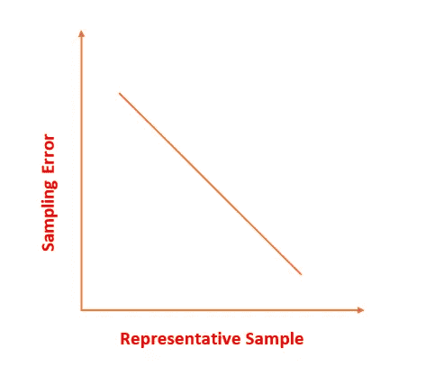
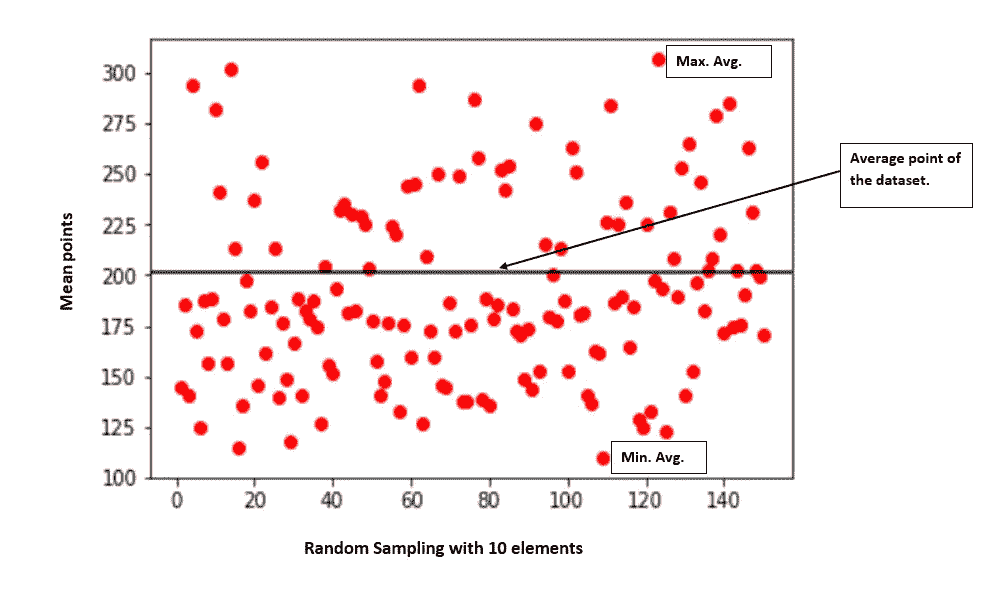
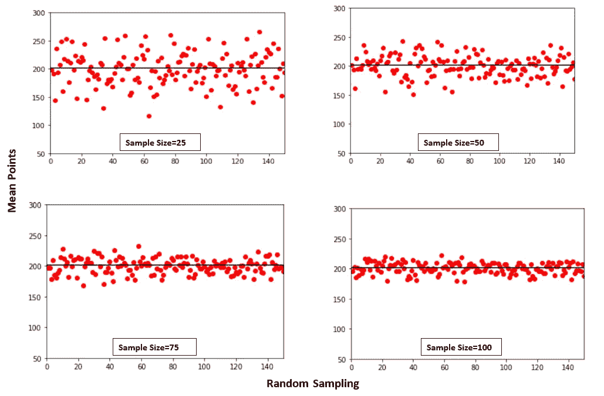
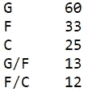

# 少即是多；取样的“艺术”( Stat-01)

> 原文：<https://towardsdatascience.com/less-is-more-the-art-of-sampling-dda8b59d399?source=collection_archive---------27----------------------->


丹尼尔·利维斯·佩鲁西在 [Unsplash](https://unsplash.com/?utm_source=unsplash&utm_medium=referral&utm_content=creditCopyText) 上的照片

## 使用样本提高您对大量数据集的数据分析能力

*“被数据所感动是一个真正聪明的人的标志。”*

*—乔治·萧伯纳*

当今的世界是由数据科学驱动的。在生活的每一分钟，我们都在使用数据科学。它是机器学习、物联网、大数据等的组成部分。在幕后，统计数据驱动着所有这些。它是现代技术的大脑。如果你被统计数据所感动，你很容易做出明智的决定。如果你不是一个专业的统计学家，一个统计决策也会适得其反。**样本**是统计学的一个基本要素，它指导数据科学家更容易、更有效地分析整个主题。大多数情况下，处理大型数据集几乎是不可能的，这就是**样本**让事情……发生的地方！

> “我认为远离完全照搬别人的记录是创新和非常有创造性的。对我来说，这并不能展示你太多的创造性，除非你拿一小块加进去，就像在鸡肉上加香料一样。”——梅西·埃丽奥特。

为更好的模型创建最佳样品时应遵循的完美报价。在抽样的情况下，我们必须有创造性。但是怎么做呢？别担心，我会按照大小姐说的，帮你做辣子鸡。跟我来。

*统计/数学不枯燥，很有趣，试着把自己和自然与它联系起来。现在，让我来引导你。*

## 路标

在数据科学中，使用基本统计学。大多数情况下，数据科学家不会考虑像采样技术这样的小问题。但对于数据驱动的方法来说，这可能是一个至关重要的问题。我们将讨论以下部分:

*   用样品介绍我们自己的故事
*   取样误差
*   制作有效的样本
*   抽样在数据科学领域的重要性

我们继续吧。

## ✴温和的从当前的疫情冠状病毒开始


由[jusdoveyage](https://unsplash.com/@jusdevoyage?utm_source=medium&utm_medium=referral)在 [Unsplash](https://unsplash.com?utm_source=medium&utm_medium=referral) 上拍摄的照片

随着疫情电晕的爆发，全世界都在休息。甚至世界仍然不知道如何对待疫情。

2019 年 11 月-17 日，首例人感染冠状病毒[1]。医学专家认为这个病例是肺炎，因为这是前所未见的。这种病毒呈几何级数扩散。一个月内，病毒感染了许多人。2019 年 12 月 31 日，世卫组织获悉在中国湖北省武汉市发现了不明原因的肺炎聚集性病例[2]。现在，病例急剧增加。根据世卫组织的说法，目前情况的统计如下所示。



冠状病毒统计照片[世卫组织](https://www.who.int/emergencies/diseases/novel-coronavirus-2019)(2020 年 3 月 21 日)

[*查找冠状病毒的最新统计数据。*](https://experience.arcgis.com/experience/685d0ace521648f8a5beeeee1b9125cd)

这里，**统计**的知识就进来了。在这个阶段的开始，电晕的情况是少数。任何人都可以很容易地单独分析这些案例。万一变成流行病呢！当发生的范围变大时，就超出了我们分析个案的能力。那么在这种情况下我们该怎么办呢？我们会放弃吗？一点也不。

例如，我们请了一位数据科学家来帮助我们。并告诉他找出冠状病毒感染者的死亡率。然后他要求我们收集 300 个确诊病例的数据。他还补充道，***这 300 个案例足以知道所有电晕案例的行为。*****这 300 例是全球整体受影响人群的样本。如果我们考虑所有的 234073 例确诊病例(确诊总数)，这个样本就会变成一个人群。所以，**总体**定义了一个具体案例的所有数据。如果我们改变问题，样本和总体的概念可能会改变。*如何？似乎很困惑！***

## **深入挖掘，消除困惑**

****

**从不同角度看人口和样本(按作者)**

**一组数据是样本还是总体，取决于我们试图回答什么样的问题。图像描绘了全球冠状病毒确诊病例总数为 234073 例。如果我们试图找出世界上的人是否受到冠状病毒的影响，那么由 234073 名冠状病毒感染者组成的群体就是一个群体。因为冠状病毒感染总人数是 234073 人。另一方面，如果我们试图找出世界人民是否受到任何病毒的影响，那么由 234073 人组成的群体就是一个样本。因为世界上有很多病毒，冠状病毒就是其中之一。**

****群体/样本的每个对象/病例被称为单位/点/事件**。**

****

**样本和总体的直觉(作者)**

**从总体中随机或有选择地选择样本元素。**

## **✴Sample 结果可能不同~采样误差**

**让我们假设，两个*样本*确认电晕案例。**

****

**我们可以找到两个不同样本的死亡率，如上图所示的。在每个样本中，我们得到不同的死亡率。而人口的死亡率就是期望死亡率。那哪个样品更好呢？我们如何衡量？变得迷惑不解！**

**最佳样本代表**总体结果**。世卫组织估计截至 2020 年 3 月 3 日的死亡率为 3.4%。假设这是我们**人口**死亡率的结果。**

**结果与**样本结果**略有不同。它被称为**采样误差。****

**对于上述情况，**

***样本误差，E1 =(3.4–2.5)% = 0.9%，E2 =(3.4–3.00)% = 0.4%。***

> **抽样误差=(总体结果-样本结果)**

## **✴Choosing 是最好的例子**

**一个成功的统计模型很大程度上依赖于**最优抽样**。*你在抽样时越有创意，你的模型就越准确(对人群有代表性)*。**

****

**代表性样本与抽样误差(按作者)**

**一个样本(好样本)代表**抽样误差**最小时的总体。为此，我们需要随机选择**样本**。**

*****现在，*** 我们用`[WNBA Player Stats Season 2016–17](https://www.kaggle.com/jinxbe/wnba-player-stats-2017)`数据集跳转到一个真实世界的例子。您也可以在这里找到[栏的文档。](https://www.basketball-reference.com/about/glossary.html)**

**假设，我们被要求用**最优抽样**找出玩家的平均点数。让我们从我们的创造力开始寻找最佳答案。**

## ****1。随机选择样本****

**`[WNBA Player Stats Season 2016–17](https://www.kaggle.com/jinxbe/wnba-player-stats-2017)` 数据集中有 143 位选手的数据。我们随机抽取 10 个样本数据进行 150 次分析玩家的平均得分。输出如下所示。**

****

**随机样本的散点图**

**由于只有 **10** 个个体数据，统计模型并不总是提供**个代表性样本**。因为有些样本的平均分远高于或低于总体的平均分。这是不可取的。我们走吧。**

## **2.**增加随机样本的样本量****

**当我们增加样本量时，我们的样本就更能代表总体。让我们通过`[WNBA Player Stats Season 2016–17](https://www.kaggle.com/jinxbe/wnba-player-stats-2017)` 数据集获得更多的视觉直觉。**

****

**不同随机样本大小的散点图**

**当样本大小为 100 时，所有随机样本都高度代表数据集，样本大小的每个**增量**都使随机样本更具代表性。**所以，取样的时候要把它记在脑子里。****

## ****3。将数据集分层，并从每个层中选择数据****

**数据集中有 5 种类型的球员。如果我们观察`[WNBA Player Stats Season 2016–17](https://www.kaggle.com/jinxbe/wnba-player-stats-2017)`数据集的`***‘***Pos***’***` 一栏，会发现以下几类玩家。**

```
**['F' 'G/F' 'G' 'C' 'F/C']**
```

*   **`F →Forward`**
*   **`G → Guard`**
*   **`C → Centre`**
*   **`G/F → Guard/Forward`**
*   **`F/C → Foward/Centre`**

**只有随机抽样选择可能会选择一些球员不会包含所有 5 种类型的球员。这可能导致样本模型代表性差。我们可以对所有 5 种类型的球员进行分层。**

****

**每种类型玩家出现的频率。**

**我们可以从每个阶层(每个分层的群体被称为阶层)中挑选同等数量的玩家来做样本。最佳选择是按比例选择元素。这种策略被称为**比例分层抽样。****

**这里，阶层的比例是*(相对于 143 名玩家)G → 42%，F →23%，C → 17%，G/F →10%，F/C →8%(大约。)*。比方说我们想要一个样本量为50 的样本。那么比例分层样本包括**

*   **`G → 25`**
*   **`F → 8`**
*   **`C → 5`**
*   **`G/F →1`**
*   **`F/C →1`**

**我们也可以用其他参数分层。在最后一步，我们应该选择能提供最佳结果的最佳分层样本。**

## **4.巢式抽样法**

**有时，我们的数据集可能不像`[WNBA Player Stats Season 2016–17](https://www.kaggle.com/jinxbe/wnba-player-stats-2017)`数据集那样组织良好。它可能是分散的或难以收集的。在这些情况下，整群抽样有助于有效地分析数据。**

**让，你在处理冠状病毒的病例。你需要分析整个世界的数据。此外，没有一个中央数据中心，你可以通过它获得全世界的数据。现在，你需要从单个国家的网站上收集冠状病毒病例的数据。从世界所有国家收集数据可能需要几个月的时间。而且是不切实际的。**对于这种类型的案例，您需要随机选择一些国家，将一个国家视为一个集群。**现在，你的任务是从那些选定的国家收集数据。这种类型的采样被称为**整群采样*。*****

***到目前为止一切顺利……..***

**✴ **我们学到了很多关于采样的知识，但是如何处理采样呢？！！！！！！！！！****

****

**本·怀特在 [Unsplash](https://unsplash.com?utm_source=medium&utm_medium=referral) 上的照片**

**别担心，你的方向是对的。我们只是举了几个采样的例子。你可能会想，既然你可以通过人口来做得更好，那么还需要什么样的抽样方法。**

**让我们假设，你在一家跨国公司担任数据科学家，那里有一个数十亿客户交易的数据库。你老板让你根据交易找出客户类别。运用适当的采样技术，你可以很容易地找到你想要的结果。**

**您还可能遇到这样的情况，API 的使用受到限制，您需要为整个系统创建一个分析模型。*在这些情况下，你被迫取样。***

**在很多情况下，数据科学中采样是必不可少的。**

****抽样是统计学中的一个大话题。讨论所有这些问题超出了本文的范围。****

**如果您有兴趣了解更多关于采样的信息，请点击以下链接:**

*   **[可汗学院](https://www.khanacademy.org/math/statistics-probability/sampling-distributions-library)(免费教程)**
*   **[维基百科链接](https://en.wikipedia.org/wiki/Sampling_(statistics))**
*   **youtube 上其他著名的教程视频。**

## **✴Task(可选)**

**虽然我们已经学习了很少的抽样主题，但它有望涵盖实现数据科学的统计模型所需的知识。**

> **“在智力上，他们知道很多。实际上，他们选择了几乎一无所知”——彼得·本奇利**

**所以，现在试着做一些练习。它会给你一个亲身体验。最近公布了冠状病毒的数据集。从 [Kaggle](https://www.kaggle.com/sudalairajkumar/novel-corona-virus-2019-dataset#) 下载数据集。总共有 6 个数据集。我建议用`[covid_19_data.csv](http://.com/sudalairajkumar/novel-corona-virus-2019-dataset#covid_19_data.csv)`文件来分析。**

**找到以下内容**

*   **数据集的死亡率(人口死亡率)**
*   **用不同的参数尝试不同类型的采样技术(如上所述)**
*   **找出数据集的最佳样本**
*   **绘制结果输出**

```
**I suggest to use Python/R to complete the task.**
```

## **✴结论**

**实际上，统计分析依赖于**人口和**样本。广义而言，抽样是用来推断整个地区人口的特征。在大多数情况下，整个地区(人口)是如此之大，一个最佳的样本可以做大量的工作。**

**通过分析样本，我们试图描述一个群体。绘图有助于我们获得描述的视觉效果。**

****预测模型(机器学习等。)也可以根据样本创建。****

## **参考**

**[1] J. Ma，中国首例确诊新冠肺炎病例可追溯到 2020 年 11 月 17 日《南华早报》。**

**[2]新型冠状病毒—中国(2020)，世界卫生组织。**

**[3]世卫组织总干事在世界卫生组织 2020 年 3 月 3 日新冠肺炎媒体吹风会上的开幕词。**

*****数据科学统计系列文章*****

1.  **[*少即是多；取样的‘艺术’(Stat-01)*](/less-is-more-the-art-of-sampling-dda8b59d399?source=your_stories_page-------------------------------------)**
2.  **[*熟悉数据科学最重要的武器~变量(Stat-02)*](/get-familiar-with-the-most-important-weapon-of-data-science-variables-48cc7cd85dc5?source=your_stories_page-------------------------------------)**
3.  **[*要提高数据分析能力，你必须知道频率分布(Stat-03)*](/to-increase-data-analysing-power-you-must-know-frequency-distribution-afa438c3e7a4?source=your_stories_page-------------------------------------)**
4.  **[](/find-the-patterns-of-a-dataset-by-visualizing-frequency-distribution-c5718ab1f2c2?source=your_stories_page-------------------------------------)**
5.  ***[*比较多个频率分布，从数据集中提取有价值的信息(Stat-05)*](/compare-multiple-frequency-distributions-to-extract-valuable-information-from-a-dataset-10cba801f07b?source=your_stories_page-------------------------------------)***
6.  **[*通过简短的讨论消除你对均值的误解(Stat-06)*](https://medium.datadriveninvestor.com/eliminate-your-misconception-about-mean-with-a-brief-discussion-a9fed67d4b08?source=your_stories_page-------------------------------------)**
7.  **[*通过规范化提高您的数据科学模型效率(Stat-07)*](https://medium.datadriveninvestor.com/increase-your-data-science-model-efficiency-with-normalization-918484b4626f?source=your_stories_page-------------------------------------)**
8.  **[*数据科学的基本概率概念(Stat-08)*](/basic-probability-concepts-for-data-science-eb8e08c9ad92?source=your_stories_page-------------------------------------)**
9.  **[*从朴素贝叶斯定理到朴素贝叶斯分类器的路线图(Stat-09)*](/road-map-from-naive-bayes-theorem-to-naive-bayes-classifier-6395fc6d5d2a?source=your_stories_page-------------------------------------)**
10.  **[*数据科学爱好者关于假设检验需要知道的一切(Stat-10)*](https://medium.datadriveninvestor.com/all-you-need-to-know-about-hypothesis-testing-for-data-science-enthusiasts-30cfe1dce028?source=your_stories_page-------------------------------------)**
11.  **[*多组间统计比较用 ANOVA (Stat-11)*](/statistical-comparison-among-multiple-groups-with-anova-d4ac27f6e59e?source=your_stories_page-------------------------------------)**
12.  **[*用卡方检验(Stat-12)比较分类变量的相关性*](/compare-dependency-of-categorical-variables-with-chi-square-test-982baff64e81?source=your_stories_page-------------------------------------)**