# 鲜为人知但非常有用的熊猫功能

> 原文：<https://towardsdatascience.com/less-known-but-very-useful-pandas-functions-1e1756afb2a9?source=collection_archive---------16----------------------->

## 加快您的数据分析过程


埃里克·麦克林在 [Unsplash](https://unsplash.com/s/photos/pandas?utm_source=unsplash&utm_medium=referral&utm_content=creditCopyText) 上的照片

Pandas 是一个高效且广泛使用的数据分析工具。Pandas 的核心数据结构是**D**[**ATA frame**](https://pandas.pydata.org/pandas-docs/stable/reference/api/pandas.DataFrame.html)，它以表格的形式表示数据，带有标记的行和列。DataFrame 有许多强大而灵活的功能和方法，可以简化和加快数据清理和分析过程。在这篇文章中，我将介绍一些不常见但非常有用的熊猫函数。

我将介绍的功能:

*   激增
*   努尼克岛
*   检查
*   在哪里
*   推断对象

我们总是从导入所需的库开始:

```
import pandas as pd
import numpy as np
```

# **爆炸**

假设您的数据集在单个观测值(行)中包含一个要素的多个条目，但您希望在单独的行中对它们进行分析。

```
df = pd.DataFrame({'ID':['a','b','c'],
                  'measurement':[4,6,[2,3,8]],
                  'day':1})
df
```

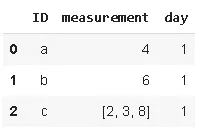

我们希望在单独的行上看到第“1”天“c”的测量值，使用**分解**很容易做到这一点:

```
df.explode('measurement').reset_index(drop=True)
```

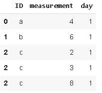

最好也重置索引:

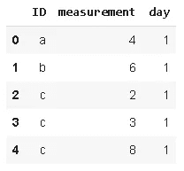

我们也可以在两列上使用爆炸作为一个链:

```
df2 = pd.DataFrame({'ID':['a','b','c'],
                   'measurement_1':[4,6,[2,3,8]],
                   'measurement_2':[1,[7,9],1],
                   'day':1})
df2
```

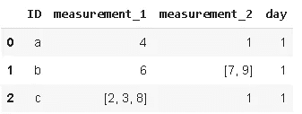

```
df2.explode('measurement_1').reset_index(drop=True).explode('measurement_2').reset_index(drop=True)
```

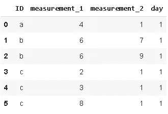

确保在第一次分解后使用 reset_index，否则会得到如下意外结果:

```
df2.explode('measurement_1').explode('measurement_2').reset_index(drop=True)
```

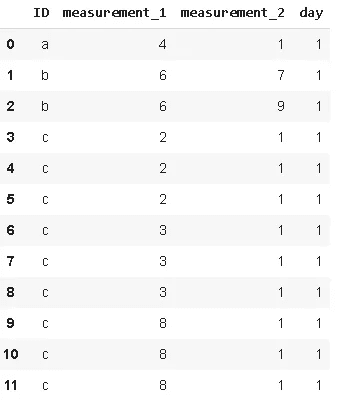

# **努尼克**

Nunique 计算列或行中唯一条目的数量。它在分类特征中非常有用，尤其是在我们事先不知道类别数量的情况下。


照片由[凯尔·格伦](https://unsplash.com/@kylejglenn?utm_source=unsplash&utm_medium=referral&utm_content=creditCopyText)在 [Unsplash](https://unsplash.com/s/photos/unique?utm_source=unsplash&utm_medium=referral&utm_content=creditCopyText) 上拍摄

假设我们有以下数据帧:

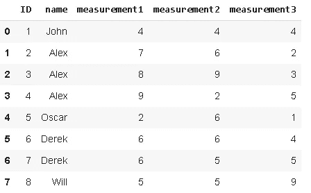

要查找列中唯一值的数量:

```
df.name.nunique()
5
```

我们可以使用稍微复杂一点的语法使用 **value_counts** 来获得相同的结果:

```
df.name.value_counts().shape[0]
5
```

然而， **nunique** 允许我们同时对所有列或行执行此操作:

```
df.nunique()  #columns
ID              8 
name            5 
measurement1    7 
measurement2    5 
measurement3    6
dtype: int64df.nunique(axis=1) #rows
0    3 
1    4 
2    4 
3    5 
4    5 
5    3 
6    4 
7    4 
dtype: int64
```

# **查找**

它可用于根据其他行、列对上的值在数据帧中查找值。这个函数最好通过一个例子来解释。假设我们有以下数据帧:

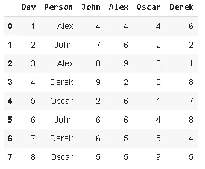

对于每一天，我们有 4 个人的测量值和一个包含这 4 个人的名字的列。我们希望创建一个新列，在“选择”列中显示该人的测量值:

```
df['Person_point'] = df.lookup(df.index, df['Person'])
df
```

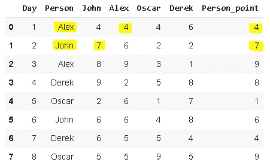

我们不必对所有数据点都进行这种操作。只要行标签和列标签具有相同的大小，我们就可以使用特定的范围:

```
df.lookup(df.index[:5], df['Person'][:5])array([4, 7, 9, 8, 1])
```

# **其中**

“Where”用于根据条件替换行或列中的值。您还可以指定要替换的值。默认值为 NaN。让我们复习一个例子，这样就清楚了。

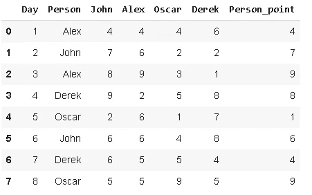

```
df['Person_point'].where(df['Person_point'] > 5)
0    NaN 
1    7.0 
2    9.0 
3    8.0 
4    NaN 
5    6.0 
6    NaN 
7    9.0 
Name: Person_point, dtype: float64
```

我们可以指定替换值:

```
df['Person_point'].where(df['Person_point'] > 5, 'Not_qualified')0    Not_qualified 
1    7.0 
2    9.0 
3    8.0 
4    Not_qualified 
5    6.0 
6    Not_qualified 
7    9.0 
Name: Person_point, dtype: float64
```

> 在大多数 Pandas 函数中使用的一个非常重要的参数是 **inplace** ，它保存数据帧中的更改。inplace 的默认值为 False，因此如果您不将其设置为 True，您对函数所做的更改将不会保存在数据帧中。

例如，我们没有将 inplace 设置为 True。让我们检查原始数据帧:

```
df
```


使用 inplace=True 执行相同的函数:

```
df['Person_point'].where(df['Person_point'] > 5, 'Not_qualified', inplace=True)df
```

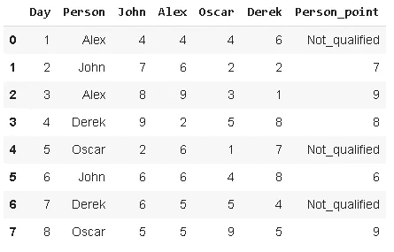

# **推断 _ 对象**

Pandas 支持广泛的数据类型，其中之一是**对象**。对象包含文本或混合(数字和非数字)值。但是，如果有不同的选项可用，则不建议使用对象数据类型。使用更具体的数据类型可以更快地执行某些操作。例如，我们更喜欢用整数或浮点数据类型来表示数值。

**infer_objects** 尝试为对象列推断更好的 dtypes。我们来看一个例子。

```
df = pd.DataFrame({'A': ['a', 1, 2, 3],
                   'B':['b',2.1,1.5,2],
                   'C':['c',True,False,False],
                   'D':['a','b','c','d']})df
```

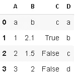

```
df = df[1:]df.dtypes
A    object 
B    object 
C    object 
D    object 
dtype: object
```

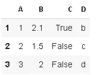

```
df.infer_objects().dtypesdf.dtypes
A      int64 
B    float64 
C       bool 
D     object 
dtype: object
```

# 结论

我在这里介绍的只是熊猫在数据分析过程中的一小部分能力，但肯定会在你的项目中有用。试图一下子全部学会是不合理的。相反，学习小块和通过实践吸收信息将帮助你建立全面的数据分析技能。

# 我关于熊猫和熊猫的其他帖子

*   [熊猫的时间序列分析](/time-series-analysis-with-pandas-e6281a5fcda0)
*   [熊猫数据分析实用指南](/a-practical-guide-for-data-analysis-with-pandas-e24e467195a9)
*   [时间序列分析—处理时区](/time-series-analysis-handling-time-zones-b6fcb324c7b)
*   [数据科学中最被低估的工具:NumPy](/the-most-underrated-tool-in-data-science-numpy-68d8fcbde524)
*   [数据科学中最被低估的工具:NumPy(第二部分)](https://medium.com/swlh/the-most-underrated-tool-in-data-science-numpy-part-2-d9bfb4b2313a)
*   [用熊猫组合数据帧](/combining-dataframes-using-pandas-b9e2e83b9869)
*   [用熊猫处理缺失值](/handling-missing-values-with-pandas-b876bf6f008f)
*   [熊猫的三大功能](https://medium.com/@soneryildirim1988/3-useful-functionalities-of-pandas-f4cb342a77ab)