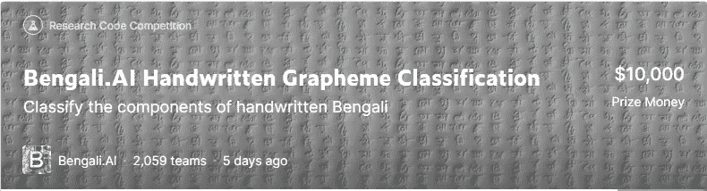
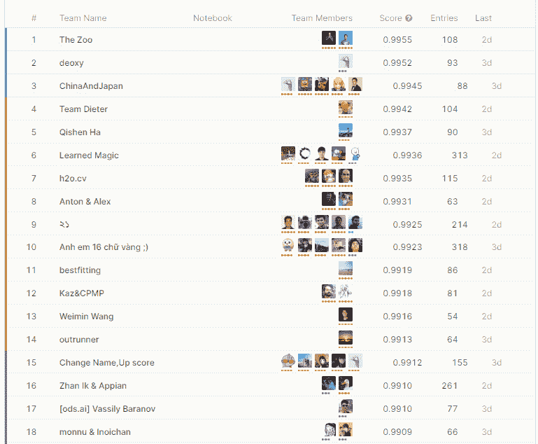
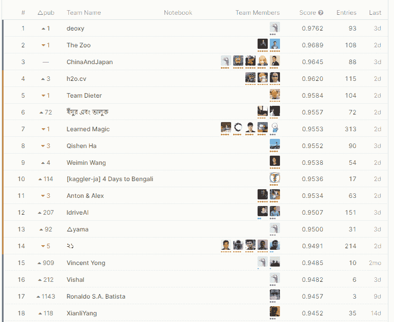
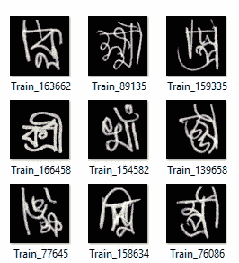
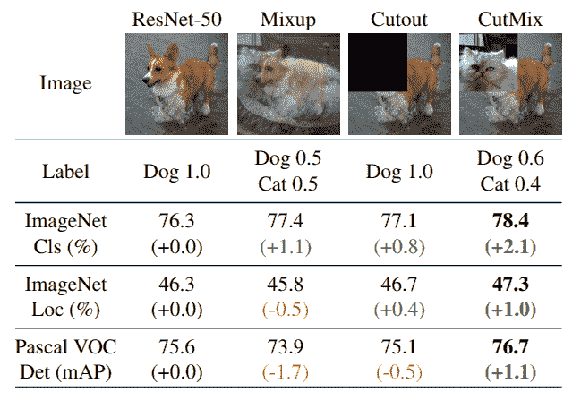
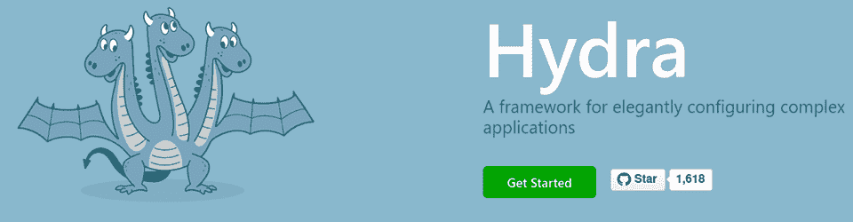
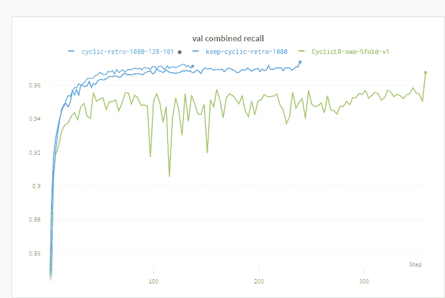
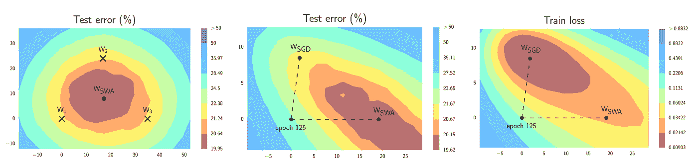
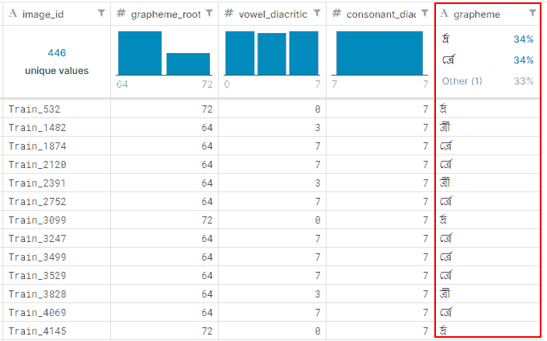

# 从 Kaggle —孟加拉影像分类竞赛中得到的启示

> 原文：<https://towardsdatascience.com/lesson-learnt-from-kaggle-bengali-image-classification-competition-39c1ed79adb1?source=collection_archive---------43----------------------->

[https://www.kaggle.com/c/bengaliai-cv19/?utm_medium=email&UTM _ source =对讲机&UTM _ campaign =孟加拉语-电子邮件-发射](https://www.kaggle.com/c/bengaliai-cv19/?utm_medium=email&utm_source=intercom&utm_campaign=bengaliai-email-launch)

我用 Github Page + [fastpages](https://github.com/fastai/fastpages) 创建了一个 [**新博客**](http://mediumnok.ml/) ，因为它对编码更友好，我基本上只是从那里复制[页面](https://mediumnok.ml/ml/kaggle/2020/03/21/10-lessons-learnt-from-Kaggle-competition.html)到 Medium，它工作得很好！你可以订阅 [**RSS**](https://mediumnok.ml/feed.xml) ，我仍然会在媒体上发布，但可能会在新博客上发布更多关于编码的内容。

# 介绍

我和一个朋友组队参加了[孟加拉图片分类比赛](https://www.kaggle.com/c/bengaliai-cv19/?utm_medium=email&utm_source=intercom&utm_campaign=bengaliai-email-launch)。在整个比赛中，我们努力在公共排行榜上获得高排名。最后，结果让所有人都大吃一惊，因为排行榜震动很大。

[https://www.kaggle.com/c/bengaliai-cv19/leaderboard](https://www.kaggle.com/c/bengaliai-cv19/leaderboard)

【https://www.kaggle.com/c/bengaliai-cv19/leaderboard】

最终私信分数远低于公信分数。这表明大多数参与者都过度适应公共排行榜。

# 分类任务

这是一场图像分类比赛。我们需要预测孟加拉文字的 3 个部分`root`、`consonant`和`vowel`。像 MNIST 数据集一样，这是一个典型的分类任务。

[孟加拉语。艾](https://bengali.ai/)[https://www.kaggle.com/c/bengaliai-cv19/data](https://www.kaggle.com/c/bengaliai-cv19/data)

# 评估指标

竞赛使用宏观回忆作为评价标准。一般来说，人们在训练中的回忆率超过 96%,最优秀的人回忆率甚至超过 99%。

# 模型(越大越好)

我们从`xresnet50`开始，这是一个比较小的型号。因为我们假设这个分类任务是一个非常标准的任务，因此模型的差异将不是最重要的。因此，我们选择 xresnet50，因为它在准确性方面有很好的性能，并且训练相对较快。

比赛快结束时，我们换了一个更大的型号`se-resnext101`。它需要三倍的训练时间，加上我们必须缩小批量，因为它不适合 GPU 的内存。令人惊讶的是(可能不是每个人都惊讶)，更大的模型确实比我预期的更好地提升了性能，召回率约为 0.3-0.5%。这是一个很大的改进，因为召回率非常高(~0.97)，换句话说，仅仅通过使用一个更好的模型，它就减少了~10%的误差，不错！

# 增大

深度学习永远没有“足够”的数据，所以我们总是尽力收集更多的数据。由于我们无法收集更多的数据，我们需要数据扩充。我们从旋转+缩放开始。我们还发现 MixUp 和 CutMix 对提高性能非常有效。从 0.96 到 0.964 的召回率，它也给了我们大约 10%的提升。

# [CutMix](https://arxiv.org/abs/1905.04899)&[mix](https://arxiv.org/pdf/1710.09412.pdf)

[CutMix:训练具有可本地化特征的强分类器的正则化策略](https://arxiv.org/abs/1905.04899)

*Mixup* 很简单，如果你懂摄影的话，对你的照片进行双重曝光也差不多。它通过采样权重来覆盖两幅图像(在本例中为猫+狗)。因此，不是预测 P(狗)= 1，新的目标可以变成 P(狗)= 0.8 和 P(猫)= 0.2。

*CutMix* 也有类似的想法，不是叠加两张图像，而是裁剪出图像的某个比例，用另一张替换。

令我惊讶的是，这些增加的数据对人类来说没有多大意义，但它对提高模型准确性和减少经验上的过度拟合非常有效。

# 实验记录

我通常只是用一个简单的 CSV 和一些打印消息来记录我的实验。当有一个以上的人工作时，这就变得很乏味了。传达实验结果是很重要的。我在这场比赛中探索了`Hydra`和`wandb`，它们非常有用。

# [九头蛇](https://hydra.cc/)

https://hydra.cc/九头蛇

让你的实验可配置通常是个好主意。我们使用`Hydra`来实现这个目的，这有助于组成不同的配置组。通过使您的超参数可配置，您可以通过配置文件定义一个实验并运行多个实验。通过记录带有训练统计信息的配置，很容易进行跨模型比较，并找出哪个配置对您的模型有用。我已经写了一个简短的例子,介绍如何在普通的 ML 实验中使用 Hydra。

# [Wandb](https://www.wandb.com/)

wandb(Weight & bias)做了一些事情。它提供了自动记录所有模型统计数据的内置函数，您也可以用简单的函数记录您的自定义指标。

*   比较不同实验的配置，找出性能最好的型号。
*   用于记录模型权重和梯度的内置函数，用于调试目的。
*   记录您想要的任何指标

所有这些结合在一起，使协作体验更好。经常同步进度真的很重要，让每个人都在一个平台上获得结果会让这些对话更容易。

截图取自我实验的 [wandb](https://app.wandb.ai/)

# [随机加权平均](https://pytorch.org/blog/stochastic-weight-averaging-in-pytorch/)

这是一个简单而有效的技术，可以给我的模型带来 0.3-0.4%的提升。简而言之，它在训练期间拍摄模型权重的快照，并在最后取平均值。当你只训练一个模型时，它提供了一个廉价的方法来做模型集合。这对这个比赛很重要，因为它让我保持足够短的训练时间，以便在几个小时内得到反馈，并减少过度拟合。)

[https://py torch . org/blog/random-weight-averaging-in-py torch/](https://pytorch.org/blog/stochastic-weight-averaging-in-pytorch/)

# 越大越好(图像尺寸)

在整个比赛过程中，我们将图像尺寸缩减为 128x128，因为这使得模型训练更快，我们相信大多数技术应该可以转移到更大的图像尺寸。保持你的反馈回路足够短是很重要的(几小时，如果不是几天)。您希望训练数据尽可能小，同时保持它们可转移到整个数据集。一旦我们将我们的图像放大到全尺寸，训练一个模型需要将近 20 个小时，在比赛结束之前，我们几乎没有机会调整超参数。

# 调试和检查点

曾经有一段时间，我们分开开发模型，有一段时间我们没有同步代码。我们在此期间重构了我们的代码，这是一个巨大的错误。事实证明，我们的预重构代码训练了更好的模型，我们引入了一些未知的错误。因为我们改变了很多东西，所以几乎不可能找到答案。调试一个神经网络是如此困难，彻底测试它是很重要的。注入大量代码可能有助于您更早地运行实验，但是您可能会在之后花费更多的时间来调试它。

我认为这是适用的，即使你是独自工作。

*   保持你的变化小。
*   尽早建立基线，在引入新特性后(尤其是代码重构后)总是进行回归测试
*   创建随时回滚的检查点，尤其是如果您不是每天都在处理它。

实施是 Kaggle 竞赛的关键(在现实生活中也是如此)。不管你的模型有多好，一个小小的错误可能会悄悄地破坏你的模型

# 使用辅助标签

来自[https://www.kaggle.com/c/bengaliai-cv19/](https://www.kaggle.com/c/bengaliai-cv19/leaderboard)的样本数据

如前所述，这个比赛需要预测`root`、`vowel`和`consonant`部分。在训练数据中，他们实际上也提供了`grapheme`。很多人说，如果你用`grapheme`训练，它会极大地改进模型，并且很容易获得 98%的召回率。

这是我们在整个比赛中无法重现的，我们在最后一刻尝试过，但似乎并没有改善我们的模型。结果是很多人过度拟合数据，因为测试数据集有更多看不见的特征。

但这仍然是一个很好的注解，带着不是你最终想要的输出的标签训练仍然是非常有用的。

# 减肥课程

训练数据集的分布很不平衡，但是为了得到一个好的结果，我们需要准确地预测每一个类(宏观召回)。为了解决这个问题，我们选择使用类别权重，其中较高的权重将应用于稀有样本。我们对此没有消融研究，但它似乎有助于缩小准确性和回忆之间的差距，并允许我们稍微更好地训练模型。

# 找个队友！

最后，如果可以的话，请去找一个队友。开始一场 Kaggle 竞赛是很常见的，但要完成它们却不那么容易。由于工作原因，我在比赛期间停了一个月。在你停下来这么久之后，重新回到比赛中来真的很难。有一个队友有助于激励你，最终，这对我们双方来说都是一次很好的学习经历。

# 预训练模型

我们还尝试使用预训练模型，因为它允许更短的训练，并通过迁移学习(使用从大型数据集学习的权重作为初始权重)提供更好的性能。它也给了我们的模型一点改进。

*   微调模型头部，同时保持其他层冻结(除了 BatchNorm 层)。
*   解冻模型，一起训练所有层。

我还尝试了在完全不冻结任何层的情况下，直接用区分学习率来训练模型。它的表现类似于冻结微调，所以我最后只是从头开始训练整个模型。

# 如果代码有效，就不要碰它

这可能不是一个好习惯，但我建议不要为了一场比赛而这样做。在代码重构之后，我们花了大量的时间来调试我们的代码，最终只是回滚到一个旧的提交并挑选新的特性。在比赛中，你没有足够的时间去测试所有的东西。你不需要一个漂亮的抽象类来容纳你的所有特性，可能需要一些重构来保持你的函数/类的整洁，但是不要在这上面花费太多时间。在框架之间跳转甚至很常见(你可能会发现别人的内核很有用)，所以不可能完美地构建你的代码。

*   如果有人已经创建了一个工作提交脚本，使用它！
*   如果有人已经创建了一个工作的预处理函数，使用它！

除非有必要，否则不要花时间去优化这些代码，因为在竞争环境中这样做通常是不值得的。你应该专注于增加新的功能，尝试新的模型，测试新的增强技术。

# 摘要

这是一次很棒的学习体验，刷新了我一些过时的计算机视觉模型知识。如果你从未参加过比赛，找个朋友开始吧。如果你刚刚完成了一个，试着写出来，分享你的经验。😉