# 来自深度学习大师的教训

> 原文：<https://towardsdatascience.com/lessons-from-a-deep-learning-master-1e38404dd2d5?source=collection_archive---------16----------------------->

瓦伦丁·b·克雷默在 [Unsplash](https://unsplash.com?utm_source=medium&utm_medium=referral) 上的照片

[Yoshua Bengio](https://en.wikipedia.org/wiki/Yoshua_Bengio) 是深度学习的传奇人物，与 Geoff Hinton 和 Yann LeCun 一起获得了 2018 年的[图灵奖](https://awards.acm.org/about/2018-turing)。

在这个简短的帖子中，我想为你强调一下 Yoshua 和他的合作者从 381 个参赛团队中赢得一场[机器学习比赛](https://www.kaggle.com/c/pkdd-15-predict-taxi-service-trajectory-i)的一些聪明的事情。也许这些想法会对你自己的工作有用。

在一个强大的深度学习框架(例如 TensorFlow、PyTorch)可以免费下载的世界里，他们的[竞争获胜方法](http://arxiv.org/abs/1508.00021)很好地证明了你的优势可能来自于**你对你的问题的*细节*建模的好坏。**

(说明:这项工作是在 2015 年完成的。鉴于自那时以来深度学习和计算硬件的所有进步，如果比赛在今天举行，Yoshua 和他的团队可能会以不同的方式解决这个问题)

参加比赛的团队得到了一个数据集，其中包含了在葡萄牙波尔图市一整年的所有出租车行程。

训练数据集中有 170 万次旅行，对于每次旅行，重要的数据元素是:

*   从旅程开始到结束，每 15 秒测量一次出租车位置的 GPS 坐标(纬度和经度)。第一个经纬度对是旅行的起点，最后一个经纬度是旅行的目的地。例如，行程开始时、15 秒后和 30 秒后的出租车位置如下所示:[-8.578719，41.156271]，[-8.578629，41.157693]，[-8.578521，41.159439]。
*   旅行开始时的时间戳
*   出租车 ID
*   客户 ID(如果客户通过电话要求出租车)或出租车停靠站 ID(如果他们在出租车停靠站进入出租车)

参与者面临的挑战简单来说就是:

> 给定一个*的部分行程(即起点和接下来几个连续点的经纬度)和时间/ID 元数据，**预测最终目的地的经纬度。***

*例如，假设一次出租车旅行从圣本托站开始，在 Jardins do Palacio de Cristal 结束，如下所示。*

*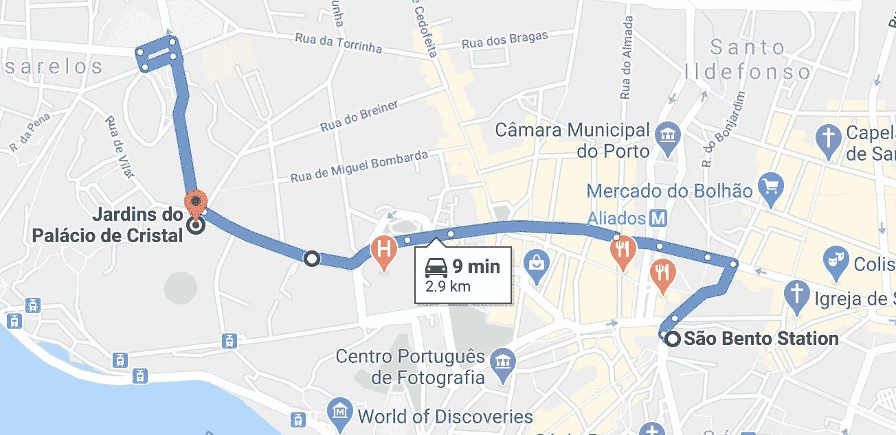*

*部分行程将包括起点，可能如下所示:*

*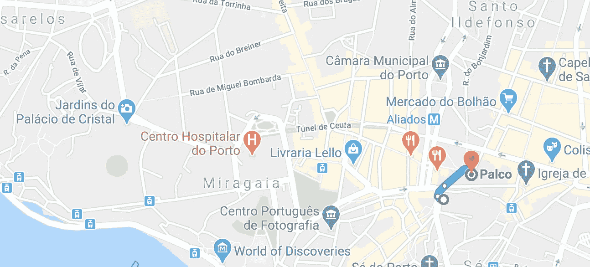*

*测试数据集有 320 次部分行程。评估指标是预测目的地和实际目的地之间的距离，是测试数据集中行程的平均值。*

*但是预测和实际的目的地都是地球表面上的点(而不是平面上的点)，所以它们之间的距离不是用欧几里德距离来计算，而是用一个叫做 [*哈弗辛*距离 T5 的东西来计算:](https://en.wikipedia.org/wiki/Haversine_formula)*

*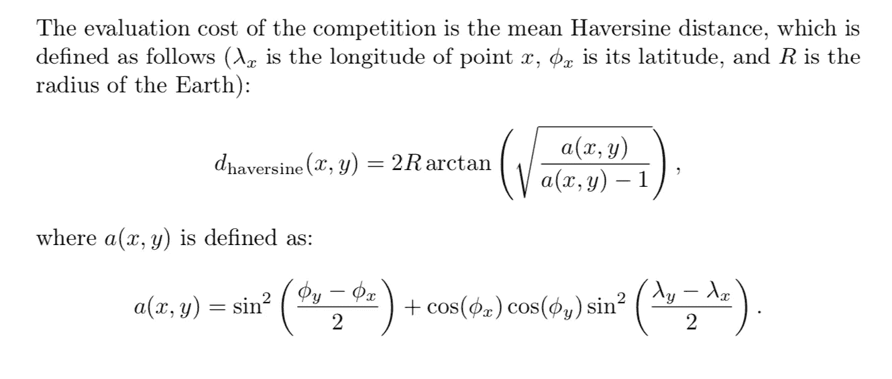*

*[https://arxiv.org/abs/1508.00021](https://arxiv.org/abs/1508.00021)*

*看起来很简单，对吧？:-)*

*这是一个结构化数据问题(即，没有图像、音频等)，因此如果您想要使用神经网络方法，一个合理的起点将是一个基本网络(一个 [MLP](https://en.wikipedia.org/wiki/Multilayer_perceptron) )，具有一个隐藏层和两个输出节点，一个用于目的地的纬度，一个用于目的地的经度。*

*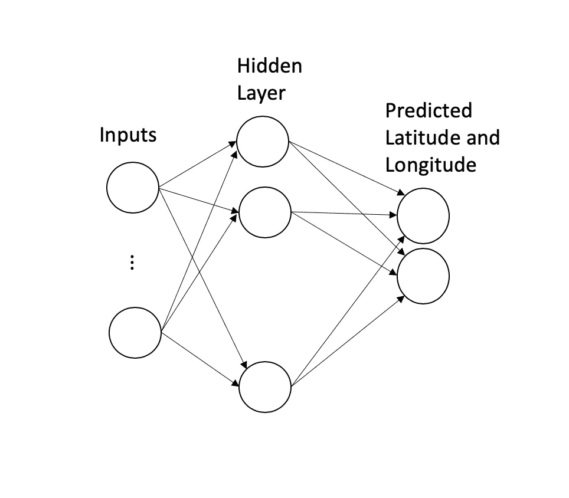*

*但是并发症马上出现了:*

*   *由于不同的旅行可能具有不同的持续时间，因此每次旅行中纬度-经度对的数量会有所不同，因此每个训练示例都有一个*变量*数量的输入。例如，10 分钟的车程将有大约 40 个经纬度对，而 30 分钟的车程将有三倍长的输入。我们如何处理不同数量的输入？*
*   *那个哈弗辛函数看起来很吓人。它*是*可微的，所以也许优化它就可以了？我们会看到的。*
*   *我们的两个输出节点预测纬度和经度。也许这可以很好地工作，但是在测试数据集中只有*320 个观察值，所以即使一些不好的预测也会破坏评估指标。此外，直接预测纬度和经度没有考虑到热门目的地(例如，Sao Bento 站)在数据中出现的频率更高，因此正确预测非常重要。**

*让我们来看看 Yoshua 和他的团队是如何解决这些问题的。*

***问题**:变长输入*

*(如果你熟悉[递归神经网络](https://en.wikipedia.org/wiki/Recurrent_neural_network) (RNNs)，你会立刻意识到它们对这个问题的适用性。事实上，在他们的[论文](http://arxiv.org/abs/1508.00021)中，Yoshua 和合作者探索了几种不同的 RNNs 变体来解决这个问题，但是他们的竞争获胜模型没有使用 RNNs；它使用了下面描述的简单思想)*

***解决方案**:*

*最有效的解决方案非常简单。*

> *连接输入的前 5 个坐标和后 5 个坐标。如果输入的坐标少于 10 个，仍采用前 5 个和后 5 个坐标，它们重叠是可以的。最后，如果部分行程少于 5 个坐标，只需重复第一个或最后一个坐标，直到达到 10 个坐标。*

*例如，从这个“原始”输入…*

*[[-8.611794,41.140557],[-8.611785,41.140575],[-8.612001,41.140566],[-8.612622,41.140503],[-8.613702,41.140341],[-8.614665,41.140386],[-8.615844,41.140485],[-8.61561,41.140683],[-8.614566,41.141088],[-8.614395,41.141979],[-8.613936,41.142942],[-8.612793,41.143851],[-8.611488,41.144787],[-8.610543,41.144391],[-8.610282,41.143536],[-8.610255,41.143401],[-8.608824,41.143239],[-8.608419,41.143149],[-8.606565,41.142348],[-8.605179,41.143446],[-8.604549,41.144796],[-8.604297,41.1453],[-8.603505,41.145561],[-8.602488,41.145633],[-8.601039,41.145759],[-8.600436,41.146443],[-8.599977,41.147289],[-8.598681,41.14827],[-8.598303,41.148423],[-8.598618,41.149467],[-8.597529,41.151294],[-8.596161,41.153679],[-8.594838,41.155983],[-8.594163,41.157135],[-8.593002,41.159187],[-8.591454,41.161608],[-8.589924,41.163453],[-8.589402,41.163309]]*

*…仅使用**粗体的**坐标:*

***[-8.611794，41.140557]，[-8.611785，41.140575]，[-8.612001，41.140566]，[-8.612622，41.140503]，[-8.613702，41.140341]** ，[-8.614466]*

*如果你想知道为什么他们选择 5 而不是另一个数字，我怀疑他们认为这是一个超参数 k 并尝试了一些不同的值；k = 5 可能是最好的。*

***吸取的教训**:*

> *在具有可变长度输入的问题中，精心选择的固定长度输入子集可以捕获输入的本质**。***

*对于一次出租车出行，知道部分行程的起点和终点，大概就是你需要的关于部分行程的全部信息；知道出租车在这两点之间的确切路线可能是不必要的。*

*但在其他问题中，知道开头和结尾可能还不够；以某种方式表示整个路径可能是必要的。在这些情况下，*定期对整个路径进行采样*可能会奏效。或者更频繁地对路径中更感兴趣的部分进行采样，而不太频繁地对路径中不太感兴趣的部分进行采样可能是正确的方法。*

*这些想法并不是万无一失的:如果输入的是一个句子，我们不能只看开头的几个词或最后的几个词。从每个句子中抽取固定数量的单词也不行；省略单个单词(例如单词‘not’)可能会改变句子的意思。*

*尽管如此，Yoshua 的解决方案表明，如果你仔细思考，你可能能够想出一个简单的方法，对你的具体问题来说*足够好。**

***问题**:我们如何处理令人生畏的哈弗森距离函数？*

***解决方案**:*

*事实证明，我们对距离函数的担心是有道理的。Yoshua 和他的团队在使用哈弗辛函数时确实遇到了麻烦，所以他们必须找到一个更简单的替代方法。*

*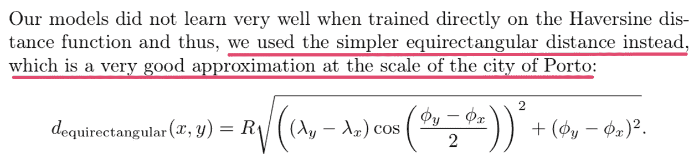*

*[https://arxiv.org/abs/1508.00021](https://arxiv.org/abs/1508.00021)*

***吸取的教训:***

*同样，这是一个针对特定问题思考的好例子。*

> *他们没有试图设计一个通用的哈弗森距离近似值。鉴于问题发生在波尔图，**他们只是需要在那个城市的规模下运作良好的东西。它不需要在更大的距离上工作。***

*一旦你意识到这一点，[稍微搜索一下](https://jonisalonen.com/2014/computing-distance-between-coordinates-can-be-simple-and-fast/)就能把你带到等矩形距离，这看起来比哈弗斯简单多了。*

*如果你熟悉机器学习，你可能已经知道确保你的损失函数准确地捕捉你关心的问题的真实世界目标的重要性。*

*但是你可能没有学到的是，当你的损失函数很复杂时(通常如此)，你不需要到处寻找一个好的近似*。只要在你的问题范围内足够好就行了。**

****问题**:有两个简单的输出节点——一个用于纬度，一个用于经度——可以工作吗？**

> **由于我们要预测的目的地由两个标量值(纬度和经度)组成，因此自然会有两个输出神经元。然而，我们发现很难训练这样一个简单的模型，因为它没有考虑任何关于数据分布的先验信息。 *(重点地雷)来源:*【https://arxiv.org/abs/1508.00021】T4**

**通过“关于数据分布的先验信息”，Yoshua 和他的团队指的是不同目的地的不同受欢迎程度(例如，Sao Bento 火车站将比特定的住宅地址更受欢迎)。**

**让我们看看他们做了什么！这是他们论文中我最喜欢的部分。**

****解决方案**:**

**他们对训练集中的所有最终目的地运行聚类算法，并将它们分成几千个集群(准确地说是 3392 个)。**

**从概念上讲，他们从这个…**

**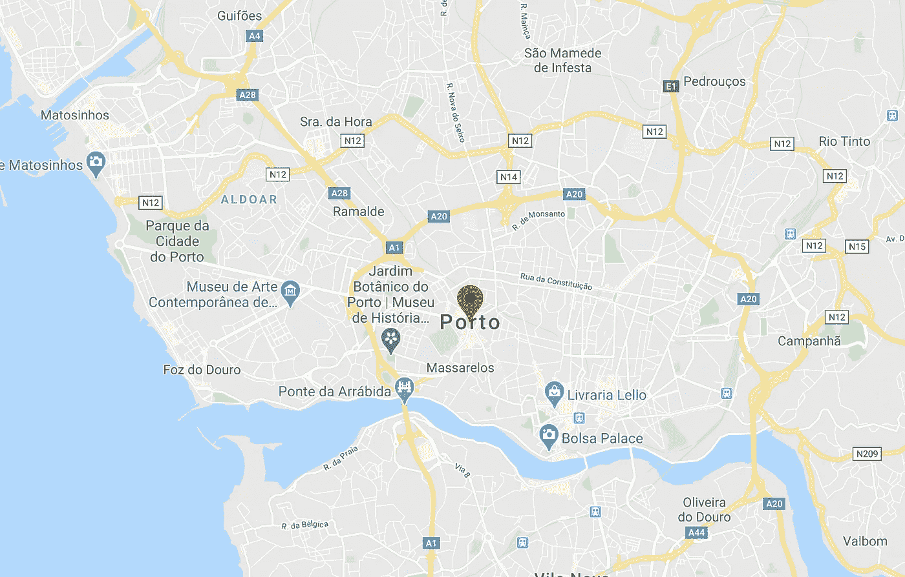**

**…变成这样。**

**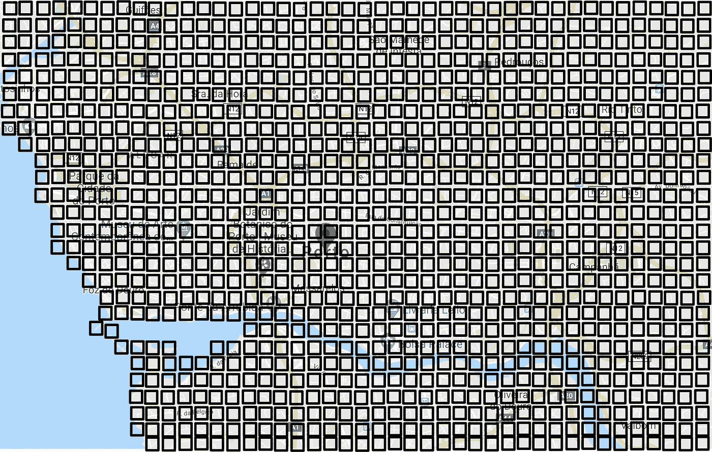**

**(这只是为了举例说明。实际的簇可能不都是相同的大小和形状)**

**现在，我们不是直接预测最终目的地的经纬度，而是可以将此视为一个[多类分类](https://en.wikipedia.org/wiki/Multiclass_classification)问题，任务是将输入分类到 3392 个聚类中的一个。**

****

**多类分类问题的最后一层通常是 [softmax](https://en.wikipedia.org/wiki/Softmax_function) 层，它给出了所有可能输出类的概率分布。在我们的示例中，softmax 层将为 3，392 个聚类中的每一个聚类生成一个概率。**

**多类分类中的标准做法是挑选概率最高的类作为预测输出。*相应地，我们可以挑选概率最高的聚类，并使用其中心点的经纬度作为预测目的地。***

**请注意这种转换是如何巧妙地考虑到数据分布的'*先验信息'*:包含热门目的地的分类将在训练集中更频繁地出现，因此平均而言，具有更高的预测概率。**

**这听起来不错，对吧？**

**但是如果一个实际的目的地在一个集群的角落，远离集群中心呢？因为我们使用聚类中心作为预测，所以我们的预测和实际目的地之间的距离肯定是非零的，并且可能相当大。**

**解决这个问题的一个方法是增加我们使用的集群数量。通过生成(比方说)5000 个集群，每个集群变得更小，并且集群中的每个点都将更接近其中心。但是我们现在有一个多类分类问题，有更多的输出类。如果没有每个聚类的足够训练数据，我们将无法训练出一个好的模型。**

**Yoshua 和他的团队设计了一个更好的方法。**

**他们将预测的聚类概率(即 softmax 的输出)乘以聚类中心的坐标，并将它们相加以计算加权平均纬度…**

**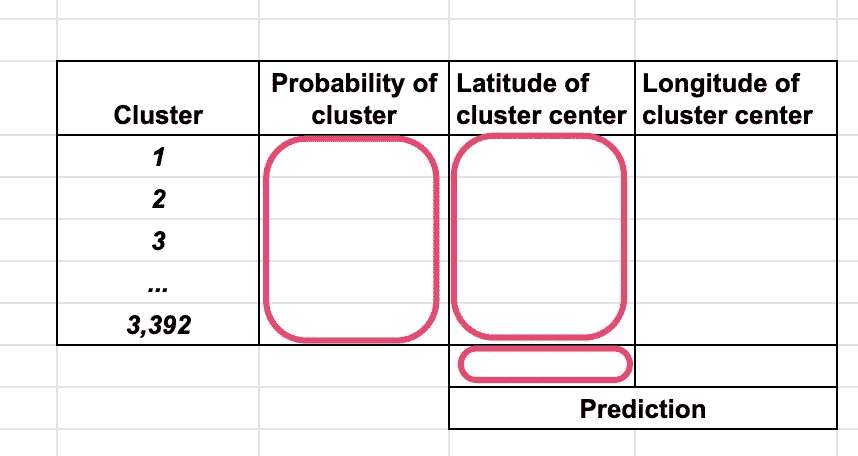**

**预测纬度**

**…和加权平均经度。**

**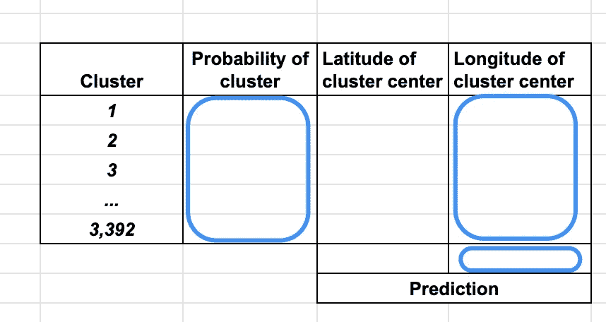**

**预测经度**

> **这个(概率加权的)纬度-经度对是预测的目的地。**

**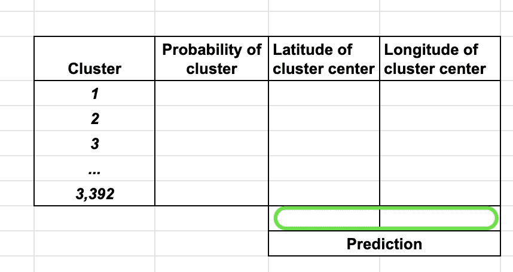**

**这意味着，例如，如果模型认为两个相邻的聚类同样可能是最终目的地，则它们中心的中点将被预测为最终目的地。**

**值得注意的是，这个最终加权平均步骤是*而不是*后处理步骤。*它必须是网络的一部分—* 只有这样，预测的经纬度对才能输入损失函数，进而优化网络训练。**

**为了制作网络的这一部分，**他们在 softmax 层**之后添加了一个单一的线性层*。在我看来，这是一步妙棋:-)***

**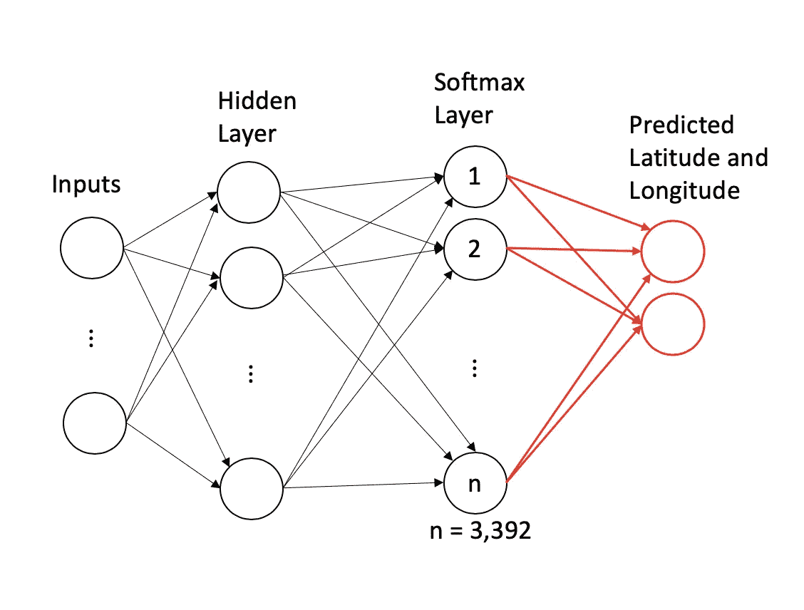**

**这个线性层的权矩阵就是聚类中心…**

**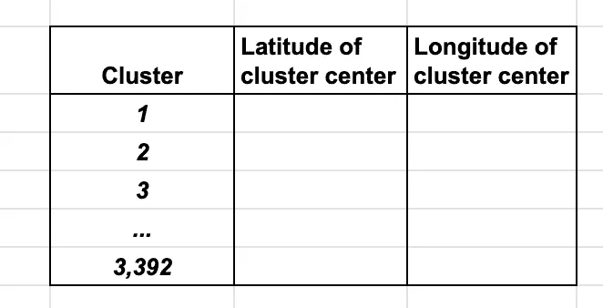**

**…但有一个重要的转折:*训练期间，重量保持不变。***

**毕竟，我们已经知道它们是什么(也就是说，它们不是随机初始化的权重，它们来自聚类算法)，不需要学习它们。**

**总之，Yoshua 和他的团队:**

*   **首先将问题从双输出回归问题转化为多类分类问题**
*   **然后通过添加最后一个线性图层和两个输出节点，将其改回双输出回归问题**
*   **通过将聚类中心作为线性层的权重矩阵，但冻结该层的权重，他们在网络中引入了加权平均步骤，使网络的端到端训练成为可能。**

**整洁，对不对？**

**顺便说一句，如果你想知道使用了哪种聚类算法:**

> **使用均值偏移聚类算法对所有训练轨迹的目的地计算聚类，返回一组 C = 3392 个聚类。*来源:*[https://arxiv.org/abs/1508.00021](https://arxiv.org/abs/1508.00021)**

****经验教训:****

*   **考虑输出图层时，考虑输出值的先验分布非常重要。对于分类问题，这通常是简单的(甚至是自动的)，但是对于像这样的回归问题，它需要比我们通常做的更多的关注。**
*   **如果问题的细节需要特定类型的计算，则定义一个层来执行该计算，并将其包含在网络中(而不是在网络外以特别的方式执行)，以便您可以在训练过程中了解其参数。*只要能计算出* *的导数，就值得一试*。**
*   **如果上面的教训让你想知道为什么 Yoshua 和他的团队在网络之外进行聚类*，而不是在网络中为其定义一个层，并作为训练网络的一部分学习最佳聚类:***

> **我们基于聚类的输出层的一个潜在限制是最终预测只能落在聚类的凸包中。**一个潜在的解决方案是将聚类作为网络的参数来学习，并随机或从均值漂移聚类中初始化它们**。(强调我的)**
> 
> ***来源:*[https://arxiv.org/abs/1508.00021](https://arxiv.org/abs/1508.00021)**

**我希望你喜欢这种对深度学习大师如何思考的窥视。如果这些课程对你来说都不陌生，那么恭喜你——你正在向深度学习大师迈进！**

**(如果您觉得这篇文章有帮助，您可能会发现这些感兴趣的**