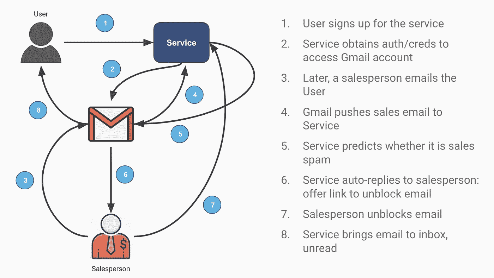
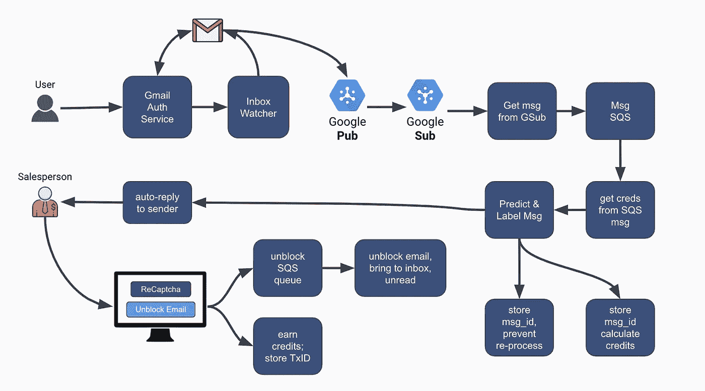
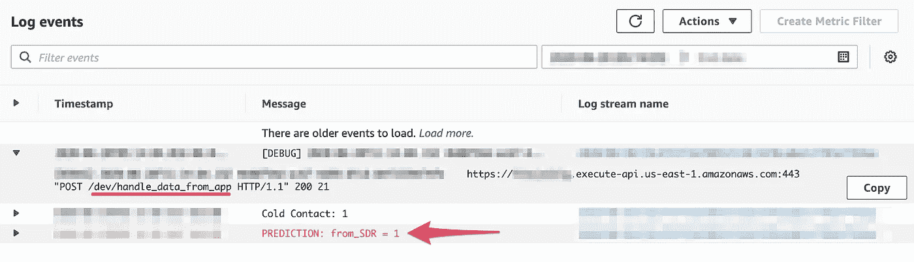
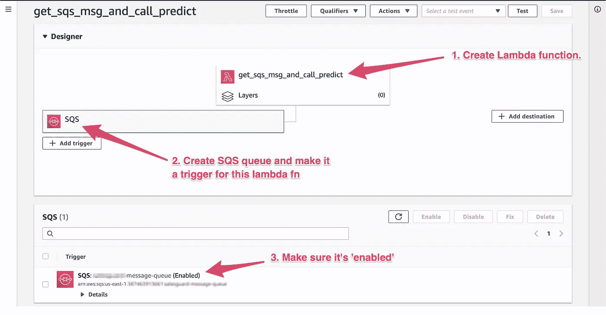
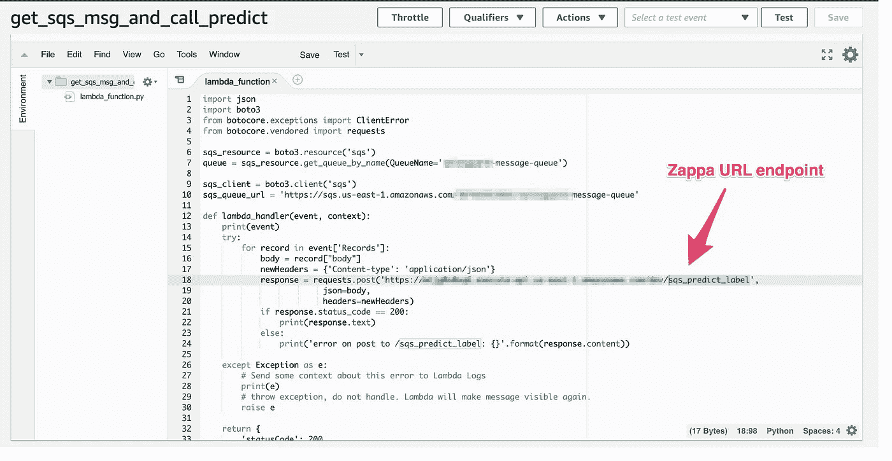
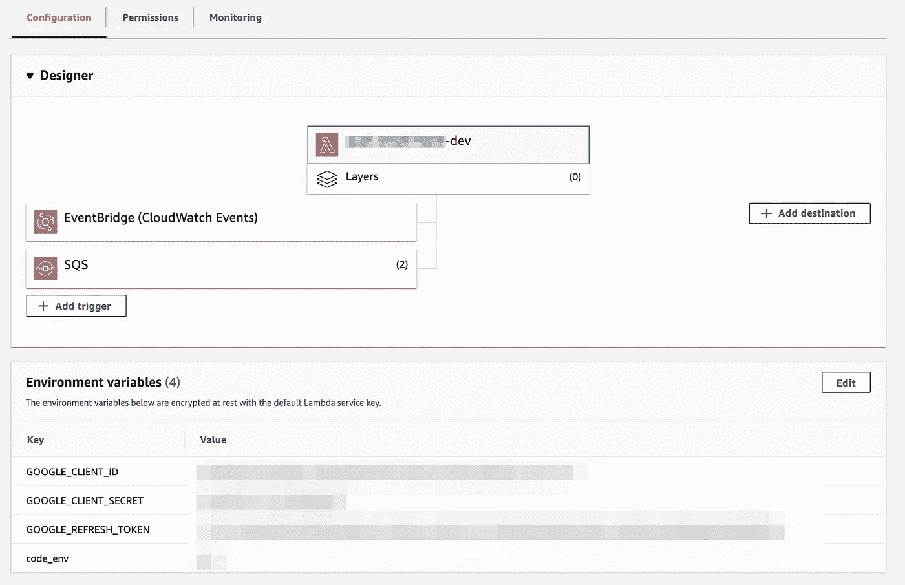
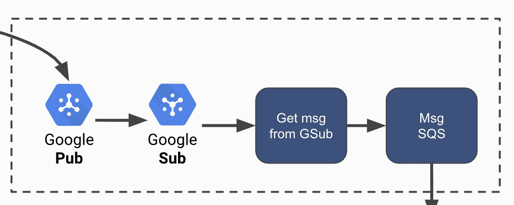
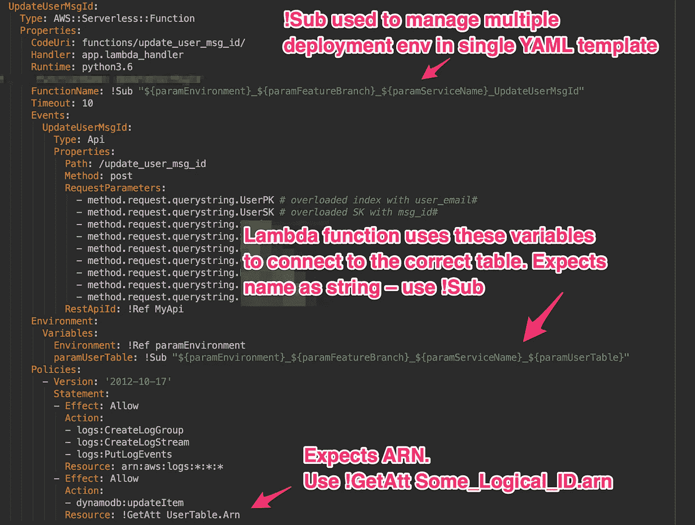
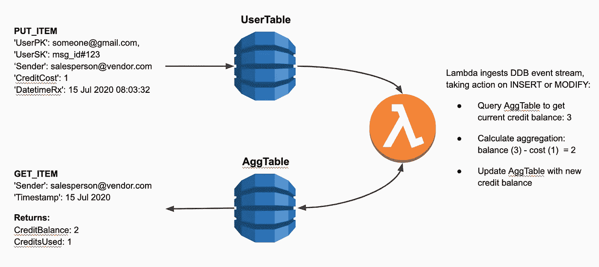

# 无服务器堆栈中使用 NLP 阻止未经请求的销售电子邮件的课程

> 原文：<https://towardsdatascience.com/lessons-in-serverless-stacks-using-nlp-to-block-unsolicited-sales-emails-8fda116273e8?source=collection_archive---------46----------------------->

在本系列的第一部分和第二部分[中，我描述了一个通过应用自然语言处理来阻止不请自来的销售邮件的系统。在培训和部署模型之后，我使用无服务器基础设施构建了整个应用程序，以了解开发这样一个系统的相对成本和工作量。这篇文章强调了我在旅途中学到的各种教训。如果你正在读这篇文章，我希望它能帮助你避免一些看手相的错误！](/dockerize-deploy-and-call-my-sdr-email-detector-model-via-api-68e238b7ecff)


在整篇文章中，我使用“无服务器”来表示不需要永久基础设施的托管。图片由 [Kewl@Pixabay](https://pixabay.com/photos/server-room-datacenter-network-90389/) ，CC0。

# 首先，我的系统概述

下面是我的应用程序的概述，为下面的部分设置上下文。

用户首先授权服务访问 Gmail。该授权使 Gmail 向 Google 发布/订阅主题发送新邮件。订阅者接收每条主题消息，并调用 API 端点来处理电子邮件(预测它是否是销售垃圾邮件)。如果 NLP 模型预测该电子邮件是垃圾邮件，那么该应用程序会让用户的 Gmail 回复发件人，提示他们通过求解验证码来解锁该电子邮件。如果销售人员解答了验证码，那么他们的电子邮件将被标记为未读，并被发送到用户的主收件箱。



下图提供了引擎盖下的更好视图:



我使用无服务器基础设施实现了上述所有模块，利用了 DynamoDB、Lambda 函数、SQS 队列和 Google Pub/Sub。

# 基于 Zappa 的无服务器机器学习模型

在这里，“无服务器”意味着不需要永久基础设施的托管。在这方面，“Zappa 使得构建和部署无服务器、事件驱动的 Python 应用程序变得非常容易。。。在 AWS Lambda + API 网关上。

> 这意味着无限扩展、零停机、零维护，而成本只是您当前部署的一小部分！
> 
> @ [Gun.io](https://medium.com/u/ceaa30e888a5?source=post_page-----8fda116273e8--------------------------------)

简单和多功能是 Zappa 最大的优势。虽然你可能会读到许多关于人们使用 Django web 应用程序的博客帖子，但 Zappa 也提供了通过 API 访问无服务器机器学习模型的交钥匙方法。

## 配置 Zappa

我强烈推荐阅读 [Gun.io](https://medium.com/u/ceaa30e888a5?source=post_page-----8fda116273e8--------------------------------) 的文档。在这里，我将把重点放在基础上，以突出 Zappa 优雅的简单性，同时提出一些教训。

**首先，也是最重要的**，导航到您的项目根文件夹，配置一个虚拟环境，其中包含您需要的所有库、依赖项等等。如果你不仅仅是在练习，[考虑为你的 Zappa 应用](https://romandc.com/zappa-django-guide/setup/)建立一个 Docker 环境，因为“越接近(你的 Zappa 与 AWS lambda 环境相匹配)，调试问题就越少。”重要的是，虚拟环境名称不应该与 Zappa 项目名称相同，因为这可能会导致错误。

```
$ mkdir zappatest
$ cd zappatest
$ virtualenv ve
$ source ve/bin/activate
$ pip install zappa
```

然后运行`init`为您的应用配置各种初始设置:

```
$ zappa init
```

打开`zappa_settings.json`文件来编辑或配置其他设置，比如确定哪个 S3 桶将存储 Lambda 函数工件。以下是我用过的:

```
{
    "dev": {
        "app_function": "api.app.app",
        "aws_region": "us-east-1",
        "profile_name": "default",
        "project_name": "serverless-ML",
        "runtime": "python3.6",
        "s3_bucket": "MY_BUCKET_NAME",
        "slim_handler": true,
        "debug": true
    }
}
```

注意，`“app_function”: “api.app.app”`行调用一个带有`app.py`文件的模块(文件夹)`api`，其中`app = Flask(__name__)`在这个目录树中:

```
~env$my_project_name
.
|- api
     |- app.py
|- ... 
```

最后，在您的环境中进行初始部署:

```
zappa deploy YOUR_STAGE_NAME
```

就是这样！如果您的应用程序已经被部署，并且您只需要上传新的 Python 代码，而不需要接触底层的路径，那么您可以简单地“调用`zappa update YOUR_STAGE_NAME`。

## 加载模型和调用。Zappa 应用中的 Predict()

在[训练完我的模型](/minimizing-sales-emails-in-my-inbox-with-natural-language-processing-38296b562da7)后，将工件腌制成`model.pkl`文件，存放在 S3 桶里。然后使用 [Boto3](https://boto3.amazonaws.com/v1/documentation/api/latest/index.html) 库将模型加载到 Zappa 应用程序中。接下来，将输入 JSON 转换成符合模型的格式，并返回响应:

调用`zappa update YOUR_STAGE_NAME`，模型可以通过 API 访问。用 cURL 请求点击模型来测试它:

```
$ curl -F 'file=@payload.json' https://YOUR_ENDPOINT.execute-api.us-east-1.amazonaws.com/dev/handle_data_from_app
```

在您的 CloudWatch 日志中观察神奇的事情:



## 在您的无服务器 ML 模型中包含助手模块

上面设置中最棘手的部分突出显示在第 63–66 行，在这里我在`__main__`名称空间中调用我的助手模块`preprocess`。没有第 66 行，`model.pkl`文件执行各种转换，调用我的`preprocess`模块，但是产生错误，无法找到那个模块名。

这是因为，在酸洗我的模型之前，我使用了一个本地模块`from helper import preprocess`作为从`.predict()`内部调用的管道的一部分。所以当我想要重用那个模型时，调用它的**环境并不相同**。我花了几个小时试图找出如何让环境匹配。这是关键的一课:Zappa 将安装在虚拟环境中的依赖项和库打包成一个 zip 文件，然后上传到 S3，这就形成了 Lambda 函数的内容。本质上，

> 如果您不能或者没有将您的本地模块打包到虚拟环境中，那么它们就不存在于您的 Zappa Lambda 环境中。

此外，如果您的模型的`.predict()`有一个它正在使用的特定名称空间，那么您也必须完全复制它。这就是为什么我必须在应用程序的`‘__main__’`块中实例化`from helper import preprocess`。将它放在其他地方会导致路径与我的 pickled 模型`.predict()`中的管道所期望的不匹配。

# 通过无服务器网络应用程序将 Gmail 连接到我的 ML 模型

我创建了第二个 Zappa 应用程序来连接用户和我的 ML 模型(“服务”)。其核心是，该服务连接到用户的 Gmail 帐户，获取邮件，并将它们传递给模型，以便它可以预测内容是否是销售垃圾邮件。概括一下:


这个应用程序的内容超出了这篇文章的范围，所以我将把重点放在学到的东西上。

## 30 秒:支持 API 的 Lambda 函数的一个重要限制

在我的应用程序的第一个版本中，我从一个用户的 Gmail 帐户中取出一批 50 封邮件，并在 ***中运行`.predict()`一个函数调用*** 。尽管[在我的 AWS Lambda](https://docs.aws.amazon.com/lambda/latest/dg/gettingstarted-limits.html) 中尝试了 15 分钟的超时时间，但该功能仍然超时。我也尝试扩展 Zappa 设置中的`timeout_seconds`参数，但也无济于事。

**瓶颈不是 Zappa 或 Lambda 函数，而是 Zappa 使用的 API 网关**。如 [AWS 文档](https://docs.aws.amazon.com/apigateway/latest/developerguide/limits.html)中所述,“最大集成超时”为“30 秒”,不能根据要求增加。显然，函数继续在后台运行，但是在我的例子中，我需要一个响应。

另外，这个问题帮助我认识到我没有遵循无服务器技术的原则，这意味着利用并行、水平扩展。

> 提示 SQS！(懂了吗？；)

与其在一次 Lambda 调用中预测 50 多条消息，不如将这些消息在 SQS 中排队。然后 Zappa 可以使用 SQS 事件流触发`.predict()` 功能(例如，每条消息一次)。boom --水平扩展，无超时！

## 使用 SQS 事件触发 Zappa 函数

第一次，我手工配置了一个 Lambda 函数，通过 UI 控制台接受 SQS 事件。



然后我编写了 Lambda 事件来解析 SQS 事件，并调用 Zappa URL 端点:



虽然这相当简单，但它缺少 git 版本控制和命令行重新部署！幸运的是，Zappa 允许你通过 AWS 事件触发应用程序中的功能[。](https://github.com/Miserlou/Zappa#executing-in-response-to-aws-events)

首先，我将 Lambda 函数作为另一个 Zappa 函数移植到主`app.py`文件中:

```
def get_sqs_msg_and_call_predict(event, context):    try:
        for record in event['Records']:
            body = record["body"]
            resp = sqs_predict_label(body)
    except Exception as e:
        # Send some context about this error to Lambda Logs
        print(e)
```

然后我重新配置了`zappa_settings.json`来包含`events`:

```
"events": [
   {
       "function": "api.app.get_sqs_msg_and_call_predict",
       "event_source": {
            "arn":  "arn:aws:sqs:us-east-1:XXXXXX:YYYYY",
            "batch_size": 1, // Max: 10\. Use 1 to trigger immediate processing
            "enabled": true // Default is false
       }
   }
]
```

我花了几个小时试图为`"function": "xxx"`诊断合适的咒语。Zappa 官方文档提到`"function": "your_module.process_upload_function".`打算调用我的 Zappa 应用程序的主`app.py`部分的一个函数，我尝试了:

*   `"function": "get_sqs_msg_and_call_predict"`
*   `"function": "app.get_sqs_msg_and_call_predict"`
*   `"function": "api.get_sqs_msg_and_call_predict"`

所有这些都给了我这个错误的变体:

```
Traceback (most recent call last):
  File "/var/task/handler.py", line 609, in lambda_handler
  return LambdaHandler.lambda_handler(event, context)
  File "/var/task/handler.py", line 243, in lambda_handler
  return handler.handler(event, context)
  File "/var/task/handler.py", line 418, in handler
  app_function = self.import_module_and_get_function(whole_function)
  File "/var/task/handler.py", line 235, in import_module_and_get_function
  app_function = getattr(app_module, function)
AttributeError: module 'api' has no attribute 'get_sqs_msg_and_call_predict'
[123123] You are currently running on staging
[123123] module 'api' has no attribute 'get_sqs_msg_and_call_predict': AttributeError
```

**重要提示**:您必须考虑模块，因为它与您的根应用程序文件夹相关。如果您有这样的文件夹结构:

```
~env$project_name
.
|- api
     |- app.py
     |- templates
|- ...
```

正确的设置包括`"function": "api.app.some_function_therein"`。亲爱的读者，我希望这个细节能为你节省时间，减少麻烦。

## 事件触发 Zappa 函数中的“return”语句

在主`app.py`文件中处理 SQS 事件导致了一个不寻常的场景。这又是函数:

```
def get_sqs_msg_and_call_predict(event, context):    try:
        for record in event['Records']:
            body = record["body"]
            resp = sqs_predict_label(body)
    except Exception as e:
        # Send some context about this error to Lambda Logs
        print(e)
```

你会注意到上面的函数不包括一个`return`语句。尽管我尽了最大努力，我还是无法生成一个可接受的 return 语句。幸运的是，我的代码不需要，所以我决定跳过这一步，而不是纠结于处理这种情况的正确方法。

简而言之，问题是这样的:

```
**[1231231**] Result of zappa.asynchronous.route_lambda_task
[**1231232**] <Response 192 bytes [**200 OK**]>
[**1231233**] An error occurred during JSON serialization of response: <Response 192 bytes [**200 OK**]> is not JSON serializable
Traceback (most recent call last):
File "/var/lang/lib/python3.6/json/__init__.py", line 238, in dumps **kw).encode(obj)
File "/var/lang/lib/python3.6/json/encoder.py", line 199, in encode chunks = self.iterencode(o, _one_shot=True)
File "/var/lang/lib/python3.6/json/encoder.py", line 257, in iterencode return _iterencode(o, 0)
File "/var/runtime/awslambda/bootstrap.py", line 145, in decimal_serializer
raise TypeError(repr(o) + " is not JSON serializable")
TypeError: <Response 192 bytes [**200 OK**]> is not JSON serializable
```

StackOverflow 提供了使用`jsonify(response)`使响应输出 JSON 可序列化的解决方案。不幸的是，在这种情况下这不起作用:

```
This typically means that you attempted to use functionality that needed to interface with the current application object in some way. To solve this, set up an application context with app.app_context().  See the documentation fo
r more information.: RuntimeError Traceback (most recent call last):
  File "/var/task/handler.py", line 609, in lambda_handler
  return LambdaHandler.lambda_handler(event, context)
  File "/var/task/handler.py", line 243, in lambda_handler
  return handler.handler(event, context)
  File "/var/task/handler.py", line 419, in handler
  result = self.run_function(app_function, event, context)
  File "/var/task/handler.py", line 282, in run_function
  result = app_function(event, context)
  File "/tmp/push-email-hand/api/app.py", line 1216, in get_sqs_msg_and_call_predict
  raise e
  File "/tmp/push-email-hand/api/app.py", line 1205, in get_sqs_msg_and_call_predict
  sqs_predict_label(body)
  File "/tmp/push-email-hand/api/app.py", line 1249, in sqs_predict_label
  return make_response(jsonify(response), status)
  File "/tmp/push-email-hand/flask/json/__init__.py", line 358, in jsonify
  if current_app.config["JSONIFY_PRETTYPRINT_REGULAR"] or current_app.debug:
  File "/var/task/werkzeug/local.py", line 348, in __getattr__
  return getattr(self._get_current_object(), name)
  File "/var/task/werkzeug/local.py", line 307, in _get_current_object
  return self.__local()
  File "/tmp/push-email-hand/flask/globals.py", line 52, in _find_app
  raise RuntimeError(_app_ctx_err_msg)
RuntimeError: Working outside of application context.
```

我怀疑这是因为我使用`from zappa.asynchronous import task`调用了一个异步任务，这不知何故改变了应用程序上下文。如果你解决了这个问题，我很想听听你的意见！

## 通过 Zappa 配置环境变量

在`zappa_settings.json`中设置环境变量并传入代码环境非常容易，就像这样:

```
{
    "prod": {
        "app_function": "api.app.app",
        # . . . #
        "environment_variables": {
            "code_env": "prod"
        }
    }
}
```

**注意一个重要的细微差别** : `environment_variables`对于你的应用来说是本地的，在运行时被注入到 Lambda 处理程序中。换句话说，`environment_variables`不会设置 AWS Lambda 环境变量:



然而，这些变量有时是必需的，例如当您想要设置凭证时。解决这个问题的一个方法是导航到 UI 控制台并在那里设置它们。这种方法对于部署多个环境(例如，staging-branch1、staging-branch2、测试、生产等)并不理想。).更好的方法是使用 Zappa 的`aws_environment_variables`配置设置:

```
{
    "prod": {
        "app_function": "api.app.app",
        # . . . #
        "**aws_**environment_variables": {
            "GOOGLE_CLIENT_ID": "XXX"
            "GOOGLE_CLIENT_SECRET": "YYY"
            "GOOGLE_REFRESH_TOKEN": "ZZZ"
            "code_env": "prod"
        }
    }
}
```

## 解析 Gmail 邮件

许多人写过关于从 Gmail 邮件中解析电子邮件内容的复杂主题。长话短说，电子邮件有多种形状和大小(`text/plain`、`text/html`、`multipart`等)。).如果我只解析了`text/plain`邮件，我会错过大量的信息。因此，我包含了下面的代码，希望能帮助那些不想从头开始重写的读者。此外，令人沮丧的是各种 Python 库不能很好地协同工作。所以我把我用过的版本包括在下面:

注意:上面的功能并不完美，但是它完成了任务。如果你最终实现了这个，请随时给我发送你的想法。

## 处理“至少一次交货”

我从谷歌的发布/订阅系统中调试了一个与“至少一次交付”相关的问题，获得了很多乐趣。作为后台，我的应用程序在用户的 Gmail 帐户上调用`[.watch()](https://developers.google.com/gmail/api/reference/rest/v1/users/watch)`,它将“邮箱当前历史记录的 ID”发送到一个 Google Publisher 主题。然后，一个连接的订户向我的 Zappa 端点发送推送通知，该端点处理获取最新消息并将其排队到 SQS 所需的`historyId`。



在我的控制台上玩 Gmail API 时，我得到的印象是订阅者推送通知提供了一个`historyId`，用于检索自上次推送通知以来的邮件*。换句话说，我认为在`time=2`接收`historyId`意味着我可以检索从`time=1`到`time=2`的所有消息。所以我在这个假设的基础上建立了我的应用程序的逻辑，它看起来很有效…*

然后我发疯似的调试为什么系统有时会从一个`historyId`获取 0 条消息，而其他时候会莫名其妙地获取几条消息。

> 至少一次传递意味着“消息有时可能不按顺序传递或者传递多次。”

几天后，在用记录器和跟踪器测试了这个应用程序后，它给了我很大的启发。当订户第一次发送消息时，它提供的是最新的`historyId`，没有新消息要获取。但是由于至少一次递送，订户可能会无序地或多次重新递送消息。如果订阅者重新发送了一条消息*并且用户在第一次订阅者推送后收到了新邮件，那么系统将获取新邮件— **给我一个错误的印象，即我之前的逻辑工作正常**。#facePalm*

**

*Alex E. Proimos 提供的图像，cc-by-2.0。*

*我的解决方案是为每个用户构建一个`historyId`缓冲区，使用 *(n-1)* `historyId`获取消息，然后用最新的`historyId`替换第二个最新的值:*

## *构建幂等服务*

*这是 Google 发布/订阅文档中的另一个亮点:*

> *通常，发布/订阅会按照消息发布的顺序将每条消息传递一次。但是，消息有时可能会不按顺序传递或传递多次。一般来说，支持多次传递要求您的订户在处理消息时是**等幂的**。*

*简而言之，一个函数是幂等的，如果它可以根据需要重复或重试，而不会造成意想不到的影响。考虑到 Gmail 的推送消息可能会重复到达，这种方法很有用。因此，我没有一次又一次地重新处理相同的消息——浪费资源——而是建立了一个 DynamoDB 表，存储每个 msg_id 以供查找。如果找到，该消息将被丢弃，不再进一步处理。*

# *使用 AWS SAM 模板部署资源*

*无服务器开发的最大好处之一是能够从命令行部署多个互连的资源。假设一个应用程序需要六个 Lambda 函数、四个 DynamoDB 表、两个 SQS 队列和一个 API 网关。使用 AWS CLI 或 UI 控制台会令人厌倦。由于 AWS 无服务器应用程序模型(AWS SAM ),这项任务非常简单。但是如果你不熟悉 serverless、CloudFormation 或 SAM，那么管理这些资源的模板文件读起来就像天书一样。因此，让我们从快速剖析 SAM 模板开始。*

## *AWS SAM 模板剖析*

*"[模板是一个 JSON 或 YAML 格式的文本文件，描述您的 AWS 基础设施](https://docs.aws.amazon.com/AWSCloudFormation/latest/UserGuide/template-anatomy.html)。"以下代码片段显示了一个 SAM 模板及其各个部分:*

*SAM 模板包含一个`Transform:`来标识要使用的 AWS 无服务器应用程序模型(AWS SAM)的版本。然后模板为无服务器应用设置`Globals:`设置。例如，我为我的 API 资源设置了 CORS 策略。接下来，模板标识在运行时通过命令行传递到模板中的`Parameters:`。之后，模板有了`Resources:`，这里定义了 Lambda 函数、DynamoDB 表和其他资源。*

## *解包 Lambda 资源*

*Lambda 函数有一个逻辑 ID，它是模板文件中资源的唯一名称。在下面的例子中，逻辑 ID 是`SomeLambdaFunction`:*

*`Path: /your_path`标识调用这个函数的 API 路径，而`RequestParameters:`告诉模板预期的变量。`Variables:`是 Lambda 函数的本地环境变量，它被证明对管理数据库连接等非常有用。`Policies:`部分标识了该功能的权限。例如，如果该函数要将项目放入 DynamoDB 表中，那么您必须指定相关表的动作和 ARN。最后，行`CodeUri: functions/your_event/`将您的资源映射到项目文件夹中的 Lambda 处理程序代码。例如，上面的 Lambda 函数应该具有这样的文件夹结构:*

```
*~env$my_SAM_project
.
|- functions
     |- your_event 
          |- __init__.py
          |- app.py
          |- requirements.txt
|- ...* 
```

*文件`app.py`然后执行您需要的任何功能。举例来说，在我的应用程序中，`app.py`使用查询字符串参数来更新 DynamoDB 表:*

*注意这一行: `table = ddbclient.Table(os.environ['DDBTableName'])`因为它展示了如何使用通过模板文件传递给 Lambda 函数的环境变量。在下面的一节中，您将看到这个强大的特性如何使用单个模板文件来帮助管理多个环境和表。*

*完成 Lambda 函数的编码后，必须使用 AWS CLI 构建 SAM 模板:*

```
*$ sam build*
```

*如果您仍然在对`app.py`文件进行更改，那么我建议您删除 AWS SAM 构建工件，以便您的代码更改立即生效:*

```
*$ rm -rf .aws-sam/**
```

*否则，您必须在每次代码更改后重新构建 SAM 模板。这很快就会变得很烦人。如果您对模板文件进行了任何更改，请不要忘记重新构建 SAM 模板！*

*最后，在本地测试您的功能后，您可以部署您的 SAM 模板，如下所示:*

```
*sam deploy --template-file .aws-sam/build/template.yaml --stack-name YOUR_STACK_NAME --s3-bucket YOUR_S3_BUCKET --capabilities CAPABILITY_NAMED_IAM --region us-east-1 --parameter-overrides ParameterKey=DDBTableName,ParameterValue=MyUserTable*
```

*鉴于部署 SAM 模板需要多长时间，您应该在本地测试您的功能和资源。这超出了这篇(已经很长的)文章的范围，所以我把这篇优秀的指南留给你。*

## *从单个 SAM 模板管理多个环境*

*使用模板文件非常简单，但是当您利用多种环境，比如`staging`、`testing`和`production`时，会有些复杂。有人建议为此维护多个模板文件甚至多个 AWS 账户。我认为这些建议没有说服力，因为它们会引起其他问题，例如:*

*   *确保多个模板实际上是相同的，或者*
*   *管理由于使用多个 AWS 帐户而产生的计费、用户和安全问题。*

*更好的方法需要一点设置，但是提供了一个使用单个模板文件管理多个环境和资源的优雅解决方案。*

*第一步是在模板文件中引入一些参数:*

*然后，您可以在模板文件中使用这些参数来动态构建每个 Lambda 函数、DynamoDB 表等等。以下是我的 SAM 模板中的一个示例:*

*然后我更新了我的`~/.bash_profile`来包含这个脚本:*

*现在，我可以像这样部署整个无服务器堆栈:*

```
*$ deploy_sam "staging"*
```

*由于使用了`Resource:` > `Environment:` > `Variables:`和`!Sub`命令，每个部署都为我提供了名称不同但完全相同的资源——比如`staging_master_sales-spam-blocker_MyUserTable`——在表和 Lambda 函数之间自动、正确地路由:*

**

## *用 SAM 事件在 DynamoDB 中实现聚合表*

*对于上下文，我的应用程序有一个“信用”的概念，用于解除销售人员向用户发送电子邮件的封锁。如果发件人的信用点数超过零，则发件人的电子邮件将被自动解锁，他们的信用点数将减少。但是如果一个发送者没有积分，那么他们会被发送一个新的验证码来获得更多的积分。因此，知道给定发送者在某个时间点有多少信用是至关重要的。*

*在典型的关系数据库中，我会用`datetime`和`sender_id`数据插入每个 Captcha 事务。然后，我将查询该表，以获得给定日期时间的`sender_id`的`SUM(credits)`。我在 DynamoDB 中寻找一个类似的函数，但结果是不支持聚合——像`SUM()`和`MAX()`。*

*于是开始寻找答案。幸运的是，我在聚合表上找到了彼得·霍奇金森的这篇优秀的文章。以下是关键的见解:*

> *使用 [DynamoDB Streams](https://docs.aws.amazon.com/amazondynamodb/latest/developerguide/Streams.html) 将数据库事件发送到下游的 Lambda 函数，该函数动态执行聚合。*

*以下步骤演示了如何使用 AWS SAM 和 Python 3.6 实现这一点。对于额外的上下文，此图有助于可视化下面描述的交互:*

**

*虽然我的应用程序有许多其他资源，但本节主要介绍计算聚合表的要点。*

*首先，用两个 DynamoDB 表和一个 Lambda 函数配置一个 SAM 模板，如下所示:*

*请密切注意第 41–46 行，它授权 Lambda 函数访问目标表上的流。*

*与使用 API `Events:`类型的其他 Lambda 函数不同，例如:*

```
*Events:
   YourEvent:
      Type: Api
      Properties:
      Path: /your_path
      Method: post
      RequestParameters:
         - method.request.querystring.userId
         - method.request.querystring.credentials
      RestApiId: !Ref MyApi*
```

*您必须配置 Lambda `Events:`来使用 DynamoDB 流，如下所示:*

```
*Events:
  DDBEvent:
    Type: DynamoDB
    Properties:
      Stream:
        !GetAtt UserTable.StreamArn StartingPosition: TRIM_HORIZONBatchSize: 1
      Enabled: true*
```

*现在，每当数据被**插入**到 DynamoDB 中时，您的 Lambda 函数将接收这样的事件:*

***Pro 提示**:将上述事件保存在一个 JSON 文件中，比如`dynamodb-event-update-user-msg-id.json`，通过命令行在本地测试您的设置:*

```
*$ sam local invoke AggDailyCreditsPerSender --event dynamodb-event-update-user-msg-id.json --parameter-overrides ParameterKey=Environment,ParameterValue=localhost ParameterKey=paramAggDailyCreditTable,ParameterValue=AggDailyCreditTable --docker-network sam-demo*
```

*接下来，您必须配置 Lambda 函数处理程序来执行聚合计算。在下面的代码片段中，我查询聚合表以获取当前余额，计算新的运行余额，并更新聚合表:*

*转眼间。每次用户表记录一个新的`msg_id`，Lambda 函数都会计算一个给定发送者的当前余额。*

*现在要访问这些数据，我们需要另一个 Lambda 函数来从聚集表中`get_item`:*

*为了完整起见，并且为了突出您可能遇到的问题，这里有一个附带的 Lambda 函数来从聚合表中获取数据:*

*DynamoDB 对所有数字数据类型使用通用的`'N'`名称，而不是指定“Integer”或“Float”类型。因此，尽管在聚合计算中使用了整数，`{k: deserializer.deserialize(v) for k,v in low_level_data.items()}`还是输出了`Decimal('X')`对象。[在 GitHub 上，这个问题已经闹得沸沸扬扬，但是将 Decimal 对象强制转换成 integer 也很好(如上面第 44 行所示)。](https://github.com/boto/boto3/issues/369)*

*这样，应用程序可以在毫秒级内检索任何发送者**的当前累积信用余额。此外，与 SQL 聚合查询不同，尽管发送者或事务记录的数量在快速增长，查询性能也不应下降。***

## *无服务器聚合函数的替代解决方案*

*一个诱人的替代方法是使用 AWS Aurora 无服务器来维护 SQL 逻辑，同时利用无服务器技术。来自 AWS:*

> *Amazon Aurora Serverless 是针对 [Amazon Aurora](https://aws.amazon.com/rds/aurora/) (兼容 MySQL 和 PostgreSQL 的版本)的按需自动扩展配置，其中数据库将根据您的应用程序需求自动启动、关闭和扩展容量。*

*最终，我更喜欢 DynamoDB 的闪电般快速查询，该应用程序主要需要对潜在的数百万条`msg_id`和`sender_id`记录执行简单的查找。也就是说，我很想在以后的文章中对这两种技术进行基准测试！*

# *未来的方向和离别的思绪*

*我希望这篇文章能帮助你诊断、调试或避免无服务器 ML 项目中的问题。尽管对这项新兴技术了解很多，但我很清楚，我只是触及了皮毛。以下是我未来想探索的一些领域:*

*   *监控我的 ML 模型的正常运行时间、偏差和漂移；*
*   *配置 A/B 测试框架，其中我可以将实时数据发送到当前模型(A)和第二模型(B ),以测量比较 F1 分数；和*
*   *为审计和再现性建立管道。*

*如果您感兴趣，请联系我，这样我们可以一起合作和学习！*

*最后，我要指出的是，虽然我拥有电气工程学位，但我的职业生涯主要集中在产品领导上。在那个角色中，**经常很容易要求这个或那个功能**加上紧张的截止日期。设计、编码和测试这个应用程序迫使我“穿着开发人员的鞋子走了一英里”，我的脚很痛(以一种好的方式)！所以，我将以一个提醒结束我的演讲——对我未来的自己和其他产品负责人—**我们应该尊重和钦佩我们的工程团队成员**。*

> *只要有机会，就为开发人员的努力鼓掌，尤其是当他们预见到未来的麻烦或者解释为什么看似“简单”的请求并非如此时。*

*让这个帖子成为可能，要感谢的人太多了。这里有几个人极大地指导了我的旅程: [Gun.io](https://medium.com/u/ceaa30e888a5?source=post_page-----8fda116273e8--------------------------------) (关于[Zappa](https://github.com/Miserlou/Zappa)的精彩文档)；[Sanket Doshi](https://medium.com/u/4a8e3136747c?source=post_page-----8fda116273e8--------------------------------)(关于[用 Python](https://medium.com/@sdoshi579/to-read-emails-and-download-attachments-in-python-6d7d6b60269) 阅读电子邮件)；[Fran ois Marceau](https://medium.com/u/9b18be4515d9?source=post_page-----8fda116273e8--------------------------------)(关于[在 AWS Lambda](/how-to-deploy-a-machine-learning-model-on-aws-lambda-24c36dcaed20) 上部署 ML 模型)；[Lorenz Vanthillo](https://medium.com/u/fd5f8bfe0baa?source=post_page-----8fda116273e8--------------------------------)(关于[使用 AWS SAM](https://medium.com/better-programming/how-to-deploy-a-local-serverless-application-with-aws-sam-b7b314c3048c) 部署本地无服务器应用)谢谢大家！*

> *"如果我看得更远，那是因为我站在巨人的肩膀上."
> ——[艾萨克·牛顿](https://en.wikipedia.org/wiki/Isaac_Newton)1675 年*