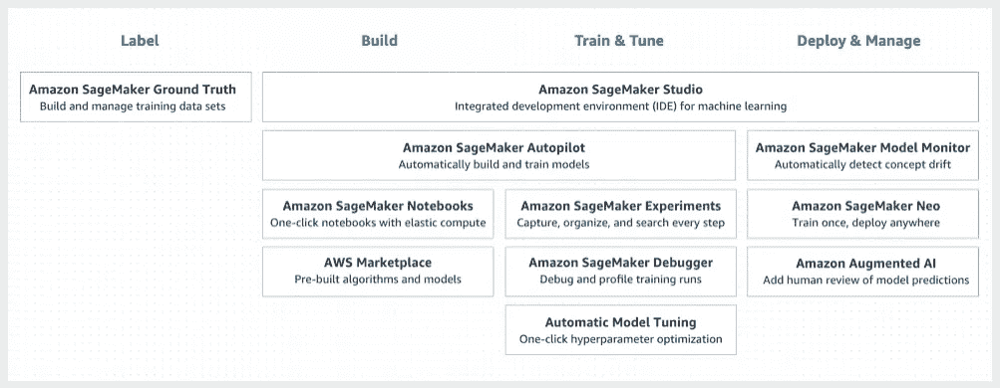
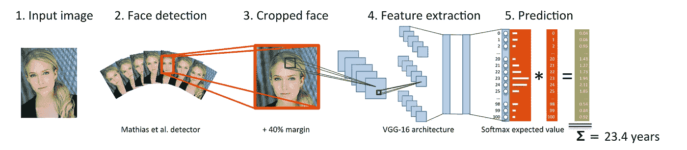
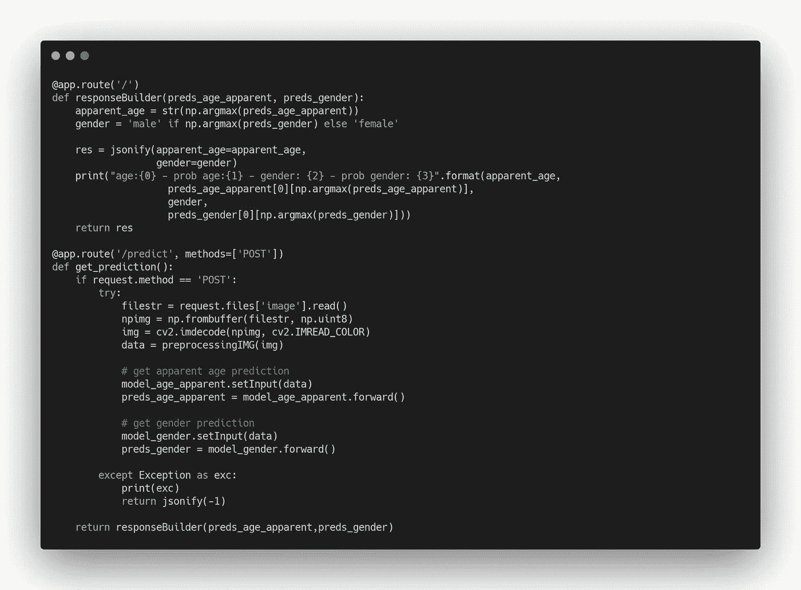
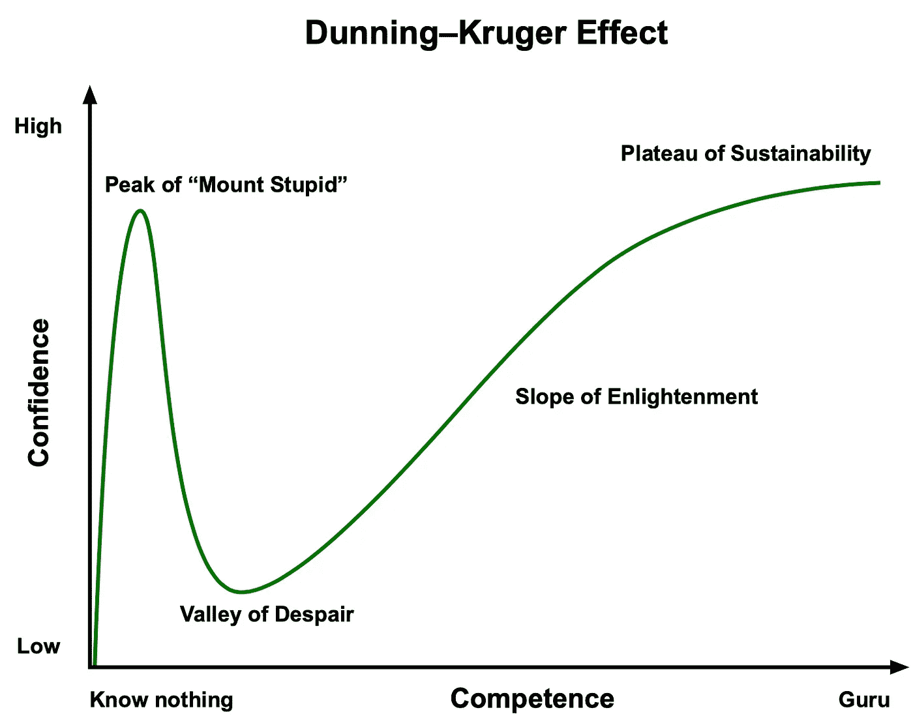
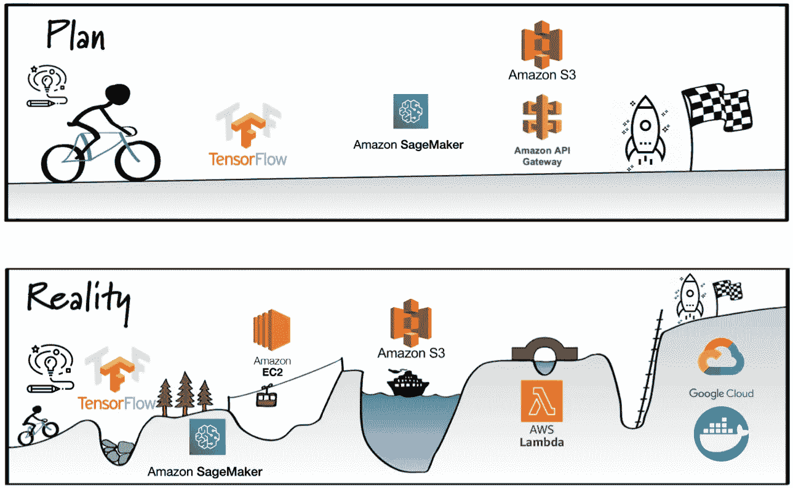

# 从(几乎)未能在云中部署简单的机器学习模型中吸取的教训

> 原文：<https://towardsdatascience.com/lessons-learned-from-almost-failing-to-deploy-a-simple-machine-learning-model-in-the-cloud-69f041704f03?source=collection_archive---------49----------------------->

## 了解在启动人工智能和云项目时应该避免犯的主要错误。

萨姆·穆格迪钦在 [Unsplash](https://unsplash.com?utm_source=medium&utm_medium=referral) 上拍摄的照片

通过这篇文章，我们将向您展示我们在一个旨在云中部署年龄猜测神经网络模型的简单项目中所犯的主要错误。

令人欣慰的是，我们能够发布一个足够好的项目版本，可以在[这里](https://www.face2age.app)访问。它的源代码可以在专用的 [GitLab 链接](https://gitlab.com/jbernales/age-guess)中找到。

# **项目背景、目标和方法**

作为一名网络安全顾问和一名为大公司工作的初级软件工程师，我们一直对云感兴趣，并希望了解这项技术如何用于开发简单的人工智能应用程序。

有了新冠肺炎和洛克德斯，我们开始有了许多想法，这些想法结合了我们在短暂的职业生涯中学到的技能。然而，我们决定在进入一个更复杂的项目之前，先从一个非常简单的想法开始:部署一个简单的、可用于生产的 web 应用程序，该应用程序将通过一个训练有素的神经网络来猜测人们的年龄。

我们专注于创造过程，学习做事的“最佳方式”。我们定义了以下约束条件:

*   遵循“最先进的”实践来训练我们的模型和部署我们的产品；
*   每月的运营成本为 0€；
*   由于无服务器服务，有一个可以“无限”扩展的产品(在这种情况下，我们知道 0€/月运行成本只有在很少或没有流量的情况下才有可能)；
*   构建一个用户友好的“最终产品”,让人们从中获得乐趣；和
*   享受建造过程。

基于我们的项目背景和目标，我们的方法是遵循以下步骤:

1.  获取大量图像及其相关年龄的数据集
2.  选择最先进的卷积神经网络(CNN)来训练(在云上)功能年龄预测器
3.  将这个训练好的神经网络模型移植到 AWS SageMaker 中免费服务
4.  创建一个有角度的前端应用程序，并通过 S3 桶为其服务
5.  使用 API Gateway 创建一个 API，并使用 lambda 函数将用户图片上传到 SageMaker 并检索结果
6.  瞧啊。0€运行成本快速和可扩展的年龄识别服务

> 这个项目看起来很容易构建和部署，不是吗？

# 四大错误

在审视这种方法时，我们低估了一些关键词的潜在难度，并且没有问自己一些相关的问题，例如:

*   **第一步** —“获取”:数据集质量如何？数据是否平均分布且平衡良好？其他用户测试过数据集吗？
*   **第二步** —“选择”:选择神经网络模型就这么简单吗？我们如何训练它？我们如何知道我们走的是正确的道路？
*   **步骤 3** —“迁移”:将一个模型移植到 SageMaker 有多容易？培训脚本是否与当地使用的脚本相似？主持一个训练有素的模特是免费的吗？

在思考如何写这篇文章时，我们意识到我犯的大多数错误可以归纳为四大错误。如果你是人工智能和/或云的新手，我们希望我们在该领域非常短的经验可以帮助你避免犯同样的错误。

## I .根据流行词汇指导您的技术选择

在过去的几年里，我们听到了很多关于完全托管的 PaaS(平台即服务)和 SaaS(软件即服务)产品的精彩世界。对于我们的项目，我们希望使用一种服务，这种服务允许我们部署经过训练的模型，而无需担心基础设施或成本。

多亏了快速的谷歌搜索，我们了解到目前最时尚和最便宜的(通过免费层优势)服务叫做 AWS SageMaker。我们选择这项服务的决定是基于[产品页面](https://aws.amazon.com/sagemaker/)上的第一句介绍:“Amazon SageMaker 是一项完全托管的服务，它为每个开发人员(…)提供了快速构建、训练和部署机器学习(ML)模型的能力”。

来源: [SageMaker 主页](https://aws.amazon.com/sagemaker/)

如前所述，我们的目标是“快速”开发一个 TensorFlow Python 项目，并将该项目迁移到 SageMaker，以便在模型运行后对其进行训练。我们相信将源代码迁移到 SageMake 只需要很小的重构。

然而，在开发了我们的训练脚本之后，我们意识到迁移是一个重要的过程，需要对我们的代码进行重大的重构。事实上，我们发现我们的预处理根本无法遵循 SageMaker 的训练工作流程。为了训练我们的模型，我们必须完全重写我们的训练脚本。

我们主要的(也是明显的)错误是在验证我们对 SageMaker 如何工作的理解和假设之前就直接进入代码开发。最重要的是，我们没有考虑 SageMaker 的定价模型。尽管我们知道 SageMaker 在前两个月是免费的(这应该足以训练我们的模型)，但我们发现 SageMaker 只是依赖 EC2 实例。我们知道 Jupyter 笔记本必须持续运行才能与 API gateway 配合使用。这将打破我们的两个主要要求:

*   没有运行成本；和
*   无服务器且可扩展。

很快，我们意识到这可以通过简单地阅读 SageMaker 的文档和定价模型来避免。“咄！”你可能会想。然而，我们盲目地相信这样一个受欢迎的服务将为我们提供成功所需的一切。

TL；DR:如果你不了解这项技术，不要根据它的流行程度来假设它会符合你的工作方式。在我们的上下文中，我们应该简单地修改我们的训练脚本以适应 SageMaker 的需求，而不是希望该工具可以导入任何训练脚本。

## 二。重新发明轮子

这第二个主要错误与第一个有关联，因为它实际上是第一个错误的原因。在这一节中，我们将讨论一个经典的错误，那就是试图构建专家在过去已经构建好的东西。在我们的项目中，我们意识到我们花了太多时间试图重新设计一个众所周知的高效解决方案:提供年龄识别的神经网络模型。

艾伦·奥洛克的图片。来源: [Flickr](https://www.flickr.com/photos/toddle_email_newsletters/15413603567)

> 开源社区是很棒的，大多数时候，人们很可能已经建立了很棒的工具来做你正在寻找的事情。

即使你感觉——像我们一样——对这个项目非常兴奋，你想自己构建一切，盲目地开始编码可能是个坏主意。你可能知道，强烈建议你对你想解决的话题做一些研究。

起初这听起来很明显，但是当你尝试并承受不这样做的后果时，你会明白这些话的重要性。在我们的案例中，我们立即开始研究我们的神经网络，因为我们相信我们可以不费吹灰之力就训练和部署这样的模型。

事实上，即使我们不相信我们的训练脚本或数据质量，我们也试图通过 GPU 优化的实例在 AWS 上尝试一下。结果呢？在花费了 10 次€和无数次调整之后，我们的最高结果是在训练数据集上有 20%准确率的模型。尽管我们对这个过程了如指掌，但结果却是一场灾难。

你可能会想:“如果你不想学习如何训练一个模型，为什么不直接使用一个公共 API，比如 AWS Rekognition 或者 Google Cloud Vision？”。这个问题的答案相当简单:我们项目的主要目标是学习如何**将一个人工智能模型**部署到云上，并使其可扩展和生产就绪。

在构建本地项目失败后(其原因将在下一节解释)，我们面对现实，开始寻找替代方案。我们开始做一些研究，我们找到了我们想要的: [DEX:对单一图像的表观年龄的深度期望](https://data.vision.ee.ethz.ch/cvl/rrothe/imdb-wiki/)。

来源:https://data.vision.ee.ethz.ch/cvl/rrothe/imdb-wiki/

拉斯穆斯·罗斯、拉杜·蒂莫夫特和吕克·范·古尔发表了一个数据集，其中包含超过 50 万张带有年龄和性别标签的图像，以及他们各自的训练模型。蛋糕上的樱桃是这篇论文是 2015 年 NVIDIA 表观年龄竞赛的获胜者。我们从试图自己构建一切到拥有一个最好的随时可用的年龄识别模型👏。

在这一点上，我们面临的事实是，这份文件比我们能够建立的任何东西都好，而且远远好于任何东西。事实上，我们意识到这不是一件坏事，因为我们不是数据科学家，我们的目标从来不是改善预测面部年龄的艺术方法。虽然我们很难过看到我们不能实现我们自己的训练模型，我们知道更好的人已经建立了一个令人敬畏的模型。因此，对我们来说，显然我们应该重用这个模型。

我们的问题是，我们开始着手项目中我们不一定感兴趣的部分，因为我们认为它们是微不足道的。这意味着我们最终重建了一个更差、性能更差的神经网络模型。

从积极的方面来看，通过阅读论文，我们了解了很多关于深度学习的知识，更具体地说，训练模型不是一项简单的任务。最重要的是，我们的大部分约束(边做边学，玩得开心，构建一个真正的产品)仍然完好无损，这意味着我们仍然有动力继续前进！

## 三。两次被同一块石头绊倒

在放弃开发和训练我们自己的 ML 模型的希望后，我们开始致力于后端工作，一旦上传一张照片，就可以向用户提供他们的年龄。

我们开始开发一个简单的 Flask API，以便确认我们能够理解如何使用经过训练的模型。结果是一个大约 90 行长的简单 python 脚本:

摘录我们的源代码 Flask API。用[碳](https://carbon.now.sh)生成的截图。

一旦我们验证了这个 API 可以在本地工作，我们的下一个目标就是将它迁移到一个“免费使用”和“无限可扩展”的 AWS 服务。考虑到这一点，我们选择了使用 AWS API Gateway 和 AWS Lambda 函数。由于我们以前有过使用这些工具的正面经验，我们甚至懒得检查任何限制，因为我们“知道”如何去做。

我们在尝试使用 OpenCV 和其他依赖项启动 Python Lambda 函数时遇到了第一个问题。我们了解到这可以通过 [Lambda 层](https://medium.com/@adhorn/getting-started-with-aws-lambda-layers-for-python-6e10b1f9a5d)以及将我们的 Lambda 函数与其依赖项打包来实现。经过大量故障排除后，您会发现以下经验教训:

*   为了正确下载和打包 lambda 函数，你应该从亚马逊 Linux 兼容系统下载依赖项(即从 MacOS 运行***pip install-t . opencv-python***会下载不兼容的二进制文件)；
*   运行在 Python 3.8 上的 Lambda 函数不能导入和运行 OpenCV，因为诸如 libgthread-2.0 之类的系统文件不包含在运行时环境中。应该用 Python 3.7 来运行 OpenCV。

在学习了如何正确下载我们的脚本依赖项并打包它们之后，我们将脚本上传到 lambda 环境，并注意到剩下的步骤是导入并使用我们训练好的 ML 模型。

我们又一次面对残酷的现实:Lambda 函数有严格的存储限制。通过阅读 Lambda 的官方文档，我们注意到每个功能部署包的最大大小是 250 MB，而我们的 ML 模型是 500 MB 和 600 MB。

*请注意，这可能不再准确，因为* [*Lambda 现在支持 EFS*](https://aws.amazon.com/about-aws/whats-new/2020/06/aws-lambda-support-for-amazon-elastic-file-system-now-generally-/)*。*

我们又一次被同一块石头绊倒了:我们没有花时间去阅读和了解我们想要使用的产品的局限性。我们再一次被这种“功能即服务”产品所带来的宣传和伟大的用例所盲目引导。在这种情况下，我们高估了自己的技术知识，因为我们从以前的经验中获得了巨大的成果。

在尝试移植我们的代码之前应该做些什么？做一些基础研究，了解产品是否适应我们的需求。似乎选择最受欢迎的产品有时意味着做出一个非常糟糕的技术选择。例如，我们应该在开始之前阅读的内容[“为什么我们不使用 Lambda 进行无服务器机器学习”](/why-we-dont-use-lambda-for-serverless-machine-learning-d00038e1b242)。

## 四。低估难度，高估自己的知识

这个项目是由这样一种信念驱动的，即我们知道如何“正确地”做事情，即使我们在我们处理的领域(即人工智能和云)经验很少。第四个也是最后一个主要错误实际上是我们其他错误的原因:我们低估了交付生产就绪产品的难度，同时过于自信地认为，根据我们对每一种底层技术的阅读和听说，我们对应该如何做事情有足够的了解。

我们从网上的大型数据集开始了我们的项目。我们主要是通过 [Kaggle](https://www.kaggle.com/frabbisw/facial-age) 搜索，找到了一个有 10000 张脸的模型，上面标注了年龄。“太好了！”我们认为——但当我们开始深入研究数据时，我们意识到创造一个好的预测器的道路并不像我们想象的那样平坦。

**首先，我们低估了免费获得合适数据集的难度:**

**数据量:**虽然我们从来不认为自己是人工智能领域的专家，但我们知道，只有来自 100 个不同人的 10，000 张人脸不足以训练一个准确的模型。在这种情况下，我们意识到数据量是不够的。此外，当我们分析每个年龄的人脸数量时，我们意识到数据集完全不平衡。尽管我们试图通过年龄范围对人脸进行分组来平衡数据集，但结果仍然非常不平衡。我们注意到 90%的可用图片来自 30 到 50 岁的人。

**数据质量:**除了上一期，我们发现数据有偏差。我们注意到大多数照片都是名人的照片。我们知道我们不能用山谬·里维的照片，希望普通人看起来像他一样年轻。最重要的是，我们注意到一些图像被裁剪，会显示出面部相当不完整的部分。

经验教训:在开始用数据集训练神经网络之前，请花时间确保您下载的数据具有足够的样本质量和数量。

**然后，我们高估了我们对 AI 和云以及目标解决方案的了解。**

作为非常好奇的人，我们总是试图在最短的时间内了解尽可能多的东西。在这种情况下，云和人工智能的概念是我们花了大量时间阅读公司和创业公司所做的伟大事情的两个主题，但用于理解和深入研究所用技术的时间非常有限。

本质上，我们可以说我们对想要使用的技术的了解非常少，尽管我们觉得自己知道的很多。这可以用下面的图表来解释，我们相信你们很多人对此都很熟悉:

邓宁-克鲁格效应([来源](https://commons.wikimedia.org/wiki/File:Dunning–Kruger_Effect_01.svg)

不用花太多时间分析这个图表，我们就可以确认，在这个项目开始时，我们感觉到了“愚蠢山的顶峰”附近的某个地方，随着时间的推移，我们能够进入迪塞普山谷。这个项目帮助我们认识到我们对机器学习知之甚少。

我们学到了重要的一课，即选择正确的技术和正确的数据并不总是简单的。在创建一个可行的概念验证和部署一个用户友好的“最终”产品之间存在着巨大的差距。

# 结果呢？谷歌云，虚拟机和 Docker！

我们项目的自制图形描述

从上面的图片中，你会看到我们对现实的期望。我们多次错误和改变的结果导致了下面的“最终”结果:

*   我们没有用自己的数据集来训练模型，而是用一个更好的数据集来训练模型；
*   我们没有将后端移植到 SageMaker，然后移植到 Lambda，而是使用 docker 容器来服务 Flask API
*   我们没有在 AWS 上托管我们的后端，而是最终使用了谷歌云和作为账户免费层一部分提供的 300€。

通过对照我们的主要目标进行自我评估，我们得出了以下结论:

*   ***遵循“最先进”的实践来训练我们的模型并部署我们的产品:*** 虽然我们的解决方案不是我们所期望的，但我们尝试使用最健壮、最相关的技术。从这个意义上说，我们决定使用一个流行的、健壮的训练过的模型，而不是我们自己的模型。关于前端，它存储在由 CloudFront CDN 提供服务的 S3 桶中。这意味着成千上万的用户可以访问前端，而不必扩展我们这边的任何东西。看看后端，为了使我们的应用程序可复制和可移植，我们决定将 flask API 容器化，并用 NGINX 容器来服务它。我们认为自己对结果十分满意！
*   ***每月运行成本为 0€*:**我们实际上在这一点上作弊了，因为我们的后端运行在 Google Cloud 的虚拟机中。然而，由于免费层帐户，我们将能够免费运行它至少 1 年。我们会说，我们部分验证了这一点。
*   ***有一个产品可以“无限”扩展，这要感谢无服务器服务:*** 我们在这一点上非常失败。但我们相信，无服务器解决方案仍能满足我们未来的需求。我们将很快在以后的文章中记录下我们的后续步骤！
*   ***打造一款人性化的“最终产品”，让人乐在其中，无需任何解释:*** 我们会让你自己决定！欢迎访问[https://www . face 2 age . app](https://www.face2age.app)，告诉我们 UX 是否适合您！
*   ***享受建造过程:*** 谢天谢地，这是我们最成功的一点！我们强烈建议和你的朋友或同事一起参加一个小项目，学习新的东西！

# 遗言和下一步

在这个项目的构建过程中，我们注意到我们不断犯的错误越来越少，花费的时间也越来越少，因为我们找到实用解决方案的能力增强了。下面我们列出了从这个项目中吸取的经验教训:

*   在直接进入编码之前，进行多次谷歌搜索，将其他解决方案与你想要的进行比较；
*   起草或设计解决方案后，花些时间考虑可能出现的限制和问题。通常，每当你在没有可靠经验的情况下做出假设时，这些问题就会出现；和
*   如果你以前从未做过某事，避免对你的计划过于自信，将你的时间期望值乘以 3。

那么下一步是什么？

尽管我们对我们的解决方案结果和该项目取得的成果非常满意，但我们意识到，该解决方案离“生产就绪”还很远，因为我们目前在单个(性能不是很好的)虚拟机中托管我们的模型。这意味着如果我们的项目突然流行起来，基本上就崩溃了。可以使用多种解决方案来确保项目以非常有限的成本进行扩展。以下是我们的一些想法:

*   用现有的解决方案替换后端。例如，我们可以使用 AWS Rekognition，并有 5000 个免费的每月预测。
*   将后端迁移到 PaaS 产品，如 AWS ECS 或 Fargate，这将允许我们根据需求进行扩展。然而，这种解决方案会转化为更高的成本，感觉有点“大材小用”。

# 关于我们

我是 Jonathan Bernales ，在 Deloitte Luxembourg 工作的网络安全顾问，我主要为金融服务行业工作，我对技术和安全如何随着时间的推移改变行业并创造商业机会充满热情。

我是曼努埃尔·库比洛，一名软件工程师，热爱科技以及科技对我们生活的影响。我对人工智能、云和软件开发充满热情。我一直在寻求学习新的东西。在我的空闲时间，我喜欢运动和阅读。

请随时与我们联系，如果你有任何问题或想有一个关于这个项目的教程！