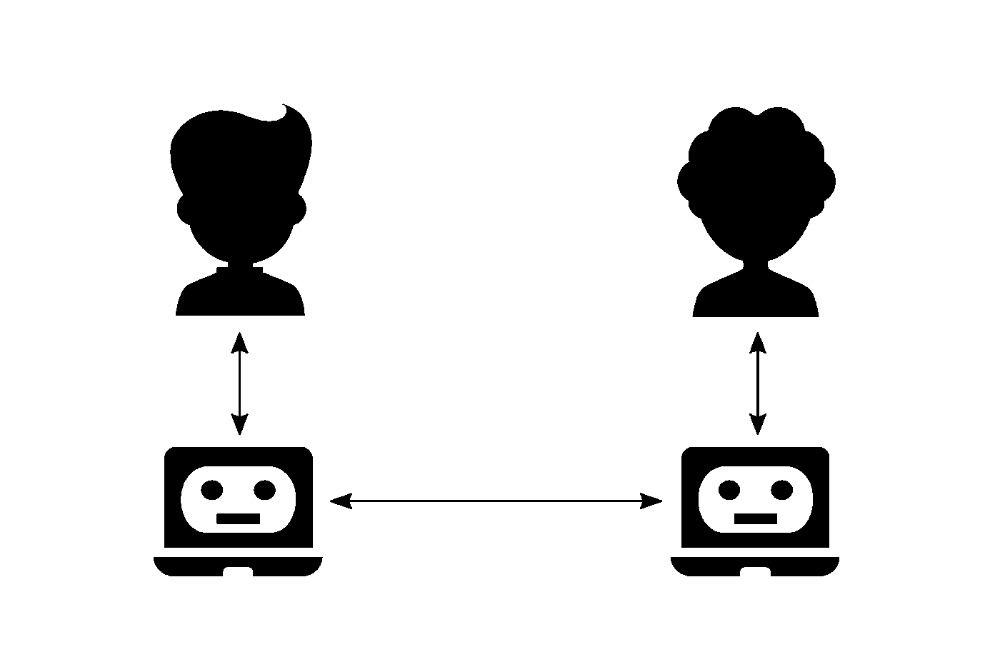
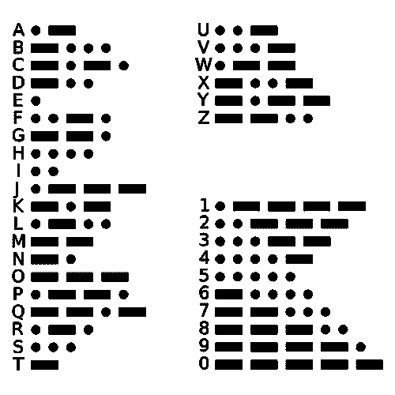

# 让电脑说话

> 原文：<https://towardsdatascience.com/let-computers-talk-b840978cc94e?source=collection_archive---------63----------------------->

## 起初是这个词

H 人类在所有物种中是独一无二的，就像电脑在所有手工制作的东西中一样；他们都配备了*语言*。语言是文明最基本的基石，是思维和交流的要求。人类创造了计算机，并用语言武装它们，以便于解决问题。这到底是怎么发生的？这个过程很简单:人类思考，与计算机对话，并通过算法向它们发出命令，然后计算机可以做一些工作，并与自己对话来解决问题(图 1)。语言是这个过程的基础，并提供了人机和计算机之间的交流方式。

*图一。人机&计算机与计算机的互动。(上图:来自名词项目的 Kidaha 的人类，下图:来自名词项目的 Vector Market 的计算机机器人。)*

# 什么是语言？

语言是通过信息进行交流和传递信息的工具。语言的基石是*字母表，*是一组符号。有了字母表，我们可以通过把符号放在一起创造出*单词*——简单概念的原子引用。一个有效的*句子——*对更复杂概念的引用——可以被认为是一个具有正确*语法*的单词序列(在自动机理论中句子被称为*字符串*，在通信中称为*消息*)。语言是所有语法正确的句子的集合。因此，我们可以将语言 *L* 定义为三元组 *(A，W，G)* ，其中 *A* 是字母表， *W* 是单词集， *G* 是指定句子有效性的底层语法。让我们看看不同语言的例子。

1.  洞穴绘画

*   字母表:{马的形象，人的形象，…}
*   单词:字母表的每个符号也是一个单词(1 个符号的序列)
*   句子:一幅男人猎鹿的画(图 2)

图二。洞穴绘画。

2.英语书面语言

*   字母表: *{a，b，c，…，1，2，3，…}*
*   单词:*苹果*(a-p-p-l-e)(5 个符号的序列)
*   句子:“*把苹果放在桌子上”*(6 个单词的序列)

3.莫尔斯电码

*   字母表:*{破折号➖，点号}*
*   单词(代码字):

图 3。詹姆斯·坎乔的摩斯代码字。

*   句子:代码字的任意序列。

4.汇编语言

*   字母表: *{a，b，c，…，1，2，3，…}*
*   词语:*添加*，*换挡*， *$s1* ，…
*   句子:"*添加$s1，$s2，$s3"*

5.编程语言

*   字母表: *{a，b，c，…，1，2，3，…}*
*   词语:*如果*，*而*，瓦尔纳姆斯，…
*   句子:"*打印('此处')"*

如你所见，不同的语言有不同的*用例*；例如，书面语言不适合盲人，他们可能会使用盲文代码。另一个方面是创建(*编码*)和理解(*解码*)消息的难度。例如，洞穴绘画很容易创作和理解，而为了使用书面语言，你应该先去上学。然而，书面语言比岩画更有力量，因为你不能说“请等等！”仅仅通过绘画。

# 一起解决

人类和计算机如何一起解决问题？首先，我们需要知道计算机到底能做什么。物理上它们是由电和导线构成的，粗略来说，它们只能感知电流的存在(存在与否)。由于这种二进制的性质，它们可以处理二进制序列:在它们的门中接受二进制输入并处理它们。这样，我们就可以为它们提供指令，并通过数字电路实现一些基本操作:对内存(寄存器、RAM 或磁盘)的读写、加法、移位等。因此，我们可以收集所有盖茨的输入，以预定义的格式(语法)对它们进行排序，并构建一种具有{0，1}字母表的语言。这种语言叫做*机器码*。例如，R 型 MIPS 指令具有以下格式:首先是 6 位操作码，然后是三个 5 位寄存器名称(总共 15 位)，然后是 5 位移位码，最后是 6 位功能码，这使得它成为总共 32 个符号的序列。

机器代码是计算机理解的语言，尽管我们不能直接使用它，因为它很难使用。我们使用另一种叫做汇编语言的语言，这是一本用英语写的计算机手册。例如*“add $ S1，$s2，$ S3”*表示将寄存器 *s1* 和 *s2* 的内容相加，并将结果放入 MIPS 汇编中的寄存器 *s3* 。现在的问题是，我们如何将汇编语言翻译成机器代码？

假设 *L1* 是汇编语言 *L2* 是机器码。为了将 *L1* 翻译成 *L2* (编码)，我们可以简单地通过分配一些预定义的码字(例如*‘add’*映射到 *000000* )将 *W1* *(add，shift，$s1，…)* 映射到 *W2* (二进制序列)，并将这些码字与正确的语法放在一起，这很容易由*汇编器完成因此，有了机器代码和汇编语言，我们就可以和计算机对话。但是你能把你的想法翻译成汇编语言吗？答案是否定的。需要一种更高级的编程语言，更类似于人类语言。诸如 Java 和 Python 之类的编程语言以及它们的编译器和解释器就是为此目的而设计的。因此，语言的层次结构构建了我们与计算机的交互。*

# 沟通

现在，我们已经解决了我们的问题，是时候交流了！假设艾丽西娅想通过他们计算机之间的网络与鲍比通话。但是使用计算机网络，我们只能传输比特，这是计算机语言的字母表。因此，解决方案是首先将我们的语言翻译成一些比特(编码)，然后传输这些比特，最后再将它们翻译回来(解码)。因此，我们应该设计一种带有二进制字母表的语言，并指定如何将我们的语言翻译成二进制字母表。莫尔斯电码是一个很好的研究案例。

假设 *L1* 是英语，我们想通过设置 *A2* 、 *W2* 、 *G2* 来建立 *L2* (莫尔斯码)。我们可以简单设置 *A2={dot，dash}* ，这是一个二进制字母表。但与汇编语言不同，英语有很多单词，我们不能简单地在 *W1* 和 *W2* 之间建立一对一的映射。莫尔斯电码的解法是先将 *A1* 中的每个符号映射成一个码字(如*“A”→“点-划”*)，然后将它们串联起来，达到 *W2* 中的单词表示(如*“AS”→“点-划点-点”*)。 *G2* 也没那么难，几乎任何码字序列在 *L2* 中都有效。这样，我们可以把我们的语言翻译成莫尔斯电码，并通过计算机进行交流。

沟通的成本是多少？考虑一下这个问题:为什么我们不把*“A”*赋给*“破折号-破折号-点破折号”*而在莫尔斯电码中不赋给*“Q”*？因为 *A* 比 *Q* 要常见得多，而且使用*“点划线”*会导致消息长度短得多。因此，我们可以将通信成本定义为传输消息的长度(*#符号*)，并定义最佳编码:平均来说导致更短消息的编码。这是信息论偏好的答案。

信息论研究通信的潜在限制，并试图找到对消息进行编码所需的最少比特数，其基础是假设信息源正在生成具有已知概率分布的单词序列(随机过程)。假设我们有在其上具有离散概率分布的 k 个字和一个源，Shannon 表明对于最佳码字分配，具有 N 个 T21 字的消息将被编码为至少 N 个比特，其中 H(p)是不确定性的度量事实上，在最佳码字分配中，我们试图将较短的码字分配给更可能的结果，并且如果看到字 *wi* 的概率是 *pi* ，我们试图将其分配给具有非整数长度 *log(1/pi)* 的码字(例如，通过霍夫曼编码)，并且当 *N* 趋于无穷大时，具有非整数长度的码的问题逐渐消失。

# 能力

哪类问题可以通过计算机解决？用什么成本？这些问题被称为可判定性和复杂性，并在自动机理论领域找到了答案。对于一个是/否 problem⁴，我们可以把所有正面实例的表示放在一个集合中，并建立一种语言。所以我们应该决定一个表示是否是这种语言的成员。由机器来做这个决定，可能是可能的，也可能是不可能的，问题的难点就在这里。

一些语言，像由正则表达式(正则语言)和上下文无关文法(上下文无关语言)生成的语言，很容易分别由有限自动机和下推自动机决定。但是一些语言可能有更复杂的隐藏结构(语法),可能更难决定或识别，即使是通过图灵机。例如，所有有效 C++代码的集合是可判定的，因为它是一种上下文无关的语言，并且 C++编译器可以判定它。然而，具有整数根的多元多项式的集合是不可判定的；这意味着没有保证的算法来批准多元多项式是否有整数根。

即使一种语言是可判定的，判定它的时间复杂度也是一个重要的问题。时间复杂度通过达到长度为 n(例如，它可以是 n)的输入的答案所需的最大操作数来测量。通常我们需要多项式时间复杂度的解，指数解不适用。具有多项式判定器的问题建立了 P 类，而具有多项式检验器的问题建立了 NP 类。这些概念在复杂性领域讨论。

# 笔记

1.  在这份文件中，我将坚持*一词*的概念。许多定义像自动机理论中使用的那样，不包含单词。在那些定义中，假设每个符号都是一个有意义的原子引用，所以它相当于本文档中的一个单词。
2.  参见“*封面，T. M .，&托马斯，J. A. (2012)。信息论的要素。约翰·威利的儿子们。*
3.  参见*“Sipser，M. (2012)。计算理论导论。Cengage 学习。”*
4.  我们可以通过考虑答案的二进制表示，并为每个位建立一个是/否问题，将一个问题简化为一些是/否问题，并并行求解它们。因此，我们可以只关注接受/拒绝问题。