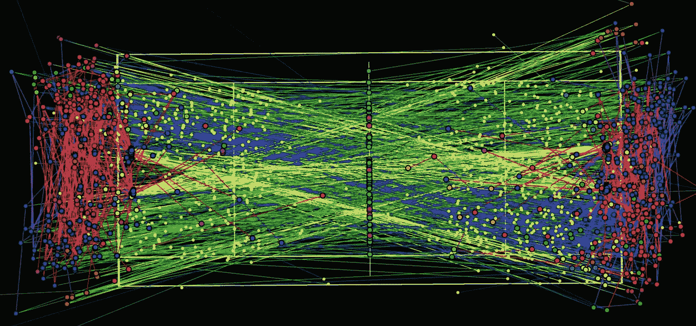
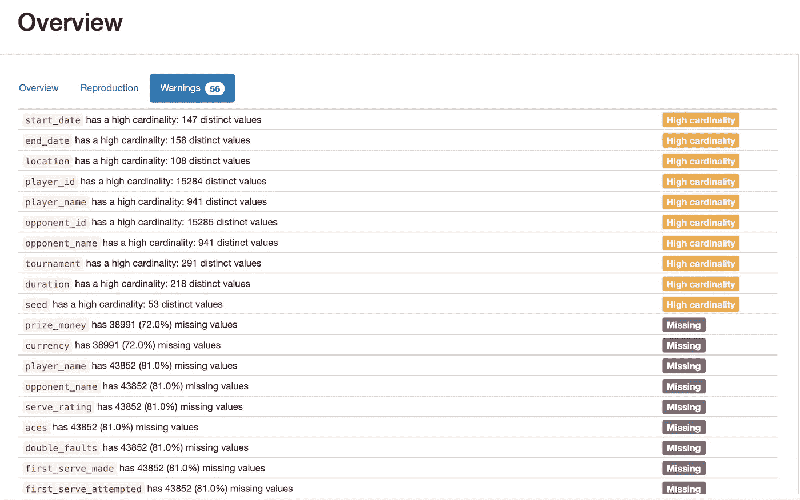
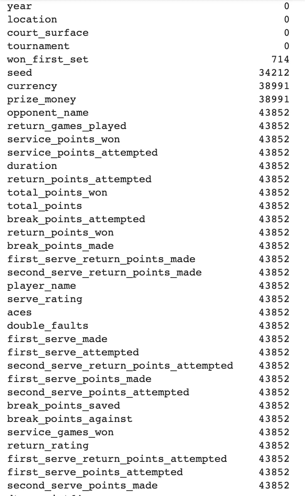
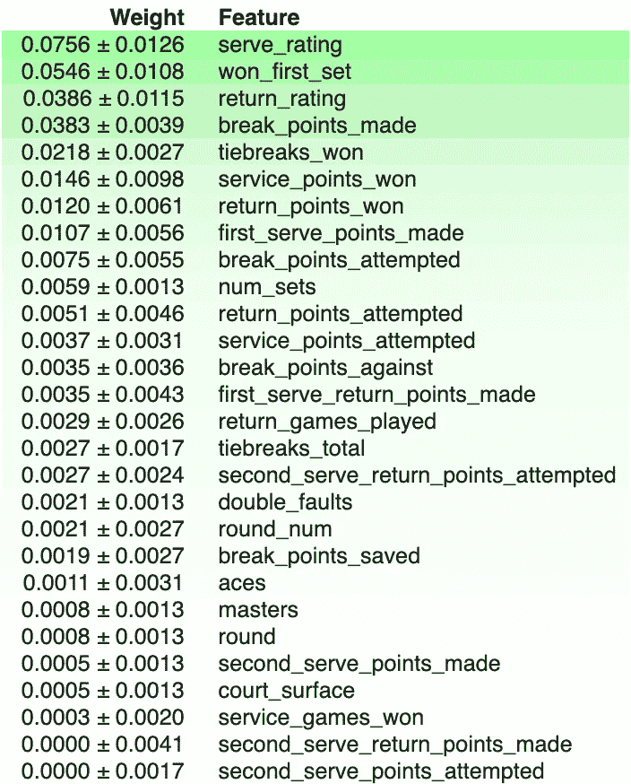
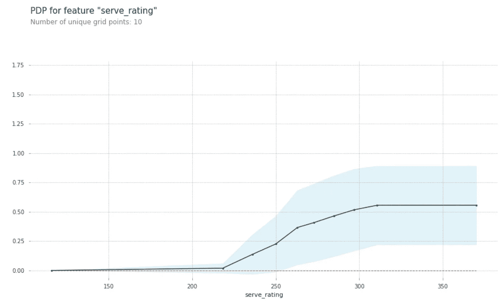
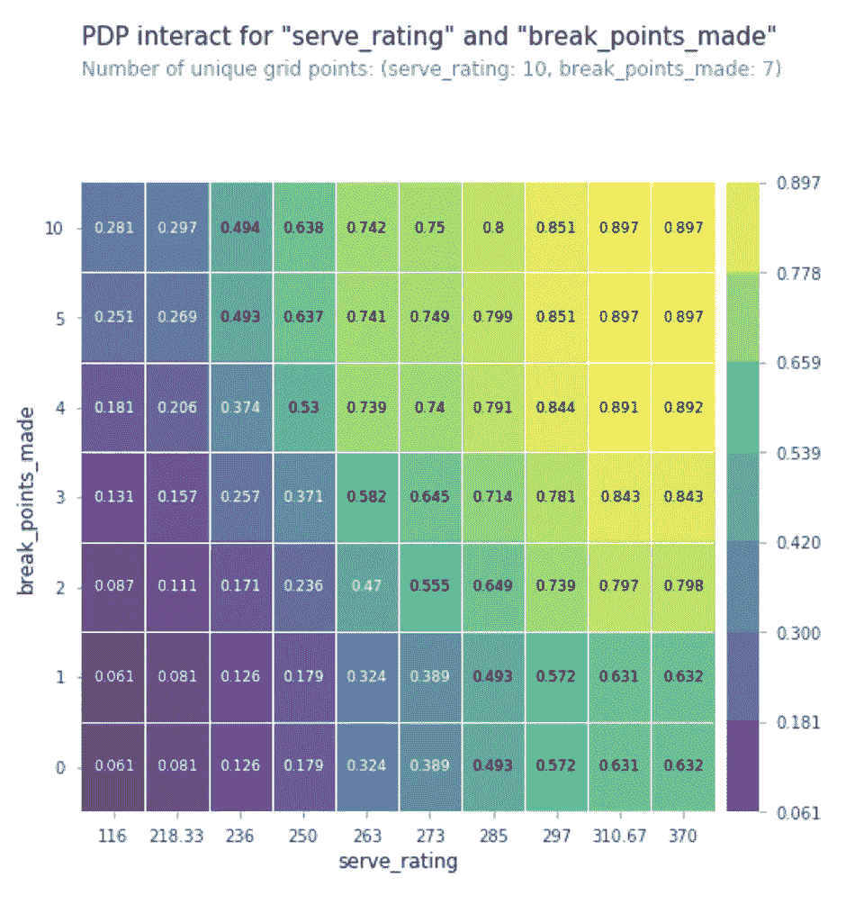
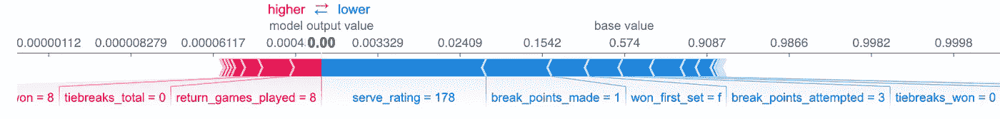

# 让数据提高你的网球水平

> 原文：<https://towardsdatascience.com/let-data-improve-your-tennis-game-37f346377663?source=collection_archive---------22----------------------->

## 如何使用机器学习模型，通过基于从数据中提取的最重要的指标构建更有效的游戏策略，来提高一个玩家赢得游戏的机会

达米恩·桑德斯，ESRI“数据转储”了 2012 年奥运会金牌得主罗杰·费德勒和安迪·穆雷之间的每一个球的反弹和击球。

我是个网球爱好者。我喜欢每周打网球，看网球，甚至打梦幻网球。尽管梦幻网球不像梦幻足球那样普及，但世界各地仍有相当多的人参与其中。有多种格式，但最常见的是括号。在括号格式中，幻想的网球运动员试图预测谁将是锦标赛中所有网球比赛的获胜者。我也经常打网球，从童年开始，我就一直想知道是否可以通过专注于比赛中更重要的部分来提高我的比赛，我试图询问许多人对比赛中最重要的技能的看法，但没有一个答案对我来说足够有说服力。幸运的是，我发现了近 6000 场比赛的数据，决定看看这些数据是否不仅能提高我的比赛水平，还能提高我在比赛中获胜的几率。

# **数据集**

数据集从 ATP 的网站上收集，初始格式包括从 1968 年到 2018 年部分时间的几乎所有 ATP 比赛。该数据包括许多有趣的特征，如选手排名、比赛时累积的点数、比赛统计、比赛中每位选手击中的 ace 球数、选手发球和回球率等。不幸的是，有许多特征数据没有包括在内，比如正手统计，而且，许多早期的观察没有包括所有的特征。我决定缩短数据并从数据中删除所有 2000 年以前的比赛，主要有两个原因，首先是比赛的性质和 ATP 比赛的形式从 2000 年开始发生了变化，其次是为了节省时间，因为数据太大了，在我的本地计算机或谷歌 Colab 上处理需要太多时间。

所有使用的数据集和预测建模笔记本可以在[这里](https://github.com/amindazad/ATP_ITF_TennisMatch_Winner)找到。

图 1:为获胜的游戏提供的第一个服务

# 数据清理

预处理的第一步是处理包含空值和零值的列，然后将所有单个数据集合并成一个大数据集。因为所有的数据集都包含一些相同的特征，所以这很简单。

图 2:带有缺失值或高基数的一些列的 Pandas 概要分析报告

第二步是消除数据集中的泄漏和一些偏差。由于原始数据根据数据是属于获胜玩家还是失败玩家，用列名“赢得的总点数”和“赢得的组数”来标记所有数据，因此有必要删除一些列以防止泄漏，并重新标记一些相关列以避免使用数据构建模型时可能导致的偏差。为此，我将玩家 1 随机分配给赢家或输家，将玩家 2 分配给另一个玩家。随机分配的结果是玩家 1 大约有一半时间是赢家。

第三步是过滤数据集，以避免零或空值，并只包括那些两个球员的排名都可用的观察，因为我直觉地认为这将是最强的预测。这将观测数量从大约 10k 减少到大约 6k。尽管这是一个巨大的减少，但事实证明大多数被丢弃的数据缺少重要的信息。

图 3:一些列中的空值。原来在那些年里，他们没有被记录下来

# 特征工程

一些先前的机器学习模型仅使用两个玩家的排名来预测比赛结果。这是有意义的，因为排名捕捉了玩家在过去一年中的表现，并且很可能是玩家当前战胜低评级玩家的能力的强有力的预测器。然而，还有许多其他类型的信息可能有助于预测比赛的结果，在某些情况下，它们可以用于预测直播形式的比赛结果。例如，两个玩家过去的对决可能非常相关，尤其是最近的比赛，或者在部署我的模型后，我发现赢得第一盘是比赛结果的强有力指标。球员发球和回球的质量也很重要。

图 4:两个特征工程柱之间的关系

为了更好地捕捉每个球员的细微差别，我决定计算每个球员在每场比赛中的一对一比赛，以及双方球员在过去比赛中的发球得分。这些数据是 1991 年以后才有的。为了确保过去有足够的数据可用，我决定进一步限制数据集以匹配 2000 年以后的数据。这样，我就有了大约 19 年的比赛数据来计算这些统计数据。

我计算的特征包括:每分的得分率，每分的双误率，两个球员之间的正面结果，第一发球的百分比，第二发球的百分比等等。我逐点调整发球数据，以避免出现偏差，例如，如果我使用 ace 的数量，因为一名球员可能比他的对手有更多的机会击中 ace。出现的一个问题是，一些观察包括新的球员，没有以前的表现记录。一种选择是将该玩家的所有统计标记为 0，但这可能会产生有偏差的结果，因为 0 是最低的度量，并且仅仅因为玩家在记录中没有先前的匹配，并不意味着他应该被分配最差的分数。我最终决定删除所有带有 0 的观察值，这似乎不是最好的解决方案。这是将来要研究的问题。

最后，过去的大多数建模将玩家 1 特征和玩家 2 特征组合成单个特征。例如，对于等级特征，减去两个等级会将两个特征合并成单个特征。这具有产生对称模型和将特征空间减少一半的优点。但是，它有消除信息的缺点。我决定不将任何特性合并成一个单一的特性。

# 预测建模

既然这是一个分类问题(玩家胜利=真/假)。为了测试模型，我首先将数据分成 80% — 20%的训练测试部分，并使用网格搜索交叉验证来选择最佳超参数，将最佳超参数重新调整为完整的训练集，并通过 5 重交叉验证在验证和测试集上测试模型。

这个问题的基线是 0.51 的多数类准确度分数，这意味着仅仅通过猜测我们就可以预测一个玩家在 51%的时间里赢得了比赛。我使用了各种线性和基于树的模型，如逻辑回归、单决策树(用于查找漏洞)、随机 forrest 和 XGboost 来预测获胜者。XGboost 比其他模型高出约 1%,其结果是验证准确率达到 96%。

然后，我使用排列重要性来找出哪些特征对我的模型贡献最大，并发现预测赢家的最重要特征是玩家的服务等级，然后是玩家是否赢了第一盘。对我的模型有贡献的其他一些重要特征是回报率、破发点和抢七获胜。

图 5:排列的重要性

我还绘制了一个单一特征部分相关性图(图 6)以进一步探索服务评级特征，有趣的是，我发现当服务评级超过约 230 分时，服务评级在预测获胜者方面开始变得重要，并逐渐提高获胜的机会，直到它达到约 330 分。值得注意的是，对于发球得分超过 330 分的玩家来说，发球得分在预测比赛结果时失去了重要性，因为他们都有超过 60%的机会赢得比赛。

图 6:服务等级的单一特征部分相关图

然后，我想弄清楚服务等级和断点如何有助于更准确地预测比赛结果。为此，我使用了多特征部分依赖图(图 7 ),只要服务等级超过 297，并在游戏中获得 3 个以上的破发点，玩家就有大约 90%的机会赢得游戏。了解这一点对我来说是非常有见地的，无论是在提高我的比赛还是预测网球比赛的获胜者方面。

图 7:我的模型中两个最重要特性的多特性部分依赖图

我还使用了 Shapley 图来简要探索哪些特征对模型中的单个匹配有积极或消极的影响，以及它们在预测特定匹配时的影响有多强。如下图 8 所示，如果一名球员的发球得分是 178 分或更低，他只发了一个破发点就输掉了第一盘，我们几乎可以 100%肯定地预测他会输掉比赛。

图 8:沙普利图

# 结论

在所有基于线性和树的模型中，使用 XGboost 表现最好，在预测匹配结果时提供 96%的准确性。在这个过程中，我了解到预测网球比赛获胜者的一些最重要的指标是对球员的发球和接发球的评分、制造的断点、抢七局获胜以及球员是否成功赢得第一盘。

我想扩展这个模型，通过使用从第一盘和球员之间的直接比赛历史中获得的数据，计算出预测第一盘获胜者的重要参数，我将在这里和我的文件夹中公布结果。在那之前，我会把我的钱用在我的嘴上，并尝试用我在这里的发现预测一场比赛，并通过专注于获得更好的服务，提高我的回报，获得更多的断点，赢得抢七局，并尽最大努力赢得第一盘来提高我的比赛。