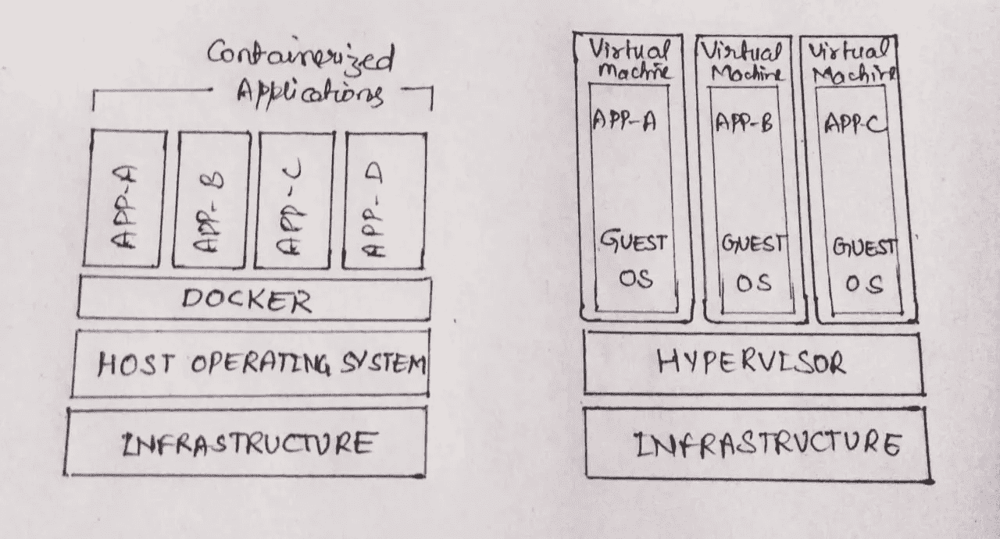

# 我来告诉你 Docker 在数据科学中的用例吧！

> 原文：<https://towardsdatascience.com/let-me-tell-you-about-the-use-of-docker-in-data-science-a47c8710f5f7?source=collection_archive---------52----------------------->

## “永远要像有东西要学一样走过一生，你会学到的。”——弗农·霍华德。


来源:凯奎·罗查的《Pexels》

我们总是努力学习生活中的新事物，无论是从经验中学习还是学习新技术以跟上时代。考虑到这一点，我们今天会学到一些新的东西。别担心，我不会下线的。你们中的许多人可能会想，在数据分析和模型建立之后会发生什么？。因此，足够的数据分析和机器学习模型的建立，今天我们将学习一些新的东西，但很多相关的东西。

在本文中，我们将了解 Docker 在数据科学中的使用及其在该领域的应用。

你们中的许多人将第一次和 docker 一起工作。别担心，我会从头开始。

**讨论要点:**

1.  Docker 是什么？
2.  我们为什么需要 docker？
3.  它在数据科学中的用例。
4.  结论。

## docker 是什么？

Docker 是一种开源技术，可以帮助我们实现操作系统级的虚拟化。它由一组工具组成，帮助我们将任何软件或应用程序打包到一个名为 container 的包中，这样它就可以在任何主机系统上运行。

没有什么东西像它只用于软件行业，它可以用在代码转移的地方。

它有时被视为虚拟机的替代品。我们可以说，如果**虚拟机**是一家酒店，那么**码头**就是那家酒店的一个房间。

它由三样东西组成**命令行、docker 服务器**和 **docker hub。**

它从命令行向**发出构建、运行和发布**映像的指令。 **Docker 服务器**控制图像及其资源，而 **docker hub** 是一个存储平台，用户可以在其中托管其容器。


来源:[像素](https://www.pexels.com/photo/steel-container-on-container-dock-122164/)

## 我们为什么需要 Docker？

你们都经历过一件事，如果任何软件或应用程序运行在一个平台上(我指的平台是操作系统)，没有必要运行一个所有其他的。这是由于低级硬件体系结构或软件不兼容性的差异造成的。为了解决这个问题，出现了虚拟机的概念。虚拟机只不过是一个离散的隔离环境，包含运行应用程序的所有必要要求。它们位于操作系统的顶层，操作系统在一个称为管理程序的软件层的帮助下控制它们。但这里的问题是，分配给一个虚拟机的内存和计算能力不能被其他虚拟机共享，并且单个虚拟机对内存和计算能力有很高的需求。因此，这消耗了大量的计算机资源，使我们的电脑注定要完蛋。



Docker 和虚拟机的对比:来源:我的图库

因此，为了应对这种影响，出现了 Docker 的概念。Docker 可以被看作是一个轻量级虚拟机，但与它有很多不同。它占用更少的空间，并且一个容器的内存可以在不使用时由另一个容器共享。这减少了 PC 的大量负载，并导致一切顺利运行。

> 现在你可能会想什么是**容器？**
> 
> 我有一个**的例子**来让它变得容易理解。假设你买了一栋新房子，你需要把你的家具和东西从旧房子搬到新房子。你会做什么？。你不能一次拿一件东西，然后改变。这将花费很多时间，而且你可能会忘记一些事情。所以你有了一个想法，把所有的东西都装在一个盒子里，然后一次全部转移，没有忘记任何东西的机会。现在把这个盒子当作一个容器，里面包含了所有的代码和依赖项，并作为一个操作系统。不，我可以把所有东西都带走。

## 数据科学中 Docker 的用例。

我给你打个比方。假设你和你的朋友正在做一个数据科学项目。你的朋友开发了一些模型，想让你看看。现在你会怎么做？我很确定您会查看项目的依赖项(库)是否安装在您的系统中。如果没有，你可以安装所有的程序，然后运行代码。

码头工人的魔力不在这里。使用 docker 你的朋友可以分享使用 Docker 创建的项目的**图像**。你可以在你的电脑上运行它，你只需要直接在你的电脑上运行它，不需要安装任何东西。

此外，如果你对 Flask 不太熟悉，你可以先创建一个具有所有功能的 web 应用程序，并创建它的映像。现在，如果你运行它的图像，它会自动托管在你的电脑上，只需一个命令，不需要做任何其他事情。

在大多数情况下，在数据科学家的模型训练和开发周期之后，模型被传递给软件工程师用于部署目的，而没有 docker，软件人员必须在新环境中安装模型测试所需的每个依赖项，这使得任务看起来相当乏味。这就是 docker 的救援方式，数据科学家只需分享预测模型及其依赖关系已经存在的图像。部署人员只需在安装了 docker 的测试环境中运行它。

## 容器图片，有什么不同？

现在把容器作为 docker 映像的一个运行实例。

很少有**术语**与这个 Docker 相关联。

> **1。d*docker 文件:*** 该文件包含创建 docker 图像的逐步命令。
> 
> **2。r*equirements . txt*:**该文件包含创建和运行项目所需的所有依赖项。
> 
> **3。 *images* :** 这是一个包含所有依赖项和代码的项目的独立实例。这是一个你可以分享的东西。
> 
> **4。c*ontainers:****这是你的 docker 镜像的一个运行实例。*

*要安装 docker 请访问 [**这里的**](https://docs.docker.com/docker-for-windows/install/) **。***

## *Docker 的基本和最常用命令。*

1.  ***启动:**启动任何停止的容器。*

```
*$: Docker start <image_id>*
```

***2。** **停止**:停止任何正在运行的容器。*

```
*$: Docker stop <image_id>*
```

***3。构建**:从 docker 文件构建一个图像。*

```
*$: Docker build <Docker file name>*
```

***4。拉:**从托管平台拉任何映像或存储库。*

```
*$ docker pull ubuntu:14.04  # ubuntu is a image at docker run*
```

***5。推送:**将图像推送到 docker hub。*

```
*$ docker push user_name/image_name*
```

***6。提交:**根据容器的变化创建一个新的图像。*

```
*# docker commit [OPTIONS] CONTAINER [REPOSITORY[:TAG]]
$ docker commit c3f279d17e0a  user_id/repo_name)*
```

*7.图像:显示系统上所有图像的列表。*

```
*$ docker images # Followed by # -q for only image id and -a for each   details of image*
```

## *结论..*

*在本文中，我们讨论了 Docker，它们在数据科学领域的需求，如何使用它们，以及它与任何虚拟机的不同之处。除此之外，我们还学习了一些基本的和最常用的 docker 命令。在下一篇文章中，我们将致力于数据科学项目中 Docker 的实现。所以请关注我，敬请期待！*

*如果你想和我联系，请访问我的 LinkedIn 个人资料。*

*谢谢你的合作。*