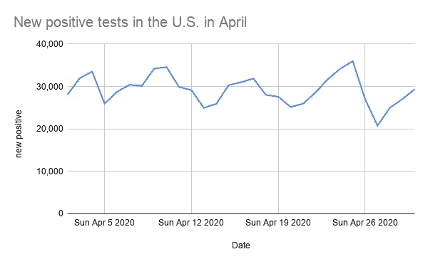
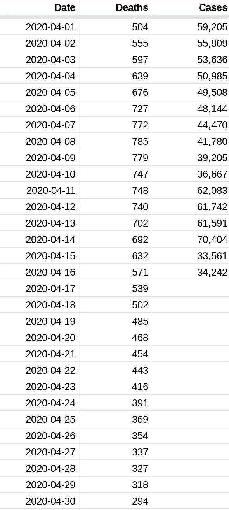
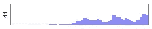
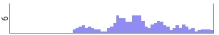
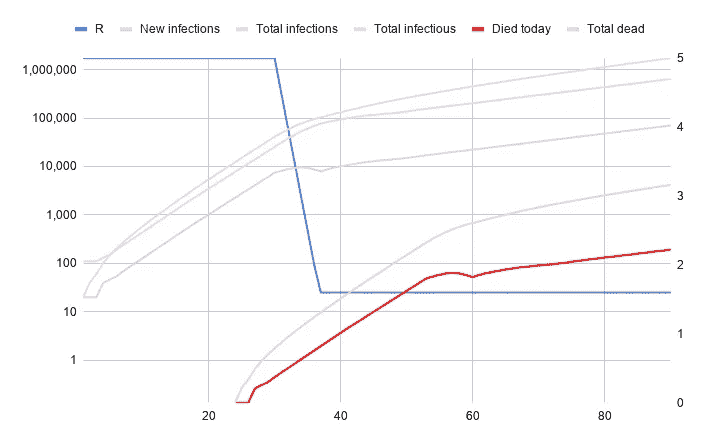
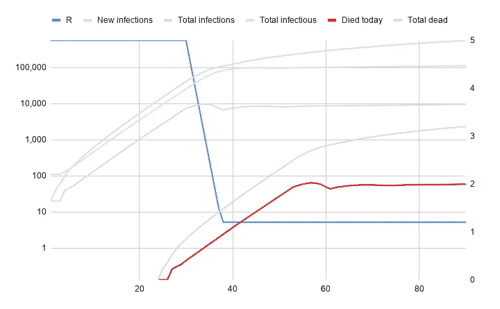
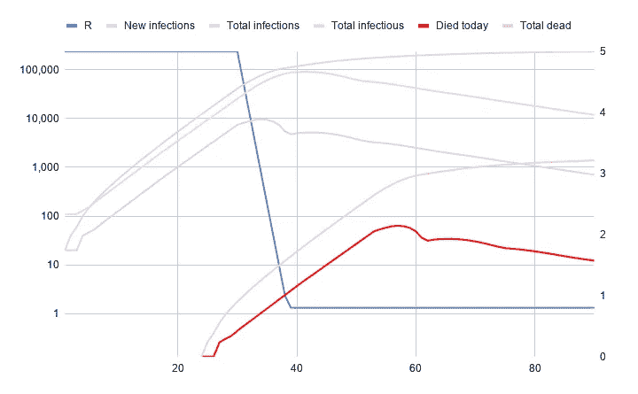
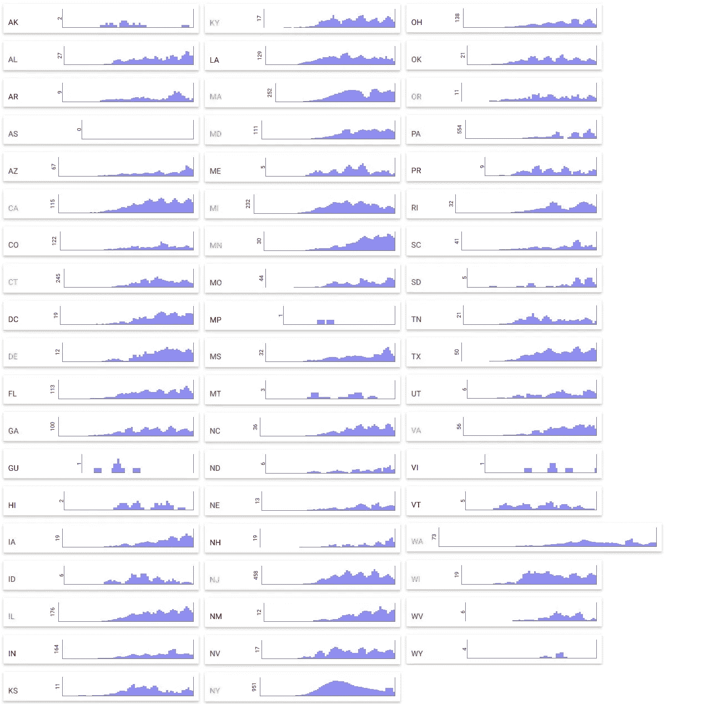
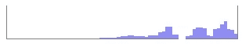
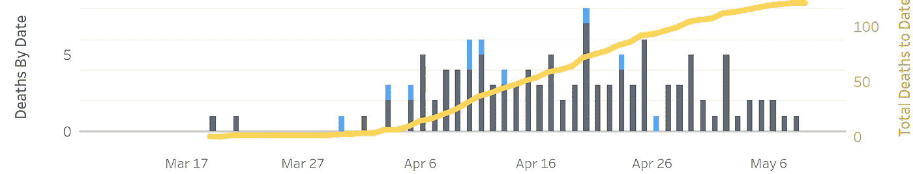

# 让死者说话——一种更可靠的观察新冠肺炎感染率的方法

> 原文：<https://towardsdatascience.com/let-the-dead-speak-a-more-reliable-way-to-look-at-covid-19-infection-rates-38ee43121a5?source=collection_archive---------59----------------------->

照片由[摩根莱恩](https://unsplash.com/@themorganlane?utm_source=medium&utm_medium=referral)在 [Unsplash](https://unsplash.com?utm_source=medium&utm_medium=referral) 拍摄

我在美国看到的大多数关于新冠肺炎的报道和政府声明都集中在两件事上:每天新增感染人数和死亡总数。问题是，就目前而言，这两个数字在决定州政府应该做什么方面都没有真正的意义，更重要的是，我们每个人现在有多大的感染风险。

在我们得到强有力的测试，阳性率下降到总数的 3%左右之前，我们应该关注每日死亡的趋势。

# 为什么我们不能依赖“新感染”

联邦政府和州政府谈论的“新感染”数字实际上是“某一天返回的阳性检测数字”。阳性测试的数量会受到一系列因素的影响:有多少测试可用，人们实际上寻求测试的频率，以及医生选择谁来实施这些测试。

如果我们在 4 月份放眼整个美国，我们会发现我们每天都在进行 107k 到 305k 之间的测试。这些测试的阳性率徘徊在 10%到 32%之间，产生的“新感染”从 21，000 到 36，000 不等。现在，这可能是那些日子里新感染的实际数字，但是一些(真正的)简单的数学和一点点理性表明，情况几乎肯定不是这样。

## 举个例子:4 月 15 日真的感染了多少人？

再来看 4 月 15 日([来源](https://covidtracking.com/data/us-daily))。基于检测的官方“新感染”人数为 30，317 人。但是这有一个问题。我们知道，死于新冠肺炎病毒的患者一般会在感染后三到四周内死亡。当我完成自己的建模时，我用了 23 天，是的，人们很容易认为价值应该更长。尽管无论是 23 天还是 28 天，情况都会有所变化，但方法和趋势结果是相同的。这意味着，在我们知道有多少人死于这种疾病的任何一天，我们都可以平均地说出 23 天前有多少人被新感染。

使用《T2 柳叶刀》上 [*研究*](https://www.thelancet.com/journals/laninf/article/PIIS1473-3099(20)30243-7/fulltext)中的数字，即 0.66%的真实感染病死率(注意，这是*而不是* CFR，并尝试将无症状病例包括在内)，我们将从 4 月 15 日起的 23 天作为预测日，并将该日的死亡人数除以 0.0066。5 月 8 日，美国有 1760 人死亡。这意味着仅在 4 月 15 日*这一天*就有大约 260000 例新感染病例。即使死亡率或死亡时间不完全正确，这两个数字甚至不在同一个区号内。在计算机科学中，我们称之为几乎一个数量级的差异。

因此，通过测试检测到的“新感染”数量可能相差甚远。但至少趋势给了我们有用的信息，对吗？没那么多。

如果我们看看 4 月份每天通过检测检测到的新病例数，这个数字波动很大

在这么大的一个国家，感染根本不是这样的。新感染的人数不能像那样激增。这意味着新的阳性检测结果对像我上面提到的那些其他因素比对新感染的实际人数更敏感。

在目前的感染与检测水平下，虽然政府可能会利用这些信息做出重要决定，但我认为我们不能依靠它们来衡量我们自身的风险。目前，阳性检测或“新病例”是一个糟糕的指标。

一旦阳性率降至 3%以下，并且这些结果开始与回溯死亡的数字一致，我们就可以开始寻找“新感染”作为指导。不过，在此之前，谈论并依赖这些数字的政府都是在用本质上毫无意义的数据做出决定。

# 如何用每天的死亡人数来计算我们可能在哪里

如果我们用这种方法来看死亡人数，并除以我们对实际死亡率的猜测，我们可以在过去的三到四周内找到任何一天。更有用的是，在我们有数据的过去的所有*天里使用这种方法。这样，我们就可以绘制出每天发生多少新感染的图片。*

但首先，让我们绕道进入流行病学领域。我发誓这只是个加油站，不是四人晚餐和过夜。

每种病毒都有一个 R0 值，它代表在“正常”条件下，每个感染者会感染多少新的人。这里面有大量的数学计算(见来自循证医学中心的这个好的解释者)。一般来说，研究人员已经确定新冠肺炎的 R0 约为 2.65。对于每一个感染的人，如果我们什么都不做，他们会在他们仍然具有传染性的时候把病毒传染给另外 2 到 3 个人。

还有另一个密切相关的值，叫做“有效 r”或 Rₑ.它是指给定人口在给定时间内的 R 值。假设我们把肯塔基的每个人都锁在家里(对不起肯塔基)，让每个人住在单独的房间里，让消毒机器人给每个人送饭，一个月没人见人。将疾病传染给其他人变得不可能。在这种状态下，即使 R0 可能是 2.65，Rₑ也变成了 0。没有人会传染给其他人。在流行病学中，目标是通过多种方法的结合使 Rₑ低于 1，因为这意味着疾病会随着时间的推移而自然消失。Rₑ病毒低于 1 的人仍会被感染并(可能)死亡，但人数会逐年减少。

重要的一点是:R0 和 Rₑ不是疾病的固有属性——它们是根据我们在现实世界中观察到的事实计算出来的，它们的主要目的是测量、比较和预测。

还有……我们从基础流行病学课回来了。

假设我们有一份每日新增感染的清单，从死亡人数回溯 23 天。看看下表，看看纽约会是什么样子。作为快速参考，4 月 1 日的病例数是通过 23 天后(4 月 24 日)的死亡人数除以 0.0066 计算的。我们没有 4 月 16 日以后新增病例的数字，因为在本文撰写之时，我们只有 5 月 10 日至 23 天后的死亡数字。

4 天移动平均纽约死亡人数和他们暗示的新感染人数

然后，我们可以使用这些数字来确定任何一天的感染人数，并计算 rₑ——有效 r。但问题是:它只在回顾过去时有效。我们对这种方法的洞察力在今天之前大约 23 天就停止了，就像我们在纽约的例子一样。但不代表没用。

看看这两张密苏里州和爱达荷州每日死亡人数的图表:

密苏里州——图表的顶部是每天 44 人死亡

爱达荷州——图表的顶部是每天 6 例死亡

在密苏里州的图表中，我们可以看到，尽管每天的死亡人数有起有落，但趋势明显是上升的。对爱达荷州来说，连续三周每天的死亡人数稳步下降，有几天没有死亡。这些图表暗示了三到四周前这些州的 Rₑ值是多少？对密苏里号来说，它表明 Rₑ高于 1，而且可能相当高。

让我们来看看一些不同的 Rₑ价值观对死亡的影响。这是当你把 Rₑ从 5 点左右降低时会发生的事情(野火蔓延！)到一个更好的数字，比如 1.6。

大约 1.6 的 Rₑ仍然导致每天死亡人数的增加

这里的关键是强烈的红线。是每天的死亡人数。请注意，即使在我们将 R 降低到 1.6 之后，随着传染性水平的平稳，每日死亡人数会有短暂的下降，但随后会开始稳步上升。这看起来很像密苏里。我们可以假设，只要看看他们的死亡趋势，三到四周前，密苏里州的 Rₑ大约为 1.6。如果他们从那时到现在没有做任何事情来改变这一点…它可能没有改变，我们将继续看到每天死亡人数的攀升。

如果我们看到一个州在攀升后保持平稳，这实际上意味着 Rₑ可能在 1.35 之间。为什么？随着我们经历一波又一波的感染，受感染人群迅速增加。即使死亡人数持平——这意味着我们在过去新感染的人数持平——也意味着 Rₑ必须大幅下降，这样不断增长的感染人群中的每个人实际感染的人数就比以前少得多。看看 1.35 时的红色“每日死亡人数”线:

1.35 左右的 Rₑ会在某个水平找到一个稳定点，随着时间的推移缓慢但真实地上升。

似乎稳定下来了。在短时间内，事情看起来很平淡。如果你延长时间线，你可以看到事情仍在上升，但在对数尺度上的增长很小。

如果我们看到一个州的每日死亡人数持续下降，这意味着 Rₑ在三到四周前低于 1。对于有明显下降趋势的国家，这些趋势可以与人口采取的行动联系起来，这描绘了一幅美好的画面。以下是 0.8 的 Rₑ看起来是什么样子，再次关注每日死亡率:

在我自己的模型中，像宾夕法尼亚州这样的州封锁和死亡率下降之间的因果关系——这意味着 Rₑ低于 1——是非常非常清楚的。

现在，用同样的数学方法，做一些假设，你可以预测到今天。如果我们假设 Rₑ停留在我们所知的过去的最后一天，我们可以计算出在任何给定的状态下感染个体的合理数量(上面的浅绿线)。

这就是事情变得可怕的地方。

对于人数增长甚至更慢的州，这意味着三周前，他们仍然有 Rₑ值，这意味着越来越多的感染者四处走动。如果从那时到现在没有采取任何干预措施，那么从那时起，感染人群的数量可能增加了约 4 倍。

如果死亡人数相当稳定，你的 Rₑ在 1.35 左右，即使稍微提高一点(比如通过缩短距离提高到 1.6)，传染病和每日死亡人数也会再次攀升。

如果你看到一个下降的趋势，Rₑ低于 1，根据你等待放松限制的时间，你可以将感染个体的数量降低到“跟踪和追踪”可以工作的水平。

那么，现在各州的情况如何？

上面是截至 2020 年 5 月 10 日所有州的快照。快速浏览一下，注意你看到的下降趋势。注意你看到的上升趋势。重新开放的州用红色列出，那些即将开放的州用橙色标出。这让你想知道这些政府是如何做决定的吗？

我找不到一个容易使用的可视化的按州划分的每天死亡人数，所以我做了一个你在上面看到的。如果你有兴趣实时查看这组图表，你可以点击这里的[非常简单的工具。](http://projects.lincolnfoxandthebaddog.com/iq/statebystatedeathsperday.html)

# 区域差异

即使从国家层面来看，也可能不够细致入微。让我们以宾夕法尼亚州为例。首先，帕多的公开报道非常糟糕。他们不断修正死亡数字，这是好的，也是必要的，但当他们这样做时，他们只是报告了一个新的有史以来的累计死亡总数。如果你遵循了上面的建议，你会立刻明白为什么这是有问题的。你需要读一读*死于什么时候*，才能知道我们今天可能在哪里。

下面是宾夕法尼亚州每天死亡人数的图表。虽然我们看到了下降，但这只是在过去几天，该数据的趋势线现在充其量是水平的，甚至可以被解释为略有上升。

PA 每天的死亡人数—图表的峰值为 554 人

也就是说，宾夕法尼亚州绝大多数的死亡都发生在费城地区。宾夕法尼亚州是一个大地方，因此整个州的情况可能与其最大城市的情况有所不同。看看每天死亡人数的完整图表，人们可以很快得出结论，新冠肺炎只是在控制宾夕法尼亚州的边缘。然而，当我们逐县分析时，一幅不同的画面出现了。

阿勒格尼县每天的死亡人数

看看上面的阿勒格尼县——那里有着精彩的报道，当他们修正数据时做了正确的事情——我们看到了一些不同的东西。这个县的人口大约有 120 万，所以这个数字并不小。使用上述县数据的方法，数学预测到一周后部分重新开放时，整个县的感染人数将少于 800 人。周围的县更加乡村化，受新冠肺炎的影响更小。所以看起来，一个随机去商店并遵守规则(距离，面具)的人在那里被感染的几率几乎为零。与费城地区大不相同。

我怀疑大多数州都处于这种状态，但我还没有深入研究到足以完全充实它的程度。他们有一个或两个大型感染中心，而大多数人口相对安全。

这是否意味着人们不应该遵守规则？绝对不行。除非有疫苗、有效的治疗方法或足够的测试和结构来实施跟踪和追踪，否则事情真的可能随时失控，而我们唯一的真正指标——死亡——将在三到四周的滞后时间内检测出来。

人们希望我们的州政府能比我们普通大众获得更多更好的数据。PA 卫生部可能会为其内部模型分配适当的死亡日期。他们可以查看新冠肺炎的入院情况，这比死亡情况更能引起注意，因为我们现在对住院率有了一个很好的了解。他们可以查看医生关于先决条件的报告，看看是否有可靠的模式发展成为新冠肺炎诊断和入院。看看各州如何报告他们的数据，以及他们似乎仍然相信通过检测发现的“新病例”是一个有效的指标……我并不感到鼓舞。

# 重要的是

从国家层面来看，这些数字并不是很有帮助。美国是一个巨大的国家，很明显，爱达荷州的人应该有多担心可能与费城的人没有太多相似之处。在州一级，死亡不仅是每次死亡前 3-4 周新感染的良好预测指标，也是过去感染总体趋势的良好预测指标。我们现在有足够的数据来谈论封锁的效力，并可以用它来预测一个州今天的感染人数。也就是说，即使从州的层面来看问题，也会忽略相关的地方差异。

让它变得超级简单:听听死亡。如果你所在的州的死亡率有持续下降的趋势，那很好。如果你的死亡人数持平或增长，而你所在的州即将放开限制，那么请三思而后行。几乎可以肯定的是，麻烦正在酝酿之中，而当你发现的时候已经太晚了。