# 让机器接着写..！

> 原文：<https://towardsdatascience.com/let-the-machine-write-next-16ba1a0cbdda?source=collection_archive---------48----------------------->

## 使用香草 LSTM、注意力和 GPT-2 的文本生成


劳拉·乔伊特在 [Unsplash](https://unsplash.com?utm_source=medium&utm_medium=referral) 上拍摄的照片

**目的:**在给定输入句子的基础上自动生成新句子。

**路线图:**

1.  商业问题
2.  数据讨论
3.  电子设计自动化(Electronic Design Automation)
4.  数据管道
5.  模型架构
6.  推理
7.  比较
8.  结论
9.  未来的工作
10.  参考

## 介绍

时光飞逝，从 17 世纪哲学家如[莱布尼茨](https://en.wikipedia.org/wiki/Gottfried_Wilhelm_Leibniz)和[笛卡尔](https://en.wikipedia.org/wiki/Descartes)提出了将语言之间的单词联系起来的代码建议，到 1950 年[艾伦图灵](https://en.wikipedia.org/wiki/Alan_Turing)发表了一篇题为“[计算机器和智能](https://en.wikipedia.org/wiki/Computing_Machinery_and_Intelligence)”的文章，NLP(自然语言处理)开始被探索。NLP 经历了从复杂的手写规则集(1980 年)到统计模型、机器学习模型到深度学习模型的演变。今天，自然语言处理的任务，如文本分类、文本摘要、问答系统、语言建模、语音识别、机器翻译、字幕生成、文本生成，都利用了最新的模型，如 Transformer、BERT、Attention。虽然螺母和螺栓是“神经元”，但它们的连接、训练、学习和行为取决于模型与模型，如 RNNs、seq2seq、编码器-解码器、注意力、变压器等。让我们来研究其中一项任务—文本生成。

## 1.商业问题

如果不是手动记下句子，而是假设我们精心设计和学习的系统生成或建议下一段或下一句话，会怎么样？这会让写作变得更容易。它会暗示一个句子的延续。它会产生新的标题或故事或文章或一本书的章节。Gmail 在自动回复和智能撰写中也利用了这一概念。

*   **问题描述**

开发一个模型，它可以学习在延续中生成下一个句子或单词，并可以完成段落或内容。

*   **深度学习的作用**

众所周知，人工神经网络从生物系统的信息处理和分布式通信节点中获得灵感，而数字逻辑也有从数据中学习的能力。

因此，我们可以将这个问题作为 DL 任务来提出，在这个任务中，我们将为模型提供数据，并以这样一种方式训练它，使它能够预测接下来的序列。我们将使用 DL 的所有工具和技术来使我们的模型自我学习。

## 2.数据讨论

我使用了从[到](https://www.universetoday.com/)的太空和天文新闻数据。我已经从网站上删除了近 3700 篇文章。你也可以在这里找到[的剧本。](https://github.com/khushi810/Text-Generation/blob/master/universal-today-scrapper.py)

因为所有的文章都是从网上搜集来的，所以它们包含了一些额外的信息，比如添加、弹出窗口、视频链接、在各种社交平台上分享的信息等等。因此，最好适当地清理数据，因为我们的模型将从收集的数据中学习。

## 3.电子设计自动化(Electronic Design Automation)

现在轮到探索和理解数据了。在数据科学领域经常有人说‘你越了解数据，你的模型就越能从中学习’！所以我们来试着探索一下。

**3.1 清洁**

我们的主要目标是使我们的文本数据清晰明了，以便我们的模型可以学习和理解英语句子的模式和行为。

*   正如我前面提到的，我们的刮擦文章有一些额外的不必要的信息，我们必须删除。
*   我们将把我们的文本转换成小写字母，这样我们的单词大小就会变小。
*   我们将用“数字标签”替换所有数字，用“字母数字”标签替换字母数字单词，以减少我们的 vocab 大小。
*   我们将删除所有标点符号，除了(。,?！)来生成有意义的句子。

数据清理

**3.2 数据分析**

我们将从文本数据中分析单词和字符。让我们从我们的文章中分析总单词和总字符的各种情节。

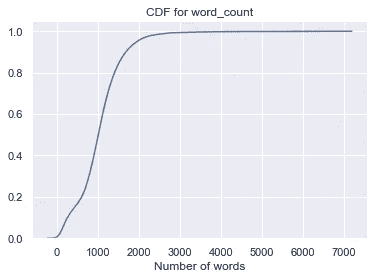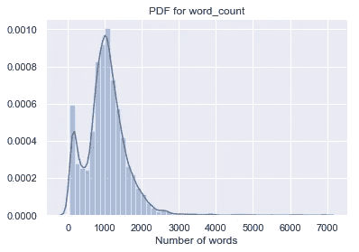

单词的 PDF 和 CDF

**观察:**

*   大多数文章的长度在 1000 到 2000 字之间。很少有文章内容很长。几乎 95%到 98%的文章少于 2000 字。

分割训练集和验证集后，我们现在将分别分析每个集中的文本数据。

我们从训练部分来分析一下单词。

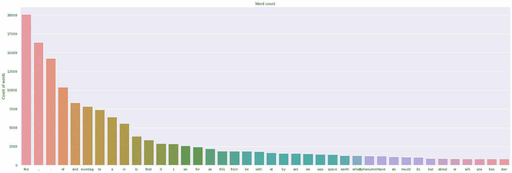

训练数据中单词的直方图

*   从上面的柱状图中，我们可以看到，‘the’，‘the’，‘the .’、' of '、' and '、' numtag '是在所有培训文章中最常见的单词。

**来自训练和验证集的字符分析:**

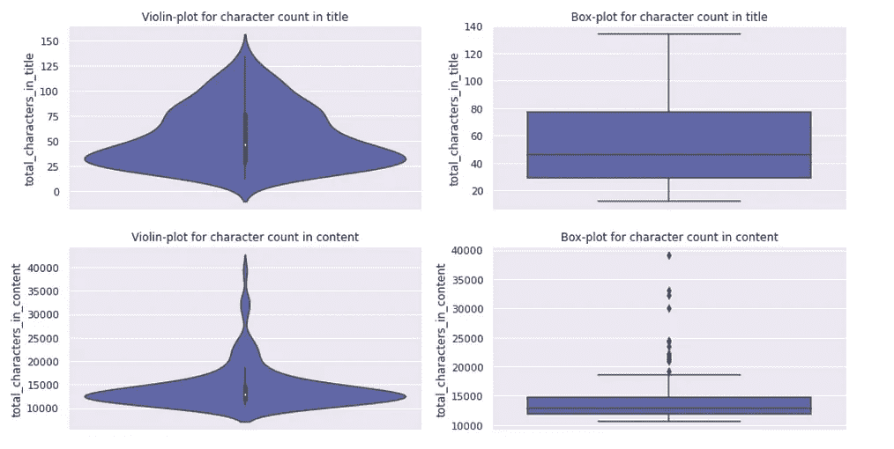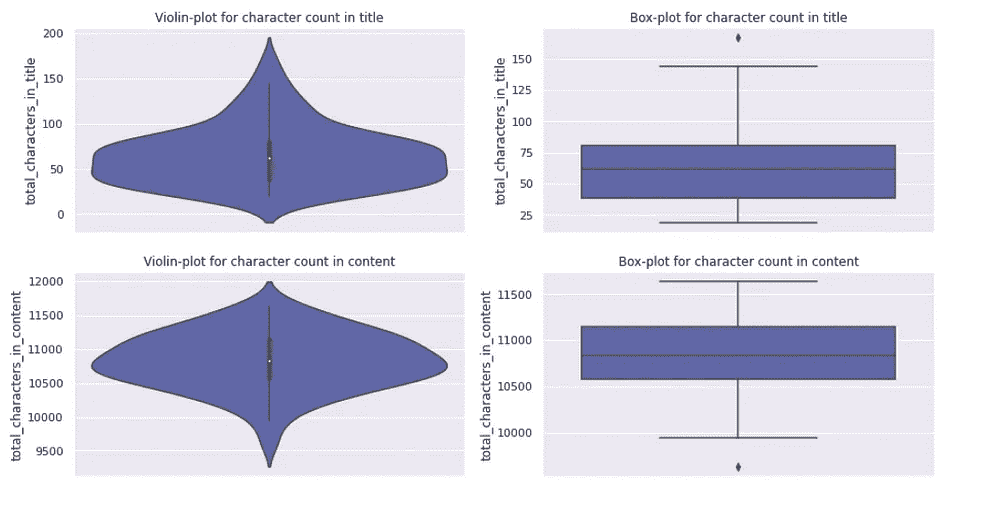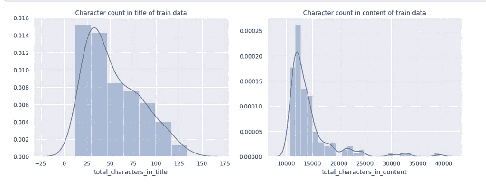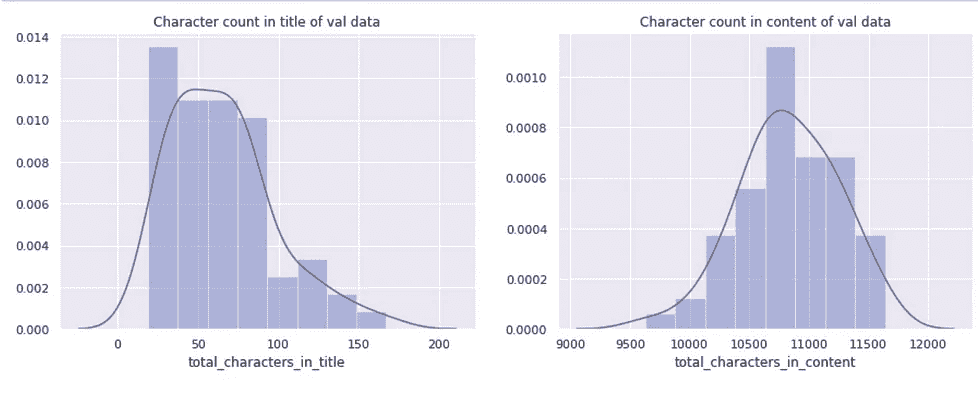

**观察:**

*   上面的图包括关于训练和验证数据集中字符数的信息。
*   训练数据中的大多数文章的字符数在 10 到 50 之间。内容的字符数在 10k 到 15k 之间。
*   Val 数据文章标题中的字符数在 10 到 70 之间，而内容中的字符数在 10.5k 到 11.5k 之间。

**来自训练和验证集的词的分析:**

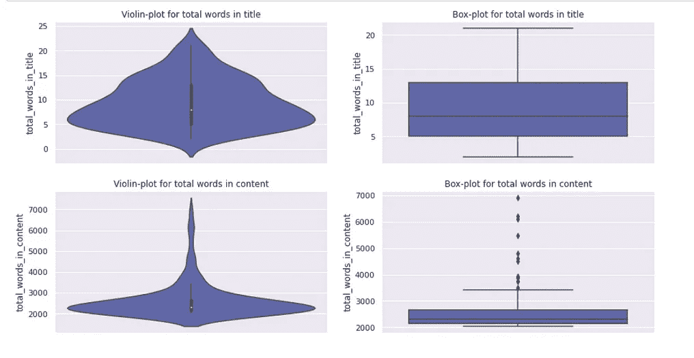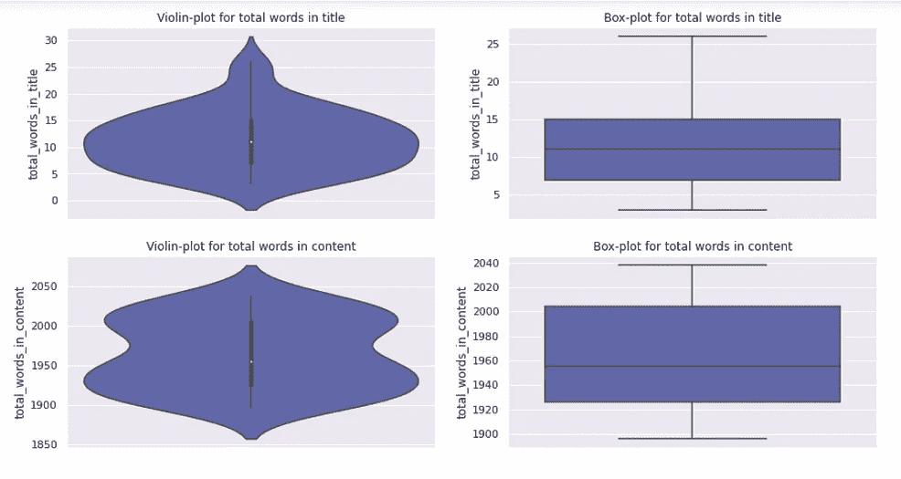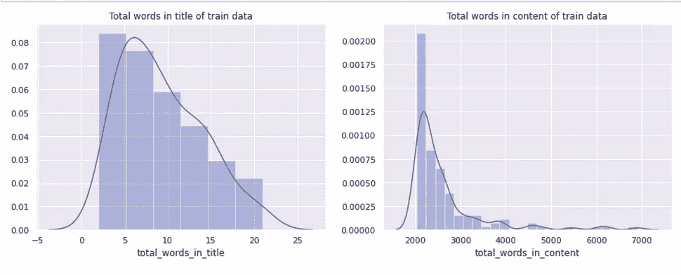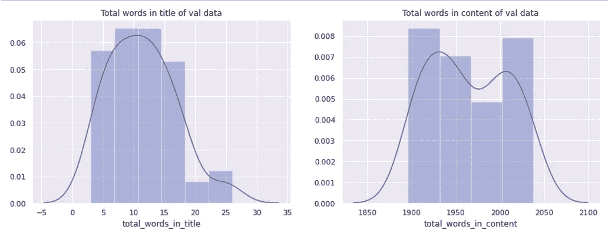

**观察:**

*   上面的图包括关于训练和验证数据集中字数的信息。
*   训练文章在标题中具有从 5 到 15 字数，且在内容中具有大约 2k 的字数。
*   来自验证数据的文章在标题中的字数在 5 到 15 之间，在内容中的字数在 1.9k 到 2k 之间。

**结论:**

*   一些文章每周都有关于太空视频的更新和讨论，字数很少。所以从这类文章中得到的信息几乎是相似的，比如主机名、剧集名等等。
*   视频内容不包括在文章中，所以除此之外手头没有多样性的内容。所以我们不会考虑那种文章。
*   有些文章字数很少，我们也不会考虑。

**3.3 数据预处理**

我们可以使用基于字符或基于单词的方法来解决这个问题。基于字符的方法可能会导致句子拼写错误，所以让我们专注于基于单词的方法，在这种方法中，我们将用某个固定的数字替换每个单词，因为模型只理解数字，而不是单词！(我们将从预训练的 300 维手套向量中创建嵌入矩阵([此处为](https://nlp.stanford.edu/projects/glove/))，用于我们训练数据集中出现的单词)。

下面的功能是将文本数据转换成数字。

让我们只为训练数据集中出现的单词创建一个嵌入矩阵。这是为了避免数据泄露问题。其向量不存在于手套模型中的单词，我们将为它们生成随机向量，而不是给它们分配零值。如果我们再次执行代码片段，我们将使用 random.seed()再次生成相同的随机向量。

正如我们所分析的，我们的文章有不同的字数，所以让我们决定固定数据长度并填充它们。

## 4.数据管道

我们的任务是处理序列数据，我们将使用递归神经网络(更准确地说是 LSTM！).主要方面是抓取数据，通过模型。

*   我们有 1700 字的文章，一起传递会导致内存崩溃问题。因此，我们将把每篇文章分成固定大小的块以及一些序列长度。为了实现这一点，我们将使用 [tf.data](https://www.tensorflow.org/guide/data) API，它使我们能够从简单的、可重用的部分构建复杂的输入管道。
*   我们将构建 batch_generator，它根据给定的文章以固定的批量生成输入数据和相应的标签。
*   它将首先生成一个具有固定数量序列的水平方向的批次，然后它将垂直生成一个固定数量的批量大小的文章。这种方法将保持每篇文章中单词序列的流动，因此我们的模型可以学习有意义的句子。
*   我们将建立两个模型:简单的 LSTM 模型和基于注意力的编解码模型。对于每个模型，我们将创建一个单独的生成器。这里，我们将使用多对多模型，这样我们的输入数据及其标签的大小相同。

**简单 LSTM 的批处理生成器**

**基于注意力的编解码器的批处理生成器**

## 5.模型架构

我们将用三种模型进行实验:1)。LSTM 2)。注意 3)。GPT-2(生成式预训练变压器)。其中，我们将构建前两个模型。所以让我们开始一个一个的建造。

**一、LSTM 模式**

LSTMs 在记忆序列信息和状态方面更加强大。Christopher Olah 写了一篇很棒的博客来了解 LSTM，你可以在这里找到。我们将使用有状态 LSTM 和 return_state 来维护训练和推理阶段的序列信息。因此，不再拖延，让我们开始使用子类和 tf.keras.Model API 构建模型。

上述类将实现 LSTM 功能，并返回模型生成的输出以及隐藏状态，我们将在预测中使用。

**损失函数和优化器**

我们将使用[稀疏分类交叉熵](https://www.tensorflow.org/api_docs/python/tf/keras/losses/sparse_categorical_crossentropy?version=nightly)作为损失函数。使用它的原因是为了减少一些计算时间，因为不需要在一次热编码中编码标签。我们可以只对我们的标签进行二维编码，这样可以加快这个过程。我们也将设置`from_logits=True`,因此没有必要将我们的逻辑转换成概率，这将导致输出层没有激活函数。

在各种优化器中，我们将使用 [RMSprop](https://www.tensorflow.org/api_docs/python/tf/keras/optimizers/RMSprop?version=nightly) ，因为它为我们的数据集提供了更好的性能。

**培训**

我们将使用 TensorFlow 的[急切执行](https://www.tensorflow.org/guide/eager#eager_training)进行训练，因为它可以立即评估操作，而无需构建图形，并帮助我们调试我们的模型。我们将为 tensorboard 写下我们的损失和梯度，并为推断阶段保存我们的模型。

让我们训练模型

我们将在下一节做预测和一些实验。

**二。注意力模式**

Bahdanau 在[的这篇](https://arxiv.org/pdf/1409.0473.pdf)论文中讨论了基于注意力的方法。它基本上是在序列中给单词更多的权重。这些权重是通过另一个神经网络学习的。在这里，在[这个](https://lilianweng.github.io/lil-log/2018/06/24/attention-attention.html)博客里，你可以找到关于各种注意力算法的细节。在我们的模型中，我们将实现 Bahadanau 风格的注意。代码的灵感来自[这里](https://www.tensorflow.org/tutorials/text/nmt_with_attention)的任务是语言翻译，但在我们的任务中，我们可以试验它。

所以不要再拖延了，让我们深入研究一下。

**编码器**

编码器将获取输入的单词序列，并通过嵌入穿过 LSTM 层，然后返回其输出和隐藏状态。

**关注层**

*   注意层用于根据编码器输出和解码器状态生成分数。Softmax 将应用于这些分数，以获得 0 到 1 之间的权重值。权重通过网络学习，并与编码器输出相乘。
*   最后，重要的编码器输出被赋予更大的权重。

**解码器**

解码器用于将上下文向量与其输入连接起来，并生成输出。

**培训**

我们将使用相同的损失函数和优化器。训练将如上所述进行，但是这里我们将向编码器提供第一个字序列，向解码器提供下一个字序列。所以我们的批处理生成器和第一个有点不同。在解码机制中，我们将使用“教师强制”机制。

**训练步骤**

**验证步骤**

让我们训练模型。

使用注意力模型的推理将在下一节讨论。

**三。GPT-2**

*   当 Vaswani 和来自 Google Brain 的团队提出标题为“注意力是你所需要的”的论文时，NLP 感觉就像是一个瞬间。我们可以使用变压器解决尖端解决方案。你可以阅读[这篇](http://jalammar.github.io/illustrated-transformer/)很酷的博客了解更多细节。
*   GPT-2 是一个基于大型 [transformer](https://arxiv.org/abs/1706.03762) 的语言模型，拥有 15 亿个参数，在 800 万个网页的数据集上进行训练。GPT-2 训练有一个简单的目标:预测下一个单词，给定一些文本中的所有以前的单词。你可以从[这里](https://openai.com/blog/better-language-models/)阅读更多内容。了解 GPT-2 再爽[博客](http://jalammar.github.io/illustrated-gpt2/)等着你！
*   我们将使用预训练的 GPT-2(小型-124 米)和微调我们的文章数据。这就像 NLP 中的迁移学习。该模型非常强大，我们需要直接传递文本数据来训练它，它将完成所有的标记化、预处理并从中学习。
*   太好了！！所以不要再耽搁了，让我们继续吧。代码摘自[这里](https://github.com/minimaxir/gpt-2-simple)和上一篇[博客](https://minimaxir.com/2019/09/howto-gpt2/)！

上述函数将根据我们的数据进行微调，并从中学习。对于实验，我们必须跳到推论部分，它就在下面:)

## 6.推理

对于推理部分，我们将使用来自检查点的最佳权重。所以我们来预测一下，看看吧。

**一、LSTM 模式**

我们将从 logits 的随机分类分布中抽取样本。并把它们转化成文字。

我们将使用 batch_size=1 初始化我们的模型，并从检查点恢复训练好的
权重。

这里，我们还从 LSTM 传递隐藏状态，以根据单词的顺序维护状态信息。来看看成果吧！

```
# Prediction
seed = 'In the history of spaceflight , only one nation'
temperature = 1.0
temp = predicttion_fun_using_disb(seed, stacked_model, temperature, 20)
print(seed + ' ' + temp)# input : 'In the history of spaceflight , only one nation'
# Output:
In the history of spaceflight , only one nation accord happy rubins
attainable accelerates writing violating contract topography finder
child walking concerns whitish barren equuleus generates undertakin
gs parasites femalesseed = 'Next to actually sending another spacecraft there'
temperature = 0.5
temp = predicttion_fun_using_disb(seed, stacked_model, temperature, 50)
print(seed + ' ' + temp)# input: 'Next to actually sending another spacecraft there'
# output: Next to actually sending another spacecraft there occasional noam famines scenic magnification mandated elliptic glow satellites scribbled permit tre warmer phases amateurs quotes meantime hooks loss lambda negatively appendages teams entailing terminate refrangibilities pella tarantula andrian selection ark dataset utterly mx enabled robot surya bands hangar sarah distinguishing etnos thunder jhuapl analogous interfering mathematicians tuesday writings uniting
```

*   从上面的结果中，我们可以看到，当给定一些输入种子词时，我们的模型正在生成句子，尽管所有生成的词都与句子的意思无关。但是这个模型是理解动词和形容词的位置。

**二。注意**

让我们看看输出。

```
# Predictionseed = 'In the history of spaceflight , only one nation'
temperature = 1.0
final_string = predict_function_attention(seed, 20, temperature)
print(final_string)# input : 'In the history of spaceflight , only one nation'
# output: In the history of spaceflight , only one nation infall deadly subsy
stems atkinson moderate himalayan lance abrahamic improve construct
ing scistarter streak insufficient viking east deistic earthguide s
hellfish especially repurposed megalodon pressures vac definition i
nstantaneously komsomol zingers astrobee effect propane cancelled p
rematurely icesheetmike sandstones application volcanoes cephalopod
s misty send combes
```

从结果来看，可以说它能理解动词、名词、形容词的一点点排列。

但是有意义的句子呢？我们的 GPT 2 号会处理好的。

**三。GPT-2**

```
# restore from drivegpt2.copy_checkpoint_from_gdrive(run_name='run1')
sess = gpt2.start_tf_sess()
gpt2.load_gpt2(sess, run_name='run1')# Generateprefix = 'In the history of spaceflight , only one nation'
gpt2.generate(sess, length=50, temperature=0.5, prefix=prefix,
nsamples=5, batch_size=5 )# input : 'In the history of spaceflight , only one nation'
# output :In the history of spaceflight , only one nation has achieved the fe
at: the Soviet Union. But the Soviet Union did it. It was the first
nation to launch a rocket from a launch pad. It was the first natio
n to launch a rocket from a launch pad. It was the first to launch
====================
In the history of spaceflight , only one nation has managed to colo
nize another planet: the Soviet Union. The Soviets launched their f
irst lunar lander in November of 1972, and by the time it landed, t
he Moon was still in lunar orbit. They also made several attempts t
o colonize the Moon
====================
In the history of spaceflight , only one nation has held the title
of sole superpower – the United States. The Soviet Union, who were
the first nation to achieve space flight, was the only nation to ac
hieve space flight. And although they were technically still in the
process of achieving space flight, they
====================
In the history of spaceflight , only one nation has been able to la
unch satellites into space. The Soviet Union, for example, was able
to launch satellites into space on two separate occasions. However,
the Soviet Union was not able to carry out their first lunar base u
ntil the mid-1970s.
====================
In the history of spaceflight , only one nation has been able to ac
hieve the feat: the Soviet Union. Their first attempts were in Febr
uary of 1961, when the Soviet Union launched their first interconti
nental ballistic missile (ICBM) at New York City. They successfully
launched their ICBM on March 8
====================
```

呜！正如我们所见，它生成的句子就像它真的了解空间一样！！再来看看其他一些结果。

```
gpt2.generate(sess, length=50, temperature=0.7,
prefix="ISRO has launched Chandrayaan II", nsamples=5,
batch_size=5)# input  :'ISRO has launched Chandryaan II'
# Output : 
ISRO has launched Chandrayaan II at an altitude of only about 20 km
(15 miles) at a time from the launch pad in Chandrayaan, India. The
lander and its two-stage lander will be launched in the evening of
March 18th at 13:03
====================
ISRO has launched Chandrayaan II on September 18, 2019\. This missio
n will launch from the Vastal Pad, the Space Launch Complex 41 (SLC
-41) in Chandrayaan, India. The satellite was launched by the India
n Space Research Organization (ISRO) under
====================
ISRO has launched Chandrayaan II as it reaches its second mission l
aunch from Pad 39A at the end of this month.This comes just a week
after the probe launched from its command module on April 18, and w
ill launch on Pad 39A at the end of this month. And
====================
ISRO has launched Chandrayaan II to its orbit earlier this month. C
handrayaan II is the third mission to orbit the Earth from home and
the first space mission to orbit the Moon. The probe’s main goal is
to study the Moon’s interior structure, analyze
====================
ISRO has launched Chandrayaan II mission on the orbit of DSO on Jul
y 5, 2019.The maiden blastoff of this mission on the Salyut-2 (D-2)
mission is slated for July 5, 2019\. The launch window for DSO runs
from July
====================
```

我们可以看到，它也能够连接 ISRO-印度空间研究组织的完整形式。它还可以关联 2019 年 7 月，因为这是发布月。我们可以看到它真的很强大。

现在让我们给出一个与空间无关的句子，看看它会做什么。

```
gpt2.generate(sess, length=50, temperature=0.7,
prefix="Shah rukh khan has been offered a film",
nsamples=5, batch_size=5)# input : 'Shah rukh khan has been offered a film'
# output :Shah rukh khan has been offered a film called “Liftoff of Light“. I
n the film, a group of mission controllers (the crew members and th
e scientists) are shown how the probe will be launched en route to
the Moon. The mission team is also shown how
====================
Shah rukh khan has been offered a film about the events of the tim
e, and the circumstances leading up to it. In it, the filmmaker ask
s the reader to “walk on the Moon.” It’s a happy-couple film, for s
ure, but it�
====================
Shah rukh khan has been offered a film in the form of an interestin
g documentary film. “Khan’s ‘film’ is about the issues facing the
Asian people and the cause of human rights,” said Shah rukh, in rep
ly to a
====================
Shah rukh khan has been offered a film about the first lunar landin
g, called The Moon Under the Moon. This year sees the first opport
unity for Moon tourism in 2019, when the launch of the China Lunar
Exploration Program (CLEP) is scheduled to happen. The Chinese Luna
r Exploration Program (
====================
Shah rukh khan has been offered a film titled “Mysteries of the Uni
verse” that includes a holographic image of a star that is also the
subject of the film. The film will be released on May 29th, 2019.
A cow’s head has
====================
```

它还可以生成与空间相关的电影标题，并且可以包括关于电影的细节，而无需教导。是不是很神奇？

## 7.比较

我们用不同的批量大小、序列长度、lstm 单位、时期和学习率对前两个模型进行了实验。我们在 GPT-2 模型中损失最小，关于生成的句子，我们已经看到 GPT-2 是最好的。下面是对比表。

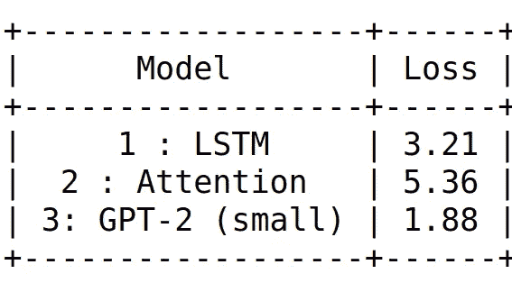

## 8.结论

*   当我们为更多的时期训练 LSTM 和注意力模型时，由于我们的数据较少，它开始过度拟合。
*   当我们提高学习率时，损失就会增加，这表明我们可能会超出最优解空间。当我们降低学习速率时，损失会非常缓慢地减少，这意味着学习进行得非常缓慢。
*   如果我们保持较高的序列长度，我们的模型影响消失梯度问题。
*   在 GPT-2 的情况下，它已经用大量的数据进行了训练。GPT-2 有更多的参数(124 米)，这是非常大的比我们以上两个模型。它还使用了自我关注的概念，这有助于关注相邻的单词序列。
*   由于强大的架构，GPT-2 提供了比其他型号更好的性能。也收敛的更快。

## 9.未来的工作

*   我们可以训练大量的数据来得到更好的结果。

## 10.参考

*   **论文:**

[1]陆，朱 Y，张 W，王 J，于 Y .【神经文本生成:过去、现在与超越】。2018 年 3 月 15 日。

[2]陈 MX，李 BN，班萨尔 G，曹 Y，张 S，陆 J，蔡 J，王 Y，戴 AM，陈 Z，孙 T. [Gmail 智能撰写:实时辅助写作](https://arxiv.org/abs/1906.00080)。第 25 届 ACM SIGKDD 知识发现国际会议论文集&数据挖掘 2019 年 7 月 25 日(第 2287–2295 页)。

*   **博客:**

1.  [http://karpathy.github.io/2015/05/21/rnn-effectiveness/](http://karpathy.github.io/2015/05/21/rnn-effectiveness/)
2.  [https://www.tensorflow.org/tutorials/text/text_generation](https://www.tensorflow.org/tutorials/text/text_generation)
3.  [https://www . tensor flow . org/tutorials/text/NMT _ with _ attention](https://www.tensorflow.org/tutorials/text/nmt_with_attention)
4.  [https://openai.com/blog/better-language-models/](https://openai.com/blog/better-language-models/)
5.  [http://jalammar.github.io/illustrated-transformer/](http://jalammar.github.io/illustrated-transformer/)
6.  [http://jalammar.github.io/illustrated-gpt2/](http://jalammar.github.io/illustrated-gpt2/)
7.  https://minimaxir.com/2019/09/howto-gpt2/

*   **平台:**

1.  [https://colab.research.google.com/](https://colab.research.google.com/)

*   **课程:**

1.  [https://www.appliedaicourse.com/course/11/Applied-Machine-](https://www.appliedaicourse.com/course/11/Applied-Machine-)
    学习-课程

感谢您的关注。如果你有任何想法，可以留下评论、反馈或任何
建议。

你可以在我的 Github repo 上找到完整的代码([这里](https://github.com/khushi810/Text-Generation))。

很高兴在 [LinkedIn](https://www.linkedin.com/in/khushali-vithani/) :)上与您联系