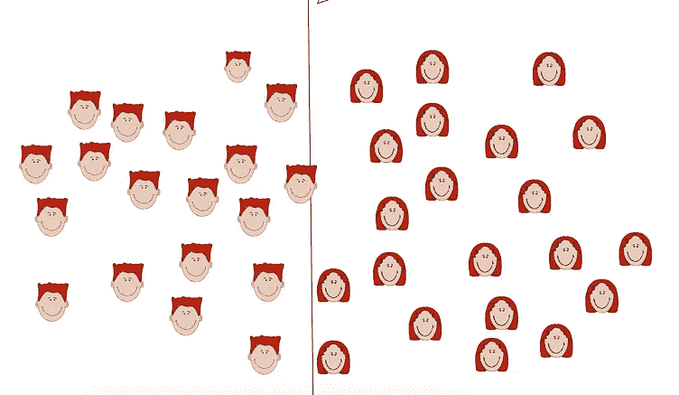
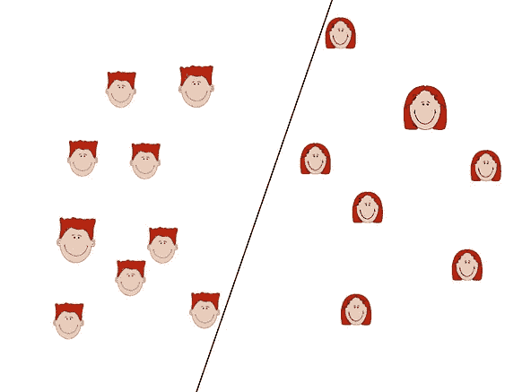
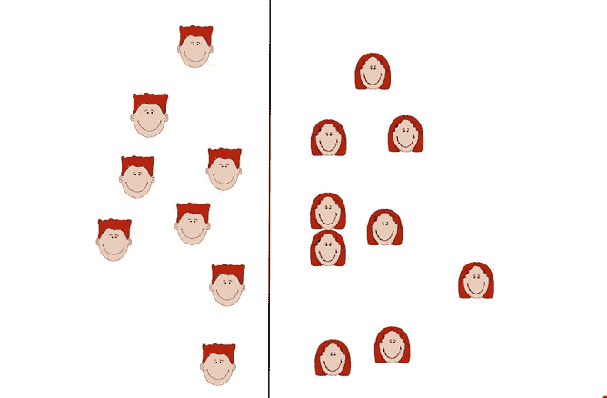

# 让您的模型选择要学习的数据—主动学习的基础

> 原文：<https://towardsdatascience.com/let-your-model-select-which-data-to-learn-from-basics-of-active-learning-7c56846a6c5d?source=collection_archive---------59----------------------->

## 没有足够的资源来为您的分类任务获取您自己的标记数据？尝试跳出思维定势，主动开始学习 ***主动学习*** 。让你的算法选择学习什么。

[来源](https://thewallpaper.co/hd-wallpaper-spring-forest-beautiful-nature-earth-hd-flower-tree-park-bicycle-landscape-mood-jpg/)

我们一直在谈论处理数据，以获得与我们的项目、我们的经历、利润最大化、增加收入和许多其他原因相关的具体[见解](/most-used-word-as-a-data-scientist-insights-b84b5a2966a2)。这是任何人一直在想的事情。但是..让我们退一步，从我们的“假设”数据中休息一下，从“实际”数据的角度来思考。

获取数据并不总是容易的。没有一家公司会免费给你。有很多交易发生。例如，你在金钱上帮助另一家公司，他们会帮助你得到你想要的数据。作为一名数据科学家，说服你的经理你想要的对公司有帮助的数据并不总是容易的，只是因为它的成本很高。你需要根据一家公司为其数据科学团队设定的预算来调整你的预期。

如果您正在处理大量带标签的数据，您以前一定面临过这个问题。主动学习可能是你的最佳解决方案。

## 定义—

> 主动学习是一种机器学习算法，其主要目标是 ***通过让算法选择它需要学习的数据*** 来减少训练数据量，以便通过表现更好或至少与更多训练数据相同来达到我们的评估指标的预期目标。

让我们更深入地探究——

主动学习的直观指南—最左边(图 1)、中间(图 2)、最右边(图 3)

在图 1 中，我们有一堆面孔，需要将他们分为男孩和女孩，但我们没有他们所有的标签。获得标签是昂贵的。在图 2 中，我们获得了其中一些人脸的标签，并通过随机选择数据子集对它们进行分类。正如我们可以看到的，如果我们使用这些人脸来分类实际人脸，分类误差会增加。在图 3 中，我们试图选择提高模型精度的面(通过选择最佳面，我们节省了资源)。这就是主动学习的意义所在。我们试图找到模型最有可能出错的实例(那些更接近决策边界的实例)，以便在它们被标记并包含在训练集中之后，模型对于看不见的数据上的这些类型的错误变得更健壮。

## 它是如何工作的？

*   从整个数据集中，随机选择一个数据子集作为训练数据。
*   根据您的查询策略，在仔细检查之后，请求非常少的数据点的标签。
*   通过对上述数据进行训练来预测剩余数据点的标签。
*   将这些新标记的数据点添加到您的训练数据中，并反复重复相同的过程。

当我们谈论查询策略时，它主要是关于选择那些您最不确定其类别的数据点。有各种各样的场景来查询你的算法—

*   成员查询合成
*   基于流的选择性采样
*   基于池的采样

## 成员查询合成

顾名思义，它是一种基于某种隶属标准生成/ ***综合*** 查询的策略。模型重新生成查询*(从头开始)，即模型生成新的查询，而不是现有的查询。*

## *基于流的选择性采样*

*这是一种顺序策略，我们可以从抽样分布中随机抽取数据点，然后选择是否要对其进行标记。每个查询决策都是单独做出的。学习者决定是否要查询该实例。有一些“信息含量测量”可以帮助学习者决定查询策略。*

## *基于池的采样*

*当在大的未标记数据池中存在小的已标记数据子集时，从该池中选择性地抽取查询。基于一些“信息含量测量”，所有的查询首先被排序，然后最好的一个被考虑。这是基于流的采样和基于池的采样(即个体查询和组查询)之间的主要区别。*

## *你如何选择你的“信息含量测量”？*

*我们今天将讨论两种策略:*

*   *不确定性抽样—最小置信、熵、边际抽样*
*   *委员会质询*

## *不确定抽样*

*在这种抽样策略中，学习者将查询那些标签最不确定的实例。这可以通过三种方式实现-*

*   ***最不自信***

*查询预测可信度最低的数据点。这是通过计算数据点属于不同类别的概率并将它们从最不可能到最可能排序来完成的。最不可能是最不自信的。*

*   ***边际抽样***

*通过使用最不自信策略，我们对其他标签的分布一无所知。因此，我们忽略了它们的信息量。因此，边缘采样通过考虑最可能标签和第二可能标签之间的差异来克服这一点。小的边距更加模糊，因此我们需要知道它们的真实标签。大幅度意味着我们几乎正确地预测了这些数据点的标签。*

*   ***熵***

*熵描述了模型的不确定性。我们计算每个类的熵值。如果很高，很可能存在很多不确定性；一个数据点属于多个类别的概率是相等的，如果熵值较低，则这些点的分布具有相当大的确定性。对于我们的查询策略，我们将选择具有最高熵值的数据点。*

## *委员会质询*

*有一个在带有不同训练实例的标记数据集上训练形成的模型委员会。每个委员会将为查询候选的标签投票。我们将选择所有委员会都无法达到固定多数的数据点。因此，信息最丰富的查询将是他们最不同意的查询。这是一个基于树的方法。*

***参考文献—***

*http://burrsettles.com/pub/settles.activelearning.pdf*