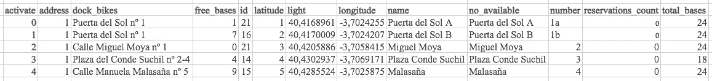
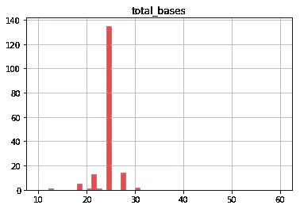
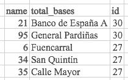
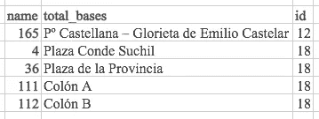
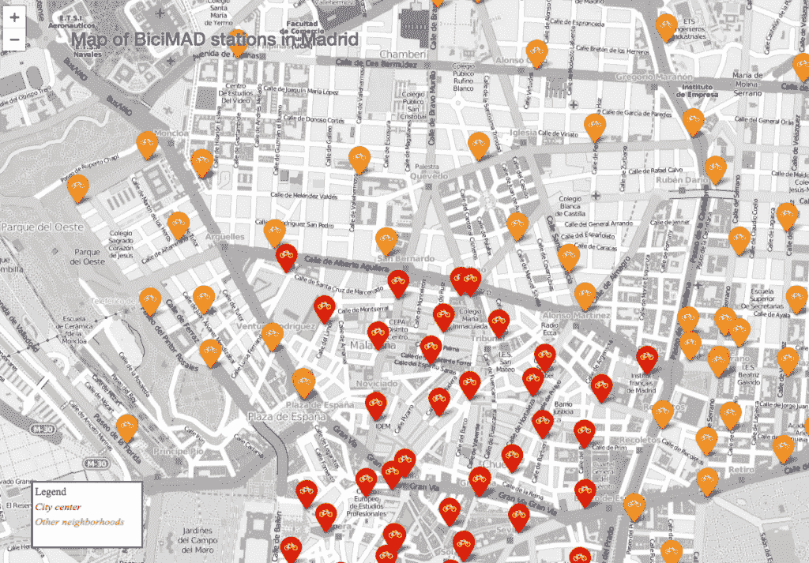

# 让我们分析一下马德里的电动自行车共享站

> 原文：<https://towardsdatascience.com/lets-analyze-e-bike-sharing-stations-of-madrid-e06b1c5af596?source=collection_archive---------46----------------------->

## BiciMAD 是西班牙首都的电动自行车共享服务，始于 2014 年，从 2016 年 5 月开始由马德里市政公司管理。

此分析的目的是了解网络中有多少站点，它们的容量有多大，以及网络的范围有多大。我还将尝试对马德里附近的每个电视台进行分类。

请注意，本文中讨论的数字、数据集、地图和 Python 笔记本可以在 [GitHub](https://github.com/simboli/Analysis-of-BiciMAD) 上找到(当然是免费的)。

# 资料组

*马德里市政运输公司*在[马德里开放数据 EMT](https://opendata.emtmadrid.es/Datos-estaticos/Datos-generales-(1))上以开放格式提供大量数据。该数据集仅限于 BiciMAD 服务，涉及 2018 年 7 月、8 月和 9 月的车站每小时情况以及 2017 年 4 月至 2018 年 9 月的个人租赁详情。由于这一分析涉及电台，最有趣的文件毫无疑问是第一批。

让我们下载[*situación estaciones bici mad por día y hora de September de 2018*](https://opendata.emtmadrid.es/getattachment/8d0e5769-1fc2-4b62-ad1b-d0cc0315f3f8/Bicimad_Estacions_201809.aspx)档案，了解我们有哪些数据。与自行车租赁相关的数据不同，没有指南解释这些字段以及数据在提取、保存和上传到网上之前是如何预处理的

该文件是包含单个 JSON 文件的 RAR 归档文件。文件的每一行都是一个单独的 JSON 文件实体，在第一层包含两个元素:日期-时间和一系列与该特定时间的站点状况相关的数据。

数据具有良好的详细程度(每小时一次),如果月份可用性涵盖的时间不仅仅是三个月，则可以进行更深入的分析。考虑到该市游客流量的季节性和马德里的大陆性气候，其特点是夏季高温，冬季低温，我认为这三个夏季月份对估计今年剩余时间没有意义。

在这方面，由于我们的目标是建立一个站的注册表，我考虑了可用的最新数据，即 2018 年 9 月文件的第一行，这是 2018–09–30t 23:42:38.647290”的情况

由于文件指的是 2018 年 9 月，所以总共算(30 * 24) -1 = 719 行。

乍一看，考虑到这项工作的目的和到目前为止所做的所有考虑，我们需要的数据(就列而言)明显少于 EMT 提供的数据。

# 按邻域分类

分析的第一步包括绘制每个 BiciMAD 站所属邻域的地图。这产生了一个副作用，即验证了所有站点的 GPS 坐标在地理上都在马德里大都市区域内。

实际上，有必要在经纬度坐标系中找到马德里街区及其边界的列表，使用可用数据构建多边形，并评估每个站点属于哪一个。

下载免费地理数据的顶级网站是什么？明明[开街景图](https://openstreetmap.org/)！

从[这个表](https://wiki.openstreetmap.org/wiki/Tag:boundary%3Dadministrative)中，我可以找到用于标识西班牙城市中街区的标签，即 9，所以我从马德里数据生成了一个 GeoJSON 文件，其中 **admin_level=9，boundary=administrative** 。

至此，我已经定义了三个 Python 函数，它们可以生成多边形并验证每个站属于其中的一个。

> *数组(['Centro '，' Chamberí'，' Moncloa-Aravaca '，' Arganzuela '，' Retiro '，' Salamanca '，' Tetuán '，' Chamartín']，dtype=object)*

这一阐述的结果被保存到[这个 CSV 文件](https://www.leansolutions.it/static/BiciMAD/df_stations.csv)，它将对未来的应用有用。

# 碱基数量的评估

进行第二级分析时，考虑了每个站点的自行车底座数量，与我的预期相反，它们几乎由标准模块组成，事实上，数量总是在 18 到 30 之间。

由于很容易验证，在自行车流的特别重心点(例如靠近交通网络的其他节点)的情况下，管理 BiciMAD 自行车的公司已经设置了多个站点，而不是“在逻辑层”考虑具有更多基站的单个站点。

在这一点上，我还可以考虑网络可以支持的电动自行车的总数(这是考虑到每次用户应该有至少一个停放自行车的基地的总基地数)，4095 个基地，并评估它们在各个社区的分布情况。

*   阿甘祖拉 342
*   Centro 1380
*   沙玛丁 306
*   尚贝里 437
*   蒙克洛阿-阿拉瓦卡 243
*   Retiro 550
*   萨拉曼卡 669
*   泰图安 168

不出所料，马德里中心附近包含了最多的座位。这是显而易见的，因为在这个地区，旅游流更加集中，此外，在这里，我们预计使用 BiciMAD 服务通勤上班的工人流。

# 制作比奇马德站的地图

作为一个“奖励”,我决定生成一个单独车站的地图，这有双重目的:提供一个简单的工具来查看车站未覆盖的马德里的任何区域，并为非马德里人提供他们位置的表示，以方便他们的生活，以防他们决定去西班牙首都并使用 BiciMAD 服务。

该地图是用 follow 模块生成的，可在[这里](https://www.leansolutions.it/static/BiciMAD/map_stations.html)获得。