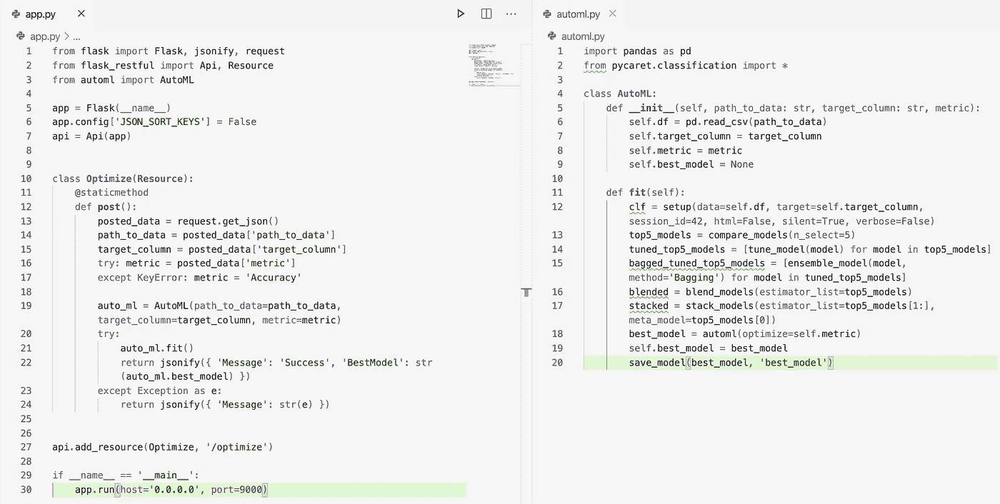
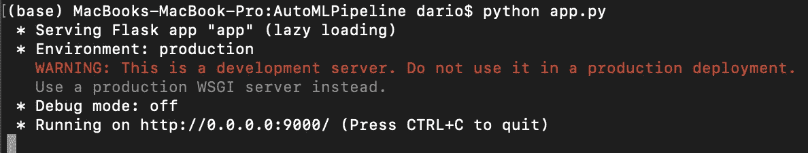
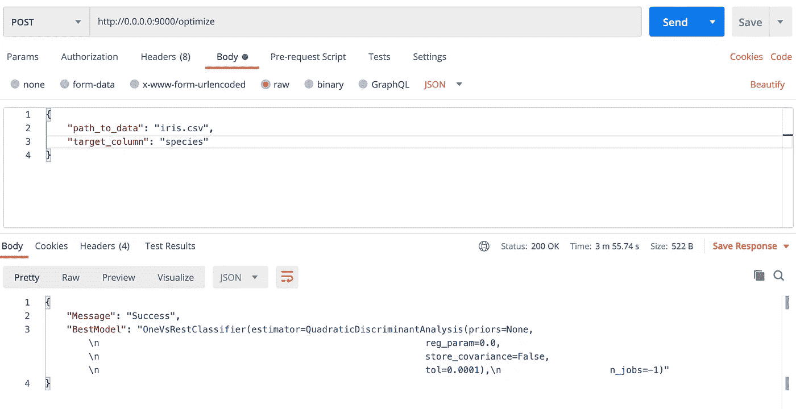

# 让我们在 5 分钟内构建和部署 AutoML 解决方案

> 原文：<https://towardsdatascience.com/lets-build-deploy-automl-solution-in-5-minutes-4e5683635caf?source=collection_archive---------23----------------------->

## 用于分类任务的全自动机器学习 API

实用的机器学习曾经很难——在一些专业领域仍然如此。普通的机器学习任务正变得越来越容易，并且在一定程度上实现了自动化。今天，我们将探索用 50 行代码创建和部署一个完全自动化的机器学习平台是多么容易。


由[拉蒙·萨利内罗](https://unsplash.com/@donramxn?utm_source=medium&utm_medium=referral)在 [Unsplash](https://unsplash.com?utm_source=medium&utm_medium=referral) 拍摄的照片

在我们开始之前，让我先做一个大胆的免责声明。您将要看到的解决方案只适用于分类任务，尽管我们只需要对回归任务做一些小的改动。有些事情可以改进，比如日志记录，并且您可以自由地自己进一步处理代码。

此外，我们将把解决方案部署为 REST API。*为什么？*因为我们希望其他技术专家(非数据科学家)能够毫不费力地使用我们的 *AutoML* 工具。

下面是使用此解决方案的要求列表:

*   **准备好的数据集** —数据集必须是机器学习就绪的格式，因此首先要做好适当的数据准备。我们的数据存储为 CSV 格式。
*   **知道如何发出 POST 请求**——要么通过像 *Postman* 这样的工具，要么通过任何一种编程语言(我们会谈到这一点)。

好了，事不宜迟，让我们开始吧！

# 数据集收集和准备

对于这个简单的例子，我们将使用[虹膜数据集](https://gist.githubusercontent.com/curran/a08a1080b88344b0c8a7/raw/639388c2cbc2120a14dcf466e85730eb8be498bb/iris.csv)。数据集由各种花卉测量值和指示花卉种类的目标变量组成。

出于演示目的，这是一个完美的数据集，因为我们不想花太多时间清理数据。如果您正在跟进，请从提供的链接下载数据集，并将其存储在某个地方。我将它放在一个单独的文件夹中，Python 脚本最终将存储在这个文件夹中。

现在我们已经准备好了数据集，没有任何准备要求。现在让我们开始有趣的部分。

# 编写 AutoML 脚本

这就是乐趣的开始。在数据集所在的目录(希望是一个新的空目录)中，创建一个 Python 文件，并根据需要命名。我给我的取名为`automl.py`。

在我们开始编码之前，我想提一下这个解决方案背后的逻辑是基于 *PyCaret* 库，特别是[这篇文章](/announcing-pycaret-2-0-39c11014540e)。PyCaret 是一个了不起的机器学习库，你绝对应该了解更多。您可以从这里开始:

1.  [PyCaret:用 Python 实现更好的机器学习](/pycaret-better-machine-learning-with-python-58b202806d1e)
2.  [用 PyCaret 回归:一个更好的机器学习库](/regression-with-pycaret-a-better-machine-learning-library-e02762a0615c)
3.  [用 PyCaret 分类:一个更好的机器学习库](/classification-with-pycaret-a-better-machine-learning-library-cff07a10a28c)
4.  PyCaret 2.0 已经发布，有什么新功能吗？

在`automl.py`文件中，我们将导入*熊猫*库和 *PyCaret* 分类模块中的所有内容:

```
import pandas as pd
from pycaret.classification import *
```

接下来，我们将声明一个带有几个字段的`AutoML`类:CSV 数据文件的路径、目标列名和我们想要优化的指标的名称(比如 accuracy、recall……)。我们还将声明一个自定义字段来存储关于最佳模型的信息:

```
class AutoML:
    def __init__(*self*, *path_to_data*: str, *target_column*: str, *metric*):
        *self*.df = pd.read_csv(path_to_data)
        *self*.target_column = target_column
        *self*.metric = metric
        *self*.best_model = None
```

太好了！我们现在可以在`__init__`下面声明一个处理所有机器学习逻辑的函数。我已经调用了我的`fit()`，但如果你愿意，请随意更改它。该功能具有以下任务:

*   执行初始设置
*   找出最好的 5 种算法
*   调整这 5 个算法的超参数
*   进行装袋
*   执行混合
*   执行堆叠
*   为指定的指标找到最佳的整体模型
*   将模型保存到文件中

听起来要写很多逻辑，但它只有 10 行代码:

```
def fit(*self*):
    clf = setup(*data*=*self*.df, *target*=*self*.target_column, *session_id*=42, *html*=False, *silent*=True, *verbose*=False) top5_models = compare_models(*n_select*=5) tuned_top5_models = [tune_model(model) for model in top5_models]

    bagged_tuned_top5_models = [ensemble_model(model, *method*=’Bagging’) for model in tuned_top5_models] blended = blend_models(*estimator_list*=top5_models) stacked = stack_models(*estimator_list*=top5_models[1:], *meta_model*=top5_models[0]) best_model = automl(*optimize*=*self*.metric)
    *self*.best_model = best_model save_model(best_model, ‘best_model’)
```

这就是这个文件。让我们继续进行 API 开发。

# 编写 REST API

我们已经讨论了机器学习部分，现在是时候让其他软件开发人员也能使用这个逻辑了。Python 让这一步变得非常简单，因为我们可以用像 *Flask* 这样的库轻松构建一个简单的 REST API。

在开始之前，创建一个名为`app.py`的新 Python 文件。现在让我们将*烧瓶*连同`automl.py`一起导入，并执行基本设置:

```
from flask import Flask, jsonify, request
from flask_restful import Api, Resource
from automl import AutoMLapp = Flask(__name__)
app.config[‘JSON_SORT_KEYS’] = False
api = Api(app)
```

太好了！我们现在准备好处理来自用户的请求。为此，我们将声明一个继承自`flask_restful.Resource`的类。在内部，我们可以有各种方法，命名为 API 调用的类型。我们将我们的命名为`post()`，因为我们将发出一个 POST 请求。

在这个方法中，我们需要捕获用户在调用时提供的 JSON 数据。`metric`参数是可选的，如果没有指定，则设置为`Accuracy`。记住，我们将把这些参数的值传递给`AutoML`类的一个实例。

现在我们能够调用`AutoML.fit()`方法并将结果返回给用户。下面是这个类的代码:

```
class Optimize(Resource):
    @staticmethod
    def post():
        posted_data = request.get_json()
        path_to_data = posted_data[‘path_to_data’]
        target_column = posted_data[‘target_column’]
        try: metric = posted_data[‘metric’]
        except KeyError: metric = ‘Accuracy’ auto_ml = AutoML(*path_to_data*=path_to_data, *target_column*=target_column, *metric*=metric)
        try:
            auto_ml.fit()
            return jsonify({ ‘Message’: ‘Success’, ‘BestModel’: str(auto_ml.best_model) })
        except Exception as e:
            return jsonify({ ‘Message’: str(e) })
```

最后，我们需要将我们的`Optimize`类连接到某个实际的端点，并使`app.py`可执行。方法如下:

```
api.add_resource(Optimize, ‘/optimize’)**if** __name__ **==** ‘__main__’:
    app.run(*host***=**’0.0.0.0', *port***=**9000)
```

就是这样——这就是用于分类任务的全自动机器学习管道的全部代码！

以下是代码摘要，以防您在某处遇到困难:



正好 50 行代码

我们需要做的就是。让我们现在测试一下这个东西。

# 测试

我们可以使用像 [Postman](https://www.postman.com) 这样的应用程序来测试我们的 API 是否工作正常。但是在此之前，我们需要运行`app.py`文件。为此，打开终端/CMD 窗口并转到`app.py`的位置。执行以下操作:

```
python app.py
```

您应该会看到弹出这样的内容:



我们现在可以打开 *Postman* ，将调用类型更改为 POST，输入 URL 和 JSON 参数及其各自的值:



即使对于这个简单的数据集，这个过程在我的机器上也需要大约 4 分钟，但这是训练和优化多个机器学习模型的代价。是的，一旦执行，你会得到最好的模型保存到你的电脑上，所以你可以马上做出新的预测。

[下面是方法。](/lets-deploy-a-machine-learning-model-be6057f2d304)

差不多就是这样。让我们在下一部分总结一下。

# 在你走之前

如果你已经设法跟上了，就不要认为自己是机器学习专家。这篇文章不是为机器学习专家写的，而是为想要在项目中实现机器学习的普通软件开发人员写的。

我希望你看到完全自动化机器学习任务是多么容易。如果你需要更具体的东西，这可能对你来说还不够。对于大多数较简单的任务，这段代码将非常适合您。数据准备仍然是王道——所以这是你要花大部分时间的地方。机器学习很容易，至少对于大多数任务来说是如此。

喜欢这篇文章吗？成为 [*中等会员*](https://medium.com/@radecicdario/membership) *继续无限制学习。如果你使用下面的链接，我会收到你的一部分会员费，不需要你额外付费。*

[](https://medium.com/@radecicdario/membership) [## 通过我的推荐链接加入 Medium-Dario rade ci

### 作为一个媒体会员，你的会员费的一部分会给你阅读的作家，你可以完全接触到每一个故事…

medium.com](https://medium.com/@radecicdario/membership) 

加入我的私人邮件列表，获取更多有用的见解。