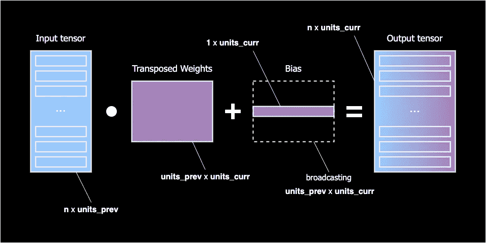

# 让我们用简单的数字编码卷积神经网络

> 原文：<https://towardsdatascience.com/lets-code-convolutional-neural-network-in-plain-numpy-ce48e732f5d5?source=collection_archive---------6----------------------->

## 神经网络的奥秘

 [## SkalskiP/ILearnDeepLearning.py

### 这个存储库包含与神经网络和深度学习相关的小项目。主题是紧密的…

github.com](https://github.com/SkalskiP/ILearnDeepLearning.py) 

我们生活在一个迷人的时代，深度学习(DL)不断应用于我们生活的新领域，并经常给停滞不前的行业带来革命性的变化。与此同时，像 [Keras](https://keras.io/) 和 [PyTorch](https://pytorch.org/) 这样的开源框架让每个人都有机会使用最先进的工具和算法。这些库强大的社区和简单的 API 使尖端模型触手可及成为可能，即使没有使这一切成为可能的深入的数学知识。

然而，对神经网络[NN]内部发生的事情的理解对于架构选择、超参数调整或性能优化等任务非常有帮助。因为我相信没有什么比弄脏自己的手更能教会你的了，**我将向你展示如何创建一个卷积神经网络[CNN]，它能够对**[**【MNIST】**](http://yann.lecun.com/exdb/mnist/)**图像进行分类，准确率高达 90%，仅使用**[**NumPy**](https://numpy.org/)**。**

> **注:**卷积神经网络是一种深度神经网络，最常用于分析图像。

本文主要面向对 DL 框架有一些经验的人。然而，如果你只是一个初学者——进入神经网络的世界——请不要害怕！这一次，我不打算分析任何数学方程式。老实说，我甚至不打算把它们写下来。而是尽量给大家一个直觉，在这些知名库的掩护下发生了什么。

**图一。**卷积神经网络架构

## 介绍

正如已经提到的，我们的主要目标是基于上图所示的架构构建一个 CNN，并在 MNIST 图像数据集上测试其功能。然而，这一次我们不会使用任何流行的 DL 框架。相反，我们将利用 NumPy——一个强大但低级的 Python 线性代数库。当然，这种方法将显著地使我们的工作复杂化，但是同时，它将允许我们理解在我们的模型的每个阶段正在发生什么。在此过程中，我们将创建一个包含所有必要层的简单库，因此您将能够继续尝试并解决其他分类问题。

> **注意:****是一个手写数字的大型数据库，通常用作图像识别算法的基准。每张黑白照片都是 28x28 px。**

## **数字图像、张量和形状**

**让我们停下来分析一下数字图像的结构，因为它会直接影响我们的设计决策。事实上，数码照片是巨大的数字矩阵。每个这样的数字代表单个像素的亮度。在 RGB 模型中，彩色图像由对应于三个颜色通道(红色、绿色和蓝色)的三个这样的矩阵组成。另一方面，要表现灰度图像——就像我们在 MNIST 数据集中看到的那样——我们只需要一个这样的矩阵。**

****

****图二。**数字图像背后的数据结构**

**在线性代数中，这些结构化的多维矩阵称为**张量**。张量维度由它们的**形状**描述。例如，单个 MNIST 图像的形状是`[28, 28, 1]`，其中连续的值表示高度、宽度和颜色通道的数量。**

## **顺序模型**

**顺序模型是一种连续层形成线性流的模型——第一层的结果用作第二层的输入，依此类推。模型在这个管弦乐队中充当指挥，负责控制各层之间的数据流。**

****

****图 3。**顺序模型数据流**

**有两种流量类型— **向前和向后**。我们使用**正向传播来基于已经积累的知识和作为输入`X`提供的新数据进行预测**。另一方面，**反向传播就是将我们的预测** `**Y_hat**` **与真实值** `**Y**` 进行比较，并得出结论。因此，我们网络的每一层都必须提供两个方法:`forward_pass`和`backward_pass`，这两个方法都可以被模型访问。一些层——密集层和卷积层——也将具有收集知识和学习的能力。它们保留自己的张量，称为权重，并在每个时期结束时更新它们。简单来说，模型训练的**单个时期由三个元素组成:向前和向后传递以及权重更新**。**

**顺序模型—点击[此处](https://github.com/SkalskiP/ILearnDeepLearning.py/blob/master/01_mysteries_of_neural_networks/06_numpy_convolutional_neural_net/src/model/sequential.py)查看完整代码**

****

## **盘旋**

**C onvolution 是一种操作，我们采用一个小的数字矩阵(称为内核或过滤器)并将其传递到我们的图像上，以根据过滤器值对其进行变换。将我们的内核放在一个选中的像素上后，我们从过滤器中取出每一个值，并与图像中相应的值成对相乘。最后，我们将所有内容相加，并将结果放在输出矩阵的正确位置。**

****

****图 4。**卷积层正向传递**

**很简单吧？对吗？嗯，通常情况下，事情会更复杂一点。为了加快计算速度，一个层通常一次处理多个图像。因此，我们传递一个形状为`[n, h_in, w_in, c]`的四维张量作为输入。这里的`n`对应于并行处理的图像数量，即所谓的**批量**。其余的尺寸都很标准——宽度、高度和通道数量。**

****

****图 5。**卷积超过体积**

**此外，通常，输入张量可以有多个通道。上面，你可以看到一个对彩色图像执行卷积的层的例子。这个过程叫做体积卷积。**在这种情况下，最重要的规则是，滤镜和图像必须有相同数量的通道。**我们的操作非常类似于标准卷积，但这次我们将三维张量中的数字对相乘。**

**最后，为了使图层尽可能地通用，每个图层通常都包含多个滤镜。**我们分别对每个核进行卷积，将结果一个接一个地堆叠起来，然后将它们组合成一个整体。**卷积层前向传递产生具有`[n, h_out, w_out, n_f]`形状的四维张量，其中`n_f`对应于在给定层中应用的滤波器的数量。让我们看看下面的图像，对这些维度有更多的直觉。**

****

****图六。**卷积张量形状**

**卷积层——点击[此处](https://github.com/SkalskiP/ILearnDeepLearning.py/blob/master/01_mysteries_of_neural_networks/06_numpy_convolutional_neural_net/src/layers/convolutional.py)查看完整代码**

****

## **最大池化**

**人们普遍认为，分辨率越高，照片质量越好。毕竟，图片中可见对象的平滑边缘会使整个场景对人眼更具吸引力。有趣的是，很多时候，更多的像素并不能转化为更详细的图像理解。看起来电脑根本不在乎。**存储这些冗余像素称为过表示。**通常，即使张量体积的显著减少也不会影响实现的预测的质量。**

> ****注:**现在标准的智能手机摄像头能够产生 12Mpx 的图像。这样的图像由 3600 万个数字组成的共色张量来表示。**

****池层的主要任务是减少我们张量的空间大小。**我们这样做是为了限制需要训练的参数数量，从而缩短整个训练过程。这种效果是通过将张量分成几个部分，然后在每个部分分别应用我们选择的函数来实现的。该函数必须以这样一种方式定义，即对于每个部分，它都返回一个值。根据我们的选择，我们可以处理，例如，最大或平均池。**

****

****图 7。**最大池层**

**上面的可视化显示了一个简单的最大池操作。在正向传播过程中，我们迭代每个部分并找到它的最大值。我们复制这个数字并保存在输出中。同时，我们也记住了我们选择的数字的位置。因此，创建了两个张量，一个是输出，然后传递到下一层，另一个是掩膜，将在反向传播过程中使用。汇集层将张量从原始形状`[n, h_in, w_in, c]`转换为`[n, h_out, w_out, c]`。这里，`h_in`和`h_out`之间的比率由步幅和`pool_size`超参数定义。**

**当通过池层反向传播时，我们从微分张量开始，并尝试扩展它的维度。首先，我们创建一个形状为`[n, h_in, w_in, c]`的空张量并用零填充它。然后，使用缓存的掩膜张量将输入值重新定位到先前被最大数占据的位置。**

**最大池层—点击[此处](https://github.com/SkalskiP/ILearnDeepLearning.py/blob/master/01_mysteries_of_neural_networks/06_numpy_convolutional_neural_net/src/layers/pooling.py)查看完整代码**

****

## **拒绝传统社会的人**

**这是最流行的调整和防止神经网络过拟合的方法之一。这个想法很简单——辍学层的每个单元都被赋予了在训练中被暂时忽略的概率。然后，在每次迭代中，我们根据分配的概率随机选择我们丢弃的神经元。下面的可视化显示了一个遭受脱落的图层示例。我们可以看到，在每次迭代中，随机神经元是如何被去激活的。结果，权重矩阵中的值变得更加均匀分布。该模型平衡了风险，避免将所有筹码押在一个数字上。在推断过程中，dropout 层被关闭，因此我们可以访问所有参数。**

****

****图 8。**脱落层**

> ****注意:**当我们的模型过于接近有限的一组数据点时，就会发生过度拟合。给定一组新数据，像这样的模型将很难概括，而且很可能失败。**

**脱落层—点击[此处](https://github.com/SkalskiP/ILearnDeepLearning.py/blob/master/01_mysteries_of_neural_networks/06_numpy_convolutional_neural_net/src/layers/dropout.py)查看完整代码**

****

## **变平**

**这无疑是我们在旅途中实现的最简单的一层。然而，它在卷积层和密集连接层之间起着至关重要的连接作用。顾名思义，在正向传递过程中，它的任务是将输入扁平化，从多维张量变为向量。我们将在反向过程中反向执行此操作。**

****

****图九。**展平图层**

**展平图层——点击[此处](https://github.com/SkalskiP/ILearnDeepLearning.py/blob/master/01_mysteries_of_neural_networks/06_numpy_convolutional_neural_net/src/layers/flatten.py)查看完整代码**

****

## **激活**

**管理我们将使用的所有函数，有几个简单但强大的函数。激活函数可以用一行代码编写，但它们赋予了神经网络迫切需要的非线性和表达能力。**如果没有激活，NN 将变成线性函数的组合，因此它本身就是一个线性函数**。我们的模型表达能力有限，不超过逻辑回归。非线性元件允许学习过程中更大的灵活性和复杂函数的创建。**

**ReLU 层—点击[此处](https://github.com/SkalskiP/ILearnDeepLearning.py/blob/master/01_mysteries_of_neural_networks/06_numpy_convolutional_neural_net/src/activation/relu.py)查看完整代码**

****

## **稠密的**

**与激活功能类似，密集层是深度学习的基础。您可以仅使用这两个组件创建全功能神经网络，就像您在下图中看到的那样。不幸的是，尽管有明显的通用性，但它们有一个相当大的缺点——计算量很大。每个致密层神经元都连接到前一层的每个单元。像这样的密集网络需要大量的可训练参数。这在处理图像时尤其成问题。**

****

****图 10。**密集连接的神经网络**

**幸运的是，这种层的实现非常容易。前向传递归结为将输入矩阵乘以权重并添加偏差——一行 NumPy 代码。权重矩阵的每个值代表图 10 中可见的网络神经元之间的一个箭头。反向传播稍微复杂一点，但仅仅是因为我们必须计算三个值:`dA` —激活导数、`dW` —权重导数和`db` —偏差导数。正如所承诺的，我不打算在这篇文章中张贴数学公式。最重要的是，计算这些微分非常简单，不会给我们带来任何问题。如果你想挖得更深一点，并且不怕面对线性代数，我鼓励你阅读我的另一篇[文章](/https-medium-com-piotr-skalski92-deep-dive-into-deep-networks-math-17660bc376ba)，在那里我详细解释了密集层向后传递的所有曲折。**

****

****图 11。**致密层**

**密集层——点击[此处](https://github.com/SkalskiP/ILearnDeepLearning.py/blob/master/01_mysteries_of_neural_networks/06_numpy_convolutional_neural_net/src/layers/dense.py)查看完整代码**

****

## **结论**

**我希望我的文章拓宽了你的视野，增加了你对神经网络内部发生的数学运算的理解。我承认，通过准备这篇文章中使用的代码、注释和可视化，我学到了很多。如果你有任何问题，欢迎在文章下留言或通过社交媒体联系我。**

**这篇文章是“神经网络的奥秘”系列的另一部分，如果你还没有机会，请考虑阅读[其他文章](/lets-code-a-neural-network-in-plain-numpy-ae7e74410795)。此外，如果你喜欢我目前的工作，请在 [Twitter](https://twitter.com/PiotrSkalski92) 、 [Medium](https://medium.com/@piotr.skalski92) 和 [Kaggle](https://www.kaggle.com/skalskip) 上关注我。看看我正在做的其他项目，比如[make sense](https://github.com/SkalskiP/make-sense)——小型计算机视觉项目的在线标记工具。最重要的是，保持好奇心！**

****