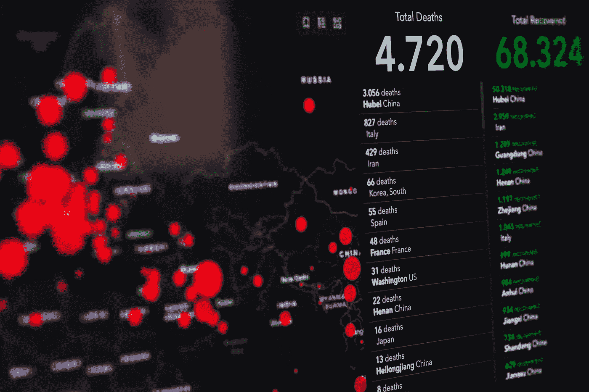
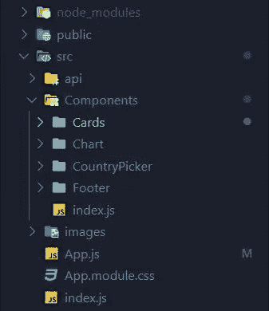

# 让我们使用 React.js 创建一个新冠肺炎跟踪器

> 原文：<https://towardsdatascience.com/lets-create-a-covid-19-tracker-using-react-js-5a3a0265a633?source=collection_archive---------14----------------------->

## 前端



照片由来自 [Pexels](https://www.pexels.com/photo/coronavirus-statistics-on-screen-3970330/?utm_content=attributionCopyText&utm_medium=referral&utm_source=pexels) 的 [Markus Spiske](https://www.pexels.com/@markusspiske?utm_content=attributionCopyText&utm_medium=referral&utm_source=pexels) 拍摄

因为封锁，现在世界上大多数人都呆在家里。你们大多数人都对长期呆在家里感到沮丧。因此，我们将制作一个新冠肺炎跟踪应用程序，并为我们创建一个跟踪应用程序而感到高兴。我们将从这个[链接](https://covid19.mathdro.id/api)获取数据。

当我滚动 Youtube 视频时，我发现了一个关于如何制作 Corona 病毒跟踪应用程序的教程。我看了那个视频，开始创建一个新冠肺炎追踪器，最后，我使用 React.js 创建了一个追踪器。我添加了一些比视频中显示的更多的功能。这里我将描述如何从头开始使用 React 应用程序创建一个跟踪应用程序。这是 React 应用程序的演示。这是我在 Medium 的第 30 篇文章。

# 重要的事情，首先

像往常一样，我们需要使用 create-react-app 创建一个 React 应用程序。要创建 React 应用程序，请在您的 shell/终端中的特定文件夹(例如，桌面)中运行以下命令

```
npx create-react-app covid-tracker
```

将创建一个新文件夹，并将其命名为 google-map。从这一步开始，我们的应用程序用 [Create React App](https://github.com/facebook/create-react-app) 引导。有关更多信息，请单击[链接](https://github.com/facebook/create-react-app)。然后在 IDE 中打开该项目。我使用的是 VS 代码集成开发环境。

删除 src 文件夹中的所有文件，并在 src 文件夹中创建 app.js 文件和 index.js 文件。

现在，在我们的 src 文件夹目录中，我们用以下代码创建一个 index.js 文件:

然后在 src 文件夹中创建 api 文件夹、Components 文件夹和 images 文件夹。然后在组件文件夹中创建 Cards 文件夹、Chart 文件夹、CountryPicker 文件夹和 index.js 文件。现在我们项目的文件夹结构应该如下所示:



有了这个项目结构，每个文件夹(Cards、Chart、CountryPicker)都将有自己的风格和自己的组件。

现在，我们需要安装所有必要的依赖项，以便在与 VSCode 或 IDE 集成的 shell/终端中运行以下命令。

```
npm install --save axios react-chartjs-2 react-countup classnames @material-ui/core
```

如果您在安装依赖项时遇到问题，请尝试

```
npm cache clean — force
```

在 Axios 的帮助下，我们将向 API 发出 get 请求。react-chartjs-2 '是制作图表的较好的库之一。“反应-计数”将帮助我们在计数的同时制作动画。classnames' 是一个在 React 中为我们提供条件类选择的库。“Material-UI”是世界上最流行的 React UI 框架，就像 bootstrap 一样。


照片由来自 [Pexels](https://www.pexels.com/photo/fit-runner-standing-on-racetrack-in-athletics-arena-3756165/?utm_content=attributionCopyText&utm_medium=referral&utm_source=pexels) 的[安德里亚·皮亚卡迪奥](https://www.pexels.com/@olly?utm_content=attributionCopyText&utm_medium=referral&utm_source=pexels)拍摄

# 取数据

我们需要从 [API](https://covid19.mathdro.id/api) 中获取数据。现在，在我们的 api 文件夹目录中，我们用以下代码创建一个 index.js 文件:

它加载负责 REST 调用的 Axios。如您所见，我们为 Chart、Cards 和 CountryPicker 打了 3 个不同的电话。

fetchData 函数用于根据全球或国家获取确认、恢复和死亡的详细信息，以及最后更新的时间。fetchData 函数帮助获取数据以在 Cards 组件中显示结果。

fetchDailyData 函数用于获取每日总死亡人数和总确认人数的详细信息以及相应的日期。不幸的是，我们现在无法获取全部恢复的详细信息(今天:2020 年 6 月 18 日)。fetchDailyData 函数帮助获取数据以在图表组件中显示结果。

fetchCountries 函数是将国家的简称与国家的名称进行映射。fetchCountries 函数帮助获取国家名称，以便在 CountryPicker 组件中显示结果。


照片由 [Lukas](https://www.pexels.com/@goumbik?utm_content=attributionCopyText&utm_medium=referral&utm_source=pexels) 从 [Pexels](https://www.pexels.com/photo/person-writing-on-notebook-669615/?utm_content=attributionCopyText&utm_medium=referral&utm_source=pexels) 拍摄

# 卡片组件

这个组件加载 4 张卡片:感染，恢复，死亡，活跃在网站的顶部。现在，我们将使用以下代码在 Cards 文件夹中创建 Cards.jsx 文件:

Cards 组件是一个返回 JSX 的纯功能组件。我通过从确诊病例中减去痊愈病例和死亡病例来计算活跃病例。没有样式就没有创建 Cards 组件的意义，因此，我们将使用以下代码在 Cards 文件夹中创建 Cards.module.css 文件:

@media 标签负责响应视图。

是的，我们完成了卡片部分！！


由 [Kaboompics 拍摄的照片。com](https://www.pexels.com/@kaboompics?utm_content=attributionCopyText&utm_medium=referral&utm_source=pexels) 来自 [Pexels](https://www.pexels.com/photo/hand-with-oil-pastel-draws-the-heart-6333/?utm_content=attributionCopyText&utm_medium=referral&utm_source=pexels)

# 图表组件

这将加载条形图和折线图:折线图显示全球数据，而条形图代表单个国家。现在，我们将使用以下代码在 Chart 文件夹中创建 Chart.jsx 文件:

图表组件是一个返回 JSX 的纯函数组件。没有样式就没有创建图表组件的意义，因此，我们将使用以下代码在 Chart 文件夹中创建 Chart.module.css 文件:


来自[派克斯](https://www.pexels.com/photo/photo-of-person-holding-mobile-phone-3183153/?utm_content=attributionCopyText&utm_medium=referral&utm_source=pexels)的[派克斯](https://www.pexels.com/@fauxels?utm_content=attributionCopyText&utm_medium=referral&utm_source=pexels)的照片

# CountryPicker 组件

下拉选择一个国家，基于所选国家显示一个条形图，并显示该特定国家的死亡、确认、活动和恢复详细信息的卡片。现在，我们将使用以下代码在 CountryPicker 文件夹中创建 CountryPicker.jsx 文件:

CountryPicker 组件是一个返回 JSX 的纯功能组件。没有样式就没有创建 CountryPicker 组件的意义，因此，我们将使用以下代码在 CountryPicker 文件夹中创建 CountryPicker.module.css 文件:


马丁·桑切斯在 [Unsplash](/s/photos/list-of-countries?utm_source=unsplash&utm_medium=referral&utm_content=creditCopyText) 上拍摄的照片

如果我们要在 App.js 中导入卡片、图表和 CountryPicker 组件，就像下面这样，只会使你的 App.js 变得混乱。

```
*import* Cards *from* "./Components/Cards/Cards";
*import* Chart *from* "./Components/Chart/Chart";
*import* CountryPicker *from* "./Components/CountryPicker/CountryPicker";
```

因此，我们需要使用一个简洁的小技巧。我们不需要像上面那样的进口。正如你所看到的，有很多重复的代码。我们花了很多时间来指定从哪里导入，从哪里导入。因此，我们可以有一个如下所示的导入文件。

```
*import* { Cards, Chart, CountryPicker } *from* “./Components”;
```

现在，我们将使用以下代码在 Components 文件夹中创建一个 index.js 文件:

# 应用程序组件

添加所有功能后，我们需要更新 App.js. App 组件负责将国家和数据一起发送到单个视图中，因此网站可以根据国家的选择动态改变是否显示条形图或折线图。现在，我们将以下代码添加到 src 文件夹中的 App.js 中。

在这里你可以下载[日冕图像](https://github.com/sabesansathananthan/covid-19-tracker/blob/master/src/images/image.png)并将其添加到我们在 src 文件夹中创建的 images 文件夹中。App Component 是一个类组件，具有异步 React 生命周期方法 componentDidMount。我们需要给 App.js 组件添加一些样式。因此，我们需要使用以下代码将 App.module.css 文件添加到 src 文件夹中:

嘣！！！我们的新冠肺炎跟踪应用程序已经准备好了。通过运行以下命令启动应用程序

```
npm start
```

# 结论

上述网站的特点是易于使用，有吸引力的用户界面，图表比文本更有说服力，实时数据，最后但并非最不重要的是，它是一个桌面和移动视图的响应网站。[新冠肺炎 API](https://github.com/mathdroid/covid-19-api) 将来自约翰·霍普斯金大学 CSSE 分校的数据作为 [JSON API](https://covid19.mathdro.id/api) 提供。您可以从这个[链接](https://github.com/sabesansathananthan/covid-19-tracker)中克隆回购。最后，我要感谢 JavaScript Mastery 的 YouTube 视频。

今天尝试一些新的东西。自我感觉良好。

编码快乐！