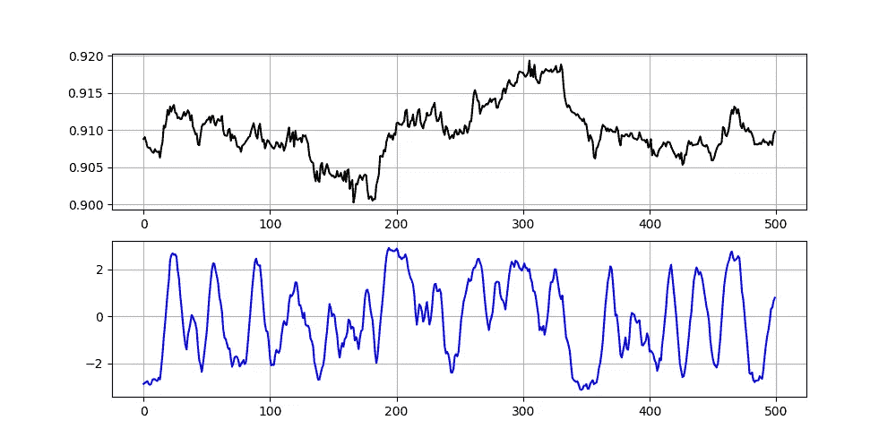
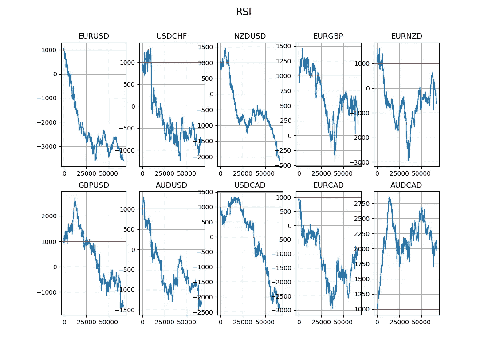

# 让我们为交易创建一个技术指标。

> 原文：<https://towardsdatascience.com/lets-create-a-technical-indicator-for-trading-83828343249d?source=collection_archive---------26----------------------->

## 如何开发自己的技术指标，如何回测。

***注来自《走向数据科学》的编辑:*** *虽然我们允许独立作者根据我们的* [*规则和指导方针*](/questions-96667b06af5) *发表文章，但我们不认可每个作者的贡献。你不应该在没有寻求专业建议的情况下依赖一个作者的作品。详见我们的* [*读者术语*](/readers-terms-b5d780a700a4) *。*

我刚刚出版了一本新书《Python 中的*新技术指标》。它对复杂的交易策略进行了更完整的描述和补充，Github 页面致力于不断更新代码。如果你对此感兴趣，请随时访问下面的链接，或者如果你喜欢购买 PDF 版本，你可以在 Linkedin 上联系我。*

*[](https://www.amazon.com/gp/product/B09919GQ22/ref=as_li_tl?ie=UTF8&camp=1789&creative=9325&creativeASIN=B09919GQ22&linkCode=as2&tag=sofien-20&linkId=bc5df3f6ab0f3af2df79641c56b949ba) [## 交易策略之书

### 亚马逊网站:交易策略之书(9798532885707): Kaabar，Sofien:书籍

www.amazon.com](https://www.amazon.com/gp/product/B09919GQ22/ref=as_li_tl?ie=UTF8&camp=1789&creative=9325&creativeASIN=B09919GQ22&linkCode=as2&tag=sofien-20&linkId=bc5df3f6ab0f3af2df79641c56b949ba)* 

*技术指标就在我们身边。许多是著名的，如相对实力指数和 MACD，而其他人不太了解，如相对活力指数和凯尔特纳渠道。这些指标是为了帮助交易而开发的，有时它们在某些市场状态下很有用。例如，当市场波动时，RSI 运行良好。技术指标当然不是盈利交易策略的主角。*

*我们的目的是看看我们是否能想出一个技术指标的想法，如果可以，我们如何想出它的公式。斗争不会就此停止，我们还必须回溯测试它的有效性，毕竟，我们可以很容易地开发任何公式，并说我们有一个指标，然后将其作为圣杯进行销售。*

*我们将尝试将新指标的回溯测试结果与 RSI 的结果进行比较，从而给出我们工作的相对视图。如果你想在开始之前看到更多与 RSI 相关的交易策略，这里有一篇文章从一个不同的有趣的角度展示了它:*

*[](https://medium.com/swlh/creating-a-trading-strategy-using-the-rsi-the-bollinger-bands-new-ideas-using-python-4115e1fdfbba) [## 使用 RSI 和布林线创建交易策略。使用 Python 的新想法。

### 绝大多数交易者使用著名的相对强弱指数来帮助他们做决定，虽然它…

medium.com](https://medium.com/swlh/creating-a-trading-strategy-using-the-rsi-the-bollinger-bands-new-ideas-using-python-4115e1fdfbba) 

# 头脑风暴&形成想法

创建指标的第一步是选择指标类型。是趋势跟踪指标吗？可能是逆势？它与时机或波动性有关吗？会是有界还是无限？

为了简化我们的信号生成过程，假设我们将选择一个反向指标。这意味着我们将尝试创建一个围绕循环值振荡的指标，该指标要么是稳定的，要么是几乎稳定的(尽管这个术语在统计学中不存在)。我最喜欢的方法之一是从取不同的值开始。这是向平稳性和了解随时间变化幅度的一个巨大飞跃。但是，为了使事情更有趣，我们不会从上一个值中减去当前值。由于我是斐波那契数列的粉丝，我们用当前值(即今天的收盘价或这个小时的收盘价)减去 8 个周期前的值怎么样？因此，该指标的第一步是一个简单的分布，可以用 delta(δ)作为分布的数学定义如下:


下一步可以结合权重调整或增加波动性指标，如平均真实范围或历史标准差。让我们坚持简单的方法，选择用我们的价差除以价格的滚动 8 期标准差。这给出了一个关于我们试图测量的动量力的波动调整。因此，我们将对收盘价进行滚动标准差计算；这将作为我们公式中的分母。记住，我们说过我们会用滚动标准差来除价差。让我们更新我们的数学公式。已知标准差的等式如下:


我们可以把 X 看作是我们目前得到的结果(正在构建的指标)。结果是价差除以标准差，如下所示:


现在要做的最后一件事是选择是否平滑我们的价值观。有时，我们可以从某些计算中得到波动和极端的值。幸运的是，我们可以使用移动平均来平滑这些值。因为我们想保持一致，我们做一个到目前为止的 8 期滚动平均值怎么样？这意味着我们将简单地计算 x 的移动平均值。

有关移动平均线的更多信息，请参考这篇展示如何对其进行编码的文章:

[](/how-to-code-different-types-of-moving-averages-in-python-4f8ed6d2416f) [## 如何用 Python 编写不同类型的移动平均线？

### 用 Python 编写不同类型的移动平均线。

towardsdatascience.com](/how-to-code-different-types-of-moving-averages-in-python-4f8ed6d2416f) 

现在，我们可以说我们已经有了一个可以被可视化、解释和回溯测试的指标。在此之前，假设我们有一个 OHLC 数组，让我们看看如何用 python 编写这个指示器。

```
for i in range(len(Asset)): # Calculating the spread
    Asset[i, 4] = Asset[i, 3] - Asset[i - 8, 3] # Calculating the Standard Deviation
    Asset[i, 5] = Asset[i - 8:i + 1, 3].std() # Volatility Adjustment of the spread
    Asset[i, 6] = Asset[i, 4] / Asset[i, 5] # Smoothing out and getting the indicator's values
    Asset[i, 7] = Asset[i - 7:i + 1, 6].mean()
```

# 可视化指标

视觉解读是良好指标的首要关键要素之一。下面是我们的指标和一些外汇对的对比。



该指标相对于欧元兑美元、瑞士法郎、GBPUSD 和澳元兑美元。

看起来我们可能能够获得 2.5 和-2.5 附近的信号(可以与 RSI 上的 70 和 30 水平相比)。因此，交易条件将是:

*   当指标达到-2.5 时买入。
*   当指标触及 2.5 时，卖出(做空)。
*   **尽管我们不会回测这个技术，但是看起来散度方法对这个指标也有效。**

现在，在所有的透明度，**这篇文章不是关于提出一个创新的新的盈利指标。**这只是一种思考和创建指标的教育方式。

> 在我们进行回溯测试之前，还有最后一件事。我们把这个指标命名为？我总是想给它起一个很酷的名字，比如**旋风**或**地狱犬**、，但我相信如果我们根据它的功能来命名，它会看起来更专业。因此，在最终平滑结果之前，该指标采用除以滚动标准差的差值。因此，一个合理的名称可以是**波动调整动量指标(VAMI)。**

# 回溯测试和比较

是时候找出我们所创造的真相了。回溯测试确保我们在正确的轨道上。为了比较，我们还将回测 RSI 的标准策略(触及 30 或 70 水平是否可以提供反转点或修正点)。请注意，两种策略的持有期都是 6 个周期。


触发表。

以下是在执行回测后给出的一些信号图示例。注意，绿色箭头是买入信号，而红色箭头是做空(卖出)信号。


VAMI 战略信号图。左边是澳元，右边是欧元兑美元。


RSI 策略的信号图。左边是澳元，右边是欧元兑美元。


10 种主要货币对的 VAMI 策略权益曲线。



10 种主要货币对的 RSI 策略的权益曲线。

从视觉上看，VAMI 优于 RSI，虽然这是个好消息，但这并不意味着 VAMI 是一个很好的指标，它只是意味着 RSI 在单独使用时一直让我们失望，然而，VAMI 似乎在澳元和欧元对上做得很好。下面详细介绍了绩效指标以及 RSI 策略中的绩效指标(更多详细信息，请参见本文开头的链接)。


两种策略的性能比较。

如果你也对更多的技术指标和使用 Python 创建策略感兴趣，那么我关于技术指标的畅销书可能会让你感兴趣:

[](https://www.amazon.com/gp/product/B08WZL1PNL/ref=as_li_tl?ie=UTF8&camp=1789&creative=9325&creativeASIN=B08WZL1PNL&linkCode=as2&tag=sofien-20&linkId=e3cb9716bb6a07cf6c8b9fb585412b07) [## Python 中的新技术指标

### 亚马逊网站:Python 中的新技术指标:9798711128861: Kaabar，Sofien 先生:书籍

www.amazon.com](https://www.amazon.com/gp/product/B08WZL1PNL/ref=as_li_tl?ie=UTF8&camp=1789&creative=9325&creativeASIN=B08WZL1PNL&linkCode=as2&tag=sofien-20&linkId=e3cb9716bb6a07cf6c8b9fb585412b07) 

另外，**期望值**是一个灵活的衡量标准，由平均赢/输和命中率组成。它提供了按命中率加权的美元数字的预期利润或损失。胜率就是我们在下面的公式中提到的命中率，通过它，损失率就是 1——命中率。


# 结论

为什么写这篇文章？如上所述，这不是为了找到一个有利可图的技术指标，也不是为了向公众展示一个新的技术指标。这是一个相当简单的方法，可以考虑在某一天创建一个可以为你的整体框架增值的指标。在我们的例子中，我们发现 VAMI 比 RSI 表现得更好，并且具有大约相同数量的信号。这个指标显然值得尝试优化。创造了 VAMI 之后，我相信我会在未来对如何提取更好的信号做更多的研究。


[https://pix abay . com/photos/chart-trading-forex-analysis-840331/](https://pixabay.com/photos/chart-trading-forex-analysis-840331/)*