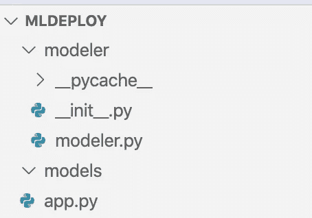
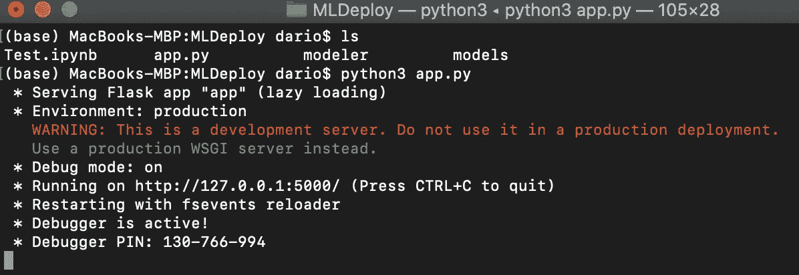

# 让我们部署一个机器学习模型

> 原文：<https://towardsdatascience.com/lets-deploy-a-machine-learning-model-be6057f2d304?source=collection_archive---------18----------------------->

## 如何在生产中使用机器学习模型

数据科学太酷了，不能留在笔记本里。我们需要某种方法使模型对 web 应用程序有用，但是我们如何做到这一点呢？今天我们将训练一个简单的机器学习模型，并用 *Flask* 进行部署，然后用 Python 的*请求*库进行预测。


在 [Unsplash](https://unsplash.com?utm_source=medium&utm_medium=referral) 上[paweczerwiński](https://unsplash.com/@pawel_czerwinski?utm_source=medium&utm_medium=referral)拍摄的照片

如果你更喜欢视频，或者只是想巩固你的知识，请随意观看我们关于这个主题的视频。[源代码](https://github.com/betterdatascience/YouTube/tree/master/0002_MLDeploy)包含在内:

*我为什么要关心部署？*好问题。让我用另一个问题来回答它:如果你不打算使用它，你的模型的目的是什么？或者至少让别人用？想不出任何理由？很好，我也是。

*什么是烧瓶？* Flask 是一个开发 web 应用的微框架。我们不会为此使用它，但是我们将使用 *Flask-RESTful* 来公开我们模型的某些功能。

好吧，但是什么是请求呢？这只是另一个与 REST APIs 通信的简单库。

*呃，什么是 REST API？REST 或表述性状态转移——无论哪个对您来说更自然——是一组用于创建 web 服务的样式和约束。一旦 Restful API 上线，我们就可以用特定的参数向特定的端点发出请求——这就是你现在应该知道的。这样做将执行一些后端逻辑——在我们的例子中是进行预测。*

下面是目录结构(可以随意调整):



根目录叫做 *mldeploy* ，里面我们多了两个文件夹: *modeler* 和 *models* 。第一个包含 *modeler.py* 文件(Python 创建了另外两个)，后者将包含一个保存的模型，一旦我们完成训练。

最后， *app.py* 将所有的东西绑在一起，并使用 *Flask* 和 *Flask-RESTful* 来暴露预测部分。

现在让我们做一个愚蠢的简单分类器。

# 制作分类器

我们将使用著名的[虹膜数据集](https://raw.githubusercontent.com/uiuc-cse/data-fa14/gh-pages/data/iris.csv) ，因为对于这个例子，我们不能不关心任务的机器学习部分。我们只对模型如何部署感兴趣，而不是如何构建。

以下是进口货:

```
import os
import joblib
import pandas as pd
from sklearn.tree import DecisionTreeClassifier
```

Joblib 可能是这里唯一的未知数。简而言之，我们可以用它来保存和加载机器学习模型。

接下来，我们编写了一个用于模型加载、训练、保存和预测的类。这里不涉及数据准备，所以一切都归结为几行代码:

```
class Modeler:
    def __init__(self):
        self.df = pd.read_csv(‘https://raw.githubusercontent.com/uiuc-cse/data-fa14/gh-pages/data/iris.csv')
        try: self.model = joblib.load(‘models/iris.model’)
        except: self.model = None def fit(self):
        X = self.df.drop(‘species’, axis=1)
        y = self.df[‘species’]
        self.model = DecisionTreeClassifier().fit(X, y)
        joblib.dump(self.model, ‘models/iris.model’) def predict(self, measurement):
        if not os.path.isfile(‘models/iris.model’):
            raise Exception(‘Model not trained yet. Call .fit() before making predictions.’)
        if len(measurement) != 4:
            raise Exception(f’Expected sepal_length, sepal_width, petal_length, petal_width, got {measurement}’) prediction = self.model.predict([measurement])
        return prediction[0]
```

以上就是 *modeler.py* 的全部内容。我们将在下一节开发 API 本身。

# REST API

我们现在可以开始部署部分了。让我们打开 *app.py* ，执行几个导入操作:

```
import os
import joblib
from flask import Flask, jsonify, request
from flask_restful import Api, Resource
from modeler.modeler import Modeler
```

我们还将在这里使用 *Joblib* ，但是这次是为了加载训练好的模型。在底部，我们正在导入之前编写的 *Modeler* 类。现在让我们做一些*烧瓶*内务处理:

```
app = Flask(__name__)
api = Api(app)
```

*Flask-RESTful* 的构造方式是每个端点都应该在自己的类中。在内部，我们声明了与最终用户发出的请求类型相对应的函数——最流行的是 GET 和 POST。

本例中使用了 POST，一旦发出请求，我们将获取用户提供的数据。需要 4 个值:*萼片长度、萼片宽度、花瓣长度*和*花瓣宽度*，对应于我们数据集的特征。

然后创建一个 *Modeler* 类的实例，用提到的输入数据调用 *predict()* 函数。最后，返回预测的 JSON 表示。

*听起来很简单吧？*因为是。代码如下:

```
class Predict(Resource):
    @staticmethod
    def post():
        data = request.get_json()
        sepal_length = data[‘sepal_length’]
        sepal_width = data[‘sepal_width’]
        petal_length = data[‘petal_length’]
        petal_width = data[‘petal_width’] m = Modeler()
        if not os.path.isfile(‘models/iris.model’):
            m.fit() prediction = m.predict([sepal_length, sepal_width, petal_length, petal_width]) return jsonify({
            ‘Input’: {
                ‘SepalLength’: sepal_width,
                ‘SepalWidth’: sepal_width,
                ‘PetalLength’: petal_length,
                ‘PetalWidth’: petal_width
            },
            ‘Class’: prediction
        })
```

现在我们需要做更多的 *Flask* 内务处理，这实际上是将 *Predict* 类连接到一个端点——应该由 */predict* 来完成:

```
api.add_resource(Predict, ‘/predict’)
```

代码方面的最后一件事是使 *app.py* 可执行:

```
if __name__ == ‘__main__’:
    app.run(debug=True)
```

接下来，我们可以测试是否一切都像宣传的那样工作。

# 做预测

先运行 *app.py* 吧。在“终端”中打开根文件夹，然后键入:

```
python3 app.py
```

或者，如果您使用的是 Windows，则不带“3 ”:



API 现在运行在 [http://127.0.0.1:5000/上。为了测试它是否正常工作，我们将使用笔记本——它们比代码编辑器更具交互性。](http://127.0.0.1:5000/.)

我们需要*请求*库:

```
import requests
```

从这里我们可以向 */predict* 端点发出 POST 请求，请求值为*萼片长度*、*萼片宽度、花瓣长度、*和*花瓣宽度*。这很容易做到:

```
res = requests.post(
    url=’[http://localhost:5000/predict'](http://localhost:5000/predict'),
    json={
        ‘sepal_length’: 5.0,
        ‘sepal_width’: 3.2,
        ‘petal_length’: 1.5,
        ‘petal_width’: 0.3
    }
)
```

酷毙了。我们可以检查 *res* 变量中的内容:

```
res**>>> <Response [200]>**
```

状态代码 200 表示一切正常，我们准备好提取预测了。对 *res.json()* 的调用完成了这个任务:

```
res.json()**>>> {‘Class’: ‘setosa’,
     ‘Input’: {‘PetalLength’: 1.5,
      ‘PetalWidth’: 0.3,
      ‘SepalLength’: 3.2,
      ‘SepalWidth’: 3.2}}**
```

就是这样！你必须承认——这比你想象的要容易。

# 最后的话

现在你知道如何采用任何机器学习模型并部署它。当然，我们在本地主机上做了所有的事情，但是在您的生产环境中，唯一会改变的主要部分是 URL。

所以它不会是[http://127 . 0 . 0 . 1:5000/predict，](http://127.0.0.1/predict,)而是类似于[http://your _ URL:port/predict。](http://your_url:port/predict.)

这个模型现在已经可以在某种应用程序中使用了，希望通过一个漂亮的 GUI。比留在笔记本里好多了。

感谢阅读。

*喜欢这篇文章吗？成为* [*中等会员*](https://medium.com/@radecicdario/membership) *继续无限制学习。如果你使用下面的链接，我会收到你的一部分会员费，不需要你额外付费。*

[](https://medium.com/@radecicdario/membership) [## 通过我的推荐链接加入 Medium-Dario rade ci

### 作为一个媒体会员，你的会员费的一部分会给你阅读的作家，你可以完全接触到每一个故事…

medium.com](https://medium.com/@radecicdario/membership)